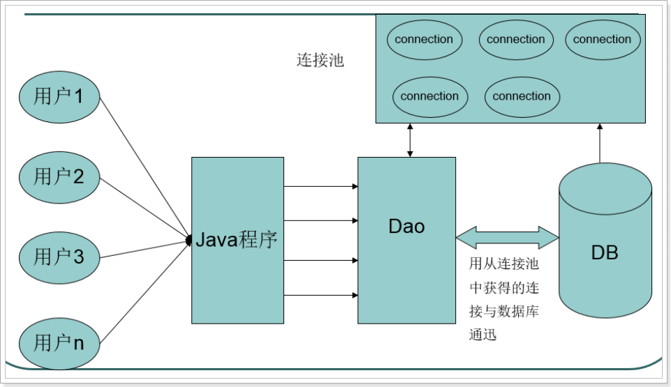
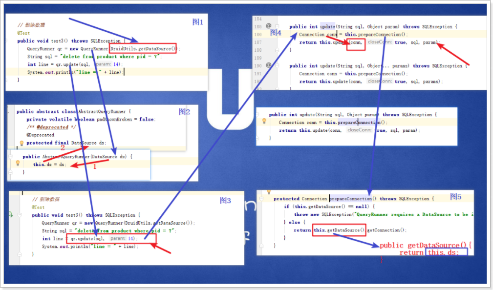
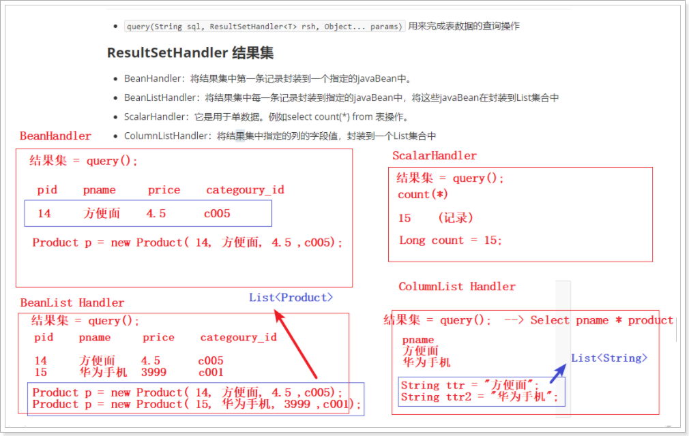
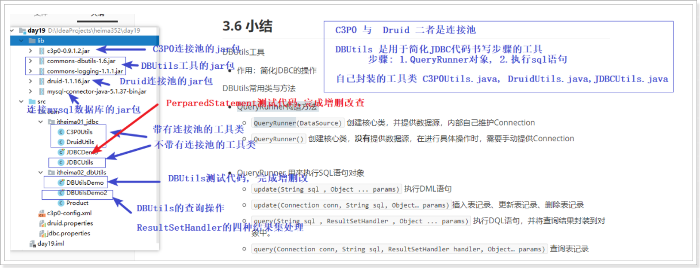

# 第一章 连接池

## 1 连接池概述

#### 为什么要使用连接池

目的：为了解决建立数据库连接耗费资源和时间很多的问题，提高性能。

Connection对象在JDBC使用的时候就会去创建一个对象,使用结束以后就会将这个对象给销毁了(close).每次创建和销毁对象都是耗时操作.需要使用连接池对其进行优化.

程序初始化的时候，初始化多个连接,将多个连接放入到池(集合)中.每次获取的时候,都可以直接从连接池中进行获取.使用结束以后,将连接归还到池中.

#### 生活里面的连接池例子

- 老方式:

  下了地铁需要骑车, 跑去生产一个, 然后骑完之后,直接把车销毁了.

- 连接池方式 摩拜单车:

  骑之前, 有一个公司生产了很多的自行车, 下了地铁需要骑车, 直接扫码使用就好了, 然后骑完之后, 还回去

  


#### 连接池原理【重点】



1. 程序一开始就创建一定数量的连接，放在一个容器中，这个容器称为连接池(相当于碗柜/容器)。
2. 使用的时候直接从连接池中取一个已经创建好的连接对象。
3. 关闭的时候不是真正关闭连接，而是将连接对象再次放回到连接池中。

## 2 编写标准的数据源(规范)

Java为数据库连接池提供了公共的接口：**javax.sql.DataSource**，各个厂商需要让自己的连接池实现这个接口。这样应用程序可以方便的切换不同厂商的连接池！

常见的第三方连接池如下:

- C3P0是一个开源的JDBC连接池，它实现了数据源和JNDI绑定，支持JDBC3规范和JDBC2的标准扩展。C3P0是异步操作的，所以一些操作时间过长的JDBC通过其它的辅助线程完成。目前使用它的开源项目有Hibernate，Spring等。C3P0有自动回收空闲连接功能
- 阿里巴巴-德鲁伊druid连接池：Druid是阿里巴巴开源平台上的一个项目，整个项目由数据库连接池、插件框架和SQL解析器组成。该项目主要是为了扩展JDBC的一些限制，可以让程序员实现一些特殊的需求。
- DBCP(DataBase Connection Pool)数据库连接池，是Apache上的一个Java连接池项目，也是Tomcat使用的连接池组件。dbcp没有自动回收空闲连接的功能。

## 3 C3P0连接池

C3P0开源免费的连接池！目前使用它的开源项目有：Spring、Hibernate等。使用C3P0连接池需要导入jar包，c3p0使用时还需要添加配置文件“c3p0-config.xml” 

### C3P0连接池工具类编写

**使用步骤**

1. 导入c3p0-0.9.1.2.jar
2. 拷贝配置文件到src目录
3. 创建连接池(配置文件自动读取的)


- 编写配置文件 c3p0-config.xml

```xml
<c3p0-config>
    <!-- 使用默认的配置读取连接池对象 -->
    <default-config>
        <!--  连接参数 -->
        <property name="driverClass">com.mysql.jdbc.Driver</property>
        <property name="jdbcUrl">jdbc:mysql://localhost:3306/day19</property>
        <property name="user">root</property>
        <property name="password">root</property>
        <!-- 连接池参数 -->
        <property name="initialPoolSize">5</property>
    </default-config>
</c3p0-config>
```

**c3p0连接池常用的配置参数：**

| 参数            | 说明             |
| --------------- | ---------------- |
| initialPoolSize | 初始连接数       |
| maxPoolSize     | 最大连接数       |
| checkoutTimeout | 最大等待时间     |
| maxIdleTime     | 最大空闲回收时间 |

`初始连接数`：刚创建好连接池的时候准备的连接数量
`最大连接数`：连接池中最多可以放多少个连接
`最大等待时间`：连接池中没有连接时最长等待时间
`最大空闲回收时间`：连接池中的空闲连接多久没有使用就会回收

**编写Java代码**

```java
/**
 * C3P0连接池的工具类
 *
 */
public class C3P0Utils {
    //1. 创建一个C3P0的连接池对象（会自动读取src目录下的c3p0-config.xml,所以不需要我们解析配置文件）
    public static DataSource ds = new ComboPooledDataSource();

    //2. 提供 从连接池中 获取连接对象的方法
    public static Connection getConnection() throws SQLException {
        Connection conn = ds.getConnection();
        return conn;
    }

    //3. 提供 获得数据源(连接池对象)的方法
    public static DataSource getDataSource(){
        return ds;
    }
}
```


## 4 Druid 连接池

Druid是阿里巴巴开发的号称为监控而生的数据库连接池，Druid是国内目前最好的数据库连接池。在功能、性能、扩展性方面，都超过其他数据库连接池。Druid已经在阿里巴巴部署了超过600个应用，经过一年多生产环境大规模部署的严苛考验。如：一年一度的双十一活动，每年春运的抢火车票。

Druid的下载地址：<https://github.com/alibaba/druid>

DRUID连接池使用的jar包：`druid-1.1.16.jar`

### Druid连接池工具类编写

步骤:

1. 导入DRUID jar 包
2. 拷贝配置文件到src目录
3. 根据配置文件 创建连接池对象
4. 从连接池对象获得连接

实现:

**创建druid.properties, 放在src目录下**

```
driverClassName=com.mysql.jdbc.Driver
url=jdbc:mysql://localhost:3306/day19
username=root
password=root
```

**编写Java代码**

```java
/**
 * 阿里巴巴的连接池 Druid 工具类
 */
public class DruidUtils {
    /*
    1. 加载 druid.properties 配置文件
    2. 创建 Druid 连接池对象
    3. 提供 获得 连接池对象的方法
    4. 提供 从连接池中 获取连接对象Connection的 方法
    */

    public static DataSource ds = null;

    static {
        try {
            //1. 加载 druid.properties 配置文件
            InputStream is = DruidUtils.class.getClassLoader().getResourceAsStream("druid.properties");
            Properties prop = new Properties();
            prop.load(is);
            //2. 创建 Druid 连接池对象
           ds = DruidDataSourceFactory.createDataSource(prop);
        } catch (Exception e) {
            e.printStackTrace();
        }
    }

    /*
    3. 提供 获得 连接池对象的方法
     */
    public static DataSource getDataSource(){
        return ds;
    }

    /*
    4. 提供 从连接池中 获取连接对象Connection的 方法
     */
    public static Connection getConnetion() throws SQLException {
        Connection conn = ds.getConnection();
        return  conn;
    }
}
```

# 第二章 DBUtils

如果只使用JDBC进行开发，我们会发现冗余代码过多，为了简化JDBC开发，本案例我们讲采用apache commons组件一个成员：DBUtils。

DBUtils就是JDBC的简化开发工具包。需要项目导入`commons-dbutils-1.6.jar`才能够正常使用DBUtils工具。

## 1 概述

DBUtils是java编程中的数据库操作实用工具，小巧简单实用。DBUtils封装了对JDBC的操作，简化了JDBC操作，可以少写代码。

Dbutils三个核心功能介绍

- QueryRunner中提供对sql语句操作的API.
- ResultSetHandler接口，用于定义select操作后，怎样封装结果集.
- DbUtils类，它就是一个工具类,定义了关闭资源与事务处理的方法

## 2 准备数据

- 创建表：

```sql
create table product(
    pid int primary key,
    pname varchar(20),
    price double,
    category_id varchar(32)
);
```

- 插入表记录

```sql
INSERT INTO product(pid,pname,price,category_id) VALUES(1,'联想',5000,'c001');
INSERT INTO product(pid,pname,price,category_id) VALUES(2,'海尔',3000,'c001');
INSERT INTO product(pid,pname,price,category_id) VALUES(3,'雷神',5000,'c001');

INSERT INTO product(pid,pname,price,category_id) VALUES(4,'JACK JONES',800,'c002');
INSERT INTO product(pid,pname,price,category_id) VALUES(5,'真维斯',200,'c002');
INSERT INTO product(pid,pname,price,category_id) VALUES(6,'花花公子',440,'c002');
INSERT INTO product(pid,pname,price,category_id) VALUES(7,'劲霸',2000,'c002');

INSERT INTO product(pid,pname,price,category_id) VALUES(8,'香奈儿',800,'c003');
INSERT INTO product(pid,pname,price,category_id) VALUES(9,'相宜本草',200,'c003');
INSERT INTO product(pid,pname,price,category_id) VALUES(10,'面霸',5,'c003');

INSERT INTO product(pid,pname,price,category_id) VALUES(11,'好想你枣',56,'c004');
INSERT INTO product(pid,pname,price,category_id) VALUES(12,'香飘飘奶茶',1,'c005');

INSERT INTO product(pid,pname,price,category_id) VALUES(13,'果9',1,NULL);
```

## 3 QueryRunner核心类介绍

### 提供数据源

- 构造方法
  - `QueryRunner(DataSource)` 创建核心类，并提供数据源，内部自己维护Connection
- 普通方法
  - `update(String sql , Object ... params)` 执行DML语句
  - `query(String sql , ResultSetHandler , Object ... params)` 执行DQL语句，并将查询结果封装到对象中。

### 提供连接

- 构造方法
  - `QueryRunner()` 创建核心类，**没有**提供数据源，在进行具体操作时，需要手动提供Connection
- 普通方法
  - `update(Connection conn , String sql , Object ... params)` 使用提供的Connection，完成DML语句
  - `query(Connection conn , String sql , ResultSetHandler , Object ... params)` 使用提供的Connection，执行DQL语句，并将查询结果封装到对象中。

## 4 QueryRunner实现添加、更新、删除操作

- `update(String sql, Object... params)` 用来完成表数据的增加、删除、更新操作

### 添加

```sql
    // 插入数据
    @Test
    public void test1() throws SQLException {
        //1. 获取 QueryRunnr对象, 这个用于执行 Sql语句
        QueryRunner qr = new QueryRunner(DruidUtils.getDataSource());
        //2. 执行sql代码
        String sql = "insert into product values(?,?,?,?)";
        int line = qr.update(sql, 14, "康师傅方便面", 5, "c005");
        //3. 处理查询结果数据 ( 如果是插入, 更新, 删除操作 没有必要做 步骤3)
        System.out.println("line = " + line);
    }
```

### 更新

```sql
    // 更新数据
    @Test
    public void test2() throws SQLException {
        //1. 获取 QueryRunnr对象, 这个用于执行 Sql语句
        QueryRunner qr = new QueryRunner(C3P0Utils.getDataSource());
        //2. 执行sql代码
        String sql = "update product set pname=? , price=? where pid=?";
        int line = qr.update(sql, "统一方便面", 4.5, 14);
        //3. 处理查询结果数据 ( 如果是插入, 更新, 删除操作 没有必要做 步骤3)
        System.out.println("line = " + line);

    }
```

### 删除

```sql
    // 删除数据
    @Test
    public void test3() throws SQLException {
        QueryRunner qr = new QueryRunner(DruidUtils.getDataSource());
        String sql = "delete from product where pid = ?";
        int line = qr.update(sql, 14);
        System.out.println("line = " + line);
    }
```



## 5 QueryRunner实现查询操作

- `query(String sql, ResultSetHandler<T> rsh, Object... params)` 用来完成表数据的查询操作

### ResultSetHandler 结果集

- BeanHandler：将结果集中第一条记录封装到一个指定的javaBean中。
- BeanListHandler：将结果集中每一条记录封装到指定的javaBean中，将这些javaBean在封装到List集合中
- ScalarHandler：它是用于单数据。例如select count(*) from 表操作。
- ColumnListHandler：将结果集中指定的列的字段值，封装到一个List集合中



#### JavaBean

JavaBean就是一个类，在开发中常用语封装数据。具有如下特性

1. 需要实现接口：java.io.Serializable ，通常实现接口这步骤省略了，不会影响程序。
2. 提供私有字段：private 类型 字段名;
3. 提供getter/setter方法：
4. 提供无参构造

```java
public class Product {
    
    private int pid;
    private String pname;
    private Double price;
    private String category_id;

    //省略 getter和setter方法
}
```

#### BeanHandler

```java
/*
 * 查询数据表结果集处理其中一种方式:
 * BeanHandler处理方式
 *     将数据表的结果集第一行数据,封装成JavaBean类的对象
 * 构造方法:
 *     BeanHandler(Class<T> type) 
 *     传递一个Class类型对象,将结果封装到哪个类的对象呢
 *     ZhangWu类的Class对象
 */
@Test
public void demo01() throws SQLException{
    // 通过id查询详情，将查询结果封装到JavaBean product
    
    //1核心类 
    QueryRunner queryRunner = new QueryRunner(C3P0Utils.getDataSource());
    //2 sql语句
    String sql = "select * from product where pid = ?";
    //3 实际参数
    Object[] params = {6};
    //4 查询并封装
    Product product = queryRunner.query(sql, new BeanHandler<Product>(Product.class), params);
    
    System.out.println(product);
}
```

#### BeanListHandler

```java
/*
 * 查询数据表结果集处理其中一种方式:
 * BeanListHandler处理方式
 *     将数据表的每一行数据,封装成JavaBean类对象
 *     多行数据了,多个JavaBean对象,存储List集合
 */
@Test 
public void demo02() throws SQLException{
    //查询所有，将每一条记录封装到一个JavaBean，然后将JavaBean添加到List中，最后返回List，BeanListHandler
    QueryRunner queryRunner = new QueryRunner(C3P0Utils.getDataSource());
    String sql = "select * from product";
    Object[] params = {};
    List<Product> list = queryRunner.query(sql, new BeanListHandler<Product>(Product.class), params);
    
    for(Product product : list){
        System.out.println(product);
    }
}
```

#### ScalarHander

```java
/*
 * 查询数据表结果集处理其中一种方式:
 * ScalarHandler处理方式
 *     处理单值查询结果,执行的select语句后,结果集只有1个
 */
@Test 
public void demo03() throws SQLException{
    // ScalarHandler : 用于处理聚合函数执行结果(一行一列)
    // * 查询总记录数
    QueryRunner queryRunner = new QueryRunner(C3P0Utils.getDataSource());
    String sql = "select count(*) from product";
    
    Long obj = queryRunner.query(sql, new ScalarHandler<Long>());
    
    //System.out.println(obj.getClass());
    System.out.println(obj);
    
}
```

#### ColumnListHandler

```java
/*
* 查询数据表结果集处理其中一种方式:
* ColumnListHandler处理方式
*     将查询数据表结果集中的某一列数据,存储到List集合
*     哪个列不清楚,数据类型也不清楚, List<Object>
* ColumnListHandler构造方法
*     空参数: 获取就是数据表的第一列
*     int参数: 传递列的顺序编号
*     String参数: 传递列名
*    
*  创建对象,可以加入泛型,但是加入的数据类型,要和查询的列类型一致
*/
@Test 
public void demo04() throws SQLException{
    // ColumnListHandler ： 查询指定一列数据
    QueryRunner queryRunner = new QueryRunner(C3P0Utils.getDataSource());
    String sql = "select * from product";
    List<String> list = queryRunner.query(sql, new ColumnListHandler<String>("pname"));

    System.out.println(list);
}
```

## 6 小结



DBUtils工具

- 作用：简化JDBC的操作

DBUtils常用类与方法

- QueryRunner构造方法

  - `QueryRunner(DataSource)` 创建核心类，并提供数据源，内部自己维护Connection

  - `QueryRunner()` 创建核心类，**没有**提供数据源，在进行具体操作时，需要手动提供Connection

  

- QueryRunner 用来执行SQL语句对象

  - `update(String sql , Object ... params)` 执行DML语句
  - `update(Connection conn, String sql, Object… params)`插入表记录、更新表记录、删除表记录
  - `query(String sql , ResultSetHandler , Object ... params)` 执行DQL语句，并将查询结果封装到对象中。
  - `query(Connection conn, String sql, ResultSetHandler handler, Object… params)` 查询表记录

  

- ResultSetHandler 处理结果集的对象

  - BeanHandler：将结果集中第一条记录封装到一个指定的javaBean中。
    - `BeanHandler<Product>(Product.class) --> Proudct`
  - BeanListHandler：将结果集中每一条记录封装到指定的javaBean中，将这些javaBean在封装到List集合中
    - `BeanListHandler<Product>(Product.class) --> List<Product>`
  - ScalarHandler：它是用于单数据。例如select count(*) from 表操作。
    - `ScalarHandler<Long>() --> Long`
  - ColumnListHandler：将结果集中指定的列的字段值，封装到一个List集合中
    - `ColumnListHandler<String>("pname") --> List<String>`

