# 第三章 事务 

## 1 事务

一组sql语句（insert、update、delete），全部成功整体才算成功，一个失败整体也算失败。

举例： 转账 a给b转账100元，a 和 b的账户中都有1000元， 转账完成后会是什么结果？


使用sql语句描述上述过程：

准备工作：

财务表 t_account , 里面有 姓名列 name 和 余额列 money。 a=1000， b=1000

 

正常情况下：

```sql
update t_account set money = money -100 where name='a';
update t_account set money = money +100 where name='b';

结果： a=900; b=1100
```


异常情况下：

```sql
update t_account set money = money -100 where name='a';

发生异常；

update t_account set money = money +100 where name='b';


结果： a=900； b=1000
```


 

思考： 这种结果合理吗？如果在你的身上发生这样的事 你可以容忍吗？ 

​	如果出现了异常，怎么才算是合理的结果呢？ 

​	是不是两个操作 要么全成功，要么全失败？

事务的出现 解决上面的问题。 特点：要么全成功，要么全失败。

 

事务是如何处理异常情况的呢？

```sql
开启事务 (针对一组sql) a=1000 b=1000

update t_account set money = money -100 where name='a';	-- a=900；

发生异常； 进行事务管理 -- 事务回滚 -- 撤销修改操作： -- a=1000；

update t_account set money = money +100 where name='b';

结果： a=1000  b=1000
```


事务是如何处理正常情况的呢？

```sql
开启事务

update t_account set money = money -100 where name='a';	a=900；

update t_account set money = money +100 where name='b';   b=1100

提交事务，使更改的内容生效。

 

结果：a=900 		b=1100
```


 

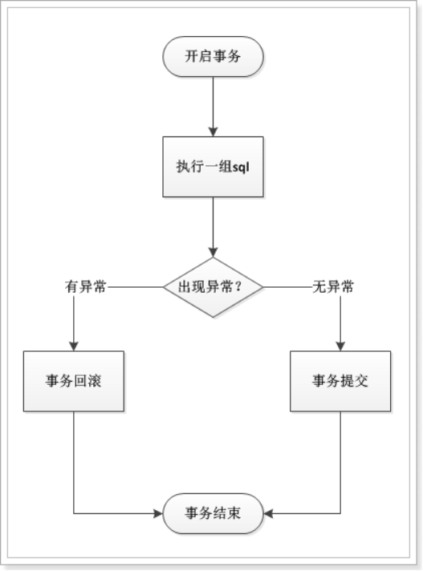 .

简单总结：

| 开启事务                  |                           |
| ------------------------- | ------------------------- |
| 执行sql语句群             |                           |
| 出现异常 回滚事务（撤销） | 一切正常 事务提交（生效） |

 

## 2. Mysql中的事务管理

mysql 的事务 默认 自动打开，自动提交。 一条sql就是一个事务，所以不需要 事务开启、事务回滚、事务提交。

| 开启事务： start transaction;               |                                          |
| ------------------------------------------- | ---------------------------------------- |
| 执行sql语句群                               |                                          |
| 出现异常 事务回滚（撤销）事务结束 rollback; | 无异常 事务提交（生效） 事务结束 commit; |

```
start transaction;  --- 开启事务。以后的sql都在一个事务中。更改的内容不会自动提交。

rollback;  --- 回滚事务，都失败的情况。事务结束，全部失败，数据恢复到事务未开启之前的状态。

commit; --- 提交事务，都成功的情况。事务结束，全部成功。
```


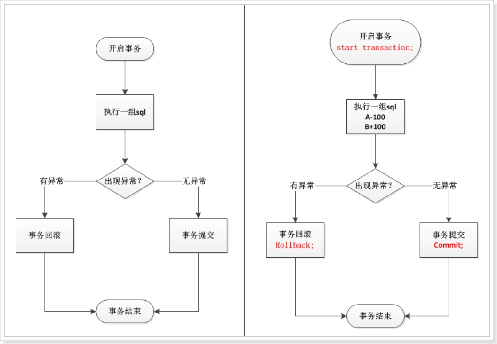 

 

 

准备工作：

```sql
create table account(
	name varchar(32),
	money int
);

insert into account values('a', 1000);
insert into account values('b', 1000);
```

-- 需求1：演示事务回滚 

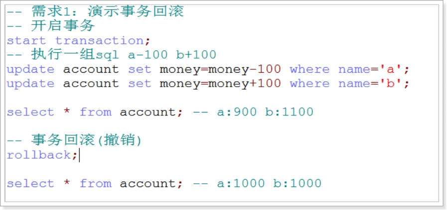 

 

需求2：演示事务提交 

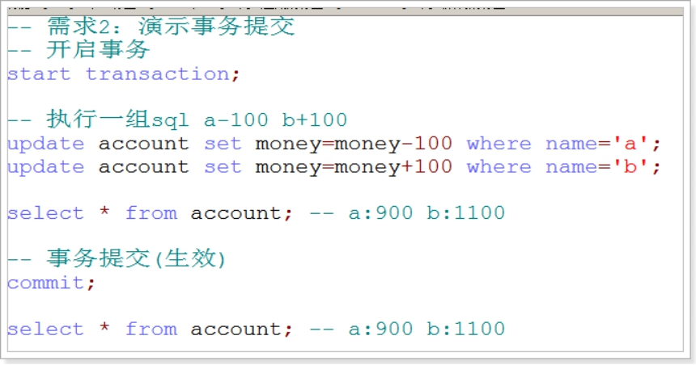  

## 3 事务的特性 ACID  (理解)

事务是并发控制的基本单元。所谓事务一个sql语句操作序列，这些操作要么都执行，要么都不执行，他是一个不可分割的工作单元。

例如：银行转账工作，从一个帐号扣款并使另一个帐号增款，这个两个操作，要么都执行，要么都不执行。

数据库的事务必须具备ACID特性，ACID是指 Atomic（原子性）、Consistensy（一致性）、Isolation（隔离型）和Durability（持久性）的英文缩写。

 

**1、原子性（Atomicity）** 

一个事务中所有操作，要么全部完成，要么全部不完成，不会结束在中间某个环节。事务在执行过程中如果发生错误，会被回滚到事务开始前的状态，就像这个事务从来没有执行一样。

**2、一致性（Consistency）**

一个事务在执行之前和执行之后 数据库都必须处于一致性状态。

如果事务成功的完成，那么数据库的所有变化将生效。

如果事务执行出现错误，那么数据库的所有变化将会被回滚（撤销），返回到原始状态。

**3、持久性：**

指一个事务一旦被提交，它对数据库的改变将是永久性的，接下来即使数据库发生故障也不会对数据产生影响。

**4、隔离性（Isolation）**

多个用户并发的访问数据库时，一个用户的事务不能被其他用户的事务干扰，多个并发的事务之间要相互隔离。

多个事务事件是相互独立的，多个事务事件不能相互干扰。


## 4 隔离问题

如果不考虑事务的隔离型，由于事务的并发，将会出现以下问题：

1、脏读 -- 最严重，杜绝发生

2、不可重复读

3、幻读（虚读）

### 4.1 **脏读：指一个事务读取了另外一个事务** 未提交的数据

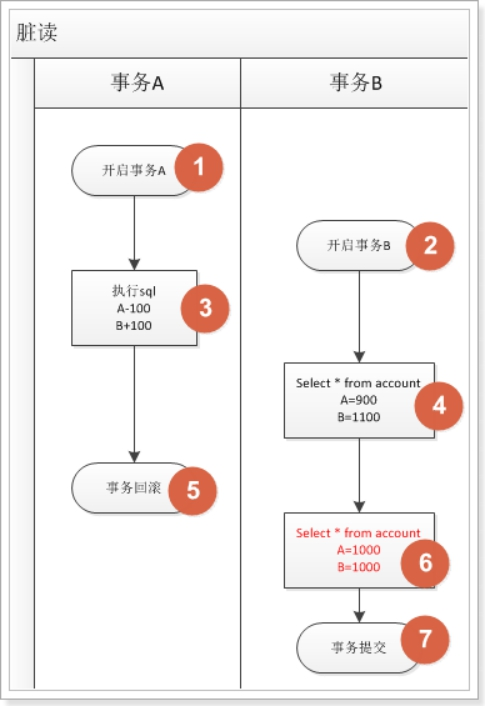 .

假设A向B转账100元，对应的sql语句如下：

开启事务
	update account set money=money-100 where name='a';
	update account set money=money+100 where nam='b';

两条sql语句执行完，b查询自己的账户多了100元。

b走后,a将事务进行回滚，这样B就损失了100元。

 

一个事务读取了另一个事务没有提交的数据，非常严重。应当尽量避免脏读。

 

### 4.2 **不可重复读：在一个事务内多次读取表中的数据，多次读取的结果不同。**

和脏读的区别： 不可重复读是读取的已提交数据

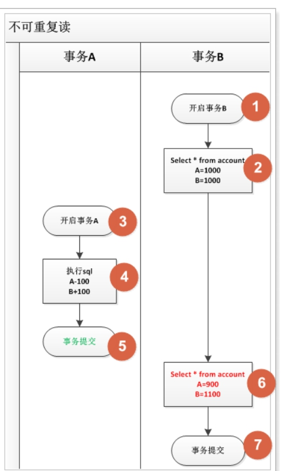 

l 例如: 银行想查询A账户的余额，第一次查询的结果是200元，A向账户中又存了100元。此时，银行再次查询的结果变成了300元。两次查询的结果不一致，银行就会很困惑，以哪次为准。

 

l 和脏读不同的是：脏读读取的是前一事务未提交的数据，不可重复度 读取的是前一事务已提交的事务。

 

l 很多人认为这有啥好困惑的，肯定是以后面的结果为准了。我们需要考虑这样一种情况，查询A账户的余额，一个打印到控制台，一个输出到硬盘上，同一个事务中只是顺序不同，两次查询结果不一致，到底以哪个为准，你会不会困惑呢？

 

当前事务查询A账户的余额为100元，另外一个事务更新余额为300元并提交，导致当前事务使用同一查询结果却变成了300元。

### 4.3. **幻读（虚读）**

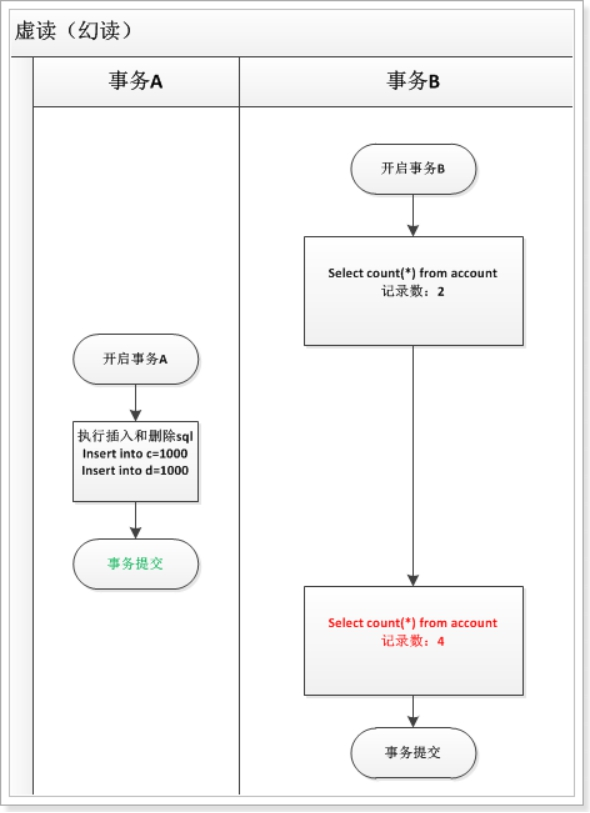 

 

l 指在一个事务中 读取 另一个事务 插入或删除 数据记录，导致当前事务 读取数据前后不一致。

l 丙 存款100元但未提交，这时银行做报表 统计总额为500元，丙将事务提交，银行再统计就变成了 600元，两次统计结果不一致，银行便会不知所措。

 

一个事务 读取 另一个事务 已经提交的数据，强调的是 记录数 的变化，常有sql类型为 insert和 delete。

 

虚读和不可重复读的区别：

虚读 强调的是数据表 记录数 的变化，主要是 insert 和 delete 语句。

不可重复读 强调的是数据表 内容 的变化，主要是 update 语句。

## 5 数据库的隔离级别

数据库共定义了4种隔离级别（限制由高到低, 性能从低到高）：

serializable（串行化）：可避免 脏读、不可重复读、虚读情况的发生。

repeatable read（可重复读）：可避免 脏读、不可重复读， 不可避免 虚读。mysql采用可重复读。

read committed（读已提交）：可避免 脏读，不可避免 不可重复读、虚读。oracle采用读已提交。

read uncommitted（读未提交）：不可避免 脏读、不可重复读、虚读。

 

查询当前数据库的隔离级别：

select @@tx_isolation;

 

设置事务的隔离级别：

set session transaction isolation level 事务隔离级别;

 

**1、read uncommitted 读未提交**

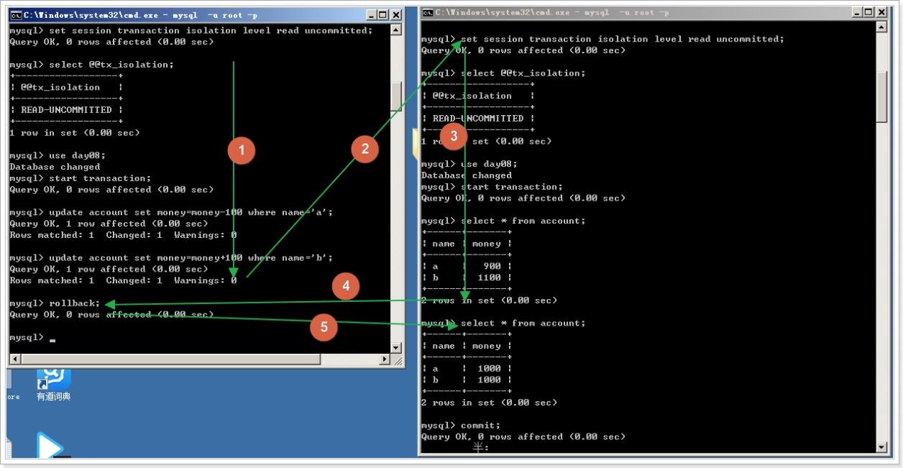 

**2.1 read committed 读已提交 避免脏读**

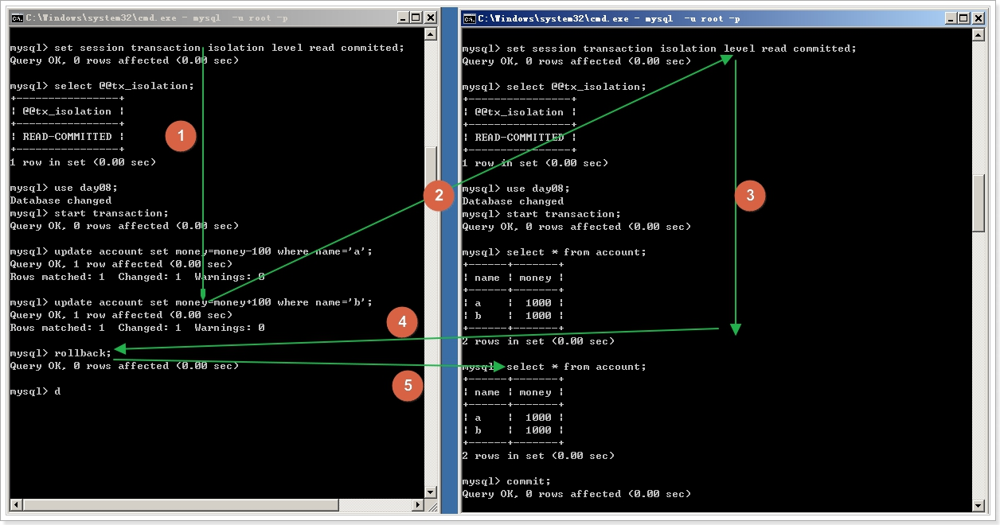 

读已提交，没有解决 不可重复读， 回忆一下什么是不可重复读？

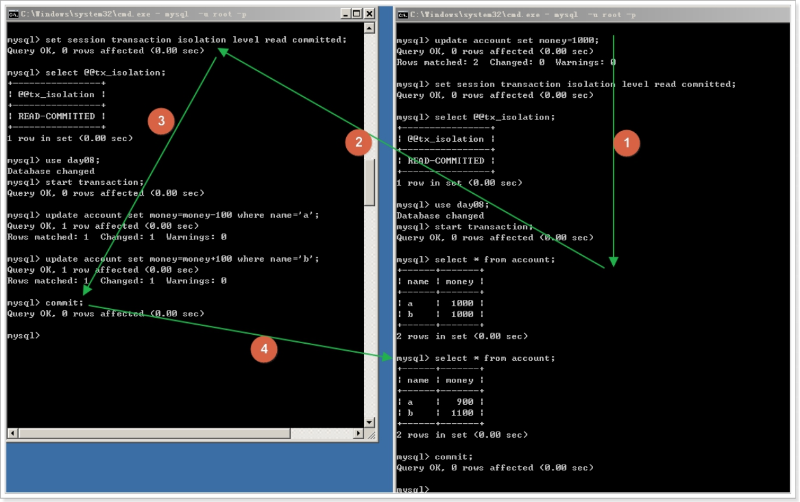 

**3、repeatable read 可重复读**

**可重复读的隔离级别可以解决 不可重复读的问题。**

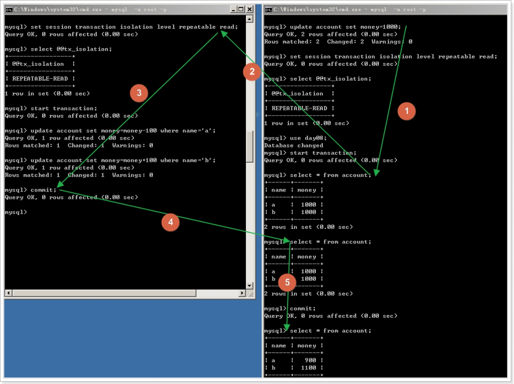 

产生了虚读（幻读）:

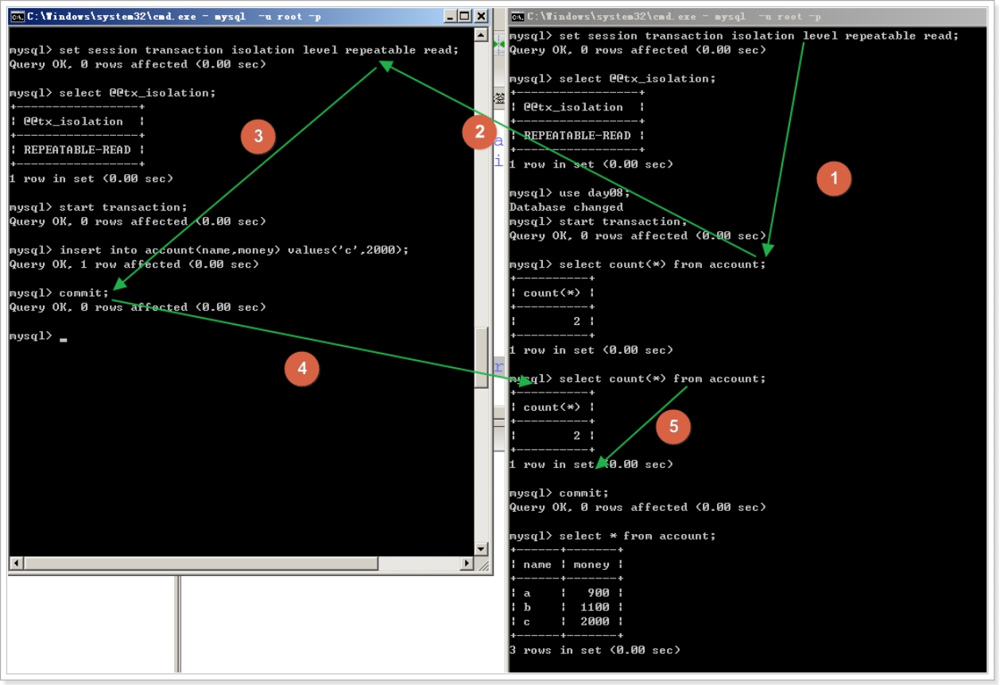 

注意：mysql数据库本身，已经对虚读做了优化处理，所以展示不出虚读的发生。

 

**4、serializable 串行化 可以避免所有的问题。数据库执行这个事务，其他事务必须等待当前事务执行完毕，才会执行。**

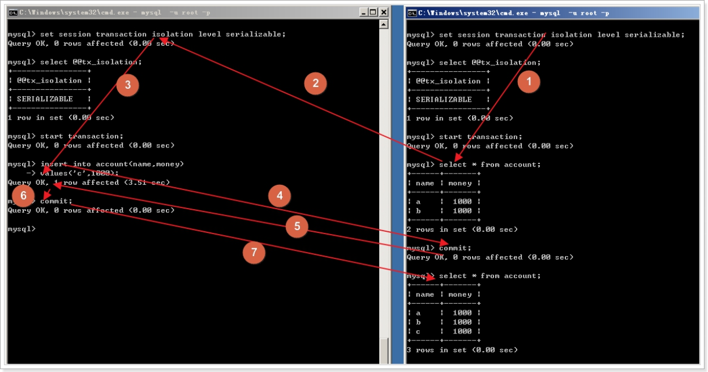 

思考题：为什么串行可以解决所有的问题？ 

上述所有的问题都是 事务 并行执行引起的，所以改成所有事务依次执行（串行），当然所有问题就都解决了。

 

mysql的默认隔离级别是  repeatable read;

oracle的默认隔离级别是 read committed;

## 6 **隔离级别的性能问题**

**性能比较：**

serializable 性能最差，多个事务排队执行。

serializable < repeatable read < read committed < read uncommitted

 

**安全性比较：**

serializable 安全性能最好，所有问题都可以避免

serializable > repeatable read > read committed > read uncommitted

 

分析：

serializable 性能太差

read uncommitted 无法避免脏读，问题严重

 

**总结：数据库厂商 选择了这种方案： 读已提交 和 可重复读**

mysql 选择的可重复读 -- repeatable read

oracle 选择 读已提交 -- read committed

 

## 7 小结

1、事务：逻辑上的一组sql操作，要么全执行，要么全不执行。


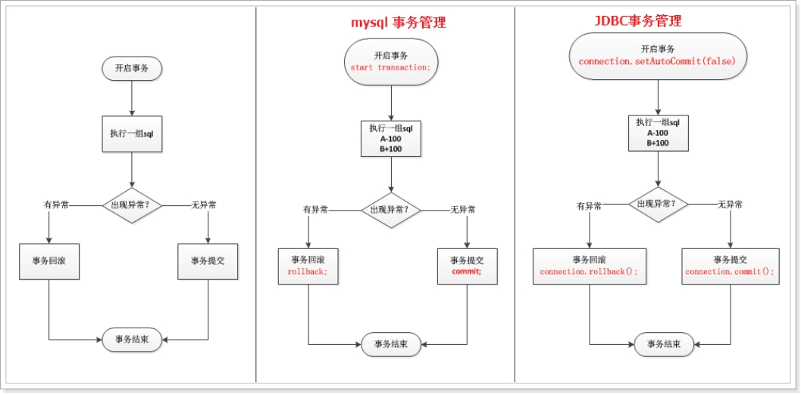 

3、事务的特性：(背诵加理解)

​	原子性、一致性、隔离性、持久性

 

4、如果不考虑隔离级别：(理解 并且能说出来)

脏读

不可重复读

虚读（幻读）


# 第四章 java中的事务管理

| 开启事务： Connection.setAutoCommit(false)               |                                                      |
| -------------------------------------------------------- | ---------------------------------------------------- |
| 执行sql语句群                                            |                                                      |
| 出现异常 事务回滚（撤销）事务结束 Connection.rollback(); | 无异常 事务提交（生效）事务结束 Connection.commit(); |

## 1 演示未添加事务

```
需求：a 向 b 转账 100元。(未添加事务)
```


```java
	@Test
	public void demo1() {
		// 需求：a 向 b 转账 100元。(未添加事务)
		Connection conn = null;
		PreparedStatement stmt = null;

		try {
			// 获取连接
			conn = JDBCUtils.getConnection();

			// a-100
			// 获得发送sql的对象
			String sql = "update account set money=money-100 where name='a'";
			stmt = conn.prepareStatement(sql);
			// 发送sql 获得结果
			stmt.executeUpdate();

			// b+100
			// 获得发送sql的对象
			String sql2 = "update account set money=money+100 where name='b'";
			stmt = conn.prepareStatement(sql2);
			// 发送sql 获得结果
			stmt.executeUpdate();

			System.out.println("一切ok");
		} catch (Exception e) {
			e.printStackTrace();
			System.out.println("出现异常");
		} finally {
			JDBCUtils.release(conn, stmt);
		}
	}
```


## 2 演示添加事务

```
需求：a 向 b 转账 100元, 模拟异常。（强调事务的重要性：要么全执行，要么全撤销。）
```


```java
	@Test
	public void demo2() {
		// 需求：a 向 b 转账 100元, 模拟异常。（强调事务的重要性：要么全执行，要么全撤销。）
		Connection conn = null;
		PreparedStatement stmt = null;

		try {
			// int j = 1 / 0;
			// 获取连接
			conn = JDBCUtils.getConnection();
			// 开启事务
			conn.setAutoCommit(false);

			// a-100
			// 获得发送sql的对象
			String sql = "update account set money=money-100 where name='a'";
			stmt = conn.prepareStatement(sql);
			// 发送sql 获得结果
			stmt.executeUpdate();

			// b+100
			// 获得发送sql的对象
			String sql2 = "update account set money=money+100 where name='b'";
			stmt = conn.prepareStatement(sql2);
			// 发送sql 获得结果
			stmt.executeUpdate();

			int j = 1 / 0;
			System.out.println("一切ok, 提交事务");
			conn.commit();
		} catch (Exception e) {
			e.printStackTrace();
			System.out.println("出现异常,回滚事务");
			try {
				if (conn != null) {
					conn.rollback();
				}
			} catch (Exception e1) {
				e1.printStackTrace();
			}
		} finally {
			JDBCUtils.release(conn, stmt);
		}
	}
```


- 注意事项
  - 1、Connection 和 PrepareStatement 对象引入时，必须是 java.sql 包下的。
  - 2、开启事务 conn.setAutoCommit(false) 必须在 Connection对象获取之后。
  - 3、抓异常时，最好选得大一些。因为 数/0 报的是 算术异常，不在sql异常范围内，所以最好改成Exception。

## 3 DBUtils事务操作

| Connection对象的方法名                                       | 描述                                   |
| ------------------------------------------------------------ | -------------------------------------- |
| conn.setAutoCommit(false)                                    | 开启事务                               |
| new QueryRunner()                                            | 创建核心类，不设置数据源(手动管理连接) |
| query(conn , sql , handler, params )  或   <br />update(conn, sql , params) | 手动传递连接， 执行SQL语句CRUD         |
| DbUtils.commitAndCloseQuietly(conn)                          | 提交并关闭连接，不抛异常               |
| DbUtils.rollbackAndCloseQuietly(conn)                        | 回滚并关闭连接，不抛异常               |

> 代码演示

```java
/*
DBUtils 的事务操作
 */
public class TransactionDemo2 {

    /*
    1.获得连接
    2.开始事务
    3.具体的sql操作(加钱, 减钱)
    4.提交事务 ,释放资源
    5.如果出现异常, 回滚事务释放资源
     */
    @Test
    public void test1() throws SQLException {
        Connection conn = null;
        try {
            //1.获得连接
            conn =  DruidUtils.getConnetion();
            // 2.开始事务
            conn.setAutoCommit(false);
            // 3.具体的sql操作(加钱, 减钱)
            QueryRunner qr = new QueryRunner();
            //减钱
            String sql = "update account set money=money-? where name=?";
            qr.update(conn, sql, 1000, "jack");
            //模拟错误
            int n =1/0;
            //加钱
            sql = "update account set money=money+? where name=?";
            qr.update(conn, sql, 1000, "rose");
            //4.提交事务 ,释放资源
            DbUtils.commitAndCloseQuietly(conn);
        } catch (Exception e) {
            e.printStackTrace();
            //5.如果出现异常, 回滚事务释放资源
            DbUtils.rollbackAndCloseQuietly(conn);
        }
    }
}
```


