# 第一章 EL表达式

## 1 EL表达式的基本概述

EL（Express Lanuage）表达式可以嵌入在jsp页面内部，减少jsp脚本的编写，EL 出现的目的是要替代jsp页面中输出脚本<%= 数据 %>的编写。

## 2 EL表达式的格式和作用

EL表达式的格式：

```jsp
${EL表达式内容}
```

EL表达式的作用： 

1. 从域对象中查找指定的数据。
2. EL内置对象的使用
3. 执行运算符


## 3 EL表达式的基本使用(从域中取出数据)

- EL从四个域中获得某个值: `${key}`
  - 同样是依次从pageContext域，request域，session域，application域中 获取属性，在某个域中获取后将不在向后寻找
  - 其中,若只想获得pageContext域中的值：`${pageScope.key}`
  - 其中，若只想获得request域中的值：`${requestScope.key}`
  - 其中，若只想获得session域中的值：`${sessionScope.key}`
  - 其中，若只想获得application域中的值：`${applicatioScope.key}`

#### 3.1 通过EL表达式，获得普通数据

格式:

```jsp
${key}
```

代码演示：

```jsp
<%@ page contentType="text/html;charset=UTF-8" language="java" %>
<html>
<head>
    <title>获取域容器中的数据</title>
</head>
<body>
    <%
        // 1 将数据保存到域容器中
        pageContext.setAttribute("city", "北京1"); // page
        pageContext.setAttribute("city", "北京2", PageContext.REQUEST_SCOPE); // request
        pageContext.setAttribute("city", "北京3", PageContext.SESSION_SCOPE); // session
        pageContext.setAttribute("city", "北京4", PageContext.APPLICATION_SCOPE); // servletContext

        // 2 删除指定域数据
        /*
        pageContext.removeAttribute("city", PageContext.PAGE_SCOPE); // page
        pageContext.removeAttribute("city", PageContext.REQUEST_SCOPE); // request
        pageContext.removeAttribute("city", PageContext.SESSION_SCOPE); // session
        pageContext.removeAttribute("city", PageContext.APPLICATION_SCOPE); // servletContext
         */
        pageContext.removeAttribute("city"); // 删除所有域中的数据
    %>

    <h1>java</h1>
        <h3>获取数据</h3>
        <%
            out.print(pageContext.getAttribute("city")!=null?pageContext.getAttribute("city"):""); // page
            out.print(pageContext.getAttribute("city", PageContext.REQUEST_SCOPE)); // request
            out.print(pageContext.getAttribute("city", PageContext.SESSION_SCOPE)); // session
            out.print(pageContext.getAttribute("city", PageContext.APPLICATION_SCOPE)); // servletContext
        %>

        <h3>智能获取数据</h3>

        <%
            /*
            pageContext.findAttribute(key) 根据key从四个域容器中依次获取数据, 如果获取到了,取值结束; 如果都没有获取到, 返回null
             */
            out.print(pageContext.findAttribute("city"));
        %>

    <h1>EL</h1>
        <h3>获取数据</h3>
        ${pageScope.city}
        ${requestScope.city}
        ${sessionScope.city}
        ${applicationScope.city}

    <h3>智能获取数据</h3>
        ${city}
</body>
</html>
```

#### 3.2 EL获得javaBean对象的值

格式：

```jsp
${对象.成员变量}
```

代码演示

```jsp
<%@ page import="cn.itcast.pojo.User" %>
<%@ page contentType="text/html;charset=UTF-8" language="java" %>
<html>
<head>
    <title>Title</title>
</head>
<body>
    <%
        //  EL获得javaBean对象的值
        User user = new User();
        user.setUsername("zhangsan");
        user.setPassword("abc");

        request.setAttribute("user", user);
    %>

    <h1>java</h1>
    username = <%=((User)pageContext.findAttribute("user")).getUsername()%> <br/>
    password = <%=((User)pageContext.findAttribute("user")).getPassword()%> <br/>
    nickname = <%=((User)pageContext.findAttribute("user")).getNickname()%>

    <hr/>

    <h1>EL</h1>
        username === ${user.username} <br/>
        password === ${user.password} <br/>
        nickname === ${user.nickname} <br/>
</body>
</html>

```

```java
public class User {
    private String username;
    private String password;
    private String nickname;
    //省略构造方法、get、set方法
}
```


#### 3.3 EL获得`List<String>`的值

格式：

```jsp
${List集合对象[索引]}
```

代码演示

```jsp
<%@ page import="java.util.List" %>
<%@ page import="java.util.ArrayList" %><%--
    EL表达式作用一(从域中取出数据): EL获得 List<String> 的值

    格式: ${ List集合对象[索引] }
--%>
<%@ page contentType="text/html;charset=UTF-8" language="java" %>
<html>
<head>
    <title>Title</title>
</head>
<body>
    <%--1.创建 List<String>集合, 存到Request域中 --%>
    <%
        List<String> list = new ArrayList<String>();
        list.add("迪丽热巴");
        list.add("古力娜扎");
        request.setAttribute("list",list);
    %>

    <%--2.通过EL表达式, 获取List<String>集合中的数据--%>
    <%--jsp方式获取--%>
    <%
        List<String> names = (List<String>) request.getAttribute("list");
        out.print( names.get(0) +" === "+ names.get(1) );
    %>
    <%--EL方式获取--%>
    ${list[0]} == ${list[1]}

</body>
</html>

```

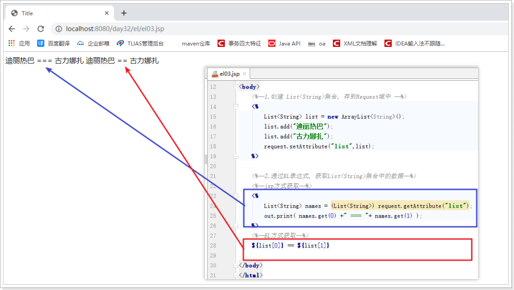


#### 3.4 EL获得`List<User>`的值

格式：

```jsp
${List集合对象[索引].成员变量}
```

代码演示

```jsp
<%@ page import="java.util.List" %>
<%@ page import="java.util.ArrayList" %>
<%@ page import="com.itheima.pojo.User" %><%--
    EL表达式作用一(从域中取出数据): EL获得 List<User> 的值

    格式: ${ List集合对象[索引].成员变量 }
--%>
<%@ page contentType="text/html;charset=UTF-8" language="java" %>
<html>
<head>
    <title>Title</title>
</head>
<body>
    <%--1.创建 List<User>集合, 存到Request域中 --%>
    <%
        List<User> list = new ArrayList<User>();
        list.add(new User("迪丽热巴","123456"));
        list.add(new User("古力娜扎","abcdef"));
        request.setAttribute("list",list);
    %>

    <%--2.通过EL表达式, 获取 List<User>集合中的数据--%>
    <%--jsp方式获取--%>
    <%
        List<User> users = (List<User>) request.getAttribute("list");
        out.print( users.get(0).getUsername() +"=="+ users.get(0).getPassword() );
        out.print( users.get(1).getUsername() +"=="+ users.get(1).getPassword() );
    %>
    <br/>
    <%--EL方式获取--%>
    ${list[0].username} == ${list[0].password}
    ${list[1].username} == ${list[1].password}

</body>
</html>
```

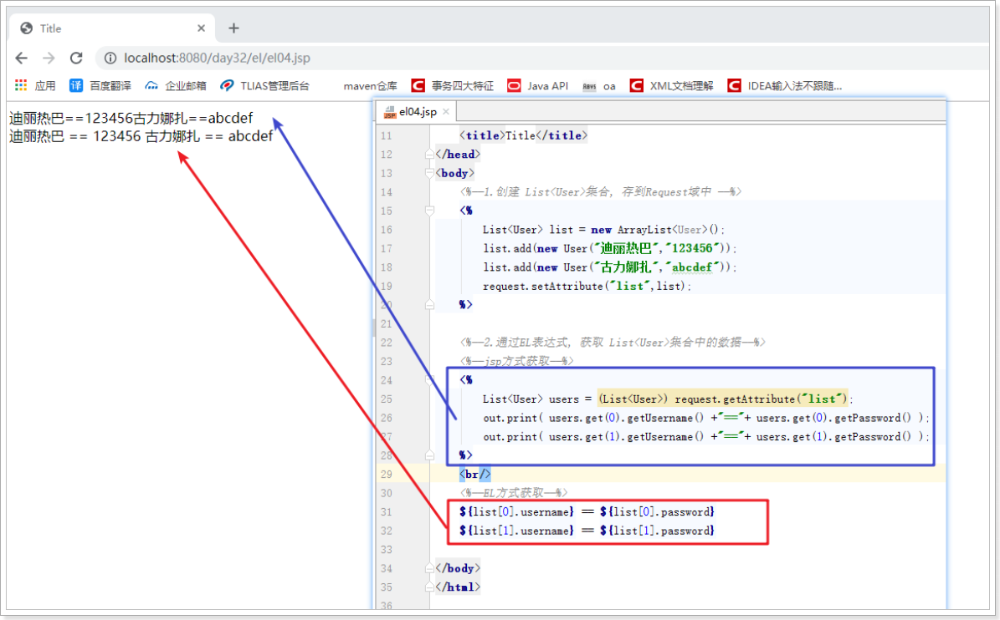


#### 3.5 EL获得Map\<String,User>的值

格式：

```jsp
${Map集合对象.key.成员变量}
或
${Map集合对象['key'].成员变量}
```

代码演示

```jsp
<%@ page import="java.util.List" %>
<%@ page import="java.util.ArrayList" %>
<%@ page import="java.util.HashMap" %>
<%@ page import="com.itheima.pojo.User" %>
<%@ page import="java.util.Map" %><%--
    EL表达式作用一(从域中取出数据): EL获得 Map<String, User> 的值

    格式:
        ${Map集合对象.key.成员变量 }
        或
        ${Map集合对象['key'].成员变量}
--%>
<%@ page contentType="text/html;charset=UTF-8" language="java" %>
<html>
<head>
    <title>Title</title>
</head>
<body>
    <%--1.创建 Map<String, User>集合, 存到Request域中 --%>
    <%
        Map<String, User> userMap = new HashMap<String, User>();
        userMap.put("user1", new User("迪丽热巴","123456"));
        userMap.put("user2", new User("古力娜扎","abcdef"));
        request.setAttribute("userMap",userMap);
    %>

    <%--2.通过EL表达式, 获取 Map<String, User>集合中的数据--%>
    <%--jsp方式获取--%>
    <%
        Map<String, User> map = (Map<String, User>) request.getAttribute("userMap");
        out.print( map.get("user1").getUsername() +"=="+ map.get("user1").getPassword());
        out.print( map.get("user2").getUsername() +"=="+ map.get("user2").getPassword());
    %>
    <br/>
    <%--EL方式获取--%>
    ${userMap.user1.username} == ${userMap.user1.password}
    ${userMap.user2.username} == ${userMap.user2.password}
    <br/>
    ${userMap['user1'].username} == ${userMap['user1'].password}
    ${userMap['user2'].username} == ${userMap['user2'].password}

</body>
</html>

```

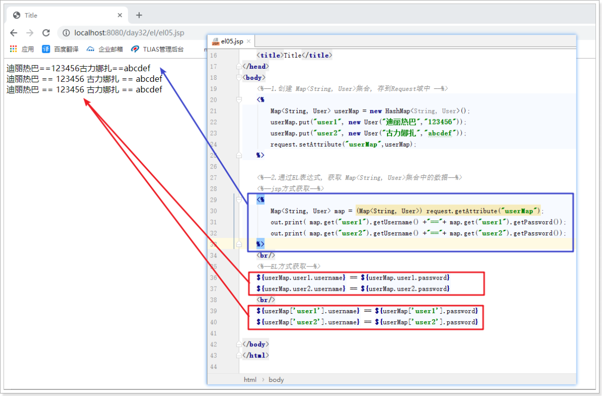


## 4 EL的内置对象 pageContext

pageContext : WEB开发中的页面的上下文对象.

**作用：可以用来获取JSP中四个域中的数据（pageScope, requestScope, sessionScope, applicationScope）**

- 例如，在Servlet中，想获得web应用的名称：`request.getContextPath();`
- 那么，在jsp页面上，想获得web应用的名称：`${pageContext.request.contextPath}`

```jsp
<%@ page contentType="text/html;charset=UTF-8" language="java" %>
<html>
<head>
    <title>获取WEB应用项目名称</title>
</head>
<body>
    <h3>获取WEB应用项目名称</h3>
    <%--JSP方式获取--%>
    <%= request.getContextPath()%>
    <%--EL方式获取--%>
    ${pageContext.request.contextPath}
</body>
</html>

```

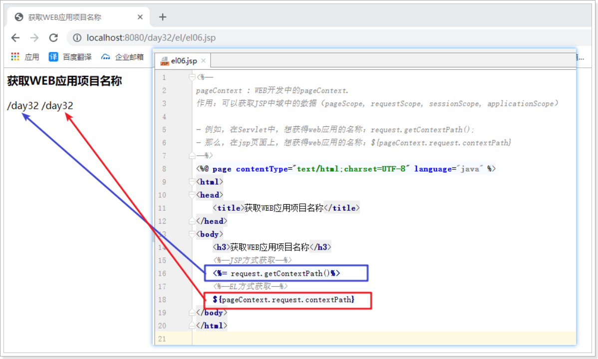


## 5 EL执行运算符

1. 算数运算符 + ,  - , * , / , %
2. 逻辑运算符 && , || , ！
3. 比较运算符 > , < , >= , <= , == , !=
4. Null运算符 empty
5. 三元运算符

代码演示：

```jsp
<%@ page import="java.util.ArrayList" %>
<%@ page contentType="text/html;charset=UTF-8" language="java" %>
<html>
<head>
    <title>EL执行运算符</title>
</head>
<body>
    ${3+4} <br>
    ${3-4} <br>
    ${true&&true} <br>
    ${false&& true} <br>
    ${3>4} <br>
    ${3<4 || 5>4} <br>

    <%--向域中存数据, 用于演示 empty--%>
    <%
        String str = null;
        request.setAttribute("str", str);
        request.setAttribute("array", new String[1] );
        request.setAttribute("list", new ArrayList<String>());
    %>
    ${empty str} <br>
    ${empty array} <br>
    ${empty list} <br>

    ${str == null?"数据为空":str} <br>

</body>
</html>

```

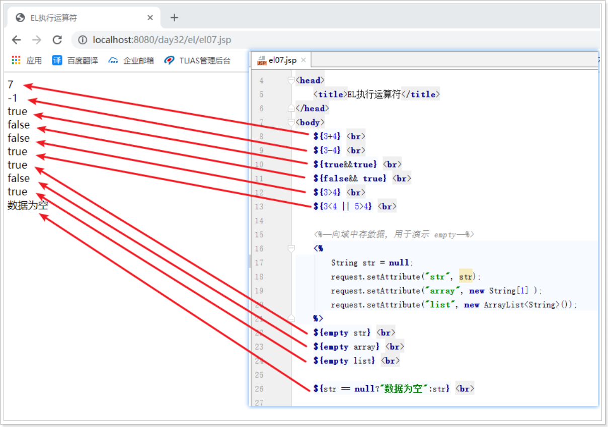


## 6 案例 记录上一次登录所使用的用户名

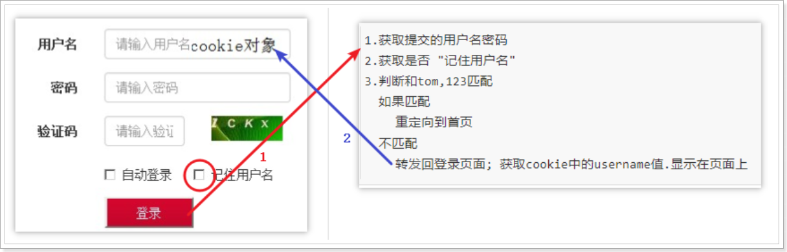


步骤:

```
1.获取提交的用户名密码
2.获取是否 "记住用户名"
3.判断和tom,123匹配
  如果匹配
	重定向到首页
  不匹配
	转发回登录页面; 获取cookie中的username值.显示在页面上
```

发送保存用户名的cookie给浏览器:

```jsp
<%@ page contentType="text/html;charset=UTF-8" language="java" %>
<html>
<head>
    <title>Title</title>
</head>
<body>
<%
    // 获取cookie的值
    Cookie cookie = new Cookie("username", "liuyan");
    cookie.setPath(request.getContextPath());
    cookie.setMaxAge(60 * 60 * 24 * 30);
    response.addCookie(cookie);
%>
</body>
</html>

```


login.jsp代码

```jsp
<%@ page contentType="text/html;charset=UTF-8" language="java" %>
<html>
<head>
    <title>Title</title>
</head>
<body>
<%
    Cookie[] cookies = request.getCookies();
    // 判断
    // 获取对应的值 放到用户名的值
%>
<h1>通过El表达式获取cookie的值</h1>
${cookie.username} <br/>
cookie.username.name = ${cookie.username.name} <br/>
cookie.username.value = ${cookie.username.value} <br/>

<form>
    <table>
        <tr>
            <td>用户名</td>
            <td><input type="text" name="username" value="${cookie.username.value}"/></td>
        </tr>
        <tr>
            <td>密码</td>
            <td><input type="password" name="password"/></td>
        </tr>
        <tr>
            <td></td>
            <td><input type="checkbox" name="save" value="1"
                       ${empty cookie.username ? "" : "checked"}
            /> 记住用户名</td>
        </tr>
        <tr>
            <td></td>
            <td><input type="submit" value="提交"/></td>
        </tr>
    </table>
</form>
</body>
</html>

```


# 第二章 JSTL的核心标签库使用

## 1 jstl标签的基本概述

JSTL（JSP Standard Tag Library)，JSP标准标签库，可以嵌入在jsp页面中使用标签的形式完成业务逻辑等功能。jstl出现的目的同el一样, 也是要放到jsp页面中的脚本代码。JSTL标准标准标签库有5个子库，但随着发展，目前常使用的是它的核心库Core

| **标签库** | **标签库的URI**                        | **前缀** |
| ---------- | -------------------------------------- | -------- |
| Core       | http://java.sun.com/jsp/jstl/core      | c        |
| I18N       | http://java.sun.com/jsp/jstl/fmt       | fmt      |
| SQL        | http://java.sun.com/jsp/jstl/sql       | sql      |
| XML        | http://java.sun.com/jsp/jstl/xml       | x        |
| Functions  | http://java.sun.com/jsp/jstl/functions | fn       |


## 2 jstl标签的安装

### 导入jar包

```java
javax.servlet.jsp.jstl.jar
standard.jar
```

### 使用taglib指令在jsp页面导入要使用的jstl标签库

```jsp
<%@ taglib prefix="c" uri="http://java.sun.com/jsp/jstl/core" %>
```

在jsp书写"<c:"，看到如下提示，说明安装成功：

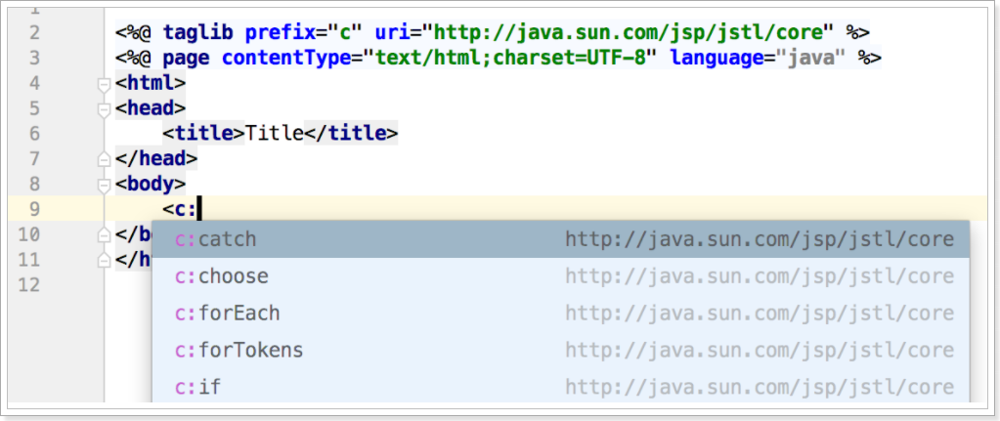


## 3 常用的jstl标签

jstl的核心标签内容有很多，现在目前还常用的标签只有if、foreach标签。

### 3.1 if标签

#### if标签作用

起到java代码的判断的作用

#### if标签属性介绍

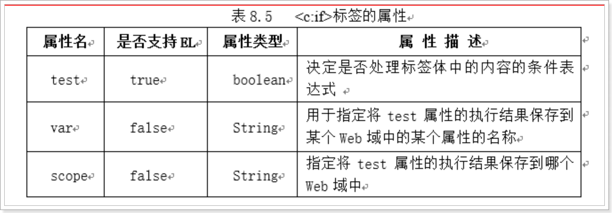


- **test**：判断是否执行标签内的内容（true——执行标签中的内容，false，不执行）。

- var：用来保存test属性的结果（使用var属性给他取个名字），这个结果可以保存到指定的web域中, 默认保存在pageContext域。

- scope：指定保存数据的到哪个web域。

#### if标签演示

```jsp
<%--
    if标签的使用
--%>
<%@ taglib prefix="c" uri="http://java.sun.com/jsp/jstl/core" %>
<%@ page contentType="text/html;charset=UTF-8" language="java" %>
<html>
<head>
    <title>Title</title>
</head>
<body>
    <%
        int num=10;
        pageContext.setAttribute("num",num);
    %>

    <c:if test="${num>5}">
        num 大于5
    </c:if>
    <c:if test="${num<=5}">
        num 小于等于5
    </c:if>

    <%--将判断结果 保存到var属性中, 并指定存到的域对象--%>
    <c:if test="${num == 100}" var="result" scope="request">
    </c:if>

    <h3>取出域对象中的值</h3>
    ${result}
</body>
</html>

```

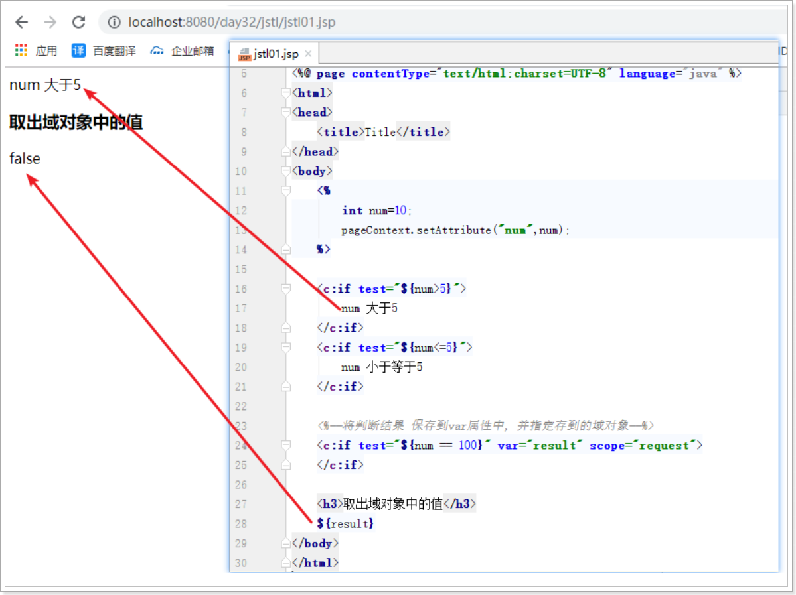


### 3.2 forEach标签 重点重点重点

#### forEach标签作用

起到java代码的for循环作用

#### forEach标签属性介绍

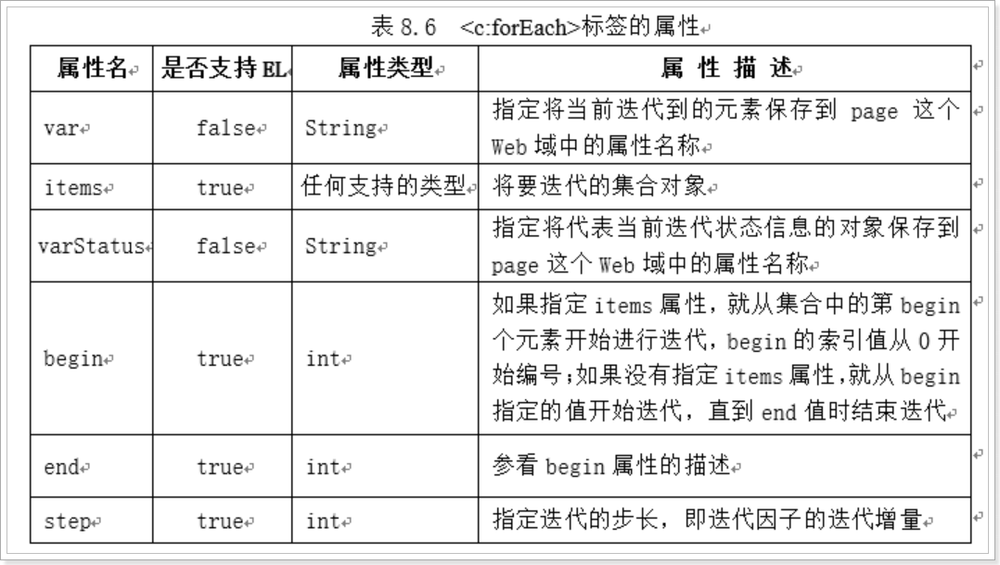

- var：在不循环对象的时候，保存的是控制循环的变量；在循环对象的时候，保存的是被循环对象中的元素
- items：指定要循环的对象
- varStatus：保存了当前循环过程中的信息（循环的开始、结束、步长、次数等）
- begin：设置循环的开始
- end：设置循环的结束
- step：设置步长

#### foreach演示

```jsp
<%@ page import="com.itheima.pojo.User" %>
<%@ page import="java.util.List" %>
<%@ page import="java.util.ArrayList" %>
<%--
    forEach标签的使用
--%>
<%@ page contentType="text/html;charset=UTF-8" language="java" %>
<%@ taglib prefix="c" uri="http://java.sun.com/jsp/jstl/core" %>
<html>
<head>
    <title>Title</title>
</head>
<body>
    <%--foreach标准循环--%>
    <c:forEach begin="1" end="5" var="i" step="2">
        ${i}<br>
    </c:forEach>

    <%--准备集合数据到域中,用于遍历--%>
    <%
        List<User> list = new ArrayList<User>();
        list.add(new User("迪丽热巴","1234566"));
        list.add(new User("古力娜扎", "abcdef"));
        request.setAttribute("list",list);
    %>
    <%--foreach遍历集合--%>
    <c:forEach items="${list}" var="user" varStatus="vs">
        ${user.username} == ${user.password} == ${vs.count} <br>
    </c:forEach>
</body>
</html>

```

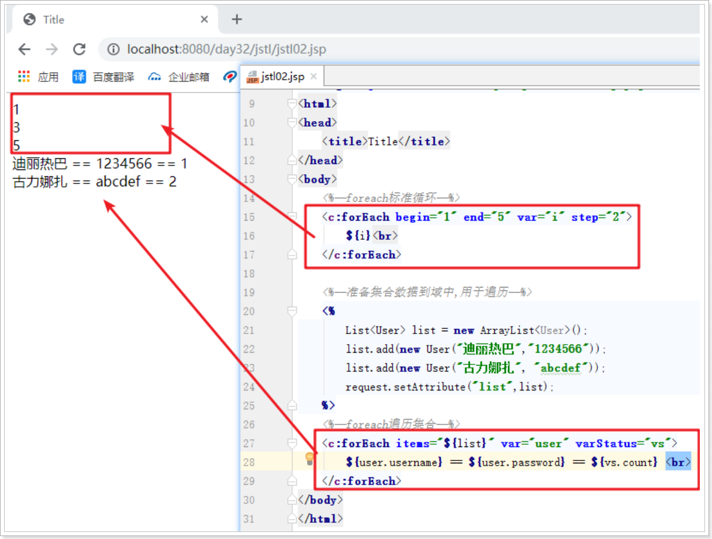

# 第三章 过滤器Filter

## 1 Filter概念

  过滤器: 过筛子,符合条件的过去,不符合条件不能过去.

  生活比喻: 安检,检查安全的人与物才可以通过放行

  程序: 客户端需要访问服务器的目标资源,在客户端和服务器资源之间设置过滤器, 符合要求放行


## 2 Filter的入门程序

### 需求:

- 浏览器要访问HelloServlet
- 途径过滤期MyFilter, 若MyFilter放行,可执行访问到HelloServlet; 若不放行,无法访问HelloServlet

### 执行图解:

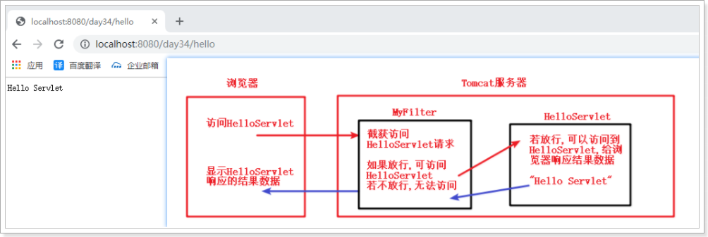

### 实现步骤

1. 编写Servlet, 在web.xml配置Servlet访问路径
2. 编写Filter,定义类, 实现接口Filter, 实现接口中抽象方法, 在web.xml配置Filter的访问过滤路径 

#### 代码: HelloServlet

```java
/**
 * @author likepei
 * @data 2019/7/14 0:29
 * @description 用于Filter入门案例演示
 */
public class HelloServlet extends HttpServlet {
    protected void doGet(HttpServletRequest request, HttpServletResponse response) throws ServletException, IOException {
        //控制台打印
        System.out.println("HelloServlet 执行了");
        //浏览器响应
        response.getWriter().println("Hello Servlet");
    }

    protected void doPost(HttpServletRequest request, HttpServletResponse response) throws ServletException, IOException {
        doGet(request, response);
    }
}

```

#### 代码: MyFilter

```java
/**
 * @author likepei
 * @data 2019/7/14 0:31
 * @description 用于演示Filter入门案例
 */
public class MyFilter implements Filter {
    public void destroy() {
    }

    public void doFilter(ServletRequest req, ServletResponse resp, FilterChain chain) throws ServletException, IOException {
        System.out.println("MyFilter 执行了");

        //执行过滤后放行, 进行后续的请求访问
        chain.doFilter(req, resp);
    }

    public void init(FilterConfig config) throws ServletException {

    }

}
```

#### 代码: web.xml

```xml
<?xml version="1.0" encoding="UTF-8"?>
<web-app xmlns="http://xmlns.jcp.org/xml/ns/javaee"
         xmlns:xsi="http://www.w3.org/2001/XMLSchema-instance"
         xsi:schemaLocation="http://xmlns.jcp.org/xml/ns/javaee http://xmlns.jcp.org/xml/ns/javaee/web-app_3_1.xsd"
         version="3.1">
    <!--配置servlet-->
    <filter>
        <filter-name>my</filter-name>
        <filter-class>com.itheima.filter.MyFilter</filter-class>
    </filter>
    <filter-mapping>
        <filter-name>my</filter-name>
        <url-pattern>/*</url-pattern>
    </filter-mapping>

    <!--配置Servlet-->
    <servlet>
        <servlet-name>hello</servlet-name>
        <servlet-class>com.itheima.servlet.HelloServlet</servlet-class>
    </servlet>
    <servlet-mapping>
        <servlet-name>hello</servlet-name>
        <url-pattern>/hello</url-pattern>
    </servlet-mapping>

</web-app>
```


## 3 Filter的生命周期

- 过滤器对象的创建,是Tomcat服务器启动

  - init(FilterConfig config)过滤器对象被创建的时候调用,FilterConfig 对象tomcat引擎创建

- 过滤器执行过滤的方法,过滤被访问资源的时候,必须是被过滤器过滤器的资源

  - doFilter(request,response)

- 过滤器对象销毁的方法,销毁之前调用,服务器关闭

  - destroy()

  

  ```java
  package cn.itcast.web.filter;
  
  import javax.servlet.*;
  import javax.servlet.http.HttpServletRequest;
  import java.io.IOException;
  
  /**
   * 1 创建类 实现Filter接口
   * 2 在web.xml中注册
   * 3 在web.xml中映射拦截的路径
   */
  public class Filter1 implements Filter {
      String encoding;
  
      public Filter1() {
          System.out.println("======= 1 执行Filter1的构造方法... ...");
      }
  
      @Override
      public void init(FilterConfig filterConfig) throws ServletException {
          System.out.println("======= 2 执行Filter1的初始化 init 方法... ...");
          encoding = filterConfig.getInitParameter("encoding");
          System.out.println("编码集: " + encoding);
      }
  
      @Override
      public void doFilter(ServletRequest servletRequest, ServletResponse servletResponse, FilterChain filterChain) throws IOException, ServletException {
          System.out.println("======= 3 执行Filter1的执行过滤 doFilter 方法... ... 编码集:" + encoding);
          // 因为父类不能调用子类的方法,所以向下转型
          HttpServletRequest httpServletRequest = (HttpServletRequest) servletRequest;
          String uri = httpServletRequest.getRequestURI();
          System.out.println("执行过滤器1 ... ... 访问的路径: " + uri);
  
          // 允许访问目标资源 : 放行
          filterChain.doFilter(servletRequest, servletResponse);
  
          //System.out.println("放行之后执行... ...");
      }
  
      @Override
      public void destroy() {
          System.out.println("======= 4 执行Filter1的销毁 destroy 方法... ...");
  
      }
  }
  ```

  

## 4 Filter的url-pattern配置

- 完全匹配

```xml
<!-- 
    过滤资源,只有hello
    绝对匹配 <url-pattern>/hello</url-pattern>
    只能过滤指定的资源
-->
<url-pattern>/hello</url-pattern>
```

- 目录匹配

```xml
<!--
   目录匹配,过滤器中最常见
   /abc/*  过滤abc目录下的所有资源
   一次过滤一片资源
   过滤后台资源 /admin/*
-->
<url-pattern>/admin/*</url-pattern>
```

- 后缀名匹配

```xml
<!-- 
  后缀名匹配,一般不使用
  *.jsp  访问所有jsp文件
-->
<url-pattern>*.jsp</url-pattern>
```


## 5 注解配置Filter

@WebFilter(urlPatterns="/过滤资源")

```java
@WebFilter("/*")
public class ChinaFilter implements Filter {
    //代码省略...
}
```


```java
package cn.itcast.web.filter;

import javax.servlet.*;
import javax.servlet.annotation.WebFilter;
import javax.servlet.http.HttpServletRequest;
import java.io.IOException;

// 方式一
//@WebFilter(urlPatterns = {"/hello.jsp", "/helloServlet"})

// 方式二
// @WebFilter(urlPatterns = {"/hello.jsp"})

// 方式三
// @WebFilter(urlPatterns = "/hello.jsp")

// 方式四
@WebFilter("/hello.jsp")
public class Filter3 implements Filter {
    public void destroy() {
    }

    public void doFilter(ServletRequest req, ServletResponse resp, FilterChain chain) throws ServletException, IOException {
        // 因为父类不能调用子类的方法,所以向下转型
        HttpServletRequest httpServletRequest = (HttpServletRequest) req;
        String uri = httpServletRequest.getRequestURI();
        System.out.println("执行过滤器3 ... ... 访问的路径: " + uri);

        chain.doFilter(req, resp);
    }

    public void init(FilterConfig config) throws ServletException {

    }

}
```


## 6 Filter 处理中文乱码

### 需求:

​	使用过滤器Filter, 处理所有请求的中文乱码

### 执行图解:

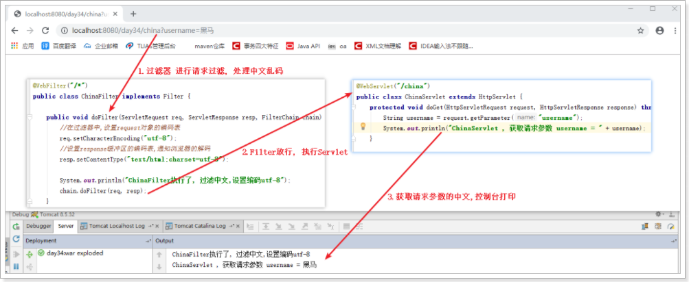

### 代码: ChinaServlet

```java
@WebServlet("/china")
public class ChinaServlet extends HttpServlet {
    protected void doGet(HttpServletRequest request, HttpServletResponse response) throws ServletException, IOException {
        String username = request.getParameter("username");
        System.out.println("ChinaServlet , 获取请求参数 username = " + username);
    }

    protected void doPost(HttpServletRequest request, HttpServletResponse response) throws ServletException, IOException {
        doGet(request, response);
    }
}
```

### 代码: ChinaFilter

```java
@WebFilter("/*")
public class ChinaFilter implements Filter {

    public void doFilter(ServletRequest req, ServletResponse resp, FilterChain chain) throws ServletException, IOException {
        //在过滤器中,设置request对象的编码表
        req.setCharacterEncoding("utf-8");
        //设置response缓冲区的编码表,通知浏览器的解码
        resp.setContentType("text/html;charset=utf-8");

        System.out.println("ChinaFilter执行了, 过滤中文,设置编码utf-8");
        chain.doFilter(req, resp);
    }

    public void init(FilterConfig config) throws ServletException {

    }

    public void destroy() {
    }
}
```


## 7 过滤器链 FilterChain的执行过程

生活中的过滤器链: 从 脏水 --> -->UF超滤膜 --> PP棉 -->前置活性炭 --> RO膜 --> 纳米晶须活性炭 --> 出纯水 


**Filter中的过滤器链 FilterChain:** 由Tomcat引擎创建对象

**作用:** 维护过滤器执行顺序

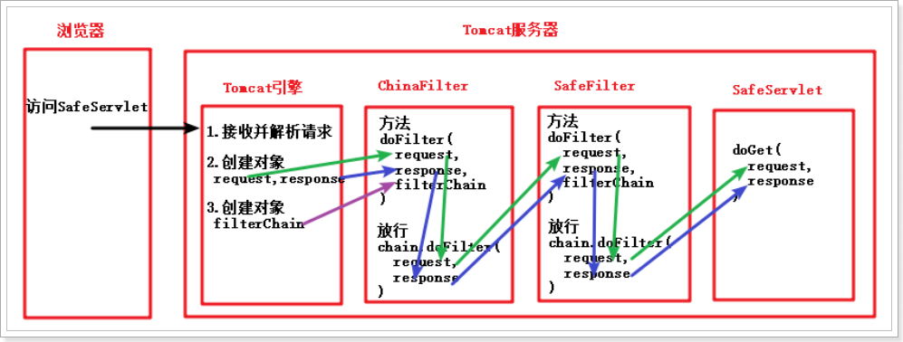

**小结:** Servlet中doGet方法参数 request, response对象, 由Tomcat引擎创建, 经过多个过滤器一层层传递 


## 8 多个过滤器的先后执行顺序

### web.xml配置

  和配置文件的编写顺序决定运行的顺序,准确的说法是,根据mapping的顺序决定 (由上到下执行)

### 注解开发

  注解开发没有配置文件的

  按照类名的自然顺序决定: A-B-C

  如果存在配置文件,配置文件优先

## 9 过滤器案例: 登录验证(权限校验)

### 9.1 需求


```
1. 访问项目的资源。验证其是否登录
2. 如果登录了，则直接放行。
3. 如果没有登录，则跳转到登录页面，提示"您尚未登录，请先登录"。
```

### 9.2 实现

#### 9.2.1 登录页面

```jsp
<%@ page contentType="text/html;charset=UTF-8" language="java" %>
<html>
<head>
    <title>Title</title>
    <style>
        .err {
            color : red;
        }
    </style>
</head>
<body>
    <div class="err">${errorMsg}</div>
    <form action="/day0804/loginServlet" method="post">
        <table>
            <tr>
                <td>用户名</td>
                <td><input type="text" name="username"/></td>
            </tr>
            <tr>
                <td>密码</td>
                <td><input type="password" name="password"/></td>
            </tr>
            <tr>
                <td></td>
                <td><input type="submit" value="登录"/></td>
            </tr>
        </table>
    </form>
</body>
</html>
```

#### 9.2.2 登录Servlet

```java
package cn.itcast.web;

import javax.servlet.ServletException;
import javax.servlet.annotation.WebServlet;
import javax.servlet.http.HttpServlet;
import javax.servlet.http.HttpServletRequest;
import javax.servlet.http.HttpServletResponse;
import java.io.IOException;

@WebServlet("/loginServlet")
public class LoginServlet extends HttpServlet {
    protected void doPost(HttpServletRequest request, HttpServletResponse response) throws ServletException, IOException {
        // 解决获取参数的中文乱码 (浏览器 -> 服务器)
        request.setCharacterEncoding("utf-8");
        // 解决浏览器出现的中文乱码
        response.setContentType("text/html;charset=utf-8");

        // 模拟数据库校验
        String username = request.getParameter("username");
        String password = request.getParameter("password");

        if("zhangsan".equals(username) && "123".equals(password)) {
            // 合法
            request.getSession().setAttribute("loginUser", username);
            response.sendRedirect(request.getContextPath() + "/index.jsp");
        }else{
            // 不合法
            request.setAttribute("errorMsg", "用户名或密码错误!");
            request.getRequestDispatcher("/login.jsp").forward(request, response);
        }

    }

    protected void doGet(HttpServletRequest request, HttpServletResponse response) throws ServletException, IOException {
        doPost(request, response);
    }
}
```

#### 9.2.3 过滤器

```java
package cn.itcast.web.filter;

import javax.servlet.*;
import javax.servlet.annotation.WebFilter;
import javax.servlet.annotation.WebInitParam;
import javax.servlet.http.HttpServletRequest;
import javax.servlet.http.HttpServletResponse;
import java.io.IOException;
import java.util.ArrayList;
import java.util.Arrays;
import java.util.List;

@WebFilter(urlPatterns="/*",
    initParams = {@WebInitParam(name = "ignoreUrls", value = "login,/js,/img,/css,register,checkcodServlet")}
)
public class LoginFilter implements Filter {

    List<String> ignoreUrlList = new ArrayList<String>();

    public void init(FilterConfig config) throws ServletException {
        String ignoreUrls = config.getInitParameter("ignoreUrls");
        String[] split = ignoreUrls.split(",");
        ignoreUrlList = Arrays.asList(split);
        System.out.println(" ===================== " + ignoreUrlList);
    }
    public void doFilter(ServletRequest req, ServletResponse resp, FilterChain chain) throws ServletException, IOException {
        HttpServletRequest httpServletRequest = (HttpServletRequest) req;
        HttpServletResponse httpServletResponse = (HttpServletResponse) resp;

        // 1 获取拦截的路径
        String uri = httpServletRequest.getRequestURI();
        //System.out.println("=========拦截的路径 : " + uri);
        String subURI = uri.substring(httpServletRequest.getContextPath().length());
        //System.out.println("-----------------拦截的子路径 : " + subURI);
        // 2 判断
        // 2.1 如果是登录页面或者图片或者css或者js或者注册等 都需要放行
//        if(subURI.indexOf("login")!=-1 || subURI.indexOf("register")!=-1|| subURI.indexOf("/css")!=-1 || subURI.indexOf("/js")!=-1 || subURI.indexOf("/img")!=-1) {
//            chain.doFilter(req, resp);
//            return;
//        }

        for (String ignoreUrl : ignoreUrlList) {
            if(subURI.indexOf(ignoreUrl)!=-1) {
                chain.doFilter(req, resp);
                return;
            }
        }

        // 3 获取session中的用户数据
        Object loginUser = httpServletRequest.getSession().getAttribute("loginUser");
        // 4 判断
        if(loginUser!=null) {
            // 4.1 如果session存在用户, 表示用户已经登录, 放行
            chain.doFilter(req, resp);
        }else {
            // 4.2 如果session中不存在用户, 表示用户未登录, 重定向跳转到登录页面
            httpServletResponse.sendRedirect(httpServletRequest.getContextPath() + "/login.jsp");
        }

    }

    public void destroy() {
    }

}
```


# 第四章 监听器Listener(了解)

## 1 Listener概述


 监听器Listener 是 监听某个组件变化的对象.

- 事件源是固定的,主要是request, session, servletcontext域对象

- 监听的是域对象变化

  - 对象的创建和销毁, 域对象中存储的数据变化

- 第一个维度划分: 

  - 监听的域对象request, session, servletcontext 

    | 域对象         | 监听器                 |
    | -------------- | ---------------------- |
    | request        | ServletRequestListener |
    | session        | HttpSessionListener    |
    | servletcontext | ServletContextListener |

- 第二个维度划分: 

  - 监听的域对象的状态


## 2 ServletContext监听器入门

用于监听 servletcontext域对象, 对象的创建和销毁, 域对象中存储的数据变化

### 实现步骤

- 创建类实现监听器接口 ServletContextListener
- 重写抽象方法
- 注解方式 配置 Listener 

```java
@WebListener
public class MyServletContextListener implements ServletContextListener {
    @Override
    /**
     *  ServletContext对象,被创建,调用
     */
    public void contextInitialized(ServletContextEvent servletContextEvent) {
        System.out.println("ServletContext域对象创建");
    }

    @Override
    /**
     *   ServletContext对象,被销毁前调用
     */
    public void contextDestroyed(ServletContextEvent servletContextEvent) {
        System.out.println("ServletContext域对象销毁");
    }
}
```

- web.xml配置方式 Listener 

```xml
<listener>
    <listener-class>com.itheima.listener.MyServletContextListener</listener-class>
</listener>
```


## 3 监听器事件对象 ServletContextEvent

ServletContextEvent: 是ServletContext域对象的事件对象, 此对象由tomcat引擎创建ServletContext

- 方法:
  - `Object getSource() `获取到被监听的事件源
  - `ServletContext getServletContext()` 获取到被监听的事件源
- 小结:
  - 两个方法 除了返回值外,功能实现是一致的, 设计目的为了通用性
  - 其他的监听器事件对象(HttpSessionEvent, ServletRequestEvent), 都有共同的方法 getSource()

```java
@WebListener
public class MyServletContextListener implements ServletContextListener {
    @Override
    /**
     *  ServletContext对象,被创建,调用
     */
    public void contextInitialized(ServletContextEvent servletContextEvent) {
        System.out.println("ServletContext域对象创建");
        ServletContext context = (ServletContext) servletContextEvent.getSource();
        System.out.println(context);

        ServletContext servletContext = servletContextEvent.getServletContext();
        System.out.println(servletContext);
    }

    @Override
    /**
     *   ServletContext对象,被销毁前调用
     */
    public void contextDestroyed(ServletContextEvent servletContextEvent) {
        System.out.println("ServletContext域对象销毁");
    }
}
```


## 4 注解版

```java
package cn.itcast.listener;

import javax.servlet.*;
import javax.servlet.annotation.WebListener;
import javax.servlet.http.*;

// 每次请求都会创建一个新的request对象; 当响应结束后,立刻销毁request对象
@WebListener
public class MyRequestListener implements ServletRequestListener {

    @Override
    public void requestInitialized(ServletRequestEvent servletRequestEvent) {
        ServletRequest servletRequest = servletRequestEvent.getServletRequest();
        HttpServletRequest httpServletRequest = (HttpServletRequest) servletRequest;
        System.out.println("新的request对象创建了 .... ... 路径: " + httpServletRequest.getRequestURI());
    }

    @Override
    public void requestDestroyed(ServletRequestEvent servletRequestEvent) {
        System.out.println("request对象销毁了 .... ...");
    }

}
```

### 


