# HTML

# 第一章 入门介绍

## 1 JavaWeb课程体系介绍

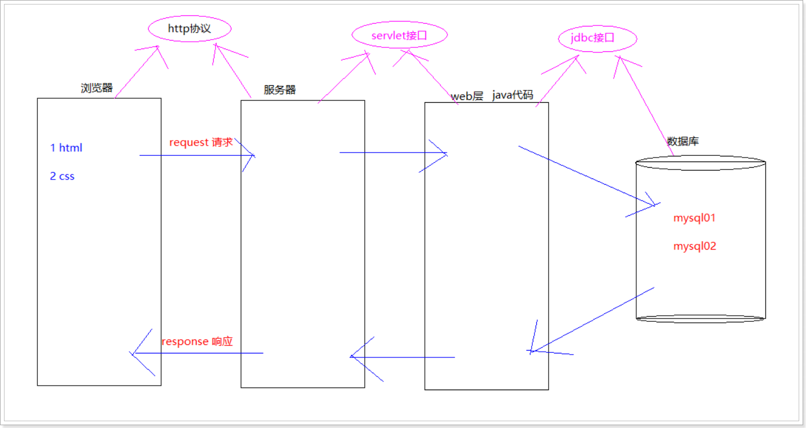

## 2 HTML语言介绍

HTML: (HyperText Markup Language) 超文本标记语言

- 是网页开发的必备语言
- "超文本"就是指页面内可以包含图片、链接、甚至音乐、程序等非文字元素。
- "标记"就是指页面编写方式采用的是 标签形式 将需要的内容包括起来。例如：`<a>www.itheima.com</a>`
- 平时上网通过浏览器我们看到的大部分页面都是由html编写的。在浏览器访问网页时，可以通过“右键/查看网页源代码”看到具体的html代码。

## 3 动态网页和静态网页

**网页根据内容是否改变分为：静态页面、动态页面**

静态网页

- 静态网页，随着html代码的生成，页面的内容和显示效果就确定了，以后基本上不会发生变化了，数据都是固定写死的，页面不会对数据库进行访问。
- 静态网页相对更新起来比较麻烦，适用于一般更新较少的展示型网站。

动态网页

- 而动态网页则不然，页面代码虽然没有变，但是显示的内容却是可以随着时间、环境或者数据库操作的结果而发生改变的。

- 凡是结合了HTML以外的高级程序设计语言和数据库技术进行的网页编程技术所生成的网页，都是动态网页。

## 4 第一个网页

1. 创建“文本文档”，重命名“xxx.html”。文件名自定义，扩展名为html。
2. 右键/打开方式/记事本，开发html文件，并编写如下内容

```html
<html>
    <head>
        <title>这是标题</title>
    </head>
    <body>
        这里用于显示网页内容
    </body>
</html>
```

以上使用的标签组成了HTML页面的基本结构，现将所有标签进行陈述：

- `<html>` 整个页面的根标签，由头和体组成。
- `<head>`头标签，用于引入脚本、导入样式、提供元信息等。一般情况下头标签的内容在浏览器端都不显示。
- `<body>`体标签，是整个网页的主体，我们编写的html代码基本都在此标签体内。

## 5 html语法

- HTML文件不需要编译，直接使用浏览器阅读即可
- HTML文件的扩展名是*.html 或 *.htm
- HTML结构都是由标签组成
  - 标签名预先定义好的，我们只需要了解其功能即可。
  - 标签名不区分大小写
  - 通常情况下标签由开始标签和结束标签组成。例如：<a></a>
  - 如果没有结束标签，建议以/结尾。例如：
- 在模板代码中，我们使用到了HTML注释
  - 格式：<!--注释内容 -->
  - 注释特点：
    - 浏览器查看时，不显示。右键查看源码可以看到。
    - 注释标签不能嵌套。

## 6 浏览器使用

目前，支持Html5的浏览器包括

- Firefox（火狐浏览器）
- IE9及其更高版本
- Chrome（谷歌浏览器）, 程序员常用
- Safari（苹果浏览器）
- Opera等；
- 国内的傲游浏览器（Maxthon）、以及基于IE或Chromium（Chrome的工程版或称实验版）所推出的360浏览器、搜狗浏览器、QQ浏览器、猎豹浏览器等国产浏览器同样具备支持HTML5的能力。

# 第二章 常用标签

## 0 创建web静态项目

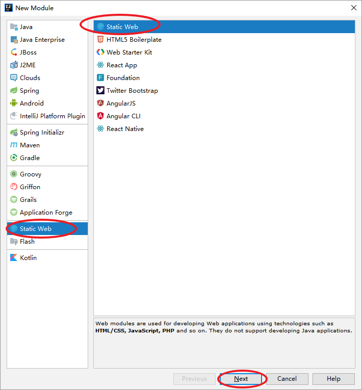

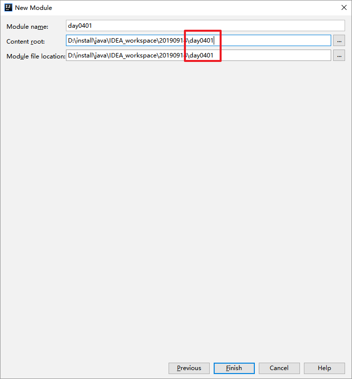


## 1 基本标签

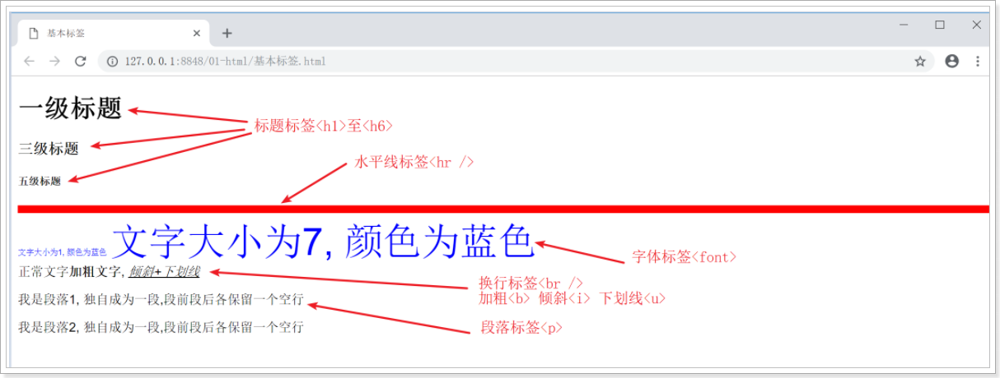

- 标题: <hn></hn> , n的范围1--6, 数字越大, 显示越小
- 水平分割线: <hr />
  - 属性 size \ color
- 字体: <font 属性名=属性值 属性名=属性值></font>
  - 属性 size \ color
  - color属性：设置字体的颜色
    - 颜色的取值：#xxxxxx 或 colorname
    - \#xxxxxx 表示使用红绿蓝三原色设置颜色。
      - 红绿蓝分别取值：00 -- FF，此处使用16进制。（FF就是十进制的255）
      - \#000000 表示黑色，#FFFFFF白色
      - \#FF0000红色，#00FF00绿色，#0000FF蓝色
    - colorname 使用英文单词确定颜色。red 红色，blue 蓝色，green绿色
- 换行: <br />
- 格式化: <b></b>加粗, <u></u>下划线, <i></i>倾斜
- 段落: <p></p>

```html
<!-- 代码演示 -->
<!DOCTYPE html>
<html>
    <head>
        <meta charset="utf-8" />
        <title>基本标签</title>
    </head>
    <body>
        <!-- 标题标签 -->
        <h1>一级标题</h1>
        <h3>三级标题</h3>
        <h5>五级标题</h5>
        
        <!-- 水平分割线 -->
        <hr size=10 color="red"/>
        
        <!-- 字体标签 -->
        <font size="1" color="blue">文字大小为1, 颜色为蓝色</font>
        <font size="7" color="blue">文字大小为7, 颜色为蓝色</font>
        
        <!-- 换行标签 -->
        <br />
        
        <!-- 格式标签 -->
        正常文字<b>加粗文字</b>, <u><i>倾斜+下划线</i></u>
        
        <!-- 段落标签 -->
        <p>我是段落1, 独自成为一段,段前段后各保留一个空行</p>
        <p>我是段落2, 独自成为一段,段前段后各保留一个空行</p>
    </body>
</html>
```


```html
    <!--1 标题标签-->
    <!--2 分割线-->
    <!--3 文字 颜色 大小-->
    <!--4 换行-->
    <!--5 格式化标签-->
    <!--6 段落-->
```


## 2 基本标签案例

使用基本标签, 完成公司简介案例

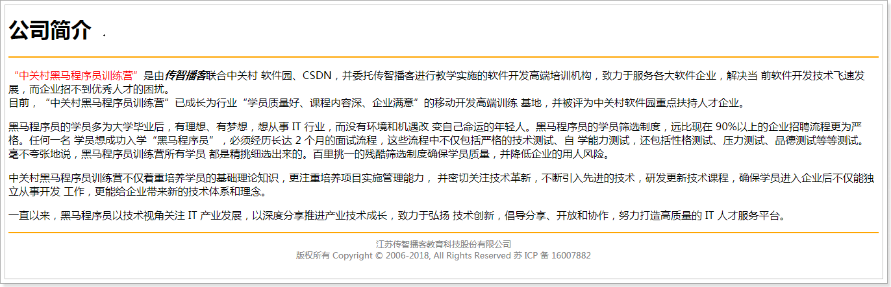


```html
<!DOCTYPE html>
<html lang="ch">
<head>
    <meta charset="UTF-8">
    <title>黑马程序员简介</title>
</head>
<body>
<header>
    <div id="header">
    <h1>
        公司简介
    </h1>

    </div>

</header>
<hr color="#ffd700">

<p>
<font color="#FF0000">"中关村黑马程序员训练营"</font>是由<b><i>传智播客</i></b>联合中关村软件园、CSDN， 并委托传智播客进行教学实施的软件开发高端培训机构，致力于服务各大软件企业，解决当前软件开发技术飞速发展， 而企业招不到优秀人才的困扰。
</p>

<p>
目前，“中关村黑马程序员训练营”已成长为行业“学员质量好、课程内容深、企业满意”的移动开发高端训练基地， 并被评为中关村软件园重点扶持人才企业。
</p>

<p>

黑马程序员的学员多为大学毕业后，有理想、有梦想，想从事IT行业，而没有环境和机遇改变自己命运的年轻人。 黑马程序员的学员筛选制度，远比现在90%以上的企业招聘流程更为严格。任何一名学员想成功入学“黑马程序员”， 必须经历长达2个月的面试流程，这些流程中不仅包括严格的技术测试、自学能力测试，还包括性格测试、压力测试、 品德测试等等测试。毫不夸张地说，黑马程序员训练营所有学员都是精挑细选出来的。百里挑一的残酷筛选制度确 保学员质量，并降低企业的用人风险。
中关村黑马程序员训练营不仅着重培养学员的基础理论知识，更注重培养项目实施管理能力，并密切关注技术革新， 不断引入先进的技术，研发更新技术课程，确保学员进入企业后不仅能独立从事开发工作，更能给企业带来新的技术体系和理念。
</p>

<p>

一直以来，黑马程序员以技术视角关注IT产业发展，以深度分享推进产业技术成长，致力于弘扬技术创新，倡导分享、 开放和协作，努力打造高质量的IT人才服务平台。
</p>

<hr color="#ffd700">
<footer>

    <div id="footer">
    <font color="gray" size="2">
        <center>
            江苏传智播客教育科技股份有限公司<br>
            版权所有Copyright 2006-2018&copy;, All Rights Reserved 苏ICP备16007882
        </center>
    </font>
    </div>
</footer>

</body>
</html>
```

## 3 图片标签

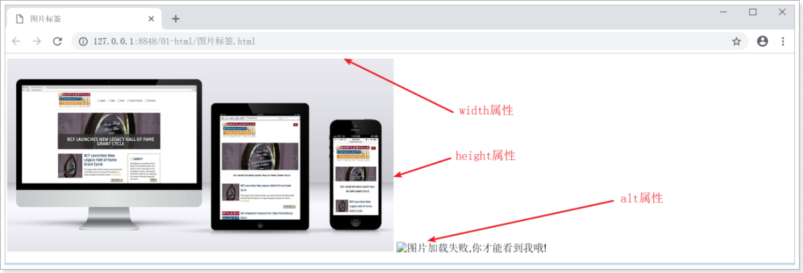

- 图片: 
  - 属性 src \ width \ height\ alt
  - src ：指定需要显示图片的URL（路径）。
  - alt ：图片无法显示时的替代文本。
  - width ：设置图像的宽度。
  - height ：定义图像的高度。

```html
<!-- 代码演示 -->
<!DOCTYPE html>
<html>
    <head>
        <meta charset="utf-8">
        <title>图片标签</title>
    </head>
    <body>
        
        
    </body>
</html>
```

## 4 超链接标签

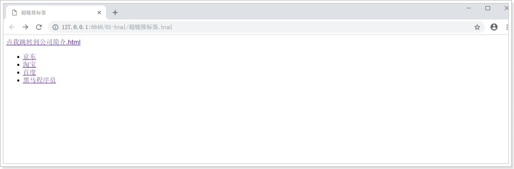

- 超链接: <a></a>
  - 属性 href
  - href：用于确定需要显示页面的路径（URL）
    - target：确定以何种方式打开href所设置的页面。常用取值：*blank、*self 等
      - _blank 在新窗口中打开href确定的页面。
      - _self 默认。使用href确定的页面替换当前页面。

```html
<!-- 代码演示 -->
<!DOCTYPE html>
<html>
    <head>
        <meta charset="utf-8">
        <title>超链接标签</title>
    </head>
    <body>
        <a href="公司简介.html">点我跳转到公司简介.html</a>
        
        <!-- 无序列表: -->
        <ul type="square">
            <!-- 列表项: -->
            <li><a href="http:\\www.jd.com">京东</a></li>
            <li><a href="http:\\www.taobao.com" target="_blank">淘宝</a></li>
            <li><a href="http:\\www.baidu.com" target="_self">百度</a></li>
            <li><a href="http:\\www.itheima.com">黑马程序员</a></li>
        </ul>
    </body>
</html>
```

## 5 表格标签

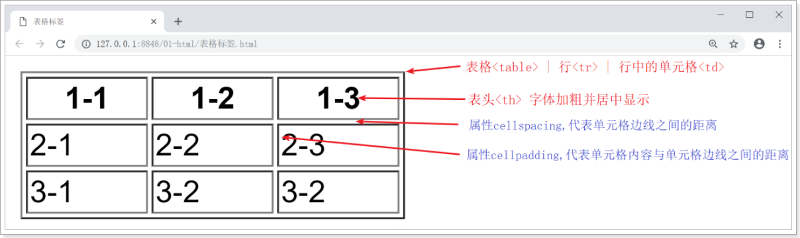

- `<table>`标签用于定义表格，相当于整个表格的容器。
  - border 表格边框的宽度。
  - width 表格的宽度。
  - bgcolor 表格的背景颜色。
  - cell spacing 单元格边线之间的的距离。
  - cell padding 单元格内容与单元格边线之间的距离。
- `<tr>`标签用于定义行
  - align 单元格内容的水平对齐方式, 取值：left 左 、right 右、center 居中。
- `<td>`标签用于定义表格的单元格
- `<th>`标签用于定义表头。单元格内的内容默认居中、加粗。

```html
<!-- 代码演示 -->
<!DOCTYPE html>
<html>
    <head>
        <meta charset="utf-8">
        <title>表格标签</title>
    </head>
    <body>
        <!-- 3x3表格 三行三列 -->
        <table width ="200" border="1" >
            <tr>
                <th>1-1</th>
                <th>1-2</th>
                <th>1-3</th>
            </tr>
            <tr>
                <td>2-1</td>
                <td>2-2</td>
                <td>2-3</td>
            </tr>
            <tr>
                <td>3-1</td>
                <td>3-2</td>
                <td>3-2</td>
            </tr>
        </table>
        <br />
        <table width ="200" border="1" cellpadding="0" cellspacing="0">
            <tr>
                <th>1-1</th>
                <th>1-2</th>
                <th>1-3</th>
            </tr>
            <tr>
                <td>2-1</td>
                <td>2-2</td>
                <td>2-3</td>
            </tr>
            <tr>
                <td>3-1</td>
                <td>3-2</td>
                <td>3-2</td>
            </tr>
        </table>
    </body>
</html>
```

## 6 表格标签-单元格合并

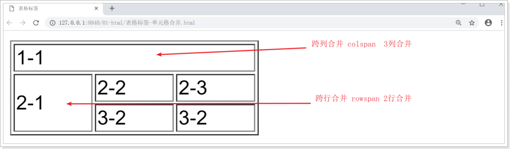

- <td>标签用于定义表格的单元格
  - colspan 单元格可横跨的列数。
  - rowspan 单元格可竖跨的行数。

```html
<!-- 代码演示 -->
<!DOCTYPE html>
<html>
    <head>
        <meta charset="utf-8">
        <title>表格标签</title>
    </head>
    <body>
        <!-- 3x3表格 三行三列 -->
        <table width ="200" border="1" >
            <tr>
                <!-- 跨列合并 1x3 -->
                <td colspan="3">1-1</td>
                <!-- <th>1-2</th>
                <th>1-3</th> -->
            </tr>
            <tr>
                <!-- 跨行合并 2x1 -->
                <td rowspan="2">2-1</td>
                <td>2-2</td>
                <td>2-3</td>
            </tr>
            <tr>
                <!-- <td>3-1</td> -->
                <td>3-2</td>
                <td>3-2</td>
            </tr>
        </table>
    </body>
</html>
```

## 7 div标签span标签

- div标签: div 块级元素标签
  - 霸占屏幕的一行, 就是页面中的一个行
  - 配合CSS样式表使用
- span标签: span 行级元素标签
  - 不会占屏幕一行
  - 配合CSS样式表

```html
<body>
    <div>这是div1</div>
    <div>这是div2</div>
    <span>这是span1</span>
    <span>这是span2</span>
</body>
```

# 第三章 表单 重点

## 1 表单标签form

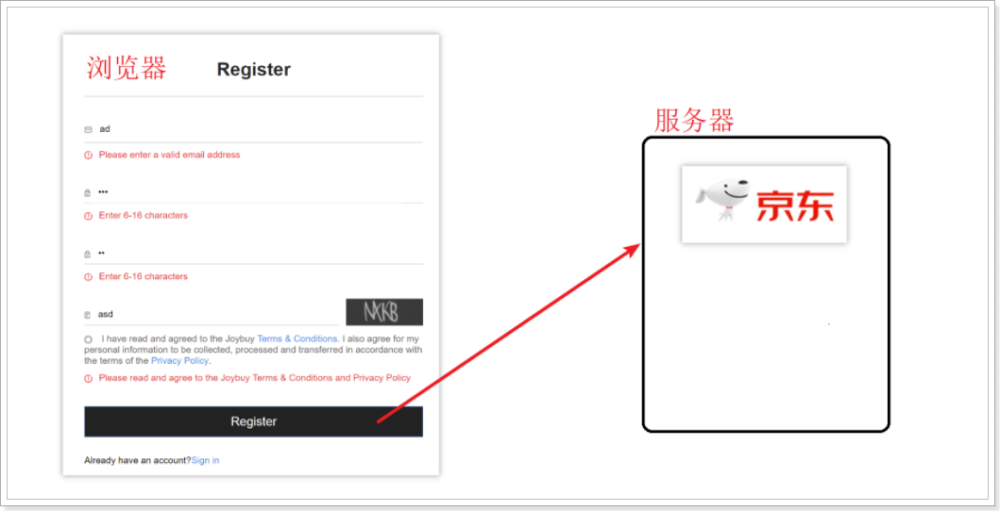

`<form>` 表单标签，表单标签在浏览器上没有任何显示。

- 作用: 收集浏览器用户进行输入的数据, 并把数据发送到服务器端
- 属性
  - action：表示用户输入的内容, 被发送到服务器端的路径
  - method：表单数据发送方式。常用的取值：GET、POST

```html
<body>
    <!--表单-->
    <form action="#" method="get">
        <!--此处的内容可以被表单收集, 提交到服务器-->
    </form>
    <!--此处的内容在<form>标签外，此处数据表单收集不到, 不能提交到服务器-->
</body>
```

## 2 输入标签input

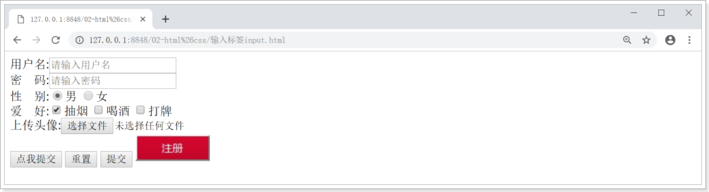

`<input>` 标签用于获得用户输入信息，type属性值不同，搜集方式不同。最常用的标签。

- 文本输入框: 属性type="text" | value="文本框的默认值" | placeholder="输入框预期值的提示信息" | name：发送给服务器的名称
- 密码输入框: 属性type="password" | placeholder="输入框预期值的提示信息" | name：发送给服务器的名称
- 单选按钮: 属性type="radio" | name="定义名字",同名的单选按钮可以保证单选 | checked="checked" 默认选中属性, 需要注意: 属性很特别,属性名和属性值一样,固定写法
- 复选按钮: 属性type="checkbox" | checked="checked" 默认选中属性
- 文件域: 属性type="file" | 文件上传服务器
- 按钮:
  - 普通按钮: 属性 type="button" | value="按钮上显示文本"用于配合后面的技术JavaScript
  - 重置按钮: 属性 type="reset"
  - 提交按钮: 表单数据发送到服务器提交按钮: 属性 type="submit"图片按钮: 属性 type="image"

```html
<form action="#" method="get">
    <!-- 文本输入框 -->
    用户名:<input type="text" value="" placeholder="请输入用户名" name="user"/> <br/>
    <!-- 密码输入框 -->
    密　码:<input type="password" placeholder="请输入密码" name="pass"/> <br/>
    <!-- 单选按钮 -->
    性　别:<input type="radio" name="gender" checked="checked"/>男
          <input type="radio" name="gender" />女 <br/>
    <!-- 复选按钮 -->
    爱　好:<input type="checkbox" checked="checked"/ name="hobby">抽烟
          <input type="checkbox" name="hobby"/>喝酒
          <input type="checkbox" name="hobby"/>打牌 <br />
    <!-- 文件域 -->        
    上传头像:<input type="file" /> <br />
    <!-- 普通按钮 -->
    <input type="button" value="点我提交"/>
    <!-- 重置按钮 -->
    <input type="reset" />
    <!-- 提交按钮 -->
    <input type="submit" />
    <input type="image" src="img/btn.jpg"/>
</form>
```

## 3 下拉菜单

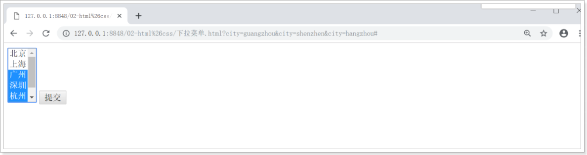

- `<select>` 下拉列表。可以进行单选或多选。需要使用子标签<option>指定列表项
  - 属性name：发送给服务器的名称 | multiple属性：不写默认单选，取值为“multiple”表示多选。| size属性：多选时，可见选项的数目。

- `<option>` 子标签：属于下拉列表中的一个选项（一个条目）。
  - 属性selected ：勾选当前列表项 | value ：发送给服务器的选项值

```html
<form action="#" method="get">
    <!-- 下拉列表 -->
    <select name="city" multiple="multiple" size="5">
        <!-- 列表项 -->
        <option value ="beijing">北京</option>
        <option value ="shanghai">上海</option>
        <option value ="guangzhou">广州</option>
        <option value ="shenzhen">深圳</option>
        <option value ="hangzhou">杭州</option>
        <option value ="tianjin">天津</option>
    </select>

    <input type="submit" />
</form>
```

## 4 多行文本域

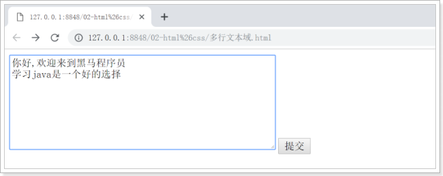

`<textarea>` 文本域。多行的文本输入控件。

- cols属性：文本域的列数
- rows属性：文本域的行数

```html
<form action="#" method="get">
    <!-- 多行文本域 -->
    <textarea name="area" cols="50" rows="8"></textarea>

    <input type="submit" />
</form>
```

## 5 提交方式区别

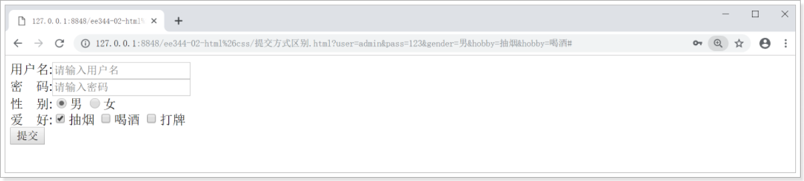

服务器提交方式GET和POST区别

- GET:表单提交的参数,放在浏览器地址栏, 暴露敏感数据; 浏览器的地址栏数据有限的,不适合提交过大的数据	?user=tom&pass=123&gender=女&hobby=抽烟&hobby=喝酒	数据的格式 k=v 多个键值对使用 & 分割	服务器获取提交的数据,依靠是键

  url?key1=val1&key2=val2&key3=val3

- POST:表单提交的参数,不会显示在地址栏上; 不会暴露敏感信息; 没有数据大小的限制

HTTP协议区别:

- GET: 参数放在请求行
- POST: 参数放在请求体

```html
<form action="#" method="post">
    用户名<input type="text"  placeholder="请输入用户名" name="user"/><br />
    密　码<input type="password" placeholder="请输入密码" name="pass" /> <br />
    性　别<input type="radio" name="gender" checked="checked" value="男"/> 男 
         <input type="radio" name="gender" value="女"/> 女 <br />

    爱　好<input type="checkbox" name="hobby" checked="checked" value="抽烟"/>抽烟
         <input type="checkbox" name="hobby" value="喝酒"/>喝酒
         <input type="checkbox" name="hobby" value="打牌"/>打牌 <br />

    <input type="submit" />
</form>
```

# CSS

# 第四章 css样式作用和语法

CSS (Cascading Style Sheets) ：指层叠样式表. 指使用不同的添加方式，给同一个HTML标签添加样式，最后所有的样式都叠加到一起，共同作用于该标签。类似于我们使用的美颜相机.

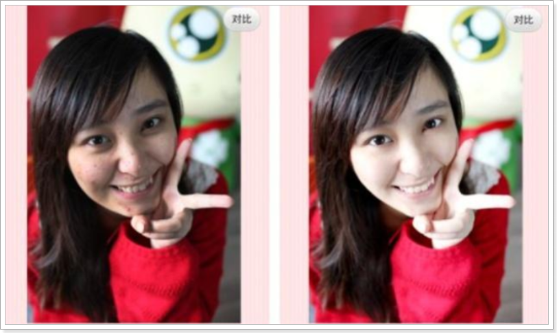

- 主要用于设置HTML页面中的文本内容（字体、大小、对其方式等）、图片的外形（高宽、边框样式、边距等）以及版面的布局等外观显示样式。

- 作用: 美化页面作用. HTML负责显示数据, CSS负责美化效果

- 语法结构

  ```css
  选择器{
      属性名:属性值;
      属性名:属性值;
  }
  ```

  - 选择器: 指定对HTML的哪个标签起作用

  ```css
  div {
      width: 200px;
      height: 200px;
      border: red 1px solid;
  }
  ```

# 第五章 css引入方式

## 1 css引入方式一_行内

- 行内样式:
  - 在HTML标签中添加属性 style="属性:属性值"
  - 作用域最小,作用当前标签; 行内样式的优先级最高

```html
<body>
    <h3 style="color: red;">h3标签</h3>
    <h3>哈哈</h3>
</body>
```

## 2 css引入方式二_内部

- 内部样式:
  - 在HTML页面里面写CSS代码, 一般写在<head>中, 使用标签 style , 属性: type="text/css"
  - 作用是当前整个页面有效

```html
<html>
    <head>
        <meta charset="UTF-8">
        <title></title>
        <style type="text/css">
            h3{color: chocolate;}
        </style>
    </head>
    <body>
        <h3>h3标签</h3>
        <h3>哈哈</h3>
    </body>
</html>
```

## 3 css引入方式三_外部

- 外部样式:
  - CSS样式定义在另一个文件中,后缀名.css (文本文件)
  - 在HTML页面中,引入样式表, 使用link标签 写在head中
    - 属性: href="css文件路径" | type="text/css" | rel="引入的文件和当前页面是什么关系"
  - 作用范围最大,哪个页面引入,哪个有效

```html
<html>
    <head>
        <meta charset="UTF-8">
        <title></title>
        <link href="css/1.css"  type="text/css" rel="stylesheet"/>
    </head>
    <body>
        <h3>h3标签</h3>
        <h3>哈哈</h3>
    </body>
</html>
```

css/1.css

```css
h3{
    color: blue;
}
```

# 第六章 css选择器

## css基本选择器

选择器就是对HTML标签设置样式作用

- 标签元素选择器用HTML标签名称作为选择器，按标签名称分类，为页面中某一类标签指定统一的CSS样式。其基本语法格式如下：`标签名 {属性1:属性值1; 属性2:属性值2; 属性3:属性值3; }`
- ID选择器id选择器使用“#”进行标识，后面紧跟id名.其基本语法格式如下：`#id名 {属性1:属性值1; 属性2:属性值2; 属性3:属性值3; }`需要在html标签上,添加属性id="选择器名", 配合ID选择器进行使用
- class选择器,类选择器类选择器使用“.”（英文点号）进行标识，后面紧跟类名其基本语法格式如下：`.类名 {属性1:属性值1; 属性2:属性值2; 属性3:属性值3; }`需要在html标签上,添加属性class="选择器名", 配合class选择器进行使用

```
 注意:
     尽量不要使用ID选择器,如果需要使用ID选择器. 要保证：ID的属性值具有唯一性
     因为后面学习的JavaScript技术中: 对象document中的方法getElementById("one"), 会把标签变成对象,只要找到第一个了,后面就不找了. 所以,ID的属性值要唯一.
     当使用ID选择器和class选择器, 对同一个标签设置相同属性时, ID选择器 优先级高于 class选择器
```

```html
<!DOCTYPE html>
<html>
    <head>
        <meta charset="UTF-8">
        <title></title>
        <style type="text/css">
            /*标签元素选择器,选择器名字和标签名相同*/
            h1{
                color: red;
            }
            /*ID选择器*/
            #one{
                color: blue;
            }
            /*class选择器*/
            .two{
                color: yellow;
            }
        </style>
    </head>
    <body>
        <h1>123</h1>
        <h1>456</h1>       
        <h2 id="one">789</h2> 
        <h2 class="two">789</h2>
    </body>
</html>
```

# 第七章 css常用属性

## 1 css边框属性

- border ：设置边框的样式
  - 格式：宽度 样式 颜色
  - 例如：style=”border:1px solid #ff0000” ，1像素实边红色。
  - 样式取值：solid 实线，none 无边，double 双线 等
- width、height：用于设置标签的宽度、高度。

```html
<!DOCTYPE html>
<html>
    <head>
        <meta charset="UTF-8">
        <title></title>
        <style type="text/css">
            div{
                width: 200px;
                height: 200px;
                /*设置边框 粗细,颜色,样式(实线,虚线,点划线,双实线)*/
                /*border-right: 5px  solid yellow;*/
                border: 10px solid  red;

            }
        </style>
    </head>
    <body>
        <div>我是div</div>
    </body>
</html>
```

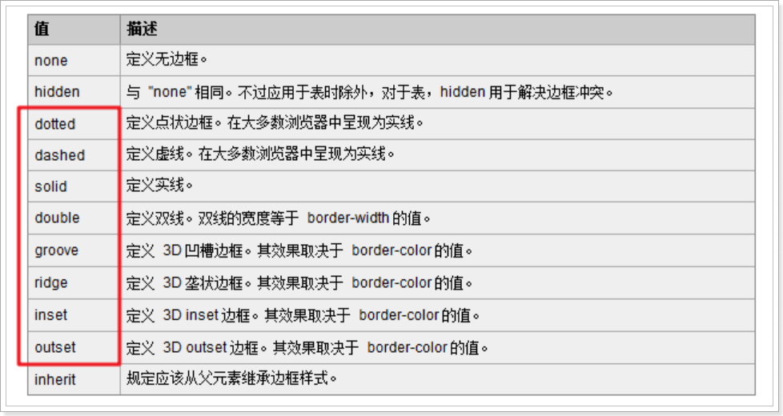

## 2 css转换属性

语法格式: `选择器{display:属性值}`常用的属性值：

- inline：此元素将显示为行内元素（行内元素默认的display属性值）, 常见行内元素有: `<span>、<a>`
- block：此元素将显为块元素（块元素默认的display属性值）,常见块元素有:`<div>、<h1>、<ul>`
- none：此元素将被隐藏，不显示，也不占用页面空间。

```html
<!DOCTYPE html>
<html lang="en">
<head>
    <meta charset="UTF-8">
    <title>Title</title>
    <style>
        div,span {
            border : 1px solid red;
        }
    </style>
</head>
<body>
    <div style="display: inline">这是div1</div>
    <div>这是div2</div>
    <span style="display: block">这是span1</span>
    <span style="display:none">这是span2</span>
</body>
</html>
```

## 3 css字体属性

常用的属性值：

- font-size:文本大小
- font-family: 字体
- color: 颜色

```html
<!DOCTYPE html>
<html>
    <head>
        <meta charset="UTF-8">
        <title></title>
        <style type="text/css">
            div{
                font-family: 楷体;
                font-size: 32px;
                color: red;
            }
        </style>
    </head>
    <body>
        <div>我是div</div>
    </body>
</html>
```

## 4 css背景属性

常用的属性值：

- background-color 背景色
- background-image 背景图

```html
<!DOCTYPE html>
<html>
    <head>
        <meta charset="UTF-8">
        <title></title>
        <style type="text/css">
            /*
            body{
                background-color: red;
                background-image: url(img/btn.jpg);
            }*/
            
            div{
                width: 200px;
                height: 200px;
                
                background-image: url(img/btn.jpg);
                background-color: blue;
            }
        </style>
    </head>
    <body>
        <div>我是div</div>
    </body>
</html>
```

## 5 css盒子模型

所谓盒子模型就是把HTML页面中的元素看作是一个矩形的盒子，也就是一个盛装内容的容器。 

每个矩形都由元素的内容（content）、内边距（padding）、边框（border）和外边距（margin）组成。 

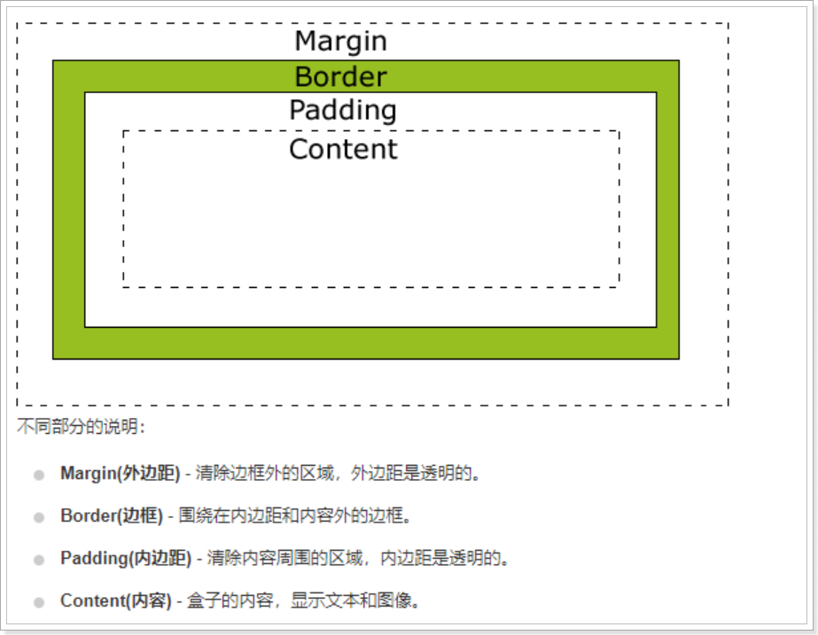


什么是盒子模型: CSS的 框模型 (Box Model) 规定了元素框 处理元素内容、内边距、边框 和 外边距 的方式。

- 边框 border
  - 也可以使用下面四个单端的属性, 分别设置上、右、下、左 的边框：
  - border-top-style | border-right-style | border-bottom-style | border-left-style
- 外边距：margin, 设置不同元素之间, 它们边框与边框之间的距离
  - 也通过使用下面四个单独的属性，分别设置上、右、下、左 的外边框：
  - margin-top | margin-right | margin-bottom | margin-left
- 内边距 padding, 设置元素边框与元素内容之间的距离
  - 也通过使用下面四个单独的属性，分别设置上、右、下、左 的内边距：
  - padding-top | padding-right | padding-bottom | padding-left


css盒子模型框模型 (Box Model) 多属性值使用:

- margin: 50px; 上下左右
- margin: 10px 50px; 上下 10 , 左右50
- margin: 10px 20px 30px; 上10 ,左右20, 下30
- margin: 10px 20px 30px 40px; 顺时针 上 右 下 左
- margin: 0 auto; 上下0, 左右距离自动调整(居中)

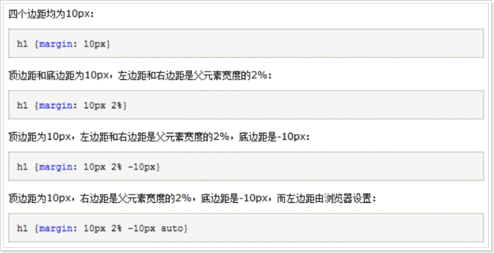

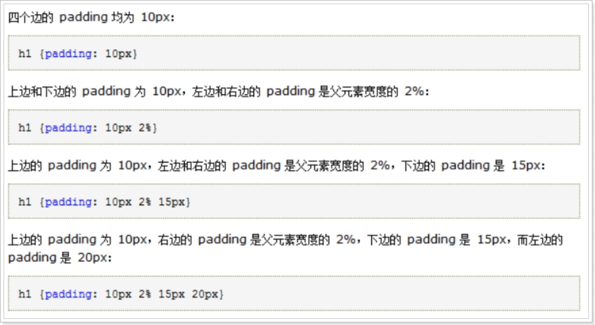

  

准备工作:

```html
<body>
    <div id="outDiv">
        <div id="inDiv"></div>
    </div>
</body>
```

```
需求1、先创建一个div，他的内部也创建一个div，同时设置边框
需求2、外层div背景色蓝色，内部div背景色为绿色
需求3、设置内部div的外边距10px，内边距为50px
```

```html
<!DOCTYPE html>
<html lang="en">
<head>
    <meta charset="UTF-8">
    <title>Title</title>
    <style>
        div {
            /*需求1、先创建一个div，他的内部也创建一个div，同时设置边框*/
            border : 1px solid red;
        }

        /*需求2、外层div背景色蓝色，内部div背景色为绿色*/
        #outDiv {
            background: blue;
        }

        #inDiv {
            /*内部div背景色为绿色*/
            background: green;

            /*需求3、设置内部div的外边距10px，内边距为50px*/
            margin: 10px;
            padding: 50px;
        }

    </style>
</head>
<body>
<div id="outDiv">
    <div id="inDiv"></div>
</div>
</body>
</html>
```


作业: 扩展需求: 3个div

 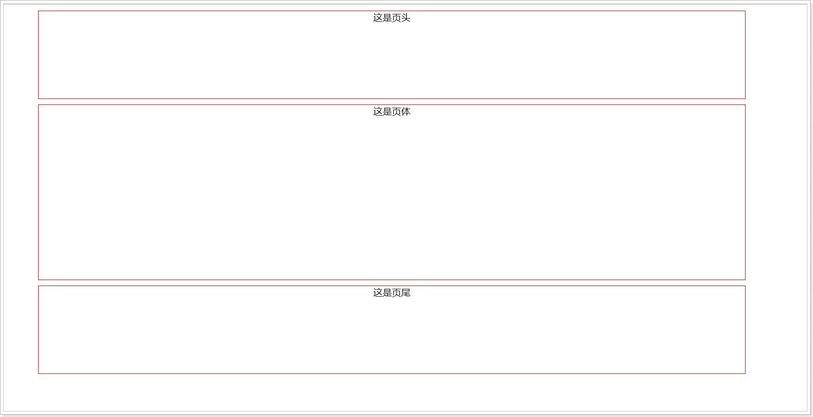

```html
<!DOCTYPE html>
<html lang="en">
<head>
    <meta charset="UTF-8">
    <title>Title</title>
    <style>
        div {
            border : 1px solid red;
            text-align : center;
            width : 80%;
            height : 150px;
            margin : 10px auto;
        }

        #divbody {
            height : 300px;
        }
    </style>
</head>
<body>
    <div>这是页头</div>
    <div id="divbody">这是页体</div>
    <div>这是页尾</div>
</body>
</html>
```

# 第八章 注册页面案例

## 1 div+css注册页面案例

所有的html标签中，表单标签是最重要的。在实际开发中，最经典的实例就是用户注册，覆盖了表单标签的所有的元素。效果图如下：

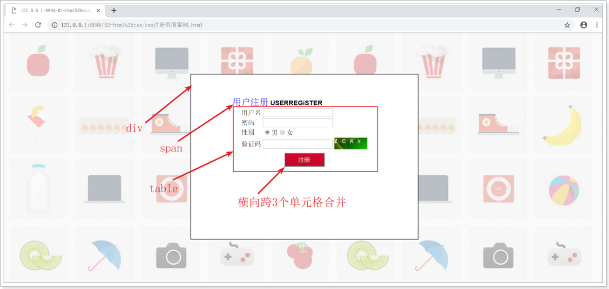

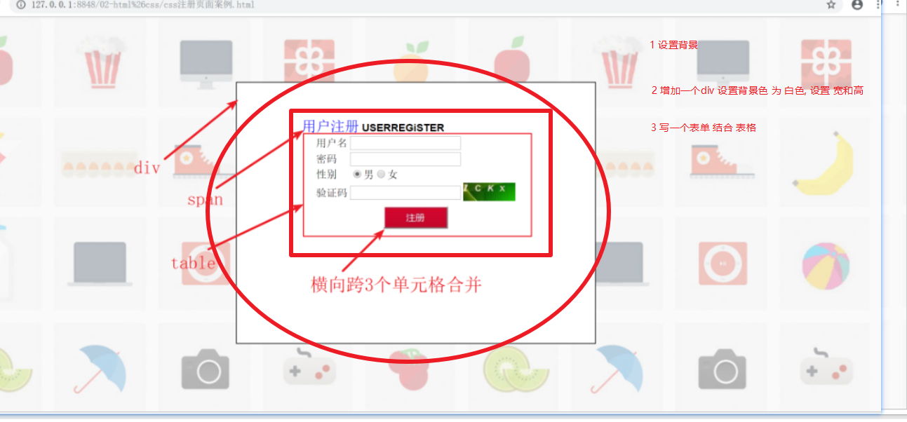

```html
<!DOCTYPE html>
<html lang="en">
<head>
    <meta charset="UTF-8">
    <title>Title</title>
    <style>
        body {
            background-image: url("img/bg.jpg");
        }

        #myDiv {
            border: 1px solid red;
            width : 600px;
            height: 400px;
            background-color: white;
            margin: 100px auto;
        }
    </style>
</head>
<body>
    <div id="myDiv">
        <center>
            <!--写一个表单-->
            <form action="01.html" method="post">
                <table style="margin-top: 100px">
                    <tr>
                        <td colspan="3">
                            <span style="font-size:30px; color:blue">用户注册</span>
                            <b>USERREGISTER</b>
                        </td>
                    </tr>
                    <tr>
                        <td>用户名</td>
                        <td><input type="text" name="username"/></td>
                        <td></td>
                    </tr>
                    <tr>
                        <td>密码</td>
                        <td><input type="password" name="password"/></td>
                        <td></td>
                    </tr>
                    <tr>
                        <td>性别</td>
                        <td>
                            <input type="radio" name="sex" value="男"/> 男
                            <input type="radio" name="sex" value="女"/> 女
                        </td>
                        <td></td>
                    </tr>
                    <tr>
                        <td>验证码</td>
                        <td>
                            <input type="text" name="code_form"/>
                        </td>
                        <td>
                            
                        </td>
                    </tr>
                    <tr>
                        <td></td>
                        <td><input type="image" src="img/btn.jpg"/> </td>
                        <td></td>
                    </tr>

                </table>
            </form>
        </center>
    </div>
</body>
</html>
```

 