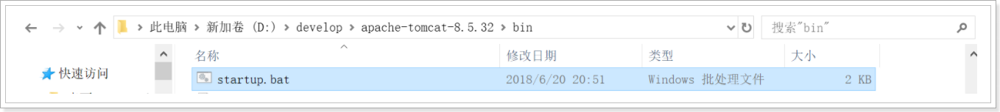
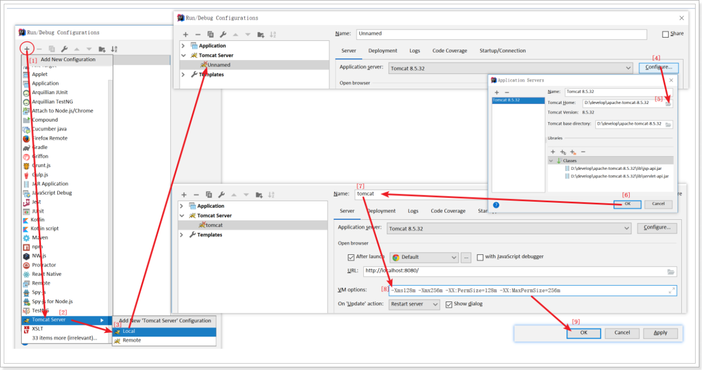

# 第一章 Web开发简述

## 1 什么是Web

Web（互联网总称）

web（World Wide Web）即全球广域网，也称为万维网，它是一种基于超文本和HTTP的、全球性的、动态交互的、跨平台的分布式图形信息系统。

## 2 什么是Java Web开发

Java Web，是用Java技术来解决相关web互联网领域的技术总和。

## 3 Java Web开发中的资源

- 静态web资源
  - HTML
  - CSS
  - JS
- 动态web资源
  - Servlet
  - JSP


## 4 URL 请求路径

URL （Uniform Resource Locator） ，统一资源定位符是对互联网上资源位置的一种表示，互联网上的每个文件都有一个唯一的URL。

- 完整格式如下

```http
协议://域名:端口号/资源位置?参数=值

* 协议，http、https、ftp等
* 域名，域名或IP地址，都可以访问WEB资源
* 端口号，程序必须使用端口号，才可以让另一个计算机访问。http协议的默认端：80
* 资源位置，用于描述WEB资源在服务器上的位置。
* 参数=值，浏览器和服务器交互传递的数据
```

- 例如：

```http
常见路径(访问 京东-笔记本电脑)
https://list.jd.com/list.html?cat=670,671,672
常见路径(访问 京东秒杀-电脑办公)
https://miaosha.jd.com/category.html?cate_id=29
常见路径(访问 传智播客-JavaEE)
http://www.itcast.cn:80/subject/javaeezly/
```


## 5 软件开发的结构分类

- CS结构的软件
  - CS：Client/Server 客户端和服务器，这种软件往往需要安装。比如QQ、迅雷、播放器。
  - 优缺点：
    - 优点：
      - 可以减轻服务器端压力，将部分代码写到客户端。
      - 界面很美观。
    - 缺点：
      - 一旦服务器更新了，客户端也需要更新。
      - 分布式开发比较弱。
- **BS结构的软件**
  - BS：Browser/Server 浏览器和服务器，这种软件不需要安装，只需要通过浏览器就可以访问。
  - 优缺点：
    - 优点：
      - 服务器一旦更新，不需要更新客户端，因为客户端就是浏览器
      - 比较强的分布式能力
    - 缺点：
      - 服务器端压力会比较大。
      - 界面效果不如CS结构软件。


## 6 WEB服务器(对外提供服务的机器)

- 服务器：
  - 硬件：其实就是一台电脑（这台电脑配置要求很高）。 1PB  = 1024TB  ; 1Tb = 1024GB 
  - 软件：需要在这台电脑上安装web服务器的软件。


重点重点重点


## 7 常见的Web服务器

常见的WEB服务器：

- Tomcat：Apache组织提供的一个开源的免费的web服务器。满足EE的Servlet和JSP的规范。
- WebSphere ：IBM公司开发的一个收费的大型web服务器。满足了EE开发的所有规范。
- WebLogic：BEA公司开发的一个收费的大型web服务器。满足了EE开发的所有规范。
- IIS：应用在.NET平台上, asp。
- Apache ：应用在PHP平台上。


# 第二章 Tomcat服务器

## 1 什么是Tomcat


- Tomcat就是一个web的服务器，用来发布web项目。
- tomcat 目前存在很多版本，希望大家了解tomcat的版本，从而知道自己的创建的项目使用的是几版本规范，不同版 本的规范技术可能不同。我们学习的JavaEE 7.0，Servlet规范3.1，tomcat至少使用8.5版本。
- 官网地址：http://tomcat.apache.org

| Tomcat版本 | Servlet版本 | JavaEE版本 |
| ---------- | ----------- | ---------- |
| **9.0.x**  | **4.0**     | 8.0        |
| **8.5.x**  | **3.1**     | 8.0        |
| **8.0.x**  | **3.1**     | 7.0        |
| **7.0.x**  | **3.0**     | 6.0        |
| **6.0.x**  | **2.5**     | 5.0        |

## 2 Tomcat安装

步骤一：下载一个tomcat服务器软件.

```http
https://tomcat.apache.org/download-80.cgi
```

步骤二：解压下载好的zip文件.

```http
将解压后的文件copy到一个没有中文和空格的路径下即可.
例如：D:\develop\apache-tomcat-8.5.32
```

## 3 Tomcat启动和访问

步骤一：tomcat解压目录/bin/startup.bat 双击运行启动tomcat



步骤二：访问路径：<http://localhost:8080/>


关闭tomcat


## 4 解决Tomcat服务器启动时遇到的问题

### 4.1 JAVA_HOME的环境变量配置

Tomcat运行需要依赖Java环境，也就是说需要在电脑上安装了JDK之后才可以安装和启动Tomcat。因为Tomcat启动的时候需要使用JRE的环境。必须要配置JAVA_HOME环境变量，如果没有配置JAVA_HOME环境变量，那么服务器在启动的时候就会一闪然后关闭。


### 4.2 Tomcat端口号冲突的问题

当同一台计算机启动两个tomcat时，第二个tomcat将会在控制台抛异常，摘要信息如下：

```http
严重: Failed to initialize end point associated with ProtocolHandler ["http-bio-8080"]
java.net.BindException: Address already in use: JVM_Bind <null>:8080
...
Caused by: java.net.BindException: Address already in use: JVM_Bind
...
```

控制台将出现大量异常信息，描述的是3个端口被占用（**8080**、8009、8005 ）

通过 `tomcat/conf/server.xml` 修改端口号。


## 5 Tomcat目录结构

```http
bin：脚本目录
	启动脚本：startup.bat
	停止脚本：shutdown.bat
conf：配置文件目录 (config /configuration)
	核心配置文件：server.xml
	用户权限配置文件：tomcat-users.xml
	所有web项目默认配置文件：web.xml
lib：依赖库，tomcat和web项目中需要使用的jar包
logs：日志文件.
	localhost_access_log.*.txt tomcat记录用户访问信息，星*表示时间。
	例如：localhost_access_log.2018-07-07.txt
temp：临时文件目录，文件夹内内容可以任意删除。
webapps：默认情况下,发布的WEB项目所存放的目录。
work：tomcat处理JSP页面的工作目录。
```

## 6 Tomcat的项目发布方式(重点重点重点)

```
1. 直接将项目放到webapps目录下即可。
* /hello：项目的访问路径-->虚拟目录
* 简化部署：将项目打成一个war包，再将war包放置到webapps目录下。
* war包会自动解压缩

2. 配置conf/server.xml文件
在<Host>标签体中配置
<Context docBase="D:\hello" path="/hehe" />
* docBase:项目存放的路径
* path：虚拟目录

3. 在conf\Catalina\localhost创建任意名称的xml文件。在文件中编写
<Context docBase="D:\hello" />
* 虚拟目录：xml文件的名称
```

1. 将项目复制到tomcat/webapps中


2. 启动Tomcat服务器，双击 startup.bat
3. 访问项目

```http
http://localhost:8080/aaa/index.html
```


## 7 IDEA 中集成 Tomcat

- 步骤1：首先打开idea开发工具，然后点击Run菜单，选择`Edit Configurations...`菜单，会进入`Run/Debug Configurations`对话框
- 

- 步骤2：按图操作，完成Idea中添加Tomcat服务器，进行Tomcat软件关联

- VM options填写内容（可省略）：`-Xms128m -Xmx256m -XX:PermSize=128m -XX:MaxPermSize=256m`

  

## 8 IDEA中发布web项目

### 创建web项目

创建Module，选择JavaWeb应用程序，选择版本为JavaEE 7

- 步骤1：在idea中New Module/Web Application

  


- 步骤2：创建模块

  

### 发布web项目

- 步骤1：配置应用访问路径

  首先打开idea开发工具，然后点击Run菜单，选择`Edit Configurations...`菜单，打开`Run/Debug Configurations`对话框，进行如图配置

  

  

- 步骤2：更改web项目发布路径，到 Tomcat软件的webapps目录下(可选的)

  

- 步骤3：启动Tomcat服务器，访问项目

  

```http
http://localhost:8080/web01
```

## 9 web项目目录结构（重要）

- 在JavaEE规范中，WEB项目存在一定的目录结构，具体结构如下：

```http
项目名称（存放于：Tomcat软件安装目录中，webapps目录下的子文件夹）
	|-----静态资源 HTML，CSS，JS
	|-----WEB-INF   (客户不能直接通过浏览器进行访问）
		|----web.xml  当前WEB项目的核心配置，Servlet2.5必须有，3.0以后可省略
		|----lib	  当前WEB项目所需要的第三方的jar的存放位置。
		|----classes  Java源码编译后生成class文件存放的位置。
```

- Idea创建的web项目结构 与 发布到webapps目录下后的web项目结构对比 

  

# 第三章 HTTP协议

## 1 Http简介

### 什么是Http协议

HTTP协议：超文本传输协议（HTTP，HyperText Transfer Protocol)是互联网上应用最为广泛的一种网络协议。用于定义WEB浏览器与WEB服务器之间交换数据的过程。


必须先有请求,才会有响应

### Http协议的作用及特点

HTTP协议的作用

- HTTP协议是学习JavaWEB开发的基石，不深入了解HTTP协议，就不能说掌握了WEB开发，更无法管理和维护一些复杂的WEB站点。

  


HTTP协议的特点

- 基于请求/响应模型的协议。
  - 请求和响应必须成对；
  - 先有请求后有响应。
- 简单快捷
  - 因为发送请求的时候只需要发送请求方式和请求路径即可
- HTTP协议默认的端口:80
  - 例如：`http://www.itheima.com:80`

### Http协议的版本

- HTTP/1.0，发送请求，创建一次连接，获得一个web资源，连接断开。
- HTTP/1.1，发送请求，创建一次连接，获得多个web资源，连接断开。

### HTTP协议有两种报文格式：

- 请求报文：由客户端向服务器端发出的报文。
- 响应报文：从服务端到客户端的报文。


## 2 Http协议详解

### 2.1 Http请求报文详解

HTTP请求报文：由客户端向服务器端发出的报文。

HTTP请求报文格式：包含请求行、请求头、空行、请求体 四个部分


#### 请求行

```http
例如：POST /web01/login.html HTTP/1.1
请求行必须在HTTP请求格式的第一行。
请求行格式：请求方式 资源路径 协议/版本

请求方式：协议规定7种，常用两种：GET和POST
	GET请求：
		将请求参数追加在URL后面，不安全。例如：login.html?username=tom&password=1234
		URL长度限制GET请求方式的数据大小。
		没有请求体
	POST请求
		请求参数显示请求体处，较安全。
		请求数据大小没有显示。
	只有表单设置为method=”post”才是post请求.其他的都是get请求。
	常见GET请求：地址栏直接访问、<a href=””>、 等
			
```

#### 请求头

请求头: 描述了客户端向服务器发送请求时使用的http协议类型，所使用的编码，以及发送内容的长度，referer，等等。

请求头也是用的键值对key:value

| 常见请求头     | 描述                                                         |
| -------------- | ------------------------------------------------------------ |
| **Referer**    | 浏览器通知服务器，当前请求来自何处。如果是直接访问，则不会有这个头。常用于：防盗链 |
| **Cookie**     | 与会话有关技术，用于存放浏览器缓存的cookie信息。             |
| **User-Agent** | 浏览器通知服务器，客户端浏览器与操作系统相关信息             |

#### 请求体

```http
通常情况下，只有post请求方式才会使用到请求体，请求体中都是用户表单提交的数据，每一项数据都使用键值对key=value，多组值使用&相连。
	例如；username=tom&password=1234
```


#### Http请求报文演示

- 创建页面，编写“login.html”，并提供表单，分别设置表单的提交方式为：get和post。将表单提交位置设置成#，表示提交到当前表单。

  

```html
<form action="#" method="post">
    用户名：<input type="text" name="username" value=""/> <br/>
    密　码：<input type="text" name="password" value=""/> <br/>
    <input type="submit" />
</form>

```

观看下图，我们采用GET请求方式、POST请求方式的抓包结果：（Chrome浏览器）

- GET请求抓包数据：

  

- POST请求抓包数据：

  

### 2.2 Http响应报文详解

响应报文：从服务端到客户端的报文。

HTTP响应报文格式：响应行、响应头、空行、响应体 四个部分


#### 响应行

```http
例如：HTTP/1.1 200 OK
格式：协议/版本 状态码  状态码描述
	状态码：服务器与浏览器用于确定状态的固定数字号码
		200 ：请求成功。
		302 ：请求重定向。
		304 ：请求资源没有改变，访问本地缓存。
		404 ：请求资源不存在。通常是用户路径编写错误，也可能是服务器资源已删除。
		500 ：服务器内部错误。通常程序抛异常。
		
```

#### 响应头

响应头: 用来描述服务器回给客户端浏览器的content的一些描述，例如: 我是什么服务器，我返回的是啥编码，我返回的内容有多长等等

响应头也是用的键值对 key:value

| 常见请求头              | 描述                                                |
| ----------------------- | --------------------------------------------------- |
| **Location**            | 指定响应的路径，需要与状态码302配合使用，完成跳转。 |
| **Content-Disposition** | 文件下载的时候使用。通过浏览器以下载方式解析正文    |
| **Set-Cookie**          | 与会话相关技术。服务器向浏览器写入cookie            |
| **Refresh**             | 定时刷新                                            |

#### 响应体

响应体，就是服务器发送给浏览器的正文。

```html
<!DOCTYPE html>
<html >
<head>
    <meta charset="UTF-8">
    <title>Title</title>
</head>
<body>
    <form action="#" method="post">
        用户名：<input type="text" name="username" value=""/> <br/>
        密　码：<input type="text" name="password" value=""/> <br/>
        <input type="submit"/>
    </form>
</body>
</html>
```


#### Http响应报文演示

如下图，我们提供的响应的抓包结果（Chrome浏览器）


# 第四章 Servlet

## 1 servlet的概述

### 1.1 什么是servlet

- Servlet（Server Applet）是Java Servlet的简称，称为服务器端小程序，用Java编写的服务器端程序，具有独立于平台和协议的特性，主要功能在于交互式地浏览和生成数据，生成动态Web内容。
- 狭义的Servlet是指Java语言实现的一个接口
- 广义的Servlet是指任何实现了这个Servlet接口的类，一般情况下，人们将Servlet理解为后者。Servlet运行于支持Java的应用服务器中。从原理上讲，Servlet可以响应任何类型的请求，但绝大多数情况下Servlet只用来扩展基于HTTP协议的Web服务器。

### 1.2 使用Servlet

- 编写一个Java类实现Servlet的接口
- 在web.xml中，配置Servlet

## 2 servlet的入门

步骤一：创建包和类, 实现servlet的接口

```java
package com.itheima.servlet.demo1;

import java.io.IOException;

import javax.servlet.Servlet;
import javax.servlet.ServletConfig;
import javax.servlet.ServletException;
import javax.servlet.ServletRequest;
import javax.servlet.ServletResponse;

/**
 * Servlet的入门程序
 */
public class HelloServlet implements Servlet{
    @Override
    /**
	 * 用来处理客户的请求，并且对请求作出响应的方法
	 */
    public void service(ServletRequest servletRequest, ServletResponse servletResponse) throws ServletException, IOException {
        System.out.println("第一个servlet程序。。");
        // 向页面输出一个HelloServlet字符串:
        servletResponse.getWriter().print("<font color='red'>hello servlet</font>");
    }

    //省略剩下方法，采用默认实现
}
```

步骤二：在web.xml中配置这个类

```xml
<!--配置servlet-->
<servlet>
    <!--配置servlet名称-->
    <servlet-name>hello</servlet-name>
     <!--配置servlet类的全路径-->
    <servlet-class>com.itheima.servlet.HelloServlet</servlet-class>
</servlet>
 <!--配置servlet映射关系-->
<servlet-mapping>
    <!--配置关联的servlet名称-->
    <servlet-name>hello</servlet-name>
    <!--配置 访问路径-->
    <url-pattern>/hello</url-pattern>
</servlet-mapping>
```

步骤三：访问servlet

```http
http://localhost:8080/web01/hello
```


## 3 servlet程序执行原理


**Tomcat引擎执行的操作**

1. 接受并解析客户端浏览器的请求 "/day28/hello"
2. 创建2个对象 request, response
3. 在webapps找访问的资源 "com.itheima.servlet.HelloServlet"
4. 反射技术创建类的对象
5. 调用对象中的方法 service, 传递参数 request, response
6. 数据写在了 reponse对象的缓冲区中
7. service方法结束后,数据从response对象的缓冲区取出,组装成HTTP的响应信息, 回传给浏览器


## 4 servlet生命周期

Servlet生命周期定义了一个Servlet如何被加载、初始化，以及它怎样接收请求、响应请求，提供服务。在讨论Servlet生命周期之前，先让我们来看一下这几个方法：

- `init(ServletConfig config)` Servlet对象的初始化方法，对象被创建的时候调用

```http
在Servlet的生命周期中，仅执行一次init()方法，
它是在服务器装入Servlet时执行的，可以配置服务器，以在启动服务器或客户端首次访问Servlet时装入Servlet。
无论有多少客户端访问Servlet，都不会重复执行init()；
```

- `service(request,response)`客户端访问一次,执行一次 

```http
它是Servlet的核心，每当一个客户端请求一个HttpServlet对象，该对象的Service()方法就要调用，而且传递给这个方法一个“请求”（ServletRequest）对象和一个“响应”（ServletResponse）对象作为参数。
在HttpServlet中已存在Service()方法。默认的服务功能是调用与HTTP请求的方法相应的do功能。
```

- `destory()`Servlet对象销毁之前调用

```http
仅执行一次，当Servlet从服务器中移除或者服务器关闭的时候Servlet对象被销毁，在销毁前，里面的destroy方法就会执行，然后垃圾回收器就会将其Servlet对象回收掉。
一个Servlet在运行service()方法时可能会产生其他的线程，因此需要确认在调用destroy()方法时，这些线程已经终止或完成。
```

- Servlet对象什么时候被创建

  - Servlet默认第一次访问的时候,对象被创建

  - Tomcat服务器启动的时候创建对象,需要修改web.xml (一般不配置)

    ```xml
    <load-on-startup>...</load-on-startup>
    ```

- Servlet对象什么时候被销毁

  - 停止Tomcat服务器
  - WEB项目从服务器移除

代码演示：

```java
public class LifeServlet implements Servlet{
    @Override
    public void init(ServletConfig servletConfig) throws ServletException {
        System.out.println("LifeServlet ... init 执行了");
    }

    @Override
    public void service(ServletRequest servletRequest, ServletResponse servletResponse) throws ServletException, IOException {
        System.out.println("LifeServlet ... service 执行了");
    }

    @Override
    public void destroy() {
        System.out.println("LifeServlet ... destroy 执行了");
    }

	//其他方法省略，采用默认实现
}
```

## 5 Servlet的启动时加载(了解)

### 4.5.1 什么是Servlet启动时加载

Servlet启动时加载, 就是让(Tomcat)服务器启动的时候创建Servlet的对象

Servlet默认是在第一次访问的时候创建的对象。

### 4.5.2 为什么使用启动时加载

Servlet对象是第一次被访问的时候会被创建的，init方法就会执行。

假设在init方法中做了一些比较耗时的操作（比如：加载了一些配置文件并且解析可能需要花费3秒钟）。那么，第一次访问这个Servlet的时候，需要等待3秒钟。我们通过配置Servlet启动时加载就可以避免第一次访问Servlet时，等待3秒了。

配置Servlet启动时加载，需要修改web.xml文件，格式如下，配置后，Tomcat服务器启动的时候会完成Servlet对象创建

```http
格式： <load-on-startup> ... </load-on-startup>
```

### 5.3 web.xm配置完成启动时加载

```xml
<servlet>
    <servlet-name>life</servlet-name>
    <servlet-class>com.itheima.servlet.LifeServlet</servlet-class>
    <load-on-startup>2</load-on-startup>
</servlet>
<servlet-mapping>
    <servlet-name>life</servlet-name>
    <url-pattern>/life</url-pattern>
</servlet-mapping>
```

## 6 serlvet的访问路径配置

### url-pattern的配置

url-pattern配置方式共有三种：完全匹配、目录匹配、扩展名匹配 

```java
public class PathServlet implements Servlet {
    @Override
    public void service(ServletRequest servletRequest, ServletResponse servletResponse) throws ServletException, IOException {
        System.out.println("PathServlet...执行了");
    }
    //其他方法省略
}
```

1.完全匹配

```http
/path : 浏览器地址栏必须写 /path
```

2.目录匹配	：

```http
/aaa/bbb/* : 浏览器地址栏可以写 /aaa/bbb/任意
```

3.扩展名匹配 

```http
*.abc : 浏览器地址栏可以写 任意.abc
```

注意：目录匹配和后缀名匹配不能同时使用

```http
错误的写法: /aaa/bbb/*.abc
```

代码演示：

```xml
<!-- 
tomcat获得匹配路径时，访问优先级顺序：完全路径匹配  >  目录匹配  >  扩展名匹配
注意：开发中servlet配置路径选择精确匹配
-->
<servlet>
    <servlet-name>path</servlet-name>
    <servlet-class>com.itheima.servlet.PathServlet</servlet-class>
</servlet>
<servlet-mapping>
    <servlet-name>path</servlet-name>
    <!-- 完全路径匹配 -->
    <!-- <url-pattern>/path</url-pattern> -->
    <!-- 目录匹配 -->
    <!-- <url-pattern>/aaa/bbb/*</url-pattern> -->
    <!-- 扩展名匹配 -->
    <url-pattern>*.abc</url-pattern>
</servlet-mapping>
```

```xml
<!-- 
tomcat获得匹配路径时，访问优先级顺序：完全路径匹配  >  目录匹配  >  扩展名匹配
注意：开发中servlet配置路径选择精确匹配
-->
<servlet>
    <servlet-name>path</servlet-name>
    <servlet-class>com.itheima.servlet.PathServlet</servlet-class>
</servlet>
<servlet-mapping>
    <servlet-name>path</servlet-name>
    <url-pattern>/*</url-pattern>
</servlet-mapping>
```


## 7 Tomcat的全局web.xml (了解)

  tomcat目录中/conf/web.xml 是全局配置文件,所有的WEB项目都使用

  自己的写web.xml只有你自己的项目使用

  当全局配置web.xml和自己的web.xml冲突了,听自己的

```xml
<session-config>
    <session-timeout>30</session-timeout>
</session-config>
```


# 第五章 HttpServlet

## 1 HttpServlet概述

SUN设计Servlet之初，是有野心，互联网中使用的协议不仅仅只使用http协议，为了支持更多的协议。Servlet采用了接口的设计思想。

```http
Servlet接口			
	|
	|
GenericServlet类		通用的Servlet，是一个与协议无关的Servlet
	|
	|
HttpServlet类		Http协议专用的Servlet
```

HttpServlet是一个与HTTP协议相关的Servlet，专门用来处理HTTP协议的请求响应。

- 在HttpServlet类的service方法内部，根据HTTP协议请求方式不同，执行不同的doXXX的方法（get请求执行doGet方法，如果是post请求就会执行doPost方法）。
- 继承了HttpServlet之后不需要重写service方法，只需要重写doGet和doPost方法即可。


## 2 使用IDEA创建Servlet

步骤1 ：创建类，继承MyServlet，复写doGet方法


```java
public class MyServlet extends HttpServlet {
    /**
     *   doGet方法对应了客户端浏览器的提交方式GET
     */
    protected void doGet(HttpServletRequest request, HttpServletResponse response) throws ServletException, IOException {
        response.getWriter().print("MyServlet run");
    }
    /**
     *   doPost方法对应了客户端浏览器的提交方式POST
     *   无论:是POST提交,还是GET,统一处理,都使用doGet
     */
    protected void doPost(HttpServletRequest request, HttpServletResponse response) throws ServletException, IOException {
        //调用doGet
        doGet(request,response);
    }
}
```

步骤2：编写配置文件

```xml
<servlet>
    <servlet-name>myServlet</servlet-name>
    <servlet-class>com.itheima.servlet.MyServlet</servlet-class>
</servlet>
<servlet-mapping>
    <servlet-name>myServlet</servlet-name>
    <url-pattern>/my</url-pattern>
</servlet-mapping>

```


## 3 Servlet创建模板修改

通常情况下，get\post请求要处理的内容代码都是一致的，所以需要让doGet和doPost相互调用可以简化编程。


## 4 继承HttpServet执行原理


## 5 注解开发取代web.xml

| Servlet版本 | JavaEE版本 |
| ----------- | ---------- |
| **4.0**     | 8.0        |
| **3.1**     | 8.0        |
| **3.1**     | 7.0        |
| ==**3.0**== | ==6.0==    |
| **2.5**     | 5.0        |

- Servlet 2.5版本时
  - Servlet、过滤器（Filter）和监听器（Listener）的声明都必须使用web.xml
- Servlet 3.0版本时
  - 新增的注解支持：该版本新增了若干注解，用于简化 Servlet、过滤器（Filter）和监听器（Listener）的声明，这使得 web.xml 文件从该版本开始不再是必选的了

### 5.1 注解servlet配置

@WebServlet, 注解添加到自己定义的Servlet中的类声明上即可, 注解的属性 urlPatterns,属性值就是浏览器的访问地址

```java
//创建servlet，在@WebServlet注解中添加urlPatterns= "/test"，作为请求路径
@WebServlet(urlPatterns = "/test")
```

- 注解servlet模板修改
  - doPost方法内, 添加`doGet(request, response);`
  - 修改注解小括号内容为` ("/${Entity_Name}")`

### 5.2 创建注解Servlet


# 第六章.案例 用户登录 重点 重点 重点

## 1 案例需求:

在网站的首页上,登录的链接,点击登录的链接,可以跳转到登录的页面.在登录的页面中输入用户名和密码点击登录的案例.完成登录的功能.


## 2 案例分析:


## 3 实现步骤

- 创建数据库表

- 创建WEB项目
  - 添加必要的jar，配置文件，工具类，JavaBean(User类)
  - 创建自己的包
  
- 编写页面

- 编写服务器Servlet

  .

## 4 代码实现

### 4.1 数据库SQL语句

```mysql
CREATE DATABASE day05_db;
USE day05_db;

CREATE TABLE tb_user(
   id int primary key auto_increment,
   username VARCHAR(32),
   password VARCHAR(32),
   nickname varchar(32)
);

INSERT INTO tb_user VALUES(null,'zhangsan','123','张三'),(null,'lisi','456','李四');

# 通过用户名,密码查询 user表
SELECT * FROM tb_user WHERE username='zhangsan' AND `password`='123'
```

### 4.2 pojo类

 .

```java
package cn.itcast.pojo;

public class User {

    private int id;
    private String username;
    private String password;
    private String nickname;

    // 省略 get 和 set 和 toString 
}

```

### 4.3 html页面

 .

```html
<!DOCTYPE html>
<html lang="en">
<head>
    <meta charset="UTF-8">
    <title>Title</title>
</head>
<body>
<form action="/day0507/loginServlet" method="post">
    <table>
        <tr>
            <td>用户名</td>
            <td><input type="text" name="username"/></td>
        </tr>
        <tr>
            <td>密码</td>
            <td><input type="password" name="password"/></td>
        </tr>
        <tr>
            <td></td>
            <td><input type="submit" value="登录"/></td>
        </tr>
    </table>
</form>
</body>
</html>
```

### 4.4 LoginServlet

 .

```java
package cn.itcast.web;

import cn.itcast.pojo.User;
import cn.itcast.utils.DruidUtils;
import com.alibaba.druid.util.JdbcUtils;
import com.sun.org.apache.regexp.internal.REUtil;
import org.apache.commons.dbutils.QueryRunner;
import org.apache.commons.dbutils.handlers.BeanHandler;

import javax.servlet.ServletException;
import javax.servlet.annotation.WebServlet;
import javax.servlet.http.HttpServlet;
import javax.servlet.http.HttpServletRequest;
import javax.servlet.http.HttpServletResponse;
import java.io.IOException;

@WebServlet("/loginServlet")
public class LoginServlet extends HttpServlet {
    protected void doPost(HttpServletRequest request, HttpServletResponse response) throws ServletException, IOException {
        // 解决服务器给浏览器的数据中文乱码问题
        response.setContentType("text/html;charset=utf-8");

        // 1 获取参数: 用户名 和 密码 String value = request.getParameter("表单项的name属性值");
        String username = request.getParameter("username");
        String password = request.getParameter("password");

        // response.getWriter().println(username + " ================ " + password);

        try {
            // 2 根据用户名和密码查询用户信息
            QueryRunner queryRunner = new QueryRunner(DruidUtils.getDataSource());
            String sql = "select * from tb_user where username=? and password=?";
            User user = queryRunner.query(sql, new BeanHandler<User>(User.class), username, password);
            // 3 判断
            if(user!=null) {
                // 3.1 如果用户存在,表示登录成功,显示欢迎信息
                response.getWriter().println("<span style='color:green;font-size:20px'>登录成功, 欢迎" + user.getNickname() + "访问本网站!</span>");
            }else {
                // 3.2 如果用户不存在, 表示登录失败, 提示 用户名或密码错误
                response.getWriter().println("<span style='color:red;font-size:20px'>登录失败, 用户名或密码错误!</span>");
            }
        } catch (Exception e) {
            e.printStackTrace();
        }
    }

    protected void doGet(HttpServletRequest request, HttpServletResponse response) throws ServletException, IOException {
        doPost(request, response);
    }
}
```


