# 第一章 servletContext 对象

## 1 什么是ServletContext

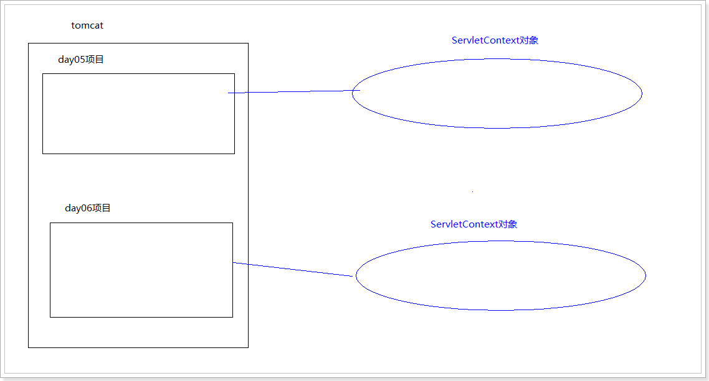

在Tomcat服务器中的web的项目 也叫做WEB应用程序。在java中 万物皆对象，那么，应用程序也是对象。

在Java Web开发中，使用ServletContext对象表示WEB应用程序。

```
说明：
1. 在一个WEB应用程序中，只能存在一个ServletContext对象。
2. 每个应用程序,都有它自己所对应的一个ServletContext对象。
3. 在服务器启动的时候，为每个web应用程序创建一个单独的ServletContext对象。
4. ServletContext是接口, 此接口的实现类是tomcat引擎提供
```

## 2 ServletContext对象的作用

- 获取WEB应用程序的初始化参数
- 获取WEB应用程序下任意资源的绝对路径
- ServletContext作为域对象，存储数据

## 3 如何获取ServletContext对象

一个web应用程序只有一个ServletContext对象

- 方式1：通过ServletConfig接口获取，它提供了方法 getServletContext()

  ```java
  public interface ServletConfig {
      ServletContext getServletContext();
      
  }
  ```

- 方式2：通过继承的HttpServlet类的父类GenericServlet获取， GenericServlet类 提供了方法 getServletContext()，下面是源码分析

  ```java
  class Context1Servlet extends HttpServlet {}
                          ↓
                          ↓
  public abstract class HttpServlet extends GenericServlet{}
                          ↓
                          ↓
  public abstract class GenericServlet implements Servlet, ServletConfig, Serializable {
      //用transient关键字标记的成员变量不参与序列化过程。
      private transient ServletConfig config;
      
      public ServletConfig getServletConfig() {
          return this.config;
      }
      
      public ServletContext getServletContext() {
          return this.getServletConfig().getServletContext();
      }
      //省略其他
  }
  ```

- 代码演示

```java
protected void doGet(HttpServletRequest request, HttpServletResponse response) throws ServletException, IOException {
    //方式1：通过ServletConfig对象获取，它提供了方法 getServletContext()
    ServletConfig config = super.getServletConfig();
    ServletContext servletContext = config.getServletContext();
    System.out.println("servletContext = "+servletContext);

    //方式2：通过继承的HttpServlet类的父类GenericServlet获取， GenericServlet类 提供了方法 getServletContext()
    ServletContext servletContext2 = super.getServletContext();
    System.out.println("servletContext2 = "+servletContext2);

}
```

## 4 作用一：获取WEB应用程序的初始化参数

因为一个web应用程序只有一个ServletContext对象，所以这个对象对整个应用程序的相关内容都是了解的

- web.xml 配置WEB应用程序的初始化参数

```java
<!-- 配置的是WEB程序的初始化参数-->
<context-param>
    <param-name>heima</param-name>
    <param-value>java</param-value>
</context-param>
```

- API操作

| 方法                          | 返回值 | 描述                        |
| ----------------------------- | ------ | --------------------------- |
| getInitParameter(String name) | String | 获取web应用程序的初始化参数 |

- 代码演示：

```java
protected void doGet(HttpServletRequest request, HttpServletResponse response) throws ServletException, IOException {
    /*
     * 获取ServletContext对象
     * 父类的方法
     * org.apache.catalina.core.ApplicationContextFacade实现接口ServletContext
     */
    ServletContext context = getServletContext();
    System.out.println(context);
    //context对象,获取配置文件中的初始化参数
    String value = context.getInitParameter("heima");
    System.out.println(value);
}
```

## 5 作用二：获取WEB应用程序下任意资源的绝对路径

| 方法                     | 返回值 | 描述                                                   |
| ------------------------ | ------ | ------------------------------------------------------ |
| getRealPath(String path) | String | 接收一个资源的相对路径，返回真实路径(完整路径)的字符串 |

- 获取web目录下的a.txt绝对路径
- 获取web目下WEB-INF目录下的b.txt绝对路径
- 获取src目录下的c.txt绝对路径
- 获取web02 module下的d.txt绝对路径,获取不到

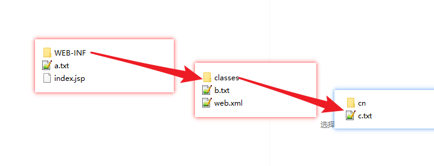

代码演示：

```java
protected void doGet(HttpServletRequest request, HttpServletResponse response) throws ServletException, IOException {
    //获取servletContext对象
    ServletContext servletContext = super.getServletContext();
    //获取web目录下的a.txt绝对路径
    String apath = servletContext.getRealPath("a.txt");
    System.out.println("apath = " + apath);
    //获取web目录下WEB-INF目录下的b.txt绝对路径
    String bpath = servletContext.getRealPath("WEB-INF/b.txt");
    System.out.println("bpath = " + bpath);
    //获取src目录下的c.txt绝对路径
    String cpath = servletContext.getRealPath("WEB-INF/classes/c.txt");
    System.out.println("cpath = " + cpath);
}
```

## 6 作用三：ServletContext作为域对象

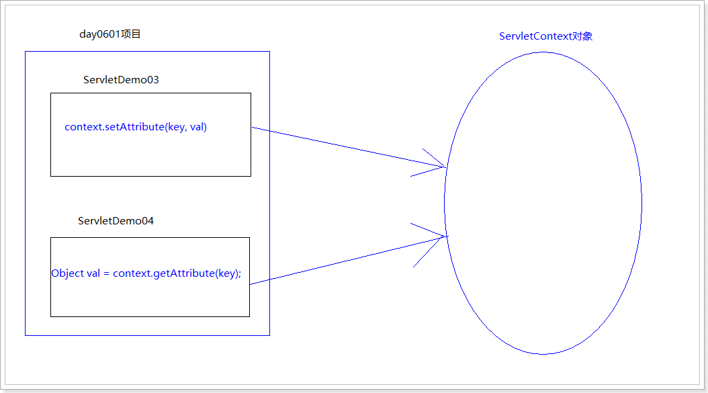

### ServletContext作为域对象

ServletContext是在服务器启动的时候为每个web项目 单独创建一个ServletContext对象。当web项目从服务器中移除，或者是关闭服务器的时候ServletContext对象会被销毁。向ServletContext中保存的数据一直存在（当服务器关闭的时候ServletContext对象被销毁，然后里面数据才会失效）。

- ServletContext作用范围：整个web应用。

| 方法                                   | 返回值 | 描述             |
| -------------------------------------- | ------ | ---------------- |
| setAttribute(String key, Object value) | void   | 向域对象存储数据 |
| getAttribute(String key)               | Object | 取出域对象数据   |
| removeAttribute(String key)            | void   | 移除域对象数据   |

代码演示:

第一个Servlet:

```java
protected void doGet(HttpServletRequest request, HttpServletResponse response) throws ServletException, IOException {
    //获取servletcontext对象
    ServletContext context = super.getServletContext();
    //存储数据 heima=java
    context.setAttribute("heima","java");
    //读取数据 heima的值
    Object value = context.getAttribute("heima");
    System.out.println("Context4Servlet heima = " + value);
}
```

第二个Servlet:

```java
protected void doGet(HttpServletRequest request, HttpServletResponse response) throws ServletException, IOException {
    //获取ServletContext域对象
    ServletContext context = super.getServletContext();
    //获取域对象中 指定键的值
    Object value = context.getAttribute("heima");
    System.out.println("Context5Servlet heima = " + value);
}
```

 

# 第二章 Response对象

## 1 Response对象概述

方向: 服务器 -> 浏览器

负责对浏览器进行响应的对象

什么是响应: 服务器接收到请求需要进行处理，将处理以后的结果显示回浏览器端（将这个过程称为是响应Response）。

- 查看Servlet中的service方 法得知, Servlet中使用的ServletResponse接口, 而我们使用的是ServletResponse的子接口HttpServletResponse, 它继承自ServletResponse, 是与HTTP协议相关的Response响应对象
- 我们使用的子接口HttpServletResponse, 此接口对象由Tomcat引擎提供
- 可以实现对客户端的响应, 响应内容包括: 响应行,响应头,响应体

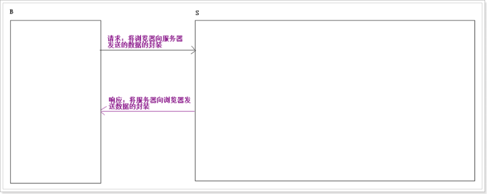

## 2 Response设置响应行

| 方法              | 返回值 | 描述             |
| ----------------- | ------ | ---------------- |
| setStatus(int sc) | void   | 设置响应的状态码 |

- 设置响应的状态码
  - 200 正确
  - 302 重定向
  - 304 查找本地缓存
  - 404 请求资源不存在
  - 500 服务器内部错误

```java
response.setStatus(500);
```


## 3 Response设置响应头

  HTTP协议的响应头,数据格式键值对 k:v

  包含指导性信息,指导客户端

| 方法                                   | 返回值 | 描述                       |
| -------------------------------------- | ------ | -------------------------- |
| addHeader(String key,String value)     | void   | 添加响应头，值为String类型 |
| addIntHeader(String key,int value)     | void   | 添加响应头，值为int类型    |
| addDateHeader(String key,long l)       | void   | 添加响应头，值为日期类型   |
| ==setHeader(String key,String value)== | void   | 更改响应头，值为String类型 |
| setIntHeader(String key,int value)     | void   | 更改响应头，值为int类型    |
| setDateHeader(String key,long l)       | void   | 更改响应头，值为日期类型   |

- add开头的方法：针对一个key对应多个value的情况。

  ```http
  比如已有一个响应头 heima:java
  然后执行 addHeader(“heima”,”java2222”);
  最终得到响应头的结果：heima:java,java2222
  ```

- set开头的方法：针对一个key对应一个value的情况。

  ```http
  比如已有一个响应头 heima:java
  然后执行 setHeader(“heima”,”java2222”);
  最终得到响应头的结果：heima:java2222
  ```

演示：

```java
protected void doGet(HttpServletRequest request, HttpServletResponse response) throws ServletException, IOException {
    /*
     * response对象设置响应头
     */
    response.addHeader("heima","java");
  /*  response.addIntHeader("heima2",5);
    response.addDateHeader("date",System.currentTimeMillis());*/
    /*
     * addHeader() 添加,实现一个键对应多个值
     * setHeader() 设置,原来的键覆盖
     */
    response.setHeader("heima","java2222");
}
```

## 4 重定向

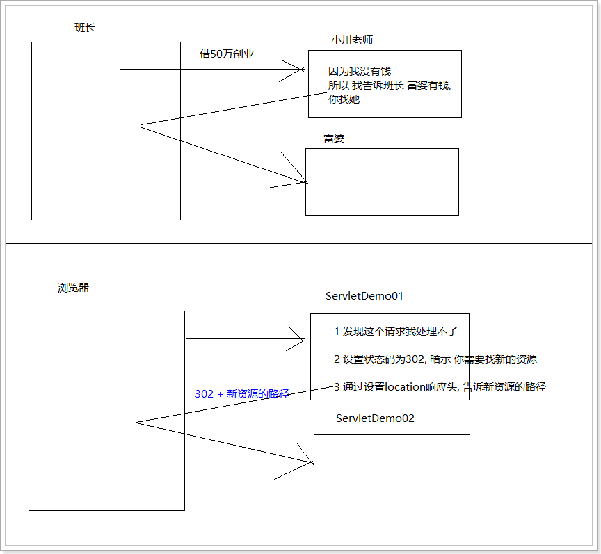

### 4.1 重定向的写法

浏览器进行重新的定向:

- 设置302状态码: setStatus(302)
- 设置重定向资源的地址: setHeader("location","资源")

通过HttpServletResponse对象中的以下方法实现重定向

| 方法                          | 返回值 | 描述   |
| ----------------------------- | ------ | ------ |
| sendRedirect(String location) | void   | 重定向 |

### 4.2 重定向的代码实现

```java
package cn.itcast.web;

import javax.servlet.ServletException;
import javax.servlet.annotation.WebServlet;
import javax.servlet.http.HttpServlet;
import javax.servlet.http.HttpServletRequest;
import javax.servlet.http.HttpServletResponse;
import java.io.IOException;

@WebServlet("/demo07")
public class ServletDemo07 extends HttpServlet {
    protected void doPost(HttpServletRequest request, HttpServletResponse response) throws ServletException, IOException {
        // 解决服务器给浏览器的数据中文乱码问题
        response.setContentType("text/html;charset=utf-8");

        System.out.println("77777777777777777777777");

        // 需求: 演示重定向: 访问 demo07 跳转到 demo08
        // 方式一: 分解式
        // 1 设置状态码 为 302 , 通知浏览器访问新资源
        // response.setStatus(302);
        // 2 设置响应头 location, 通知浏览器访问新资源的路径
        // 新资源的路径 可以使 项目内的资源,也可以是项目外的资源
        // response.setHeader("location", "/web0201/demo08");

        // 方式二: 合并式
        response.sendRedirect("/web0201/demo08");
    }

    protected void doGet(HttpServletRequest request, HttpServletResponse response) throws ServletException, IOException {
        doPost(request, response);
    }
}

```

## 5 Response设置响应体

  HTTP的响应体,就是页面的正文部分

### 5.1 字符流向浏览器写数据

| 方法    | 返回值      | 描述                                           |
| ------- | ----------- | ---------------------------------------------- |
| write() | PrintWriter | 使用字符串数据,没有差别, 输出是整数,查询编码表 |
| print() | PrintWriter | 无论是什么,原样打印                            |

```java
protected void doGet(HttpServletRequest request, HttpServletResponse response) throws ServletException, IOException {
    /*
     * response对象方法getWriter()
     * 打印流的响应体
     * write() 使用字符串数据,没有差别, 输出是整数,查询编码表
     * print() 无论是什么,原样打印
     */
     PrintWriter pw =  response.getWriter();
     pw.write(100);
     pw.print(100);
}
```


### 5.2 字符流的中文乱码问题

产生乱码原因: 编码和解码不一致

提问：在Servlet中编写以下代码，向页面输出中文是否会产生乱码？

```java
response.getWriter().print("中文");
```

会乱码：

- 原因：
  - 字符流是有缓冲区的，response获得字符流，response设计默认的缓冲区编码是ISO-8859-1。这个字符集不支持中文的。
- 解决：
  - 设置response获得字符流缓冲区的编码 与 设置浏览器默认打开时候采用的字符集一致即可。

| 方法                                                 | 放回值 | 描述                             |
| ---------------------------------------------------- | ------ | -------------------------------- |
| setHeader("Content-Type", "text/html;charset=UTF-8") | void   | 设置浏览器打开页面时采用的字符集 |
| setContextType(String type)                          | void   | 设置浏览器打开页面时采用的字符集 |

```java
// 设置浏览器默认打开的时候采用的字符集:
// response.setHeader("Content-Type", "text/html;charset=UTF-8");
// 简化代码
response.setContentType("text/html;charset=UTF-8");
// 输出中文汉字
response.getWriter().println("中文");
```


### 5.3 字节流向浏览器写数据

| 方法              | 返回值       | 描述                                             |
| ----------------- | ------------ | ------------------------------------------------ |
| getOutputStream() | OutputStream | 返回字节输出流OutputStream，响应非文本类型的数据 |

#### 5.3.1 案例 验证码 

  验证码的本质是个图片,图片里面是个随机生成字符串

```http
随机字符串的思想：
String str ="abcdefABCDE1234567890";
Random.nextInt(  str.length() )产生整数随机数
str.charAt(索引)
```

```html
<!DOCTYPE html>
<html lang="en">
<head>
    <meta charset="UTF-8">
    <title>Title</title>
    <script>
        function changeImg(){
            // 1 获取验证码图片对象
            var codeImgObj = document.getElementById("codeImg");
            // 2 修改图片的路径
            // ?key=val 目的: 欺骗浏览器这是一个新资源
            codeImgObj.src = "/web0202/demo11?r=" + Math.random();
        }
    </script>
</head>
<body>
    <form action="xx" method="post">
        <table>
            <tr>
                <td>用户名</td>
                <td><input type="text" name="username"/></td>
            </tr>
            <tr>
                <td>密码</td>
                <td><input type="password" name="password"/></td>
            </tr>
            <tr>
                <td>验证码</td>
                <td>
                    <input type="text" name="code_form"/>
                    
                </td>
            </tr>
            <tr>
                <td></td>
                <td><input type="submit" value="提交"/></td>
            </tr>
        </table>
    </form>
</body>
</html>
```

```java
package cn.itcast.web;

import javax.imageio.ImageIO;
import javax.servlet.ServletException;
import javax.servlet.annotation.WebServlet;
import javax.servlet.http.HttpServlet;
import javax.servlet.http.HttpServletRequest;
import javax.servlet.http.HttpServletResponse;
import java.awt.*;
import java.awt.image.BufferedImage;
import java.io.IOException;
import java.util.Random;

@WebServlet("/demo11")
public class ServletDemo11 extends HttpServlet {
    protected void doPost(HttpServletRequest request, HttpServletResponse response) throws ServletException, IOException {
        // 解决服务器给浏览器的数据中文乱码问题
        // response.setContentType("text/html;charset=utf-8");

        // 1 创建画布对象
        int width = 120;
        int height = 40;
        BufferedImage bufi = new BufferedImage(width, height, BufferedImage.TYPE_INT_RGB);

        // 3 获取画笔
        Graphics g = bufi.getGraphics();

        // 4 修改背景色
        g.fillRect(0, 0, width, height);

        // 5 绘制边框
        g.setColor(Color.red);
        g.drawRect(0, 0, width-1, height-1);

        // 6 生成随机字符 且 显示
        // 6.1 准备数据
        String data = "ABCDEFGHJKLMNPQRSTUVWXYZabcdefghijkmnpqrstuvwxyz123456789";
        // 6.2 创建随机对象
        Random r = new Random();
        // 7.1 准备变量保存 生成的 随机字符
        String code = "";
        // 6.3 循环输出
        for (int i = 0; i < 4; i++) {
            // 6.3.2 设置字体
            g.setFont(new Font("楷体", Font.BOLD, 30));

            // 6.3.3 设置随机颜色
            g.setColor(new Color(r.nextInt(255), r.nextInt(255), r.nextInt(255)));

            // 6.3.1 绘制字符
            char c = data.charAt(r.nextInt(data.length()));
            g.drawString(c + "", 10 + i * 30, 30);

            // 7.1 将生成的随机字符 保存到 随机字符串中
            code += c +"";
        }

        // 7 将生成的字符输出到控制台
        System.out.println(code);

        // 8 绘制干扰线
        for (int i = 0; i < 10; i++) {
            // 8.2 设置随机颜色
            g.setColor(new Color(r.nextInt(255), r.nextInt(255), r.nextInt(255)));
            // 8.1 绘制干扰线
            g.drawLine(r.nextInt(width), r.nextInt(height), r.nextInt(width), r.nextInt(height));
        }

        // 2 将画布输出到浏览器中
        ImageIO.write(bufi, "jpg", response.getOutputStream());
    }

    protected void doGet(HttpServletRequest request, HttpServletResponse response) throws ServletException, IOException {
        doPost(request, response);
    }
}
```

# 第三章 Request对象

## 1 Request对象概述

方向: 浏览器 -> 服务器

负责获取客户端的请求数据

request对象是从客户端向服务器发出请求，包括用户提交的信息以及客户端的一些信息。客户端可通过HTML表单或在网页地址后面提供参数的方法提交数据，然后服务器通过request对象的相关方法来获取这些数据。

- 查看Servlet中的service方法得知, Servlet中使用的ServletRequest接口, 而我们使用的是ServletRequest的子接口HttpServletRequest, 它继承自ServletRequest, 是与HTTP协议相关的Request请求对象

- 我们使用的子接口HttpServletRequest, 此接口对象由Tomcat引擎提供

- 可以实现客户端向服务器发出请求, 请求内容包括: 请求行,请求头,请求体

  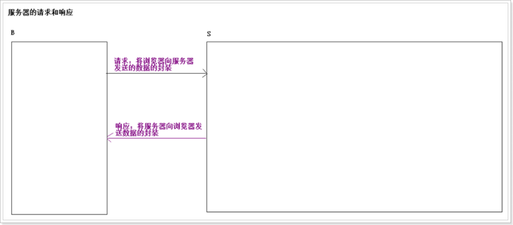

## 2 Request对象获取请求行

- API

| 方法                 | 返回值       | 描述                            |
| -------------------- | ------------ | ------------------------------- |
| ==getMethod()==      | String       | 获取提交的方式 (GET,POST)       |
| getRequestURI()      | String       | 获取请求的参数,请求服务器路径   |
| getRequestURL()      | StringBuffer | 获取请求的参数,请求服务器路径   |
| getQueryString()     | String       | 获取请求行 问号后面的参数 (GET) |
| ==getContextPath()== | String       | 获取WEB应用名称                 |

- 代码演示

```java
protected void doGet(HttpServletRequest request, HttpServletResponse response) throws ServletException, IOException {
    //request对象方法 getMethod()获取客户端的请求方式
    String method = request.getMethod();
    System.out.println(method);
    //方法 String getRequestURI() 获取请求服务器路径
    //方法 StringBuffer getRequestURL() 获取请求服务器路径
    String URI = request.getRequestURI();
    StringBuffer URL = request.getRequestURL();
    System.out.println("URI=="+URI);//   /web04/line
    System.out.println("URL=="+URL);//  http://localhost:8080/web04/line

    //方法 String getQueryString()获取请求行,?后面的所有参数
    String query = request.getQueryString();
    System.out.println(query);//user=tom&pass=123&

    //获取WEB应用名称  String getContextPath()
    String path = request.getContextPath();
    System.out.println(path);//   /web04
    //获取WEB应用名称, 结合重定向使用
    //response.sendRedirect(request.getContextPath()+"/ddd");
}
```


## 3 Request对象获取请求头

​    请求头数据格式键值对, k:v

​     指导性信息,指导服务器

| 方法                   | 返回值      | 描述                             |
| ---------------------- | ----------- | -------------------------------- |
| getHeader(String name) | String      | 获得一个key对应一个value的请求头 |
| getHeaderNames()       | Enumeration | 获取所有的请求头的键             |

```java
protected void doGet(HttpServletRequest request, HttpServletResponse response) throws ServletException, IOException {
    /*
     * Enumeration getHeaderNames() 获取所有的请求头的键
     * 返回值Enumeration接口 (向量枚举)
     * 集合:1.0-1.1 Enumeration    集合1.2  迭代器
     * Iterator迭代器接口:  hasNext()   next()
     * Enumeration接口:  hasMoreElement()  nextElement()
     */
    Enumeration<String> enums  = request.getHeaderNames();
    while (enums.hasMoreElements()){
         key = enums.nextElement();
         String value = request.getHeader(key);
        System.out.println(key+"=="+value);
    }
}
```


## 4 Request获取请求参数 重点  重点  重点

| 方法                               | 返回值               | 描述                                                        |
| ---------------------------------- | -------------------- | ----------------------------------------------------------- |
| getParameter(表单中的name值)       | String               | 获得提交的参数（一个name对应一个value）                     |
| getParameterValues(表单中的name值) | String[]             | 获得提交的参数（一个name对应多个value）                     |
| getParameterMap()                  | Map<String,String[]> | 获得提交的参数，将提交的参数名称和对应值存入到一个Map集合中 |

```html
<body>
    <form action="/web02/param" method="post">
        用户名:<input type="text" name="username"><br/>
        密　码:<input type="password" name="password"><br/>
        爱　好:<input type="checkbox" name="hobby" value="Basketball">篮球
                <input type="checkbox" name="hobby" value="football">足球
                <input type="checkbox" name="hobby" value="pingpang">乒乒球 <br/>
        <input type="submit">
    </form>
</body>
```

```java
@WebServlet(urlPatterns = "/param")
public class ParamServlet extends HttpServlet {
    protected void doGet(HttpServletRequest request, HttpServletResponse response) throws ServletException, IOException {
        //获得提交的参数(一个name对应一个value)
        String username = request.getParameter("username");
        String password = request.getParameter("password");
        System.out.println(username +" == " +password);
        //获得提交的参数(一个name对应多个value)
        String[] hobbies = request.getParameterValues("hobby");
        System.out.println("hobbies = " + Arrays.toString(hobbies));
        //获得提交的参数,将提交的参数名称和对应值存入到一个Map集合中
        Map<String, String[]> map = request.getParameterMap();
        for(String key : map.keySet()){
            String[] values = map.get(key);
            System.out.println(key + " == " + Arrays.toString(values));
        }
    }

```


## 5 Request对象接收表单请求参数的中文乱码处理

### 5.1 POST方式接收中文

- 产生乱码的原因：
  - post方式提交的数据是在请求体中，request对象接收到数据之后，放入request的缓冲区中。缓冲区就有编码（默认ISO-8859-1:不支持中文）.
- 解决方案：
  - 将request的缓冲区的编码修改了即可。

```java
protected void doPost(HttpServletRequest request, HttpServletResponse response) throws ServletException, IOException {
    //将request的缓冲区的编码修改
    request.setCharacterEncoding("utf-8");

    //获取请求参数
    String user = request.getParameter("user");
    System.out.println("user = " + user);
}
```

### 5.2 GET方式接收中文

Tomcat8.5版本之后, Tomcat自动处理了get请求的中文乱码问题

但在Tomcat8.5之前的版本中, get请求的中文乱码需要自行处理

- 产生乱码原因：
  - get方式提交的数据在请求行的url后面，在地址栏上其实就已经进行了一次URL的编码了。
- 解决方案:
  - 将存入到request缓冲区中的值以ISO-8859-1的方式获取到，以UTF-8的方式进行解码。

```java
protected void doGet(HttpServletRequest request, HttpServletResponse response) throws ServletException, IOException {
    /*
     get方式提交的数据在 请求行中
     Tomcat8.5之后, Tomcat自动处理了get请求的中文乱码问题, 但在之前的Tomcat版本中,get请求的中文乱码需要自行处理
     老版本Tomcat中文乱码的解决:将存入到request缓冲区中的值以ISO-8859-1的方式获取到，以UTF-8的方式进行解码。
     */
    String user = request.getParameter("username"); //

    //将存入到request缓冲区中的值以ISO-8859-1的方式获取到
    byte[] bytes = user.getBytes("iso-8859-1");
    //以UTF-8的方式进行解码
    String value = new String(bytes, "utf-8");

    System.out.println("user = " + user);
}
```

## 6 BeanUtils 将 map中的数据封装到 pojo类中

### 6.1 导包

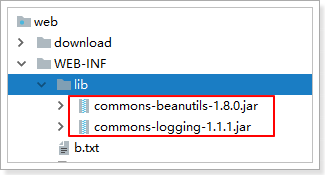 

### 6.2 pojo类

```java
package cn.itcast.pojo;

import java.util.Arrays;

public class User {
    private String username;
    private String password;
    private String[] hobby;

    public String getUsername() {
        return username;
    }

    public void setUsername(String username) {
        this.username = username;
    }

    public String getPassword() {
        return password;
    }

    public void setPassword(String password) {
        this.password = password;
    }

    public String[] getHobby() {
        return hobby;
    }

    public void setHobby(String[] hobby) {
        this.hobby = hobby;
    }

    @Override
    public String toString() {
        return "User{" +
                "username='" + username + '\'' +
                ", password='" + password + '\'' +
                ", hobby=" + Arrays.toString(hobby) +
                '}';
    }
}
```

### 6.3 页面

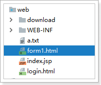 

```html
<!DOCTYPE html>
<html lang="en">
<head>
    <meta charset="UTF-8">
    <title>Title</title>
</head>
<body>
<form action="/web0202/demo15" method="post">
    用户名:<input type="text" name="username"><br/>
    密　码:<input type="password" name="password"><br/>
    爱　好:<input type="checkbox" name="hobby" value="Basketball">篮球
    <input type="checkbox" name="hobby" value="football">足球
    <input type="checkbox" name="hobby" value="pingpang">乒乒球 <br/>
    <input type="submit">
</form>
</body>
</html>
```

### 6.4 servlet

```java
package cn.itcast.web;

import cn.itcast.pojo.User;
import org.apache.commons.beanutils.BeanUtils;

import javax.servlet.ServletException;
import javax.servlet.annotation.WebServlet;
import javax.servlet.http.HttpServlet;
import javax.servlet.http.HttpServletRequest;
import javax.servlet.http.HttpServletResponse;
import java.io.IOException;
import java.lang.reflect.InvocationTargetException;
import java.util.Map;

@WebServlet("/demo15")
public class ServletDemo15 extends HttpServlet {
    protected void doPost(HttpServletRequest request, HttpServletResponse response) throws ServletException, IOException {
        // 解决服务器给浏览器的数据中文乱码问题
        response.setContentType("text/html;charset=utf-8");
        request.setCharacterEncoding("utf-8");

        Map<String, String[]> parameterMap = request.getParameterMap();
        User user = new User();
        try {
            BeanUtils.populate(user, parameterMap);
        } catch (Exception e) {
            e.printStackTrace();
        }
        System.out.println(user);

    }

    protected void doGet(HttpServletRequest request, HttpServletResponse response) throws ServletException, IOException {
        doPost(request, response);
    }
}
```

### 6.5 原理

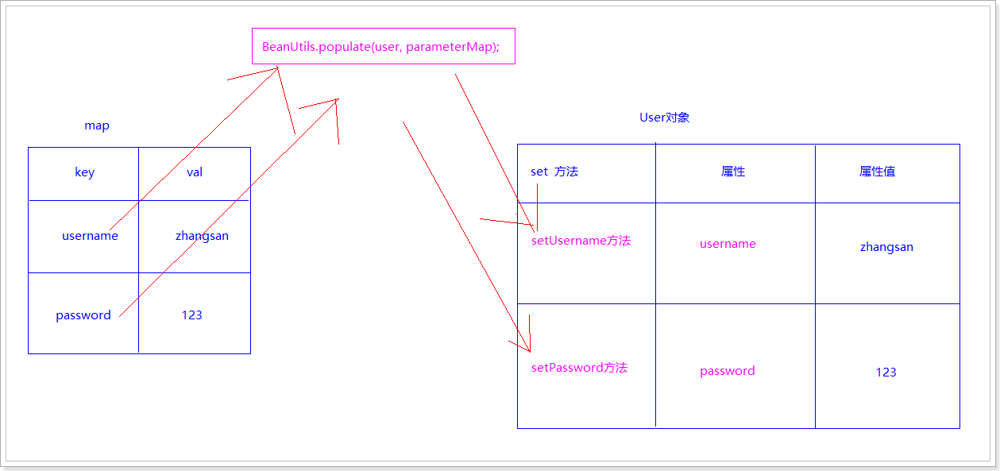 

## 7 Request域对象

  Request作为域对象的API

### 7.1 Request作为域对象作用范围

Request对象其实就是从客户端浏览器向服务器发送的一次请求信息的封装。那么实质上向Request中所保存的数据有效期也是**一次请求范围。**

**一次请求范围：从客户端浏览器向服务器发送一次请求，服务器针对这次请求对浏览器作出响应。当服务器作出响应之后，请求对象就销毁了，保存在其中的数据就无效了。**


每次请求都会创建新的request对象, 当响应结束后立刻销毁request对象.

- API

| 方法                                  | 返回值 | 描述                  |
| ------------------------------------- | ------ | --------------------- |
| setAttribute(String name, Object obj) | void   | 向Request域中保存数据 |
| getAttribute(String name)             | Object | 从Request域中获取数据 |
| removeAttribute(String name)          | void   | 从Request域中移除数据 |

- 代码演示

servlet1

```java
@WebServlet(urlPatterns = "/my1")
public class MyServlet1 extends HttpServlet {
    protected void doGet(HttpServletRequest request, HttpServletResponse response) throws ServletException, IOException {
        //向request域对象中 存值
        request.setAttribute("heima","java");
        //从request域对象中 取值
        Object value = request.getAttribute("heima");
        System.out.println("MyServlet1 value = " + value);
    }

    protected void doPost(HttpServletRequest request, HttpServletResponse response) throws ServletException, IOException {
        doGet(request, response);
    }
}
```

servlet2

```java
@WebServlet(urlPatterns = "/my2")
public class MyServlet2 extends HttpServlet {
    protected void doGet(HttpServletRequest request, HttpServletResponse response) throws ServletException, IOException {
        //从request域对象中 取值
        Object value = request.getAttribute("heima");
        System.out.println("MyServlet2 value = " + value);
    }

    protected void doPost(HttpServletRequest request, HttpServletResponse response) throws ServletException, IOException {
        doGet(request, response);
    }
}
```


## 8 请求转发 

### 8.1 原理

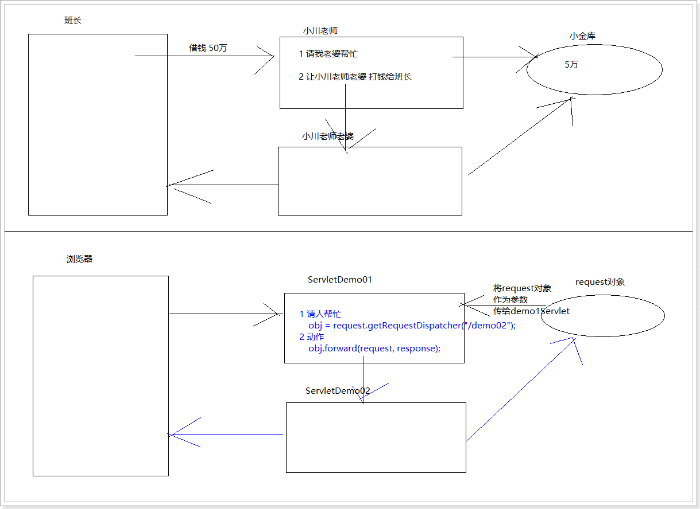

### 8.2 请求转发的写法

通过ServletRequest对象获得RequestDispatcher对象

| 方法                              | 返回值            | 描述                      |
| --------------------------------- | ----------------- | ------------------------- |
| getRequestDispatcher(String path) | RequestDispatcher | 获得RequestDispatcher对象 |

再根据RequestDispatcher中的方法进行请求转发

| 方法                                                      | 返回值 | 描述         |
| --------------------------------------------------------- | ------ | ------------ |
| forward(ServletRequest request, ServletResponse response) | void   | 进行请求转发 |

### 8.3 转发的实现步骤

- request对象方法获取转发器  RequestDispatcher getRequestDispatcher("转发地址")返回值就是转发器
- 使用转发器对象的方法 forward

代码实现

servlet1

```java
@WebServlet(urlPatterns = "/my1")
public class MyServlet1 extends HttpServlet {
    protected void doGet(HttpServletRequest request, HttpServletResponse response) throws ServletException, IOException {
        //向request域对象中 存值
        request.setAttribute("heima","java");
        //从request域对象中 取值
        Object value = request.getAttribute("heima");
        System.out.println("MyServlet1 value = " + value);

        //进行请求转发
        request.getRequestDispatcher("/my2").forward(request, response);
    }

    protected void doPost(HttpServletRequest request, HttpServletResponse response) throws ServletException, IOException {
        doGet(request, response);
    }
}
```

servlet2

```java
@WebServlet(urlPatterns = "/my2")
public class MyServlet2 extends HttpServlet {
    protected void doGet(HttpServletRequest request, HttpServletResponse response) throws ServletException, IOException {
        //从request域对象中 取值
        Object value = request.getAttribute("heima");
        System.out.println("MyServlet2 value = " + value);

        //响应回浏览器
        response.setContentType("text/html;charset=utf-8");
        response.getWriter().print("我是MyServlet2 页面数据");
    }

    protected void doPost(HttpServletRequest request, HttpServletResponse response) throws ServletException, IOException {
        doGet(request, response);
    }
}
```


## 9 请求转发和重定向区别

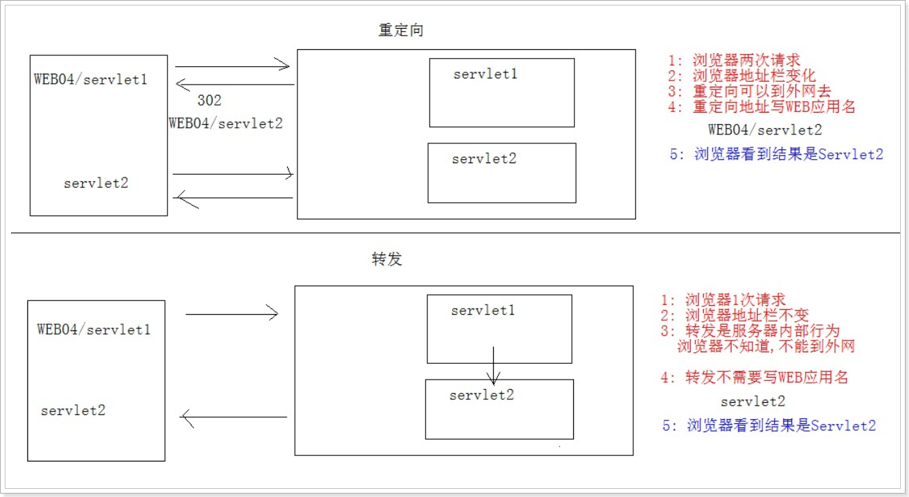

### 9.1 区别总结

- 请求转发是一次请求一次响应，而重定向是两次请求两次响应。
- 请求转发地址栏不会变化的，重定向地址栏发生变化。
- 请求转发路径不带工程名，重定向需要带工程名路径。
- 请求转发只能在本网站内部，重定向可以定向到任何网站。

### 9.2 代码演示

MyServlet1

```java
@WebServlet(urlPatterns = "/my1")
public class MyServlet1 extends HttpServlet {
    protected void doGet(HttpServletRequest request, HttpServletResponse response) throws ServletException, IOException {
        //向request域对象中 存值
        request.setAttribute("heima","java");
        //从request域对象中 取值
        Object value = request.getAttribute("heima");
        System.out.println("MyServlet1 value = " + value);

        //进行请求转发
        //request.getRequestDispatcher("/my2").forward(request, response);
        //进行重定向
        response.sendRedirect("/web02/my2");
    }

    protected void doPost(HttpServletRequest request, HttpServletResponse response) throws ServletException, IOException {
        doGet(request, response);
    }
}
```

MyServlet2

```java
@WebServlet(urlPatterns = "/my2")
public class MyServlet2 extends HttpServlet {
    protected void doGet(HttpServletRequest request, HttpServletResponse response) throws ServletException, IOException {
        //从request域对象中 取值
        Object value = request.getAttribute("heima");
        System.out.println("MyServlet2 value = " + value);

        //响应回浏览器
        response.setContentType("text/html;charset=utf-8");
        response.getWriter().print("我是MyServlet2 页面数据");
    }

    protected void doPost(HttpServletRequest request, HttpServletResponse response) throws ServletException, IOException {
        doGet(request, response);
    }
}
```

- 注意：
  - 如果需要使用request进行值传递，需要通过请求转发完成。
  - 如果页面需要跳转到其他网站上必须使用重定向, 不能使用request进行值传递。


## 10 客户端与服务器端地址的写法

- 什么是客户端地址：客户端直接访问服务器的地址是客户端地址
  - 通过客户端访问web应用 地址必须加上web应用的名称
- 什么是服务器端地址：web应用内部访问的地址是服务器端地址
  - 特点，访问时，不用写web应用名称
- 写地址时,  怎么区分是否加上web应用的名称
  - 看在web应用内, 还是外
    - 客户端地址
      - 直接在地址栏中写url地址 --- 客户端地址
      - 标签的href --- 客户端地址
      - form表单的action-----客户端地址
      - location.href ---- 客户端地址
      - response响应对象的重定向 sendRedirect( 地址)  -----客户端地址
    - 目前记住一个服务器端地址：
      - Request请求对象的请求转发getRequestDispatcher(转发地址) --- 服务器端地址
      - servlet的映射路径--- 也是服务端地址

# 第四章 案例 用户登录注册

## 1 用户注册功能

### 1.1 分析


### 1.2 开发步骤

- 创建数据库数据表
- 创建新的项目
- 准备工作
- 创建包
  - 添加需要jar
  - 配置文件
- 功能,编写服务器程序

### 1.3 准备工作

sql语句

```sql
CREATE DATABASE web02_db;
USE web02_db;

CREATE TABLE tb_user(
   id int primary key auto_increment,
   username VARCHAR(32),
   password VARCHAR(32),
   nickname varchar(32)
);

INSERT INTO tb_user VALUES(null,'zhangsan','123','张三'),(null,'lisi','456','李四');

# 通过用户名,密码查询 user表
SELECT * FROM tb_user WHERE username='zhangsan' AND `password`='123'
```

导包和配置文件

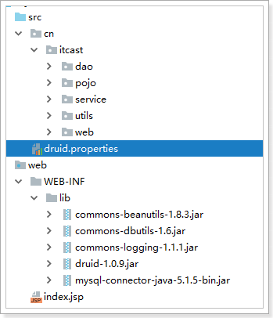 

### 1.4 入口页面 

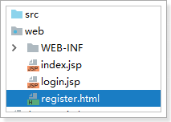 

```html
<!DOCTYPE html>
<html lang="en">
<head>
    <meta charset="UTF-8">
    <title>Title</title>
</head>
<body>
<form method="post" action="/web0203/registerServlet">
    <table>
        <tr>
            <td>用户名</td>
            <td><input type="text" name="username"/></td>
        </tr>
        <tr>
            <td>密码</td>
            <td><input type="password" name="password"/></td>
        </tr>
        <tr>
            <td>昵称</td>
            <td><input type="text" name="nickname"/></td>
        </tr>
        <tr>
            <td></td>
            <td><input type="submit" value="提交"/></td>
        </tr>
    </table>
</form>
</body>
</html>
```

### 1.5 web层

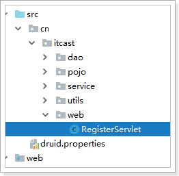 

```java
package cn.itcast.web;

import cn.itcast.pojo.User;
import cn.itcast.service.UserService;
import cn.itcast.service.impl.UserServiceImpl;
import org.apache.commons.beanutils.BeanUtils;

import javax.servlet.ServletException;
import javax.servlet.annotation.WebServlet;
import javax.servlet.http.HttpServlet;
import javax.servlet.http.HttpServletRequest;
import javax.servlet.http.HttpServletResponse;
import java.io.IOException;
import java.lang.reflect.InvocationTargetException;

@WebServlet("/registerServlet")
public class RegisterServlet extends HttpServlet {
    protected void doPost(HttpServletRequest request, HttpServletResponse response) throws ServletException, IOException {
        // 解决服务器给浏览器的数据中文乱码问题
        response.setContentType("text/html;charset=utf-8");
        request.setCharacterEncoding("utf-8");

        // 1 获取参数 封装到pojo类中
        User user = new User();
        try {
            BeanUtils.populate(user, request.getParameterMap());
        } catch (Exception e) {
            e.printStackTrace();
        }

        // 2 调用业务层 添加用户
        UserService userService = new UserServiceImpl();
        userService.register(user);

        // 3 使用重定向跳转到 登录页面
        response.sendRedirect(request.getContextPath() + "/login.jsp");
    }

    protected void doGet(HttpServletRequest request, HttpServletResponse response) throws ServletException, IOException {
        doPost(request, response);
    }
}
```

### 1.6 业务层

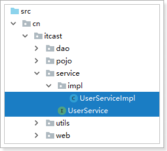 

* 业务层接口

```java
package cn.itcast.service;

import cn.itcast.pojo.User;

public interface UserService {
    /**
     * 添加用户
     * @param user
     * @return
     */
    void register(User user);
}
```

* 业务层实现类

```java
package cn.itcast.service.impl;

import cn.itcast.dao.UserDao;
import cn.itcast.dao.impl.UserDaoImpl;
import cn.itcast.pojo.User;
import cn.itcast.service.UserService;

public class UserServiceImpl implements UserService {
    UserDao userDao = new UserDaoImpl();

    @Override
    public void register(User user) {

        try {
            userDao.register(user);
        } catch (Exception e) {
            e.printStackTrace();
        }
    }
}
```

### 1.8 数据层

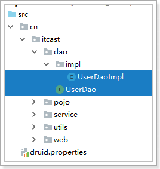 

* 数据层接口

```java
package cn.itcast.dao;

import cn.itcast.pojo.User;

public interface UserDao {
    void register(User user) throws Exception;
}
```

* 数据层实现类

```java
package cn.itcast.dao.impl;

import cn.itcast.dao.UserDao;
import cn.itcast.pojo.User;
import cn.itcast.utils.DruidUtils;
import com.alibaba.druid.util.JdbcUtils;
import org.apache.commons.dbutils.QueryRunner;

import javax.management.Query;

public class UserDaoImpl implements UserDao {
    QueryRunner queryRunner;

    {
        try {
            queryRunner = new QueryRunner(DruidUtils.getDataSource());
        } catch (Exception e) {
            e.printStackTrace();
        }
    }

    @Override
    public void register(User user) throws Exception {
        String sql = "insert into tb_user values(null, ?, ?, ?)";
        Object[] params = {user.getUsername(), user.getPassword(), user.getNickname()};
        queryRunner.update(sql, params);
    }
}
```

