# 第一章 JSP的基本入门

## 1 JSP的概念

JSP全名是Java Server Pages，称为Java的动态服务器端网页技术。

Java程序直接嵌入到了HTML中, 页面称为jsp页面, JSP文件的扩展名为.jsp。

## 2 JSP中编写java代码

- jsp页面中的注释格式:
  - <!-- HTML中的注释 -->  JSP中存在,翻译后的.java存在,浏览器中存在
  - <%  //   /* */    Java自己的注释 %> JSP中存在,翻译后的.java存在,浏览器没有
  - <%--   JSP特有注释 --%> 只在JSP源代码中出现
- 常用格式一:  <% java代码段  %> 
  - 作用1: 当请求该JSP页面时, 会执行<% %>中的java代码
  - 作用2: 拼接java逻辑代码, 实现嵌套html标签

```jsp
<%@ page contentType="text/html;charset=UTF-8" language="java" %>

<%--
    常用格式一:  <% java代码段  %>
    - 作用1: 当请求该JSP页面时, 会执行<% %>中的java代码
    - 作用2: 拼接java逻辑代码, 实现嵌套html标签
--%>
<html>
<head>
    <title>Title</title>
</head>
<body>
    <%-- 作用1: 当请求该JSP页面时, 会执行<% %>中的java代码 --%>
    <%-- 控制台打印5次Hello jsp --%>
    <%
    for(int i=0; i<5; i++){
        System.out.println("Hello JSP");
    }
    %>

    <%--作用2: 拼接java逻辑代码, 实现嵌套html标签--%>
    <%--JSP页面中, 使用h3标签, 打印5次Hello JSP --%>
    <% for(int i=0; i<5; i++){ %>
        <h3>hello JSP</h3>
    <% } %>
</body>
</html>

```

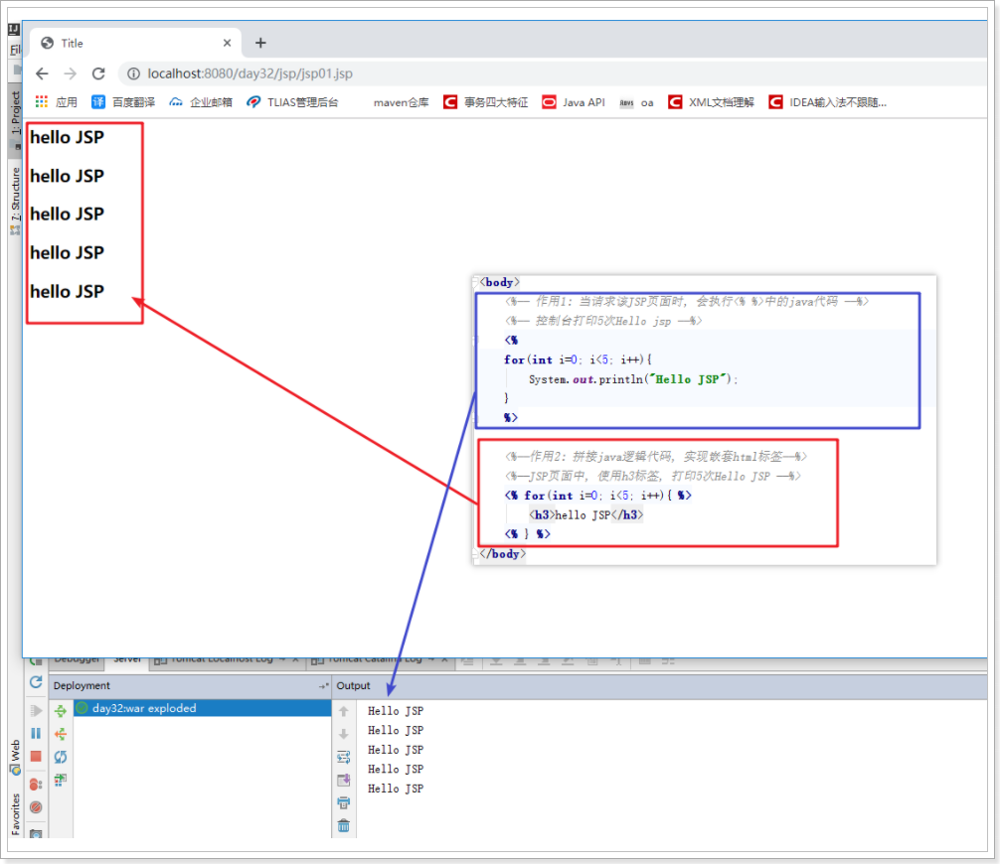


- 常用格式二:  <%= java的表达式内容 %>
  - 作用: 当请求该JSP页面时,会把<%= %>中的java的表达式内容输出到JSP页面, 可用来替代response对象向页面输出内容  

```jsp
<%@ page import="java.util.Date" %>
<%@ page contentType="text/html;charset=UTF-8" language="java" %>

<%--
常用格式二:  <%= java的表达式内容 %>
- 作用: 当请求该JSP页面时,会把<%= %>中的java的表达式内容输出到JSP页面, 可用来替代response对象向页面输出内容
--%>
<html>
<head>
    <title>Title</title>
</head>
<body>

    <%= 123 %>
    <%= "hello" %>
    <%=  Math.random() %>
    <%=  new Date().toLocaleString() %>
    <%=  request.getContextPath() %>
</body>
</html>

```

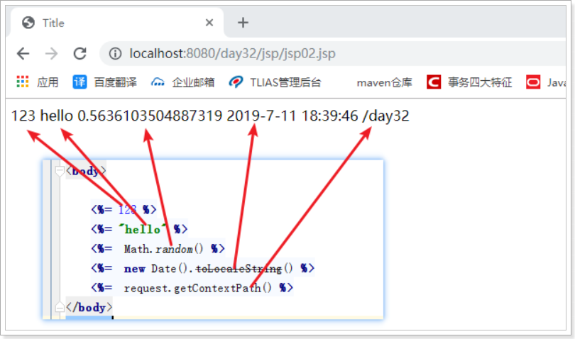

JS表达式 格式三: `<%! java语句; %>`

作用: 用于 定义变量, 例如 `<%! int i=100; %>`


## 3 JSP页面的执行原理

通过上述的体验jsp之后，我们发现jsp真的非常厉害. 既可以编写java代码,  也可以编写html代码，还可以使用request对象.  

- 如何实现的呢? 我们来看执行原理图, 再去看代码

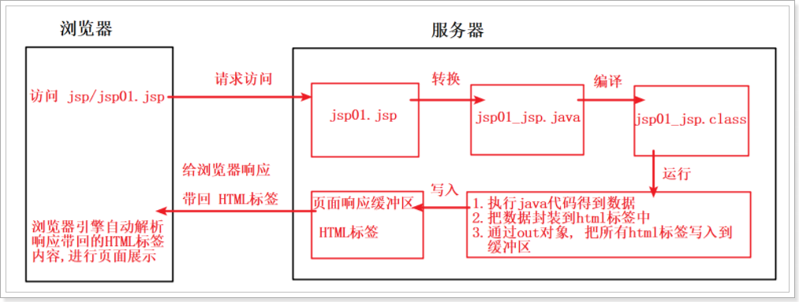

- jsp页面执行的时候被转成.java文件,编译为.class. 转换后目录如下:

- 提示: 这个目录不容易查找, 可通过Everything软件来完成查找定位

  

观看java源文件后,得出小结:

- jsp之所以可以直接使用request对象，是因为JSP本质就是Servlet,  我们自己编写的代码全部都落入到了service方法内部，在service方法内部一开始就已经声明了request等对象了。
- jsp之所以可以编写html代码，其本质上也是类似我们使用Servlet直接输出的。


## 4 JSP九大内置对象(也称为隐式对象)

JSP中一共预先定义了9个这样的对象，分别为：request、response、pageContext、session、application、out、config、page、exception

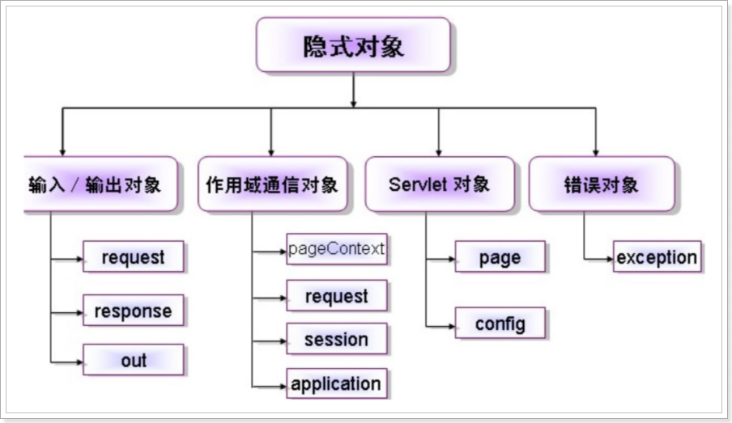

| 对象名      | 功能                                                         | 类型                           | 作用域      |
| ----------- | ------------------------------------------------------------ | ------------------------------ | ----------- |
| request     | 向客户端请求数据                                             | javax.servlet.ServletRequest   | Request     |
| response    | 封装了jsp产生的响应,然后被发送到客户端以响应客户的请求       | javax.servlet.SrvletResponse   | Page        |
| pageContext | 为JSP页面包装页面的上下文。管理对属于JSP中特殊可见部分中己经命名对象的f访问 | javax.servlet.jsp.PageContext  | Page        |
| session     | 用来保存每个用户的信息,以便跟踪每个用户的操作状态            | javax.servlet.http.HttpSession | Session     |
| application | 应用程序对象                                                 | javax.servlet.ServletContext   | Application |
| out         | 向客户端输出数据                                             | javax.servlet.jsp.JspWriter    | Page        |
| config      | 表示Servlet的配置,当一个Servlet初始化时,web容器把某些信息通过此对象传递给这个Servlet | javax.servlet.ServletConfig    | Page        |
| page        | Jsp实现类的实例,它是jsp本身,通过这个可以对它进行访问         | javax.lang.Object              | Page        |
| exception   | 反映运行的异常                                               | javax.lang.Throwable           | Page        |

pageContext		request		session		application

page			response				config

exception		out


# 第二章 Web会话技术

web会话可简单理解为：用户开一个浏览器，访问某一个web网站，在这个网站点击多个超链接，访问服务器多个web资源，然后关闭浏览器，整个过程称之为一个会话.

例如:

```http
1. 打开浏览器
2. 访问京东, 此时 与京东网站 产生了会话
3. 访问京东的具体商品页面; 或 其他页面; 或访问了其他网站, 此时,一直会与京东网站保持着会话连接
4. 关闭浏览器, 此时 与京东网站的会话结束;

重写打开浏览器,再次访问京东, 这就是第二次会话了
```


## Java Web开发中使用的会话技术

在客户端与服务器端交互的过程中，通常会产生一些数据, 为了保存会话过程中产生的数据，在Servlet技术中，提供了两个用于保存会话数据的对象，分别是**Cookie**和**Session**。

通过京东购物车案例, 了解会话技术 Cookie对象 \ Session对象

- Cookie对象: 客户端浏览器的会话技术，它可以把服务器传递过来的一些数据记录在客户端浏览器中，解决会话从什么时候开始，到什么时候结束。
- Session对象: 服务器端的会话技术,  它可以把同一用户与服务器多次请求响应的一些数据记录在服务器Session域中, 实现该用户在本次会话中, 可随时获取Session域中的数据, 满足多次请求响应之间 进行数据传递\访问使用.

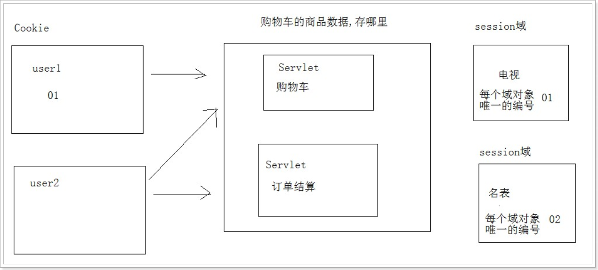


# 第三章 Cookie技术

## 1 什么是Cookie

 Cookie对象: 客户端浏览器的会话技术，它可以把服务器传递过来的一些数据记录在客户端浏览器中，解决会话从什么时候开始，到什么时候结束。

小结:

- 在客户端保存的数据, 数据产生是在服务器
- 在浏览器中Cookie是以文本的形式保存数据


## 2 cookie的应用场景

1. 判断用户是否登陆过网站，以便下次登录时能够实现自动登录（或者记住密码）。如果我们删除cookie，则每次登录必须从新填写登录的相关信息。
2. 保存上次登录的时间等信息。
3. 保存上次查看的页面
4. 浏览计数。

## 3 Cookie的基本使用

### 3.1 服务器向浏览器发送Cookie

把服务器端想要保存在客户端的数据, 通过Cookie来完成; 保存在客户端的数据 都是较小的文本数据.

实现步骤:

- 创建Cookie对象,直接new Cookie(String key,String value)
- 将Cookie数据保存到客户端, 使用response对象方法 addCookie()

API:

- Cookie类

  ```java
  //构造方法: 
  Cookie(String key, String value) , 用于创建Cookie对象, 并指定Cookie中保存的键值对信息
  ```

- Response对象

  ```java
  //方法: 
  addCookie(Cookie c), 用于将指定的Cookie对象 响应回 客户端浏览器
  ```

代码演示:

```java
@WebServlet(urlPatterns = "/send")
public class SendCookieServlet extends HttpServlet {
    protected void doGet(HttpServletRequest request, HttpServletResponse response) throws ServletException, IOException {
        //创建Cookie对象
        Cookie cookie = new Cookie("heima","java");
        //使用response对象的addCookie方法, 将Cookie对象 响应回 客户端浏览器
        response.addCookie(cookie);
    }

    protected void doPost(HttpServletRequest request, HttpServletResponse response) throws ServletException, IOException {
        doGet(request, response);
    }
}
```

访问演示:

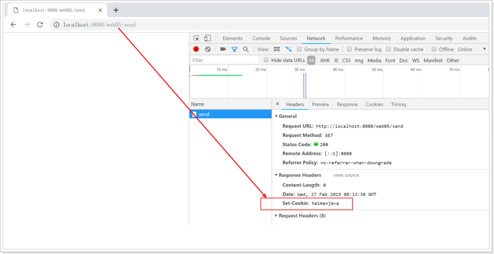

### 3.2 获取浏览器携带的Cookie

浏览器在访问服务器的时候, 会携带保存的Cookie数据, 服务器端可使用request对象获取Cookie数据; Cookie数据放在请求头

实现步骤:

- 使用Request对象 getCookies()方法, 获取浏览器携带的所有Cookie数据
- 遍历拿到每一个Cookie对象, 获取Cookie的键, 获取Cookie的值

API:

- request对象方法

  ```java
  Cookie[] getCookies() 获取多个Cookie,返回的是Cookie对象数组
  ```

- Cookie对象方法 

  ```java
  String getName()获取Cookie的键
  String getValue()获取Cookie中的值
  ```

代码演示:

```java
@WebServlet(urlPatterns = "/get")
public class GetCookieServlet extends HttpServlet {
    protected void doGet(HttpServletRequest request, HttpServletResponse response) throws ServletException, IOException {
        //使用Request对象 getCookies()方法, 获取浏览器携带的所有Cookie数据
        Cookie[] cookies = request.getCookies();
        //遍历拿到每一个Cookie对象, 获取Cookie的键, 获取Cookie的值
        for (Cookie cookie : cookies) {
            String key = cookie.getName();
            String value = cookie.getValue();
            System.out.println(key +" = " + value);
        }
    }

    protected void doPost(HttpServletRequest request, HttpServletResponse response) throws ServletException, IOException {
        doGet(request, response);
    }
}
```

访问演示:

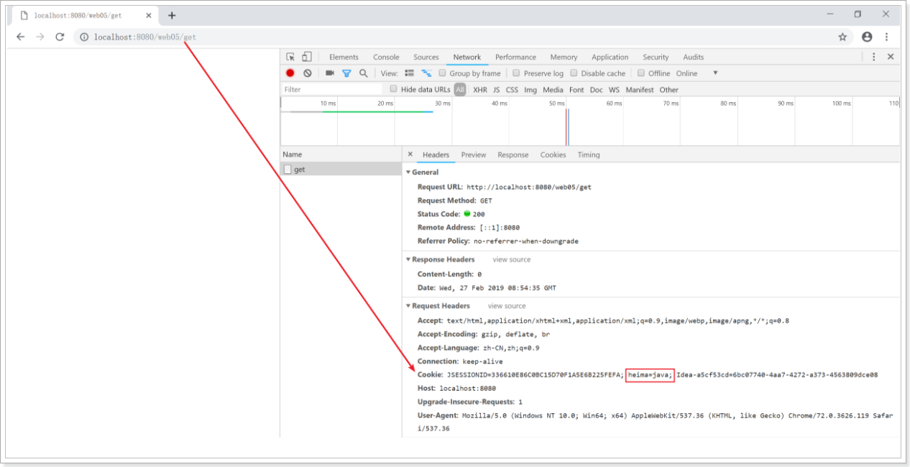

## 4 Cookie中使用中文问题(扩展)

  Cookie数据,值可以使用中文, ===但建议不要使用中文===

- 若在Cookie使用中文, Tomcat低版本不支持, 从Tomcat8开始支持中文
- 若使用中文, 需要把中文进行utf-8编码, 例如 `黑马-> %E9%BB%91%E9%A9%AC`

API:

- URLEncoder类

  ```java
  String encode("需要编码的数据","采用的编码表") 采用指定编码表对数据进行编码,返回编码后的字符串
  ```

- URLDecoder类

  ```java
  String decode("需要解码的数据","采用的编码表") 采用指定编码表对数据进行解码,返回解码后的字符串
  ```

代码演示:

```java
@WebServlet(urlPatterns = "/china")
public class ChinaCookieServlet extends HttpServlet {
    protected void doGet(HttpServletRequest request, HttpServletResponse response) throws ServletException, IOException {
        //定义中文字符串
        String heima = "黑马";
        //使用URLEncoder的encode方法进行编码
        String encode = URLEncoder.encode(heima,"utf-8");
        System.out.println("encode = " + encode);
        //将编码后的字符串, 通过Cookie,响应回浏览器
        Cookie cookie = new Cookie("heima", encode);
        response.addCookie(cookie);
        //访问服务器, 获取Cookie, 使用URLDecoder的decode方法对已经编码的字符串进行解码
        Cookie[] cookies = request.getCookies();
        for (Cookie cookie2 : cookies) {
            if ("heima".equals(cookie2.getName())) {
                //对已经编码的字符串进行解码
                String decode = URLDecoder.decode(encode,"utf-8");
                System.out.println(cookie2.getName() +" == "+ decode);
            }
        }
    }

    protected void doPost(HttpServletRequest request, HttpServletResponse response) throws ServletException, IOException {
        doGet(request, response);
    }
}
```

访问演示:

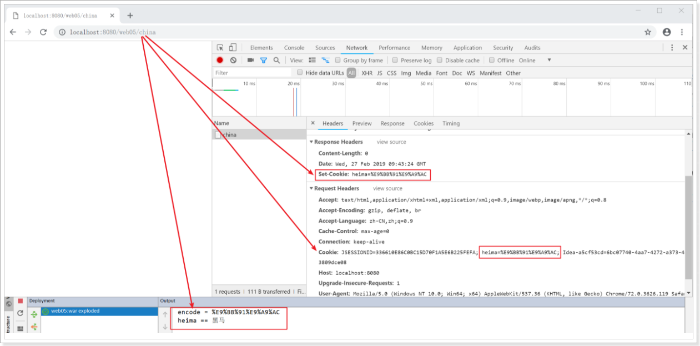

## 5 Cookie的携带路径

问: Cookie数据放在请求头, 浏览器访问服务器,每次都会携带所有的Cookie进行访问吗

结论:  浏览器访问服务器,不会携带所有的Cookie进行访问

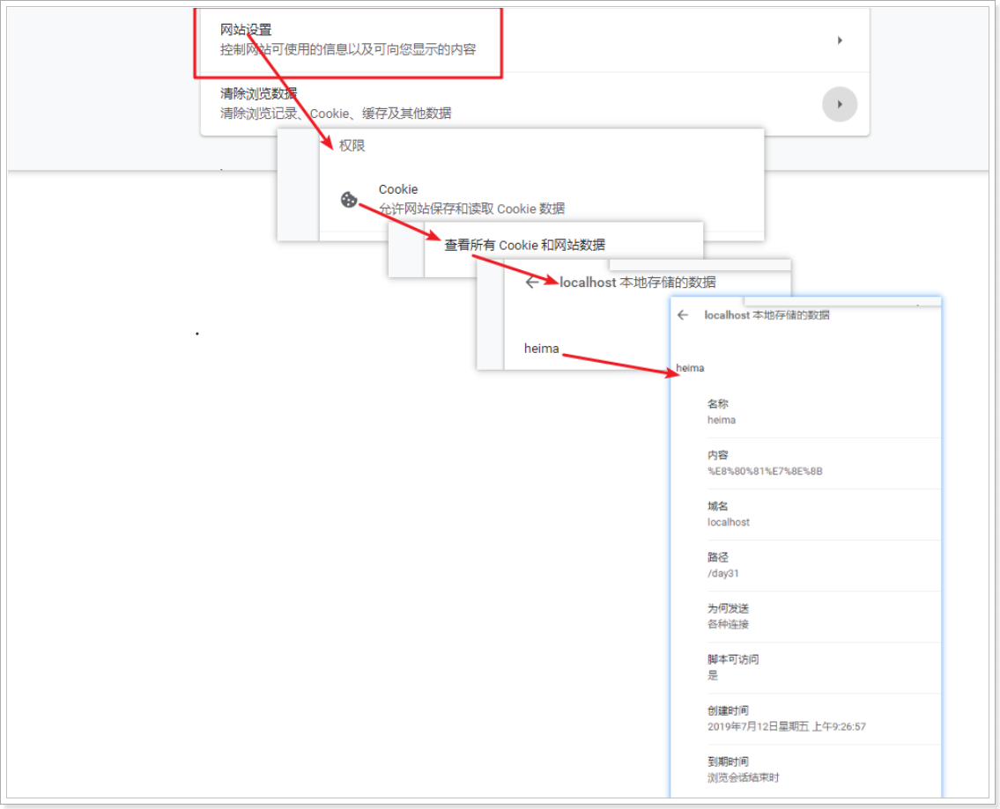

### 5.1 Cookie默认的携带情况

浏览器对Cookie的默认设置

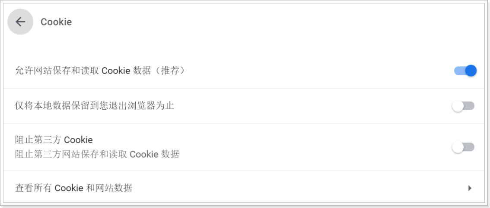

问: Cookie数据放在请求头, 浏览器访问服务器,每次都会携带所有的Cookie进行访问吗

结论:  浏览器访问服务器,不会携带所有的Cookie进行访问

看下图:

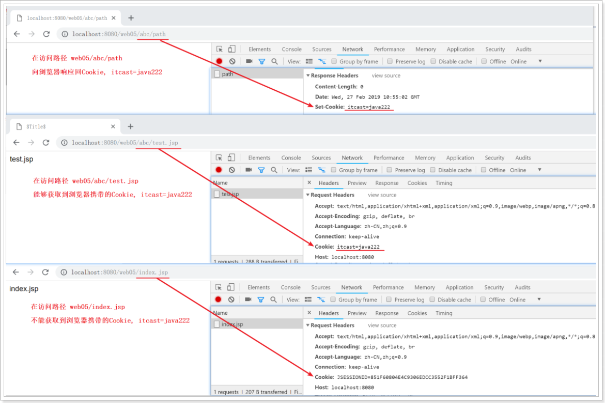

- 情况分析:  该Cookie在访问路径 web05/abc/path 下创建
  - 浏览器访问 `web05/abc` 下的任意资源, 会携带该Cookie;  例如访问 `web05/abc/test.jsp`
  - 浏览器访问 不是`web05/abc` 下的任意资源, 不会携带该Cookie; 例如访问 `web05/index.jsp`

代码演示:

- 拷贝index.jsp文件到 web\abc\目录下, 改名为test.jsp
- 编写servlet代码
- 依次访问: 
  - day07/abc/path , 实现创建Cookie, 响应回浏览器

- day07/abc/test.jsp, 查看是否获取到了 指定的Cookie对象. 结果是: 携带了
- day07/index.jsp, 查看是否获取到了 指定的Cookie对象 . 结果是: 没有携带

```java
@WebServlet(urlPatterns = "/abc/path")
public class PathCookieServlet extends HttpServlet {
    protected void doGet(HttpServletRequest request, HttpServletResponse response) throws ServletException, IOException {
        Cookie cookie = new Cookie("heima", "class352");
        response.addCookie(cookie);
    }

    protected void doPost(HttpServletRequest request, HttpServletResponse response) throws ServletException, IOException {
        doGet(request, response);
    }
}
```


### 5.2 让指定的Cookie, 可以在WEB应用下的任意资源都携带

- Cookie对象

  ```java
  //方法:
  setPath("cookie的携带路径") 用于设置cookie携带路径, 若参数写成 request.getContextPath() 代表web应用下任意资源都携带本Cookie
  ```

代码演示:

- 编写servlet代码
- 依次访问: 
  - day07/abc/path2 , 实现创建Cookie, 响应回浏览器
  - day07/abc/test.jsp, 查看是否获取到了 指定的Cookie对象. 结果是: 携带了
  - day07/index.jsp, 查看是否获取到了 指定的Cookie对象 . 结果是: 携带了

```java
@WebServlet(urlPatterns = "/abc/path2")
public class PathCookie2Servlet extends HttpServlet {
    protected void doGet(HttpServletRequest request, HttpServletResponse response) throws ServletException, IOException {
        Cookie cookie = new Cookie("itcast","java333");
        //设置Cookie的携带路径, 全web应用路径下携带
        cookie.setPath(request.getContextPath());
        response.addCookie(cookie);
    }

    protected void doPost(HttpServletRequest request, HttpServletResponse response) throws ServletException, IOException {
        doGet(request, response);
    }
}
```


## 6 Cookie的生存时间

浏览器中Cookie是有生存时间的, 默认是当前会话.浏览器关闭,该会话结束.

可以通过更改Cookie的生存时间, 来延长Cookie的生存时间

- Cookie对象

  ```java
  //方法:
  setMaxAge(int 秒) 更改Cookie的生存时间, 参数单位: 秒
  ```

代码演示:

```java
@WebServlet(urlPatterns = "/life")
public class LifeCookieServlet extends HttpServlet {
    protected void doGet(HttpServletRequest request, HttpServletResponse response) throws ServletException, IOException {
        Cookie cookie = new Cookie("heima","java");
        cookie.setPath( request.getContextPath() );
        //设置Cookie的生存时间, 10分钟
        cookie.setMaxAge(60 * 10);
        response.addCookie(cookie);
    }

    protected void doPost(HttpServletRequest request, HttpServletResponse response) throws ServletException, IOException {
        doGet(request, response);
    }
}
```

查看浏览器Cookie:

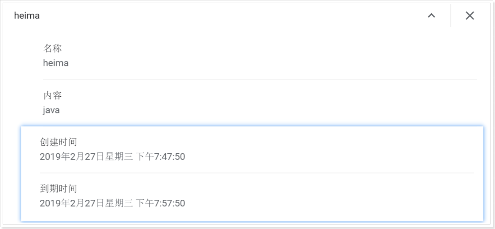

## 7 删除已存在的Cookie

要删除已经存在的cookie，后一个用来覆盖的新cookie, 必须名称与路径与原来的cookie一致

- 覆盖原有Cookie的需要满足的要求:
  - 保证同名键
  - 保证相同的携带路径
  - setMaxAge(0)

代码演示:

```java
@WebServlet(urlPatterns = "/clear")
public class clearCookieServlet extends HttpServlet {
    protected void doGet(HttpServletRequest request, HttpServletResponse response) throws ServletException, IOException {
        //获取已有的Cookie
        Cookie[] cookies = request.getCookies();
        //将键为"heima"的 cookie 进行覆盖, 实现cookie的删除
        for (Cookie cookie : cookies) {
            if ("heima".equals(cookie.getName())){
                //保证同名键
                Cookie newCookie = new Cookie("heima",cookie.getValue());
                //保证相同的携带路径
                newCookie.setPath( cookie.getPath() );
                //setMaxAge(0)
                cookie.setMaxAge(0);
                response.addCookie(newCookie);
            }
        }
    }

    protected void doPost(HttpServletRequest request, HttpServletResponse response) throws ServletException, IOException {
        doGet(request, response);
    }
}
```

访问演示:

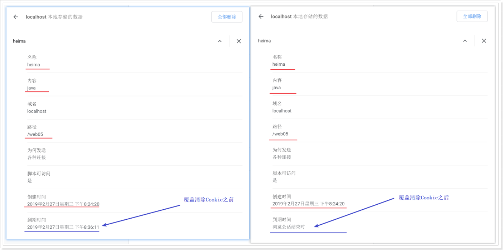

## 8 案例 记录上一次的访问时间

### 8.1 需求:

展示用户上一次访问服务器的时间

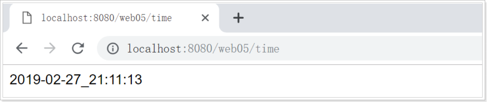

### 8.2 分析:

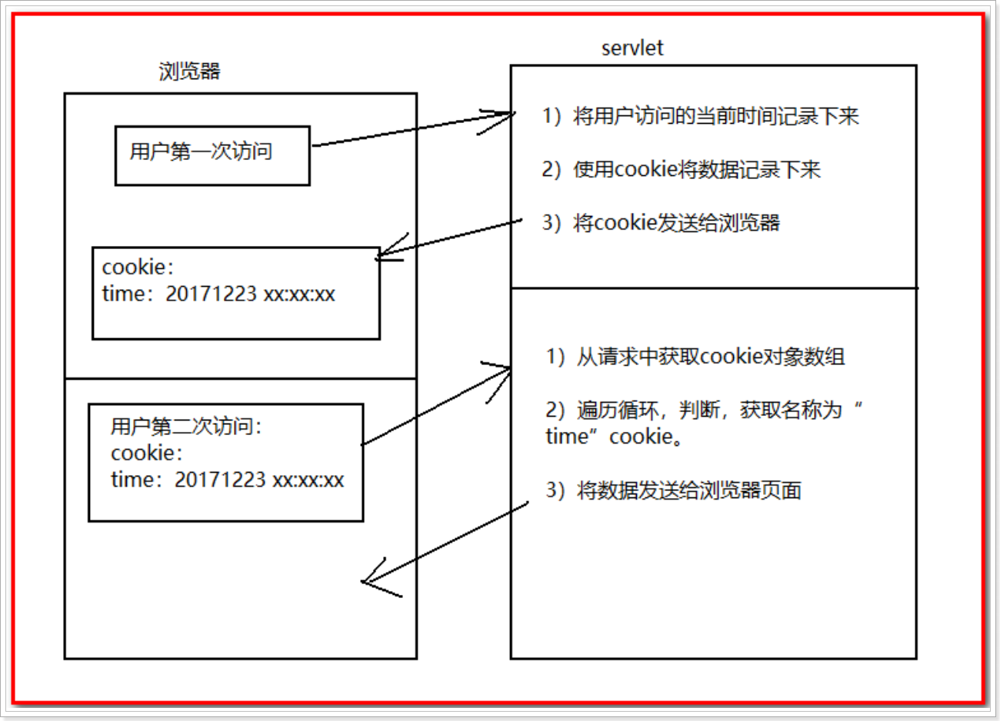

### 8.3 实现步骤:

- 设置浏览器响应编码
- 获取客户端携带的Cookie
- 判断key为time的cookie是否存在
- 存在
  - 获取value值,响应回浏览器显示
  - 覆盖Cookie, 调用createCooke方法
- 不存在
  - 响应回浏览器 "欢迎您首次访问"
  - 创建Cookie, 调用createCooke方法


方法 : createCooke

1. 获取当前时间
2. 创建Cookie, 记录本次访问时间

### 8.4 代码演示:

```java
package cn.itcast.web.servlet;

import cn.itcast.utils.CookieUtils;

import javax.servlet.ServletException;
import javax.servlet.annotation.WebServlet;
import javax.servlet.http.Cookie;
import javax.servlet.http.HttpServlet;
import javax.servlet.http.HttpServletRequest;
import javax.servlet.http.HttpServletResponse;
import java.io.IOException;
import java.net.URLDecoder;
import java.net.URLEncoder;
import java.util.Date;

@WebServlet("/servletCookie01")
public class servletCookie01 extends HttpServlet {
    protected void doPost(HttpServletRequest request, HttpServletResponse response) throws ServletException, IOException {
        // 为了解决post 获取中文的乱码(客户端 --> 服务端)
        request.setCharacterEncoding("utf-8");
        // 为了解决浏览器出现中文乱码(服务端 --> 客户端)
        response.setContentType("text/html;charset=utf-8");

        // 1 获取保存时间的cookie
        Cookie lastTimeCookie = CookieUtils.findCookieByName(request.getCookies(), "lastTimeCookie");

        // 2 判断
        if(lastTimeCookie != null) {
            String showLastTime = URLDecoder.decode(lastTimeCookie.getValue(), "utf-8");
            response.getWriter().println("您上次访问时间为: " + showLastTime);
        }else {
            response.getWriter().println("欢迎访问本网站!");
        }

        // 3 给浏览器发送新的保存时间的cookie
        String lastTimeStr = new Date().toLocaleString();
        lastTimeStr = URLEncoder.encode(lastTimeStr, "utf-8");
        Cookie cookie = new Cookie("lastTimeCookie", lastTimeStr);
        cookie.setPath("/");
        cookie.setMaxAge(60 * 60 * 24 * 30);
        response.addCookie(cookie);
    }

    protected void doGet(HttpServletRequest request, HttpServletResponse response) throws ServletException, IOException {
        doPost(request, response);
    }
}
```


```java
package cn.itcast.utils;

import javax.servlet.http.Cookie;

public class CookieUtils {
    public static Cookie findCookieByName(Cookie[] cookies, String lastTimeCookie) {

        if(cookies!=null && cookies.length>0) {
            for (Cookie cookie : cookies) {
                if(cookie.getName().equals(lastTimeCookie)) {
                    return cookie;
                }
            }
        }

        return null;
    }
}
```


# 第四章 Session技术

## 1 什么是Session

Session对象: 服务器端的会话技术,  它可以把同一用户与服务器多次请求响应的一些数据记录在服务器Session域中, 实现该用户在本次会话中, 可随时获取Session域中的数据, 满足多次请求响应之间 进行数据传递\访问使用.

- 思考, 下面的购物车案例中, 使用ServletContext域 或 Request域 存储购物车商品信息 是否适合?


- Session与Cookie是紧密相关的。 Session的使用要求用户浏览器必须支持Cookie，如果浏览器不支持使用Cookie，或者设置为禁用Cookie，那么将不能使用Session。
- Session信息对客户来说，不同的用户, 使用不同的Session信息来记录。当用户启用Session时，Tomcat引擎自动产生一个SessionID. 在新会话开始时，服务器将SessionID当做cookie存储在用户的浏览器中。


## 2 session与cookie的区别

|                    | cookie | session |
| ------------------ | :----: | ------: |
| 会话数据保存的位置 | 浏览器 |  服务器 |
| 数据的安全性       | 不安全 |    安全 |
| 存储数是否有限制   |   有   |      无 |

## 3 session的应用场景

Session用于保存每个用户的专用信息，变量的值保存在服务器端，通过SessionID来区分不同的客户

常见应用场景:

1. 保存用户登录信息
2. 将某些数据放入session中，供同一用户的不同页面使用
3. 登录验证信息


## 4 Session的基本使用

### 4.1 Session域对象

session对象是HttpSession接口的实现类对象, session对象由tomcat引擎创建. 实现将某些数据放入session中，供同一用户的不同页面使用

- 作用域范围 : 一次会话有效(浏览器不关闭)

实现步骤:

- 使用Request的getSession() 当session存在时返回该session，否则新建一个session并返回该对象
- 通过session对象的setAttribute\getAttribute 进行数据的存取

API:

- 域对象存储数据: setAttribute(String key,String value)
- 取出域对象数据: Object getAttribute(String key)
- 移除域对象数据: removeAttribute(String key)

代码演示

```java
@WebServlet(urlPatterns = "/session1")
public class Session1Servlet extends HttpServlet {
    protected void doGet(HttpServletRequest request, HttpServletResponse response) throws ServletException, IOException {
        //获取session对象
        HttpSession session = request.getSession();
        //存储数据到session域
        session.setAttribute("heima","java");
        //从session域中取出数据
        Object value = session.getAttribute("heima");
        System.out.println("Session1Servlet value = " + value);
    }

    protected void doPost(HttpServletRequest request, HttpServletResponse response) throws ServletException, IOException {
        doGet(request, response);
    }
}
```

session2Servlet

```java
@WebServlet(urlPatterns = "/session2")
public class Session2Servlet extends HttpServlet {
    protected void doGet(HttpServletRequest request, HttpServletResponse response) throws ServletException, IOException {
        //获取session对象
        HttpSession session = request.getSession();
        //获取session域中的数据
        Object value = session.getAttribute("heima");
        System.out.println("Session2Servlet value == " + value);
    }

    protected void doPost(HttpServletRequest request, HttpServletResponse response) throws ServletException, IOException {
        doGet(request, response);
    }
}
```


### 4.2 持久化Session对象

发现关闭浏览器再次打开访问时,session域中原有数据不存在了. 现在想要session实现关闭浏览器继续可以访问数据.

每个session对象都有个唯一标识 JSESSIONID, 服务通过Cookie对象, 将JSESSIONID存储在客户端Cookie中, 就可以实现持久化Session对象.	

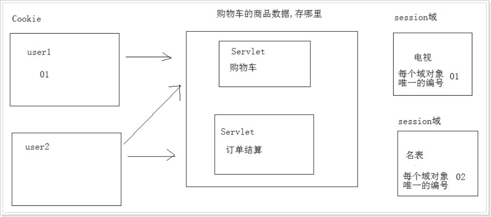

实现步骤:

- 获取JSESSIONID, 通过session对象中的getID()方法
- 创建Cookie对象, 将JSESSIONID 存入Cookie
- 使用response对象, 将cookie 响应回浏览器

API:

- session对象

  ```java
  String getID() 获取session对象的唯一编码,返回String
  ```

代码演示:

```java
@WebServlet("/save")
public class SaveSessionServlet extends HttpServlet {
    protected void doGet(HttpServletRequest request, HttpServletResponse response) throws ServletException, IOException {
        HttpSession session = request.getSession();
        session.setAttribute("heima","javaee");
        String sessionId = session.getId();
        System.out.println("sessionId = " + sessionId);
        //创建Cookie
        Cookie cookie = new Cookie("JSESSIONID", sessionId);
        cookie.setPath( request.getContextPath());
        cookie.setMaxAge(60*10);
        response.addCookie(cookie);
    }

    protected void doPost(HttpServletRequest request, HttpServletResponse response) throws ServletException, IOException {
        doGet(request, response);
    }
}
```

```java
@WebServlet("/save2")
public class Save2SessionServlet extends HttpServlet {
    protected void doGet(HttpServletRequest request, HttpServletResponse response) throws ServletException, IOException {
        Cookie[] cookies = request.getCookies();
        for (Cookie c : cookies) {
            if ("JSESSIONID".equals(c.getName())) {
                HttpSession session = request.getSession();
                String sessionId = session.getId();
                System.out.println("sessionId = " + sessionId);
                Object heima = session.getAttribute("heima");
                System.out.println("heima = " + heima);
            }
        }
        
    }

    protected void doPost(HttpServletRequest request, HttpServletResponse response) throws ServletException, IOException {
        doGet(request, response);
    }
}
```


### 4.3 session生命周期

- session创建时机

　　1：这个浏览器在servlet中第一次使用session时候,通过getSession方法创建；

　　2：这个浏览器第一次访问jsp的时候，服务器也会为这个浏览器创建一个session对象；

- session销毁时机

　　1：程序员调用invalidate方法；（立刻销毁）

　　2：设置的存活时间到了；（默认是30分钟）

　　3：服务器非正常关闭；（突然断电）

注意事项：

　　1：正常关闭服务器，session不会销毁，而是直接序列化到硬盘上，下一次服务器启动的时候，会重新创建出来；

　　2：如果浏览器单方面关闭会话，服务器上对应的session不会死亡 ，但是会导致服务器给浏览器创建的JSESSIONID的cookie死亡，当cookie死亡后，会导致浏览器无法找到上一个session对象，会造成服务器中session死亡的假象；

## 5 案例 验证码

### 5.1 需求

使用session存储验证码, 完成验证码的校验

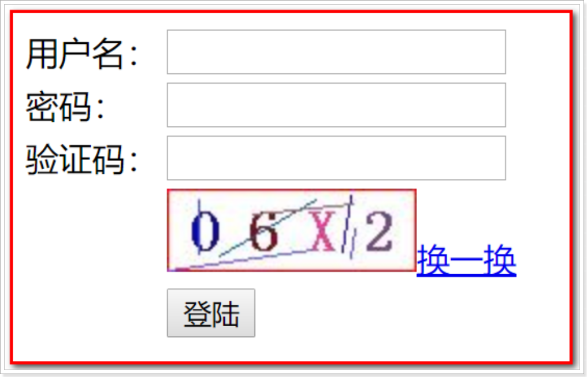

### 5.2 分析

1. 在登录页面用户登录的时候要查看到验证码，如图所示：
2. 在生成页面验证码图片的同时，需要使用session存储验证码
3. 在处理用户登录请求的时候，对验证码进行校验
4. 校验通过才能执行登录操作

### 5.3 步骤

```http
用户请求中的验证码获取
获取session中保存的验证码
与session中保存的验证码进行校验
	验证码错误，告诉用户，页面提示
	验证码正确，登录逻辑执行,打印提示
```

### 5.4 代码实现

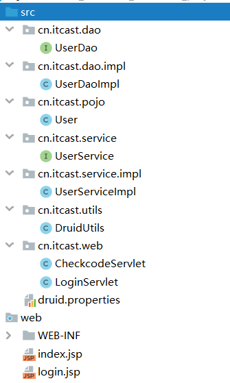 .


#### 5.4.1 入口页面 login.jsp

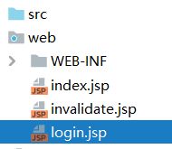.

```jsp
<%@ page contentType="text/html;charset=UTF-8" language="java" %>
<html>
<head>
    <title>Title</title>
    <style>
        .err {
            color : red;
        }
    </style>
</head>
<body>
    <form action="/day0702/loginServlet" method="post">
        <table>
            <tr>
                <td></td>
                <td>
                    <span class="err">
                        <%=request.getAttribute("errorMsg")!=null?request.getAttribute("errorMsg"):""%>
                    </span>
                </td>
            </tr>
            <tr>
                <td>用户名</td>
                <td><input type="text" name="username"/></td>
            </tr>
            <tr>
                <td>密码</td>
                <td><input type="password" name="password"/></td>
            </tr>
            <tr>
                <td>验证码</td>
                <td>
                    <input type="text" name="code_form"/>
                    
                    <script>
                        function changeCode(){
                            document.getElementById("codeImg").src = "/day0702/checkcodeServlet?r=" + Math.random();
                        }
                    </script>
                </td>
            </tr>
            <tr>
                <td></td>
                <td><input type="submit" value="登录"/></td>
            </tr>
        </table>
    </form>
</body>
</html>

```
#### 5.4.2 验证码Servlet

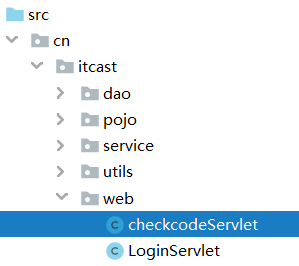.

```java
package cn.itcast.web;

import javax.imageio.ImageIO;
import javax.servlet.ServletException;
import javax.servlet.annotation.WebServlet;
import javax.servlet.http.HttpServlet;
import javax.servlet.http.HttpServletRequest;
import javax.servlet.http.HttpServletResponse;
import java.awt.*;
import java.awt.image.BufferedImage;
import java.io.IOException;
import java.util.Random;

@WebServlet("/checkcodeServlet")
public class checkcodeServlet extends HttpServlet {
    protected void doPost(HttpServletRequest request, HttpServletResponse response) throws ServletException, IOException {
        // 需求: 生成验证码
        // 1 生成一个画布对象
        int width = 120;
        int height = 40;
        BufferedImage bufi = new BufferedImage(width, height, BufferedImage.TYPE_INT_RGB);

        // 3 从画布上获取画笔
        Graphics g = bufi.getGraphics();

        // 4 填充背景色: 白色
        g.setColor(Color.white);
        g.fillRect(0, 0, width, height);

        // 5 绘制红色边框
        g.setColor(Color.red);
        g.drawRect(0, 0, width -1 , height - 1);

        // 6 在画布上 随机产生4个字符
        // 6.1 准备数据
        String data = "abcdefghjkmnpqrstuvwxyzABCDEFGHJKMNPQRSTUVWXYZ23456789";
        // 6.2 随机对象
        Random r = new Random();
        // 7.1 准备一个变量保存 验证码的值
        String code = "";

        // 6.3 循环产生4个
        for (int i = 0; i < 4; i++) {
            // 6.3.3 设置随机颜色
            g.setColor(new Color(r.nextInt(255), r.nextInt(255), r.nextInt(255)));

            // 6.3.2 设置字体
            g.setFont(new Font("楷体", Font.BOLD, 30));

            // 6.3.1 绘制字符
            // 产生随机索引
            int index = r.nextInt(data.length());
            char c = data.charAt(index);

            // 7.2 将生成的验证码字符 追加到 验证码变量中
            code += c + "";

            // 绘制字符串
            g.drawString(c + "", 10 + i * 30, 30);
        }

        // 7 将生成的验证码 打印到控制台
        System.out.println(code);

        // 9 将生成的验证码保存到session中
        request.getSession().setAttribute("code_session", code);

        // 8 绘制干扰线
        for (int i = 0; i < 10; i++) {
            // 设置随机颜色
            g.setColor(new Color(r.nextInt(255), r.nextInt(255), r.nextInt(255)));

            g.drawLine(r.nextInt(width), r.nextInt(height), r.nextInt(width), r.nextInt(height));
        }

        // 2 向画布内容输出给浏览器
        ImageIO.write(bufi, "jpg", response.getOutputStream());

    }

    protected void doGet(HttpServletRequest request, HttpServletResponse response) throws ServletException, IOException {
        doPost(request, response);
    }
}

```

#### 5.4.3 登录servlet

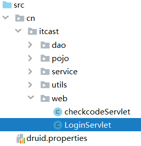.

```java
package cn.itcast.web;

import cn.itcast.pojo.User;
import cn.itcast.service.UserService;
import cn.itcast.service.impl.UserServiceImpl;
import org.apache.commons.beanutils.BeanUtils;

import javax.servlet.ServletException;
import javax.servlet.annotation.WebServlet;
import javax.servlet.http.HttpServlet;
import javax.servlet.http.HttpServletRequest;
import javax.servlet.http.HttpServletResponse;
import java.io.IOException;
import java.lang.reflect.InvocationTargetException;

@WebServlet("/loginServlet")
public class LoginServlet extends HttpServlet {
    protected void doPost(HttpServletRequest request, HttpServletResponse response) throws ServletException, IOException {
        // 解决获取参数的中文乱码 (浏览器 -> 服务器)
        request.setCharacterEncoding("utf-8");
        // 解决浏览器出现的中文乱码
        response.setContentType("text/html;charset=utf-8");

        // 1 校验验证码, 但是 需要session的知
        // 1.1 获取用户填写的验证码
        String code_form = request.getParameter("code_form");
        // 1.2 获取session中保存的验证码
        String code_session = (String) request.getSession().getAttribute("code_session");
        // 1.3 判断
        // 如果session中验证码为空 或 session中验证码和用户填写的验证码不一致, 就不合法,提示错误
        if(code_session==null || !code_session.equalsIgnoreCase(code_form)) {
            request.setAttribute("errorMsg", "验证码错误!");
            request.getRequestDispatcher("/login.jsp").forward(request, response);
            return; // 必须加, 如果请求转发后面有代码,一定要加
        }

        // 2 获取参数 封装到pojo类中
        User user = new User();
        try {
            BeanUtils.populate(user, request.getParameterMap());
        } catch (Exception e) {
            e.printStackTrace();
        }
        System.out.println("浏览器给服务器的参数信息: ================ " + user);

        // 3 调用业务层 处理登录业务
        UserService userService = new UserServiceImpl();
        User loginUser = userService.login(user); // 业务层返回给web层

        // 4 判断
        if(loginUser!=null) {
            // 4.1 如果查到了,表示登录成功
            // 4.1.1 将用户信息(业务层返回的)保存到session中, 作为判断用户是否登录的依据
            // 如果session中有用户信息,就表示用户已登录; 如果没有用户信息, 就表示没有登录
            request.getSession().setAttribute("loginUser", loginUser);

            // 4.1.2 使用重定向完成页面跳转到 首页 index.jsp
            response.sendRedirect(request.getContextPath() + "/index.jsp");
        } else {
            // 4.2 如果没有查到,表示登录失败
            // 4.2.1 将错误信息保存到request中
            request.setAttribute("errorMsg", "用户名或密码错误");
            // 4.2.2 使用请求转发跳转到登录页面 且 显示错误信息
            request.getRequestDispatcher("/login.jsp").forward(request, response);
        }
    }

    protected void doGet(HttpServletRequest request, HttpServletResponse response) throws ServletException, IOException {
        doPost(request, response);
    }
}

```

#### 5.4.4 业务层

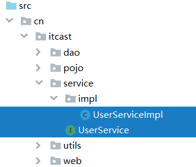 .

```java
package cn.itcast.service;

import cn.itcast.pojo.User;

public interface UserService {
    /**
     * 处理登录业务
     */
    User login(User user);
}

```


```java
package cn.itcast.service.impl;

import cn.itcast.dao.UserDao;
import cn.itcast.dao.impl.UserDaoImpl;
import cn.itcast.pojo.User;
import cn.itcast.service.UserService;

public class UserServiceImpl implements UserService {
    public User login(User user) {
        // 调用数据层 根据用户名和密码查询用户信息
        UserDao userDao = new UserDaoImpl();
        User loginUser = null;
        try {
            loginUser = userDao.queryUserByUsernameAndPassword(user);
        } catch (Exception e) {
            e.printStackTrace();
        }
        return loginUser;
    }
}

```

#### 5.5.5 数据层

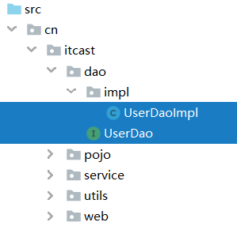.

```java
package cn.itcast.dao;

import cn.itcast.pojo.User;

public interface UserDao {
    /**
     * 根据用户名和密码查询用户信息
     */
    User queryUserByUsernameAndPassword(User user) throws Exception;
}

```


```java
package cn.itcast.dao.impl;

import cn.itcast.dao.UserDao;
import cn.itcast.pojo.User;
import cn.itcast.utils.DruidUtils;
import org.apache.commons.dbutils.QueryRunner;
import org.apache.commons.dbutils.handlers.BeanHandler;

public class UserDaoImpl implements UserDao {
    @Override
    public User queryUserByUsernameAndPassword(User user) throws Exception {
        // 创建执行sql的对象
        QueryRunner queryRunner = new QueryRunner(DruidUtils.getDataSource());
        // 执行sql 获取结果
        String sql = "select * from tb_user where username=? and password=?";
        Object[] paramArr = {user.getUsername(), user.getPassword()};
        User loginUser = queryRunner.query(sql, new BeanHandler<User>(User.class), paramArr);
        return loginUser;
    }
}

```

#### 5.5.6 首页

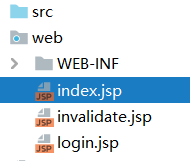.

```jsp
<%@ page import="cn.itcast.pojo.User" %>
<%@ page contentType="text/html;charset=UTF-8" language="java" %>
<html>
  <head>
    <title>$Title$</title>
  </head>
  <body>
  <%--
    <h1>day0702项目</h1>
    <h3><a href="/day0702/login.jsp">登录页面</a></h3>
    --%>
    <%
        // 判断用户是否已登录 根据session中是否有用户信息判断
        User loginUser = (User) session.getAttribute("loginUser");
        // 判断
        if(loginUser!=null) {
            // 表示已经登录, 显示欢迎信息
            out.print("<h1>");
            out.print("欢迎" + loginUser.getNickname() + "访问本网站");
            out.print("<a href='" + request.getContextPath() + "/invalidate.jsp'>注销</a>");
            out.print("</h1>");
        }else {
            // 表示没有登录, 跳转到登录页面
            response.sendRedirect(request.getContextPath() + "/login.jsp");
        }
    %>
  </body>
</html>
```

#### 5.5.7 注销页面

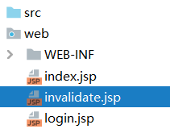.

```jsp
<%@ page contentType="text/html;charset=UTF-8" language="java" %>
<html>
<head>
    <title>Title</title>
</head>
<body>
    <%
        // 需求: 注销
        // 1 销毁session: 通知服务器销毁
        session.invalidate();
        // 2 重定向跳转到登录页面
        response.sendRedirect(request.getContextPath() + "/login.jsp");
    %>
</body>
</html>
```

