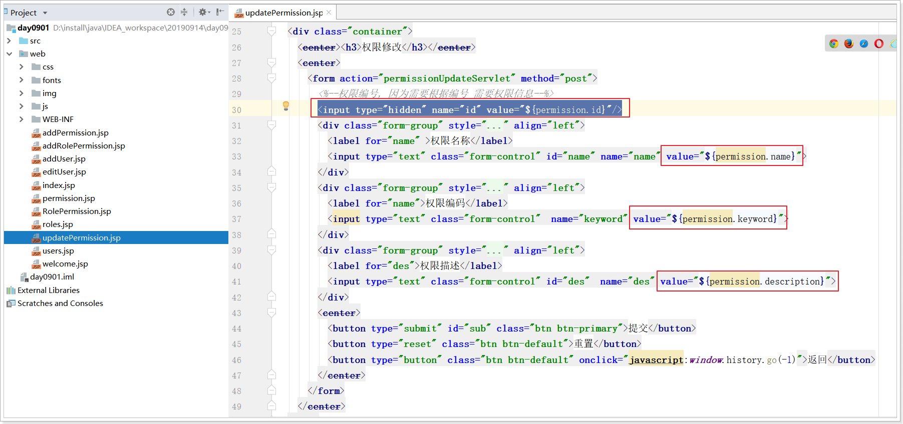

# 第一章 需求分析

## 1 需求说明

主要有三大模块,分别是权限 , 角色, 用户 。 主要针对这三部分数据进行增删改等操作。

- 权限模块
  - 展示权限列表，添加权限，修改相关权限，删除权限

# 第二章 数据库设计

## 1 表信息介绍

用户角色权限表一共5张表，还有一个菜单表。

分别有：t_user 用户表 ,    t_role 角色表 ,  tr_user_role 用户角色表(中间表)  ,  t_permission 权限表 ,

tr_role_permission 角色权限表(中间表) , menus 菜单表.

## 2 表关系描述


## 3 表介绍

### 3.1 用户表 t_user

| 字段名      | 字段类型                 | 描述               |
| ----------- | ------------------------ | ------------------ |
| id          | INT(11)   AUTO_INCREMENT | 用户主键           |
| username    | VARCHAR(32)              | 用户名             |
| password    | VARCHAR(256)             | 密码               |
| state       | INT(11)                  | 状态:0启用   1禁用 |
| email       | VARCHAR(100)             | 邮箱               |
| source      | VARCHAR(20)              | 用户来源           |
| create_time | DATETIME                 | 创建时间           |
| remark      | VARCHAR(32)              | 备注               |


### 3.2 角色表 t_role

| 字段名      | 字段类型                 | 描述     |
| ----------- | ------------------------ | -------- |
| id          | INT(11)   AUTO_INCREMENT | 角色主键 |
| name        | VARCHAR(32)              | 用户名   |
| keyword     | VARCHAR(64)              | 角色编码 |
| description | VARCHAR(128)             | 角色描述 |

### 3.3 用户角色表(中间表) tr_user_role

| 字段名  | 字段类型的 | 描述     |
| ------- | ---------- | -------- |
| user_id | INT(11)    | 用户主键 |
| role_id | INT(11)    | 角色主键 |

### 3.4 权限表 t_permission

| 字段名      | 字段类型                 | 描述     |
| ----------- | ------------------------ | -------- |
| id          | INT(11)   AUTO_INCREMENT | 权限主键 |
| name        | VARCHAR(32)              | 权限名称 |
| keyword     | VARCHAR(64)              | 权限编码 |
| description | VARCHAR(128)             | 权限描述 |

### 3.5 角色权限表 tr_role_permission

| 字段名        | 字段类型的 | 描述     |
| ------------- | ---------- | -------- |
| role_id       | INT(11)    | 角色主键 |
| permission_id | INT(11)    | 权限主键 |

# 第三章 环境搭建

## 1 数据库环境搭建

创建数据库所有需要的6张表,及准备数据

```sql
# 创建库
CREATE DATABASE  day09_db CHARSET ='utf8';

# 切换库
USE day09_db;

#用户表
DROP TABLE IF EXISTS `t_user`;
CREATE TABLE `t_user` (
  `id` INT(11) NOT NULL AUTO_INCREMENT,
  `username` VARCHAR(32) DEFAULT NULL,
  `password` VARCHAR(256) DEFAULT NULL,
  `state` INT(11) DEFAULT NULL COMMENT '用户状态\r\n            0 启用\r\n            1 禁用',
  `email` VARCHAR(100) DEFAULT NULL,
  `source` VARCHAR(20) DEFAULT NULL,
  `create_date` DATETIME DEFAULT NULL,
  `remark` VARCHAR(32) DEFAULT NULL,
  PRIMARY KEY (`id`)
) ENGINE=INNODB AUTO_INCREMENT=3 DEFAULT CHARSET=utf8mb4 COMMENT='用户表';

-- ----------------------------
-- Records of t_user
-- ----------------------------
INSERT INTO `t_user` VALUES ('1', 'admin', 'admin', '0', 'admin@mm.itheima.cn', '后台', '2019-08-08 00:00:00', '默认系统管理员');
INSERT INTO `t_user` VALUES ('2', 'zhangsan', '123456', '0', 'zhangsan@mm.itheima.cn', '后台', '2019-08-08 00:00:00', '测试账号');
INSERT INTO `t_user` VALUES ('3', 'lisi', '123456', '0', 'zhangsan@mm.itheima.cn', '后台', '2019-08-08 00:00:00', '测试账号');
INSERT INTO `t_user` VALUES ('4', 'wangwu', '123456', '0', 'zhangsan@mm.itheima.cn', '后台', '2019-08-08 00:00:00', '测试账号');
INSERT INTO `t_user` VALUES ('5', 'zhaoliu', '123456', '0', 'zhangsan@mm.itheima.cn', '后台', '2019-08-08 00:00:00', '测试账号');
INSERT INTO `t_user` VALUES ('6', 'zhangwuji', '123456', '0', 'zhangsan@mm.itheima.cn', '后台', '2019-08-08 00:00:00', '测试账号');
INSERT INTO `t_user` VALUES ('7', 'zhouzhiruo', '123456', '0', 'zhangsan@mm.itheima.cn', '后台', '2019-08-08 00:00:00', '测试账号');


#角色表
DROP TABLE IF EXISTS `t_role`;
CREATE TABLE `t_role` (
  `id` INT(11) NOT NULL AUTO_INCREMENT,
  `name` VARCHAR(32) DEFAULT NULL,
  `keyword` VARCHAR(64) DEFAULT NULL,
  `description` VARCHAR(128) DEFAULT NULL,
  PRIMARY KEY (`id`)
) ENGINE=INNODB AUTO_INCREMENT=3 DEFAULT CHARSET=utf8mb4 COMMENT='角色表';

-- ----------------------------
-- Records of t_role
-- ----------------------------
INSERT INTO `t_role` VALUES ('1', '系统管理员', 'ROLE_ADMIN', '系统管理员，具有最大权限');
INSERT INTO `t_role` VALUES ('2', '试题录入员', 'ROLE_QUESTION_RECORDER', '试题录入员，仅有基础题库录入权限');

#权限表
DROP TABLE IF EXISTS `t_permission`;
CREATE TABLE `t_permission` (
  `id` INT(11) NOT NULL AUTO_INCREMENT,
  `name` VARCHAR(32) DEFAULT NULL,
  `keyword` VARCHAR(64) DEFAULT NULL,
  `description` VARCHAR(128) DEFAULT NULL,
  PRIMARY KEY (`id`)
) ENGINE=INNODB AUTO_INCREMENT=14 DEFAULT CHARSET=utf8mb4 COMMENT='权限表';

-- ----------------------------
-- Records of t_permission
-- ----------------------------
INSERT INTO `t_permission` VALUES ('1', '学科新增', 'COURSE_ADD', '增加学科');
INSERT INTO `t_permission` VALUES ('2', '学科列表', 'COURSE_LIST', '显示学科列表');
INSERT INTO `t_permission` VALUES ('3', '学科更新', 'COURSE_UPDATE', '更新学科');
INSERT INTO `t_permission` VALUES ('4', '学科删除', 'COURSE_DELETE', '删除学科');
INSERT INTO `t_permission` VALUES ('5', '学科状态更新', 'COURSE_STATE_UPDATE', '更新状态');
INSERT INTO `t_permission` VALUES ('6', '试题新增', 'QUESTION_ADD', '增加试题');
INSERT INTO `t_permission` VALUES ('7', '试题列表', 'QUESTION_LIST', '显示试题列表');
INSERT INTO `t_permission` VALUES ('8', '试题更新', 'QUESTION_UPDATE', '更新试题');
INSERT INTO `t_permission` VALUES ('9', '试题预览', 'QUESTION_PREVIEW', '预览试题');
INSERT INTO `t_permission` VALUES ('10', '试题删除', 'QUESTION_DELETE', '删除试题');
INSERT INTO `t_permission` VALUES ('11', '试题状态更新', 'QUESTION_STATE', '更新试题状态');
INSERT INTO `t_permission` VALUES ('12', '试题提交审核', 'QUESTION_REVIEW_SUBMIT', '提交审核请求');
INSERT INTO `t_permission` VALUES ('13', '试题更新审核', 'QUESTION_REVIEW_UPDATE', '更新审核，审核通过与不通过');


#角色权限表
DROP TABLE IF EXISTS `tr_role_permission`;
CREATE TABLE `tr_role_permission` (
  `role_id` INT(11) NOT NULL,
  `permission_id` INT(11) NOT NULL,
  CONSTRAINT `fk_rp_permission` FOREIGN KEY (`permission_id`) REFERENCES `t_permission` (`id`),
  CONSTRAINT `fk_rp_role` FOREIGN KEY (`role_id`) REFERENCES `t_role` (`id`)
) ENGINE=INNODB DEFAULT CHARSET=utf8mb4 COMMENT='角色权限关系表';

INSERT INTO `tr_role_permission` VALUES ('1', '1');
INSERT INTO `tr_role_permission` VALUES ('1', '2');
INSERT INTO `tr_role_permission` VALUES ('2', '2');
INSERT INTO `tr_role_permission` VALUES ('1', '3');
INSERT INTO `tr_role_permission` VALUES ('1', '4');
INSERT INTO `tr_role_permission` VALUES ('1', '5');
INSERT INTO `tr_role_permission` VALUES ('1', '6');
INSERT INTO `tr_role_permission` VALUES ('2', '6');
INSERT INTO `tr_role_permission` VALUES ('1', '7');
INSERT INTO `tr_role_permission` VALUES ('2', '7');
INSERT INTO `tr_role_permission` VALUES ('1', '8');
INSERT INTO `tr_role_permission` VALUES ('2', '8');
INSERT INTO `tr_role_permission` VALUES ('1', '9');
INSERT INTO `tr_role_permission` VALUES ('2', '9');
INSERT INTO `tr_role_permission` VALUES ('1', '10');
INSERT INTO `tr_role_permission` VALUES ('2', '10');
INSERT INTO `tr_role_permission` VALUES ('1', '11');
INSERT INTO `tr_role_permission` VALUES ('2', '11');
INSERT INTO `tr_role_permission` VALUES ('1', '12');
INSERT INTO `tr_role_permission` VALUES ('2', '12');
INSERT INTO `tr_role_permission` VALUES ('1', '13');

-- ----------------------------
-- Table structure for `tr_user_role`
-- ----------------------------
#用户角色表
DROP TABLE IF EXISTS `tr_user_role`;
CREATE TABLE `tr_user_role` (
  `user_id` INT(11) NOT NULL,
  `role_id` INT(11) NOT NULL,
  PRIMARY KEY (`user_id`,`role_id`),
  KEY `fk_ru_role` (`role_id`),
  CONSTRAINT `fk_ru_role` FOREIGN KEY (`role_id`) REFERENCES `t_role` (`id`),
  CONSTRAINT `fk_ru_user` FOREIGN KEY (`user_id`) REFERENCES `t_user` (`id`)
) ENGINE=INNODB DEFAULT CHARSET=utf8mb4 COMMENT='用户角色关系表';

-- ----------------------------
-- Records of tr_user_role
-- ----------------------------
INSERT INTO `tr_user_role` VALUES ('1', '1');
INSERT INTO `tr_user_role` VALUES ('2', '2');
```

## 2 创建项目


## 3 项目jar准备

创建 web/WEB-INF/lib 目录, 别玩了 add as library

 

## 4 配置文件


druid.properties

```properties
driverClassName=com.mysql.jdbc.Driver
url=jdbc:mysql://127.0.0.1:3306/day09_db
username=root
password=root
initialSize=5
maxActive=10
maxWait=3000
```

## 5 建包结构

 

## 6 实体类

将资料中pojo类 拷贝到项目中

 


## 7 工具类

  

```java
package cn.itcast.utils;

import com.alibaba.druid.pool.DruidDataSourceFactory;

import javax.sql.DataSource;
import java.io.IOException;
import java.io.InputStream;
import java.sql.Connection;
import java.sql.SQLException;
import java.util.Properties;

public class DruidUtils {

    private static DataSource ds;

    static {
        try {
            // 1.1 读取配置文件内容
            Properties props = new Properties();
            // 1.2 加载文件
            InputStream in = DruidUtils.class.getClassLoader().getResourceAsStream("druid.properties");
            props.load(in);
            // 1.3 获取连接池 druid连接池
            ds = DruidDataSourceFactory.createDataSource(props);
        } catch (Exception e) {
            e.printStackTrace();
        }
    }

    // 1 获取连接
    public static Connection getConnection() throws Exception {
        return  ds.getConnection();
    }

    // 2 获取连接池 数据源, 将来给jdbc工具类使用, 如 DBUtils, mybatis
    public static DataSource getDataSource() throws Exception {
        return ds;
    }
}

```

## 8 导入静态资源及图片

 .

## 9 项目启动后访问


# 第四章 权限模块

## 1 功能-权限列表

### 1.1 需求: 权限列表

展示权限列表, 当用户点击左侧权限菜单时,右侧展示权限列表页面

### 1.2 效果:


### 1.3 思路分析

点击权限菜单,该菜单的路径在 menus 表中配置  PermissionServlet ,  请求会执行该Servlet的默认execute方法进行查询. 查询到所有权限集合封装后跳转到permission.jsp 展示


### 1.4 代码实现

#### 1.4.1 入口页面


#### 1.4.2 web层

```java
package cn.itcast.web;

import cn.itcast.pojo.Permission;
import cn.itcast.service.PermissionService;
import cn.itcast.service.impl.PermissionServiceImpl;

import javax.servlet.ServletException;
import javax.servlet.annotation.WebServlet;
import javax.servlet.http.HttpServlet;
import javax.servlet.http.HttpServletRequest;
import javax.servlet.http.HttpServletResponse;
import java.io.IOException;
import java.util.List;

@WebServlet("/permissionListServlet")
public class PermissionListServlet extends HttpServlet {
    protected void doPost(HttpServletRequest request, HttpServletResponse response) throws ServletException, IOException {
        // 解决获取参数的中文乱码 (浏览器 -> 服务器)
        request.setCharacterEncoding("utf-8");
        // 解决浏览器出现的中文乱码
        response.setContentType("text/html;charset=utf-8");

        // 1 调用业务层 查询所有权限
        PermissionService permissionService = new PermissionServiceImpl();
        List<Permission> permissionList = permissionService.queryAll();

        // 2 将权限集合 放到request中, 转发跳转到 权限列表中
        request.setAttribute("permissionList", permissionList);
        request.getRequestDispatcher("/permission.jsp").forward(request, response);
    }

    protected void doGet(HttpServletRequest request, HttpServletResponse response) throws ServletException, IOException {
        doPost(request, response);
    }
}
```

#### 1.4.3 业务层

 

```java
package cn.itcast.service.impl;

import cn.itcast.dao.PermissionDao;
import cn.itcast.dao.impl.PermissionDaoImpl;
import cn.itcast.pojo.Permission;
import cn.itcast.service.PermissionService;

import java.util.List;

public class PermissionServiceImpl implements PermissionService {

    PermissionDao permissionDao = new PermissionDaoImpl();

    @Override
    public List<Permission> queryAll() {
        // 调用数据层 查询所有权限
        List<Permission> permissionList = null;
        try {
            permissionList = permissionDao.queryAll();
        } catch (Exception e) {
            e.printStackTrace();
        }
        return permissionList;
    }
}
```

#### 1.4.4 数据层

 

```java
package cn.itcast.dao.impl;

import cn.itcast.dao.PermissionDao;
import cn.itcast.pojo.Permission;
import cn.itcast.utils.DruidUtils;
import org.apache.commons.dbutils.QueryRunner;
import org.apache.commons.dbutils.handlers.BeanListHandler;

import java.util.List;

public class PermissionDaoImpl implements PermissionDao {
    @Override
    public List<Permission> queryAll() throws Exception {
        QueryRunner queryRunner = new QueryRunner(DruidUtils.getDataSource());
        String sql = "select * from t_permission";
        List<Permission> permissionList = queryRunner.query(sql, new BeanListHandler<Permission>(Permission.class));
        return permissionList;
    }
}
```

#### 1.4.5 结果页

 

```jsp
       <c:forEach items="${permissionList}" var="per">
         <tr>
           <td>${per.id}</td>
           <td>${per.name}</td>
           <td>${per.keyword}</td>
           <td>${per.description}</td>
           <td><a class="btn btn-default btn-sm" href="updatePermission.jsp?id=${per.id}&name=${per.name}&keyword=${per.keyword}&des=${per.description}">修改</a>
             <a  class= "btn btn-default btn-sm" href="PermissionServlet?cmd=deletePermission&id=${per.id}">删除</a></td>
         </tr>
       </c:forEach>
```

## 2.功能-添加权限

### 2.1 需求:权限添加

点击添加权限,页面跳转到添加权限页面,点击提交,权限添加成功.

### 2.2 效果:


### 2.3 思路分析


### 2.4代码实现

#### 2.4.1 入口页面


#### 2.4.2 添加权限页面

 


```jsp
<%@ page language="java" contentType="text/html; charset=UTF-8"
         pageEncoding="UTF-8"%>
<%@ taglib uri="http://java.sun.com/jsp/jstl/core" prefix="c"%>
<html>
  <head>
    <meta charset="utf-8">
    <meta name="viewport" content="width=device-width, initial-scale=1">

    <link href="css/bootstrap.min.css" rel="stylesheet">
    <script src="js/jquery-3.3.1.js"></script>
    <script src="js/bootstrap.min.js"></script>

    <style>
      th,td{
        text-align: center;
      }
      td,th{
        font-size: 14px;
      }
    </style>

  </head>
  <body>
  <div class="container">
    <center><h3>新增权限</h3></center>
    <center>
      <form action="${pageContext.request.contextPath}/permissionAddServlet" method="post">
        <div class="form-group" style="width: 45%" align="left">
          <label for="name" >权限名称</label>
          <input type="text" class="form-control" id="name" name="name" >
        </div>
        <div class="form-group" style="width: 45%" align="left">
          <label for="keyword">权限编码</label>
          <input type="text" class="form-control" id="keyword" name="keyword" >
        </div>
        <div class="form-group" style="width: 45%" align="left">
          <label for="des">权限描述</label>
          <input type="text" class="form-control"  id="des"  name="description" >
        </div>
        <center>
          <button type="submit" id="sub" class="btn btn-primary">提交</button>
          <button type="reset" class="btn btn-default">重置</button>
          <button type="button" class="btn btn-default" onclick="javascript:window.history.go(-1)">返回</button>
        </center>
      </form>
    </center>
  </div>
  </body>
</html>
```

#### 2.4.3 web层

 

```java
package cn.itcast.web;

import cn.itcast.pojo.Permission;
import cn.itcast.service.PermissionService;
import cn.itcast.service.impl.PermissionServiceImpl;
import org.apache.commons.beanutils.BeanUtils;

import javax.servlet.ServletException;
import javax.servlet.annotation.WebServlet;
import javax.servlet.http.HttpServlet;
import javax.servlet.http.HttpServletRequest;
import javax.servlet.http.HttpServletResponse;
import java.io.IOException;
import java.lang.reflect.InvocationTargetException;
import java.util.List;

@WebServlet("/permissionAddServlet")
public class PermissionAddServlet extends HttpServlet {
    protected void doPost(HttpServletRequest request, HttpServletResponse response) throws ServletException, IOException {
        // 解决获取参数的中文乱码 (浏览器 -> 服务器)
        request.setCharacterEncoding("utf-8");
        // 解决浏览器出现的中文乱码
        response.setContentType("text/html;charset=utf-8");

        // 1 获取参数 封装到pojo类中
        Permission permission = new Permission();
        try {
            BeanUtils.populate(permission, request.getParameterMap());
        } catch (Exception e) {
            e.printStackTrace();
        }

        // 2 调用业务层 添加权限
        PermissionService permissionService = new PermissionServiceImpl();
        permissionService.addPermission(permission);

        // 3 使用重定向 跳转到权限列表页面
        response.sendRedirect(request.getContextPath() + "/permissionListServlet");
    }

    protected void doGet(HttpServletRequest request, HttpServletResponse response) throws ServletException, IOException {
        doPost(request, response);
    }
}
```

#### 2.4.3 业务层

```java
    @Override
    public void addPermission(Permission permission) {
        try {
            permissionDao.addPermission(permission);
        } catch (Exception e) {
            e.printStackTrace();
        }
    }
```

#### 2.4.4 数据层

```java
    public void addPermission(Permission permission) throws Exception {
        QueryRunner queryRunner = new QueryRunner(DruidUtils.getDataSource());
        String sql = "insert into t_permission(id, name, keyword, description) values(null, ?, ?, ?)";
        Object[] paramArr = {permission.getName(), permission.getKeyword(), permission.getDescription()};
        queryRunner.update(sql, paramArr);
    }
```

## 3 功能-删除权限器描述:

### 3.1 需求描述

点击删除权限,删除数据库中该权限信息

### 3.2 思路分析


### 3.3 代码实现

#### 3.3.1 入口页面


```jsp
<a href="${pageContext.request.contextPath}/permissionDelByIdServlet?id=${per.id}"
   class= "btn btn-default btn-sm" >删除</a></td>
```

#### 3.3.2 web层

```java
package cn.itcast.web;

import cn.itcast.service.PermissionService;
import cn.itcast.service.impl.PermissionServiceImpl;

import javax.servlet.ServletException;
import javax.servlet.annotation.WebServlet;
import javax.servlet.http.HttpServlet;
import javax.servlet.http.HttpServletRequest;
import javax.servlet.http.HttpServletResponse;
import java.io.IOException;

@WebServlet("/permissionDelByIdServlet")
public class PermissionDelByIdServlet extends HttpServlet {
    protected void doPost(HttpServletRequest request, HttpServletResponse response) throws ServletException, IOException {
        // 解决获取参数的中文乱码 (浏览器 -> 服务器)
        request.setCharacterEncoding("utf-8");
        // 解决浏览器出现的中文乱码
        response.setContentType("text/html;charset=utf-8");

        // 1 获取参数
        String id = request.getParameter("id");
        // 2 调用业务层 根据编号删除权限
        PermissionService permissionService = new PermissionServiceImpl();
        permissionService.delById(id);
        // 3 使用重定向 跳转到权限列表页
        response.sendRedirect(request.getContextPath() + "/permissionListServlet");
    }

    protected void doGet(HttpServletRequest request, HttpServletResponse response) throws ServletException, IOException {
        doPost(request, response);
    }
}
```

#### 3.3.3 业务层

```java
    public void delById(String id) {
        try {
            permissionDao.delById(id);
        } catch (Exception e) {
            e.printStackTrace();
        }
    }
```

#### 3.3.4 数据层

```java
    public void delById(String id) throws Exception {
        QueryRunner queryRunner = new QueryRunner(DruidUtils.getDataSource());
        String sql = "delete from t_permission where id=?";
        queryRunner.update(sql, id);
    }
```

## 4.功能-修改权限-数据回显

先查 后改

### 4.1 需求

### 4.2 分析


### 4.3 实现

#### 4.3.1 入口页面


#### 4.3.2 web

```java
package cn.itcast.web;

import cn.itcast.pojo.Permission;
import cn.itcast.service.PermissionService;
import cn.itcast.service.impl.PermissionServiceImpl;

import javax.servlet.ServletException;
import javax.servlet.annotation.WebServlet;
import javax.servlet.http.HttpServlet;
import javax.servlet.http.HttpServletRequest;
import javax.servlet.http.HttpServletResponse;
import java.io.IOException;

@WebServlet("/permissionUpdateUIServlet")
public class PermissionUpdateUIServlet extends HttpServlet {
    protected void doPost(HttpServletRequest request, HttpServletResponse response) throws ServletException, IOException {
        // 解决获取参数的中文乱码 (浏览器 -> 服务器)
        request.setCharacterEncoding("utf-8");
        // 解决浏览器出现的中文乱码
        response.setContentType("text/html;charset=utf-8");

        // 1 获取权限编号
        String id = request.getParameter("id");

        // 2 调用业务层 根据权限编号查询权限
        PermissionService permissionService = new PermissionServiceImpl();
        Permission permission = permissionService.queryPermissionById(id);

        // 3 将权限放到request中,使用请求转发跳转到修改页面
        request.setAttribute("permission", permission);
        request.getRequestDispatcher("/updatePermission.jsp").forward(request, response);
    }

    protected void doGet(HttpServletRequest request, HttpServletResponse response) throws ServletException, IOException {
        doPost(request, response);
    }
}
```

#### 4.3.3 业务层

```java
    public Permission queryPermissionById(String id) {
        Permission permission = null;
        try {
            permission = permissionDao.queryPermissionById(id);
        } catch (Exception e) {
            e.printStackTrace();
        }
        return permission;
    }
```

#### 4.3.4 数据层

```java
    public Permission queryPermissionById(String id) throws Exception {
        QueryRunner queryRunner = new QueryRunner(DruidUtils.getDataSource());
        String sql = "select * from t_permission where id = ?";
        return queryRunner.query(sql, new BeanHandler<Permission>(Permission.class), id);
    }
```

#### 4.3.5 显示页面



```jsp
<form action="permissionUpdateServlet" method="post">
        <%--权限编号, 因为需要根据编号 需要权限信息--%>
        <input type="hidden" name="id" value="${permission.id}"/>
        <div class="form-group" style="width: 45%" align="left">
          <label for="name" >权限名称</label>
          <input type="text" class="form-control" id="name" name="name" value="${permission.name}">
        </div>
        <div class="form-group" style="width: 45%" align="left">
          <label for="name">权限编码</label>
          <input type="text" class="form-control"  name="keyword" value="${permission.keyword}">
        </div>
        <div class="form-group" style="width: 45%" align="left">
          <label for="des">权限描述</label>
          <input type="text" class="form-control" id="description"  name="des" value="${permission.description}">
        </div>
        <center>
          <button type="submit" id="sub" class="btn btn-primary">提交</button>
          <button type="reset" class="btn btn-default">重置</button>
          <button type="button" class="btn btn-default" onclick="javascript:window.history.go(-1)">返回</button>
        </center>
      </form>
```

## 5.功能-修改权限

### 5.1 需求

### 5.2 分析


### 5.3 实现

#### 5.3.1 web

```java
package cn.itcast.web;

import cn.itcast.pojo.Permission;
import cn.itcast.service.PermissionService;
import cn.itcast.service.impl.PermissionServiceImpl;
import org.apache.commons.beanutils.BeanUtils;

import javax.servlet.ServletException;
import javax.servlet.annotation.WebServlet;
import javax.servlet.http.HttpServlet;
import javax.servlet.http.HttpServletRequest;
import javax.servlet.http.HttpServletResponse;
import java.io.IOException;
import java.lang.reflect.InvocationTargetException;

@WebServlet("/permissionUpdateServlet")
public class PermissionUpdateServlet extends HttpServlet {
    protected void doPost(HttpServletRequest request, HttpServletResponse response) throws ServletException, IOException {
        // 解决获取参数的中文乱码 (浏览器 -> 服务器)
        request.setCharacterEncoding("utf-8");
        // 解决浏览器出现的中文乱码
        response.setContentType("text/html;charset=utf-8");

        // 1 获取参数 封装到pojo类
        Permission permission = new Permission();
        try {
            BeanUtils.populate(permission, request.getParameterMap());
        } catch (Exception e) {
            e.printStackTrace();
        }

        // 2 调用业务层 修改用户信息
        PermissionService permissionService = new PermissionServiceImpl();
        permissionService.updatePermission(permission);

        // 3 使用重定向 跳转到用户列表也
        response.sendRedirect(request.getContextPath() + "/permissionListServlet");

    }

    protected void doGet(HttpServletRequest request, HttpServletResponse response) throws ServletException, IOException {
        doPost(request, response);
    }
}
```

#### 5.3.2 业务层

```java
    public void updatePermission(Permission permission) {
        try {
            permissionDao.updatePermission(permission);
        } catch (Exception e) {
            e.printStackTrace();
        }
    }
```

#### 5.3.3 数据层

```java
    public void updatePermission(Permission permission) throws Exception {
        QueryRunner queryRunner = new QueryRunner(DruidUtils.getDataSource());
        String sql = "update t_permission set name=?, keyword=?, description=? where id=?";
        Object[] paramArr = {permission.getName(), permission.getKeyword(), permission.getDescription(), permission.getId()};
        queryRunner.update(sql, paramArr);
    }
```

## 6 功能-权限分页

### 6.1 需求

.

### 6.2 分析


### 6.3 实现

#### 6.3.1 PageBean


```java
package cn.itcast.pojo;

import java.util.List;

public class PageBean<T> {

    private int currentPage; // 当前页码
    private int rows; // 每行显示条数
    private List<T> list; // 分页显示数据
    private int totalCount; // 总记录数
    private int totalPage; // 总页数
 	
    // get 和 set 方法
}
```

#### 6.3.2 web层

 

```java
package cn.itcast.web;

import cn.itcast.pojo.PageBean;
import cn.itcast.pojo.Permission;
import cn.itcast.service.PermissionService;
import cn.itcast.service.impl.PermissionServiceImpl;

import javax.servlet.ServletException;
import javax.servlet.annotation.WebServlet;
import javax.servlet.http.HttpServlet;
import javax.servlet.http.HttpServletRequest;
import javax.servlet.http.HttpServletResponse;
import java.io.IOException;
import java.util.List;

@WebServlet("/permissionListServlet")
public class PermissionListServlet extends HttpServlet {
    protected void doPost(HttpServletRequest request, HttpServletResponse response) throws ServletException, IOException {
        // 解决获取参数的中文乱码 (浏览器 -> 服务器)
        request.setCharacterEncoding("utf-8");
        // 解决浏览器出现的中文乱码
        response.setContentType("text/html;charset=utf-8");

        // 3 获取参数 : 当前页码 + 每页显示条数
        int currentPage = 1;
        try {
            currentPage = Integer.parseInt(request.getParameter("currentPage"));
        } catch (Exception e) {
        }

        int rows = 10;
        try {
            rows = Integer.parseInt(request.getParameter("rows"));
        } catch (Exception e) {
        }

        // 1 调用业务层 查询所有权限
        PermissionService permissionService = new PermissionServiceImpl();
        PageBean<Permission> pageBean = permissionService.queryPageData(currentPage, rows);

        // 2 将权限集合 放到request中, 转发跳转到 权限列表中
        request.setAttribute("pageBean", pageBean);
        request.getRequestDispatcher("/permission.jsp").forward(request, response);
    }

    protected void doGet(HttpServletRequest request, HttpServletResponse response) throws ServletException, IOException {
        doPost(request, response);
    }
}
```

#### 6.3.3 业务层

```java
@Override
    public PageBean<Permission> queryPageData(int currentPage, int rows) {
        PageBean<Permission> pageBean = new PageBean<Permission>();

        try {
            // 1 查询分页显示数据
            int start = (currentPage - 1) * rows;
            List<Permission> permissionList = permissionDao.queryPageData(start, rows);
            // 2 查询总记录数
            int totalCount = permissionDao.queryTotalCount();

            // 3 计算 总页数 = (总记录数 + 每页显示条数 - 1) / 每页显示条数
            int totalPage = (totalCount + rows - 1) / rows;

            // 4 封装数据
            pageBean.setCurrentPage(currentPage);
            pageBean.setRows(rows);
            pageBean.setList(permissionList);
            pageBean.setTotalCount(totalCount);
            pageBean.setTotalPage(totalPage);
        } catch (Exception e) {
            e.printStackTrace();
        }

        return pageBean;
    }
```

#### 6.3.4 数据层

```java
    @Override
    public List<Permission> queryPageData(int start, int rows) throws Exception {
        QueryRunner queryRunner = new QueryRunner(DruidUtils.getDataSource());
        String sql = "select * from t_permission limit ?, ?";
        List<Permission> permissionList = queryRunner.query(sql, new BeanListHandler<Permission>(Permission.class), start, rows);
        return permissionList;
    }

    @Override
    public int queryTotalCount() throws Exception {
        QueryRunner queryRunner = new QueryRunner(DruidUtils.getDataSource());
        String sql = "select count(1) from t_permission";
        Long totalCount = queryRunner.query(sql, new ScalarHandler<Long>());
        return totalCount.intValue();
    }
```

#### 6.3.4 显示分页数据


```jsp
       <c:forEach items="${pageBean.list}" var="per">
         <tr>
           <td>${per.id}</td>
           <td>${per.name}</td>
           <td>${per.keyword}</td>
           <td>${per.description}</td>
           <td>
             <a href="${pageContext.request.contextPath}/permissionUpdateUIServlet?id=${per.id}"
                class="btn btn-default btn-sm" >修改</a>
             <a href="${pageContext.request.contextPath}/permissionDelByIdServlet?id=${per.id}"
                class= "btn btn-default btn-sm" >删除</a></td>
         </tr>
       </c:forEach>
```

扩展知识点: 序号


#### 6.3.5 分页工具条


```jsp
      <nav class="text-center">
        <ul class="pagination">
          <%--1 上一页效果--%>
          <%--1.1 如果是第一页, 增加禁止点击效果, 取消点击功能--%>
            <c:if test="${pageBean.currentPage == 1}">
                <li class="disabled">
                  <a href="#" aria-label="Previous">
                    <span aria-hidden="true">&laquo;</span>
                  </a>
                </li>
            </c:if>
          <%--1.2 如果不是第一页, 点击效果--%>
            <c:if test="${pageBean.currentPage != 1}">
              <li>
                <a href="permissionListServlet?currentPage=${pageBean.currentPage - 1}" aria-label="Previous">
                  <span aria-hidden="true">&laquo;</span>
                </a>
              </li>
            </c:if>


          <c:forEach begin="1" end="${pageBean.totalPage}" step="1" var="i">
              <%--如果是当前页,高亮显示, 取消点击功能--%>
              <c:if test="${pageBean.currentPage == i}">
                  <li class="active"><a href="#">${i}</a></li>
              </c:if>
              <%--如果不是当前页, 取消高亮显示, 增加点击功能--%>
              <c:if test="${pageBean.currentPage != i}">
                  <li><a href="permissionListServlet?currentPage=${i}">${i}</a></li>
              </c:if>
          </c:forEach>

          <li>
            <a href="#" aria-label="Next">
              <span aria-hidden="true">&raquo;</span>
            </a>
          </li>dd
        </ul>
      </nav>
    </div>
```


 


