# 第一章 JavaScript的概述

### 1 什么是 JavaScript js

JavaScript是一种属于网络的脚本语言,已经被广泛用于Web应用开发,常用来为网页添加各式各样的动态功能,为用户提供更流畅美观的浏览效果。通常JavaScript脚本是通过嵌入在HTML中来实现自身的功能的。

JavaScript的组成部分：

- ECMAScript：描述了JS的语法和基本对象
- 文档对象模型（DOM）：描述与处理网页内容的方法和接口。
- 浏览器对象模型（BOM）：描述与浏览器进行交互的方法和接口。

livescript 

### 2 JavaScript的日常用途

1. 嵌入动态文本于HTML页面。
2. 对浏览器事件做出响应。
3. 读写HTML元素
4. 在数据被提交到服务器之前验证数据。
5. 检测访客的浏览器信息。
6. 控制cookies，包括创建和修改等。

### 3 JavaScript的引入

在HTML文件中引入JavaScript有两种方式

- 一种是在HTML文档直接嵌入JavaScript脚本，称为内嵌式
- 另一种是链接外部JavaScript脚本文件，称为外联式。

内嵌式，在HTML文档中，通过`<script>`标签引入，如下

```html
<script type="text/javascript">
	//此处为JavaScript代码
</script>
```

外联式，在HTML文档中，通过`<script src="">`标签引入.js文件，如下：

```html
<script src="1.js" type="text/javascript" ></script>
```

注意：如果在script标签,使用src引入了一个文件，那么当前js标签内的代码全部作废  ,不运行

```html
<!DOCTYPE html>
<html>
	<head>
		<meta charset="utf-8">
		<title></title>
	</head>
	<body>
		<!-- 内嵌式 -->
		<script type="text/javascript">
			alert("内嵌式");
		</script>
		<!-- 外联式 -->
		<script type="text/javascript" src="js/1.js">
			<!-- 由于script标签引入了src， 所以，当前script标签中的代码不执行，全部作废 -->
			alert("测试");
		</script>
		
	</body>
</html>
```


# 第二章 基本语法

JS的语法规则：

- JS严格区分大小写
- 语句需要使用分号结尾
- JS中的命名规则， 按照Java的标识符
- JS中的关键字不能用来命名使用， 如 function

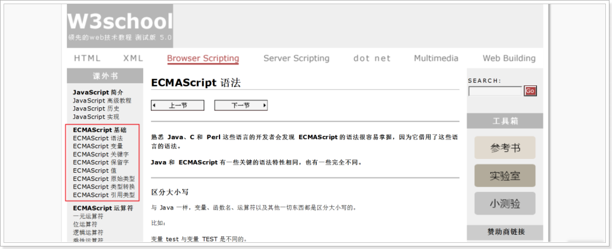

## 1 变量

JS是弱类型语言，Java是强制类型语言

弱类型，并不是没有数据类型，而是定义变量时不需要明确类型。

- JS变量定义，关键字var； 格式：`var 变量名 = 值;`

```javascript
var 变量名 = 值;	
//JavaScript变量是弱类型，及同一个变量可以存放不同类型的数据
//JavaScript变量可以不声明，直接使用。默认值：undefined
```

```html
<script type="text/javascript">
    var num = 100;
    alert(num);

    num = "黑马";
    alert(num);

    num = 3.14;
    alert(num);

    // 定义变量, 不指定值
    var num2;
    alert(num2);	
</script>
```


## 2 JS的数据类型

- 数字类型 number: 表示任意数字
- 布尔类型 boolean: 有两个值 true 和 false
- 字符串类型 string: 字符串由双引号（"）或单引号（'）声明的。JavaScript 没有字符类型	
- 引用类型 object: 表示JS中的引用类型
  - 空值 Null ,只有一个专用值 null，表示空，属于object类型。
  - 值 undefined 实际上是从值 null 派生来的，因此 ECMAScript 把它们定义为相等的。
- 未初始化 undefined: 类型只有一个值，即 undefined。当声明的变量未初始化时，该变量的默认值是 undefined。

写程序, 使用JS关键字 `typeof(变量)` 显示出变量的类型

**代码演示:**

```html
<script type="text/javascript">
    var num = 123;
    alert( typeof(num) ); //number

    var b = true;
    alert( typeof(b) ); //boolean

    var str = "hello";
    alert( typeof(str) ); //string

    var date = new Date(); 
    alert( typeof(date) ); //object

    var n = null;
    alert( typeof(n)); // objcet

    var u;
    alert( typeof(u)); //undefined


    // 值 undefined 实际上是从值 null 派生来的，因此 ECMAScript 把它们定义为相等的。
    alert(undefined == null); // true
</script>
```


## 3 JS的三种输出方式

- window.alert(”)，弹框效果，window可省略。弹出比较突然，用户的体验不好，基本用来测试代码使用

```html
<script type="text/javascript"> 
    /*
     * window.alert()  把小括号里的内容，以弹窗的方式显示出来
     * window是BOM对象，指的是整个浏览器，可以省略不写
     */
    window.alert('浏览器弹框显示');
    alert("浏览器弹框显示");
</script>
```

- console系列，会在控制台（一般使用F12键打开）输出内容，开发时会经常使用

```html
<script>
    console.log('控制台.日志()');
    console.warn('控制台.警告()');
    console.error('控制台.错误()');
</script>
```

- document.write()，直接在页面上输出内容

```html
<script>
    /*
     * document 指的是我们所写的HTML文档
     * write() 把小括号里的内容输出到页面上
     */
    document.write('页面显示内容');
</script>
```


## 4 运算符

### 算术运算符 | 赋值运算符 | 比较运算符 | 逻辑运算符

JavaScript运算符与Java运算符基本一致。

- 算术运算符：+ ，- ，* ，/ ，% ，++ ，--
- 赋值运算符：= ，+= ，-= ，*= ，/=，%=
- 比较运算符：== ，=== ，!= ，> ，<，>=，<=
- 逻辑运算符：&& ， || ，!

**代码演示：**

- +字符串连接， 减， 乘，除
- `==`与`===`的区别

```html
<script type="text/javascript">
    //+字符串连接, 减， 乘，除
    var num = "5";
    console.log(num + "2"); //52
    console.log(num - 2); // 3
    console.log(num * 2); // 10
    console.log(num / 2); // 2.5

    /*
	==与===的区别
	==运算符： 只比较值是否相等，值相等 就为 true
	===运算符：比较值与数据类型是否都相等，都相等就为 true
	*/
    if(5 === "5"){
        console.log("相等");
    } else {
        console.log("不相等");
    }
</script>
```


### Boolean布尔类型运算

JS中的布尔类型运算 与 java不同：

- 数字类型：非0 就是true
- 字符串类型：非"" 就是true；长度>0 就是true
- 0、 null、 undefined 等 需要理解成 false

```html
<script type="text/javascript">
    // var b = 1;
    var b = "hello";
    if(b){
        console.log("真的");
    } else {
        console.log("假的");
    }
</script>
```


## 5 JS的流程控制语句

JS的流程控制语句 与 java一样。

js也存在if、if-else、for、switch等逻辑语句，与java使用方式一致，此处不再一一阐述。

```html
<script type="text/javascript">
    //js格式
    for(var i=0; i<5; i++){
        console.log(i);
    }
</script>
```


## 6 函数（重要）

js的函数： 就是方法， 是js非常重要的组成部分，js最常用的函数的定义方式有两种：

### 普通函数

```javascript
//定义函数
//参数列表,定义变量 var,不要写; 数据类型都是var来表示，所以函数定义时 没有返回值类型
function 函数名(参数列表){
	js逻辑代码
    //return 函数的返回值,写return就返回,不写就不返回
}

//函数调用：函数名(实际参数);
```


```html
<!DOCTYPE html>
<html lang="en">
<head>
    <meta charset="UTF-8">
    <title>Title</title>
    <script>
        function demo1() {
            document.write("1111111111111111111111111111111<hr/>");
        }
        // 细节1: 方法只有被调用才会执行
        demo1();

        // 求和
        // 细节2: 参数列表不需要指定类型
        // 细节3: 如果方法需要返回值, 直接使用return返回即可, 不需要指定返回值的类型
        function demo2(a, b) {
            return a + b;
        }
        var sum = demo2(3, 6);
        document.write("3 + 6 = " + sum + "<hr/>");

        function demo3(){
            document.write("调用无参数的demo3()方法... ...<hr/>");
        }

        function demo3(a, b){
            document.write("调用有参数的demo3(a, b)方法... ...<hr/>");
        }

        // 细节4: js函数没有重载的概念, 如果方法名一致, 后面的函数 会把前面的给覆盖掉
        demo3();

        function demo4() {
            document.write("调用无参数的demo4()方法... ...<hr/>");
        }
        // 细节5: 如果函数不需要参数,我就传参数 不会报错,正常执行
        demo4(3, 4, 5);

        function demo5(a, b, c) {
            document.write("调用有参数的demo5(a, b, c)方法... ...<hr/>");
        }

        // 细节6: 如果函数需要参数,我就不传参数 不会报错,正常执行
        demo5();
    </script>
</head>
<body>

</body>
</html>
```


### 匿名函数

```javascript
//定义匿名函数也就是没有名字的函数
function(参数列表){
	js逻辑代码
}
```

匿名函数没有办法直接调用，一般情况下结合事件使用：

```javascript
//定义函数并赋值给变量：
var fn = function(参数列表){
    js逻辑代码
}
//调用函数：fn(实际参数);
```

例如：求和输出的函数

```html
<script type="text/javascript">
	//定义匿名函数并赋值给变量
    var fn = function(a, b){
        console.log(a+b);
    }
    //通过变量名调用函数
    fn(5,8);

</script>
```


## 7 事件（重要）

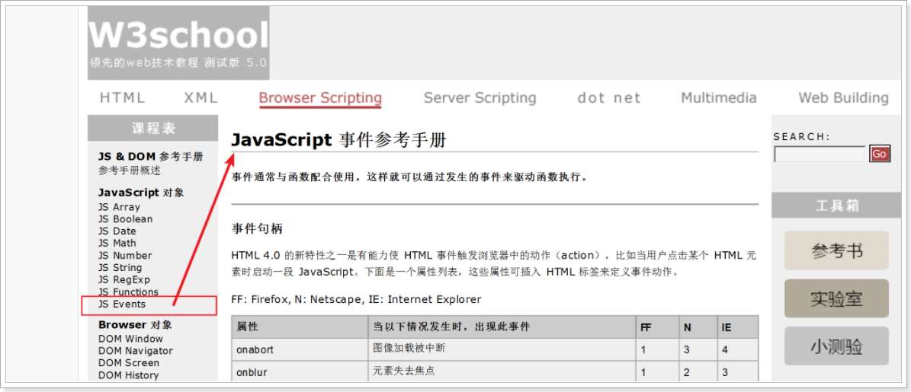

- **事件概述**

JavaScript 使我们有能力创建动态页面。事件是可以被 JavaScript 侦测到的行为。

网页中的每个元素都可以产生某些可以触发 JavaScript 函数的事件。比方说，我们可以在用户点击某按钮时产生一个 onClick 事件来触发某个函数。事件在 HTML 页面中定义。

**事件举例：**

- 鼠标点击  
- 页面或图像载入  
- 鼠标悬浮于页面的某个元素之上  
- 在表单中选取输入框  
- 提交表单  
- 键盘按键 

事件通常与函数配合使用，这样就可以通过发生的事件来驱动函数执行。

- **常用的事件**

| **事件名**   | **描述**                                      |
| ------------ | --------------------------------------------- |
| **onload**   | 某个页面或图像被完成加载                      |
| **onsubmit** | 当表单提交时触发该事件---注意事件源是表单form |
| **onclick**  | 鼠标点击某个对象                              |
| ondblclick   | 鼠标双击某个对象                              |
| **onblur**   | 元素失去焦点                                  |
| **onfocus**  | 元素获得焦点                                  |
| **onchange** | 用户改变域的内容                              |
| onkeydown    | 某个键盘的键被按下                            |
| onkeypress   | 某个键盘的键被按下或按住                      |
| onkeyup      | 某个键盘的键被松开                            |
| onmousedown  | 某个鼠标按键被按下                            |
| onmouseup    | 某个鼠标按键被松开                            |
| onmouseover  | 鼠标被移到某元素之上                          |
| onmouseout   | 鼠标从某元素移开                              |
| onmousemove  | 鼠标被移动                                    |


**==要学习js的事件，必须要理解如下几个概念：==**

- 事件源：在页面中,用户可以操作的元素,称为事件源，例如：按钮,文本框, 浏览器窗口
- 事件：用户怎么操作的事件源，例如：鼠标(点击,双击,悬浮,离开), 键盘操作(按下,弹起)
- 监听器：窃听器(声音),针孔摄像头(声音,图像)
  - 为事件源 安装监听器, 鼠标监听器、键盘监听器
  - 只要有操作,就会被监听器捕获到,有对应的处理方式
  - 监听器会自动调用处理方式
- 处理方式： 函数

```html
<!DOCTYPE html>
<html>
	<head>
		<meta charset="utf-8">
		<title></title>
		<script type="text/javascript">
			// 匿名函数
			window.onload = function(){
				alert("页面加载完成");
			}
		
			function fn(){
				console.log("呀呀呀~~ 疼");
			}
			
			function fn_blur(){
				console.log("失去焦点");
			}
		</script>
	</head>
	<body>
		<!--
		 事件代码编写的步骤：
			1. 为标签 绑定事件监听器(鼠标点击)，添加属性 onclick="函数名()"
			2. 编写js函数 fn()
			3. 访问浏览器页面，用户点击绑定了事件的标签，进行了事件发送--被监听器捕获--调用JS函数处理事件
		 -->
		<input type="button" value="点我点我" onclick="fn()"/>
		
		<input type="text" placeholder="请输入内容" onblur="fn_blur()" />
	</body>
</html>

```


# 第三章 DOM对象

## 1 什么是DOM

DOM：Document Object Model 文档对象模型，定义了访问和处理 HTML 文档的标准方法。。

HTML DOM 把 HTML 文档呈现为带有元素、属性和文本的树结构（节点树）。

```html
<html>
	<head>
		<title>文档标题</title>
	</head>
	<body>
		<a href="#">我的链接</a>
		<h1>我的标题</h1>
	</body>
</html>
```

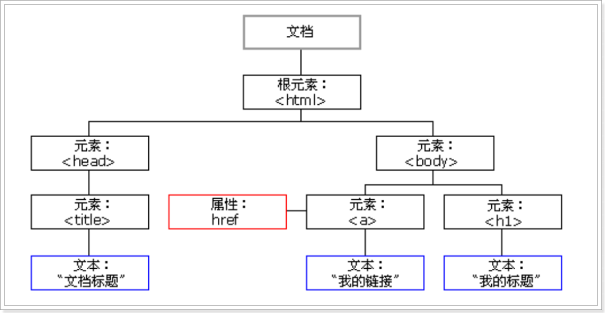

要改变页面的某个元素，就需要获得对 HTML 文档中所有元素进行访问的入口。访问入口 通过文档对象模型（DOM）获得，DOM提供了 HTML 元素进行添加、移动、改变或移除的方法和属性。


## 2 DOM文档对象的API

浏览器加载整个HTML文档形成Document 对象，Document 对象可以访问和操作HTML文档中的所有元素。

### 元素的操作 Document

- 元素的获取
  - 根据id获得一个元素：getElementById(id属性值)
  - 根据标签名称获得多个元素：getElementsByTagName(标签名称)
  - 根据name属性获得多个元素：getElementsByName(name属性值)
  - 根据class属性获得多个元素：getElementsByClassName(class属性值)

### 元素的操作 Element

- 元素的获取
  - 获取当前元素父节点元素：==属性== parentElement
- 元素的添加、移除、移动(替换)、克隆、
  - 判断当前元素是否有子节点元素：hasChildNodes()
  - 删除当前元素的子节点元素：removeChild(子元素)
  - 替换当前元素的子节点元素：replaceChild(新节点, 旧节点)
  - 克隆当前元素节点：cloneNode(boolean值是否同时克隆子节点)
  - 创建一个新节点元素：createElement(标签名)
  - 添加当前元素的子节点元素(在所有子元素末尾添加)：appendChild(子元素)
  - 插入当前元素的新子节点元素(在指定的子元素前面 插入新元素)：insertBefore(新元素, 原有子元素)

### 属性的操作 Attribute

- 获取某个属性：元素.属性名
- 获得属性的值：getAtrribute(属性名)
- 设置属性的值：setAtrribute(属性名, 属性值)
- 删除某个属性：removeAtrribute(属性名)
- 设置标签样式：==属性== style

### 文本的操作 Text

- 获取某个属性：元素.属性名

- 标签体的获取与设置
  - 识别自动解析HTML标签：==属性== innerHTML
  - 不识别HTML标签，纯文本：==属性== innerText

## 3 DOM操作练习(重点)

### getElementById

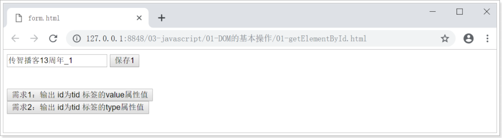


```html
<script type="text/javascript">
    // 需求1：输出 id为tid 标签的value属性值
    function fn1() {
        //1. 根据id获得一个元素：getElementById(id属性值)
        var element = document.getElementById("tid");
        //2. 获取value属性值并输出 
        console.log(element.value);
    }

    // 需求2：输出 id为tid 标签的type属性值
    function fn2() {
        //1. 根据id获得一个元素：getElementById(id属性值)
        var element = document.getElementById("tid");
        //2. 获取value属性值并输出 
        console.log(element.type);
    }
</script>
```

### getElementsByTagName

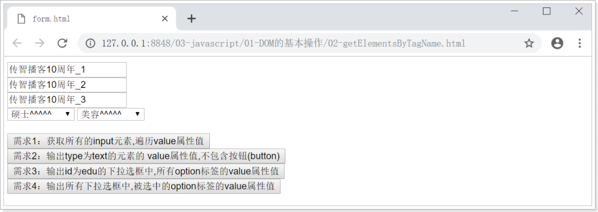

```html
<script type="text/javascript">
    // 需求1：获取所有的input元素,遍历value属性值
    function fn1(){
        //1. 使用getElementsByTagName() 获取input标签名称的多个元素
        var inputs = document.getElementsByTagName("input");
        //console.log(inputs);
        //2. 遍历每个元素的值
        for (var i=0; i<inputs.length; i++) {
            var ele = inputs[i];
            //console.log(ele);
            console.log(ele.value);
        }
    }

    // 需求2：输出type为text的元素的 value属性值,不包含按钮(button)
    function fn2(){
        //1. 获取所有input元素
        var inputs = document.getElementsByTagName("input");
        //2. 遍历，获取当前元素type值，判断 type=="text"
        for (var i = 0; i < inputs.length; i++) {
            var element = inputs[i]; 
            if(element.type == "text"){
                //3. 输出符合 type="text"元素的value属性值
                console.log(element.value);
            }
        }
    }
    // 需求3：输出id为edu的下拉选框中,所有option标签的value属性值
    function fn3(){
        //1. 获取id为edu的标签元素 getElementById
        var eduEle = document.getElementById("edu");
        //2. 获取id为edu的标签元素 下 所有option标签 getElementsByTagName
        var optionsEle = eduEle.getElementsByTagName("option");
        //3. 遍历每个option标签的value属性值
        for(var i=0; i<optionsEle.length; i++){
            console.log(optionsEle[i].value);
        }
    }

    // 需求4：输出所有下拉选框中,被选中的option标签的value属性值
    function fn4(){
        //1.获取所有option标签 getElementsByTagName
        var optionsEle = document.getElementsByTagName("option");
        //2.遍历判断每个option的selected属性是否为true,  selected="selected" 代表为true
        for(var i=0; i<optionsEle.length; i++){
            var optionEle = optionsEle[i]; // 获取每一个option元素
            if (optionEle.selected == true) {
                //3.打印被选中的option标签的value属性值
                console.log(optionEle.value);
            }
        }
    }
</script>
```

### getElementsByName

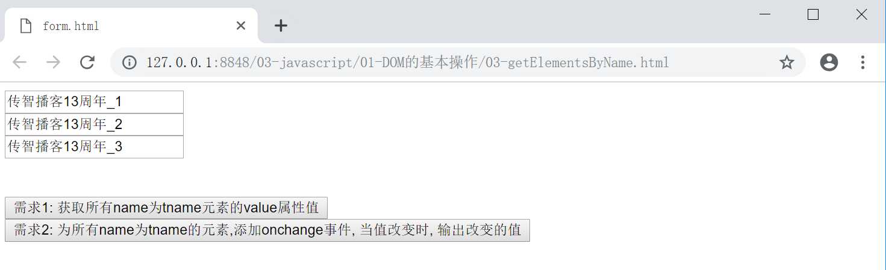

```html
<script type="text/javascript">
    //需求1: 获取所有name为tname元素的value属性值
    function fn1() {
        //1.获取所有name为tname的元素 getElementsByName
        var elements = document.getElementsByName("tname");
        //2.打印所有元素的value属性值
        for (var i = 0; i < elements.length; i++) {
            console.log(elements[i].value);
        }
    }

    //需求2: 为所有name为tname的元素,添加onchange事件, 当值改变时, 输出改变的值
    function fn2() {
        //1.获取所有name为tname的元素
        var elements = document.getElementsByName("tname");
        //2.为每个元素添加添加onchange事件, 当值改变时, 输出改变的值
        for (var i = 0; i < elements.length; i++) {
            var element = elements[i];
            //为每个元素添加添加onchange事件
            element.onchange = function() {
                // this 代表当前对象
                alert(this.value);
            };
        }
    }
</script>
```

### getElementsByClassName

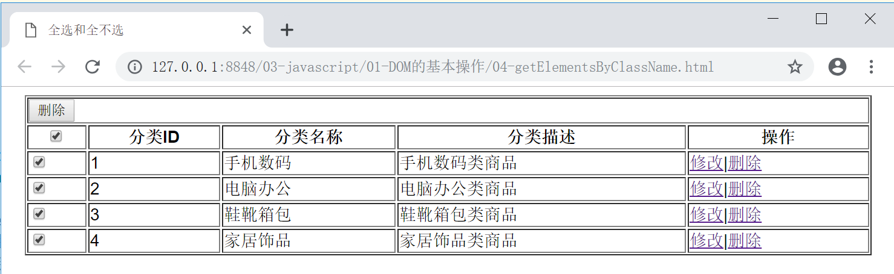

```html
<script type="text/javascript">
    //需求1：所有的分选框的checked属性值,跟随总选框checked属性值
    function selectAll(thisEle){
	 	//参数thisEle用于接收 总选框元素对象。这种方式为参数传递
        var fens = document.getElementsByClassName("itemSelect");
        for (var i = 0; i < fens.length; i++) {
            fens[i].checked = thisEle.checked;
        }
    }
</script>
```

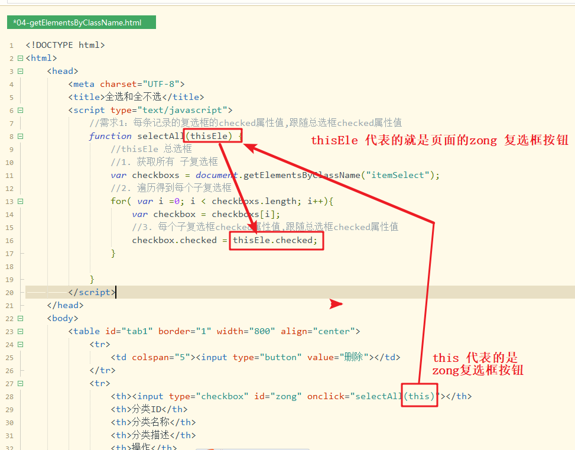


### getAttribute

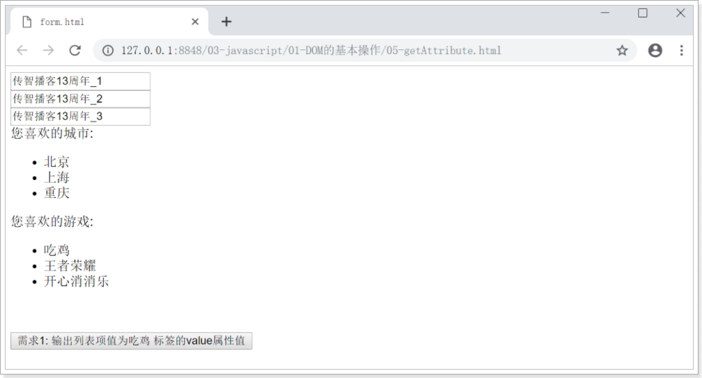

```html
<script type="text/javascript">
    //需求1: 输出列表项值为吃鸡 标签的value属性值
    function fn(){
        //1.根据id获取列表项值为吃鸡 标签 getElementById
        var element = document.getElementById("cj");
        //2.使用getAttribute 获取value属性值
        console.log( element.getAttribute("value") );
    }
</script>
```

### setAttribute

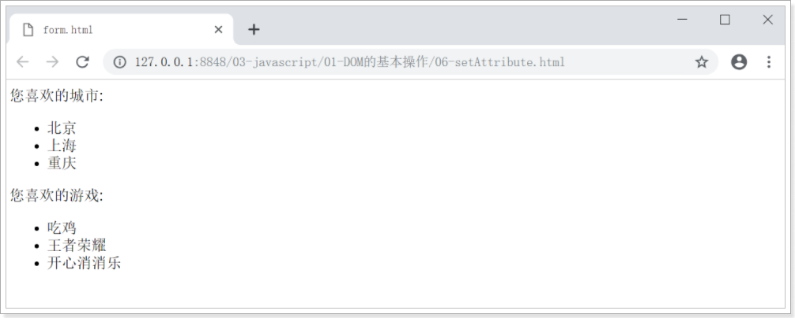


```html
<script type="text/javascript">
    //需求1: 为列表项值为吃鸡 标签 添加的name属性值为chiji, 并获取添加后的name属性值
    function fn() {
        //1. 获取列表项值为吃鸡 标签 , getElementById
        var element = document.getElementById("cj");
        //2. 为元素添加name属性值为chiji , setAttribute()
        element.setAttribute("name", "chiji");
        //3. 获取添加后的name属性值, getAttribute()
        console.log(element.getAttribute("name"));
    }
</script>
```

### innerHTML

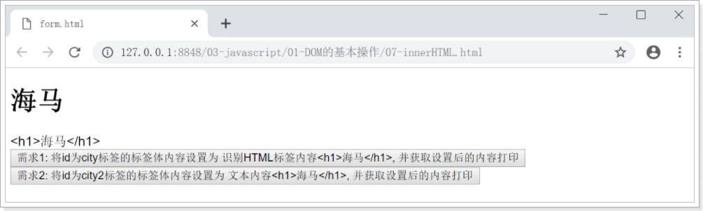

```html
<script type="text/javascript">
    //需求1: 将id为city标签的标签体内容设置为 识别HTML标签内容<h1>海马</h1>, 并获取设置后的内容打印
    function fn1(){
        //1.获取标签
        var element = document.getElementById("city");
        //2.为标签体内容设置为 识别HTML标签内容<h1>海马</h1>,  innerHTML = 值
        element.innerHTML = "<h1>海马</h1>";
        //3.获取设置后的内容打印 innerHTML
        console.log(element.innerHTML);
    }

    //需求2: 将id为city2标签的标签体内容设置为 文本内容<h1>海马</h1>, 并获取设置后的内容打印
    function fn2(){
        //1.获取标签
        var element = document.getElementById("city2");
        //2.为标签体内容设置为 文本内容<h1>海马</h1>,  innerText = 值
        element.innerText = "<h1>海马</h1>";
        //3.获取设置后的内容打印 innerText
        console.log(element.innerText);
    }
</script>
```

## 4 案例 表单用户名验证

### 案例需求

提交表单时，判断用户名文本框是否填写了内容；若没填写内容 给出提示 并 取消表单向服务器提交数据。

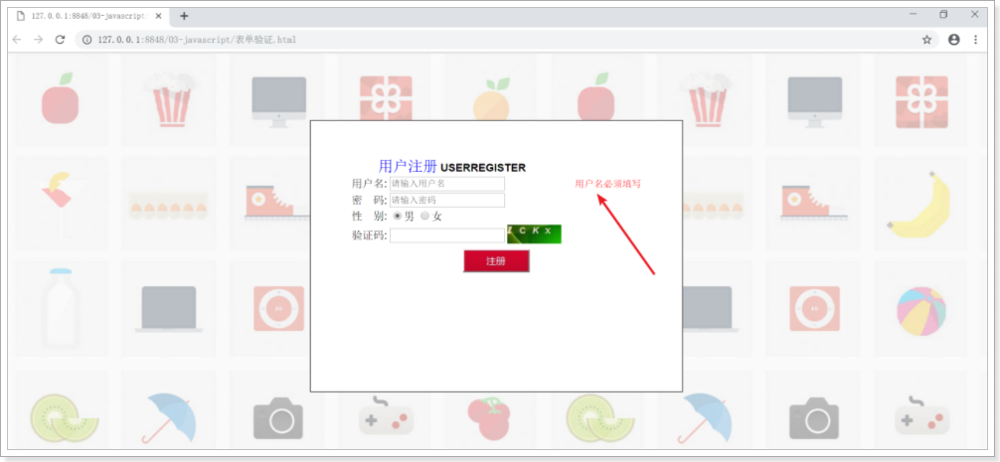


### 案例分析

```http
为表单添加表单提交事件onsubmit，根据是否填写用户名，来决定是否提交表单数据到服务器
	为表单添加提交的事件onsubmit，事件源固定为form标签；事件onsubmit接收函数返回值boolean
	true：表单会提交数据到服务器
	false：表单不提交 
编写函数，获取填写的用户名，返回用户名是否为空 boolean
	true：说明用户名为空，为span标签设置显示值提醒“用户名必须填写”，设置不提交表单
	false：说明用户名不为空，设置提交表单
```

### 案例实现

步骤一，为表单添加提交事件onsubmit；添加span标签指定id；为“用户名”文本框指定id

```html
<form action="#" method="get" onsubmit="return fn()" >
    <table align="center">
        <tr>
            <td>用户名:</td>
            <td><input type="text" name="user" placeholder="请输入用户名" id="user"></td>
            <td><span id="userMsg"></span></td>
        </tr>
        <tr>
            <td>密　码:</td>
            <td><input type="password" name="pass" placeholder="请输入密码"/></td>
            <td></td>
        </tr>
        <tr align="center">
            <td colspan="3"><input type="submit" value="注册"/></td>
        </tr>
    </table>
</form>
```

步骤二，编写js代码

```html
<!DOCTYPE html>
<html lang="en">
<head>
    <meta charset="UTF-8">
    <title>Title</title>
    <script>
        // 判断表单是否可以提交: 返回true 提交; 返回false false
        function fn() {
            var flag = false;
            // 1 校验用户名是必填项
            // 1.1 获取用户名标签对象
            var userObj = document.getElementById("user");
            // 1.2 获取用户填写的用户名的值
            var userObjVal = userObj.value;
            // 1.3 判断
            if(userObjVal==null || userObjVal.trim()=='') {
                // 如果为空, 提示错误信息
                var userMsgObj = document.getElementById("userMsg");
                userMsgObj.innerHTML = "用户名是必填项!";
                userMsgObj.style.color = "red";
                userMsgObj.style.fontSize = "20px";
            }else {
                // 如果不为空, 修改flag=true,提交表单
                flag = true;
            }
            return flag;
        }
    </script>
</head>
<body>
    <form action="../07.html" method="get" onsubmit="return fn()" >
        <table align="center">
            <tr>
                <td>用户名:</td>
                <td><input type="text" name="user" placeholder="请输入用户名" id="user"></td>
                <td><span id="userMsg"></span></td>
            </tr>
            <tr>
                <td>密　码:</td>
                <td><input type="password" name="pass" placeholder="请输入密码"/></td>
                <td></td>
            </tr>
            <tr align="center">
                <td colspan="3"><input type="submit" value="注册"/></td>
            </tr>
        </table>
    </form>
</body>
</html>
```

# 第四章 JavaScript内置对象

JS的对象也分为内置对象和自定义对象

- 例如，Java中Object、String、System属于内置对象
- 例如，自定义的Person、Student属于自定义的对象。JS的自定义对象是函数实现的

window.alert(xxx);

alert(xxx);

## 1 顶层函数（全局函数）

### parseFloat() 方法

parseFloat() 函数可解析一个字符串，并返回一个浮点数。

##### 语法

```javascript
var value = parseFloat(string)
```

提示：该函数指定字符串中的首个字符是否是数字。如果是，则对字符串进行解析，直到到达数字的末端为止.

提示：如果字符串的第一个字符不能被转换为数字，那么 parseFloat() 会返回 NaN。Not a Number

提示：如果只想解析数字的整数部分，请使用 parseInt() 方法。

### parseInt() 方法

parseInt() 函数可解析一个字符串，并返回一个整数。

##### 语法

```javascript
var value = parseInt(string)
```

**代码演示:**

```html
<script type="text/javascript">

    var num = parseFloat("10.33");
    console.log(num); //10.33
    console.log(typeof(num)); // number

    num = parseFloat("10.33hello");
    console.log(num); //10.33
    console.log(typeof(num)); // number

    num = parseFloat("hello10.33");
    console.log(num); //NaN
    console.log(typeof(num)); // number

    var num = parseInt("10.33hello");
    console.log(num); //10
    console.log(typeof(num)); // number
</script>
```


## 2 JS内置对象 String

String 对象用于处理文本（字符串）。

##### String 对象属性

| 属性   | 描述         |
| ------ | ------------ |
| length | 字符串的长度 |

##### String 对象方法

| 方法                            | 描述                                         |
| ------------------------------- | -------------------------------------------- |
| charAt(index)                   | 传递索引,返回字符                            |
| indexOf(x)                      | 传递字符串,返回第一次出现的索引,找不到返回-1 |
| substring(startIndex, endIndex) | 截取字符串,包含开始索引,不包含结束索引       |
| substr(startIndex, count)       | 截取字符串,包含开始索引,后面的参数是要几个   |

##### 演示代码

```html
<script type="text/javascript">
    /*
	 * JS内置对象String
	 */
    var str = "abcdef";
    //字符串长度是 length属性
    console.log(str.length);

    //charAt,传递索引,返回字符
    console.log(str.charAt(3));

    //indexof,传递字符串,返回第一次出现的索引,找不到返回-1
    console.log(str.indexOf("C"));

    //substring,截取字符串,包含开始索引,不包含结束索引
    console.log(str.substring(1,4));


    //substr,截取字符串,包含开始索引,后面的参数是要几个
    console.log(str.substr(1,4));
</script>
```


## 3 JS内置对象 Date

Date 对象用于处理日期和时间。

##### 创建 Date 对象的语法：

```java
var myDate = new Date();
```

> 注释：Date 对象会自动把当前日期和时间保存为其初始值。

##### Date 对象方法

| 方法             | 描述                                         |
| ---------------- | -------------------------------------------- |
| getFullYear()    | 从 Date 对象以四位数字返回年份。             |
| getMonth()       | 从 Date 对象返回月份 (0 ~ 11)。              |
| getDate()        | 从 Date 对象返回一个月中的某一天 (1 ~ 31)。  |
| getTime()        | 返回 1970 年 1 月 1 日至今的毫秒数。         |
| toLocaleString() | 根据本地时间格式，把 Date 对象转换为字符串。 |

##### 演示代码：

```html
<script type="text/javascript">
    /*
	 * Data对象
	 * 创建方式直接new
	 */
    var date = new Date();
    //拼接年月日
    console.log(date.getFullYear()+"年"+(date.getMonth()+1)+"月"+date.getDate()+"日");
    //获取毫秒值
    console.log(date.getTime());
    //根据本地时间格式，把 Date 对象转换为字符串。
    console.log(date.toLocaleString());
</script>

```


## 4 JS内置对象 Math

Math是数学计算的对象,此对象无需创建,直接Math.调用

##### Math 对象方法

| 方法     | 描述                                                    |
| -------- | ------------------------------------------------------- |
| ceil(x)  | 向上取整                                                |
| floor(x) | 向下取整                                                |
| round(x) | 把数四舍五入为最接近的整数。                            |
| random() | 随机数,返回的是小数范围 0.0-1.0之间,可能是0.0,不会到1.0 |
| pow(x,y) | 幂运算 pow(2,3) ,代表2的3次方                           |

##### 演示代码：

```html
<script type="text/javascript">
    /*
	 * JS内置对象Math,数学计算
	 * 调用方式 Math.函数()
	 */

    //向上取整
    console.log(Math.ceil(12.2));

    //向下取整
    console.log(Math.floor(-15.5));

    //四舍五入,取整数
    console.log(Math.round(5.59999));

    //随机数,返回的是小数范围 0.0-1.0之间,可能是0.0,不会到1.0
    console.log(Math.random());

    //幂运算 pow(2,3) 2的3次方
    console.log(Math.pow(2,3));
</script>
```


## 5 JS内置对象 Array(重点)

Array 对象，就是JS数组，用于存储多个值，存储的元素类型可以是任意类型。

##### 创建 Array 对象的语法

```javascript
var arr1 = new Array();
var arr2 = new Array(size);
var arr3 = new Array(element0, element0, ..., elementn);
var arr4 = [1,2,3,4,"a","b","c"]; // 重点
```

参数 *element* ..., *elementn* 是参数列表。当使用这些参数来调用构造函数 Array() 时，新创建的数组的元素就会被初始化为这些值。它的 length 字段也会被设置为参数的个数。

##### 返回值

如果调用构造函数 Array() 时没有使用参数，那么返回的数组为空，length 字段为 0。

##### Array 对象属性

| 属性   | 描述                   |
| ------ | ---------------------- |
| length | 返回数组中元素的数目。 |

##### 演示代码：

```html
<script type="text/javascript">
    //定义数组对象
    var arr1 = new Array();
    //赋值元素
    arr1[0] = 1;
    arr1[1] = "a";
    arr1[2] = 2.2;
    console.log(arr1);

    //定义数组对象
    var arr2 = new Array(3);
    //打印数组长度
    console.log(arr2.length);

    //定义数组对象
    var arr3 = new Array(3,4,5,"a",true);
    console.log(arr3);

    //开发中最常用方式
    var arr4 = [1,2,3,4,"a","b","c"];
    for(var i = 0 ; i< arr4.length;i++){
       console.log(arr4[i]);
    }

    
   	/*
   	了解
   	定义了一个二维数组arr5,数组长度是3;每个位置上是一个一维数组
    arr5[0]的内容是 [1,2,3]，若想访问其中数据1, 需要arr5[0][0]
    arr5[1]的内容是 ["a",4,"b"]，若想访问其中数据b, 需要arr5[1][2]
    arr5[2]的内容是 [true,5,false]，若想访问其中数据5, 需要arr5[2][1]
   	*/
    var arr5 = [
        [1,2,3],["a",4,"b"],[true,5,false]
    ];
    //打印1
    console.log(arr5[0][0]);
    //打印b
    console.log(arr5[1][2]);
    //打印5
    console.log(arr5[2][1]);
    //循环遍历二维数组
    for(var i = 0 ; i< arr5.length;i++){
    	for(var j = 0 ; j< arr5[i].length;j++){
       		console.log(arr5[i][j]);
    	}   
    }
</script>

```

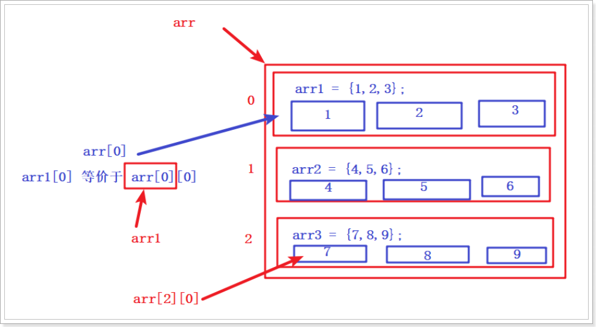

## 6 JS内置对象 RegExp正则表达式(重点)

### 6.1 RegExp 对象表示正则表达式

- 正则表达式意义: 对复杂字符串进行处理的技术
    - 正则表达式的本质：是一种规则, 实现了字符串和规则进行匹配,若匹配成功 返回true。

### 6.2 创建正则表达式对象的语法

方式一：

```http
var reg = /pattern/; //JS中,定义正则表达式规则 写在`//`之间
```

方式二：

```http
var reg = new RegExp(pattern); //JS中,定义正则表达式规则 写在()之内
```

### 6.3 写正则表达式的规则

| 表达式      | 描述                                                         |
| ----------- | ------------------------------------------------------------ |
| [a-z]       | 这个字符必须是小写字母                                       |
| [abc]       | 字符必须是abc                                                |
| [0-9]       | 这个字符必须是数字                                           |
| [a-zA-Z0-9] | 这个字符必须是字母或者是数字                                 |
| [^a-z]      | 这个字符不是小写字母                                         |
| [\d]        | 等同于[0-9]                                                  |
| [\w]        | 等同于[a-zA-Z_0-9] 字母、数字、下划线                        |
| [\D]        | 等同于`[^0-9]`                                               |
| [\W]        | 等同于`[^a-zA-Z0-9_]`                                        |
| .           | 代表匹配任意字符， 若只是想代表普通数据`.` 需要使用转义字符来表示`\.` |
| X*          | X这个字符可以出现零次或者多次 [0-9]* 123123456               |
| X?          | X这个字符可以出现零次或者一次 [0-9]? 2                       |
| X+          | X这个字符可以出现一次或者多次 [0-9]+ 2 12345678              |
| X{m}        | X这个字符出现次数正好m次 [0-9]{4} 1234 1234567865432456      |
| X{m, }      | X这个字符出现次数至少m次 [0-9]{4, } 1234 12345678            |
| X{m, n}     | X这个字符出现次数至少m次,最多n次 [0-9]{3,5} 123 12345 12 1234567876534 |
| (X)+        | ()括号代表X所表示的内容作为一组数据出现；()括号后面的+号，代表这组数据可以出现一次或者多次    (\.[a-z]+) + .com .cn .cn.cn.cn.cn.com.itsad |
| ^X          | ^匹配开头                                                    |
| X$          | $匹配结尾                                                    |

### 6.4 RegExp 对象方法

| 方法   | 描述                                       |
| ------ | ------------------------------------------ |
| test() | 检索字符串中指定的值。返回 true 或 false。 |

```javascript
<script type="text/javascript">
    //要求: 手机号,验证格式 13800138000
    // 1开头  第二位 3456789  第3--11位必须数字
    //JS中,定义正则表达式规则  定义在 /规则/ 内部
    var telReg = /^1[3456789][0-9]{9}$/;
    //正则表达式对象方法 test(字符串)
    var bool = telReg.test("13800138000");
    console.log(bool);

    //需求: 验证用户名, 验证格式 字母,数字,下划线组成,长度6-8位
    var userReg = /^[a-zA-z_0-9]{6,8}$/;
    console.log(userReg.test("tomtom"))
</script>
```

# 第五章 BOM对象

## 1 js的BOM概述

BOM（Browser Object Model）浏览器对象模型，是将我们使用的浏览器抽象成对象模型，例如我们打开一个浏览器，会呈现出页面，通过js提供BOM对象我们可以模拟浏览器功能。

例如，在浏览器地址栏输入地址，敲击回车这个过程，我们可以使用location对象进行模拟。再例如，浏览器中的前进和后退按钮，我们可以使用history对象模拟。

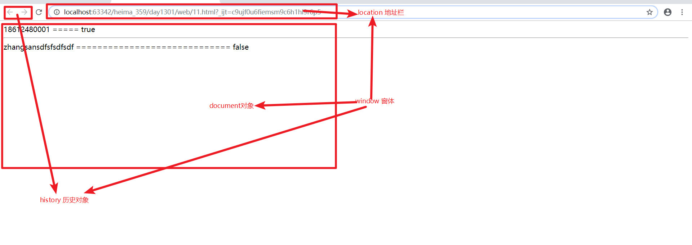

## 2 js的BOM对象

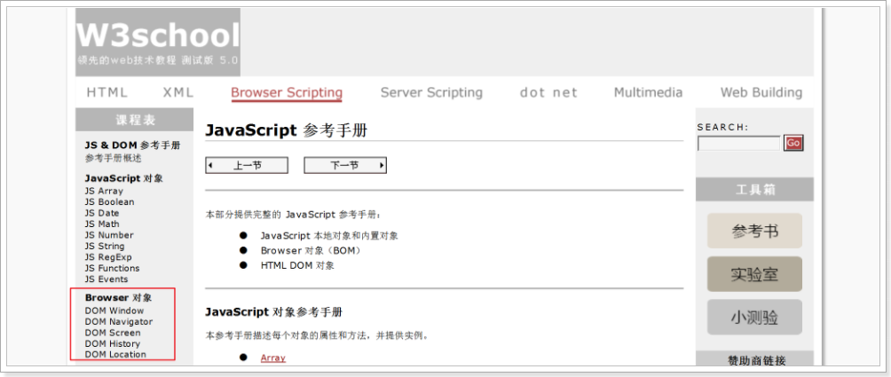


1. **Window对象（重点）**，对象表示浏览器中打开的窗口。
2. **Location对象（重点）**，包含有关当前 URL 的信息。用于操作浏览器的地址栏
3. Screen对象，包含有关客户端显示屏幕的信息。。
4. Navigator对象，包含有关浏览器的信息
5. History对象，包含用户（在浏览器窗口中）访问过的 URL，其实就是来保存浏览器历史记录信息。


## 3 js的window对象

所有浏览器都支持 Window对象。Window 对象表示浏览器中打开的窗口。

Window对象此处学习它的两个作用：

1. JavaScript 消息框  
2. 定时器

### 3.1 JavaScript消息框

可以在 JavaScript 中创建三种消息框：

- alert(“指定消息”) 方法用于显示带有一条指定消息和一个 OK 按钮的警告框。
- confirm(“指定消息”) 方法用于显示一个带有指定消息和 OK 及取消按钮的对话框。
  - 点击ok按钮，返回true； 点击取消按钮，返回false
- prompt(“提示用户”) 方法用于显示可提示用户进行输入的对话框。
  - 点击确定，返回输入的内容 ""；点击取消，返回 null

演示代码：

```html
<script type="text/javascript">
    
    if( confirm("确定要删除吗?")){
        alert("点击确定");
    } else {
        alert("点击取消");
    }

    var str = prompt("请输入你的价格"); 
    alert( str );

</script>
```


### 3.2 定时器

#### 执行定时器

- setTimeout(定时执行的函数, 毫秒值)  定时执行一次，方法用于在指定的毫秒数后调用函数。
- setInterval(定时执行的函数, 毫秒值)  反复执行，方法可按照指定的周期（以毫秒计）来调用函数。

```html
<script type="text/javascript">
    /* 
	// 2秒后，定时执行一次
	setTimeout(function(){
		alert("单次定时器");
	},2000);
	*/

    //每隔2秒, 定时执行一次
    setInterval(function(){
        alert("循环定时器");
    },2000);
</script>
```


#### 取消执行的定时器

- clearInterval( ID值 ) 可取消由 setInterval() 设置的 周期性执行。
  注意：clearInterval() 方法的参数ID，必须是由 setInterval() 返回的 ID 值。

```html
<!DOCTYPE html>
<html>
	<head>
		<meta charset="utf-8">
		<title></title>
	</head>
	<body>
		<script type="text/javascript">
			// 每隔2秒,重复执行
			var id = setInterval(function(){
				alert("定时器");
			}, 2000);
			
			// 结束定时器执行
			function fnClear(){
				clearInterval(id);
			}
		</script>
		
		<input type="button" value="取消" onclick="fnClear()"/>
	</body>
</html>

```


## 4 js的location对象

location对象，用于操作浏览器的地址栏

- href属性：就是浏览器的地址栏。我们可以通过为该属性设置新的 URL，使浏览器读取并显示新的 URL 的内容。
- 格式：`location.href=URL`

```html
<!DOCTYPE html>
<html>
	<head>
		<meta charset="utf-8">
		<title></title>
	</head>
	<body>
		<script type="text/javascript">
			function fn(){
				location.href="http://www.itheima.com";
			}
		</script>
		
		<a href="#" onclick="fn()">点我跳转到黑马首页</a>
	</body>
</html>

```


## 5 案例 定时弹广告

### 案例需求

在平日浏览网页时，页面一打开3秒后显示广告，然后3秒后再隐藏广告。

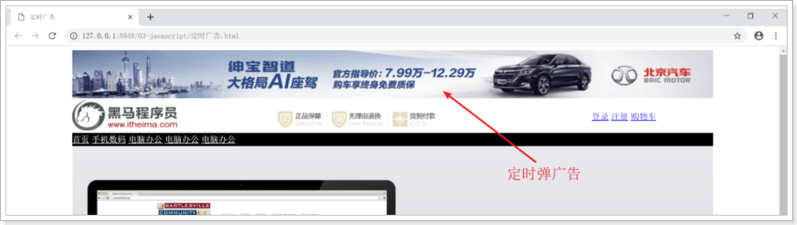


### 案例分析

```http
1.设置单次执行的定时器，页面显示3秒后执行函数，用于显示广告
	获取HTML页面的DIV标签，使用DOM中的document对象的方法getElementById( 标签的ID属性值 )
	为div标签，设置显示样式为 style="display:block"
2.设置单次执行的定时器，页面显示6秒后执行函数，用于隐藏广告
	获取HTML页面的DIV标签，使用DOM中的document对象的方法getElementById( 标签的ID属性值 )
	为div标签，设置显示样式为 style="display:none"
```

### 案例实现

修改商城首页案例.html， 加入代码

- 步骤一，编写html代码

```html
<div class="ad" id="ad">
    
</div>
```

- 步骤二，编写css代码

```html
<style>
    .ad {
        width: 1200px;
        margin: 0 auto;
        display: none;
    }
</style>
```

- 步骤三，编写js代码

```html
<script type="text/javascript">
    // 1.设置单次执行的定时器，页面显示3秒后执行函数，用于显示广告
    setTimeout(function(){
        //使用document对象的getElementById方法 获取标签成为对象
        var ele = document.getElementById("ad");
        //为div标签对象，设置显示样式为 style="display:block"
        ele.style.display = "block";
    }, 3000);

    //2.设置单次执行的定时器，页面显示6秒后执行函数，用于隐藏广告
    setTimeout(function(){
        var ele = document.getElementById("ad");
        ele.style.display = "none";
    }, 6000);
</script>
```

## 6 案例 轮播图

### 6.1 案例需求

第一天完成首页中，“轮播图”只提供一张图片进行显示。现需要编写程序，完成自动切换图片功能。


### 6.2 案例分析

```http
设置重复执行的定时器，页面显示2秒后执行函数，用于图片轮播
    获取HTML页面的轮播图标签，使用DOM中的document对象的方法getElementById( 标签的ID属性值 )
    为img标签，设置显示图片为 src="img/xx.jpg"
```

### 6.3 案例实现

步骤一：为轮播图img标签添加id属性

```html

```

步骤二：编写js代码

```javascript
<script type="text/javascript">
    var i = 1;
    setInterval(function(){
        i++;
        if(i>3){
            i=1;
        }
        var ele = document.getElementById("lunbo");
        ele.src = "img/"+i+".jpg";
    }, 2000);
</script>
```

