# 第一章 jQuery框架介绍

## 1 jQuery框架概述

jQuery是一个快速、简洁的JavaScript框架。jQuery设计的宗旨是“write Less，Do More”，即倡导写更少的代码，做更多的事情。JQuery封装了JavaScript常用的功能代码，提供了一套易于使用的API，可以跨多种浏览器工作，使HTML文档的遍历和操作、事件处理、动画设计和Ajax交互等操作变得更加简单。

 .

## 2 jQuery框架的下载与引入

### jQuery的官方下载

- jQuery的官方下载地址：http://www.jquery.com

### jQuery的版本（了解）

- 1.x：兼容IE678，使用最为广泛的，官方只做BUG维护，功能不再新增。因此一般项目来说，使用1.x版本就可以了，最终版本：1.12.4 (2016年5月20日)
- 2.x：不兼容IE678，很少有人使用，官方只做BUG维护，功能不再新增。如果不考虑兼容低版本的浏览器可以使用2.x，最终版本：2.2.4 (2016年5月20日)
- 3.x：不兼容IE678，只支持最新的浏览器。除非特殊要求，一般不会使用3.x版本的，很多老的jQuery插件不支持这个版本。目前该版本是官方主要更新维护的版本
- 开发版本与生产版本，命名为jQuery-x.x.x.js为开发版本，命名为jQuery-x.x.x.min.js为生产版本，开发版本源码格式良好，有代码缩进和代码注释，方便开发人员查看源码，但体积稍大。而生产版本没有代码缩进和注释，且去掉了换行和空行，不方便发人员查看源码，但体积很小。

### jQuery的引入

在需要使用jQuery的html中使用js的引入方式进行引入，如下：

```http
<script type="text/javascript" src="jquery-x.x.x.js></script>
```

### jQuery引入成功的测试

关键代码解释

```http
$(function(){ 代码 })
```

- 是指 $(document).ready(function(){}) 的简写
- 用来在DOM加载完成之后执行一系列预先定义好的函数。

```html
<!DOCTYPE html>
<html>
	<head>
		<meta charset="utf-8">
		<title>Jquery的引入</title>
		<script src="js/jquery-1.12.4.min.js" type="text/javascript" ></script>
		<script type="text/javascript">
			<!-- Jquery引入的测试 -->
			$(function(){
				alert("执行Jquery的语法成功");
			})
		</script>
	</head>
	<body>
		
	</body>
</html>
```


## 3 jQuery对象与js对象之间的转换

jQuery本质上虽然也是js，但如果使用jQuery的属性和方法那么必须保证对象是jQuery对象，而不是js方式获得的DOM对象，二者的API方法不能混合使用，若想使用对方的API，需要进行对象的转换。

使用js方式获取的对象是js的DOM对象，使用jQuery方式获取的对象是jQuery对象。两者的转换关系如下：

- ==js的DOM对象转换成jQuery对象==，语法：`$(js的DOM对象)`
- ==jQuery对象转换成js对象==，语法：`jquery对象[索引] 或 jquery对象.get(索引)`

### 代码演示：

1. 演示使用js的DOM对象方式、jquery对象方式获取div中的文本数据
2. 演示将js的DOM对象 转换成 jquery对象，再使用转换后的jquery对象方式获取div中的数据
3. 演示将jquery对象 转换成 js的DOM对象， 再使用转换后js的DOM对象方式获取div中的数据

```html
<!DOCTYPE html>
<html lang="en">
<head>
    <meta charset="UTF-8">
    <title>Title</title>
    <script src="js/jquery-1.12.4.min.js"></script>
    <script>
        $(function () {
            // 需求: 获取div标签中的内容
            // 1 js 传统方式
            var html1 = document.getElementById("mydiv").innerHTML;
            console.info("js 传统方式  ==== " + html1);

            // 2 jquery方式
            var html2 = $("#mydiv").html();
            console.info("jquery 方式  ==== " + html2);

            // 问题: js对象可以调用jquery对象的属性和方法吗? 不能
            // var html3 = $("#mydiv").innerHTML;
            // console.info("jquery对象调用js对象的属性: 不能  ==== " + html3);

            //var html4 = document.getElementById("mydiv").html();
            //console.info("js对象调用jquery对象的属性: 不能   ==== " + html4);

            //结论1: jquery对象 不能直接调用 js对象的属性和方法
            //结论2: js对象 不能直接调用 jquery对象的属性和方法

            // 解决: jquery对象调用js对象的属性和方法问题: 将jquery对象 转成 js对象
            // how: jquery对象封装了js对象, 将jquery对象理解成一个数组,其中第一个元素就是js对象
            var html5 = $("#mydiv")[0].innerHTML;
            console.info("html5 === " + html5);

            // 解决2: js对象 就想调用 jquery对象的属性和方法
            // how ? 将js对象转化成 jquery对象, $(js对象)
            var html6 = $(document.getElementById("mydiv")).html();
            console.info("html6 === " + html6);
        });
    </script>
</head>
<body>
    <div id="mydiv">绝不后退, 敢于亮剑</div>
</body>
</html>
```

### 小结：

- ==js的DOM对象转换成jQuery对象==，语法：`$(js的DOM对象)`

  ```http
  var jsDomEle = document.getElementById("myDiv"); //js的DOM对象
  var $jQueryEle = $(jsDomEle); //js的DOM对象 转换成 jquery对象
  ```

- ==jQuery对象转换成js对象==，语法：`jquery对象[索引] 或 jquery对象.get(索引)`

  ```http
  var $jQueryEle = $("#myDiv"); //jQuery对象
  var jsDomEle = $jQueryEle[0]; //jquery对象 转换成 js的DOM对象
  ```

- 提示：JQuery对象变量名前面的`$`符号，主要作用是便于我们区分该变量是 JsDOM对象 与 jQuery对象，并无特殊含义。写`$`符号代表jQuery对象 是 行业书写规范，不加`$`，代码也没有错误。


# 第二章 jQuery选择器

## 1 基本选择器

- 语法

| 选择器名称               | 语法                | 解释                              |
| ------------------------ | ------------------- | --------------------------------- |
| 标签选择器（元素选择器） | $("html标签名")     | 获得所有匹配标签名称的于元素      |
| id选择器                 | $("#id的属性值")    | 获得与指定id属性值匹配的元素      |
| 类选择器                 | $(".class的属性值") | 获得与指定的class属性值匹配的元素 |

### 需求

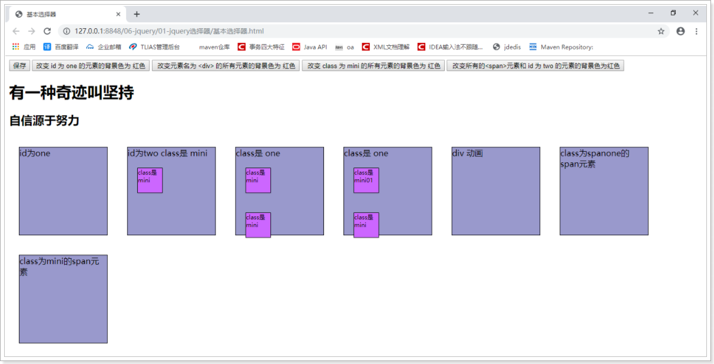

- 改变 id 为 one 的元素的背景色为 红色
- 改变元素名为 <div> 的所有元素的背景色为 红色
- 改变 class 为 mini 的所有元素的背景色为 红色
- 改变所有的<span>元素和 id 为 two 的元素的背景色为红色

### 实现：

代码基于` 01-jquery选择器目录下 基本选择器.html` 进行编写

```html
<script type="text/javascript">
    $(function() {
        //<input type="button" value="改变 id 为 one 的元素的背景色为 红色"  id="b1"/>
        $("#b1").click(function() {
            $("#one").css("backgroundColor", "red");
        });

        //<input type="button" value=" 改变元素名为 <div> 的所有元素的背景色为 红色"  id="b2"/>
        $("#b2").click(function() {
            $("div").css("backgroundColor", "red");
        });

        //<input type="button" value=" 改变 class 为 mini 的所有元素的背景色为 红色"  id="b3"/>
        $("#b3").click(function() {
            $(".mini").css("backgroundColor", "red");
        });

        //<input type="button" value=" 改变所有的<span>元素和 id 为 two 的元素的背景色为红色"  id="b4"/>
        $("#b4").click(function() {
            $("span,#two").css("backgroundColor", "red");
        });
    })
</script>
```

## 2 层级选择器

- 语法

| 选择器名称 | 语法       | 解释                       |
| ---------- | ---------- | -------------------------- |
| 后代选择器 | $("A B ")  | 选择A元素内部的所有B元素   |
| 子选择器   | $("A > B") | 选择A元素内部的所有B子元素 |

### 需求：

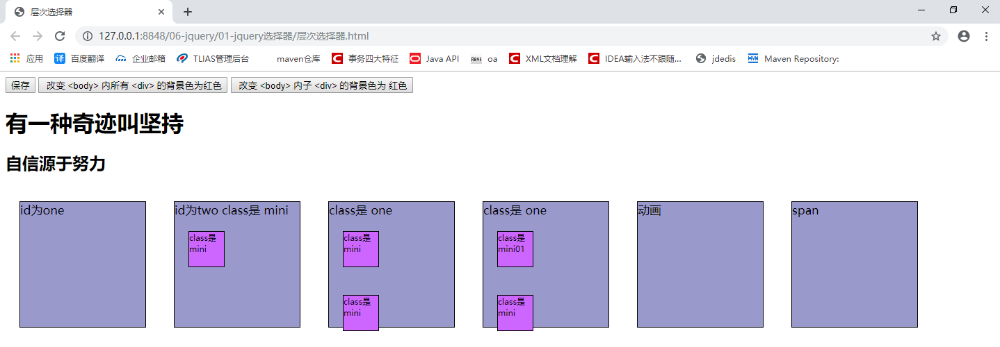

- 改变 <body> 内所有 <div> 的背景色为红色
- 改变 <body> 内 子 <div> 的背景色为 红色

### 实现：

代码基于`01-jquery选择器目录下 层次选择器.html` 进行编写

```javascript
<script type="text/javascript">
    $(function() {
        //<input type="button" value=" 改变 <body> 内所有 <div> 的背景色为红色"  id="b1"/>
        $("#b1").click(function() {
            $("body div").css("backgroundColor", "red");
        })

        //<input type="button" value=" 改变 <body> 内子 <div> 的背景色为 红色"  id="b2"/>
        $("#b2").click(function() {
            $("body>div").css("backgroundColor", "red");
        });
    })
</script>
```

## 3 表单属性选择器

- **语法**

| 选择器名称       | 语法      | 解释                      |
| ---------------- | --------- | ------------------------- |
| 可用元素选择器   | :enabled  | 获得可用元素              |
| 不可用元素选择器 | :disabled | 获得不可用元素            |
| 选中选择器       | :checked  | 获得单选/复选框选中的元素 |
| 选中选择器       | :selected | 获得下拉框选中的元素      |

### 需求

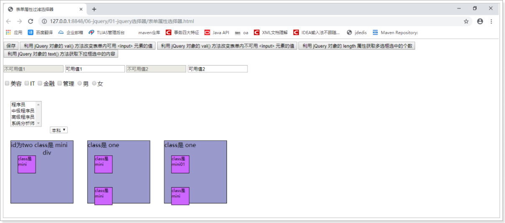

- 利用 jQuery 对象的 val() 方法改变表单内可用 <input> 元素的值
- 利用 jQuery 对象的 val() 方法改变表单内不可用 <input> 元素的值
- 利用 jQuery 对象的 length 属性获取多选框选中的个数
- 利用 jQuery 对象的 text() 方法获取下拉框选中的内容

### 实现

代码基于` 01-jquery选择器目录下 表单属性选择器.html` 进行编写

```html
<script type="text/javascript">
    $(function() {
        //<input type="button" value=" 利用 jQuery 对象的 val() 方法改变表单内可用 <input> 元素的值"  id="b1"/>
        $("#b1").click(function() {
            var $inputs = $("input[type='text']:enabled");
            //$inputs内部有两个input的js的dom对象
            for (var i = 0; i < $inputs.length; i++) {
                console.log($($inputs[i]).val());
            }
        });

        // <input type="button" value=" 利用 jQuery 对象的 val() 方法改变表单内不可用 <input> 元素的值"  id="b2"/>
        $("#b2").click(function() {
            var $inputs = $("input[type='text']:disabled");
            //$inputs内部有两个input的js的dom对象
            for (var i = 0; i < $inputs.length; i++) {
                console.log($($inputs[i]).val());
            }
        });

        //<input type="button" value=" 利用 jQuery 对象的 length 属性获取多选框选中的个数"  id="b3"/>
        $("#b3").click(function() {
            var $checkedInputs = $("input[type='checkbox']:checked");
            console.log($checkedInputs.length);
        });

        // <input type="button" value=" 利用 jQuery 对象的 text() 方法获取下拉框选中的内容"  id="b4"/>
        $("#b4").click(function() {
            var $options = $("option:selected");
            //$options内部有多个下拉框选中的js的dom对象
            for (var i = 0; i < $options.length; i++) {
                console.log($($options[i]).text());
            }
        });
    })
</script>
```


# 第三章 jQuery的DOM操作

## 1 jQuery对DOM树中的文本和值进行操作

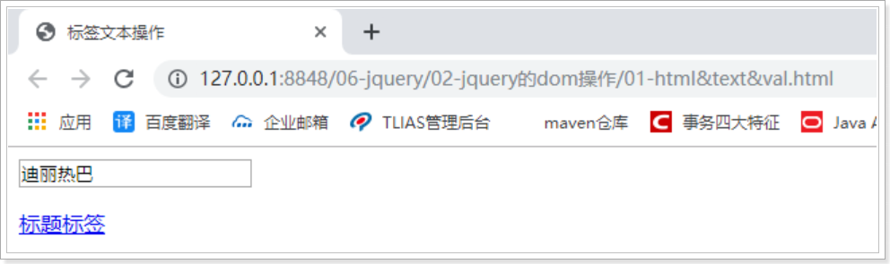

- **语法**

| API方法       | 解释                           |
| ------------- | ------------------------------ |
| val([value])  | 获得/设置元素value属性相应的值 |
| text([value]) | 获得/设置元素的文本内容        |
| html([value]) | 获得/设置元素的标签体内容      |

- **代码演示**

代码基于`02-jquery的dom操作目录中的 01-html&text&val.html` 进行编写

```html
<script type="text/javascript">
    //页面加载完成
    $(function(){
        //获取迪丽热巴
        console.log( $("#myinput").val() );
        //获得mydiv的文本内容
        console.log( $("#mydiv").text() );
        //获取mydiv的标签体内容
        console.log( $("#mydiv").html() );
    });
</script>

<body>
    <input id="myinput" type="text" name="username" value="迪丽热巴" /><br />
    <div id="mydiv">
        <p><a href="#">标题标签</a></p>
    </div>
</body>
```

## 2 jQuery对DOM树中的属性进行操作

代码基于`02-jquery的dom操作目录中的 02-prop.html` 进行编写

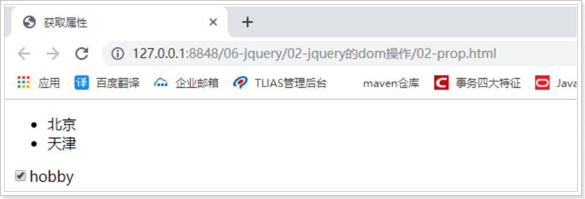

- **语法**

| API方法            | 解释                                 |
| ------------------ | ------------------------------------ |
| attr(name[,value]) | 获得/设置属性的值                    |
| prop(name[,value]) | 获得/设置属性的值(checked，selected) |

- **代码演示**

代码基于`02-jquery的dom操作目录中的 02-prop.html` 进行编写

```html
<script type="text/javascript">
    //页面加载完成
    $(function() {
        //获取北京节点的name属性值
        console.log($("#bj").attr("name"));

        //设置北京节点的name属性的值为 大北京
        $("#bj").attr("name", "大北京");

        //新增北京节点的discription属性 属性值是 地图
        $("#bj").attr("discription", "地图")

        //获得hobby的的选中状态
        console.log( $("#hobby").prop("checked") );
    })
</script>
```

- **attr与prop的注意问题**
  - checked 和 selected 使用prop获取
  - 其他使用attr获取 获取不到换成prop

# 第四章 jQuery的遍历

jQuery对象本身就是数组对象，通过jQuery选择器获得的都是满足该选择器条件的元素对象的集合体。因此常常需要对jQuery对象进行遍历。

## 1 原始方式遍历

- **语法**

```js
for(var i=0;i<元素数组.length;i++){
  	元素数组[i];
}
```

- **代码**

```html
<!DOCTYPE html>
<html>
	<head>
		<meta charset="UTF-8">
		<title></title>
		<script src="../js/jquery-1.12.4.min.js" type="text/javascript" charset="utf-8"></script>
		<script type="text/javascript">
			$(function() {
				var $lis = $("#city li");
				for (var i = 0; i < $lis.length; i++) {
					console.log($($lis[i]).html());
				}
			});
		</script>
	</head>
	<body>
		<ul id="city">
			<li>北京</li>
			<li>上海</li>
			<li>天津</li>
			<li>重庆</li>
		</ul>
	</body>
</html>
```

## 2 jquery对象方法遍历

- **语法**

```js
jquery对象.each(function(index,element){});

其中，
index:就是元素在集合中的索引
element：就是集合中的每一个元素对象
```

- **代码**

```html
<!DOCTYPE html>
<html>
	<head>
		<meta charset="UTF-8">
		<title></title>
		<script src="../js/jquery-1.12.4.min.js" type="text/javascript" charset="utf-8"></script>
		<script type="text/javascript">
			$(function() {
				$("#city li").each(function(index, element){
					//index, 就是元素在集合中的索引
					//element,就是集合中的每一个dom元素对象
					console.log(index +"==="+ $(element).html());
				});
			});
		</script>
	</head>
	<body>
		<ul id="city">
			<li>北京</li>
			<li>上海</li>
			<li>天津</li>
			<li>重庆</li>
		</ul>
	</body>
</html>
```

## 3 jquery的全局方法遍历

- **语法**

```js
$.each(jquery对象,function(index,element){});

其中，
index:就是元素在集合中的索引
element：就是集合中的每一个元素对象
```

- **代码**

```html
<!DOCTYPE html>
<html>
	<head>
		<meta charset="UTF-8">
		<title></title>
		<script src="../js/jquery-1.12.4.min.js" type="text/javascript" charset="utf-8"></script>
		<script type="text/javascript">
			$(function(){
				var $lis = $("#city li");
				$.each($lis, function(index, element){
					//index, 就是元素在集合中的索引
					//element,就是集合中的每一个dom元素对象
					console.log(index +"==="+ $(element).html());
				});
			});
		</script>
	</head>
	<body>
		<ul id="city">
			<li>北京</li>
			<li>上海</li>
			<li>天津</li>
			<li>重庆</li>
		</ul>
	</body>
</html>
```

# 第五章 ajax概述

## 1 什么是ajax

AJAX = Asynchronous JavaScript and XML（异步的 JavaScript 和 XML）。

AJAX 不是新的编程语言，而是一种用于创建快速动态网页的技术。

通过在后台与服务器进行少量数据交换，AJAX 可以使网页实现异步更新。这意味着可以在不重新加载整个网页的情况下，对网页的某部分进行更新。

传统的网页（不使用 AJAX）如果需要更新内容，必需重载整个网页面。


## 2 AJAX的应用场景

ajax的应用场景很多，常见的应用场景如下：

### 检查用户名是否已经被注册

很多站点的注册页面都具备自动检测用户名是否存在的友好提示，该功能整体页面并没有刷新，但仍然可以异步与服务器端进行数据交换，查询用户的输入的用户名是否在数据库中已经存在。

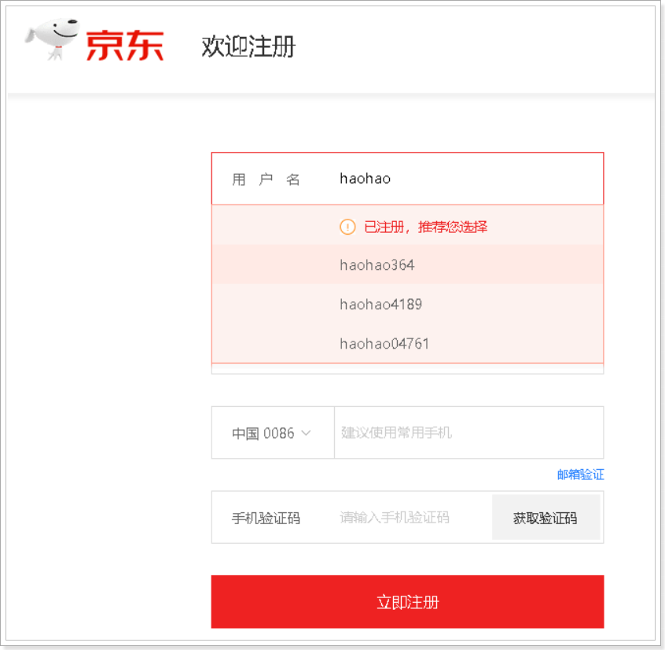

### 省市二联下拉框联动

很多站点都存在输入用户地址的操作，在完成地址输入时，用户所在的省份是下拉框，当选择不同的省份时会出现不同的市区的选择，这就是最常见的省市联动效果。

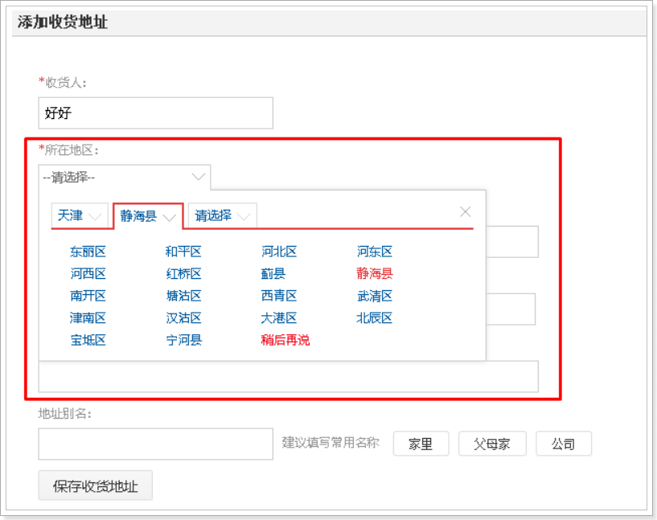

## 3 同步方式与异步方式的区别

### 同步方式发送请求

发送一个请求，需要等待响应返回，然后才能够发送下一个请求，如果该请求没有响应，不能发送下一个请求，客户端会处于一直等待过程中。

### 异步方式发送请求

发送一个请求，不需要等待响应返回，随时可以再发送下一个请求，即不需要等待。


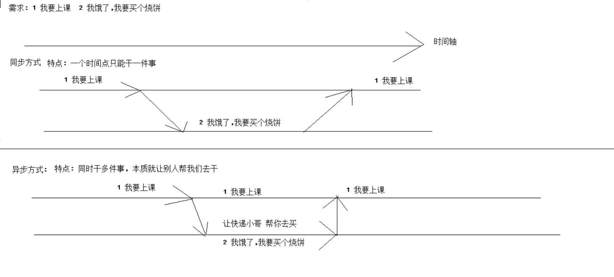

# 第六章 js原生的ajax(了解)

## 1 ajax工作原理图

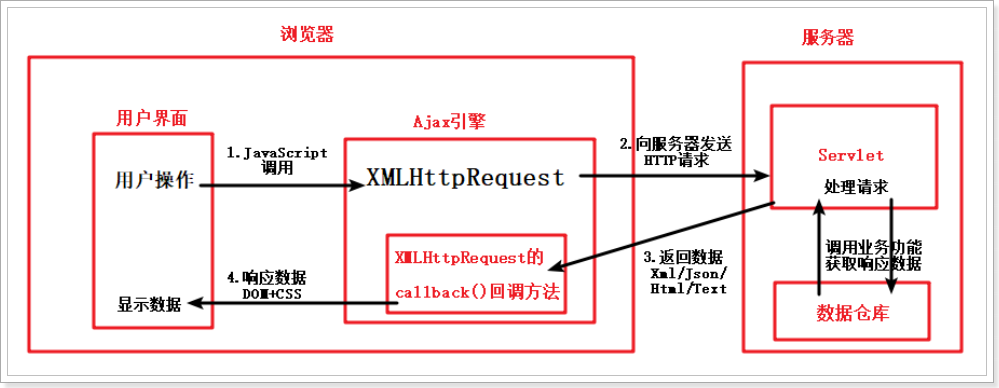


## 2 js原生的ajax的开发步骤

1）创建XMLHttpRequest对象

2）向服务器发送请求, 并绑定提交地址与参数

3）设置onreadystatechange事件, 用于为Ajax引擎对象绑定监听（监听服务器已将数据响应给ajax引擎）

4）获取服务器响应返回给引擎对象的数据


### 2.1 XMLHttpRequest 对象

现代所有浏览器均支持 XMLHttpRequest 对象。

XMLHttpRequest 用于在后台与服务器交换数据。这意味着可以在不重新加载整个网页的情况下，对网页的某部分进行更新。

```javascript
var xmlhttp = new XMLHttpRequest();
```

### 2.2 向服务器发送请求, 并绑定提交地址与参数

如需将请求发送到服务器，我们使用 XMLHttpRequest 对象的 open() 和 send() 方法：

```java
var cname = document.getElementById("cname").value;
xmlhttp.open("GET", "/day14/ajaxServlet?cname="+cname, true);
xmlhttp.send();
```

| 方法                         | 描述                                                         |
| ---------------------------- | ------------------------------------------------------------ |
| open(*method*,*url*,*async*) | 规定请求的类型、URL 以及是否异步处理请求。<br />*method*：请求的类型；GET 或 POST<br />*url*：文件在服务器上的位置<br />*async*：true（异步）或 false（同步） |
| send(*string*)               | 将请求发送到服务器。*string*：仅用于 POST 请求               |

### 2.3 设置onreadystatechange事件, 用于为Ajax引擎对象绑定监听（监听服务器已将数据响应给ajax引擎）

当请求被发送到服务器时，我们需要执行一些基于响应的callback()任务。

每当 readyState 改变时，就会触发 onreadystatechange 事件。

readyState 属性存有 XMLHttpRequest 的状态信息。

下面是 XMLHttpRequest 对象的三个重要的属性：

| 属性               | 描述                                                         |
| ------------------ | ------------------------------------------------------------ |
| onreadystatechange | 存储函数（或函数名），每当 readyState 属性改变时，就会调用该函数。 |
| readyState         | 存有 XMLHttpRequest 的状态。从 0 到 4 发生变化。<br />0: 请求未初始化<br />1: 服务器连接已建立<br />2: 请求已接收<br />3: 请求处理中<br />4: 请求已完成，且响应已就绪 |
| status             | 200: "OK", 表示响应已就绪<br />404: 未找到页面               |

在 onreadystatechange 事件中，我们规定当服务器响应已做好被处理的准备时所执行的任务。

当 readyState 等于 4 且状态为 200 时，表示响应已就绪：

```javascript
xmlhttp.onreadystatechange = function(){
    if (xmlhttp.status == 200 && xmlhttp.readyState == 4){
        //document.getElementById("myDiv").innerHTML = xmlhttp.responseText;
    }
};
```

### 2.4 获取服务器响应返回给引擎对象的数据

如需获得来自服务器的响应，请使用 XMLHttpRequest 对象的 responseText 或 responseXML 属性。

| 属性         | 描述                       |
| ------------ | -------------------------- |
| responseText | 获得字符串形式的响应数据。 |
| responseXML  | 获得 XML 形式的响应数据。  |

##### responseText 属性

如果来自服务器的响应并非 XML，请使用 responseText 属性。

responseText 属性返回字符串形式的响应，因此您可以这样使用：

```javascript
document.getElementById("myDiv").innerHTML = xmlhttp.responseText;
```


## 3 js原生的ajax的代码实现

- 效果

  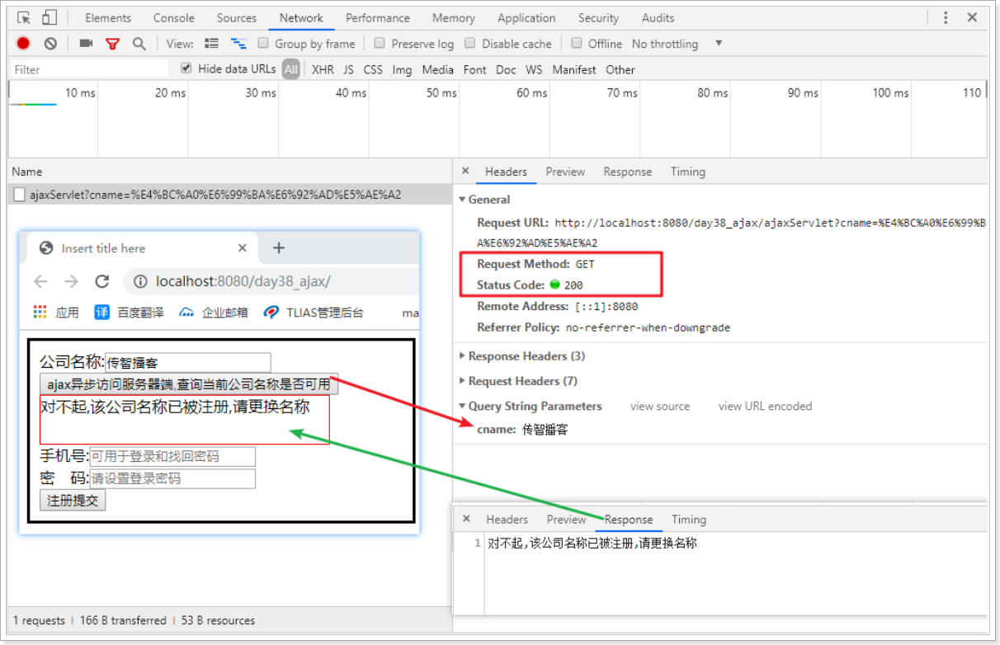

- js代码

```html
<!DOCTYPE html>
<html lang="en">
<head>
    <meta charset="UTF-8">
    <title>Title</title>
    <script type="text/javascript">
        function sendRequest(){
            // 1 创建对象
            var xmlhttp;
            if (window.XMLHttpRequest)
            {// code for IE7+, Firefox, Chrome, Opera, Safari
                xmlhttp=new XMLHttpRequest();
            }
            else
            {// code for IE6, IE5
                xmlhttp=new ActiveXObject("Microsoft.XMLHTTP");
            }
            // 2 打开连接 发送请求
            var cname = document.getElementById("cname").value;
            xmlhttp.open("GET","/day1401/ajaxServlet1?cname=" + cname,true);
            xmlhttp.send();
            // 3 处理响应
            xmlhttp.onreadystatechange=function() {
                if (xmlhttp.readyState==4 && xmlhttp.status==200) {
                    document.getElementById("myDiv").innerHTML=xmlhttp.responseText;
                }
            }
        };
    </script>
</head>
<body>
<form style="border: black 3px solid;padding: 10px">
    公司名称:<input type="text" id="cname" placeholder="请设置公司名称" name="cname"><br/>
    <input type="button" value="ajax异步访问服务器端,查询当前公司名称是否可用" onclick="sendRequest()">
    <div id="myDiv" style="border: red 1px solid; width: 300px;height: 50px;"></div>
    手机号:<input type="text" name="phone" placeholder="可用于登录和找回密码"><br/>
    密　码:<input type="password" name="password" placeholder="请设置登录密码"><br/>
    <input type="submit" value="注册提交">
</form>
</body>
</html>
```

- Servlet代码

```java
package cn.itcast.web;

import javax.servlet.ServletException;
import javax.servlet.annotation.WebServlet;
import javax.servlet.http.HttpServlet;
import javax.servlet.http.HttpServletRequest;
import javax.servlet.http.HttpServletResponse;
import java.io.IOException;

@WebServlet("/ajaxServlet1")
public class CheckCnameServlet extends HttpServlet {
    protected void doPost(HttpServletRequest request, HttpServletResponse response) throws ServletException, IOException {
        // 解决获取参数的中文乱码 (浏览器 -> 服务器)
        request.setCharacterEncoding("utf-8");
        // 解决浏览器出现的中文乱码
        response.setContentType("text/html;charset=utf-8");

        // 1 获取公司名称
        String cname = request.getParameter("cname");
        // 2 判断 是否被占用
        if("传智播客".equals(cname)) {
            response.getWriter().println("对不起,公司名称被占用请更换!");
        }else {
            response.getWriter().println("恭喜您, 该公司名称可以使用!");
        }
    }

    protected void doGet(HttpServletRequest request, HttpServletResponse response) throws ServletException, IOException {
        doPost(request, response);
    }
}
```


# 第七章 jQuery框架的ajax(掌握)

## 1 jQuery框架的ajax简介

jquery是一个优秀的js框架，自然对js原生的ajax进行了封装，封装后的ajax的操	作方法更简洁，功能更强大，与ajax操作相关的jquery方法有如下几种，但开发中	经常使用的有三种：

| 请求方式 | 语法                                          |
| -------- | --------------------------------------------- |
| GET请求  | $.get(url, *[data]*, *[callback]*, *[type]*)  |
| POST请求 | $.post(url, *[data]*, *[callback]*, *[type]*) |
| AJAX请求 | $.ajax([settings])                            |

## 2 GET请求方式

#### 概述

通过远程 HTTP GET 请求载入信息。这是一个简单的 GET 请求功能，如需复杂的ajax参数设置请使用$.ajax。

#### 语法

jQuery.get(url, [data], [callback], [type])

其中，参数说明如下：

| 参数名称 | 解释                                                         |
| -------- | ------------------------------------------------------------ |
| url      | 请求的服务器端url地址                                        |
| data     | 发送给服务器端的请求参数，格式可以是key=value，也可以是js对象 |
| callback | 当请求成功后的回掉函数，可以在函数体中编写我们的逻辑代码     |
| type     | 预期的返回数据的类型，取值可以是 xml, html, script, json, text, _defaul等 |

#### 代码

- js代码

```html
<html>
    <head>
        <meta http-equiv="Content-Type" content="text/html; charset=UTF-8">
        <title>Insert title here</title>
        <script type="text/javascript" src="js/jquery-1.12.4.min.js"></script>
        <script type="text/javascript">
            function sendRequest(){
                $.get(
                    "/day1401/ajaxServlet2",
                    "name=迪丽热巴&age=23",
                    function(data){
                        alert(data);
                    },
                    "text"
                );
            }
        </script>
    </head>
    <body>
        <input type="button" value="ajax异步访问服务器端" onclick="sendRequest()">
    </body>
</html>
```

- Servlet代码

```java
@WebServlet("/ajaxServlet2")
public class AjaxServlet2 extends HttpServlet {
    protected void doGet(HttpServletRequest request, HttpServletResponse response) throws ServletException, IOException {
        request.setCharacterEncoding("utf-8");
        response.setContentType("text/html;charset=utf-8");

        //获得请求参数
        String name = request.getParameter("name");
        String age = request.getParameter("age");
        response.getWriter().write("ajax response data ..."+ name +"..."+age);
    }

    protected void doPost(HttpServletRequest request, HttpServletResponse response) throws ServletException, IOException {
        doGet(request, response);
    }
}
```

#### 效果

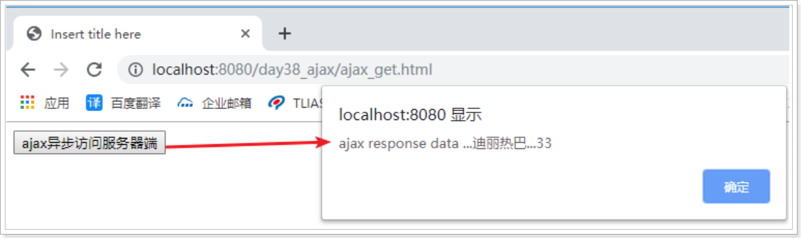

## 3 POST请求方式

#### 概述

通过远程 HTTP POST 请求载入信息。这是一个简单的 POST 请求功能，如需复杂的ajax参数设置请使用$.ajax。

#### 语法

jQuery.post(url, [data], [callback], [type])

其中，参数说明如下：

| 参数名称 | 解释                                                         |
| -------- | ------------------------------------------------------------ |
| url      | 请求的服务器端url地址                                        |
| data     | 发送给服务器端的请求参数，格式可以是key=value，也可以是js对象 |
| callback | 当请求成功后的回掉函数，可以在函数体中编写我们的逻辑代码     |
| type     | 预期的返回数据的类型，取值可以是 xml, html, script, json, text, _defaul等 |

#### 代码

- 代码

```html
<html>
    <head>
        <meta http-equiv="Content-Type" content="text/html; charset=UTF-8">
        <title>Insert title here</title>
        <script type="text/javascript" src="js/jquery-1.12.4.min.js"></script>
        <script type="text/javascript">
            function sendRequest(){
                $.post(
                    "/day14_ajax/ajaxServlet2",
                    "name=迪丽热巴&age=20",
                    function(data){
                        alert(data);
                    },
                    "text"
                );
            }
        </script>
    </head>
    <body>
        <input type="button" value="ajax异步访问服务器端" onclick="sendRequest()">
    </body>
</html>
```

- Servlet代码

```java
@WebServlet("/ajaxServlet2")
public class AjaxServlet2 extends HttpServlet {
    protected void doGet(HttpServletRequest request, HttpServletResponse response) throws ServletException, IOException {
        request.setCharacterEncoding("utf-8");
        response.setContentType("text/html;charset=utf-8");

        //获得请求参数
        String name = request.getParameter("name");
        String age = request.getParameter("age");
        response.getWriter().write("ajax response data ..."+ name +"..."+age);
    }

    protected void doPost(HttpServletRequest request, HttpServletResponse response) throws ServletException, IOException {
        doGet(request, response);
    }
}
```

#### 效果

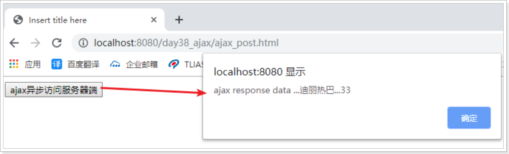

## 4 AJAX请求方式

#### 概述

通过 HTTP 请求加载远程数据。jQuery 底层 AJAX 实现。简单易用的高层实现见get和post方法。$.ajax()方法可以更加详细的设置底层的参数。

#### 语法

jQuery.ajax([settings])

其中，settings是一个js字面量形式的对象，格式是{name:value,name:value... ...}，常用的name属性名如下：

| 属性名称 | 解释                                                         |
| -------- | ------------------------------------------------------------ |
| url      | 请求的服务器端url地址                                        |
| async    | (默认: true) 默认设置下，所有请求均为异步请求。如果需要发送同步请求，请将此选项设置为 false |
| data     | 发送到服务器的数据，可以是键值对形式，也可以是js对象形式     |
| type     | (默认: "GET") 请求方式 ("POST" 或 "GET")， 默认为 "GET"      |
| dataType | 预期的返回数据的类型，取值可以是 xml, html, script, json, text, _defaul等 |
| success  | 请求成功后的回调函数                                         |
| error    | 请求失败时调用此函数                                         |

#### 代码

- js代码

```html
<html>
    <head>
        <meta http-equiv="Content-Type" content="text/html; charset=UTF-8">
        <title>Insert title here</title>
        <script type="text/javascript" src="js/jquery-1.12.4.min.js"></script>
        <script type="text/javascript">
            function sendRequest(){
                $.ajax({
                    url:"/day14/ajaxServlet2",
                    async:true,
                    data:"name=迪丽热巴&age=21",
                    type:"GET",
                    dataType:"text",
                    success:function (data) {
                        alert(data);
                    },
                    error:function () {
                        alert("数据没有成功返回");
                    }
                });
            }
        </script>
    </head>
    <body>
        <input type="button" value="ajax异步访问服务器端" onclick="sendRequest()">
    </body>
</html>
```

- Servlet代码

```java
@WebServlet("/ajaxServlet2")
public class AjaxServlet2 extends HttpServlet {
    protected void doGet(HttpServletRequest request, HttpServletResponse response) throws ServletException, IOException {
        request.setCharacterEncoding("utf-8");
        response.setContentType("text/html;charset=utf-8");

        //获得请求参数
        String name = request.getParameter("name");
        String age = request.getParameter("age");
        response.getWriter().write("ajax response data ..."+ name +"..."+age);
    }

    protected void doPost(HttpServletRequest request, HttpServletResponse response) throws ServletException, IOException {
        doGet(request, response);
    }
}
```

#### 效果

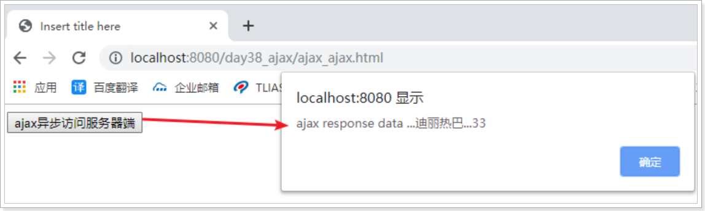


## 5 课上代码

### 5.1 前段代码

```jsp
<%@ page contentType="text/html;charset=UTF-8" language="java" %>
<html>
<head>
    <title>Title</title>
    <script src="js/jquery-1.12.4.min.js"></script>
    <script>
        function checkUsername() {
            // 1 获取填写的用户名的值
            var usernameVal = document.getElementById("username").value;
            // 2 判断是否为空
            if(usernameVal==null || usernameVal.trim()=='') {
                document.getElementById("usernameMsg").innerHTML = "用户名是必填项!";
                return;
            }
            // 3 如果不为空, 发送ajax请求 jquery的ajax
            $.ajax({
                type: "POST",
                url: "/day1401/checkUsernameServlet",
                data: "username=" + usernameVal, // data 指 浏览器给服务器的数据
                success: function(data){ // data 指 服务器给浏览器的数据
                    $("#usernameMsg").html(data);
                },
                error : function() {
                    console.info("服务器报错了, 需要特殊处理一下");
                }
            });
        }
    </script>
</head>
<body>
<form action="/day1401/registerServlet" method="get">
    <table>
        <tr>
            <td>用户名</td>
            <td><input type="text" id="username" name="username" onkeyup="checkUsername()" onblur="checkUsername()"/></td>
            <td><span id="usernameMsg">${usernameMsg}</span></td>
        </tr>

        <tr>
            <td>密码</td>
            <td><input type="password" name="password"/></td>
            <td><span id="passwordMsg"></span></td>
        </tr>

        <tr>
            <td>昵称</td>
            <td><input type="text" name="nickname"/></td>
            <td><span id="nicknameMsg"></span></td>
        </tr>
        <tr>
            <td></td>
            <td><input type="submit" value="注册"/></td>
            <td></td>
        </tr>
    </table>
</form>
</body>
</html>
```

### 5.2 后端代码

```java
package cn.itcast.web;

import javax.servlet.ServletException;
import javax.servlet.annotation.WebServlet;
import javax.servlet.http.HttpServlet;
import javax.servlet.http.HttpServletRequest;
import javax.servlet.http.HttpServletResponse;
import java.io.IOException;

@WebServlet("/checkUsernameServlet")
public class CheckUsernameServlet extends HttpServlet {
    protected void doPost(HttpServletRequest request, HttpServletResponse response) throws ServletException, IOException {
        // 解决获取参数的中文乱码 (浏览器 -> 服务器)
        request.setCharacterEncoding("utf-8");
        // 解决浏览器出现的中文乱码
        response.setContentType("text/html;charset=utf-8");

        // 1 获取用户名
        String username = request.getParameter("username");
//        int j = 1/0;
        // 2 模拟数据库 校验用户名是否被占用
        if("zhangsan".equals(username)) {
            // 被占用
            response.getWriter().println("此用户名被占用,请更换!");
        }else {
            // 没有被占用
            response.getWriter().println("用户名可以使用");
        }
    }

    protected void doGet(HttpServletRequest request, HttpServletResponse response) throws ServletException, IOException {
        doPost(request, response);
    }
}

```


# 第八章 json数据格式

## 1 什么是json

JSON(JavaScript Object Notation, JS 对象标记) 是一种轻量级的数据交换格式。它基于ECMAScript的一个子集，采用完全独立于编程语言的文本格式来存储和表示数据。简洁和清晰的层次结构使得 JSON 成为理想的数据交换语言。 易于人阅读和编写，同时也易于机器解析和生成，并有效地提升网络传输效率。

定义一个学生: 

xml

```xml
<students>
    <student>
        <name>张三</name>
        <age>18</age>
    </student>
    <student>
        <name>李四</name>
        <age>14</age>
    </student>
    <student>
        <name>王五</name>
        <age>15</age>
    </student>
</students>
```


json

```xml
[
	{"name":"张三", "age":18},
	{"name":"李四", "age":14},
	{"name":"王五", "age":15}
]

{"boys" : [
	{"name":"张三", "age":18},
	{"name":"李四", "age":14},
	{"name":"王五", "age":15}
]}
```

## 2 json的语法格式

json对象有三种数据格式，分别如下：

| 类型          | 语法                               | 解释                                    |
| ------------- | ---------------------------------- | --------------------------------------- |
| 对象类型      | {name:value,name:value...}         | 其中name是字符串类型，而value是任意类型 |
| 数组/集合类型 | [value,value,value...]             | 其中value是任意类型                     |
| 混合类型      | [{},{}... ...] 或 {name:[]... ...} | 合理包裹嵌套对象类型和数组类型          |

## 3 json格式和json解析练习

### 练习1 -- json表示对象的方式

格式:

```http
{key:value,key:value}
```

代码演示:

```html
<html>
<head>
    <meta http-equiv="Content-Type" content="text/html; charset=UTF-8">
    <title>Insert title here</title>

    <script language="JavaScript">
        /**
         * 案例一
         *  var person={key:value,key:value}
         *
         * class Person{
         * 	  String firstname = "张";
         *    String lastname = "三丰";
         *    Integer age = 100;
         * }
         *
         * Person p = new Person();
         * System.out.println(p.firstname);
         */

        //json的定义
        var person = {"firstname":"迪丽","lastname":"热巴","age": 20};
        //json解析
        console.log( person.firstname );
        console.log( person.lastname);
        console.log( person.age);

    </script>
</head>
<body>
</body>
</html>
```

### 练习2 - json表示对象集合(对象数组)的方式

格式:

```http
[{key:value,key:value},{key:value,key:value}]
```

代码演示:

```html
<html>
    <head>
        <meta http-equiv="Content-Type" content="text/html; charset=UTF-8">
        <title>Insert title here</title>

        <script language="JavaScript">
            /**
         * 案例二
         *  [{key:value,key:value},{key:value,key:value}]
         */

            //json的定义
            var persons = [{"firstname":"迪丽","lastname":"热巴","age": 20},
                           {"firstname":"古力","lastname":"娜扎","age": 20},
                           {"firstname":"欧阳","lastname":"娜娜","age": 20}];
            //json解析
            for(var i=0; i<persons.length; i++){
                console.log(  persons[i].firstname +"=="+ persons[i].lastname +"=="+ persons[i].age  );
            }

        </script>
    </head>
    <body>
    </body>
</html>
```

### 练习3 - 对象中的某个属性的值 是 对象数组

格式:

```http
{
	"param":[{key:value,key:value},{key:value,key:value}]
}
```

代码演示:

```html
<html>
    <head>
        <meta http-equiv="Content-Type" content="text/html; charset=UTF-8">
        <title>Insert title here</title>

        <script language="JavaScript">
            /**
         	 案例
           	 {
                "param":[{key:value,key:value},{key:value,key:value}]
             }
         	*/

            //json的定义
            var persons = {"girls":[{"firstname":"迪丽","lastname":"热巴","age": 20},
                                    {"firstname":"古力","lastname":"娜扎","age": 20},
                                    {"firstname":"欧阳","lastname":"娜娜","age": 20}]};
            //json解析
            //获取所有
            for(var i=0; i<persons.girls.length; i++){
                console.log( persons.girls[i].firstname +  persons.girls[i].lastname);
            }

        </script>
    </head>
    <body>
    </body>
</html>
```

### 练习4 - 对象中的多个属性的值 是 对象数组

格式:

```http
{
	"param1":[{key:value,key:value},{key:value,key:value}],
	"param2":[{key:value,key:value},{key:value,key:value}],
	"param3":[{key:value,key:value},{key:value,key:value}]
}
```

代码演示:

```html
<html>
<head>
    <meta http-equiv="Content-Type" content="text/html; charset=UTF-8">
    <title>Insert title here</title>

    <script language="JavaScript">
        /**
         * 案例
         *  {
                "param1":[{key:value,key:value},{key:value,key:value}],
                "param2":[{key:value,key:value},{key:value,key:value}],
                "param3":[{key:value,key:value},{key:value,key:value}]
            }
         */

        //json的定义
        var persons = {"girls":[
                            {"firstname":"迪丽","lastname":"热巴","age": 20},
                            {"firstname":"古力","lastname":"娜扎","age": 20},
                            {"firstname":"欧阳","lastname":"娜娜","age": 20}
                        ],
                        "boys":[
                            {"firstname":"吴","lastname":"京","age": 35},
                            {"firstname":"古","lastname":"天乐","age": 40}
                        ]};
        //json解析
        //获取古天乐
        console.log( persons.boys[1].firstname +"=="+ persons.boys[1].lastname );
    </script>
</head>
<body>
</body>
</html>
```

## 4 json的转换工具

### json转换工具的概述

json的转换工具是通过java封装好的一些jar工具包，直接将java对象或集合转换成json格式的字符串。

json的转换插件是通过java的一些工具，直接将java对象或集合转换成json字符串。

### 常见的json转换工具

| 工具名称 | 介绍                                                 |
| -------- | ---------------------------------------------------- |
| Jsonlib  | Java 类库，需要导入的jar包较多                       |
| Gson     | google提供的一个简单的json转换工具                   |
| Fastjson | alibaba技术团队提供的一个高性能的json转换工具        |
| Jackson  | 开源免费的json转换工具，springmvc转换默认使用jackson |

### Jackson开发步骤

1. 导入jar包
2. 创建Jackson转换工具对象 ObjectMapper 
3. 调用方法, 完成 json 与java对象 相互转换

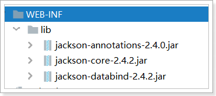 

### API简述

**ObjectMapper类**, 是Jackson库的主要类, 它提供一些功能将Java对象转换成JSON结构，反之亦然

**TypeReference 类**, 对进行泛型的反序列化，使用TypeReference可以明确的指定反序列化的类型

- **API** : 类ObjectMapper 

| 方法                                                         | 描述                         |
| ------------------------------------------------------------ | ---------------------------- |
| public String writeValueAsString(Object value)               | 将java对象 转换成 json字符串 |
| public <T> T readValue(String content, Class<T> valueType)   | 将json字符串 转换成 Java对象 |
| public <T> T readValue(String content, TypeReference valueTypeRef) | 将json字符串 转换成 Java对象 |

### json字符串与java对象相互转换:

- 需求:

```properties
1. 对象转json, json转对象

2. map<String,String>转json, json转map<String,String>

3. map<String,User>转json, json转map<String,User>

4. list<String>转json, json转 list<String>

5. list<User>转json, json转list<User>
```

- 代码实现

```java
public class JsonAndJava {

    private static ObjectMapper mapper = new ObjectMapper();

    /**
     * 1. 对象转json, json转对象
     * 打印结果
     * json字符串 = {"name":"迪丽热巴","age":22}
     * java对象 = User{name='迪丽热巴', age=22}
     */
    @Test
    public void test1() throws IOException {
        //对象转json
        User user = new User("迪丽热巴", 22);
        String json = mapper.writeValueAsString(user);
        System.out.println("json字符串 = "+json);

        //json转对象
        User u = mapper.readValue(json, User.class);
        System.out.println("java对象 = " + u);
    }

    /**
     * 2. map<String,String>转json, json转map<String,String>
     * 打印结果
     * json字符串 = {"最佳男明星":"古天乐","最佳女明星":"迪丽热巴"}
     * java对象 = {最佳男明星=古天乐, 最佳女明星=迪丽热巴}
     */
    @Test
    public void test2() throws IOException {
        //map<String,String>转json
        HashMap<String, String> map = new HashMap<>();
        map.put("最佳女明星","迪丽热巴");
        map.put("最佳男明星","古天乐");
        String json = mapper.writeValueAsString(map);
        System.out.println("json字符串 = "+json);

        //json转map<String,String>
        HashMap<String,String> mmap = mapper.readValue(json, HashMap.class);
        System.out.println("java对象 = "+mmap);
    }

    /**
     * 3. map<String,User>转json, json转map<String,User>
     * 打印结果:
     * json字符串 = {"最佳男明星":{"name":"古天乐","age":35},"最佳女明星":{"name":"迪丽热巴","age":22}}
     * java对象 = {最佳男明星=User{name='古天乐', age=35}, 最佳女明星=User{name='迪丽热巴', age=22}}
     */
    @Test
    public void test3() throws IOException {
        //map<String,User>转json
        HashMap<String, User> map = new HashMap<>();
        map.put("最佳女明星",new User("迪丽热巴",22));
        map.put("最佳男明星",new User("古天乐", 35));
        String json = mapper.writeValueAsString(map);
        System.out.println("json字符串 = " + json);

        //json转map<String,User>
        HashMap<String, User> mmap = mapper.readValue(json, new TypeReference<HashMap<String, User>>() {});
        System.out.println("java对象 = " + mmap);
    }

    /**
     * 4. List<String>转json, json转 List<String>
     * 打印结果:
     * json字符串 = ["迪丽热巴","古力娜扎"]
     * java对象 = [迪丽热巴, 古力娜扎]
     */
    @Test
    public void test4() throws IOException {
        //List<String>转json
        List<String> list = new ArrayList<>();
        list.add("迪丽热巴");
        list.add("古力娜扎");
        String json = mapper.writeValueAsString(list);
        System.out.println("json字符串 = " + json);

        //json转 List<String>
        List<String> list1 = mapper.readValue(json, List.class);
        System.out.println("java对象 = " + list1);
    }

    /**
     * 5. List<User>转json, json转List<User>
     * 打印结果:
     * json字符串 = [{"name":"迪丽热巴","age":23},{"name":"古力娜扎","age":20}]
     * java对象 = [User{name='迪丽热巴', age=23}, User{name='古力娜扎', age=20}]
     */
    @Test
    public void test5() throws IOException {
        //List<User>转json
        List<User> list = new ArrayList<>();
        list.add(new User("迪丽热巴", 23));
        list.add(new User("古力娜扎", 20));
        String json = mapper.writeValueAsString(list);
        System.out.println("json字符串 = " + json);

        //json转List<User>
        List<User> list1 = mapper.readValue(json, new TypeReference<List<User>>(){});
        System.out.println("java对象 = " + list1);
    }
}

```


# 第九章 综合案例(使用JQuery处理JSON数据)

## 1 综合案例1 ：检测用户名是否已经被注册

### 1.1 需求:

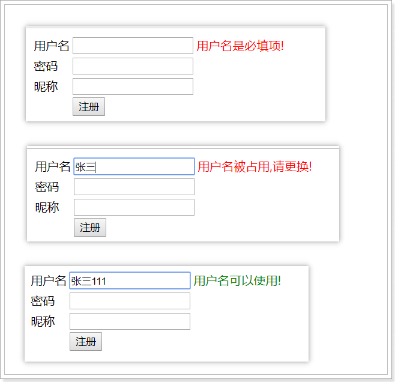

### 1.2 分析

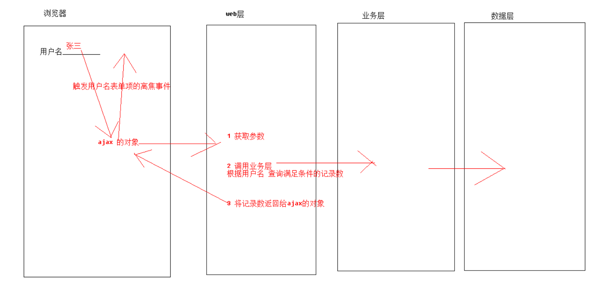

### 准备工作

#### sql语句

```sql
SET FOREIGN_KEY_CHECKS=0;

-- ----------------------------
-- Table structure for `user`
-- ----------------------------
DROP TABLE IF EXISTS `user`;
CREATE TABLE `user` (
  `id` int(11) NOT NULL AUTO_INCREMENT,
  `name` varchar(32) DEFAULT NULL,
  `password` varchar(32) DEFAULT NULL,
  PRIMARY KEY (`id`)
) ENGINE=InnoDB AUTO_INCREMENT=21 DEFAULT CHARSET=utf8;

-- ----------------------------
-- Records of user
-- ----------------------------
INSERT INTO `user` VALUES ('1', '张三', '123');
INSERT INTO `user` VALUES ('2', '李四', '123');
INSERT INTO `user` VALUES ('3', '王五', '123');
INSERT INTO `user` VALUES ('4', '赵六', '123');
INSERT INTO `user` VALUES ('5', '田七', '123');
INSERT INTO `user` VALUES ('6', '孙八', '123');
INSERT INTO `user` VALUES ('7', '张三丰', '123');
INSERT INTO `user` VALUES ('8', '张无忌', '123');
INSERT INTO `user` VALUES ('9', '李寻欢', '123');
INSERT INTO `user` VALUES ('10', '王维', '123');
INSERT INTO `user` VALUES ('11', '李白', '123');
INSERT INTO `user` VALUES ('12', '杜甫', '123');
INSERT INTO `user` VALUES ('13', '李贺', '123');
INSERT INTO `user` VALUES ('14', '李逵', '123');
INSERT INTO `user` VALUES ('15', '宋江', '123');
INSERT INTO `user` VALUES ('16', '王英', '123');
INSERT INTO `user` VALUES ('17', '鲁智深', '123');
INSERT INTO `user` VALUES ('18', '武松', '123');
INSERT INTO `user` VALUES ('19', '张薇', '123');
INSERT INTO `user` VALUES ('20', '张浩', '123');
```

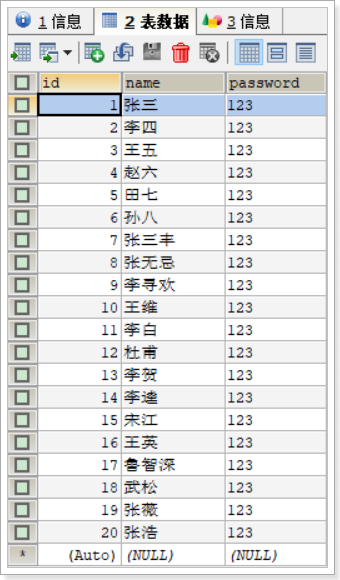 

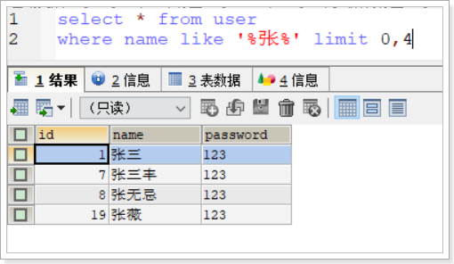 

#### pojo类

```java
package cn.itcast.pojo;

public class User {
    private int id;
    private String name;
    private String password;
    
	// get 和 set 和 toString 方法    
}
```


### 1.3 实现

#### 1.3.1 入口页面

```http
web/form1.html
```

```html
<!DOCTYPE html>
<html lang="en">
<head>
    <meta charset="UTF-8">
    <title>Title</title>
    <script src="js/jquery-1.12.4.min.js"></script>
    <script>
        // 页面加载完成后执行
        $(function () {
            /*
            // 给用户名输入框绑定 离焦事件
            $("#username").blur(function () {
                // this 指绑定事件的标签对象, 注意: 他是js对象
                var usernameVal = this.value;
                // 判断 是否为空,
                // 如果为空, 提示错误
                if(usernameVal==null || usernameVal.trim()=='') {
                    $("#usernameMsg").html("用户名是必填项!");
                    $("#usernameMsg").css("color", "red");
                    return;
                }
                // 使用ajax 让服务器校验用户名是否被占用
                $.ajax({
                    type: "POST",
                    url: "/day1402/checkNameServlet",
                    data: {"name" : usernameVal},
                    success: function(data){
                        console.info("=============" + data);
                        if(data > 0) {
                            $("#usernameMsg").html("用户名被占用,请更换!").css("color", "red");
                        }else {
                            $("#usernameMsg").html("用户名可以使用!").css("color", "green");
                        }
                    }
                });
            });

            // 给用户名输入框绑定键盘弹起事件
            $("#username").keyup(function () {
                // this 指绑定事件的标签对象, 注意: 他是js对象
                var usernameVal = this.value;
                // 判断 是否为空,
                // 如果为空, 提示错误
                if(usernameVal==null || usernameVal.trim()=='') {
                    $("#usernameMsg").html("用户名是必填项!");
                    $("#usernameMsg").css("color", "red");
                    return;
                }
                // 使用ajax 让服务器校验用户名是否被占用
                $.ajax({
                    type: "POST",
                    url: "/day1402/checkNameServlet",
                    data: {"name" : usernameVal},
                    success: function(data){
                        console.info("=============" + data);
                        if(data > 0) {
                            $("#usernameMsg").html("用户名被占用,请更换!").css("color", "red");
                        }else {
                            $("#usernameMsg").html("用户名可以使用!").css("color", "green");
                        }
                    }
                });
            });
             */

            $("#username").bind("blur keyup", function(){
                console.info("359...................................");
                // this 指绑定事件的标签对象, 注意: 他是js对象
                var usernameVal = this.value;
                // 判断 是否为空,
                // 如果为空, 提示错误
                if(usernameVal==null || usernameVal.trim()=='') {
                    $("#usernameMsg").html("用户名是必填项!");
                    $("#usernameMsg").css("color", "red");
                    return;
                }
                // 使用ajax 让服务器校验用户名是否被占用
                $.ajax({
                    type: "POST",
                    url: "/day1402/checkNameServlet",
                    data: {"name" : usernameVal},
                    success: function(data){
                        console.info("=============" + data);
                        if(data > 0) {
                            $("#usernameMsg").html("用户名被占用,请更换!").css("color", "red");
                        }else {
                            $("#usernameMsg").html("用户名可以使用!").css("color", "green");
                        }
                    }
                });
            });
        });
    </script>
</head>
<body>
    <form action="01.html" method="get">
        <table>
            <tr>
                <td>用户名</td>
                <td><input type="text" name="username" id="username"/></td>
                <td><span id="usernameMsg"></span></td>
            </tr>

            <tr>
                <td>密码</td>
                <td><input type="password" name="password"/></td>
                <td><span id="passwordMsg"></span></td>
            </tr>

            <tr>
                <td>昵称</td>
                <td><input type="text" name="nickname"/></td>
                <td><span id="nicknameMsg"></span></td>
            </tr>
            <tr>
                <td></td>
                <td><input type="submit" value="注册"/></td>
                <td></td>
            </tr>
        </table>
    </form>
</body>
</html>
```

#### 1.3.2  web层

```java
package cn.itcast.web;

import cn.itcast.service.UserService;
import cn.itcast.service.impl.UserServiceImpl;

import javax.servlet.ServletException;
import javax.servlet.annotation.WebServlet;
import javax.servlet.http.HttpServlet;
import javax.servlet.http.HttpServletRequest;
import javax.servlet.http.HttpServletResponse;
import java.io.IOException;

@WebServlet("/checkNameServlet")
public class CheckNameServlet extends HttpServlet {
    protected void doPost(HttpServletRequest request, HttpServletResponse response) throws ServletException, IOException {
        // 解决获取参数的中文乱码 (浏览器 -> 服务器)
        request.setCharacterEncoding("utf-8");
        // 解决浏览器出现的中文乱码
        response.setContentType("text/html;charset=utf-8");

        // 1 获取参数
        String name = request.getParameter("name");
        // 2 调用业务层 根据用户名 查询记录数
        UserService userService = new UserServiceImpl();
        int count = userService.queryCountByName(name);
        // 3 将记录数返回给浏览器
        response.getWriter().println(count);
    }

    protected void doGet(HttpServletRequest request, HttpServletResponse response) throws ServletException, IOException {
        doPost(request, response);
    }
}

```


#### 1.3.3 业务层

```java
package cn.itcast.service.impl;

import cn.itcast.mapper.UserMapper;
import cn.itcast.service.UserService;
import cn.itcast.utils.BaseService;
import org.apache.ibatis.session.SqlSession;

public class UserServiceImpl extends BaseService implements UserService {

    @Override
    public int queryCountByName(String name) {

        SqlSession sqlSession = getSession();
        UserMapper userMapper = getDao(sqlSession, UserMapper.class);

        int count = 0;
        try {
            count = userMapper.queryCountByName(name);
            commitAndCloseSession(sqlSession);
        } catch (Exception e) {
            e.printStackTrace();
            rollbackAndCloseSession(sqlSession);
        }

        return count;
    }
}
```

#### 1.3.4 数据层

```java
package cn.itcast.mapper;

import org.apache.ibatis.annotations.Param;

public interface UserMapper {

    // 根据用户名 查询满足条件的记录数
    public int queryCountByName(@Param("name") String name);
}

```


```xml
<?xml version="1.0" encoding="UTF-8" ?>
<!DOCTYPE mapper
        PUBLIC "-//mybatis.org//DTD Mapper 3.0//EN"
        "http://mybatis.org/dtd/mybatis-3-mapper.dtd">
<mapper namespace="cn.itcast.mapper.UserMapper">
   <!--根据用户名 查询满足条件的记录数-->
    <select id="queryCountByName" resultType="int">
        select count(1) from user
        where name = #{name}
    </select>
</mapper>
```


## 2 综合案例2 ：内容自动补全

### 2.1 需求

在输入框输入关键字，下拉框中异步显示与该关键字相关的商品的名称

### 2.2 效果

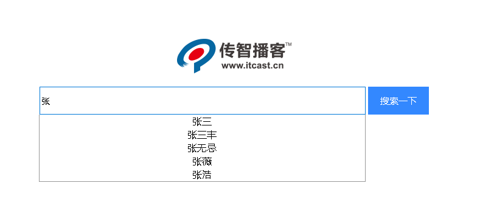 

### 2.3 准备工作

#### 2.3.1 sql语句

```sql

SET FOREIGN_KEY_CHECKS=0;

-- ----------------------------
-- Table structure for `user`
-- ----------------------------
DROP TABLE IF EXISTS `user`;
CREATE TABLE `user` (
  `id` int(11) NOT NULL AUTO_INCREMENT,
  `name` varchar(32) DEFAULT NULL,
  `password` varchar(32) DEFAULT NULL,
  PRIMARY KEY (`id`)
) ENGINE=InnoDB AUTO_INCREMENT=21 DEFAULT CHARSET=utf8;

-- ----------------------------
-- Records of user
-- ----------------------------
INSERT INTO `user` VALUES ('1', '张三', '123');
INSERT INTO `user` VALUES ('2', '李四', '123');
INSERT INTO `user` VALUES ('3', '王五', '123');
INSERT INTO `user` VALUES ('4', '赵六', '123');
INSERT INTO `user` VALUES ('5', '田七', '123');
INSERT INTO `user` VALUES ('6', '孙八', '123');
INSERT INTO `user` VALUES ('7', '张三丰', '123');
INSERT INTO `user` VALUES ('8', '张无忌', '123');
INSERT INTO `user` VALUES ('9', '李寻欢', '123');
INSERT INTO `user` VALUES ('10', '王维', '123');
INSERT INTO `user` VALUES ('11', '李白', '123');
INSERT INTO `user` VALUES ('12', '杜甫', '123');
INSERT INTO `user` VALUES ('13', '李贺', '123');
INSERT INTO `user` VALUES ('14', '李逵', '123');
INSERT INTO `user` VALUES ('15', '宋江', '123');
INSERT INTO `user` VALUES ('16', '王英', '123');
INSERT INTO `user` VALUES ('17', '鲁智深', '123');
INSERT INTO `user` VALUES ('18', '武松', '123');
INSERT INTO `user` VALUES ('19', '张薇', '123');
INSERT INTO `user` VALUES ('20', '张浩', '123');
```

 

 

#### 2.3.2 pojo类

```java
package cn.itcast.pojo;

public class User {
    private int id;
    private String name;
    private String password;
    
	// get 和 set 和 toString 方法    
}
```


### 2.4 代码实现

#### 2.4.1 入口页面

```http
路径: web/search.html
```

```html
<!DOCTYPE html>
<html>
<head>
    <meta http-equiv="Content-Type" content="text/html; charset=UTF-8">
    <title>Insert title here</title>
    <style type="text/css">
        .content {
            width: 643px;
            margin: 200px auto;
            text-align: center;
        }

        input[type='text'] {
            width: 530px;
            height: 40px;
            font-size: 14px;
        }

        input[type='button'] {
            width: 100px;
            height: 46px;
            background: #38f;
            border: 0;
            color: #fff;
            font-size: 15px
        }

        .show {
            position: absolute;
            width: 535px;
            height: 100px;
            border: 1px solid #999;
            border-top: 0;
            display: none;
        }
    </style>
    <script type="text/javascript" src="js/jquery-1.12.4.min.js"></script>
    <script type="text/javascript">
        console.info(111);
        /**
         * 搜索功能
         * 步骤:
         * 1.获取输入的关键字, 若内容为空, 关键字匹配列表的div隐藏
         * 2.发送ajax请求, 获取搜索的匹配结果,拼接匹配结果,显示到 关键字匹配列表的div上
         * 3.为匹配列表中的每个结果 添加鼠标移入,移除,单击的事件
         *      鼠标移入, 设置为背景灰色
         *      鼠标移出, 设置为背景白色
         *      鼠标点击, 设置匹配结果显示在输入框中, 并隐藏匹配列表div
         */
        function search(obj){
            // 1 获取用户输入的关键字
            var keyword = obj.value;
            //console.info(keyword);

            // 2 若内容为空, 关键字匹配列表的div隐藏
            if(keyword==null || keyword.trim()=='') {
                $("#show").hide();
                return; // 结束当前方法
            }
            // 3 发送ajax请求, 获取搜索的匹配结果,拼接匹配结果,显示到 关键字匹配列表的div上
            $.ajax({
                type: "POST",
                url: "/day1402/queryLikeNameListByKeyword",
                data: {"keyword" : keyword},
                success: function(data){
                    var nameArr = data;
                    var str = "";
                    for(var i=0; i<nameArr.length; i++) {
                        var name = nameArr[i];
                        // console.info(name);
                        str += "<div onmouseover='fn1(this)' onmouseout='fn2(this)' onclick='fn3(this)'>" + name + "</div>"
                    }
                    $("#show").html(str);
                    $("#show").show(); // 显示标签
                },
                dataType : "json"
            });

        }

        //鼠标移入, 设置为背景灰色
        function fn1(obj){
            $(obj).css("background","grey");
        }

        //鼠标移出, 设置为背景白色
        function fn2(obj){
            $(obj).css("background","white");
        }

        //鼠标点击, 设置匹配结果显示在输入框中, 并隐藏匹配列表div
        function fn3(obj){
            $("#keyWord").val( $(obj).html() );
            $("#show").hide();
        }
    </script>
</head>
<body>
<div class="content">
    <br/><br/>
    <input id="keyWord" type="text" name="word" onkeyup="search(this)">
    <input type="button" value="搜索一下">
    <div id="show" class="show"></div>
</div>
</body>
</html>
```

#### 2.4.2 web层

```java
package cn.itcast.web;

import cn.itcast.pojo.User;
import cn.itcast.service.UserService;
import cn.itcast.service.impl.UserServiceImpl;
import com.fasterxml.jackson.databind.ObjectMapper;

import javax.servlet.ServletException;
import javax.servlet.annotation.WebServlet;
import javax.servlet.http.HttpServlet;
import javax.servlet.http.HttpServletRequest;
import javax.servlet.http.HttpServletResponse;
import java.io.IOException;
import java.util.List;

@WebServlet("/searchServlet")
public class SearchServlet extends HttpServlet {
    protected void doPost(HttpServletRequest request, HttpServletResponse response) throws ServletException, IOException {
        // 解决获取参数的中文乱码 (浏览器 -> 服务器)
        request.setCharacterEncoding("utf-8");
        // 解决浏览器出现的中文乱码
        response.setContentType("text/html;charset=utf-8");

        // 1 获取参数: 关键字
        String keyword = request.getParameter("keyword");

        // 2 调用业务层 根据关键字查询用户信息
        UserService userService = new UserServiceImpl();
        List<String> userList = userService.queryUserListByName(keyword);

        // 3 将用户信息转成json 发送给浏览器
        ObjectMapper objectMapper = new ObjectMapper();
        String jsonStr = objectMapper.writeValueAsString(userList);
        response.getWriter().println(jsonStr);
    }

    protected void doGet(HttpServletRequest request, HttpServletResponse response) throws ServletException, IOException {
        doPost(request, response);
    }
}
```

#### 2.4.3 业务层

```java
package cn.itcast.service.impl;

import cn.itcast.mapper.UserMapper;
import cn.itcast.pojo.User;
import cn.itcast.service.UserService;
import cn.itcast.utils.BaseService;
import org.apache.ibatis.session.SqlSession;

import java.util.List;

public class UserServiceImpl extends BaseService implements UserService {

    @Override
    public List<String> queryUserListByName(String keyword) {
        SqlSession sqlSession = getSession();
        UserMapper userMapper = getDao(sqlSession, UserMapper.class);

        List<String> userList = null;
        try {
            userList = userMapper.queryUserListByName(keyword);
            commitAndCloseSession(sqlSession);
        } catch (Exception e) {
            e.printStackTrace();
            rollbackAndCloseSession(sqlSession);
        }
        return userList;
    }
}
```

#### 2.4.4 数据层

```java
package cn.itcast.mapper;

import cn.itcast.pojo.User;
import org.apache.ibatis.annotations.Param;

import java.util.List;

public interface UserMapper {

    // 根据姓名 模糊查询
    public List<String> queryUserListByName(@Param("name") String name);

}
```


```xml
<?xml version="1.0" encoding="UTF-8" ?>
<!DOCTYPE mapper
        PUBLIC "-//mybatis.org//DTD Mapper 3.0//EN"
        "http://mybatis.org/dtd/mybatis-3-mapper.dtd">
<mapper namespace="cn.itcast.mapper.UserMapper">
    <!--根据姓名模糊查询-->
    <select id="queryUserListByName" resultType="string">
        select name from user where name like '%${name}%' limit 0,4
    </select>
</mapper>
```

