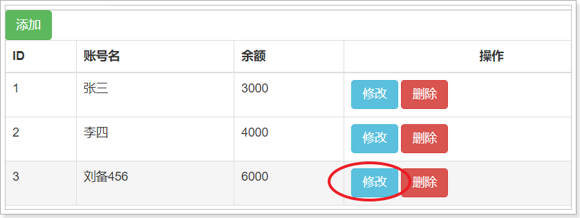

# Vue基础

# 第一章 Vue简介

## 1. Vue是什么

> Vue.JS是优秀的前端 JavaScript 框架

库和框架的区别:

- 库(如jQuery)

    库是工具. 提供大量API，体现了封装的思想、需要自己调用这些API

- 框架

    框架提供了一套完整解决方案,

    使用者要按照框架所规定的某种规范进行开发 

## 2. 为什么要学习 Vue

随着项目业务场景的复杂,传统模式（html+jquery）已无法满足需求

就出现了Angular/React/Vue等框架

- 企业需求
- 主流框架之一(React Angular Vue)
- 易用、灵活、高效

## 3. Vue 能做什么

- 最大程度上解放了 DOM 操作
- 单页web项目(SinglePageApplication项目,例如[Worktile官网](https://worktile.com/))开发
- 传统网站开发


document.getElementById("xx").innerHTML();

{{xxx}}

## 4. 核心特性

- 双向数据绑定
- 通过 **指令** 扩展了 HTML，通过 **表达式** 绑定数据到 HTML
- 解耦视图与数据
- 可复用**组件**
- 虚拟DOM 
- M-V-VM模型
- 数据驱动视图

## 5. 学习链接

[Vue官方文档](https://cn.vuejs.org/)

[Vue开源项目汇总](https://github.com/opendigg/awesome-github-vue)

[Vue.js中文社区](https://www.vue-js.com/)


# 第二章 Vue快速入门

## 1. 安装Vue

直接下载源码然后通过路径引入

- 开发版本：https://vuejs.org/js/vue.js
- 生产版本：https://vuejs.org/js/vue.min.js

## 2. Vue入门程序 HelloWorld

> 作用:将数据应用在html页面中

```http
1. body中,设置Vue管理的视图<div id="app"></div>
2. 引入vue.js
3. 实例化Vue对象 new Vue();
4. 设置Vue实例的选项:如el、data...     
	new Vue({选项:值});
5. 在<div id='app'></div>中通过{{ }}使用data中的数据
```

```html
<!DOCTYPE html>
<html lang="en">
<head>
    <meta charset="UTF-8">
    <title>Vue快速入门</title>
</head>
<body>
    <!--设置vue管理的视图-->
    <div id="app">
        <!--在视图里使用Vue实例中data里面的list数据-->
        <p>{{ list }}</p>
    </div>

    <!--引入vue.js文件-->
    <script src="js/vue.js"></script>
    <!--实例化vue对象-->
    <script type="text/javascript">
        new Vue({
            el : '#app',
            data : {
                list : '我是模拟发起ajax请求后.从服务器端返回的数据'
            }
        });
    </script>
</body>
</html>
```


## 3. Vue参数详解

#### [el](https://cn.vuejs.org/v2/api/#el)

el作用:指定当前Vue实例所管理的视图,值通常是id选择器

1. el的值可以是css选择器,通常是id选择器
2. el的值不能是html标签和body标签

#### [data](https://cn.vuejs.org/v2/api/#data)

data作用:指定当前Vue实例的数据对象

1. data中的数据是响应式数据
2. 值可以是一个对象 {属性: 值}
3. 所有数据部分写在data中
4. 在当前Vue实例所管理的视图中通过属性名使用data中的数据
5. 可以通过vm.$data.属性 访问数据
6. 可以通过vm.属性 访问数据(更简单)

#### [methods](https://cn.vuejs.org/v2/api/#methods)

methods作用:指定当前Vue实例中的方法

1. 可以直接通过vm实例访问这些方法，

2. 方法中的 this 自动绑定为 Vue 实例。


##### 代码演示

```html
<!DOCTYPE html>
<html lang="en">
<head>
    <meta charset="UTF-8">
    <title>Title</title>
</head>
<body>
    <!--设置vue所管理的视图-->
    <div id="a">
        <!--在vue视图中, 使用Vue实例中data里面的数据-->
        {{msgA}} --- {{fn1()}}
    </div>

    <!--引入Vue.js-->
    <script type="text/javascript" src="js/vue.js"></script>
    <script type="text/javascript">
        <!--创建Vue实例-->
        const vm = new Vue({
            el:"#a",
            data:{
                msgA:'第一个Vue实例对象'
            },
			methods:{
				fn1:function(){
					console.log(this.msgA);
					console.log('vm实例中的methods里的fn1方法被调用');
				},
				fn2:function(){
					this.fn1();
					console.log('fn2方法被调用');
				},
			}
        });
    </script>
</body>
</html>
```

#### [`插值表达式`](https://cn.vuejs.org/v2/guide/syntax.html)

作用:会将绑定的数据实时的显示出来:

- 通过任何方式修改所绑定的数据,所显示的数据都会被实时替换
- 在插值表达式中不能写js语句, 例如 `var a = 10; 分支语句 循环语句`

**格式**

```http
{{js表达式、三目运算符、方法调用等}}
```

**代码演示**

```html
<!DOCTYPE html>
<html>
	<head>
		<meta charset="utf-8">
		<title>插值表达式</title>
	</head>
	<body>
		<!-- 设置Vue所管理的视图 -->
		<div id= "app">
			<!-- 获取Vue对象中data里的数据 -->
			{{name}}
			<p>{{name}}</p>
			<p>{{name+'哈哈哈'}}</p>
			<p>{{name.split("")}}</p>
			<p>{{age>18?'成年':'未成年'}}</p>
		</div>
		
		<!-- 加载Vue.js文件 -->
		<script type="text/javascript" src="js/vue.js"></script>
		<!-- 创建Vue对象 -->
		<script type="text/javascript">
			const vm = new Vue({
				el:'#app',
				data:{
					name:'迪丽热巴',
					age:20
				}
			});
		</script>
	</body>
</html>

```


# 第三章 Vue常用指令

> Vue框架提供的语法, 扩展了html标签的功能、大部分的指令的值是js的表达式. 用于取代DOM操作

## 1 [v-text](https://vue.docschina.org/v2/api/#v-text)和[v-html](https://vue.docschina.org/v2/api/#v-html)

> 很像innerText和innerHTML

```http
document.getElementById("mydiv").innerHTML = "<h1>海马</h1>"; // 有html效果
document.getElementById("mydiv").innerText = "<h1>海马</h1>"; // 没有html效果, 将整个作为字符串处理
```


- v-text:更新标签中的内容
    - v-text和插值表达式的区别
        - v-text  更新整个标签中的内容
        - 插值表达式: 更新标签中局部的内容
- v-html:更新标签中的内容/标签
    - 可以渲染内容中的HTML标签
    - 注意:尽量避免使用，容易造成危险 (XSS跨站脚本攻击)

```html
<!DOCTYPE html>
<html>
	<head>
		<meta charset="utf-8">
		<title></title>
	</head>
	<body>
		<!-- 设置vue所管理的视图 -->
		<div id="app">
			<!-- 获取Vue对象中data里的数据 -->
			<p>{{text}},我是p标签中的内容</p>
			<p v-text="text">我是p标签中的内容</p>
			<p v-text="html">我是p标签中的内容</p>
			<p v-html="text">我是p标签中的内容</p>
			<p v-html="html">我是p标签中的内容</p>
		</div>
		
		<!-- 引入Vue.js文件 -->
		<script type="text/javascript" src="../js/vue.js"></script>
		<!-- 创建Vue对象 -->
		<script type="text/javascript">
			const vm = new Vue({
				el:'#app',
				data:{
					text:'点我试试看',
					html:'<a href="http://www.itcast.cn">试试就试试</a>'
				}
			});
		</script>
	</body>
</html>

```

## 2 [v-if](https://vue.docschina.org/v2/api/#v-if)和[v-show](https://vue.docschina.org/v2/api/#v-show) 

作用:根据表达式的bool值进行判断是否渲染该元素

 


```html
<!DOCTYPE html>
<html>
	<head>
		<meta charset="utf-8">
		<title></title>
	</head>
	<body>
		<!-- 设置vue所管理的视图 -->
		<div id="app">
			<!-- 获取vue对象中data里的数据 -->
			<p v-if="isShow">我是v-if数据</p>
			<p v-show="isShow">我是v-show数据</p>
		</div>
		
		<!-- 引入Vue.js -->
		<script type="text/javascript" src="../js/vue.js"></script>
		<!-- 创建Vue对象 -->
		<script type="text/javascript">
			new Vue({
				el:'#app',
				data:{
					isShow:false
				}
			});
		</script>
	</body>
</html>

```

`效果` 

 

> `v-if` 有更高的切换开销，而 `v-show` 有更高的初始渲染开销。
>
> 因此，如果需要非常频繁地切换，则使用 `v-show` 较好；
>
> 如果在运行时条件很少改变，则使用 `v-if` 较好。 

## 3 [v-on](https://vue.docschina.org/v2/api/#v-on)

- 作用:使用 `v-on` 指令绑定 DOM 事件，并在事件被触发时执行一些 JavaScript 代码。
- 语法:  
    - `v-on:事件名.修饰符 = "methods中的方法名"  `; v-on的简写方法: `@事件名.修饰符 = "methods中的方法名"`

- 修饰符  

 

```html
<!DOCTYPE html>
<html lang="en" xmlns:v-on="http://www.w3.org/1999/xhtml">
<head>
    <meta charset="UTF-8">
    <title>Title</title>
</head>
<body>
    <button onclick="location.href='http://www.baidu.com'">百度</button>
    <button onclick="method1()">百度</button>

    <div id="app">
        <!--需求: 点击按钮 修改 点击次数-->
        <!--在事件内 直接书写js代码-->
        <!--1 原始方式-->
        <button v-on:click="count++">按钮1</button>
        <!--2 简化方式-->
        <button @click="count++">按钮2</button>
        <!--3 给事件绑定方法-->
        <button @click="fn1()">按钮3</button>
        <!--4 给事件绑定方法, 还要给方法传递参数-->
        <button @click="fn2(count)">按钮4</button>

        <!--5 限制点击事件只会被执行一次-->
        <button @click="fn3()">按钮5</button>
        <button @click="fn3">按钮52222222</button>
        <button @click.once="fn3()">按钮6</button>


        <p>上面的按钮被点击的次数: {{count}}</p>
    </div>
    <script src="js/vue.js"></script>
    <script>
        new Vue({
            el : "#app",
            data : {
                count : 0
            },
            methods : {
                fn1 : function() {
                    console.info("方法一 被调用了... ...")
                    this.count++;
                },
                fn2 : function(cou) {
                    console.info("按钮被点击的次数: " + cou);
                },
                fn3 : function () {
                    console.info("方法三 被调用了... ...")
                }
            }
        });
    </script>
</body>
</html>
```


## 4 [v-for](https://cn.vuejs.org/v2/api/#v-for)

v-for作用: 列表渲染,当遇到相似的标签结构时,就用v-for去渲染

- 格式

    ```properties
    (item,index) in 数组或集合
    参数item:数组中的每个元素
    参数index:数组中元素的下标
    ```

    ```properties
    (value, key, index) in 对象
    参数index:对象中每对key-value的索引 从0开始
    参数key:键	
    参数value:值
    ```

 

代码演示

```html
<!DOCTYPE html>
<html lang="en">
<head>
    <meta charset="UTF-8">
    <title>Title</title>
</head>
<body>
<div id="app">
    <!--获取vue中data里面的数据-->
    <!--遍历数组-->
    <p v-for="(item, index) in arr">{{index+1}} ===== {{item}}</p>
    <hr/>

    <!--遍历对象-->
    <p v-for="(value, key, index) in person">{{index+1}} ==== {{key}} ==== {{value}}</p>
    <hr/>

    <!--遍历对象数组-->
    <p v-for="(person, index) in personArr">{{index+1}} ===== {{person.name}} ==== {{person.age}} ===== {{person.gender}}</p>
</div>
<script src="js/vue.js"></script>
<script>
    new Vue({
        el : "#app",
        data : {
            arr : ["张三", "李四", "王五"],
            person : {name:"刘备", age:"25", gender:"男"},
            personArr : [
                {name:"刘备", age:"25", gender:"男"},
                {name:"关羽", age:"28", gender:"男"},
                {name:"张飞", age:"29", gender:"男"},
            ]
        }
    });
</script>
</body>
</html>
```


## 5 [v-bind](https://vue.docschina.org/v2/api/#v-bind)

**作用:** 可以绑定标签上的任何属性。  

格式:

```properties
v-bind:属性="值"
```

简写格式

```properties
:属性="值"
```

属性值一部分进行替换的格式

```properties
:属性="'常亮值' + vue对象data中的数据"
```

代码演示

```html
<!DOCTYPE html>
<html xmlns:v-bind="http://www.w3.org/1999/xhtml">
<head>
    <meta charset="utf-8" />
    <title>v-bind</title>

</head>
<body>
<div id="app">
    <font size="5" v-bind:color="ys1">传智播客</font>
    <font size="5" :color="ys2">黑马程序员</font>
    <hr>
    <a href="http://www.itcast.cn">itcast</a><br/>
    <a :href="'http://' + url">京东</a><br/>
</div>

<script src="js/vue.js"></script>
<script type="text/javascript">
    new Vue({
        el:'#app',
        data:{
            ys1:"red",
            ys2:"yellow",
            url:"www.jd.cn"
        }
    });
</script>
</body>
</html>

```


## 6 [v-model](https://vue.docschina.org/v2/api/#v-model)

**作用:** 表单元素的绑定

特点: **双向数据绑定**

- vue对象中的数据发生变化可以更新到界面
- 通过界面可以更改vue对象中数据
- `v-model` 会忽略所有表单元素的 `value`、`checked`、`selected` 特性的初始值而总是将 Vue 实例的数据作为数据来源。应该在 `data`选项中声明初始值。 

格式:

​	在表单控件或者组件上创建双向绑定。细节请看下面的代码演示。

代码演示

```html
<!DOCTYPE html>
<html>
<head>
    <meta charset="utf-8" />
    <title>v-model</title>

</head>
<body>
<div id="app">
    姓名:<input type="text" id="username" v-model="user.username"><br>
    密码:<input type="password" id="password" v-model="user.password"><br>
    <input type="button" @click="fun" value="获取">
    <input type="button" @click="fun2()" value="修改">
</div>
<script src="js/vue.js"></script>
<script>
    new Vue({
        el: '#app',
        //表示当前vue对象接管了div区域
        data:{
            //设置初始值
            user:{username:"zhangsan",password:"123"} ,
        },
        methods:{
            fun:function(){
                //获取界面输入后,更新的值
                console.info(this.user.username);
                console.info(this.user.password);
            },
            fun2:function() {
                //对数据的值 再次赋值进行更新
                this.user.username = "武松";
                this.user.password = "555555555";
            }
        }
    });
</script>
</body>
</html>
```


# 第四章 Vue的生命周期

Vue生命周期生命周期是指Vue实例或者组件从诞生到消亡经历的每一个阶段，在这些阶段的前后可以设置一些函数当做事件来调用。

 

vue生命周期可以分为八个阶段，分别是：

beforeCreate（创建前）、created（创建后）、beforeMount(载入前)、mounted（载入后）、beforeUpdate（更新前）、updated（更新后）、beforeDestroy（销毁前）、destroyed（销毁后）

我们如果想在页面加载完毕后就要执行一些操作的话，可以使用created和mounted钩子函数，如下：

```html
<!DOCTYPE html>
<html>
	<head>
		<meta charset="utf-8" />
		<title>生命周期</title>
	</head>
	<body>
		<div id="app">
			{{message}}
		</div>

		<script src="../js/vue.js"></script>
		<script>
			const vm = new Vue({
				el: '#app',
				data: {
					message: 'Vue的生命周期'
				},
				beforeCreate: function() {
					console.group('------beforeCreate创建前状态------');
					console.log("%c%s", "color:red", "el     : " + this.$el); //undefined
					console.log("%c%s", "color:red", "data   : " + this.$data); //undefined 
					console.log("%c%s", "color:red", "message: " + this.message);//undefined
				},
				created: function() {
					console.group('------created创建完毕状态------');
					console.log("%c%s", "color:red", "el     : " + this.$el); //undefined
					console.log("%c%s", "color:red", "data   : " + this.$data); //已被初始化 
					console.log("%c%s", "color:red", "message: " + this.message); //已被初始化
				},
				beforeMount: function() {
					console.group('------beforeMount挂载前状态------');
					console.log("%c%s", "color:red", "el     : " + (this.$el)); //已被初始化
					console.log(this.$el);
					console.log("%c%s", "color:red", "data   : " + this.$data); //已被初始化  
					console.log("%c%s", "color:red", "message: " + this.message); //已被初始化  
				},
				mounted: function() {
					console.group('------mounted 挂载结束状态------');
					console.log("%c%s", "color:red", "el     : " + this.$el); //已被初始化
					console.log(this.$el);
					console.log("%c%s", "color:red", "data   : " + this.$data); //已被初始化
					console.log("%c%s", "color:red", "message: " + this.message); //已被初始化 
				},
				beforeUpdate: function() {
					console.group('beforeUpdate 更新前状态===============》');
					console.log("%c%s", "color:red", "el     : " + this.$el);
					console.log(this.$el);
					console.log("%c%s", "color:red", "data   : " + this.$data);
					console.log("%c%s", "color:red", "message: " + this.message);
				},
				updated: function() {
					console.group('updated 更新完成状态===============》');
					console.log("%c%s", "color:red", "el     : " + this.$el);
					console.log(this.$el);
					console.log("%c%s", "color:red", "data   : " + this.$data);
					console.log("%c%s", "color:red", "message: " + this.message);
				},
				beforeDestroy: function() {
					console.group('beforeDestroy 销毁前状态===============》');
					console.log("%c%s", "color:red", "el     : " + this.$el);
					console.log(this.$el);
					console.log("%c%s", "color:red", "data   : " + this.$data);
					console.log("%c%s", "color:red", "message: " + this.message);
				},
				destroyed: function() {
					console.group('destroyed 销毁完成状态===============》');
					console.log("%c%s", "color:red", "el     : " + this.$el);
					console.log(this.$el);
					console.log("%c%s", "color:red", "data   : " + this.$data);
					console.log("%c%s", "color:red", "message: " + this.message)
				}
			})

			// 设置data中message数据值
			//vm.message = "good...";
			// 销毁Vue对象
			//vm.$destroy();
		</script>
	</body>
</html>

```


# 第五章 Vue的Ajax异步请求 axios

在Vue.js中发送网络请求本质还是ajax，我们可以使用插件方便操作。

1. vue-resource: Vue.js的插件，已经不维护，不推荐使用
2. [axios](https://www.kancloud.cn/yunye/axios/234845) :**不是vue的插件**，可以在任何地方使用，推荐

> 说明: 既可以在浏览器端又可以在node.js中使用的发送http请求的库，支持Promise，不支持jsonp
>
> 如果遇到jsonp请求, 可以使用插件 `jsonp` 实现

3. 通过Http请求的不同类型(POST/DELETE/PUT/GET)来判断是什么业务操作(CRUD ) 

## HTTP方法规则举例

| **HTTP方法** | **数据处理** | **说明**                                           |
| ------------ | ------------ | -------------------------------------------------- |
| POST         | Create       | 新增一个没有id的资源                               |
| GET          | Read         | 取得一个资源                                       |
| PUT          | Update       | 更新一个资源。或新增一个含 id 资源(如果 id 不存在) |
| DELETE       | Delete       | 删除一个资源                                       |

### 发送get请求

```js
axios.get('/user?id=12345')
    .then(response => {
    	console.log(response.data);
	})
    .catch(error => {
    	console.dir(error)
	});
```

### 发送post请求

```js
axios.post('/user', "name=迪丽热巴&age=23")
    .then(response => {
		console.log(response.data);
	})
    .catch(error => {
		console.dir(err)
    });
```

axios.post(请求路径, 携带参数)

​				.then(response=>{

​						xxx

​				})

​				.catch(error => {

​						yyyy

​				});

为方便起见，为所有支持的请求方法提供了别名

- axios.request(confifig)
- axios.get(url[, confifig])
- axios.delete(url[, confifig])
- axios.head(url[, confifig])
- axios.post(url[, data[, confifig]])
- axios.put(url[, data[, confifig]])
- axios.patch(url[, data[, confifig]])


# 六. 综合案例 用户信息的操作 (CRUD) 

## 1 准备工作

### 1.1 sql语句

```sql
create database day15_db;

use day15_db;

create table tb_user(
	id int primary key auto_increment,
	name varchar(32) unique not null,	
	money double
);

insert into tb_user values(null, '张三', 3000),(null, '李四', 4000),(null, '王五', 5000);
```

### 1.2 配置文件

复制即可

 

### 1.3 业务层和数据层代码

复制即可

 

## 2 查询所有用户


### 2.1 html页面

 


```html
<!--循环次tr,插值表达式赋值 -->
<tr v-for="user in userList">
    <td>{{user.id}}</td>
    <td>{{user.name}}</td>
    <td>{{user.money}}</td>
    <td>
        <button type="button" class="btn btn-info">修改</button>
        <button type="button" class="btn btn-danger">删除</button>
    </td>
</tr>
```

### 2.2 js文件

 

```javascript
new Vue({
    el:'#app',
    data:{
        userInfo:{},
        userList:[]
    },
    methods:{
        findAll:function () {
            //发送请求，获取用户数据
            axios.get("/day15002/userQueryAllServlet")
                .then( response => {
                    //响应JSON格式数据，复制给Vue对象的键userList
                    this.userList = response.data;
                })
                .catch( error => {
                    console.dir(error);
                });
        }
    },
    //生命周期钩子方法
    mounted:function () {
        this.findAll();
    }
})
```

### 2.3 web层

```java
package cn.itcast.web;

import cn.itcast.pojo.User;
import cn.itcast.service.UserService;
import cn.itcast.service.impl.UserServiceImpl;
import com.fasterxml.jackson.databind.ObjectMapper;

import javax.servlet.ServletException;
import javax.servlet.annotation.WebServlet;
import javax.servlet.http.HttpServlet;
import javax.servlet.http.HttpServletRequest;
import javax.servlet.http.HttpServletResponse;
import java.io.IOException;
import java.util.List;

@WebServlet("/userQueryAllServlet")
public class UserQueryAllServlet extends HttpServlet {
    protected void doPost(HttpServletRequest request, HttpServletResponse response) throws ServletException, IOException {
        // 解决获取参数的中文乱码 (浏览器 -> 服务器)
        request.setCharacterEncoding("utf-8");
        // 解决浏览器出现的中文乱码
        response.setContentType("text/html;charset=utf-8");

        // 1 调用业务层 查询所有用户集合
        UserService userService = new UserServiceImpl();
        List<User> userList = userService.queryAll();
        // 2 将用户集合转成json字符串
        ObjectMapper objectMapper = new ObjectMapper();
        String json = objectMapper.writeValueAsString(userList);
        System.out.println(json);
        // 3 返回给浏览器
        response.getWriter().println(json);
    }

    protected void doGet(HttpServletRequest request, HttpServletResponse response) throws ServletException, IOException {
        doPost(request, response);
    }
}
```

## 3 添加用户

 

### 3.1 html页面


### 3.2 js文件


```javascript
new Vue({
    el:'#app',
    data:{
        userInfo:{},
        userList:[]
    },
    methods:{
        findAll:function () {
            //发送请求，获取用户数据
            axios.get("/day1502/userQueryAllServlet")
                .then( response => {
                    //响应JSON格式数据，复制给Vue对象的键userList
                    this.userList = response.data;
                })
                .catch( error => {
                    console.dir(error);
                });
        },
        add : function() {
            // 显示添加模块 超纲内容
            $("#add_modal").modal("show");
        },
        register : function () {
            var params = "name=" + this.userInfo.name + "&money=" + this.userInfo.money;
            axios.post("/day1502/userRegisterServlet", params)
                .then( response => {
                    // 重新查询所有用户 且 显示
                    this.findAll();
                    // 清空userInfo中的数据
                    this.userInfo = {};
                })
                .catch( error => {
                    console.dir(error);
                });
        }
    },
    //生命周期钩子方法
    mounted:function () {
        this.findAll();
    }
})
```

### 3.3 web层

```java
package cn.itcast.web;

import cn.itcast.pojo.User;
import cn.itcast.service.UserService;
import cn.itcast.service.impl.UserServiceImpl;
import com.fasterxml.jackson.databind.util.BeanUtil;
import org.apache.commons.beanutils.BeanUtils;

import javax.servlet.ServletException;
import javax.servlet.annotation.WebServlet;
import javax.servlet.http.HttpServlet;
import javax.servlet.http.HttpServletRequest;
import javax.servlet.http.HttpServletResponse;
import java.io.IOException;
import java.lang.reflect.InvocationTargetException;

@WebServlet("/registerServlet")
public class RegisterServlet extends HttpServlet {
    protected void doPost(HttpServletRequest request, HttpServletResponse response) throws ServletException, IOException {
        // 解决获取参数的中文乱码 (浏览器 -> 服务器)
        request.setCharacterEncoding("utf-8");
        // 解决浏览器出现的中文乱码
        response.setContentType("text/html;charset=utf-8");

        // 1 获取参数 封装到 pojo类中
        User user = new User();
        try {
            BeanUtils.populate(user, request.getParameterMap());
        } catch (Exception e) {
            e.printStackTrace();
        }
        System.out.println("=======================================" + user);

        // 2 调用业务层 添加用户
        UserService userService = new UserServiceImpl();
        userService.insertUser(user);
    }

    protected void doGet(HttpServletRequest request, HttpServletResponse response) throws ServletException, IOException {
        doPost(request, response);
    }
}
```

## 4 根据编号 删除用户


### 4.1 html页面


```html
<button type="button" class="btn btn-danger" @click="delById(user.id)">删除</button>
```

### 4.2 js文件


```javascript
new Vue({
    el:'#app',
    data:{
        userInfo:{},
        userList:[]
    },
    methods:{
        findAll:function () {
            //发送请求，获取用户数据
            axios.get("/day15002/userQueryAllServlet")
                .then( response => {
                    //响应JSON格式数据，复制给Vue对象的键userList
                    this.userList = response.data;
                })
                .catch( error => {
                    console.dir(error);
                });
        },
        add:function() {
            this.userList = {};
            $("#add_modal").modal("show");
        },
        register : function() {
            var params = "name=" + this.userInfo.name + "&money=" + this.userInfo.money;
            axios.post("/day15002/registerServlet", params)
                .then(response=>{
                    // 调用获取全部的用户数据
                    this.findAll();
                })
                .catch(error=>{
                    console.dir(error);
                });
        },
        delById : function(id) {
            if(confirm("您确定要删除id=" +id + "的用户吗?")) {
                axios.get("/day15002/userDelByIdServlet?id=" + id)
                    .then(response=>{
                        // 调用获取全部的用户数据
                        this.findAll();
                    })
                    .catch(error=>{
                        console.dir(error);
                    });
            }
        }
    },
    //生命周期钩子方法
    mounted:function () {
        this.findAll();
    }
})
```

### 4.3 web层

```java
package cn.itcast.web;

import cn.itcast.service.UserService;
import cn.itcast.service.impl.UserServiceImpl;

import javax.servlet.ServletException;
import javax.servlet.annotation.WebServlet;
import javax.servlet.http.HttpServlet;
import javax.servlet.http.HttpServletRequest;
import javax.servlet.http.HttpServletResponse;
import java.io.IOException;

@WebServlet("/userDelByIdServlet")
public class UserDelByIdServlet extends HttpServlet {
    protected void doPost(HttpServletRequest request, HttpServletResponse response) throws ServletException, IOException {
        // 解决获取参数的中文乱码 (浏览器 -> 服务器)
        request.setCharacterEncoding("utf-8");
        // 解决浏览器出现的中文乱码
        response.setContentType("text/html;charset=utf-8");

        // 1 获取参数 : 用户编号
        String id = request.getParameter("id");
        // 2 调用业务层 根据用户编号 删除用户
        UserService userService = new UserServiceImpl();
        userService.delById(Integer.parseInt(id));
    }

    protected void doGet(HttpServletRequest request, HttpServletResponse response) throws ServletException, IOException {
        doPost(request, response);
    }
}
```

## 5 跳转到修改用户界面




### 5.1 html页面: 入口


```html
<button type="button" class="btn btn-info" @click="queryById(user.id)">修改</button>
```

### 5.2 js文件


```javascript
new Vue({
    el:'#app',
    data:{
        userInfo:{},
        userList:[]
    },
    methods:{
        findAll:function () {
            //发送请求，获取用户数据
            axios.get("/day15002/userQueryAllServlet")
                .then( response => {
                    //响应JSON格式数据，复制给Vue对象的键userList
                    this.userList = response.data;
                })
                .catch( error => {
                    console.dir(error);
                });
        },
        add:function() {
            this.userList = {};
            $("#add_modal").modal("show");
        },
        register : function() {
            var params = "name=" + this.userInfo.name + "&money=" + this.userInfo.money;
            axios.post("/day15002/registerServlet", params)
                .then(response=>{
                    // 调用获取全部的用户数据
                    this.findAll();
                })
                .catch(error=>{
                    console.dir(error);
                });
        },
        delById : function(id) {
            if(confirm("您确定要删除id=" +id + "的用户吗?")) {
                axios.get("/day15002/userDelByIdServlet?id=" + id)
                    .then(response=>{
                        // 调用获取全部的用户数据
                        this.findAll();
                    })
                    .catch(error=>{
                        console.dir(error);
                    });
            }
        },
        queryById : function(id) {
            axios.get("/day15002/userQueryByIdServlet?id=" + id)
                .then(response=>{
                    this.userInfo = response.data;
                    $("#update_modal").modal("show");
                })
                .catch(error=>{
                    console.dir(error);
                });
        }
    },
    //生命周期钩子方法
    mounted:function () {
        this.findAll();
    }
})
```

### 5.3 web层

```java
package cn.itcast.web;

import cn.itcast.pojo.User;
import cn.itcast.service.UserService;
import cn.itcast.service.impl.UserServiceImpl;
import com.fasterxml.jackson.databind.ObjectMapper;

import javax.servlet.ServletException;
import javax.servlet.annotation.WebServlet;
import javax.servlet.http.HttpServlet;
import javax.servlet.http.HttpServletRequest;
import javax.servlet.http.HttpServletResponse;
import java.io.IOException;

@WebServlet("/userQueryByIdServlet")
public class UserQueryByIdServlet extends HttpServlet {
    protected void doPost(HttpServletRequest request, HttpServletResponse response) throws ServletException, IOException {
        // 解决获取参数的中文乱码 (浏览器 -> 服务器)
        request.setCharacterEncoding("utf-8");
        // 解决浏览器出现的中文乱码
        response.setContentType("text/html;charset=utf-8");

        // 1 获取参数 用户编号
        int id = Integer.parseInt(request.getParameter("id"));
        // 2 调用业务层 根据编号查询用户
        UserService userService = new UserServiceImpl();
        User user = userService.queryById(id);
        // 3 将用户转成json字符串
        ObjectMapper objectMapper = new ObjectMapper();
        String json = objectMapper.writeValueAsString(user);
        // 4 将json字符串返回给浏览器
        response.getWriter().println(json);
    }

    protected void doGet(HttpServletRequest request, HttpServletResponse response) throws ServletException, IOException {
        doPost(request, response);
    }
}
```

### 5.4 html页面 : 显示用户信息


```html
<!--修改 模块-->
<div id="update_modal" class="modal fade" role="dialog">
    <div class="modal-dialog modal-lg">
        <div class="modal-content">
            <div class="modal-header">
                <button type="button" class="close" data-dismiss="modal" aria-label="Close">
                    <span aria-hidden="true">&times;</span></button>
                <h4 class="modal-title">修改--用户信息</h4>
            </div>
            <div class="modal-body">
                <input type="hidden" class="form-control">
                <div class="box-body">
                    <div class="box-body">
                        <div class="form-group">
                            <label for="inputEmail3" class="col-sm-2 control-label">账户名</label>
                            <div class="col-sm-10">
                                <input type="text" class="form-control" placeholder="name" v-model="userInfo.name">
                            </div>
                        </div>
                        <div class="form-group">
                            <label for="inputPassword3" class="col-sm-2 control-label" >余额</label>

                            <div class="col-sm-10">
                                <input type="text" class="form-control" placeholder="money" v-model="userInfo.money">
                            </div>
                        </div>

                    </div>
                    <div class="box-footer">
                        <button type="button" class="btn btn-outline" data-dismiss="modal">关闭
                        </button>
                        <button type="button" class="btn btn-outline" data-dismiss="modal" @click="update()">修改
                        </button>
                    </div>
                </div>

            </div>
        </div>
        <!-- /.modal-content -->
    </div>

    <!-- /.modal-dialog -->
</div>
```

## 6 修改用户

### 6.1 js文件


```javascript
new Vue({
    el:'#app',
    data:{
        userInfo:{},
        userList:[]
    },
    methods:{
        findAll:function () {
            //发送请求，获取用户数据
            axios.get("/day15002/userQueryAllServlet")
                .then( response => {
                    //响应JSON格式数据，复制给Vue对象的键userList
                    this.userList = response.data;
                })
                .catch( error => {
                    console.dir(error);
                });
        },
        add:function() {
            this.userInfo = {};
            $("#add_modal").modal("show");
        },
        register : function() {
            var params = "name=" + this.userInfo.name + "&money=" + this.userInfo.money;
            axios.post("/day15002/registerServlet", params)
                .then(response=>{
                    // 调用获取全部的用户数据
                    this.findAll();
                })
                .catch(error=>{
                    console.dir(error);
                });
        },
        delById : function(id) {
            if(confirm("您确定要删除id=" +id + "的用户吗?")) {
                axios.get("/day15002/userDelByIdServlet?id=" + id)
                    .then(response=>{
                        // 调用获取全部的用户数据
                        this.findAll();
                    })
                    .catch(error=>{
                        console.dir(error);
                    });
            }
        },
        queryById : function(id) {
            axios.get("/day15002/userQueryByIdServlet?id=" + id)
                .then(response=>{
                    this.userInfo = response.data;
                    $("#update_modal").modal("show");
                })
                .catch(error=>{
                    console.dir(error);
                });
        },
        update : function() {
            var params = "id=" + this.userInfo.id + "&name=" + this.userInfo.name + "&money=" + this.userInfo.money;
            axios.post("/day15002/userUpdateServlet", params)
                .then(response=>{
                    // 再次查询所有用户且显示
                    this.findAll();
                })
                .catch(error=>{
                    console.dir(error);
                });
        }
    },
    //生命周期钩子方法
    mounted:function () {
        this.findAll();
    }
})
```

### 6.2 web层

```java
package cn.itcast.web;

import cn.itcast.pojo.User;
import cn.itcast.service.UserService;
import cn.itcast.service.impl.UserServiceImpl;
import com.fasterxml.jackson.databind.util.BeanUtil;
import org.apache.commons.beanutils.BeanUtils;

import javax.servlet.ServletException;
import javax.servlet.annotation.WebServlet;
import javax.servlet.http.HttpServlet;
import javax.servlet.http.HttpServletRequest;
import javax.servlet.http.HttpServletResponse;
import java.io.IOException;
import java.lang.reflect.InvocationTargetException;

@WebServlet("/userUpdateServlet")
public class UserUpdateServlet extends HttpServlet {
    protected void doPost(HttpServletRequest request, HttpServletResponse response) throws ServletException, IOException {
        // 解决获取参数的中文乱码 (浏览器 -> 服务器)
        request.setCharacterEncoding("utf-8");
        // 解决浏览器出现的中文乱码
        response.setContentType("text/html;charset=utf-8");
        // 1 获取参数 封装到pojo
        User user = new User();
        try {
            BeanUtils.populate(user, request.getParameterMap());
        } catch (Exception e) {
            e.printStackTrace();
        }

        // 2 调用业务层 修改用户信息
        UserService userService = new UserServiceImpl();
        userService.updateUser(user);
    }

    protected void doGet(HttpServletRequest request, HttpServletResponse response) throws ServletException, IOException {
        doPost(request, response);
    }
}
```


