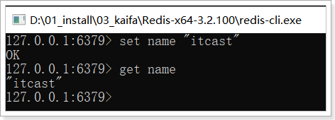
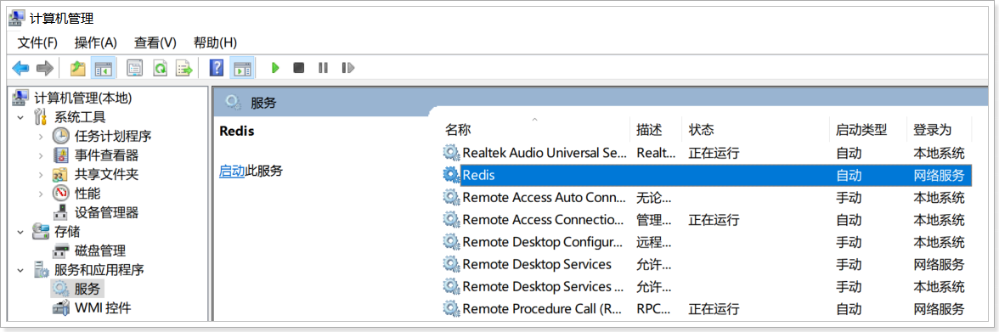

# Redis  

# 第一章-Redis基本概念和安装

## 1 Nosql概述

### 1.1 目标

- 能够理解nosql的概念

### 1.2 路径

- 什么是NOSQL
- 为什么需要NOSQL
- 主流的NOSQL产品
- NOSQL的特点

### 1.3 讲解

#### 1.3.1 什么是NOSQL

​	NoSQL(NoSQL = Not Only SQL)，意即“不仅仅是SQL”，是一项全新的数据库理念，泛指==非关系型的数据库==。

#### 1.3.2 为什么需要NOSQL

​	随着互联网的高速崛起，网站的用户群的增加，访问量的上升，传统(关系型)数据库上都开始出现了性能瓶颈，web程序不再仅仅专注在功能上，同时也在追求性能。所以NOSQL数据库应运而上，具体表现为对如下三高问题的解决：

- High performance - 对数据库高并发读写的需求 

    ​	web2.0网站要根据用户个性化信息来实时生成动态页面和提供动态信息，所以基本上无法使用动态页面静态化技术，因此数据库并发负载非常高，往往要达到每秒上万次读写请求。关系数据库应付上万次SQL查询还勉强顶得住，但是应付上万次SQL写数据请求，硬盘IO就已经无法承受了。其实对于普通的BBS网站，往往也存在对高并发写请求的需求，例如网站的实时统计在线用户状态，记录热门帖子的点击次数，投票计数等，因此这是一个相当普遍的需求。

- Huge Storage - 对海量数据的高效率存储和访问的需求 

    ​	类似Facebook，twitter，Friendfeed这样的SNS网站，每天用户产生海量的用户动态，以Friendfeed为例，一个月就达到了2.5亿条用户动态，对于关系数据库来说，在一张2.5亿条记录的表里面进行SQL查询，效率是极其低下乃至不可忍受的。再例如大型web网站的用户登录系统，例如腾讯，盛大，动辄数以亿计的帐号，关系数据库也很难应付。 

- High Scalability && High Availability- 对数据库的高可扩展性和高可用性的需求 

    ​	在基于web的架构当中，数据库是最难进行横向扩展的，当一个应用系统的用户量和访问量与日俱增的时候，你的数据库却没有办法像web server和app server那样简单的通过添加更多的硬件和服务节点来扩展性能和负载能力。对于很多需要提供24小时(007)不间断服务的网站来说，对数据库系统进行升级和扩展是非常痛苦的事情，往往需要停机维护和数据迁移，为什么数据库不能通过不断的添加服务器节点来实现扩展呢？


#### 1.3.3 主流的NOSQL产品


- 键值(Key-Value)存储数据库
- 列存储数据库(分布式)
- 文档型数据库 (Web应用与Key-Value类似，Value是结构化的）
- 图形(Graph)数据库(图结构)

user表  id name age


行存储:

​		1,张三,18,2,李四,28,... ...	


列存储:

​		1,2,张三,李四,18,28... ...


select * from 表名;	

select name from 表名;


#### 1.3.4 NOSQL的特点

​	在大数据存取上具备关系型数据库无法比拟的性能优势，例如：

- 易扩展

    ​	  NoSQL数据库种类繁多，但是一个共同的特点都是去掉关系数据库的关系型特性。数据之间无关系，这样就非常容易扩展。也无形之间，在架构的层面上带来了可扩展的能力。

- 大数据量，高性能

    ```
       NoSQL数据库都具有非常高的读写性能，尤其在大数据量下，同样表现优秀。这得益于它的无关系性，数据库的结构简单。
    ```

- 灵活的数据模型

    ​	NoSQL无需事先为要存储的数据建立字段，随时可以存储自定义的数据格式。而在关系数据库里，增删字段是一件非常麻烦的事情。如果是非常大数据量的表，增加字段简直就是一个噩梦。这点在大数据量的Web2.0时代尤其明显。

- 高可用

    ​	NoSQL在不太影响性能的情况，就可以方便的实现高可用的架构。比如Cassandra，HBase模型，通过复制模型也能实现高可用。

### 1.4 小结

1. NoSQL:  指的是非关系型数据库
2. 为什么要学习NoSQL
    - 高并发的读写
    - 提高海量数据访问效率
    - 高扩展
    - 高可用
3. 常见的NoSQl数据库?
    - Redis
    - MongDB

## 2 Redis概述

### 2.1 目标

- 知道什么是Redis以及Redis的应用场景

### 2.路径

- 什么是Redis
- redis的应用场景

### 2.3 讲解

#### 2.3.1.什么是Redis

​	Redis是用C语言开发的一个开源的高性能==键值对（key-value）数据库==，==数据是保存在内存里面的==. 官方提供测试数据，50个并发执行100000个请求,读的速度是110000次/s,写的速度是81000次/s ，且Redis通过提供多种键值数据类型来适应不同场景下的存储需求，目前为止Redis支持的键值数据类型如下： 

- 字符串类型 string
- 散列类型 hash
- 列表类型 list
- 集合类型 set
- 有序集合类型 sortedset

#### 2.3.2 redis的应用场景

- 缓存（数据查询、短连接、新闻内容、商品内容等等）
- 任务队列。（秒杀、抢购、12306等等）  
- 数据过期处理（可以精确到毫秒, 短信验证码)  
- 分布式集群架构中的session分离  session 服务器里面
- 聊天室的在线好友列表 
- 应用排行榜
- 网站访问统计


### 2.4 小结

1. Redis 以key-value 非关系型数据库,  数据保存在内存里面的, 性能特别优秀的
2. Redis的应用场景
    - 缓存
    - 任务队列
    - 过期处理


## 3 实操-window版Redis的安装与使用

### 3.1 目标

- 掌握window版Redis的安装与使用

### 3.2 路径

- windows版Redis的下载
- window版Redis的目录结构
- window版Redis的安装与启动
- 可视化Redis客户端的使用

### 3.3 讲解

#### 3.3.1 windows版Redis的下载

​	官方提倡使用Linux版的Redis，所以官网值提供了Linux版的Redis下载，我们可以从GitHub上下载window版的Redis，具体链接地址如下：

- 官网下载地址：<http://redis.io/download>

- github下载地址：https://github.com/MSOpenTech/redis/tags


在今天的课程资料中提供的下载完毕的window版本的Redis：

 

#### 3.3.2 window版Redis的目录结构

解压Redis压缩包后，见到如下目录机构：

| 目录或文件         | 作用                |
| ------------------ | ------------------- |
| redis-benchmark    | 性能测试工具        |
| redis-check-aof    | AOF文件修复工具     |
| redis-cli          | 命令行客户端        |
| redis-server       | redis服务器启动命令 |
| redis.windows.conf | redis核心配置文件   |

#### 3.3.3 window版Redis的安装与启动

  

- 安装:window版的安装及其简单，解压Redis压缩包完成即安装完毕

- 启动与关闭: 

    - 双击Redis目录中redis-server.exe可以启动redis服务，Redis服务占用的端口是6379; 

    - 关闭Redis的控制台窗口就可以关闭Redis服务

        


- 点击redis-cli    启动客户端

     


#### 3.3.4 Windows服务

安装windows服务: 

```http
redis-server.exe --service-install redis.windows.conf --loglevel verbose
```

卸载windows服务: 

```http
redis-server.exe --service-uninstall
```


检查redis服务:



启动redis:

 

 

测试:

 

#### 3.3.5 可视化Redis客户端的使用

双击安装:

 

* 连接服务器

    

    

* 打开控制台

    

### 3.4 小结

1. 解压就安装了, 解压到没有中文和空格目录下
2. 先开启服务(redis-server.exe), 再启动客户端连接(redis-cli.exe)
3. 端口: 6379

# 第二章-Redis的数据类型

## 知识点-redis中数据结构/类型

### 1.目标

- 能够说出Redis中的数据类型

### 2.路径

- Redis的数据类型类型介绍
- Redis中的key

### 3.讲解

#### 3.1 Redis的数据类型

​	redis中存储的数据是以key-value的形式存在的.其中value支持5种数据类型 .在日常开发中主要使用比较多的有字符串、哈希、字符串列表、字符串集合四种类型，其中最为常用的是字符串类型。  

​	字符串(String)  

​	哈希(hash)     

​	字符串列表(list)  

​	字符串集合(set)  

​	有序的字符串集合(sorted-set或者叫zset)

#### 3.2 key

- key不要太长(不能>1024个字节), 

- 也不要太短 .  可读性差.  

- key在项目里面最好统一写法, key的常用的写法:   

    ```
    项目名_子模块_key名称;  例如:jd_user_uname
    ```

### 4.小结

1. Redis的数据类型(面试题)
    - 字符串
    - hash(类似map)
    - List(类似LinkedList)
    - set(类似hashset)
    - zset(类似有序的set)
2. key

```http
项目名_子模块_key名称  例如:jd_user_uname
```


## 知识点-存储字符串

### 1.目标

- 能够使用redis的string操作命令

### 2.讲解

#### 2.1概述

​	string是redis最基本的类型,用的也是最多的，一个key对应一个value。 一个键最大能存储512MB。

#### 2.2常见命令

| 命令          | 描述              |
| ------------- | :---------------- |
| set key value | 设置指定 key 的值 |
| get key       | 获取指定 key 的值 |
| del key       | 删除key           |

#### 2.3.代码演示


### 3.小结

1. 后面在Java里面 可以把java对象(List,Map,JavaBean) 转成json串,  存到redis里面, 所以String是用的最多的一种类型

    ​	

## 知识点-存储hash

### 1.目标

- 能够使用redis的hash操作命令

### 2.讲解

#### 2.1.概述

​	Redis中hash 是一个**键值对集合**。 

​	Redis hash是一个string类型的field和value的映射表，hash特别适合用于存储对象。

​	Redis存储hash可以看成是String key 和String value的map容器.  也就是说把值看成map集合.

```
key     	value

user1		
			name	zhangsan
			age		18
		
user2		
			name	lisi
			age		19
```

#### 2.2.常见命令

| 命令                                        | 命令描述                                              |
| :------------------------------------------ | ----------------------------------------------------- |
| hset key filed value                        | 将哈希表 key 中的字段 field 的值设为 value            |
| hmset key field1 value1 [field2  value2]... | 同时将多个 field-value (字段-值)对设置到哈希表 key 中 |
| hget key filed                              | 获取存储在哈希表中指定字段的值                        |
| hmget key filed1 filed2                     | 获取多个给定字段的值                                  |
| hdel key filed1 [filed2]                    | 删除一个或多个哈希表字段                              |
| hlen key                                    | 获取哈希表中字段的数量                                |
| del key                                     | 删除整个hash(对象)                                    |

#### 2.3.代码演示


### 3.小结

1. value是hash, value也满足 key-value格式, 适合存对象

```
key     value
u1     name	zs
	   age  18
```

2. hdel key filed1 删除字段

    del key              删除整个hash


## 知识点-存储list 

### 1.目标

- 能够使用redis的list操作命令

### 2.讲解

#### 2.1概述

​	Redis列表按照插入顺序排序。你可以添加一个元素到列表的头部（左边）或者尾部（右边）

一个列表最多可以包含 2的32 次方- 1 个元素 (4294967295, 每个列表超过40亿个元素)。 **特点:有序**

- ArrayList

    

- 单向链表

    


- 双向链表

    

#### 2.2.常见命令

| 命令                       | 命令描述                                |
| -------------------------- | --------------------------------------- |
| lpush key value1 value2... | 将一个或多个值插入到列表头部(左边 left) |
| rpush key value1 value2... | 在列表中添加一个或多个值(右边 right)    |
| lpop key                   | 左边弹出一个 相当于移除第一个           |
| rpop key                   | 右边弹出一个  相当于移除最后一个        |
| llen key                   | 返回指定key所对应的list中元素个数       |

#### 2.3.代码演示


### 3.小结

1. List 类似链表,  有序,可以重复


## 知识点-存储set

### 1.目标

- 能够使用redis的set操作命令

### 2.讲解

#### 2.1概述

​	Redis的Set是string类型的**无序集合**。集合成员是唯一的，这就意味着集合中不能出现重复的数据。

​	Redis 中 集合是通过哈希表实现的，所以添加，删除，查找的时间复杂度都是O(1)。集合中最大的成员数为 2^32^ - 1 (4294967295, 每个集合可存储40多亿个成员)。

​	**特点:无序+唯一**   

#### 2.2.常见命令

| 命令                        | 命令描述                      |
| --------------------------- | ----------------------------- |
| sadd key member1 member2... | 向集合添加一个或多个成员      |
| srem key member1 member2... | 移除一个成员或者多个成员      |
| smembers key                | 返回集合中的所有成员,查看所有 |

#### 2.3.代码演示


### 3.小结

1. set 类似java里面的hashset 特点: 无序+唯一
2. 应用场景: 投票


# 第三章-Redis通用的操作和持久化

## 知识点-Redis通用的操作

### 1.目标

- 掌握Redis通用的操作命令

### 2.路径

- 通用操作
- 多数据库性

### 3.讲解

#### 3.1 通用操作

- keys *: 查询所有的key

- exists key:判断是否有指定的key 若有返回1,否则返回0

- expire key 秒数:设置这个key在缓存中的存活时间  

- ttl key:展示指定key的剩余时间

    ​	若返回值为 -1:永不过期

    ​	若返回值为 -2:已过期或者不存在

- del key:删除指定key

- rename key 新key:重命名

- type key:判断一个key的类型

- ping :测试连接是否连接


#### 3.2 多数据库性

​	redis默认是16个数据库, 编号是从0~15.

- select index:切换库
- move key index: 把key移动到几号库(index是库的编号)
- flushdb: 清空当前数据库
- flushall: 清空当前实例下所有的数据库


### 4.小结

1. redis有16个库, 默认在0号库. 可以通过select index 进行切换. 多数据库


## 知识点-Redis的持久化

### 1.目标

​	Redis的高性能是由于其将所有数据都存储在了内存中，为了使Redis在重启之后仍能保证数据不丢失，需要将数据从内存中同步到硬盘中，这一过程就是持久化。Redis支持两种方式的持久化，一种是RDB方式，一种是AOF方式。可以单独使用其中一种或将二者结合使用。

### 2.路径

- RDB持久化机制
- AOF持久化机制
- 两种持久化机制比较

### 3.讲解

#### 3.1RDB持久化机制

##### 3.1.1概述

​	RDB持久化是指在**指定的时间间隔内**将内存中的数据集 快照 写入磁盘。这种方式是就是将内存中数据以快照的方式写入到二进制文件中,默认的文件名为dump.rdb。 ==这种方式是默认已经开启了,不需要配置.==

##### 3.1.2 RDB持久化机制的配置

- 在redis.windows.conf配置文件中有如下配置：


其中，上面配置的是RDB方式数据持久化时机：

| 关键字 | 时间(秒) | key修改数量 | 解释                                                  |
| ------ | -------- | ----------- | ----------------------------------------------------- |
| save   | 900      | 1           | 每900秒(15分钟)至少有1个key发生变化，则dump内存快照   |
| save   | 300      | 10          | 每300秒(5分钟)至少有10个key发生变化，则dump内存快照   |
| save   | 60       | 10000       | 每60秒(1分钟)至少有10000个key发生变化，则dump内存快照 |

#### 3.2 AOF持久化机制

##### 3.2.1概述

​	 AOF持久化机制会将==每一个收到的写命令==都通过write函数追加到文件中,默认的文件名是appendonly.aof。 这种方式默认是没有开启的,要使用时候需要配置.

##### 3.2.2AOF持久化机制配置

###### 3.2.2.1开启配置

- 在redis.windows.conf配置文件中有如下配置：


- 将appendonly修改为yes， 但是启动redis的时候需要指定该文件,也就是意味着不能直接点击了, 需要输入命令启动: `redis-server.exe redis.windows.conf`


- 开启aof持久化机制后，默认会在目录下产生一个appendonly.aof文件


###### 3.2.2.2配置详解

- 下面配置为aof持久化的时机，解释如下：(在redis.windows.conf配置)


| 关键字      | 持久化时机 | 解释                           |
| ----------- | ---------- | ------------------------------ |
| appendfsync | always     | 每执行一次更新命令，持久化一次 |
| appendfsync | everysec   | 每秒钟持久化一次               |
| appendfsync | no         | 不持久化                       |

### 4,小结

#### 4.1RDB持久化机制

##### 优点

- RDB 是一个非常紧凑（compact）的文件，它保存了 Redis 在某个时间点上的数据集。 这种文件非常适合用于进行备份
- ==RDB 在恢复大数据集时的速度比 AOF 的恢复速度要快(因为其文件要比AOF的小)==
- ==RDB的性能要比AOF更好==

##### 缺点

- ==RDB的持久化不够及时,可能会存在数据丢失==
- RDB持久化时如果文件过大可能会造成服务器的阻塞,停止客户端请求

#### 4.2AOF持久化机制

##### 优点

- ==AOF的持久性更加的耐久(可以每秒 或 每次操作保存一次)==
- AOF 文件有序地保存了对数据库执行的所有写入操作， 这些写入操作以 Redis 协议的格式保存， ==因此 AOF 文件的内容非常容易被人读懂， 对文件进行分析（parse）也很轻松。==
- AOF是增量操作

##### 缺点

- ==对于相同的数据集来说，AOF 文件的体积通常要大于 RDB 文件的体积==
- 根据所使用的 fsync 策略，==AOF 的速度可能会慢于 RDB.==

#### 4.3选择

- 如果你非常关心你的数据， 但仍然可以承受数分钟以内的数据丢失，选择RDB 持久化。
- 如果对数据的完整性要求比较高, 选择AOF  

# 第四章-Jedis  

java redis

jedis

## 知识点-jedis的基本使用

### 1.目标

- 掌握什么是Jedis

### 2.路径

- jedis的介绍
- Jedis的使用步骤
- Jedis的入门
- Jedis连接池的使用

### 3.讲解

#### 3.1 jedis的介绍

​	Redis不仅是使用命令来操作，现在基本上主流的语言都有客户端支持，比如java、C、C#、C++、php、Node.js、Go等。 在官方网站里列一些Java的客户端，有Jedis、Redisson、Jredis、JDBC-Redis、等其中官方推荐使用Jedis和Redisson。 在企业中用的最多的就是Jedis，Jedis同样也是托管在github上，地址：https://github.com/xetorthio/jedis。

​	Jedis就是使用Java操作Redis的客户端(jar包)


​	

文档地址:http://xetorthio.github.io/jedis/

- 官方API文档查询方式：


#### 3.2 Jedis的使用步骤

1. 导入jar

     

2. 创建jedis对象

3. 操作redis

4. 释放资源

#### 3.3.Jedis的入门

需求: 使用java代码操作Redis 进行增删查

- 基本操作

```java
	@Test
	// 不使用池子,直接操作
	public void fun01() {

		// 1. 创建Jedis对象 new, 看静态方法
		String host = "localhost";
		int port = 6379;
		Jedis jedis = new Jedis(host, port);//jedis就相当于JDBC里面的connection

		// 2. 操作redis数据库 
		//2.1 存  set key value
		//jedis.set("bkey", "哈哈哈");
		//2.2取  get key
		//System.out.println(jedis.get("akey"));
		//2.3 删 除 del key
		jedis.del("akey");
		System.out.println(jedis.get("akey"));
		
		// 3. 释放资源
		jedis.close();

	}
```

#### 3.4 jedis连接池的使用

##### 3.4.1 jedis连接池的基本概念

​	jedis连接资源的创建与销毁是很消耗程序性能，所以jedis为我们提供了jedis的池化技术，jedisPool在创建时初始化一些连接资源存储到连接池中，使用jedis连接资源时不需要创建，而是从连接池中获取一个资源进行redis的操作，使用完毕后，不需要销毁该jedis连接资源，而是将该资源归还给连接池，供其他请求使用。

##### 3.4.2jedis连接池的使用

需求: 从Jedis的连接池里面获得jedis

步骤:

1. 创建池子配置对象 `JedisPoolConfig`

2. 创建池子对象(需要配置对象) `JedisPool(poolConfig, host, port)`

3. 从池子里面取出jedis `getResource()`

4. 操作redis

    | 方法                  | 解释                                                         |
    | --------------------- | ------------------------------------------------------------ |
    | new Jedis(host, port) | 创建jedis对象，参数host是redis服务器地址，参数port是redis服务端口 |
    | set(key,value)        | 设置字符串类型的数据                                         |
    | get(key)              | 获得字符串类型的数据                                         |
    | hset(key,field,value) | 设置哈希类型的数据                                           |
    | hget(key,field)       | 获得哈希类型的数据                                           |
    | lpush(key,values)     | 设置列表类型的数据                                           |
    | lpop(key)             | 列表左面弹栈                                                 |
    | rpop(key)             | 列表右面弹栈                                                 |
    | del(key)              | 删除指定的key                                                |

5. 释放资源 `close()`


- 基本使用

```java
package cn.itcast;

import org.apache.commons.pool2.impl.GenericObjectPoolConfig;
import org.junit.Test;
import redis.clients.jedis.Jedis;
import redis.clients.jedis.JedisPool;
import redis.clients.jedis.JedisPoolConfig;
import redis.clients.jedis.exceptions.JedisException;

import java.util.HashMap;
import java.util.List;
import java.util.Map;
import java.util.Set;

public class testJedisTest {
    @Test
    public void testString() {
        // 1 创建对象
        String host = "127.0.0.1";
        int port = 6379;

        Jedis jedis = new Jedis(host, port);
        // 2 操作 字符串
        // 增
        jedis.set("day18_user_username", "张三");

        // 查
        String day18_user_username = jedis.get("day18_user_username");
        System.out.println(day18_user_username);

        // 删
        jedis.del("day18_user_username");

        // 3 释放资源
        jedis.close();
    }

    @Test
    public void testList() {
        // 1 创建对象
        String host = "127.0.0.1";
        int port = 6379;

        Jedis jedis = new Jedis(host, port);
        // 2 操作
        // 增
        // jedis.rpush("day18_list_users", "张三", "李四", "王五");

        // 查
        /*
        List<String> userList = jedis.lrange("day18_list_users", 0, -1);
        for (String user : userList) {
            System.out.println(user);
        }
        */

        // 删除集合的元素
        //String user = jedis.lpop("day18_list_users");
        //System.out.println(user);

        // 删除集合
        jedis.del("day18_list_users");

        // 3 释放资源
        jedis.close();
    }

    @Test
    public void testSet() {
        // 1 创建对象
        String host = "127.0.0.1";
        int port = 6379;

        Jedis jedis = new Jedis(host, port);
        // 2 操作
        // 增
        //jedis.sadd("day18_set_users", "张三", "李四", "王五");

        // 查
        /*
        Set<String> day18_set_users = jedis.smembers("day18_set_users");
        for (String day18_set_user : day18_set_users) {
            System.out.println(day18_set_user);
        }
        */

        // 删除集合的元素
        jedis.srem("day18_set_users","张三");

        // 3 释放资源
        jedis.close();
    }

    @Test
    public void testHash() {
        // 1 创建对象
        String host = "127.0.0.1";
        int port = 6379;

        Jedis jedis = new Jedis(host, port);
        // 2 操作
        // 增
        /*
        HashMap<String, String> hashMap = new HashMap<String, String>();
        hashMap.put("key1", "val1");
        hashMap.put("key2", "val2");
        hashMap.put("key3", "val3");
        jedis.hmset("day18_hash_users", hashMap);

        jedis.hset("day18_hash_user", "key4", "val4");
        */

        // 查
        /*
        Map<String, String> day18_hash_users = jedis.hgetAll("day18_hash_users");
        for(String key : day18_hash_users.keySet()) {
            String val = day18_hash_users.get(key);
            System.out.println(key + " === " + val);
        }

        String val1 = jedis.hget("day18_hash_users", "key1");
        System.out.println(val1);

         */


        // 删除集合的元素
        jedis.hdel("day18_hash_users", "key1");

        // 3 释放资源
        jedis.close();
    }

    @Test
    public void testString2() {
        // 1 创建对象
        String host = "127.0.0.1";
        int port = 6379;

        JedisPoolConfig jedisPoolConfig = new JedisPoolConfig();
        jedisPoolConfig.setMaxTotal(10);

        JedisPool jedisPool = new JedisPool(jedisPoolConfig, host, port);

        Jedis jedis = jedisPool.getResource();

        // 2 操作 字符串
        // 增
        jedis.set("day18_user_username", "张三");

        // 查
        String day18_user_username = jedis.get("day18_user_username");
        System.out.println(day18_user_username);

        // 删
        jedis.del("day18_user_username");

        // 3 释放资源
        jedis.close();
    }

    @Test
    public void testString3() {
        // 1 创建对象
        Jedis jedis = JedisUtils.getResource();

        // 2 操作 字符串
        // 增
        jedis.set("day18_user_username", "张三");

        // 查
        String day18_user_username = jedis.get("day18_user_username");
        System.out.println(day18_user_username);

        // 删
        jedis.del("day18_user_username");

        // 3 释放资源
        jedis.close();
    }

}
```

- Jedis工具类的抽取(使用连接池)

```java
package cn.itcast;

import redis.clients.jedis.Jedis;
import redis.clients.jedis.JedisPool;
import redis.clients.jedis.JedisPoolConfig;

public class JedisUtils {
    private static JedisPool jedisPool;

    static {
        String host = "127.0.0.1";
        int port = 6379;

        JedisPoolConfig jedisPoolConfig = new JedisPoolConfig();
        jedisPoolConfig.setMaxTotal(10);

        jedisPool = new JedisPool(jedisPoolConfig, host, port);
    }

    private JedisUtils() {}
    
    public static Jedis getResource() {
        return jedisPool.getResource();
    }
}
```


### 4.小结

1. Jedis是Java操作Redis客户端(jar)
2. Jedis的使用步骤
    - 从池子里面获得jedis(池子封装成了工具类)
    - 操作Redis
    - 释放资源
3. 方法

| 方法                  | 解释                                                         |
| --------------------- | ------------------------------------------------------------ |
| new Jedis(host, port) | 创建jedis对象，参数host是redis服务器地址，参数port是redis服务端口 |
| set(key,value)        | 设置字符串类型的数据                                         |
| get(key)              | 获得字符串类型的数据                                         |
| hset(key,field,value) | 设置哈希类型的数据                                           |
| hget(key,field)       | 获得哈希类型的数据                                           |
| lpush(key,values)     | 设置列表类型的数据                                           |
| lpop(key)             | 列表左面弹栈                                                 |
| rpop(key)             | 列表右面弹栈                                                 |
| del(key)              | 删除指定的key                                                |


