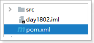
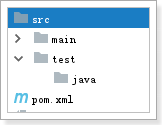
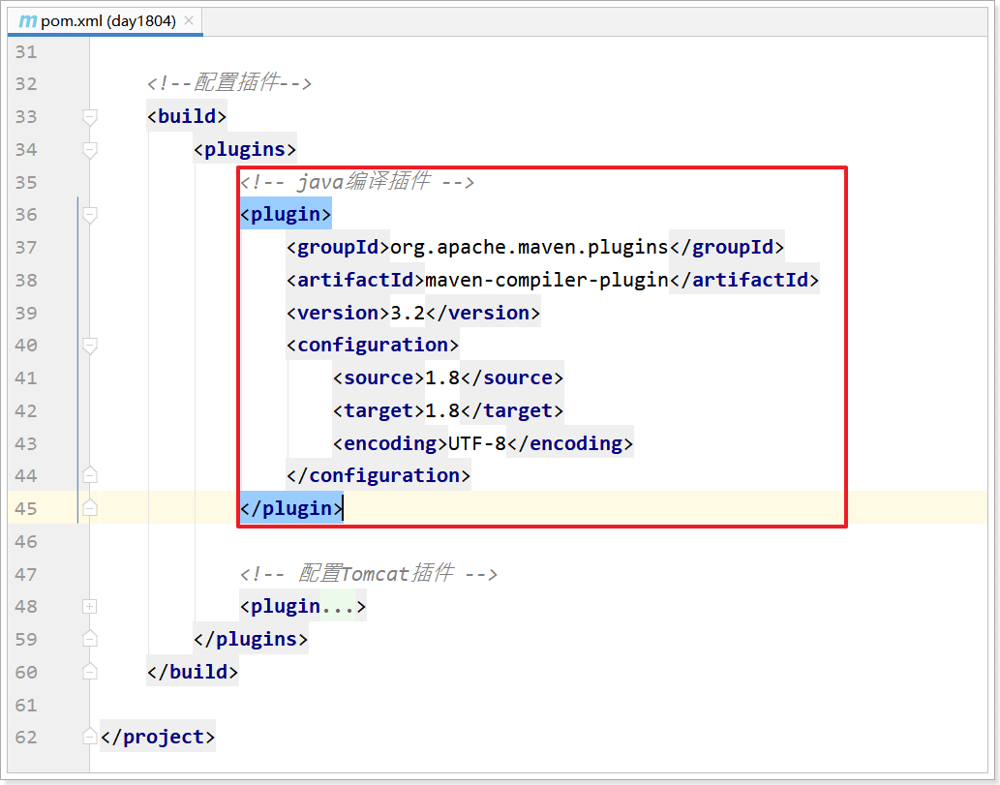
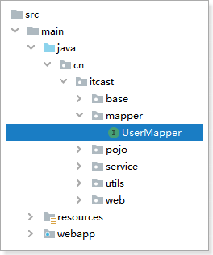
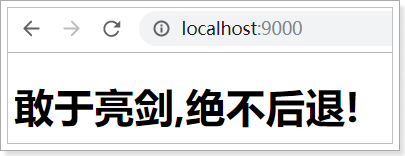

# 第一章 Maven概述

```
擅长管理大型项目
自动管理你需要的jar包
自动进行下载我们需要的jar包。
```

## 1 maven的概念

​		Maven是项目进行模型抽象，充分运用面向对象的思想，Maven可以通过一小段描述信息来管理项目的构建，报告和文档的软件项目管理工具。Maven 除了以程序构建能力为特色之外，还提供高级项目管理工具。由于 Maven 的缺省构建规则有较高的可重用性，所以常常用两三行 Maven 构建脚本就可以构建简单的项目。

说白了: ==Maven是由Apache开发的一个工具。==用来管理java项目, 依赖管理(jar包的管理)，项目构建.

## 2 Maven的作用

- 依赖管理: maven对项目的第三方构件（jar包）进行统一管理。向工程中加入jar包不要手工从其它地方拷贝，通过maven定义jar包的坐标，自动从maven仓库中去下载到工程中。

- 项目构建: maven提供一套对项目生命周期管理的标准，开发人员、和测试人员统一使用maven进行项目构建。项目生命周期管理：编译、测试、打包、部署、运行。
- maven对工程分模块构建，提高开发效率。

## 3 Maven的概念模型


## 4 Maven的仓库

#### 4.1 Maven的仓库

|    仓库名称    | 作用                                                         |
| :------------: | ------------------------------------------------------------ |
|    本地仓库    | 相当于缓存，工程第一次会从远程仓库（互联网）去下载jar 包，将jar包存在本地仓库（在程序员的电脑上）。第二次不需要从远程仓库去下载。先从本地仓库找，如果找不到才会去远程仓库找。 |
|    中央仓库    | 就是远程仓库，仓库中jar由专业团队（maven团队）统一维护。中央仓库的地址：http://repo1.maven.org/maven2/ |
| 远程仓库(私服) | 私服是一种特殊的远程仓库，它是架设在局域网内的仓库服务，私服代理广域网上的远程仓库，供局域网内的Maven用户使用。当Maven须要下载构件的时候。它从私服请求，假设私服上不存在该构件，则从外部的远程仓库下载，缓存在私服上之后，再为Maven的下载请求提供服务。 |


### 4.2 仓库中存放的内容

- Maven自身运行所需要的插件
- 第三方框架(spring/mybatis/springmvc)和工具类的jar包
- 我们自己开发的maven项目安装后的jar包

## 5 maven的坐标

​		Maven的一个核心的作用就是管理项目的依赖，引入我们所需的各种jar包等。在Maven中，不论什么一个依赖、插件或者项目构建的输出, 都能够称之为==构件==。

​		为了能自动化的解析任何一个Java构件. Maven必须将这些Jar包或者其他资源进行唯一标识，这是管理项目的依赖的基础，也就是我们要说的==坐标==。

​		包括我们自己开发的项目，也是要通过坐标进行唯一标识的，这样才能才其它项目中进行依赖引用。坐标的定义元素如下：

- groupId:项目组织唯一的标识符，实际对应JAVA的包的结构 
    - (一般写公司的组织名称 例如:com.itheima,com.alibaba)
- artifactId: 项目的名称
- version：定义项目的当前版本 

例如：要引入druid的jar包，只需要在pom.xml配置文件中配置引入druid的坐标即可：

```xml
<!--druid连接池-->
<dependency>
  <groupId>com.alibaba</groupId>
  <artifactId>druid</artifactId>  
  <version>1.1.10</version>  
</dependency>
```

# 第二章 maven的安装(软件)

## 1 下载maven

  

## 2 安装maven

将maven压缩包解压, 复制到**没有中文没有空格的目录下**,即安装完毕


## 3 maven的目录介绍

| 目录名 | 作用               |
| ------ | ------------------ |
| bin    | 可执行指令         |
| boot   | 第三方类的加载框架 |
| conf   | 配置文件目录       |
| lib    | maven自身的类库    |

## 4 配置环境变量


```
MAVEN_HOME=D:\01_install\03_kaifa\apache-maven-3.6.1
Path=%MAVEN_HOME%\bin;... ...
```

 

## 5 配置本地仓库

```http
1、找到Maven解压目录\conf\settings.xml 
2、在setting.xml 文件中找到 localRepository 标签 
3、将 <localRepository>/path/to/local/repo</localRepository>从注释中取出 
4、将标签体内容修改为自定义的Maven仓库目录
```

### 2.5.1 将/资料/本地仓库/xxx.zip 解压 

复制到 ==没有中文和空格== 目录下

 

### 2.5.2 配置本地仓库

在maven的安装目录中 maven/conf/settings.xml 配置本地仓库:


```xml
<settings xmlns="http://maven.apache.org/SETTINGS/1.0.0"
          xmlns:xsi="http://www.w3.org/2001/XMLSchema-instance"
          xsi:schemaLocation="http://maven.apache.org/SETTINGS/1.0.0 http://maven.apache.org/xsd/settings-1.0.0.xsd">
		  
	<localRepository>D:\01_install\03_kaifa\repository_maven</localRepository>
```

### 2.5.3 配置阿里云远程仓库 (扩展)


```xml
  <mirrors>
	<mirror>
		<id>alimaven</id>
		<name>aliyun maven</name>
		<url>http://maven.aliyun.com/nexus/content/groups/public/</url>
		<mirrorOf>central</mirrorOf>        
	 </mirror>
  </mirrors>
```

## 6 测试maven安装成功

打开cmd本地控制台, 输入 

```shell
mvn -version
```

 

## 7 小结

1. Maven工具安装包 和 本地仓库解压到一个==没有中文没有空格==目录下.  建议分两个文件夹

2. 配置Maven的时候(必须MAVEN_HOME)
    1. MAVEN_HOME: 配置到Maven工具解压目录
    2. path: 配置到Maven工具解压之后里面的bin目录

# 第三章 IDEA整合本地Maven

## 1 配置maven环境

方式一:

 

方式二

 

 

## 2 问题: 解决创建工程缓慢

==因为 联网 下载内容, 所以 导致创建工程缓慢==

```http
-DarchetypeCatalog=internal
```


# 第四章 idea创建maven工程(重点重点重点)

## 1 创建空的工程

 


 

 

## 2 创建跳过骨架的java项目

### 2.1 how

 

 

 

 

 

| 目录      | 作用             |
| --------- | ---------------- |
| main/java | 存放java代码     |
| resources | 存放配置文件的   |
| test/java | 存放测试java代码 |

 


### 2.2 创建java代码

  

```java
package cn.itcast;

public class ProductDao {
    public void add() {
        System.out.println("1 添加商品 ... ...");
    }

    public void del() {
        System.out.println("2 删除商品 ... ...");
    }

    public void update() {
        System.out.println("3 修改商品 ... ...");
    }

    public void queryAll() {
        System.out.println("4 查询所有商品 ... ...");
    }
}
```

### 2.3 生成测试代码

正式上线前, 每个方法都必须经过测试, 目前我们能够想到的就是main方法. 

因为一个类只有一个main方法, 一个类可能有上千个方法, 那得需要多少个方法, 所以 迫切需要更高效方法, junit测试登场了.

 

  

  


 

为什么junit报红? 因为缺少junit包, 导入缺少的junit包即可.

### 2.4 导入依赖

  

```xml
<?xml version="1.0" encoding="UTF-8"?>
<project xmlns="http://maven.apache.org/POM/4.0.0"
         xmlns:xsi="http://www.w3.org/2001/XMLSchema-instance"
         xsi:schemaLocation="http://maven.apache.org/POM/4.0.0 http://maven.apache.org/xsd/maven-4.0.0.xsd">
    <modelVersion>4.0.0</modelVersion>

    <groupId>cn.itcast</groupId>
    <artifactId>day1801</artifactId>
    <version>1.0-SNAPSHOT</version>

    <dependencies>
        <!--导入junit包-->
        <dependency>
            <groupId>junit</groupId>
            <artifactId>junit</artifactId>
            <version>4.12</version>
        </dependency>
    </dependencies>
</project>
```

报红解决:

  

### 2.5 一个一个测试

完成测试代码:

```java
package cn.itcast;

import org.junit.Test;

public class ProductDaoTest {

    private ProductDao productDao = new ProductDao();

    @Test
    public void add() {
        productDao.add();
    }

    @Test
    public void del() {
        productDao.del();
    }

    @Test
    public void update() {
        productDao.update();
    }

    @Test
    public void queryAll() {
        productDao.queryAll();
    }
}   
```

### 2.6 测试所有

一个一个测试,太累了, 给大家介绍一个简单的.

  

## 3 创建有骨架 java工程(了解)

### 3.1 how?


 

==* 缺少 resources目录 补上== 

 

==pom.xml中会产生很多多余的配置==

 

总结: 因为创建有骨架的java工程会产生很多多余的配置, 所以实际开发中一般不用.

## 4 创建有骨架的web工程(了解)

### 4.1 how?

 


 

### 4.2 标准web工程目录结构

 

经过对比发现如下问题:

### 4.3 缺少java目录

 

 

 

更改java目录属性

 

 

### 4.4 缺少resources目录

 

 

 

 

### 4.5 缺少test目录

#### 4.5.1 新建test目录

 

 

 

#### 4.5.2 新建test.java目录

 

 

 

 

```http
总结: 使用骨架创建的web项目 在开发时不常用!
	理由1: 在pom.xml增加不必要的配置
	理由2: 完整的web工程缺的东西太多!
```

## 5 创建跳过骨架的web工程(重点重点重点)

### 5.1 创建无骨架的java工程


 

修改打包方式


==标准web项目的目录结构==

 

### 5.2 问题: 缺少webapp 目录


### 5.3 问题: 缺少 web.xml


 

### 5.4 tomcat插件

#### 5.4.1 在pom.xml中配置

因为 web项目最终跑在web服务器中, 所以需要配置 web服务器(tomcat只是其中一个)

pom.xml

```xml
<?xml version="1.0" encoding="UTF-8"?>
<project xmlns="http://maven.apache.org/POM/4.0.0"
         xmlns:xsi="http://www.w3.org/2001/XMLSchema-instance"
         xsi:schemaLocation="http://maven.apache.org/POM/4.0.0 http://maven.apache.org/xsd/maven-4.0.0.xsd">
    <modelVersion>4.0.0</modelVersion>

    <groupId>cn.itcast.maven</groupId>
    <artifactId>web02</artifactId>
    <version>1.0-SNAPSHOT</version>
    <!--
        java工程: jar 含义是 java rar
        web工程: war 含义是 web rar
    -->
    <packaging>war</packaging>
    <!--配置插件-->
    <build>
        <plugins>
            <!-- 配置Tomcat插件 -->
            <plugin>
                <groupId>org.apache.tomcat.maven</groupId>
                <artifactId>tomcat7-maven-plugin</artifactId>
                <version>2.2</version>
                <configuration>
                    <!--配置端口号-->
                    <port>80</port>
                    <!--配置项目路径-->
                    <path>/day1804</path>
                </configuration>
            </plugin>
        </plugins>
    </build>
</project>
```

#### 5.4.2 准备index.html

 

```html
<!DOCTYPE html>
<html lang="en">
<head>
    <meta charset="UTF-8">
    <title>Title</title>
</head>
<body>
    <h1>这是我的第一个maven版本的web项目!</h1>
</body>
</html>
```

#### 5.4.3 启动tomcat

 

  

测试:

  

#### 5.4.4 简化启动tomcat

 

 


 

#### 4.6.3 创建servlet


 


##### 4.6.3.1 解决servlet因为缺少servlet.jar包报错

==在pom.xml增加servlet依赖==


```xml
<?xml version="1.0" encoding="UTF-8"?>
<project xmlns="http://maven.apache.org/POM/4.0.0"
         xmlns:xsi="http://www.w3.org/2001/XMLSchema-instance"
         xsi:schemaLocation="http://maven.apache.org/POM/4.0.0 http://maven.apache.org/xsd/maven-4.0.0.xsd">
    <modelVersion>4.0.0</modelVersion>

    <groupId>cn.itcast</groupId>
    <artifactId>day1804</artifactId>
    <version>1.0-SNAPSHOT</version>

    <!--修改web项目的打包方式-->
    <packaging>war</packaging>

    <dependencies>

        <!--引入servlet依赖-->
        <dependency>
            <groupId>javax.servlet</groupId>
            <artifactId>javax.servlet-api</artifactId>
            <version>3.1.0</version>
            <!--只在测试和编译时有效-->
            <scope>provided</scope>
        </dependency>

    </dependencies>

    <!--配置插件-->
    <build>
        <plugins>
            <!-- 配置Tomcat插件 -->
            <plugin>
                <groupId>org.apache.tomcat.maven</groupId>
                <artifactId>tomcat7-maven-plugin</artifactId>
                <version>2.2</version>
                <configuration>
                    <!--配置端口号-->
                    <port>80</port>
                    <!--配置项目路径-->
                    <path>/day1804</path>
                </configuration>
            </plugin>
        </plugins>
    </build>

</project>
```

经过观察,servlet不再报错

 

测试:

  

# 第五章 maven的常用指令


## 1 clean命令


### 1.1 方式一 

 

 

==发现 target目录 被 清除了==

 

### 1.2 方式二

 

 

 

 

执行清屏命令:


经过观察发现target目录消失:

 

## 2 compile命令

 

 

## 3 test命令

测试命令: 执行 src/test/java 下junit的测试用例

* 准备工作1: 业务类

    ```java
    package cn.itcast.service;
    
    public class UserService {
    
        public void add() {
            System.out.println("=============1 UserService.add 天生傲娇 ... ...");
        }
    
        public void queryAll() {
            System.out.println("=============2 UserService.queryAll ... ...");
        }
    }
    ```

* 准备工作2: 测试类

    ```java
    package cn.itcast.service;
    
    import org.junit.Test;
    
    public class UserServiceTest {
    
        private UserService userService = new UserService();
        @Test
        public void add() {
            userService.add();
        }
    
        @Test
        public void queryAll() {
            userService.queryAll();
        }
    }
    ```

* 测试:

    


## 4 package命令

mvn package, 打包项目

### 4.1 对java项目打包


### 4.2 对web项目打包


## 5 install命令

mvn install, 打包后将其安装在本地仓库


安装完毕后,可以在本地仓库中找到 对应的项目


# 第六章 依赖管理

## 1 maven插件


### 1.1 jdk编译版本的插件

pom.xml



```xml
            <!-- java编译插件 -->
            <plugin>
                <groupId>org.apache.maven.plugins</groupId>
                <artifactId>maven-compiler-plugin</artifactId>
                <version>3.2</version>
                <configuration>
                    <source>1.8</source>
                    <target>1.8</target>
                    <encoding>UTF-8</encoding>
                </configuration>
            </plugin>
```

 


### 1.2 tomcat7服务端的插件

- **配置tomcat插件**

```xml
<!-- 配置Tomcat插件 -->
<plugin>
    <groupId>org.apache.tomcat.maven</groupId>
    <artifactId>tomcat7-maven-plugin</artifactId>
    <version>2.2</version>
    <configuration>
        <!--配置端口号-->
        <port>80</port>
        <!--配置项目路径-->
        <path>/day1804</path>
    </configuration>
</plugin>
```

- **运行tomcat插件**

    - 方式一

        

         

    - 方式二

         

- **tomcat 插件注意问题**

    Maven的中央仓库中只有tomcat7.X版本

    如果想使用tomcat8.X版本, 

    1. 需要从第三方仓库查找
        2. 或者使用idea集成外部的tomcat插件

## 2 导入依赖

### 2.1 导入junit依赖

- **导入junit坐标**

```xml
<dependencies>
    <dependency>
        <groupId>junit</groupId>
        <artifactId>junit</artifactId>
        <version>4.12</version>
    </dependency>
</dependencies>
```

 

- **进行单元测试**

```java
import org.junit.Test;

public class DemoTest {
    @Test
    public void demo1() {
        System.out.println("敢于亮剑,绝不后退!");
    }
}

```


### 2.2 导入servlet的依赖

- **创建servlet, 但是发现报错,原因是没有导入servlet的坐标依赖**


- **导入servlet的坐标依赖**

```xml
<!-- https://mvnrepository.com/artifact/javax.servlet/javax.servlet-api -->
<dependency>
    <groupId>javax.servlet</groupId>
    <artifactId>javax.servlet-api</artifactId>
    <version>3.1.0</version>
    <scope>provided</scope>
</dependency>
```

- **原有的servlet报错恢复正常**


## 3 依赖范围

 


 

# 第七章 maven案例: 完成用户列表显示功能

## 1 需求分析


## 2 准备工作

### 2.1 sql语句

```sql
create database day18_db;

use day18_db;

create table user(
	id int primary key auto_increment,
	name varchar(50),
	money int
);

insert into user(id, name, money) values(null, '张三', 1000);
insert into user(id, name, money) values(null, '李四', 1000);
insert into user(id, name, money) values(null, '王五', 1000);
```

### 2.2 创建项目(跳过骨架的java项目)


### 2.3 添加webapp目录 和 web.xml文件


 

### 2.4 导包(pom.xml)

```xml
<?xml version="1.0" encoding="UTF-8"?>
<project xmlns:xsi="http://www.w3.org/2001/XMLSchema-instance"
         xmlns="http://maven.apache.org/POM/4.0.0"
         xsi:schemaLocation="http://maven.apache.org/POM/4.0.0 http://maven.apache.org/xsd/maven-4.0.0.xsd">
    <modelVersion>4.0.0</modelVersion>

    <groupId>cn.itcast</groupId>
    <artifactId>day1805</artifactId>
    <version>1.0-SNAPSHOT</version>
    
    <!--因为当前项目是web项目, 所以设置为 war-->
    <packaging>war</packaging>

    <!-- 1 导入依赖-->
    <dependencies>
        <!--servlet-->
        <dependency>
            <groupId>javax.servlet</groupId>
            <artifactId>javax.servlet-api</artifactId>
            <version>3.1.0</version>
            <scope>provided</scope>
        </dependency>

        <!--junit测试-->
        <dependency>
            <groupId>junit</groupId>
            <artifactId>junit</artifactId>
            <version>4.12</version>
            <scope>test</scope>
        </dependency>

        <!--mysql-->
        <dependency>
            <groupId>mysql</groupId>
            <artifactId>mysql-connector-java</artifactId>
            <version>5.1.38</version>
        </dependency>

        <!-- Mybatis -->
        <dependency>
            <groupId>org.mybatis</groupId>
            <artifactId>mybatis</artifactId>
            <version>3.4.5</version>
        </dependency>

        <!--日志-->
        <dependency>
            <groupId>org.slf4j</groupId>
            <artifactId>slf4j-log4j12</artifactId>
            <version>1.6.4</version>
        </dependency>

        <!--jackson -->
        <dependency>
            <groupId>com.fasterxml.jackson.core</groupId>
            <artifactId>jackson-databind</artifactId>
            <version>2.4.2</version>
        </dependency>

    </dependencies>

    <!-- 2 配置插件-->
    <build>
        <plugins>
            <!-- java编译插件 -->
            <plugin>
                <groupId>org.apache.maven.plugins</groupId>
                <artifactId>maven-compiler-plugin</artifactId>
                <version>3.2</version>
                <configuration>
                    <source>1.8</source>
                    <target>1.8</target>
                    <encoding>UTF-8</encoding>
                </configuration>
            </plugin>

            <!-- 配置Tomcat插件 -->
            <plugin>
                <groupId>org.apache.tomcat.maven</groupId>
                <artifactId>tomcat7-maven-plugin</artifactId>
                <version>2.2</version>
                <configuration>
                    <!--配置端口号-->
                    <port>9000</port>
                    <!--配置项目路径-->
                    <path>/day1805</path>
                </configuration>
            </plugin>
        </plugins>
    </build>

</project>
```

## 3 实现

### 3.1 数据层

#### 3.1.1 接口

 

```java
package cn.itcast.mapper;

import cn.itcast.pojo.User;

import java.util.List;

public interface UserMapper {

    /*查询所有*/
    public List<User> queryAll();

}
```

#### 3.1.2 配置文件

 

```xml
<?xml version="1.0" encoding="UTF-8" ?>
<!DOCTYPE mapper
        PUBLIC "-//mybatis.org//DTD Mapper 3.0//EN"
        "http://mybatis.org/dtd/mybatis-3-mapper.dtd">
<mapper namespace="cn.itcast.mapper.UserMapper">
    <!--查询所有用户-->
    <select id="queryAll" resultType="User">
        select * from tb_user
    </select>
</mapper>
```

### 3.2 业务层

 

#### 3.2.1 接口

```java
package cn.itcast.service;

import cn.itcast.pojo.User;

import java.util.List;

public interface UserService {
    /**
     * 查询所有
     */
    public List<User> queryAll();
}
```

#### 3.2.2 实现类

```java
package cn.itcast.service.impl;

import cn.itcast.base.BaseService;
import cn.itcast.mapper.UserMapper;
import cn.itcast.pojo.User;
import cn.itcast.service.UserService;
import org.apache.ibatis.session.SqlSession;

import java.util.List;

public class UserServiceImpl extends BaseService implements UserService {
    @Override
    public List<User> queryAll() {
        SqlSession sqlSession = getSession();
        UserMapper userMapper = getDao(sqlSession, UserMapper.class);
        List<User> userList = null;
        try {
            userList = userMapper.queryAll();
            commitAndCloseSession(sqlSession);
        } catch (Exception e) {
            e.printStackTrace();
            rollbackAndCloseSession(sqlSession);
        }
        return userList;
    }
}
```

#### 3.2.3 测试

 

```java
package cn.itcast.service;

import cn.itcast.pojo.User;
import cn.itcast.service.impl.UserServiceImpl;
import org.junit.Test;

import java.util.List;

public class UserServiceTest {

    @Test
    public void queryAll() {
        UserService userService = new UserServiceImpl();
        List<User> userList = userService.queryAll();
        for (User user : userList) {
            System.out.println(user);
        }
    }
}
```

### 3.3 web层

#### 3.3.1 代码

 

```java
package cn.itcast.web;

import cn.itcast.pojo.User;
import cn.itcast.service.UserService;
import cn.itcast.service.impl.UserServiceImpl;
import com.fasterxml.jackson.databind.ObjectMapper;

import javax.servlet.ServletException;
import javax.servlet.annotation.WebServlet;
import javax.servlet.http.HttpServlet;
import javax.servlet.http.HttpServletRequest;
import javax.servlet.http.HttpServletResponse;
import java.io.IOException;
import java.util.List;

@WebServlet("/userQueryAll")
public class UserQueryAllServlet extends HttpServlet {
    @Override
    protected void doPost(HttpServletRequest request, HttpServletResponse response) throws ServletException, IOException {
        // 解决获取参数的中文乱码 (浏览器 -> 服务器)
        request.setCharacterEncoding("utf-8");
        // 解决浏览器出现的中文乱码
        response.setContentType("text/html;charset=utf-8");

        // 1 调用业务层 查询所有用户
        UserService userService = new UserServiceImpl();
        List<User> userList = userService.queryAll();
        // 2 将所用用户集合 转成json字符串
        ObjectMapper objectMapper = new ObjectMapper();
        String json = objectMapper.writeValueAsString(userList);
        // 3 将json字符串返回给浏览器
        response.getWriter().println(json);
    }

    @Override
    protected void doGet(HttpServletRequest request, HttpServletResponse response) throws ServletException, IOException {
        doPost(request, response);
    }
}
```

#### 3.3.2 重启测试

```http
http://localhost:9000/day1805/userQueryAll
```


### 3.4 页面

#### 3.4.1 导入依赖的js文件

 

#### 3.4.2 页面

 

```html
<!DOCTYPE html>
<html lang="en">
<head>
    <meta charset="UTF-8">
    <title>Title</title>
</head>
<body>
<div id="app">
    <table align="center" border="1" cellpadding="10" cellspacing="0" width="50%">
        <tr>
            <th>编号</th>
            <th>姓名</th>
            <th>存款</th>
            <th>操作</th>
        </tr>
        <tr v-for="user in userList">
            <td>{{user.id}}</td>
            <td>{{user.name}}</td>
            <td>{{user.money}}</td>
            <td>
                <a href="javascript:void(0)">删除</a>
                <a href="javascript:void(0)">修改</a>
            </td>
        </tr>
    </table>
</div>
<script src="js/vue.min.js"></script>
<script src="js/axios-0.18.0.js"></script>
<script src="js/user.js"></script>
</body>
</html>
```

#### 3.4.3 测试

```http
http://localhost:9000/day1805/userList.html
```


# 第八章 常见问题汇总

```http
1 tomcat插件重复启动：导致端口占用
2 index.html放到WEB-INF下面，导致访问不到这个html页面
3 名称不叫index.html，结果直接输入localhost:8080，访问不到这个页面
4 关联了jre，需要使用JDK
5 需要使用我给的仓库
```

# 第九章 继承

## 1 why?

需求:

​		a项目 需要mysql包

​		b项目 需要mysql包

​		c项目 需要mysql包

​		都需要,所以需要配置三次

问题: 

​		重复的代码配置了三次, 次数 100万个项目, 配置100万次

解决:

​		继承了, 拥有了父类的一切

## 2 how

### 2.1 父pom文件

```xml
<?xml version="1.0" encoding="UTF-8"?>
<project xmlns="http://maven.apache.org/POM/4.0.0"
         xmlns:xsi="http://www.w3.org/2001/XMLSchema-instance"
         xsi:schemaLocation="http://maven.apache.org/POM/4.0.0 http://maven.apache.org/xsd/maven-4.0.0.xsd">
    <modelVersion>4.0.0</modelVersion>

    <groupId>cn.itcast</groupId>
    <artifactId>itcast_parent</artifactId>
    <version>1.0-SNAPSHOT</version>

    <properties>
        <servlet.version>3.1.0</servlet.version>
        <mysql.version>5.1.32</mysql.version>
        <jackson.version>2.5.2</jackson.version>
    </properties>

    <!--问题: 如果父模块有100万个jar包, 而子模块只需要其中的一个, 冲突了-->
    <!--解决: 将依赖管理-->
    <dependencyManagement>
        <dependencies>
            <!--servlet-->
            <dependency>
                <groupId>javax.servlet</groupId>
                <artifactId>javax.servlet-api</artifactId>
                <version>${servlet.version}</version>
                <scope>provided</scope>
            </dependency>

            <!--mysql-->
            <dependency>
                <groupId>mysql</groupId>
                <artifactId>mysql-connector-java</artifactId>
                <version>${mysql.version}</version>
            </dependency>

            <!--jackson -->
            <dependency>
                <groupId>com.fasterxml.jackson.core</groupId>
                <artifactId>jackson-databind</artifactId>
                <version>${jackson.version}</version>
            </dependency>
        </dependencies>
    </dependencyManagement>

    <!--父工程 管理插件-->
    <build>
        <plugins>
            <!-- java编译插件 -->
            <plugin>
                <groupId>org.apache.maven.plugins</groupId>
                <artifactId>maven-compiler-plugin</artifactId>
                <version>3.2</version>
                <configuration>
                    <source>1.8</source>
                    <target>1.8</target>
                    <encoding>UTF-8</encoding>
                </configuration>
            </plugin>
        </plugins>

        <pluginManagement>
            <plugins>
                <!-- 配置Tomcat插件 -->
                <plugin>
                    <groupId>org.apache.tomcat.maven</groupId>
                    <artifactId>tomcat7-maven-plugin</artifactId>
                    <version>2.2</version>
                </plugin>
            </plugins>
        </pluginManagement>
    </build>

</project>
```


### 2.2 子pom文件

```xml
<?xml version="1.0" encoding="UTF-8"?>
<project xmlns="http://maven.apache.org/POM/4.0.0"
         xmlns:xsi="http://www.w3.org/2001/XMLSchema-instance"
         xsi:schemaLocation="http://maven.apache.org/POM/4.0.0 http://maven.apache.org/xsd/maven-4.0.0.xsd">
    <parent>
        <artifactId>itcast_parent</artifactId>
        <groupId>cn.itcast</groupId>
        <version>1.0-SNAPSHOT</version>
    </parent>
    <modelVersion>4.0.0</modelVersion>

    <artifactId>itcast_dao</artifactId>

    <dependencies>
        <!--mysql
            问题: 父模块有100万个子模块, 如何给一个地方就可以修改所有子模块的版本
        -->
        <dependency>
            <groupId>mysql</groupId>
            <artifactId>mysql-connector-java</artifactId>
            <!--如果子模块发现父模块的版本低, 但是又不能改父模块的版本, 手动修改自己的jar包版本-->
            <version>5.1.38</version>
        </dependency>

        <!--servlet-->
        <dependency>
            <groupId>javax.servlet</groupId>
            <artifactId>javax.servlet-api</artifactId>
            <scope>provided</scope>
        </dependency>

        <!--jackson -->
        <dependency>
            <groupId>com.fasterxml.jackson.core</groupId>
            <artifactId>jackson-databind</artifactId>
        </dependency>
    </dependencies>

</project>
```


# 第十章 聚合工程


## 1 分析

 

## 2 创建父工程

 


 

### 2.1 删除src目录

因为这个项目的唯一作用是用来管理版本的, 所以删掉没有用的src目录

删除完成,如下图

  

### 2.2 修改pom.xml管理版本 

```xml
<?xml version="1.0" encoding="UTF-8"?>
<project xmlns:xsi="http://www.w3.org/2001/XMLSchema-instance"
         xmlns="http://maven.apache.org/POM/4.0.0"
         xsi:schemaLocation="http://maven.apache.org/POM/4.0.0 http://maven.apache.org/xsd/maven-4.0.0.xsd">
    <modelVersion>4.0.0</modelVersion>

    <groupId>cn.itcast.itheima</groupId>
    <artifactId>itheima_parent</artifactId>
    <version>1.0-SNAPSHOT</version>

    <!--pom表示这是一个被继承的模块-->
    <packaging>pom</packaging>

    <!-- 集中定义依赖版本号 -->
    <properties>
        <junit.version>4.12</junit.version>
        <servlet.version>3.1.0</servlet.version>
        <mysql.version>5.1.38</mysql.version>
        <mybatis.version>3.4.5</mybatis.version>
        <slf4j.version>1.6.4</slf4j.version>
        <jackson.version>2.4.2</jackson.version>
    </properties>

    <!-- 1 导入依赖-->
    <dependencyManagement>
        <dependencies>
            <!--junit测试-->
            <dependency>
                <groupId>junit</groupId>
                <artifactId>junit</artifactId>
                <version>${junit.version}</version>
            </dependency>

            <!--mysql-->
            <dependency>
                <groupId>mysql</groupId>
                <artifactId>mysql-connector-java</artifactId>
                <version>${mysql.version}</version>
            </dependency>

            <!-- Mybatis -->
            <dependency>
                <groupId>org.mybatis</groupId>
                <artifactId>mybatis</artifactId>
                <version>${mybatis.version}</version>
            </dependency>

            <!--日志-->
            <dependency>
                <groupId>org.slf4j</groupId>
                <artifactId>slf4j-log4j12</artifactId>
                <version>${slf4j.version}</version>
            </dependency>

            <!--jackson -->
            <dependency>
                <groupId>com.fasterxml.jackson.core</groupId>
                <artifactId>jackson-databind</artifactId>
                <version>${jackson.version}</version>
            </dependency>

            <!--servlet-->
            <dependency>
                <groupId>javax.servlet</groupId>
                <artifactId>javax.servlet-api</artifactId>
                <version>${servlet.version}</version>
                <scope>provided</scope>
            </dependency>

        </dependencies>
    </dependencyManagement>

    <!-- 2 配置插件-->
    <build>
        <plugins>
            <!-- java编译插件 -->
            <plugin>
                <groupId>org.apache.maven.plugins</groupId>
                <artifactId>maven-compiler-plugin</artifactId>
                <version>3.2</version>
                <configuration>
                    <source>1.8</source>
                    <target>1.8</target>
                    <encoding>UTF-8</encoding>
                </configuration>
            </plugin>
        </plugins>

        <pluginManagement>
            <plugins>
                <!-- 配置Tomcat插件 -->
                <plugin>
                    <groupId>org.apache.tomcat.maven</groupId>
                    <artifactId>tomcat7-maven-plugin</artifactId>
                    <version>2.2</version>
                </plugin>
            </plugins>
        </pluginManagement>
    </build>

</project>
```

## 3 数据层子模块

### 3.1 创建子模块项目

 

 


 

 

### 3.2 pom.xml

 

```xml
<?xml version="1.0" encoding="UTF-8"?>
<project xmlns="http://maven.apache.org/POM/4.0.0"
         xmlns:xsi="http://www.w3.org/2001/XMLSchema-instance"
         xsi:schemaLocation="http://maven.apache.org/POM/4.0.0 http://maven.apache.org/xsd/maven-4.0.0.xsd">
    <parent>
        <artifactId>itheima_parent</artifactId>
        <groupId>com.itheima</groupId>
        <version>1.0-SNAPSHOT</version>
    </parent>
    <modelVersion>4.0.0</modelVersion>

    <artifactId>itheima_dao</artifactId>

    <!--java项目-->
    <packaging>jar</packaging>

    <dependencies>
        <!--junit测试-->
        <dependency>
            <groupId>junit</groupId>
            <artifactId>junit</artifactId>
            <scope>test</scope>
        </dependency>

        <!--mysql-->
        <dependency>
            <groupId>mysql</groupId>
            <artifactId>mysql-connector-java</artifactId>
        </dependency>

        <!-- Mybatis -->
        <dependency>
            <groupId>org.mybatis</groupId>
            <artifactId>mybatis</artifactId>
        </dependency>

        <!--日志-->
        <dependency>
            <groupId>org.slf4j</groupId>
            <artifactId>slf4j-log4j12</artifactId>
        </dependency>
    </dependencies>
</project>
```

### 3.3 复制内容到 src 目录下

 

### 3.4 复制内容到 resources 目录下

 

### 3.5 测试

 

```java
package cn.itcast.mapper;

import cn.itcast.pojo.User;
import cn.itcast.utils.SqlSessionUtils;
import org.apache.ibatis.session.SqlSession;
import org.junit.Before;
import org.junit.Test;

import java.util.List;

public class UserMapperTest {

    UserMapper userMapper;
    SqlSession sqlSession;

    @Before
    public void init() throws Exception {
        sqlSession = SqlSessionUtils.openSession();
        userMapper = sqlSession.getMapper(UserMapper.class);
    }

    @Test
    public void queryAll() {
        List<User> userList = userMapper.queryAll();
        for (User user : userList) {
            System.out.println(user);
        }
    }
}
```

## 4 业务层子模块

### 4.1 创建子模块项目

 

 


 

### 4.2 pom.xml

```xml
<?xml version="1.0" encoding="UTF-8"?>
<project xmlns="http://maven.apache.org/POM/4.0.0"
         xmlns:xsi="http://www.w3.org/2001/XMLSchema-instance"
         xsi:schemaLocation="http://maven.apache.org/POM/4.0.0 http://maven.apache.org/xsd/maven-4.0.0.xsd">
    <parent>
        <artifactId>itheima_parent</artifactId>
        <groupId>com.itheima</groupId>
        <version>1.0-SNAPSHOT</version>
    </parent>
    <modelVersion>4.0.0</modelVersion>

    <artifactId>itheima_service</artifactId>

    <dependencies>
        <!--引入dao依赖-->
        <dependency>
            <artifactId>itheima_dao</artifactId>
            <groupId>com.itheima</groupId>
            <version>1.0-SNAPSHOT</version>
        </dependency>

        <!--junit测试-->
        <dependency>
            <groupId>junit</groupId>
            <artifactId>junit</artifactId>
            <scope>test</scope>
        </dependency>

    </dependencies>

</project>
```


### 4.3 复制内容到src目录下

 

### 4.4 测试

 

```java
package cn.itcast.service;


import cn.itcast.pojo.User;
import cn.itcast.service.impl.UserServiceImpl;
import org.junit.Test;

import java.util.List;

public class UserServiceTest {

    @Test
    public void queryAll() {
        UserService userService = new UserServiceImpl();
        List<User> userList = userService.queryAll();
        for (User user : userList) {
            System.out.println(user);
        }
    }
}
```

## 5 web层工程

### 5.1 创建子模块


 

 

### 5.2 改造成web项目

#### 5.2.1 pom文件

```xml
<?xml version="1.0" encoding="UTF-8"?>
<project xmlns="http://maven.apache.org/POM/4.0.0"
         xmlns:xsi="http://www.w3.org/2001/XMLSchema-instance"
         xsi:schemaLocation="http://maven.apache.org/POM/4.0.0 http://maven.apache.org/xsd/maven-4.0.0.xsd">
    <parent>
        <artifactId>itheima_parent</artifactId>
        <groupId>com.itheima</groupId>
        <version>1.0-SNAPSHOT</version>
    </parent>
    <modelVersion>4.0.0</modelVersion>

    <artifactId>itheima_web</artifactId>

    <!--因为当前模块是web项目,所以指定为war包-->
    <packaging>war</packaging>

    <build>
        <plugins>
            <!-- 配置Tomcat插件 -->
            <plugin>
                <groupId>org.apache.tomcat.maven</groupId>
                <artifactId>tomcat7-maven-plugin</artifactId>
                <version>2.2</version>
                <configuration>
                    <!--指定项目路径-->
                    <path>/</path>
                    <!--指定端口号-->
                    <port>9000</port>
                </configuration>
            </plugin>
        </plugins>
    </build>

</project>
```

#### 5.2.2 补充webapp目录


 

####  5.2.3 增加测试页面

 

```html
<!DOCTYPE html>
<html lang="en">
<head>
    <meta charset="UTF-8">
    <title>Title</title>
</head>
<body>
    <h1>敢于亮剑,绝不后退!</h1>
</body>
</html>
```

#### 5.2.4 启动tomcat 方式一

 

测试:

 

#### 5.2.5 启动tomcat方式二


 


 

### 5.3 调试 Servlet

#### 5.3.1 pom.xml


```xml
<?xml version="1.0" encoding="UTF-8"?>
<project xmlns="http://maven.apache.org/POM/4.0.0"
         xmlns:xsi="http://www.w3.org/2001/XMLSchema-instance"
         xsi:schemaLocation="http://maven.apache.org/POM/4.0.0 http://maven.apache.org/xsd/maven-4.0.0.xsd">
    <parent>
        <artifactId>itheima_parent</artifactId>
        <groupId>com.itheima</groupId>
        <version>1.0-SNAPSHOT</version>
    </parent>
    <modelVersion>4.0.0</modelVersion>

    <artifactId>itheima_web</artifactId>

    <!--因为当前模块是web项目,所以指定为war包-->
    <packaging>war</packaging>

    <build>
        <plugins>
            <!-- 配置Tomcat插件 -->
            <plugin>
                <groupId>org.apache.tomcat.maven</groupId>
                <artifactId>tomcat7-maven-plugin</artifactId>
                <version>2.2</version>
                <configuration>
                    <!--指定项目路径-->
                    <path>/</path>
                    <!--指定端口号-->
                    <port>9000</port>
                </configuration>
            </plugin>
        </plugins>
    </build>

    <dependencies>
        <!--jackson -->
        <dependency>
            <groupId>com.fasterxml.jackson.core</groupId>
            <artifactId>jackson-databind</artifactId>
        </dependency>

        <!--servlet-->
        <dependency>
            <groupId>javax.servlet</groupId>
            <artifactId>javax.servlet-api</artifactId>
            <scope>provided</scope>
        </dependency>
    </dependencies>

</project>
```

#### 5.3.2 编写servlet

 

```java
package cn.itcast.web;

import javax.servlet.ServletException;
import javax.servlet.annotation.WebServlet;
import javax.servlet.http.HttpServlet;
import javax.servlet.http.HttpServletRequest;
import javax.servlet.http.HttpServletResponse;
import java.io.IOException;
import java.util.HashMap;

@WebServlet("/hello")
public class HelloServlet extends HttpServlet {
    @Override
    protected void doPost(HttpServletRequest request, HttpServletResponse response) throws ServletException, IOException {
        // 解决获取参数的中文乱码 (浏览器 -> 服务器)
        request.setCharacterEncoding("utf-8");
        // 解决浏览器出现的中文乱码
        response.setContentType("text/html;charset=utf-8");

        response.getWriter().println("你们真的很棒!");
    }

    @Override
    protected void doGet(HttpServletRequest request, HttpServletResponse response) throws ServletException, IOException {
        doPost(request, response);
    }
}
```

#### 5.3.3 测试

 

### 5.4 复制对应内容到web目录下

#### 5.4.1 复制 servlet到web目录下

 

#### 5.4.2 pom.xml 增加业务层依赖

```xml
<?xml version="1.0" encoding="UTF-8"?>
<project xmlns="http://maven.apache.org/POM/4.0.0"
         xmlns:xsi="http://www.w3.org/2001/XMLSchema-instance"
         xsi:schemaLocation="http://maven.apache.org/POM/4.0.0 http://maven.apache.org/xsd/maven-4.0.0.xsd">
    <parent>
        <artifactId>itheima_parent</artifactId>
        <groupId>com.itheima</groupId>
        <version>1.0-SNAPSHOT</version>
    </parent>
    <modelVersion>4.0.0</modelVersion>

    <artifactId>itheima_web</artifactId>

    <!--因为当前模块是web项目,所以指定为war包-->
    <packaging>war</packaging>

    <build>
        <plugins>
            <!-- 配置Tomcat插件 -->
            <plugin>
                <groupId>org.apache.tomcat.maven</groupId>
                <artifactId>tomcat7-maven-plugin</artifactId>
                <version>2.2</version>
                <configuration>
                    <!--指定项目路径-->
                    <path>/</path>
                    <!--指定端口号-->
                    <port>9000</port>
                </configuration>
            </plugin>
        </plugins>
    </build>

    <dependencies>
        <!--jackson -->
        <dependency>
            <groupId>com.fasterxml.jackson.core</groupId>
            <artifactId>jackson-databind</artifactId>
        </dependency>

        <!--servlet-->
        <dependency>
            <groupId>javax.servlet</groupId>
            <artifactId>javax.servlet-api</artifactId>
            <scope>provided</scope>
        </dependency>

        <!--引入业务层依赖-->
        <dependency>
            <artifactId>itheima_service</artifactId>
            <groupId>com.itheima</groupId>
            <version>1.0-SNAPSHOT</version>
        </dependency>

    </dependencies>

</project>
```

#### 5.4.3 启动tomcat报错


* 原因: 因为仓库中没有 service 的 jar包

* 解决:

     

    

    

再次启动正常, 测试:


### 5.5 聚合

问题

```http
每次发布项目都需要依次发布 父模块和依赖的模块, 是不是很麻烦
```

解决

```http
通过聚合交给父模块管理,一次性发布所有的项目
```

how


