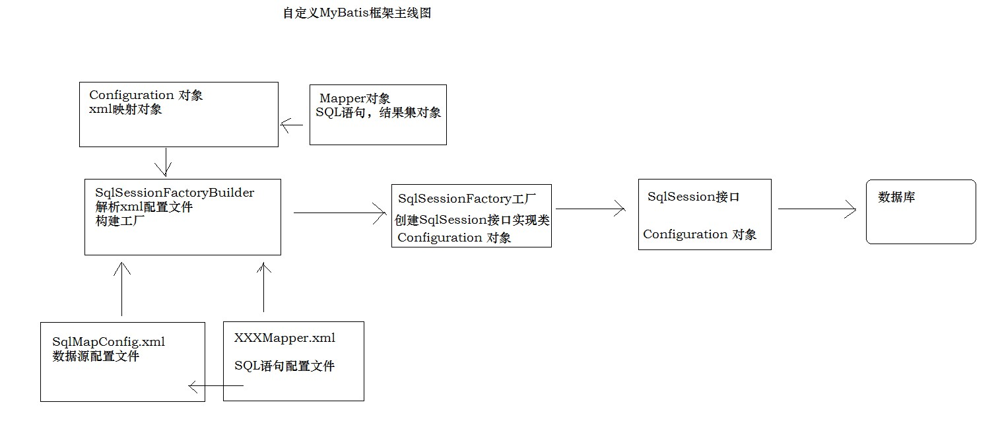

# MyBatis框架

今日学习内容目标 

- 能够了解什么是框架

- 理解自定义Mybatis框架

- 掌握Mybatis框架开发快速入门

## 认识框架

### 什么是框架

  框架就是一个架子，表演节目，舞台已经搭建好，表演什么节目，看自己的需求了。

  框架是一个半成品，对于Java语言来说，框架就是封装了别人的代码。在框架的基础上我们在进一步开发，拿来主义。

### 框架解决什么问题

  解决的是技术整合问题。软件开发环境和规模都很大，不可能任何一个项目的代码都从零开始，此时就需要一个非常优秀的框架把基础技术整合完毕，我们在他的基础上进一步开发。提高性能，易扩展，易维护，最终提高整个团队的开发效率。

### 什么时候使用框架

  企业级大型项目开发，避免大炮打蚊子。

### 怎么使用框架

  Java的框架是具有一些共性

- 导入jar包
- 框架运行细节定义，也就是编写配置文件（xml）
- 调用框架中的api

## 原生JDBC案例

- 查询user表
- 以List集合形式返回
- 编写pojo类 （User）
  - domain,pojo本质都是相同的

### 创建pojo对象

```java
public class User {
    private int id;
    private String username;
    private String sex;
    private Date birthday;
    private String address;
    public int getId() {
        return id;
    }
    public void setId(int id) {
        this.id = id;
    }
    public String getUsername() {
        return username;
    }
    public void setUsername(String username) {
        this.username = username;
    }
    public String getSex() {
        return sex;
    }
    public void setSex(String sex) {
        this.sex = sex;
    }
    public Date getBirthday() {
        return birthday;
    }
    public void setBirthday(Date birthday) {
        this.birthday = birthday;
    }
    public String getAddress() {
        return address;
    }
    public void setAddress(String address) {
        this.address = address;
    }
    @Override
    public String toString() {
        return "User{" +
                "id=" + id +
                ", username='" + username + '\'' +
                ", sex='" + sex + '\'' +
                ", birthday=" + birthday +
                ", address='" + address + '\'' +
                '}';
    }
}
```

### 创建UserDao接口实现类

```java
public class UserDaoImpl implements UserDao {
    private String driverClass = "com.mysql.jdbc.Driver";
    private String url="jdbc:mysql://localhost:3306/test";
    private String username="root";
    private String password="root";
    @Override
    public List<User> queryUserList()throws Exception {
        List<User> list = new ArrayList<User>();
        Class.forName(driverClass);
        Connection conn = DriverManager.getConnection(url,username,password);
        String sql = "select * from user";
        PreparedStatement pst = conn.prepareStatement(sql);
        ResultSet rs = pst.executeQuery();
        User user = null;
        while (rs.next()){
            user = new User();
            user.setId(rs.getInt("id"));
            user.setUsername(rs.getString("username"));
            user.setSex(rs.getString("sex"));
            user.setBirthday(rs.getDate("birthday"));
            user.setAddress(rs.getString("address"));
            list.add(user);
        }
        rs.close();
        pst.close();
        conn.close();
        return list;
    }
}
```

### 测试程序

```java
public class MainTest {
    @Test
    public void testJDBC() throws Exception {
        UserDao userDao = new UserDaoImpl();
        List<User> list = userDao.queryUserList();
        if(list!=null && list.size()>0)
            for(User user : list){
                System.out.println(user);
            }
    }
}
```

### 原生JDBC案例的问题

- 频繁连接，释放数据库资源，降低系统性能
- SQL语句硬编码，难以维护
- 参数和占位符对应问题
- 结果集解析复杂，列名硬编码

## MyBatis框架概述

- Mybatis原本是Apache软件基金会的一个开源项目叫做iBatis，2010年这个项目由Apache迁移到了google code管理才改名为Mybatis，2013年又迁移到了GitHub。
- Mybatis是一个优秀的持久层框架（Dao层框架），它是对JDBC的封装，使得开发者只需要关注Sql语句（业务）本身即可，无需开发者处理加载驱动、获取连接、创建Statement等繁琐的过程。
- Mybatis最大的特点是把Sql语句写在XML配置文件当中。而且Mybatis执行完Sql语句之后可以以对象形式返回（POJO/POJO集合等）。
- Mybatis是一个实现了ORM思想的持久层框架。
- ORM：Object/Relation Mapping 对象/关系映射。
- ORM思想：将数据库中的关系数据表映射为JAVA中的对象，把对数据表的操作转换为对对象的操作，实现面向对象编程。因此ORM的目的是使得开发人员以面向对象的思想来操作数据库。

  比如：原来insert使用的是insert into…，如果使用实现了ORM思想的持久层框架，就可以在Java程序中直接调用api，比如insert(User)，达到操作对象即操作数据库的效果。Hibernate框架是一个全自动的ORM持久层框架，只需要编写POJO，在xml中定义好Pojo属性和数据表字段的映射/对应关系，就可以在java中实现类似 insert(User)的操作。Sql语句都不用写。但是因为性能等问题，市场占有率越来越低

  Mybatis框架是一个半自动的ORM持久层框架，也可以在Java中实现类似 insert(User)的操作最终操作数据库，但是需要我们自己写Sql语句。Mybatis是目前比较流行的Dao层框架。

## 自定义MyBatis框架

- 目的
  - 感受一个框架的产生过程
  - 通过这个过程可以帮助我们了解底层一些东西
  - 提高竞争力（软实力）
- 注意
  - 完整性和严谨性不能和真实的相比
  - 今天的课程依然有难度
  - 不影响真正Mybatis框架的使用
- 所有的Dao层框架都是以接口的形式给我们提供增删改查的API
- 我们今天自定义Mybatis框架只完成一个API接口：selectList



### SqlSessionFactoryBuilder构建SqlSessionFactory工厂对象

```java
/**
 * SqlSessionFactory工厂构建者
 * 读取xml的配置文件
 */
public class SqlSessionFactoryBuilder {
    /**
     * 返回SqlSessionFactory工厂对象
     * 接收字节输入流
     * 用户传递流
     */
    public SqlSessionFactory builder(InputStream inputStream){
        SqlSessionFactory sqlSessionFactory = new SqlSessionFactory();
        //获取配置文件对象
        Configuration configuration = loadXmlConfig(inputStream);
        //configuration传递到SqlSessionFactory工厂
        sqlSessionFactory.setConfiguration(configuration);
        return sqlSessionFactory;
    }
    //解析xml文件，封装配置对象
    public Configuration loadXmlConfig(InputStream inputStream){
        Configuration configuration = new Configuration();
        SAXReader saxReader = new SAXReader();
        try {
            //读取xml，返回文档对象
            Document document = saxReader.read(inputStream);
            //根标签
            Element rootElement = document.getRootElement();
            // xpath表达式，解析property
            List<Element> list = rootElement.selectNodes("//property");
            if(list!=null && list.size()>0){
                for(Element element : list){
                    //属性值
                    String name = element.attributeValue("name");
                    String value = element.attributeValue("value");
                    //判断name属性值，进行configuration对象封装
                    if("driver".equalsIgnoreCase(name))
                        configuration.setDriver(value);
                    else if ("url".equalsIgnoreCase(name))
                        configuration.setUrl(value);
                    else if ("username".equalsIgnoreCase(name))
                        configuration.setUsername(value);
                    else if ("password".equalsIgnoreCase(name))
                        configuration.setPassword(value);
                }
            }
            //解析mapper标签
            List<Element> mapperList = rootElement.selectNodes("//mapper");
            if(mapperList!=null && mapperList.size()>0){
                for(Element mapper : mapperList){
                    //获取xml文件路径
                    String mapperPath = mapper.attributeValue("resource");
                    loadSqlConfig(mapperPath,configuration);
                }
            }
        } catch (DocumentException e) {
            e.printStackTrace();
        }
        return  configuration;
    }

    private void loadSqlConfig(String mapperPath,Configuration configuration){
        InputStream inputStream = this.getClass().getClassLoader().getResourceAsStream(mapperPath);
        SAXReader saxReader = new SAXReader();
        Document document = null;
        try {
            document = saxReader.read(inputStream);
            Element rootElement = document.getRootElement();
            //根标签namespace属性
            String namespace = rootElement.attributeValue("namespace");
            List<Element> selectList = rootElement.selectNodes("//select");
            if(selectList!=null && selectList.size()>0){
                for(Element element : selectList){
                    //标签体，获取SQL语句
                    String sql = element.getText();
                    //属性resultType获取pojo对象
                    String resultType = element.attributeValue("resultType");
                    //select标签id属性
                    String id = element.attributeValue("id");
                    Mapper mapper = new Mapper();
                    //封装Mapper对象
                    mapper.setSql(sql);
                    mapper.setResultType(resultType);
                    //封装配置文件对象
                    //根标签namespace属性值+.+id属性值
                    configuration.getMap().put(namespace+"."+id,mapper);
                }
            }
        } catch (DocumentException e) {
            e.printStackTrace();
        }
    }
}
```

### 配置文件对象

```java
public class Configuration {
    private String driver;
    private String url;
    private String username;
    private String password;
    /**
     * Map集合键，通过namespace+"."+id 锁定唯一SQL语句
     * Map集合值，Mapper对象，封装结果集pojo和SQL语句
     */
    private Map<String,Mapper> map = new HashMap<String, Mapper>();

    public Map<String, Mapper> getMap() {
        return map;
    }

    public void setMap(Map<String, Mapper> map) {
        this.map = map;
    }

    public String getDriver() {
        return driver;
    }

    public void setDriver(String driver) {
        this.driver = driver;
    }

    public String getUrl() {
        return url;
    }

    public void setUrl(String url) {
        this.url = url;
    }

    public String getUsername() {
        return username;
    }

    public void setUsername(String username) {
        this.username = username;
    }

    public String getPassword() {
        return password;
    }

    public void setPassword(String password) {
        this.password = password;
    }

    @Override
    public String toString() {
        return "Configuration{" +
                "driver='" + driver + '\'' +
                ", url='" + url + '\'' +
                ", username='" + username + '\'' +
                ", password='" + password + '\'' +
                '}';
    }
}
```

```java
public class Mapper {
    private String sql;
    private String resultType;

    public String getSql() {
        return sql;
    }

    public void setSql(String sql) {
        this.sql = sql;
    }

    public String getResultType() {
        return resultType;
    }

    public void setResultType(String resultType) {
        this.resultType = resultType;
    }

    @Override
    public String toString() {
        return "Mapper{" +
                "sql='" + sql + '\'' +
                ", resultType='" + resultType + '\'' +
                '}';
    }
}
```

### SqlSessionFactory工厂创建SqlSession对象

```java
public class SqlSessionFactory {
    private Configuration configuration;

    /**
     *  返回SqlSession接口实现类对象
     */
    public SqlSession openSession(){
        SqlSessionImpl sqlSession = new SqlSessionImpl();
        sqlSession.setConfiguration(configuration);
        return  sqlSession;
    }
    public void setConfiguration(Configuration configuration) {
        this.configuration = configuration;
    }
}
```

### SqlSession对象操作数据库

```java
**
 * JDBC的操作，框架中是必须的
 */
public class SqlSessionImpl implements SqlSession {

    //xml配置文件对象
    private Configuration configuration ;

    public void setConfiguration(Configuration configuration) {
        this.configuration = configuration;
    }

    @Override
    public <T> List<T> selectList(String sqlId) throws Exception {
        List<T> list = new ArrayList<T>();
        Class.forName(configuration.getDriver());
        Connection con =
                DriverManager.getConnection(configuration.getUrl(),configuration.getUsername(),configuration.getPassword());
        // 配置文件对象，获取唯一SQL语句
        String sql = configuration.getMap().get(sqlId).getSql();
        PreparedStatement pst = con.prepareStatement(sql);
        ResultSet rs = pst.executeQuery();
        //获取元数据
        ResultSetMetaData metaData = rs.getMetaData();
        //集合存储列名
        List<String> cloumnNameList = new ArrayList<String>();
        for(int i = 1 ; i <= metaData.getColumnCount(); i++){
            cloumnNameList.add(metaData.getColumnName(i));
        }

        Object obj = null;
        //配置文件，获取结果集封装的pojo对象的全限定名
        String resultType = configuration.getMap().get(sqlId).getResultType();
        Class clazz = Class.forName(resultType);
        //反射获取方法
        Method[] methods = clazz.getDeclaredMethods();
        while (rs.next()){
            //反射创建对象
            obj = clazz.newInstance();
            //遍历集合，获取列名
            for(String columnName : cloumnNameList){
                Object columnValue = rs.getObject(columnName);
                System.out.println(columnValue);
                //遍历方法数组
                for(Method method : methods){
                    //取出方法名字
                    String methodName = method.getName();
                    //判断列名是否与 set+方法名字相同
                    if(methodName.equalsIgnoreCase("set"+columnName)){
                        //反射调用set方法，存储列值
                        method.invoke(obj,columnValue);
                    }
                }
            }
            //对象存储集合
            list.add((T) obj);
        }
        return list;
    }
}
```

### SqlMapConfig.xml配置文件

```xml
<?xml version="1.0" encoding="UTF-8" ?>   
<configuration>   
   <environments default="development">   
      <environment id="development">   
        <transactionManager type="JDBC" />   
        <dataSource type="POOLED">   
          <property name="driver" value="com.mysql.jdbc.Driver" />
          <property name="url" value="jdbc:mysql://127.0.0.1:3306/test?characterEncoding=utf8" />
          <property name="username" value="root" />
          <property name="password" value="root" />
        </dataSource>   
     </environment>   
  </environments>

  <mappers>
     <mapper resource="UserMapper.xml">
     </mapper>
  </mappers>
</configuration>   
```

### UserMapper.xml配置文件

```xml
<?xml version="1.0" encoding="utf-8" ?>
<mapper namespace="test">
	<select id="queryUserList" resultType="com.itheima.pojo.User">
		select * from user
	</select>
</mapper>
```

## MyBatis快速入门

### 步骤：

- 导入MyBatis框架jar包
- 配置文件
- SqlSessionFactoryBuilder，传入字节输入流，构建工厂
- SqlSessionFactory，创建SqlSession
- SqlSession执行selectList方法查询数据

```java
@Test
    public void myBatis_QuickStart() throws IOException {
        InputStream inputStream = Resources.getResourceAsStream("SqlMapConfig.xml");
        SqlSessionFactoryBuilder sqlSessionFactoryBuilder = new SqlSessionFactoryBuilder();
        SqlSessionFactory sqlSessionFactory = sqlSessionFactoryBuilder.build(inputStream);
        SqlSession sqlSession = sqlSessionFactory.openSession();
        List<User> list = sqlSession.selectList("test.queryList");
        if(list!=null && list.size()>0){
            for(User user : list){
                System.out.println(user);
            }
        }
    }
```

### SqlMapperConfig.xml配置

```xml
<?xml version="1.0" encoding="UTF-8" ?>
<!DOCTYPE configuration
        PUBLIC "-//mybatis.org//DTD Config 3.0//EN"
        "http://mybatis.org/dtd/mybatis-3-config.dtd">
<configuration>
    <environments default="development">
        <environment id="development">
            <transactionManager type="JDBC" />
            <dataSource type="POOLED">
                <property name="driver" value="com.mysql.jdbc.Driver" />
                <property name="url" value="jdbc:mysql://127.0.0.1:3306/test?characterEncoding=utf8" />
                <property name="username" value="root" />
                <property name="password" value="root" />
            </dataSource>
        </environment>
    </environments>

    <mappers>
        <mapper resource="UserMapper.xml" />
    </mappers>
</configuration>   
```

### UserMapper.xml配置

```java
<?xml version="1.0" encoding="utf-8" ?>
<!DOCTYPE mapper
        PUBLIC "-//mybatis.org//DTD Mapper 3.0//EN"
        "http://mybatis.org/dtd/mybatis-3-mapper.dtd">
<mapper namespace="test">
   <select id="queryList" resultType="com.itheima.pojo.User">
      select * from user
</select>
</mapper>
```


## Java中的日志组件（扩展内容）

```properties
#log4j日志级别如下：
#A：off     最高等级，用于关闭所有日志记录。
#B：fatal   指出每个严重的错误事件将会导致应用程序的退出。
#C：error   指出虽然发生错误事件，但仍然不影响系统的继续运行。
#D：warn    表明会出现潜在的错误情形。
#E：info    一般和在粗粒度级别上，强调应用程序的运行全程。
#F：debug   一般用于细粒度级别上，对调试应用程序非常有帮助。
#G：all     最低等级，用于打开所有日志记录。

#但log4j只建议使用4个级别，优先级从高到低分别是:
#error>warn>info>debug

log4j.rootLogger =debug,systemOut,logFile

#输出到控制台
log4j.appender.systemOut = org.apache.log4j.ConsoleAppender
log4j.appender.systemOut.layout = org.apache.log4j.PatternLayout
log4j.appender.systemOut.layout.ConversionPattern = [%-5p][%-22d{yyyy/MM/dd HH:mm:ssS}][%l]%n%m%n
log4j.appender.systemOut.Target = System.out

#输出到文件
log4j.appender.logFile = org.apache.log4j.FileAppender
log4j.appender.logFile.layout = org.apache.log4j.PatternLayout
log4j.appender.logFile.layout.ConversionPattern = [%-5p][%-22d{yyyy/MM/dd HH:mm:ssS}][%l]%n%m%n
log4j.appender.logFile.File = E:/log/log4j.log
log4j.appender.logFile.Encoding = UTF-8

#将日志输记录到MySQL数据库
#log4j.appender.logDB = org.apache.log4j.jdbc.JDBCAppender
#log4j.appender.logDB.layout = org.apache.log4j.PatternLayout
#log4j.appender.logDB.Driver = com.mysql.jdbc.Driver
#log4j.appender.logDB.URL = jdbc:mysql://localhost:3306/log4j?characterEncoding=utf-8
#log4j.appender.logDB.User = root
#log4j.appender.logDB.Password = root
#log4j.appender.logDB.Sql = INSERT INTO t_log4j(project_name,create_date,level,category,file_name,thread_name,line,all_category,message)values('mybatis','%d{yyyy-MM-ddHH:mm:ss}','%p','%c','%F','%t','%L','%l','%m')
```

