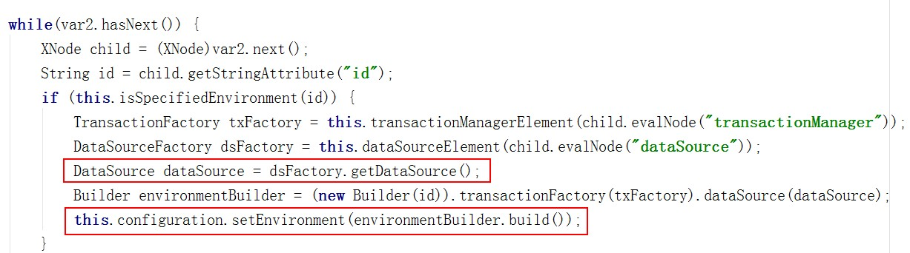
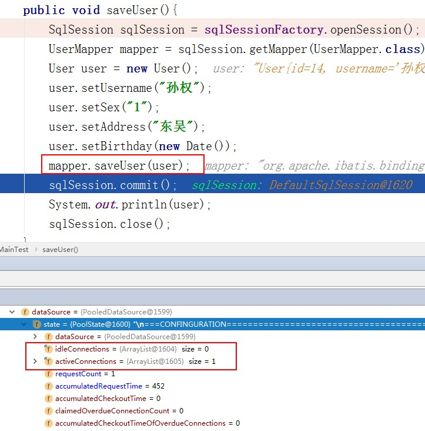
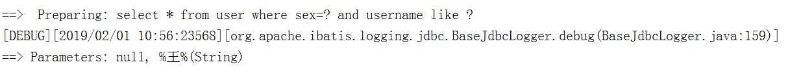
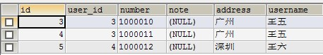
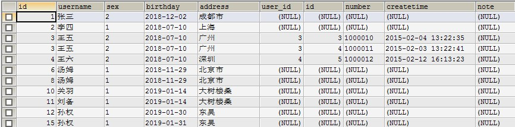
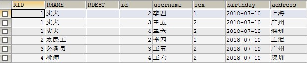

# MyBatis框架

今日内容

- 理解Mybatis连接池与事务操作
- 掌握Mybatis动态SQL
- 掌握Mybatis多表关联查询
- 掌握Mybatis多对多关系

## Mybatis连接池

  MyBatis配置文件中，配置为使用连接池<dataSource type="POOLED">，那么连接池是在什么时候建立的，什么时候从连接池中获取连接的。

### 连接池初始化时机

  在SqlSessionFactoryBuilder构建SqlSessionFactory的时候初始化连接池，初始化之后放入Configuration对象当中。分析框架源代码：org.apache.ibatis.builder.xml.XMLConfigBuilder类的方法environmentsElement（）



### 什么时候从连接池获取连接

  在getMapper的时候是不会从数据库连接池获取数据库连接的，在具体操作数据库调用mapper接口方法的时候才会从连接池拿连接。



### UNPOOLED：不使用数据库连接池（一般不会用）

### JNDI:(前提你的Mybatis环境必须是Web应用)（了解）

- 什么是JNDI

  JNDI:java naming directory interface（java命名目录接口，它是一种服务发布技术），数据源可以以服务的形式发布出去，那么哪个应用想用，就类似于客户端调用远程服务一样去调用即可

- 为什么必须是web应用

  往往只有tomcat/weblogic服务器中间件才支持JNDI技术

- 如果在Mybatis当中用，怎么用
  - 第一步：将数据库驱动程序(jar包)放到tomcat安装目录下的lib文件夹下

  - 第二步：在Tomcat的conf/context.xml文件中进行jndi数据源服务配置

    ```xml
    	<Resource name="jndi/mybatis" auth="Container"
    	 type="javax.sql.DataSource"
    	 driverClassName="com.mysql.jdbc.Driver"
    	 url="jdbc:mysql://localhost:3306/mybatis?characterEncoding=utf8"
         username="root" 
         password="root"
    	 maxActive="20"
    	 maxIdle="10"
    	 maxWait="10000">	
    	</Resource>
    ```

      name：在JNDI中叫做目录名，等同于服务名，此处的jndi/mybatis是自定义的，往往以/连接前后字符串即可。auth和type是固定的，其他都是数据库连接池的具体配置信息。

  - 第三步 ：在自己web项目的web.xml中引用Jndi数据源服务。

    ```xml
      <resource-ref>
    	<res-ref-name>jndi/mybatis</res-ref-name>
    	<res-type>javax.sql.DataSource</res-type>
    	<res-auth>Container</res-auth>
      </resource-ref>
    ```

  - 第四步：在自己web项目的Mybatis配置文件中使用

    ```xml
    <property name="data_source" value="java:comp/env/jndi/mybatis"/>
    ```

  ​          配置data_source属性，指向你的数据源引用，java:comp/env/jndi/mybatis中红色部分是固定的，绿色部分是你自己定义的目录名（服务名）。

## MyBatis事务控制

  通过sqlSession.openSession这种方法操作数据库时候，mybatis默认把事务自动提交给关闭了，注意：数据量非常小可以自动提交，数据量大就应该手动提交。自动提交在openSession方法中传入参数true： SqlSession sqlSession = sqlSessionFactory.openSession(true)

### 动态SQL标签

### where和if标签

  需求：根据用户的性别和用户名多条件查询用户信息。

```xml
<select id="queryUserByWhere" resultType="user" parameterType="user">
   select * from user where sex=#{sex} and username like #{username}
</select>
```

```java
@Test
public void queryUserByWhere(){
    SqlSession sqlSession = sqlSessionFactory.openSession();
    UserMapper mapper = sqlSession.getMapper(UserMapper.class);
    User user = new User();
    user.setSex("2");
    user.setUsername("%王%");
    List<User> list = mapper.queryUserByWhere(user);
    if(list!=null && list.size()>0){
        for(User user1 : list){
            System.out.println(user1);
        }
    }
}
```

  以上查询是可以查询到相关的数据的，假定不传递sex的值，那么就会出现什么也差不到的结果。



  通过日志可以看出，MyBatis在执行SQL语句的时候，参数sex的值是null，因此没有查询到结果。在以往的做法是判断参数是否为空，并进行字符串的拼接。在MyBatis框架中，提供了where标签和if标签来实现动态SQL语句。

- where标签：处理SQL语句，自动添加where关键字，并去掉紧跟他后面的一个and或者or

- if标签，test属性，判断表达式真假

  ```xml
  <select id="queryUserByWhere" resultType="user" parameterType="user">
     select * from user
     <where>
        <if test="sex!=''and sex!=null">
           and sex=#{sex}
        </if>
        <if test="username!=''and username!=null">
           and username like #{username}
        </if>
     </where>
  </select>
  ```

### SQL标签

  将SQL语句抽取，其他SQL语句中引入。

```xml
<!-- 
  SQL片段抽取
  使用include标签引入
-->
<sql id="commonsSql">
   id,username,sex,birthday,address
</sql>
```

  引入外部xml配置文件中的共享SQL片段时，使用namespace属性值+“.”+sql标签的id属性值。

### foreach标签传入集合

  删除多条数据的SQL语句，delete from user where id in(1,2,3)

```java
String sql = "delete from user where id in("
for(int i=0; i<list.size();i++) {
	if(i != list.size()-1)
		sql += list.get(i) + ","
	else
    	sql += list.get(i)+")"
}
```

- foreach标签遍历拼接SQL语句
  - collection属性：遍历传入的集合，当参数是集合时collection属性值固定为list
  - open属性：遍历拼接前
  - close属性：遍历拼接后
  - separator属性：拼接的符号
  - item属性：遍历到的元素

```xml
   <select id="queryUserByIdsList" parameterType="list" resultType="user">
      select * from user
      <foreach collection="list" open="where id in(" close=")" separator="," item="item">
         #{item}
      </foreach>
   </select>
```

```java
@Test
public void queryUserByIdsList(){
    SqlSession sqlSession = sqlSessionFactory.openSession();
    UserMapper mapper = sqlSession.getMapper(UserMapper.class);
    List<Integer> idsList = new ArrayList<Integer>();
    idsList.add(1);
    idsList.add(2);
    idsList.add(3);
    List<User> list = mapper.queryUserByIdsList(idsList);
    if(list!=null && list.size()>0){
        for (User user : list){
            System.out.println(user);
        }
    }
    sqlSession.close();
}
```

### foreach标签传入数组

- foreach标签遍历拼接SQL语句
  - collection属性：遍历传入的集合，当参数是数组时collection属性值固定为array
  - open属性：遍历拼接前
  - close属性：遍历拼接后
  - separator属性：拼接的符号
  - item属性：遍历到的元素

```xml
<select id="queryUserByIdsArray" parameterType="int[]" resultType="user">
   select * from user
   <foreach collection="array" open="where id in(" close=")" separator="," item="item">
      #{item}
   </foreach>
```

```java
@Test
public void queryUserByIdsArray(){
    SqlSession sqlSession = sqlSessionFactory.openSession();
    UserMapper mapper = sqlSession.getMapper(UserMapper.class);
    int[] idsArray= {1,2,3};
    List<User> list = mapper.queryUserByIdsArray(idsArray);
    if(list!=null && list.size()>0){
        for (User user : list){
            System.out.println(user);
        }
    }
    sqlSession.close();
}
```

### foreach标签传入pojo对象

- foreach标签遍历拼接SQL语句
  - collection属性：遍历传入的pojo对象中的集合，collection属性配置pojo中成员变量名
  - open属性：遍历拼接前
  - close属性：遍历拼接后
  - separator属性：拼接的符号
  - item属性：遍历到的元素

```java
public class QueryVo {
    private List<Integer> idsList;

    public List<Integer> getIdsList() {
        return idsList;
    }

    public void setIdsList(List<Integer> idsList) {
        this.idsList = idsList;
    }
}
```

```xml
<select id="queryUserByQueryVo" parameterType="queryVo" resultType="user">
   select * from user
   <foreach collection="idsList" open="where id in(" close=")" separator="," item="item">
      #{item}
   </foreach>
</select>
```

```java
@Test
public void queryUserByQueryVo(){
    SqlSession sqlSession = sqlSessionFactory.openSession();
    UserMapper mapper = sqlSession.getMapper(UserMapper.class);
    QueryVo queryVo = new QueryVo();
    List<Integer> idsList = new ArrayList<Integer>();
    idsList.add(1);
    idsList.add(2);
    idsList.add(3);
    queryVo.setIdsList(idsList);
    List<User> list = mapper.queryUserByQueryVo(queryVo);
    if(list!=null && list.size()>0){
        for (User user : list){
            System.out.println(user);
        }
    }
    sqlSession.close();
}
```

## MyBatis多表管理查询

### 多表关联关系分析

  多表关联：至少两个表关联。分析多表关系的经验技巧：从一条记录出发，不要从表整体去分析，比如分析A表和B表关系，A表中的一条记录对应B表中的几条记录，如果是一条，那么A到B就是一对一；如果多条，那么A到B就是一对多

- 一对一，从订单表出发，到用户表，是一对一的关系

- 一对多，从用户表出发，到订单表，一条用户数据可以在订单表中存在多条记录，这就是一对多。通过主外键来体现一对多的表结构。一的一方是主表，多的一方是从表，从表当中有一个字段是外键，指向了主表的主键

- 多对多，用户和角色表，一个用户可以有很多角色，一个角色有很多用户，多对多通过中间表来体现

### 多表关联的SQL语句表达分析

- 笛卡尔积
  - SELECT *FROM USER,orders
- 关联查询
  - 内关联 innder join on
    - SELECT * FROM USER u,orders o WHERE u.id=o.user_id
    - SELECT * FROM USER u INNER JOIN orders o ON u.id=o.user_id;
  - 左外连接
    - SELECT * FROM USER u LEFT JOIN orders o ON u.id=o.user_id
  - 右外连接
    - SELECT * FROM USER u RIGHT JOIN orders o ON u.id=o.user_id

### 一对一查询

  需求：查询订单表全部数据，关联查询出订单对应的用户数据（username address）。

  Sql语句自己来写，Mybatis只是帮我们执行sql语句同时封装结果集。

  SQL语句：

```sql
SELECT o.id,o.user_id,o.number,o.note,u.address,u.username FROM orders o LEFT JOIN USER u ON o.user_id=u.id
```



  对于查询结果集，没有对应的pojo对象，因此MyBatis框架也不能封装结果集，但是可以将User对象放在Orders对象中，因为一对一关系，一个Orders对象可以对应一个User对象。需要手动映射方式，实现查询结果集封装。

- pojo对象

```java
public class Orders {
    private Integer id;

    private Integer userId;

    private String number;

    private Date createtime;

    private String note;

    private User user;

    public User getUser() {
        return user;
    }

    public void setUser(User user) {
        this.user = user;
    }

    public Integer getId() {
        return id;
    }

    public void setId(Integer id) {
        this.id = id;
    }

    public Integer getUserId() {
        return userId;
    }

    public void setUserId(Integer userId) {
        this.userId = userId;
    }

    public String getNumber() {
        return number;
    }

    public void setNumber(String number) {
        this.number = number;
    }

    public Date getCreatetime() {
        return createtime;
    }

    public void setCreatetime(Date createtime) {
        this.createtime = createtime;
    }

    public String getNote() {
        return note;
    }

    public void setNote(String note) {
        this.note = note;
    }

    @Override
    public String toString() {
        return "Orders{" +
                "id=" + id +
                ", userId=" + userId +
                ", number='" + number + '\'' +
                ", createtime=" + createtime +
                ", note='" + note + '\'' +
                ", user=" + user +
                '}';
    }
}
```

- association（联合）标签，实现手动映射
  - propery属性：封装的pojo对象
  - javaType属性：封装的pojo对象类型

```xml
<mapper namespace="com.itheima.mapper.OrdersMapper">
    <select id="queryOrdersUser" resultMap="ordersUserResultType" >
        SELECT o.id,o.user_id,o.number,o.note,u.address,u.username FROM orders o LEFT JOIN USER u
        ON o.user_id=u.id
    </select>
    <resultMap id="ordersUserResultType" type="orders">
        <id column="id" property="id"></id>
        <result column="user_id" property="userId"></result>
        <result column="number" property="number"></result>
        <result column="createtime" property="createtime"></result>
        <result column="note" property="note"></result>
	   <!-- 手动映射，配置User对象-->
        <association property="user" javaType="user">
            <id column="user_id" property="id"></id>
            <result column="address" property="address"></result>
            <result column="username" property="username"></result>
        </association>
    </resultMap>
</mapper>
```

```java
@Test
public void queryOrdersUser(){
    SqlSession sqlSession = sqlSessionFactory.openSession();
    OrdersMapper mapper = sqlSession.getMapper(OrdersMapper.class);
    List<Orders> list = mapper.queryOrdersUser();
    if(list != null && list.size() > 0){
        for (Orders orders : list){
            System.out.println(orders);
        }
    }
 	sqlSession.close();
}
```

- 往往还有另外一种方式：新创建一个pojo，这个pojo里面增加两个字段username和address，然后使用resultType自动映射即可，但是这种方式不推荐，因为pojo多了之后很混乱，不容易做技术管理，而且这点方式也有点low

### 一对多查询

  查询全部用户数据，关联查询出订单数据。

  SQL语句：SELECT u.id,u.username,u.sex,u.birthday,u.address,o.user_id,o.id,o.number,o.createtime,o.note FROM USER u LEFT JOIN orders o ON u.id=o.user_id



  一个用户对应多个订单数据，因此在pojo中，订单对象是存储在集合中，并保存在User对象中

- pojo对象

```java
public class User {
    private int id;
    private String username;
    private String sex;
    private Date birthday;
    private String address;

    private List<Orders> ordersList;

    public List<Orders> getOrdersList() {
        return ordersList;
    }

    public void setOrdersList(List<Orders> ordersList) {
        this.ordersList = ordersList;
    }

    public int getId() {
        return id;
    }

    public void setId(int id) {
        this.id = id;
    }

    public String getUsername() {
        return username;
    }

    public void setUsername(String username) {
        this.username = username;
    }

    public String getSex() {
        return sex;
    }

    public void setSex(String sex) {
        this.sex = sex;
    }

    public Date getBirthday() {
        return birthday;
    }

    public void setBirthday(Date birthday) {
        this.birthday = birthday;
    }

    public String getAddress() {
        return address;
    }

    public void setAddress(String address) {
        this.address = address;
    }

    @Override
    public String toString() {
        return "User{" +
                "id=" + id +
                ", username='" + username + '\'' +
                ", sex='" + sex + '\'' +
                ", birthday=" + birthday +
                ", address='" + address + '\'' +
                ", ordersList=" + ordersList +
                '}';
    }
}
```

- collection标签：
  - property属性：封装的对应的属性名
  - ofType属性：已经指定为一个集合List，需要指定集合中的泛型

```xml
<select id="queryUserOrders" resultMap="userOrdersResultMap">
   SELECT u.id,u.username,u.sex,u.birthday,u.address,o.user_id,o.id,
   o.number,o.createtime,o.note
   FROM USER u LEFT JOIN orders o
   ON u.id=o.user_id
</select>

<resultMap id="userOrdersResultMap" type="user">
   <id column="id" property="id"></id>
   <result column="username" property="username"></result>
   <result column="sex" property="sex"></result>
   <result column="birthday" property="birthday"></result>
   <result column="address" property="address"></result>

   <collection property="ordersList" ofType="orders">
      <id column="id" property="id"></id>
      <result column="user_id" property="userId"></result>
      <result column="number" property="number"></result>
      <result column="createtime" property="createtime"></result>
      <result column="note" property="note"></result>
   </collection>
</resultMap>
```

```java
@Test
public void queryUserOrders(){
    SqlSession sqlSession = sqlSessionFactory.openSession();
    UserMapper mapper = sqlSession.getMapper(UserMapper.class);
    List<User> list = mapper.queryUserOrders();
    if(list != null && list.size() > 0){
        for(User user : list){
            System.out.println(user);
        }
    }
    sqlSession.close();
}
```

### 多对多查询

  多对多：双向的一对多，从A表到B表出发是一对多的关系，从B表出发到A表也是一对多的关系

  SQL语句：

```sql
SELECT r.RID,r.RNAME,r.RDESC,u.id,u.username,u.sex,u.birthday,u.address FROM role r LEFT JOIN user_role ur
ON r.RID=ur.RID LEFT JOIN USER u ON u.id=ur.UID
```

   

- pojo对象

```java
public class Role {
    private Integer rid;
    private String rname;
    private String rdesc;
    private List<User> userList;
    public Integer getRid() {
        return rid;
    }

    public void setRid(Integer rid) {
        this.rid = rid;
    }

    public String getRname() {
        return rname;
    }

    public void setRname(String rname) {
        this.rname = rname;
    }

    public String getRdesc() {
        return rdesc;
    }

    public void setRdesc(String rdesc) {
        this.rdesc = rdesc;
    }

    public List<User> getUserList() {
        return userList;
    }

    public void setUserList(List<User> userList) {
        this.userList = userList;
    }

    @Override
    public String toString() {
        return "Role{" +
                "rid=" + rid +
                ", rname='" + rname + '\'' +
                ", rdesc='" + rdesc + '\'' +
                ", userList=" + userList +
                '}';
    }
}
```

- 手动映射roleMapper.xml

```xml
<mapper namespace="com.itheima.mapper.RoleMapper">
    <select id="queryRoleUser" resultMap="roleUserResultMap">
        SELECT r.RID,r.RNAME,r.RDESC,u.id,u.username,u.sex,u.birthday,u.address FROM role r LEFT JOIN user_role ur ON r.RID=ur.RID LEFT JOIN USER u ON u.id=ur.UID
    </select>

    <resultMap id="roleUserResultMap" type="role">
        <id column="rid" property="rid"></id>
        <result column="rname" property="rname"></result>
        <result column="rdesc" property="rdesc"></result>
        <result column="" property=""></result>

        <collection property="userList" ofType="user">
            <id column="id" property="id"></id>
            <result column="username" property="username"></result>
            <result column="sex" property="sex"></result>
            <result column="birthday" property="birthday"></result>
            <result column="address" property="address"></result>
        </collection>
    </resultMap>
</mapper>
```

```java
@Test
public void queryRoleUser(){
    SqlSession sqlSession = sqlSessionFactory.openSession();
    RoleMapper mapper = sqlSession.getMapper(RoleMapper.class);
    List<Role> roleList = mapper.queryRoleUser();
    if(roleList != null && roleList.size() > 0){
        for (Role role : roleList){
            System.out.println(role);
        }
    }
    sqlSession.close();
}
```