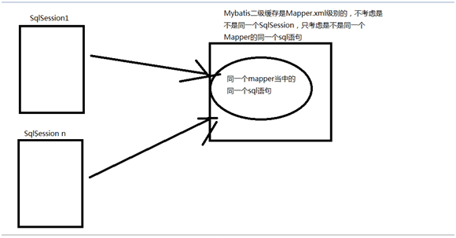

# MyBatis框架

今日内容

- 掌握Mybatis的延迟加载
- 掌握Mybatis缓存
- 掌握Mybatis注解开发

## 项目准备

### 用户主键查询用户信息

```xml
<!--
   主键查询用户信息
-->
<select id="queryUserById" resultType="user" parameterType="int">
    select * from user where id = #{id}
</select>
```

```java
/**
 * 主键查询用户信息
 */
@Test
public void queryUserById(){
    SqlSession sqlSession = sqlSessionFactory.openSession();
    UserMapper userMapper = sqlSession.getMapper(UserMapper.class);
    User user = userMapper.queryUserById(1);
    System.out.println(user);
    sqlSession.close();
}
```

### 订单查询用户信息 一对一

```xml
<!--
  订单，查询订单对应的用户
-->
<select id="queryOrdersUser" resultMap="queryOrdersUserResultMap">
    SELECT o.id,o.user_id,o.number,o.createtime,o.note,u.username,u.address FROM orders o LEFT JOIN USER u
    ON o.user_id = u.id
</select>

<resultMap id="queryOrdersUserResultMap" type="orders">
    <id column="id" property="id"></id>
    <result column="user_id" property="userId"></result>
    <result column="number" property="number"></result>
    <result column="createtime" property="createtime"></result>
    <result column="note" property="note"></result>

    <association property="user" javaType="user">
        <id column="user_id" property="id"></id>
        <result column="username" property="username"></result>
        <result column="address" property="address"></result>
    </association>
</resultMap>
```

```java
/**
 * 订单查询用户信息，一对一
 */
@Test
public void queryOrdersUser(){
    System.out.println();
    SqlSession sqlSession = sqlSessionFactory.openSession();
    OrdersMapper ordersMapper = sqlSession.getMapper(OrdersMapper.class);
    List<Orders> ordersList = ordersMapper.queryOrdersUser();
    if(ordersList != null && ordersList.size() > 0){
        for (Orders orders : ordersList){
            System.out.println(orders);
        }
    }
    sqlSession.close();
}
```

### 用户查询订单信息 一对多

```xml
<!--
   根据用户查询订单，一对多
-->
<select id="queryUserOrders" resultMap="queryUserOrdersResultMap">
    SELECT u.id,u.username,u.sex,u.birthday,u.address,o.id oid,o.number,o.createtime  FROM USER u LEFT JOIN orders o
    ON u.id = o.user_id
</select>

<resultMap id="queryUserOrdersResultMap" type="user">
    <id column="id" property="id"></id>
    <result column="username" property="username"></result>
    <result column="sex" property="sex"></result>
    <result column="birthday" property="birthday"></result>
    <result column="address" property="address"></result>

    <collection property="ordersList" ofType="orders">
        <id column="oid" property="id"></id>
        <result column="number" property="number"></result>
        <result column="createtime" property="createtime"></result>
    </collection>
</resultMap>
```

```java
/**
 * 用户查询订单，一对多
 */
@Test
public void queryUserOrders(){
    System.out.println();
    SqlSession sqlSession = sqlSessionFactory.openSession();
    UserMapper mapper = sqlSession.getMapper(UserMapper.class);
    List<User> list = mapper.queryUserOrders();
    if(list != null && list.size() > 0){
        for(User user : list){
            System.out.println(user);
        }
    }
    sqlSession.close();
}
```

## 一对一延迟加载

- 针对的是关联对象

​    用户和订单从面相对象的角度来说就是关联对象，当只需要订单数据，尚不需要用户数据的时候，就不应该去查询用户表，啥时候用到用户数据，啥时候查询

- 一对一延迟加载

​     关联的sql语句肯定要拆分了

- association标签
  - column属性：关联查询条件的属性
  - select属性：指定另一个查询语句

```xml
<!--
  订单，查询订单对应的用户
  拆分SQL语句，实现延迟加载
-->
<select id="queryOrdersUser" resultMap="queryOrdersUserResultMap">
    SELECT o.id,o.user_id,o.number,o.createtime,o.note FROM orders o
</select>

<resultMap id="queryOrdersUserResultMap" type="orders">
    <id column="id" property="id"></id>
    <result column="user_id" property="userId"></result>
    <result column="number" property="number"></result>
    <result column="createtime" property="createtime"></result>
    <result column="note" property="note"></result>
    <!--
       column指定查询的参数
       select关联其他查询语句 
    -->
    <association property="user" javaType="user" column="user_id" select="queryUserByUserId">
       <!-- <id column="user_id" property="id"></id>
        <result column="username" property="username"></result>
        <result column="address" property="address"></result>-->
    </association>
</resultMap>

<select id="queryUserByUserId" parameterType="int" resultType="user">
    select id,username,sex,birthday,address from user where id=#{user_id}
</select>
```

```java
/**
 * 订单查询用户信息，一对一
 * 延迟加载
 */
@Test
public void queryOrdersUser(){
    System.out.println();
    SqlSession sqlSession = sqlSessionFactory.openSession();
    OrdersMapper ordersMapper = sqlSession.getMapper(OrdersMapper.class);
    List<Orders> ordersList = ordersMapper.queryOrdersUser();
    if(ordersList != null && ordersList.size() > 0){
        for (Orders orders : ordersList){
            System.out.println(orders);
            System.out.println(orders.getUser());
        }
    }
    sqlSession.close();
}
```

### 开启延迟加载配置

```xml
<settings>
    <!-- 开启延迟加载-->
    <setting name="lazyLoadingEnabled" value="true" />
    <!-- 关闭立即加载-->
    <setting name="aggressiveLazyLoading" value="false" />
    <!-- 设定tostring等方法延迟加载-->
    <setting name="lazyLoadTriggerMethods" value="true" />
</settings>
```

## 一对多延迟加载

```xml
<!--
   根据用户查询订单，一对多
   延迟加载，拆分SQL语句
-->
<select id="queryUserOrders" resultMap="queryUserOrdersResultMap">
    SELECT u.id,u.username,u.sex,u.birthday,u.address  FROM USER u
</select>

<resultMap id="queryUserOrdersResultMap" type="user">
    <id column="id" property="id"></id>
    <result column="username" property="username"></result>
    <result column="sex" property="sex"></result>
    <result column="birthday" property="birthday"></result>
    <result column="address" property="address"></result>

    <collection property="ordersList" ofType="orders" column="id" select="queryOrdersByUserId">
      <!--  <id column="oid" property="id"></id>
        <result column="number" property="number"></result>
        <result column="createtime" property="createtime"></result>-->
    </collection>
</resultMap>

<select id="queryOrdersByUserId" parameterType="int" resultType="orders">
    select id,number,createtime from orders where user_id = #{user_id}
</select>
```

```java
/**
 * 用户查询订单，一对多
 * 延迟加载
 */
@Test
public void queryUserOrders(){
    System.out.println();
    SqlSession sqlSession = sqlSessionFactory.openSession();
    UserMapper mapper = sqlSession.getMapper(UserMapper.class);
    List<User> list = mapper.queryUserOrders();
    if(list != null && list.size() > 0){
        for(User user : list){
            System.out.println(user);
            List<Orders> ordersList = user.getOrdersList();
            System.out.println(ordersList);
        }
    }
    sqlSession.close();
}
```

## MyBatis一级缓存

  一级缓存：是SqlSession级别的，也就是同一个SqlSession内执行相同select语句的时候，不再去查询数据库，而是从Mybatis内部的缓存内存结构去直接拿到数据。

- 缓存失效时机：
  - sqlSession关闭
  - sqlSession提交事务（意味着可能是一个增删改的动作，需要更新缓存，那么这个时候Mybatis就会把已有的一级缓存给清理掉）

## MyBatis二级缓存

  

- 开启二级缓存

  ```xml
  <setting name="cacheEnabled" value="true" />
  ```

  ```xml
  <!-- 具体Mapper.xml配置-->
  <cache></cache>
  ```

- 执行结果

```java
/**
 * 主键查询用户信息
 */
@Test
public void queryUserById(){
    SqlSession sqlSession = sqlSessionFactory.openSession();
    UserMapper userMapper = sqlSession.getMapper(UserMapper.class);
    User user = userMapper.queryUserById(1);
    System.out.println(user);
    sqlSession.close();
    SqlSession sqlSession1 = sqlSessionFactory.openSession();
    UserMapper userMapper1 = sqlSession1.getMapper(UserMapper.class);
    User user1 = userMapper1.queryUserById(1);
    System.out.println(user1);
    sqlSession1.close();
}
```


  ratio，两次都会去查询二级缓存，但是第一次的时候缓存中没有数据，第二次才有，所以命中率是0.5

- 注意：Mybatis的二级缓存在使用的时候有很多限制，在实际开发的时候Mybatis的二级缓存应用很少

  比如在其他mapper.xml文件中有对user表的更新，那么UserMapper.xml的二级缓存就可能错误，我们很难要求对一张表的操作全部放到同一个mapper.xml中。

## MyBatis注解开发

### @Insert注解

- 注解属性value:写入SQL语句

### @Options注解

- 实现添加新数据的主键封装
- 注解属性
  - useGeneratedKeys：使用生成的主键，配置为true
  - keyProperty：主键封装的pojo对象属性

### @SelectKey注解

- 实现添加新数据的主键封装
- 注解属性
  - statement：要执行的SQL语句
  - before：在添加SQL语句之前还是之后进行，配置为false
  - keyProperty：主键封装的pojo对象属性

### 注解实现添加数据

- UserMapper接口

  ```java
  //新增用户数据
  @Insert("insert into user(username,sex,birthday,address)values(#{username},#{sex},#{birthday},#{address})")
  void saveUser(User user);
  ```

- UserMapper测试

  ```java
  /**
   * 注解开发
   * 添加用户数据
   */
  @Test
  public void testSaveUser(){
      SqlSession sqlSession = sqlSessionFactory.openSession();
      User user = new User();
      user.setUsername("孙权");
      user.setSex("1");
      user.setBirthday(new Date());
      user.setAddress("东吴");
      UserMapper userMapper = sqlSession.getMapper(UserMapper.class);
      userMapper.saveUser(user);
      sqlSession.commit();
      System.out.println(user);
      sqlSession.close();
  }
  ```

### @Update注解

- 注解属性value:写入SQL语句

### 注解实现更新数据

- UserMapper接口

  ```java
  //跟新用户
  @Update("update user set username=#{username},sex=#{sex},birthday=#{birthday},address=#{address} where id=#{id}")
  void updateUser(User user);
  ```

- UserMapper测试

  ```java
  /**
   * 注解开发
   * 更新用户数据
   */
  @Test
  public void testUpdateUser(){
      SqlSession sqlSession = sqlSessionFactory.openSession();
      User user = new User();
      user.setId(21);
      user.setUsername("孙策");
      user.setSex("2");
      user.setBirthday(new Date());
      user.setAddress("江东");
      UserMapper userMapper = sqlSession.getMapper(UserMapper.class);
      userMapper.updateUser(user);
      sqlSession.commit();
      sqlSession.close();
  }
  ```

### @Delete注解

- 注解属性value:写入SQL语句

### 注解实现删除数据

- UserMapper接口

  ```java
  //删除用户
  @Delete("delete from user where id = #{id}")
  void deleteUser(int id);
  ```

- UserMapper测试

  ```java
  /**
   * 注解开发
   * 更新用户数据
   */
  @Test
  public void testDeleteUser(){
      SqlSession sqlSession = sqlSessionFactory.openSession();
      UserMapper userMapper = sqlSession.getMapper(UserMapper.class);
      userMapper.deleteUser(21);
      sqlSession.commit();
      sqlSession.close();
  }
  ```

### @Select注解

- 注解属性value:写入SQL语句

### 注解实现主键查询用户数据

- UserMapper接口

  ```java
  //主键查询用户
  @Select("select id,username,sex,birthday,address from user where id = #{id}")
  User queryUserById(int id);
  ```

- UserMapper测试

  ```java
  /**
   * 注解开发
   * 主键查询用户
   */
  @Test
  public void testQueryUserById(){
      SqlSession sqlSession = sqlSessionFactory.openSession();
      UserMapper userMapper = sqlSession.getMapper(UserMapper.class);
      User user = userMapper.queryUserById(1);
      System.out.println(user);
      sqlSession.close();
  }
  ```

### 注解实现查询全部用户数据

- UserMapper接口

  ```java
  //查询全部用户
  @Select("select id,username,sex,birthday,address from user")
  List<User> queryUserByList();
  ```

- UserMapper测试

  ```java
  /**
   * 注解开发
   * 查询全部用户
   */
  @Test
  public void testQueryUserByList(){
      SqlSession sqlSession = sqlSessionFactory.openSession();
      UserMapper userMapper = sqlSession.getMapper(UserMapper.class);
      List<User> userList = userMapper.queryUserByList();
      if (userList != null && userList.size() > 0){
          for (User user : userList){
              System.out.println(user);
          }
      }
      sqlSession.close();
  }
  ```

### 动态SQL语句之where和if

- UserMapper接口

  ```java
  //多条件查询用户
  @Select("<script>select id,username,sex,birthday,address from user" +
          "<where>" +
          "<if test = \"sex != null and sex != ''\">" +
          " and sex = #{sex}" +
          "</if>" +
          "<if test = \"username != null and username != ''\">" +
          " and username like #{username}" +
          "</if>" +
          "</where></script>")
  List<User> queryUserByWhere(User user);
  ```

- UserMapper测试

  ```java
   /**
    * 注解开发
    * 多条件查询用户信息
    */
   @Test
  public void testQueryUserByWhere(){
      SqlSession sqlSession = sqlSessionFactory.openSession();
      UserMapper userMapper = sqlSession.getMapper(UserMapper.class);
      User user = new User();
      user.setSex("2");
      user.setUsername("%王%");
      List<User> userList = userMapper.queryUserByWhere(user);
      if(userList != null && userList.size() > 0){
          for(User user1 : userList){
              System.out.println(user1);
          }
      }
      sqlSession.close();
  }
  ```

### 动态SQL语句之foreach

- UserMapper接口

  ```java
  @Select("<script>select id,username,sex,birthday,address from user" +
          "<foreach collection = \"list\" open = \"where id in(\" close = \")\" separator = \",\" item = \"item\">" +
          "#{item}" +
          "</foreach>" +
          "</script>")
  List<User> queryUserByListIds(List<Integer> ids);
  ```

- UserMapper测试

  ```java
  /**
    * 注解开发
    * 传入List集合，查询用户数据
    */
  @Test
  public void testQueryUserByListIds(){
      SqlSession sqlSession = sqlSessionFactory.openSession();
      UserMapper userMapper = sqlSession.getMapper(UserMapper.class);
      List<Integer> ids = new ArrayList<Integer>();
      ids.add(1);
      ids.add(2);
      ids.add(3);
      List<User> userList = userMapper.queryUserByListIds(ids);
      if(userList != null && userList.size() > 0){
          for(User user : userList){
              System.out.println(user);
          }
      }
      sqlSession.close();
  }
  ```

### 一对一的注解开发

### @Results注解

  配置手动映射，取代resultMap标签

### @Result注解

  配置手动映射，取代result标签

- OrdersMapper接口

  ```java
  //根据订单查询用户，一对一查询
  @Select(" SELECT o.id,o.user_id,o.number,o.createtime,o.note FROM orders o")
  @Results({
          //配置主键映射，id默认false,不是主键
          @Result(id = true,column = "id",property = "id"),
          //配置其他映射关系
          @Result(column = "user_id",property = "userId"),
          @Result(column = "number",property = "number"),
          @Result(column = "createtime",property = "createtime"),
          @Result(column = "note",property = "note"),
          /*
               配置关联查询用户表
               property查询的pojo对象哪个属性做为条件查询
                 这个属性还是个pojo对象
               column查询条件的pojo对象的属性
               @One注解配置一对一的另一个查询语句
                 此语句需要对应的接口方法出现
           */
          @Result(column = "user_id",property = "user",javaType = User.class,
                  one = @One(select = "com.itheima.mapper.UserMapper.queryUserByUserId",fetchType = FetchType.LAZY))
  })
  List<Orders> queryOrdersUser();
  ```

- UserMapper接口

  ```java
  @Select("select id,username,sex,birthday,address from user where id=#{user_Id}")
  User queryUserByUserId(Integer id);
  ```

- OrdersMapp接口测试

  ```java
  /**
   *  注解开发
   *  一对一延迟加载测试
   */
  @Test
  public void testQueryOrdersUser(){
      SqlSession sqlSession = sqlSessionFactory.openSession();
      OrdersMapper ordersMapper = sqlSession.getMapper(OrdersMapper.class);
      List<Orders> ordersList = ordersMapper.queryOrdersUser();
      if(ordersList != null && ordersList.size() > 0){
          for(Orders orders : ordersList){
              System.out.println(orders);
              System.out.println(orders.getUser());
          }
      }
      sqlSession.close();
  }
  ```

### 一对多注解开发

- UserMapper接口

  ```java
  //用户查询订单，一对多
  @Select("select id,username,sex,birthday,address from user")
  @Results({
          @Result(id = true,column = "id",property = "id"),
          @Result(column = "username",property ="username" ),
          @Result(column = "sex",property ="sex" ),
          @Result(column = "birthday",property ="birthday" ),
          @Result(column = "address",property ="address" ),
          @Result(column = "id",property = "ordersList",javaType = List.class,
          many = @Many(select = "com.itheima.mapper.OrdersMapper.queryOrdersByUserId",fetchType = FetchType.LAZY))
  })
  List<User> queryUserOrders();
  ```

- OrdersMapper接口

  ```java
  //用户查询订单，一对多
  @Select("select number,createtime from orders where user_id = #{user_id}" )
  List<Orders> queryOrdersByUserId(Integer user_id);
  ```

- UserMapper接口测试

  ```java
  /**
    * 注解开发
    * 查询用户下的订单，一对多
    */
  @Test
  public void testQueryUserOrders(){
      SqlSession sqlSession = sqlSessionFactory.openSession();
      UserMapper userMapper = sqlSession.getMapper(UserMapper.class);
      List<User> userList = userMapper.queryUserOrders();
      if(userList != null && userList.size() > 0){
          for(User user : userList){
              System.out.println(user);
              System.out.println(user.getOrdersList());
          }
      }
      sqlSession.close();
  }
  ```

  

## [扩展]逆向工程小工具

帮我们生成pojo,mapper接口类和mapper的xml文件（dao层常用接口：根据id查询，根据条件查询，根据id更新删除等常用的接口方法）

- 往往用它来生成pojo
- 往往针对单表操作
- 如果数据库结构有变化，那么逆向出来的代码需要重新生成