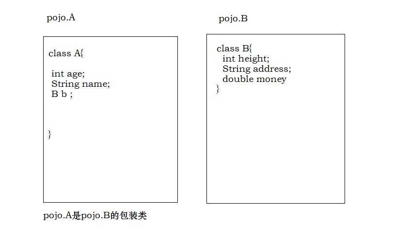

# MyBatis框架

## MyBatis配置文件详解SqlMapperConfig.xml

### enviroments配置数据源环境

- default数据源开关
- environment具体数据源环境，可以配置多个
- transactionManager事务管理器
- datasource数据源

```xml
<!--配置-->
<configuration>
    <!--配置数据源环境信息-->
    <environments default="development">
        <!-- 开发环境数据源配置-->
        <environment id="development">
            <transactionManager type="JDBC" />
            <dataSource type="POOLED">
                <property name="driver" value="com.mysql.jdbc.Driver" />
                <property name="url" value="jdbc:mysql://127.0.0.1:3306/test?characterEncoding=utf8" />
                <property name="username" value="root" />
                <property name="password" value="root" />
            </dataSource>
        </environment>

        <!--测试环境数据源 -->
        <environment id="test">
            <transactionManager type="JDBC" />
            <dataSource type="POOLED">
                <property name="driver" value="com.mysql.jdbc.Driver" />
                <property name="url" value="jdbc:mysql://127.0.0.1:3306/test?characterEncoding=utf8" />
                <property name="username" value="root" />
                <property name="password" value="root" />
            </dataSource>
        </environment>

        <!-- 生产环境数据源-->
        <environment id="produce">
            <!--
               事务管理器
               type="JDBC" 当前MyBatis事务管理，使用的是JDBC的事务
               Connection接口方法 commit rollback
               type="MANAGERED" 不管理事务，交给其他框架管理
            -->
            <transactionManager type="JDBC" />
            <!--
                数据源
                type="POOLED" 使用数据库连接池
                type="UNPOOLED" 不使用连接池
            -->
            <dataSource type="POOLED">
                <property name="driver" value="com.mysql.jdbc.Driver" />
                <property name="url" value="jdbc:mysql://127.0.0.1:3306/test?characterEncoding=utf8" />
                <property name="username" value="root" />
                <property name="password" value="root" />
            </dataSource>
        </environment>
    </environments>

    <mappers>
        <mapper resource="UserMapper.xml" />
    </mappers>
</configuration>    
```

## MyBatis框架的CRUD

### 根据id查询用户

- SqlMapperConfig.xml

```xml
<mappers>
    <!-- 配置User表SQL语句 -->
    <mapper resource="sqlmapper/UserMapper.xml" />
</mappers>
```

- UserMapper.xml配置

```xml
<mapper namespace="test">
   <!--
        test+.+id 锁定唯一SQL语句
        resultType 结果集封装类型
        parameterType 参数的数据类型
        SQL语句中的取参数语法 #{基本类型 任意命名}
    -->
   <select id="queryUserById" parameterType="Integer" resultType="com.itheima.pojo.User">
      select * from user where id=#{id}
</select>
</mapper>
```

- 实现步骤

  - Resources获取字节输入流，绑定配置文件
  - SqlSessionFactoryBuilder构建工厂
  - SqlSessionFactory创建SqlSession对象
  - SqlSession对象方法selectOne执行查询

```java
public void queryUserById() throws IOException {
    InputStream inputStream = Resources.getResourceAsStream("SqlMapConfig.xml");
    SqlSessionFactoryBuilder builder = new SqlSessionFactoryBuilder();
    SqlSessionFactory sqlSessionFactory = builder.build(inputStream);
    SqlSession sqlSession = sqlSessionFactory.openSession();
    User user = sqlSession.selectOne("test.queryUserById",2);
    System.out.println(user);
    sqlSession.close();
}
```

```xml
   <select id="queryUserById" parameterType="Integer" resultType="com.itheima.pojo.User">
      <!-- 获取SQL语句中的参数 -->
      select * from user where id=#{id}
</select>
```

### 根据用户名模糊查询

- 实现步骤
  - Resources获取字节输入流，绑定配置文件
  - SqlSessionFactoryBuilder构建工厂
  - SqlSessionFactory创建SqlSession对象
  - SqlSession对象方法selectList执行查询

- SQL语句中的参数

  - 固定语法，使用${}方式获取参数

  - 基本数据类型及包装类，参数名字任意

  - 底层实现，将SQL语句中的参数编译为？占位符

      底层使用高效安全的PreparedStatement实现

```java
public void queryUserByUsername()throws IOException{
    InputStream inputStream = Resources.getResourceAsStream("SqlMapConfig.xml");
    SqlSessionFactoryBuilder builder = new SqlSessionFactoryBuilder();
    SqlSessionFactory sqlSessionFactory = builder.build(inputStream);
    SqlSession sqlSession = sqlSessionFactory.openSession();
    List<User> list = sqlSession.selectList("test.queryUserByUsername","%王%");
    for(User user : list){
        System.out.println(user);
    }
    sqlSession.close();
}
```

```xml
<select id="queryUserByUsername" parameterType="String" resultType="com.itheima.pojo.User">
   select * from user where username like #{username}
</select>
```

### 根据用户名查询的${}参数方式

- 能用#不用$
- 使用#的原理是？占位符，而$的原理为直接字符串拼接方式
- $使用在参数传入数据库对象的时候，例如表名，列名字等 （select XX from XX order by 列名）

```java
public void queryUserByUsername$()throws IOException{
    SqlSession sqlSession = sqlSessionFactory.openSession();
    List<User> list = sqlSession.selectList("test.queryUserByUsername$","'%王%'");
    for(User user : list){
        System.out.println(user);
    }
    sqlSession.close();
}
```

```xml
<select id="queryUserByUsername$" parameterType="String" resultType="com.itheima.pojo.User">
   <!-- $获取SQL语句参数-->
   select * from user where username like ${value}
</select>
```

### 添加新用户

- 实现步骤
  - Resources获取字节输入流，绑定配置文件
  - SqlSessionFactoryBuilder构建工厂
  - SqlSessionFactory创建SqlSession对象
  - SqlSession对象方法insert添加数据
  - 提交事务

```java
public void saveUser(){
    SqlSession sqlSession = sqlSessionFactory.openSession();
    User user = new User();
    user.setUsername("刘备");
    user.setSex("男");
    user.setBirthday(new Date());
    user.setAddress("大树楼桑");
    int i = sqlSession.insert("test.saveUser",user);
    System.out.println(i);
    System.out.println(user);
    sqlSession.commit();
    sqlSession.close();
}
```

- xml配置
  - 传递参数不是基本数据类型和包装类，必须传递pojo.User对象中的属性名

```xml
<insert id="saveUser" parameterType="com.itheima.pojo.User">
   insert into user (username,sex,birthday,address)
   values(#{username},#{sex},#{birthday},#{address})
</insert>
```

### 添加用户< selectKey>< /selectKey>子标签

- < selectKey>< /selectKey> 再执行一次SQL语句'
  - 属性order：在insert之前或者之后执行
  - keyProperty：查询的结果放在哪里显示
  - resultType：查询结果的数据类型

```xml
<insert id="saveUser" parameterType="com.itheima.pojo.User">
   <selectKey order="AFTER" resultType="int" keyProperty="id">
       <!-- insert语句之后执行，查询结果集直接封装pojo对象-->
       SELECT LAST_INSERT_ID()
   </selectKey>
   insert into user (username,sex,birthday,address)
   values(#{username},#{sex},#{birthday},#{address})
```

### 根据id修改用户名和删除用户

实现步骤

- Resources获取字节输入流，绑定配置文件
- SqlSessionFactoryBuilder构建工厂
- SqlSessionFactory创建SqlSession对象
- SqlSession对象方法update | delete 更新数据
- 提交事务

```java
public void updateUsernameById() throws IOException {
    SqlSession sqlSession = sqlSessionFactory.openSession();
    User user = new User();
    user.setUsername("关羽");
    user.setSex("男");
    user.setBirthday(new Date());
    user.setAddress("大树楼桑");
    user.setId(10);
    int i = sqlSession.update("test.updateUsername", user);
    System.out.println(i);
    sqlSession.commit();
    sqlSession.close();
}
```

```xml
<update id="updateUsername" parameterType="com.itheima.pojo.User">
   update user set username=#{username} where id=#{id}
</update>
```

## 原始dao层开发方式

- 实现步骤
  - 定义dao层接口
  - 定义dao层接口实现类

```java
public interface UserDao {
    User queryUserById(Integer id);
}
```

```java
public class UserDaoImpl implements  UserDao {
    private SqlSessionFactory sqlSessionFactory;

    public UserDaoImpl(SqlSessionFactory sqlSessionFactory){
        this.sqlSessionFactory = sqlSessionFactory;
    }

    @Override
    public User queryUserById(Integer id) {
        SqlSession sqlSession = sqlSessionFactory.openSession();
        User user = sqlSession.selectOne("test.queryUserById", id);
        sqlSession.close();
        return user;
    }
}
```

```java
@Test
public void userTest() throws IOException {
    InputStream inputStream = Resources.getResourceAsStream("SqlMapConfig.xml");
    SqlSessionFactoryBuilder sqlSessionFactoryBuilder = new SqlSessionFactoryBuilder();
    SqlSessionFactory sqlSessionFactory = sqlSessionFactoryBuilder.build(inputStream);
    UserDao userDao = new UserDaoImpl(sqlSessionFactory);
    User user = userDao.queryUserById(1);
    System.out.println(user);
}
```

## 动态代理开发方式

  定义一个Mapper接口，这个接口其实和我们UserDao接口是一样的，从Mybatis框架中拿到一个代理对象（代理的是这个Mapper接口），通过代理对象调用接口当中的方法完成业务。
  传统dao开发方式中的实现类其实起了一个连接、承上启下的作用，连接了接口和xml映射文件，效果就是调用接口方法时能够找到xml映射文件。

- Mapper动态代理开发遵从的规范
  - sql映射文件的namespace必须和mapper接口的全限定类名保持一致
  - mapper接口的接口方法名必须和xml中的sql语句id保持一致
  - mapper接口的接口方法形参类型必须和sql语句的输入参数类型保持一致
  - mapper接口的接口方法返回类型必须和sql语句的resultType保持一致

```java
public interface UserMapper {
    User queryUserById(Integer id);
}
```

```java
@Test
public void userMapper() throws IOException {
    InputStream inputStream = Resources.getResourceAsStream("SqlMapConfig.xml");
    SqlSessionFactoryBuilder sqlSessionFactoryBuilder = new SqlSessionFactoryBuilder();
    SqlSessionFactory sqlSessionFactory = sqlSessionFactoryBuilder.build(inputStream);
    SqlSession sqlSession = sqlSessionFactory.openSession();
    UserMapper mapper = sqlSession.getMapper(UserMapper.class);
    User user = mapper.queryUserById(2);
    System.out.println(user);
}
```

```xml
<!-- namespace属性值=接口全限定名-->
<mapper namespace="com.itheima.mapper.UserMapper">
   <!-- id属性值=方法名-->
   <select id="queryUserById" parameterType="Integer" resultType="com.itheima.pojo.User">
      select * from user where id=#{id}
  </select>
</mapper>
```

## 全局Properties配置

```properties
jdbc.driver=com.mysql.jdbc.Driver
jdbc.url=jdbc:mysql://localhost:3306/test?characterEncoding=utf-8
jdbc.username=root
jdbc.password=root
```

```xml
<environment id="development">
    <transactionManager type="JDBC" />
    <dataSource type="POOLED">
        <property name="driver" value="${jdbc.driver}" />
        <property name="url" value="${jdbc.url}" />
        <property name="username" value="${jdbc.username}" />
        <property name="password" value="${jdbc.password}" />
    </dataSource>
</environment>
```

## 全局typeAliases配置

| 别名       | 映射的类型 |
| ---------- | ---------- |
| _byte      | byte       |
| _long      | long       |
| _short     | short      |
| _int       | int        |
| _integer   | int        |
| _double    | double     |
| _float     | float      |
| _boolean   | boolean    |
| string     | String     |
| byte       | Byte       |
| long       | Long       |
| short      | Short      |
| int        | Integer    |
| integer    | Integer    |
| double     | Double     |
| float      | Float      |
| boolean    | Boolean    |
| date       | Date       |
| decimal    | BigDecimal |
| bigdecimal | BigDecimal |
| map        | Map        |

  结果集数据类型定义别名，别名不区分大小写

```xml
<typeAliases>
    <!-- 为pojo对象定义别名-->
    <typeAlias type="com.itheima.pojo.User" alias="user"></typeAlias>
</typeAliases>
```

```xml
<!-- 使用别名即可-->
<select id="queryUserById" parameterType="int" resultType="User">
   select * from user where id=#{id}
</select>
```

  扫描所有pojo包下的类。注意：不可以出现相同的类名

```xml
<typeAliases>
    <!--<typeAlias type="com.itheima.pojo.User" alias="user"></typeAlias>-->
    <!-- 自动扫描pojo包下的全部类-->
    <package name="com.itheima.pojo" ></package>
</typeAliases>
```

## 全局配置文件mappers

- mappers注册sql映射文件的
  - resource属性加载sql映射文件，万能型选手（crud、原始dao、mapper动态代理）
  - 针对Mapper动态代理进行一个增强（增强两种用法）
  - mapper class 单个注册
  - package 批量扫描注册
  - 以上两种方式有规范要求

```xml
<mappers>
    <mapper resource="sqlmapper/UserMapper.xml" />
    <mapper resource="mapper/UserMapper.xml" />
    <mapper class="com.itheima.mapper.UserMapper"></mapper>
    <package name="com.itheima.mapper"></package>
</mappers>
```

## MyBatis输入参数类型

  pojo包装类型，一个pojo类中，包含了另一个pojo类。

  

```java
public class QueryVo {
    private User user;
    public User getUser() {
        return user;
    }
    public void setUser(User user) {
        this.user = user;
    }
}
```

```java
public interface UserMapper {
    User queryUserById(Integer id);
    List<User> queryUserByQueryVo(QueryVo queryVo);
}
```

```java
@Test
public void userMapperQueryVo(){
    SqlSession sqlSession = sqlSessionFactory.openSession();
    UserMapper mapper = sqlSession.getMapper(UserMapper.class);
    QueryVo queryVo = new QueryVo();
    User user = new User();
    user.setUsername("%王%");
    queryVo.setUser(user);
    List<User> list = mapper.queryUserByQueryVo(queryVo);
    for(User u :list){
        System.out.println(u);
    }
    sqlSession.close();
}
```

```xml
<select id="queryUserByQueryVo" resultType="user" parameterType="queryvo">
   select * from user where username like #{user.username}
</select>
```

## MyBatis手动映射

  当数据表中的列名和pojo中类的属性名不同时，将会出现封装数据失败的现象，MyBatis无法将数据表中的数据准确的封装到pojo对象中，因此必须使用手动映射的方式来实现。

pojo类

```java
private Integer id;
private Integer userId;
private String number;
private Date createtime;
private String note;

```

OrdersMapper接口

```java
public interface OrdersMapper {
    List<Orders> queryOrders();
}
```

```java
@Test
public void ordersMapper(){
    SqlSession sqlSession = sqlSessionFactory.openSession();
    OrdersMapper ordersMapper  = sqlSession.getMapper(OrdersMapper.class);
    List<Orders> list = ordersMapper.queryOrders();
    for(Orders orders : list){
        System.out.println(orders);
    }
    sqlSession.close();
}
```

```xml
<mapper namespace="com.itheima.mapper.OrdersMapper">
   <select id="queryOrders" resultMap="order">
      select * from orders
   </select>
   <!-- id属性值=resultMap属性值-->
   <resultMap id="order" type="com.itheima.pojo.Orders">
      <!-- 配置pojo对象红的属性名和数据表列名的对应关系 --> 
      <id property="id" column="id"></id>
      <result property="userId" column="user_id"></result>
      <result property="number" column="number"></result>
      <result property="createtime" column="createtime"></result>
      <result property="note" column="note"></result>

   </resultMap>
</mapper>
```