# Git其他知识

## 标签

像其他版本控制系统（VCS）一样，Git 可以给历史中的某一个提交打上标签，以示重要。 比较有代表性的是人们会使用这个功能来标记发布结点（v1.0 、v1.2等）。标签指的是某个分支某个特定时间点的状态。通过标签，可以很方便的切换到标记时的状态。例如mybatis-3.4.5.jar ,mybatis-3.4.1.jar 多个版本。

#### 1、创建标签

	

#### 2、查看标签

查询所有标签

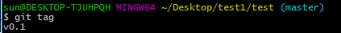	

查询某个标签

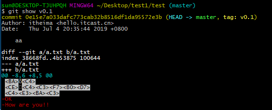	

#### 3、推送远程

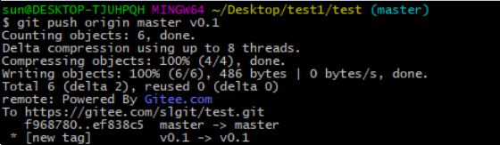		

#### 4、检出标签

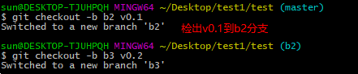	

#### 5、删除标签

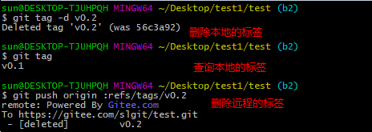	


## SSH协议传输数据

#### 1、Git支持的传输协议

```
由于Git的远程仓库并不在我们本地，当我们在使用远程仓库的时候（例如克隆、拉取、推送）就会涉及到数据的网络传输，Git支持多种数据传输协议
 本地协议（Local）
 HTTPS 协议
 SSH（Secure Shell）协议
 Git 协议

我们前面的操作都是基于HTTPS协议进行的，本章节我们会学习如何使用SSH协议
```

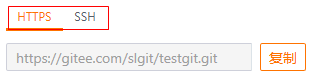	

#### 2、什么是SSH协议

```
SSH 为 Secure Shell（安全外壳协议）的缩写，由 IETF 的网络小组（Network Working Group）所制定。SSH 是目前较可靠，专为远程登录会话和其他网络服务提供安全性的协议。利用 SSH 协议可以有效防止远程管理过程中的信息泄露问题。

由于本地Git仓库和远程仓库之间的传输是通过SSH加密的，所以必须要让远程仓库服务器认证你的SSH key，在此之前，必须要生成SSH key。

使用ssh协议通信时，推荐使用基于密钥的验证方式。你必须为自己创建一对密匙（公钥和私钥），并把公匙放在需要访问的服务器上。
```

#### 3、配置SSH协议

##### 3.1、使用git命令创建公钥和私钥

```
使用命令ssh-keygen –t rsa生成公钥和私钥，执行完成后在windows本地用户.ssh目录C:\Users\用户名\.ssh下面生成如下名称的公钥和私钥
```

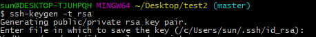	

window环境下的公钥和私钥

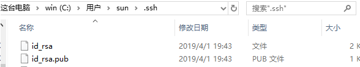		

##### 3.2、配置公钥至远程仓库

在码云的设置中，添加公钥,需要进行密码验证

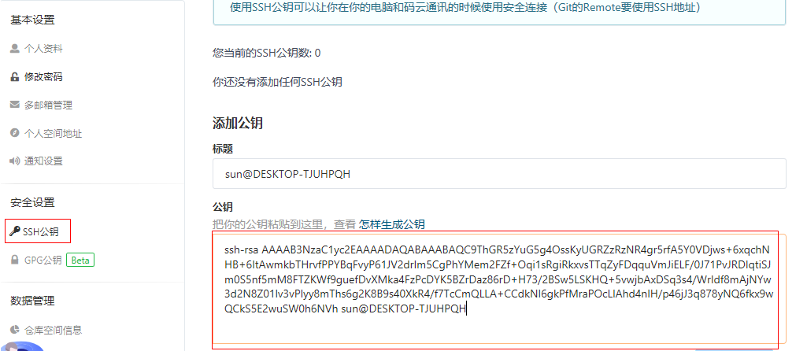	


推送时配置远程仓库路径为

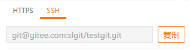	

#### 4、配置SSH的注意事项

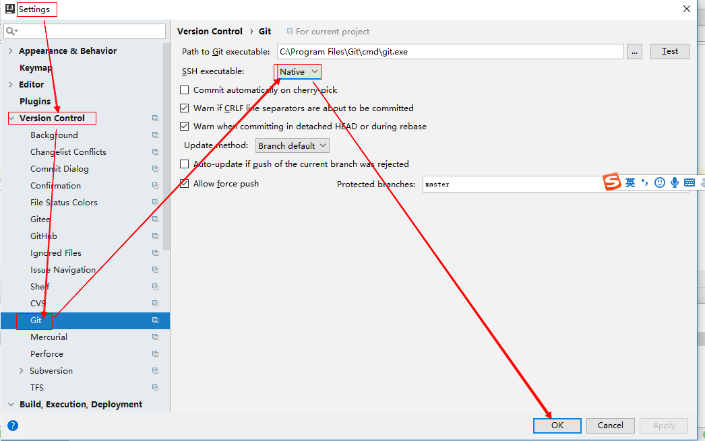	

## 使用TortoiseGit管理

#### 1、TortoiseGit下载和安装

TortoiseGit是一款开源的Git图形界面工具，使用TortoiseGit可以简化Git相关的操作（本质上还是执行的Git相关命令）。TortoiseGit下载地址： https://tortoisegit.org/download/下载完成可以得到如下安装程序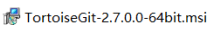

直接双击	安装即可，安装完成后在桌面（也可以是其他目录）点击右键，看到如下菜单则说明安装成功

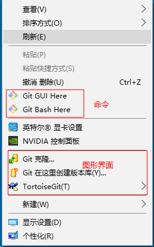	

#### 2、TortoiseGit的使用

##### 2.1、创建仓库

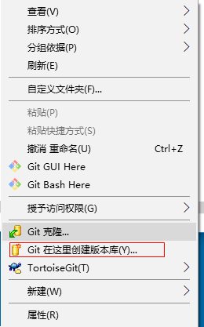	

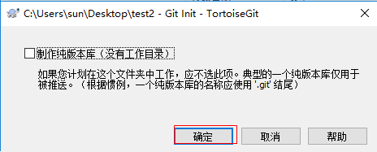	

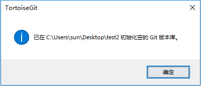	

看到此文件创建成功

	

##### 2.2、克隆仓库

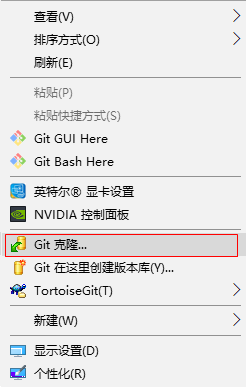	

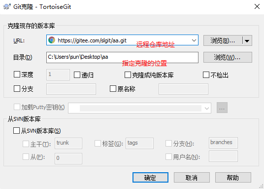	

##### 2.3、将文件添加到暂存区

任意创建一个文件

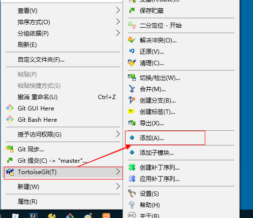	

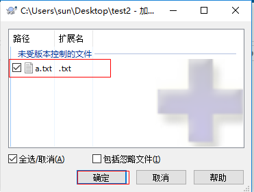	

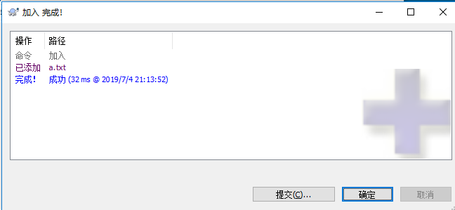	

##### 2.4、提交文件

添加到暂存区完成后，可以直接点击提交按钮,也可以单独点击提交

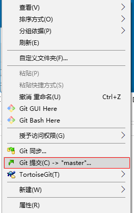	

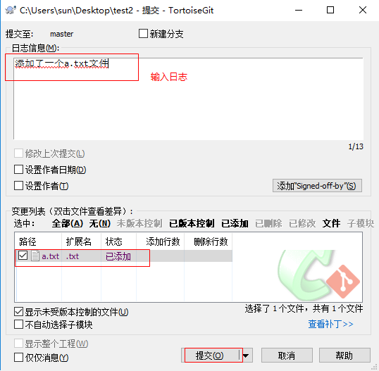	

提交完成

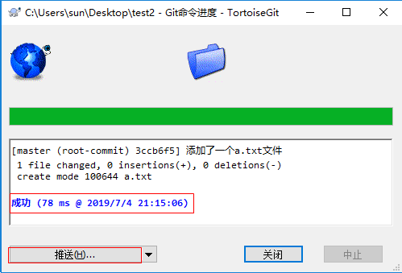	

##### 2.5、推送本地仓库至远程仓库

提交完成后可以直接点击推送按钮，也可以关闭后，选择推送

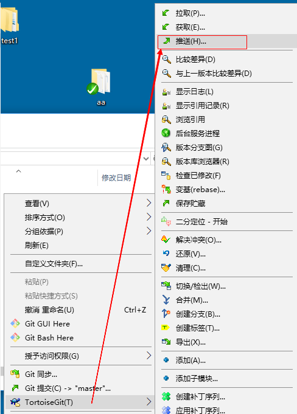		

推送时注意，如果不是克隆的仓库，需要点击管理，添加远程仓库

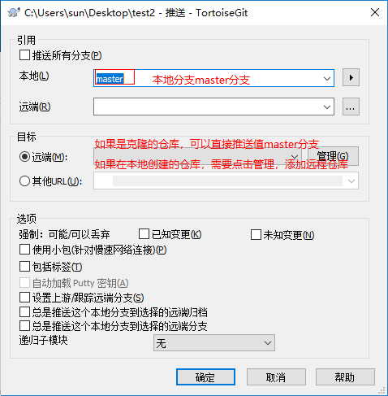	

添加远程仓库

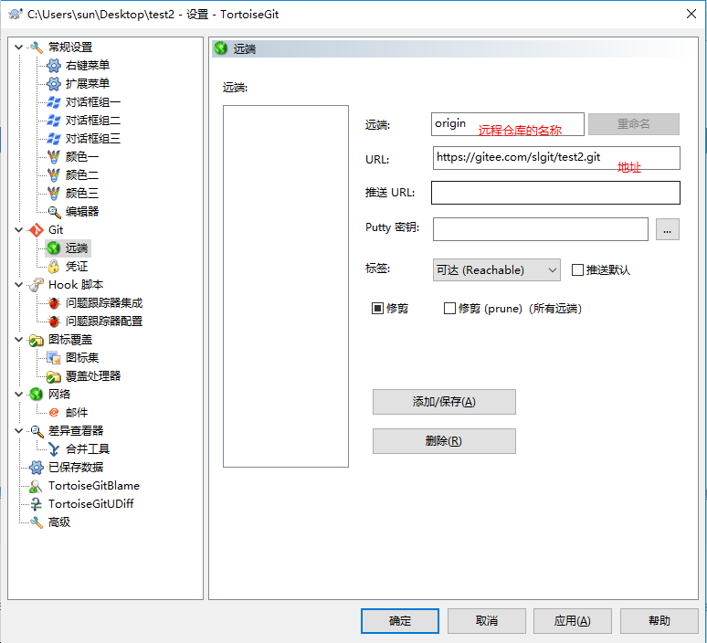	

选择远程仓库

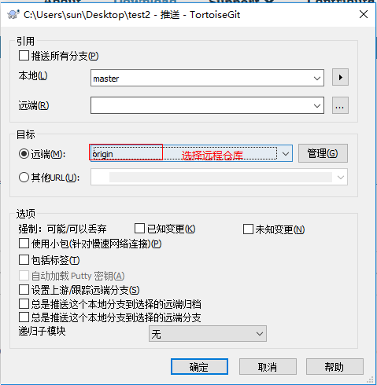	

推送成功

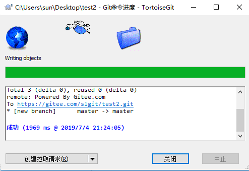	

##### 2.6、获取代码

点击获取

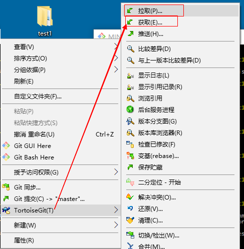	

拉取代码，选择远程仓库

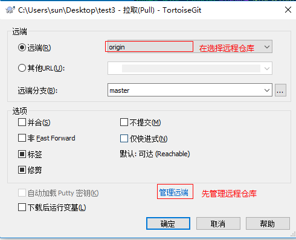			

获取成功

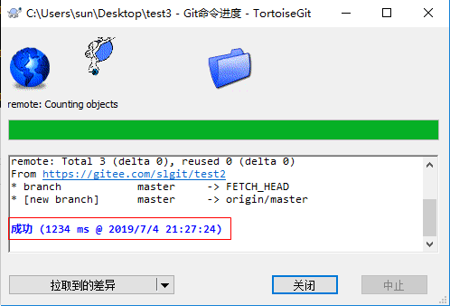	

##### 2.7、创建分支

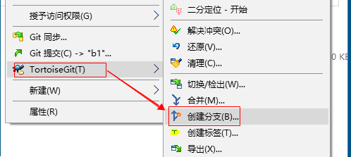	

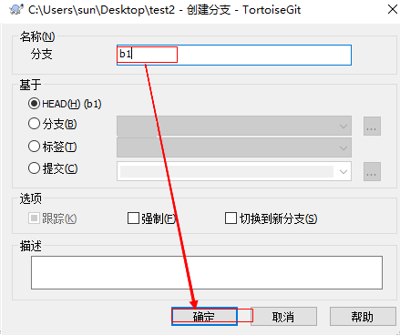	

##### 2.8、切换分支

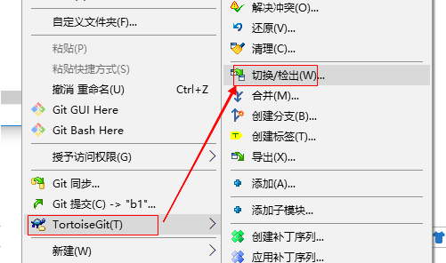	

切换分支

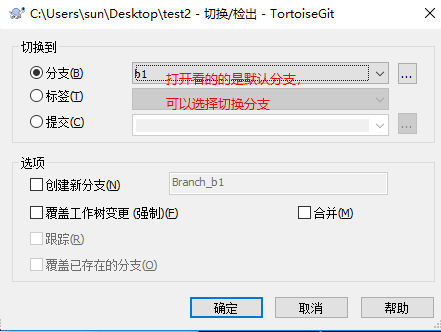	

切换成功

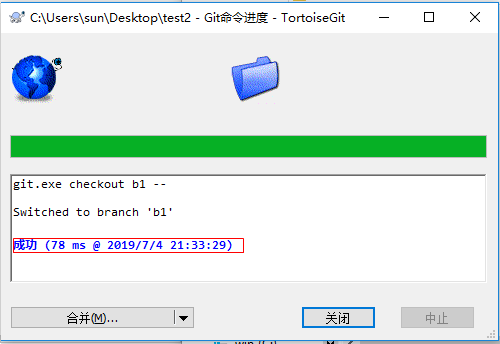		

##### 2.9、合并分支

选择合并

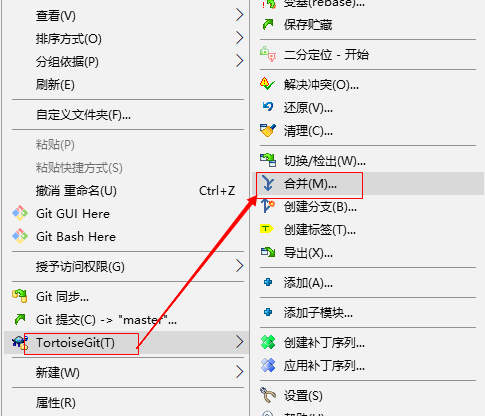	

合并b1分支，输入日志

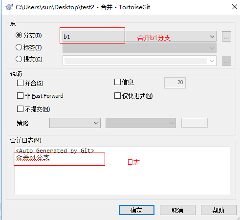	

由于两个分支都修改了代码，产生了冲突

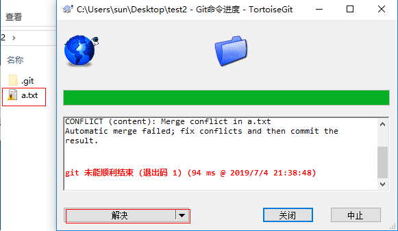	

打开冲突文件，修改代码后，标记解决冲突

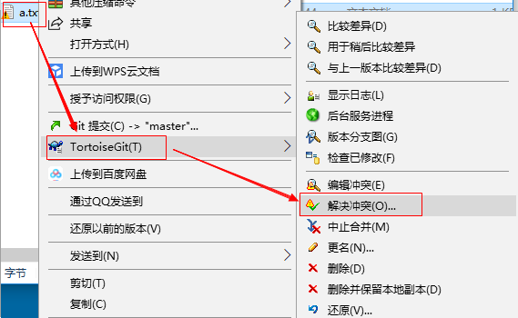	

提交并推送

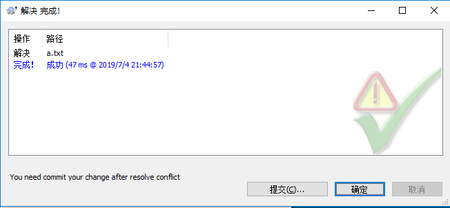	

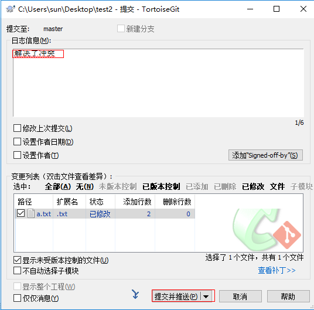	