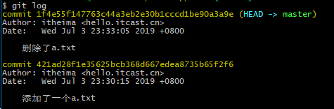
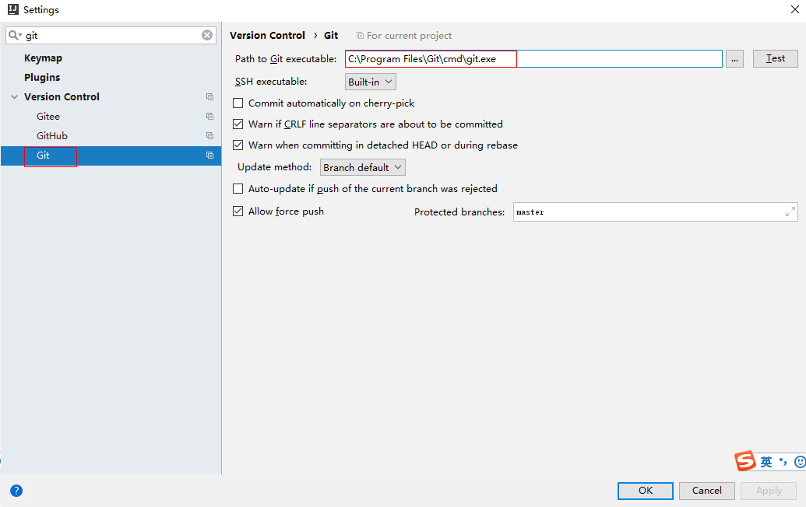
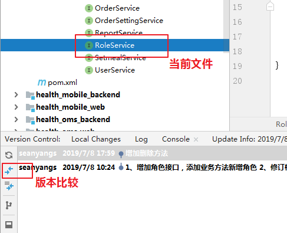

Git分布式版本控制工具

## 1、目标

- 了解Git基本概念
- 能够概述git工作流程
- 熟悉Git代码托管服务
- 能够使用Git常用命令
- 能够使用idea操作git
- 了解Git标签
- 了解SSH协议传输数据

## 2、概述

> 

#### 2.1、开发中的实际场景

```
场景一：备份
   	小明负责的模块就要完成了，就在即将Release之前的一瞬间，电脑突然蓝屏，硬盘光荣牺牲！几个月来的努力付之东流

场景二：代码还原
		这个项目中需要一个很复杂的功能，老王摸索了一个星期终于有眉目了，可是这被改得面目全非的代码已经回不到从前了。什么地方能买到哆啦A梦的时光机啊？

场景三：协同开发
		小刚和小强先后从文件服务器上下载了同一个文件：Analysis.java。小刚在Analysis.java文件中的第30行声明了一个方法，叫count()，先保存到了文件服务器上；小强在Analysis.java文件中的第50行声明了一个方法，叫sum()，也随后保存到了文件服务器上，于是，count()方法就只存在于小刚的记忆中了
		
场景四：多版本同步开发不同期上线
		老许是一位项目经理，根据产品经理的要求，需要同步开发多个功能，但是会在不同的时间节点上线，针对同一工程和项目，应该怎么解决这个问题？
		
场景五：追溯问题代码的编写人和编写时间！
		老王是另一位项目经理，每次因为项目进度挨骂之后，他都不知道该扣哪个程序员的工资！就拿这次来说吧，有个Bug调试了30多个小时才知道是因为相关属性没有在应用初始化时赋值！可是二胖、王东、刘流和正经牛都不承认是自己干的！
```

#### 2.2、版本控制器的方式

```
a、集中式版本控制工具
	集中式版本控制工具，版本库是集中存放在中央服务器的，team里每个人work时从中央服务器下载代码，是必须联网才能工作，局域网或互联网。个人修改后然后提交到中央版本库。
	举例：SVN和CVS
b、分布式版本控制工具
	分布式版本控制系统没有“中央服务器”，每个人的电脑上都是一个完整的版本库，这样工作的时候，无需要联网了，因为版本库就在你自己的电脑上。多人协作只需要各自的修改推送给对方，就能互相看到对方的修改了。
	举例：Git
```

#### 2.3、SVN

```
SVN是一个开放源代码的版本控制系统，是Apache Subversion的缩写。SVN是集中式的管理。SVN必须有一个服务器版本库就放在一个中央服务器，所有开发人员都是与服务器进行交互的。
优点：具有很强的权限控制
缺点：严重依赖中央服务器
```

	

#### 2.4、Git

```
   Git是分布式的,Git不需要有中心服务器，我们每台电脑拥有的东西都是一样的。我们使用Git并且有个中心服务器，仅仅是为了方便交换大家的修改，但是这个服务器的地位和我们每个人的PC是一样的。我们可以把它当做一个开发者的pc就可以就是为了大家代码容易交流不关机用的。没有它大家一样可以工作，只不过“交换”修改不方便而已。
  git是一个开源的分布式版本控制系统，可以有效、高速地处理从很小到非常大的项目版本管理。Git是Linus Torvalds 为了帮助管理 Linux 内核开发而开发的一个开放源码的版本控制软件。
同生活中的许多伟大事物一样，Git 诞生于一个极富纷争大举创新的年代。Linux 内核开源项目有着为数众多的参与者。 绝大多数的 Linux 内核维护工作都花在了提交补丁和保存归档的繁琐事务上（1991－2002年间）。 到 2002 年，整个项目组开始启用一个专有的分布式版本控制系统 BitKeeper 来管理和维护代码。
到了 2005 年，开发 BitKeeper 的商业公司同 Linux 内核开源社区的合作关系结束，他们收回了 Linux 内核社区免费使用 BitKeeper 的权力。 这就迫使 Linux 开源社区（特别是 Linux 的缔造者 Linus Torvalds）基于使用 BitKeeper 时的经验教训，开发出自己的版本系统。 他们对新的系统制订了若干目标：
 速度
 简单的设计
 对非线性开发模式的强力支持（允许成千上万个并行开发的分支）
 完全分布式
 有能力高效管理类似 Linux 内核一样的超大规模项目（速度和数据量）
```

	

备注：

​	Clone：克隆，就是将远程仓库复制到本地

​	Push：推送，就是将本地仓库代码上传到远程仓库

​	Pull：拉取，就是将远程仓库代码下载到本地仓库	

​	commit：提交，将工作区代码提交到本地仓库	


#### 2.5、Git工作流程图	

		

基本概念：

1. 远程仓库 ： 在局域网或互联网上的一个主机，存放代码库的主机或平台，比如gitee.com(码云)

2. 本地仓库：  在本地主机上的一个代码库，可以独立存在，也可以与远程仓库进行关联

   凡是一个文件夹，包含.git隐藏文件夹（git工作目录），说明此文件目录使用git版本管理。.git文件目录中存储了很多配置信息、日志信息和文件版本信息、工作区、暂存区信息等。.git文件夹中有很多文件，其中有一个index文件就是暂存区，也可以叫做stage。暂存区是一个临时保存修改文件的地方。

   

   

3. 工作区：对任何文件的修订(增删改)，都先放在工作区，工作区不与任何仓库分支进行关联

4. 暂存区：把修订的文件，从工作区经过add（添加）后与某一个仓库分支进行关联，只要进入缓存区的文件才能commit(提交)到本地仓库。

5. 分支：代码存放在仓库，默认是主分支(master)，可以在主分支基础上创建很多子分支，比如develop（开发）、bugfix（bug修复）等。

命令如下：

1．clone（克隆）: 从远程仓库中克隆代码到本地仓库

​     fetch (抓取) ： 从远程库，抓取到本地仓库，不进行任何的合并动作，一般操作比较少。

2．checkout （检出）:从本地仓库中检出一个仓库分支然后进行修订

3．add（添加）: 在提交前先将代码提交到暂存区

4．commit（提交）: 提交到本地仓库。本地仓库中保存修改的各个历史版本

5 . pull (拉取)  ： 从远程库拉到本地库，自动进行合并(merge)，然后放到到工作区，相当于fetch+merge

6．push（推送） : 修改完成后，需要和团队成员共享代码时，将代码推送到远程仓库	

#### 2.6、工作目录下的状态

Git工作目录下的文件存在两种状态：

​	untracked 未跟踪（未被纳入版本控制）

 	tracked 已跟踪（被纳入版本控制）        

​	Unmodified 未修改状态        

​	Modified 已修改状态       

 	Staged  已暂存状态

这些文件的状态会随着我们执行Git的命令而发生变化

## 3、Git远程仓库

#### 3.1、 常用的托管服务[远程仓库]

```
前面我们已经知道了Git中存在两种类型的仓库，即本地仓库和远程仓库。那么我们如何搭建Git远程仓库呢？我们可以借助互联网上提供的一些代码托管服务来实现，其中比较常用的有GitHub、码云、GitLab等。
 gitHub（ 地址：https://github.com/ ）是一个面向开源及私有软件项目的托管平台，因为只支持Git 作为唯一的版本库格式进行托管，故名gitHub
 码云（地址： https://gitee.com/ ）是国内的一个代码托管平台，由于服务器在国内，所以相比于GitHub，码云速度会更快
 GitLab （地址： https://about.gitlab.com/ ）是一个用于仓库管理系统的开源项目，使用Git作为代码管理工具，并在此基础上搭建起来的web服务,一般用于在企业、学校等内部网络搭建git私服。
```

#### 3.2、 注册码云

要想使用码云的相关服务，需要注册账号（地址： https://gitee.com/signup ）	

	

#### 3.3、 创建远程仓库

	

​	

仓库创建好之后，可以查看仓库的信息

​	

点击克隆/下载中的复制可以获取该仓库的地址				

该仓库的地址为

https://gitee.com/mobapp/studygit.git

#### 3.4、 邀请其他开发人员

前面已经在码云上创建了自己的远程仓库，目前仓库成员只有自己一个人（身份为管理员）。在企业实际开发中，一个项目往往是由多个人共同开发完成的，为了使多个参与者都有权限操作远程仓库，就需要邀请其他项目参与者成为当前仓库的成员。	

+ 进入仓库管理中心，点击仓库成员管理


+ 直接添加成员，输入成员在gitee的邮箱地址


+ 输入邮箱后，自动提示码云用户信息，确定后点击添加


	

+ 确定成员信息，点击提交


+ 被要求人员，确认加入

被邀请人员，自己登录gitee.com,点击右上角通知，然后进入私信列表，然后点击确认加入


## 4、Git常用命令

#### 4.1 Git环境配置

#####    4.1.1 下载与安装

下载地址： https://git-scm.com/download

	

下载完成后可以得到如下安装文件：

	

双击下载的安装文件来安装Git。安装完成后在电脑桌面（也可以是其他目录）点击右键，如果能够看到如下两个菜单则说明Git安装成功。

	

备注：	

​	Git GUI：Git提供的图形界面工具

​	Git Bash：Git提供的命令行工具

​	当安装Git后首先要做的事情是设置用户名称和email地址。这是非常重要的，因为每次Git提交都会使用该用户信息

##### 4.1.2 基本配置

 设置用户信息   

​		 git config --global user.name “itcast”   

​		git config --global user.email “hello@itcast.cn” 

​		git config --global credential.helper store   # git push的时候记住用户名和密码

​                以上配置信息默认存储在用户目录下，如果设置错误，可以删除以下如图文件，重新操作以上命令即可。


​	查看配置信息   

​		git config --list   

​		git config user.name

​	通过上面的命令设置的信息会保存在~/.gitconfig文件中

#### 4.2、获取本地仓库

​	要使用Git对我们的代码进行版本控制，首先需要获得构建本地仓库

​	通常有两种方式： 

​		在本地初始化一个Git仓库 

​		从远程仓库克隆一个仓库 	

##### 4.2.1 在本地初始化一个Git仓库

1）在电脑的任意位置创建一个空目录（例如test）作为我们的本地Git仓库

2）进入这个目录中，点击右键打开Git bash窗口

3）执行命令git init如果在当前目录中看到.git文件夹（此文件夹为隐藏文件夹）则说明Git仓库创建成功

	

##### 4.2.2 从远程仓库克隆

可以通过Git提供的命令从远程仓库进行克隆，将远程仓库克隆到本地

​	命令为： git clone 远程Git仓库地址 	

​    远程Git仓库地址有两种形式，一种是HTTPS协议（HTTP安全协议），另一种是SSH协议（安全外壳协议）。HTTPS协议如果登录私有库必须提供用户名及密码。


+ clone 私有库（HTTPS协议），

  用户必须是当前仓库的成员，克隆时必须提供码云平台的登录邮箱及密码


+ clone 公开库（HTTPS协议），无需提供用户名及密码

	

#### 4.3、操作本地仓库	

##### 4.3.1、查看本地仓库的状态

 命令形式：git status [-s]  

	

更简洁的信息

		

##### 4.3.2、添加工作区到暂存区

 命令形式：git add 单个文件名|通配符     ( . 代表全部文件)

添加一个或多个文件到暂存区

​	

##### 4.3.3、取消已跟踪文件

命令形式：git reset  单个文件名或通配符    ( . 代表全部文件)

撤销当前文件或全部内容到修改之前的状态

	

##### 4.3.4、提交暂存区到本地仓库

命令形式：git commit  -m '注释内容'  提交暂存区内容到本地仓库的当前分支

		

##### 4.3.5、查看日志文件

命令形式：git log 

	

			

	

##### 4.3.6、添加文件至忽略列表

一般我们总会有些文件无需纳入Git 的管理，也不希望它们总出现在未跟踪文件列表。 通常都是些自动生成的文件，比如日志文件，或者编译过程中创建的临时文件等。 在这种情况下，我们可以在工作目录中创建一个名为 .gitignore 的文件（文件名称固定），列出要忽略的文件模式。下面是一个示例：	

```
# no .a files
*.a
# but do track lib.a, even though you're ignoring .a files above
!lib.a
# only ignore the TODO file in the current directory, not subdir/TODO
/TODO
# ignore all files in the build/ directory
build/
# ignore doc/notes.txt, but not doc/server/arch.txt
doc/*.txt
# ignore all .pdf files in the doc/ directory
doc/**/*.pdf
```

		

**一定在工程初始化时，提前准备好需要忽略的文件列表**

#### 4.4、操作远程仓库 

##### 4.4.1、添加远程仓库 

**此操作是先初始化本地库，然后与已创建的远程库进行对接**。

命令形式： git remote add <远端名称>  <仓库路径>  

远端名称，默认是origin，取决于远端服务器设置

仓库路径，从远端服务器获取此URL

	

##### 4.4.2、查看远程仓库

命令形式：git remote

	

##### 4.4.3、推送到远程仓库

 命令形式：git push 【remote name】【branch name】    

当你想分享你的代码时，可以将其推送到远程仓库。

	

查询远程仓库

	

**注意**

推送之前，需要先pull远端仓库，如果发现提交版本不一致，出现如下错误：


需要在GIT命令中添加一句代码：--allow-unrelated-histories允许不相关历史进行提交,


##### 4.4.4、从远程仓库克隆

**此操作是先创建远程库，本地Clone，然后在基于clone的本地库进行操作，建议按此方式**

此章节内容，4.2.2已操作过。

##### 4.4.5、从远程仓库中抓取和拉取	

+ 抓取 命令形式：git fetch【remote name】【branch name】    

git fetch 是从远程仓库获取最新版本到本地仓库，不会自动merge

合并远程分支内容到当前,命令形式: git merge【remote name】【branch name】

	

+ 拉取 命令形式：git pull【remote name】【branch name】    

  **操作命令之前，务必把工作区的内容添加到暂存区在拉取代码。**

	

##### 4.4.6、解决合并冲突 

在一段时间，A、B用户修改了同一个文件，且修改了同一行位置的代码，此时会发生合并冲突。

 A用户在本地修改代码后优先推送到远程仓库，此时B用户在本地修订代码，提交到本地仓库后，也需要推送到远程仓库，此时B用户晚于A用户吐司，故需要先拉取远程仓库代码，经过合并后才能推送代码。在B用户拉取代码时，因为A、B用户同一段时间修改了同一个文件的相同位置代码，故会发生合并冲突。

A用户修改代码推送到远程仓库

	

B用户修改代码提交到本地仓库

B用户修改代码准备推送到远程仓库

	

			

git默认把冲突的代码合并在一起，并做特殊标记，如图所示


解决冲突是由开发人员根据实际情况，把上面的冲突部分，进行修订。比如：


完成修订后，把代码保存到暂存区，然后提交到本地仓库，冲突解决完毕。


#### 4.5、分支

几乎所有的版本控制系统都以某种形式支持分支。 使用分支意味着你可以把你的工作从开发主线上分离开来进行重大的Bug修改、开发新的功能，以免影响开发主线。

在开发中，一般有如下分支使用原则与流程：

* master （生产） 分支

  线上分支，主分支，中小规模项目作为线上运行的应用对应的分支；

* test（测试）分支

  从master创建的分支，一般作为测试部门的测试分支，进行预发测试。测试完成后，需要合并到master分支，进行发版上线，中小规模项目可省略此分支；

* develop（开发）分支

  从test创建的分支，如果开发没有test分支，是从master创建的分支，一般作为开发部门的主要开发分支，如果没有其他并行开发不同期上线要求，都可以在此版本进行开发，阶段开发完成后，需要是合并到test分支继续测试，如果没有test分支，可直接合并到master分支。

* develop_xxx分支

  从develop创建的分支，一般是同期并行开发，但不同期上线时创建的分支，一般是合并到develop分支。

* hotfix(bugfix)分支，

  从master派生的分支，一般作为线上bug修复使用，修复完成后需要合并到master、test、develop分支。

##### 4.5.1、查看分支

 查看本地分支

​	git branch 

查看远程分支

​	git branch -r

 查看所有分支

​	git branch -a

	

##### 4.5.2、创建分支

		

##### 4.5.3、切换分支

	

##### 4.54、分支推送至远程仓库

把b1分支推送至远程仓库的b1分支

	

##### 4.5.5、合并分支

分支的目标达成后，可以直接合并到主分支上，b1合并到master分支

		

合并分支时，有时不太顺利，比如两个分支代码都修改过

修改主分支，提交本地且推送远程

	

修改b1分支，提交本地且推送远程

	

合并分支，产生冲突

	

##### 4.5.6、删除分支

**不能删除当前分支，只能删除其他分支**

git branch -d b1  删除分支时，需要做各种合并冲突检查，检查失败，删除失败

git branch -D b1 不做任何合并冲突检查，强制删除

	

git push  origin –d b1 删除远程分支 （**谨慎操作**）


## 5、在Idea中使用Git

#### 5.1、在Idea中配置Git

安装好IntelliJ IDEA后，如果Git安装在默认路径下，那么idea会自动找到git的位置，如果更改了Git的安装位置则需要手动配置下Git的路径。选择File→Settings打开设置窗口，找到Version Control下的git选项：	

	

点击Test按钮,现在执行成功，配置完成

	

#### 5.2、在Idea中操作Git

##### 5.2.1、初始化远程仓库  【项目leader操作】

- 创建项目远程仓库

  

- 初始化仓库并推送到远程

  主要初始化忽略文件及项目初始化代码，并推送到远程仓库

  1. clone远程仓库到本地

     - 选定本地磁盘一个文件夹，使用git命令完成此操作

     

     - clone完成后，如图所示

     

     

     

  2. 切换到开发分支

     - 查看当前分支

     

     - 检出develop分支，并确定是在开发分支

       

     

  3. 添加忽略文件

     

  4. 把初始化项目代码放到git仓库中

     

  5. 通过git命令完成添加、提交、推送

     

     

     


##### 5.2.2、创建本地仓（不推荐使用）

  先在本地创建本地仓库，然后与远程仓库关联 ，不建议按此方式操作。

				

##### 5.2.3、克隆远程仓库到本地 （推荐使用）

1. 选定本地磁盘一个文件夹，使用git命令完成clone操作。


2. 切换到开发分支

   


##### 5.2.4、打开clone的本地仓库项目	


##### 5.2.5、本地仓库常规操作

1. 新增文件

   比如在某个包新增一个Java文件，如图所示：

   

   ​	勾选后，添加新文件，自动添加到暂存区，新文件自动变为绿色

   ​	

2. 编辑文件

   比如修改某一个包下已存在的文件内容，如图所示：

   

   正常编辑文件，默认放在工作区，如果需要添加到暂存区，选择文件，右键菜单，选择git-Add

   

3. 重置文件到修改前

   比如修订了某一文件，需要重置到修改文件之前的状态，选择文件，右键菜单，选择git-reset

   

   

   重置后，文件颜色自动消失，说明已重置到修改之前的状态。

   

4. 提交到本地仓库

   + 提交当前文件

   

   

   + 提交多个文件

     

     

   + 添加注释并提交

   

   

   + 提交完成

     


##### 5.2.6、推送到远程仓库

推送操作：

1. 把工作区内容添加到暂存区；

2. 把暂存区内容提交到当前分支；

3. 拉取远程仓库对应分支，如果有冲突，先解决冲突并提交保存

4. 推送当前分支到远程仓库

1、拉取远程仓库对应分支

		

​	

2、解决合并冲突

​      如果从远程仓库拉取的代码中，同一文件在本地仓库也修改了，需要解决合并冲突，比如如图所示：


解决冲突（根据业务情况，进行代码合并，并删除冲突提示）


提交合并冲突


推送当前版本到远程仓库


##### 5.2.7、合并版本并推送到远程

如果当前版本需要发布，需要把develop合并到master版本

步骤：

1、切换到需要合并的版本，比如master


2、执行合并操作，使用当前版本合并其他版本到当前，比如master合并developer


3、合并完成，推送到远程仓库


##### 5.2.8、创建分支

假如线上发生问题，需要解决线上问题，需要在master创建bugfix分支，解决线上问题。


​	

##### 5.2.9、切换分支

切换分支，只需要选中分支，然后选择checkout，就可以切换分支


##### 5.2.10、版本比较

对代码修改后，可以点击对比按钮，对比差异

	

	

