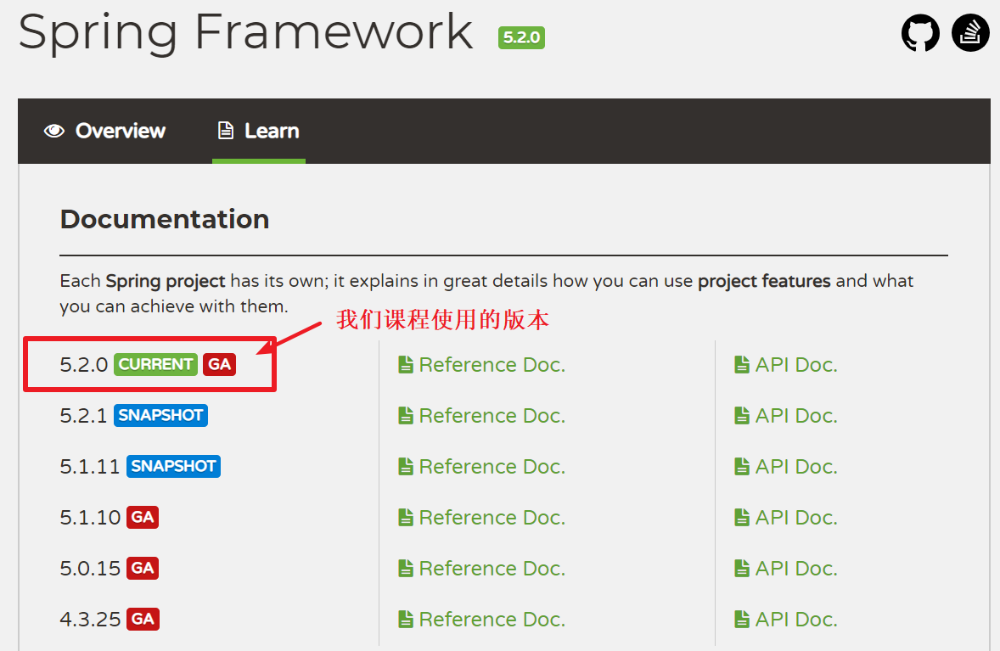
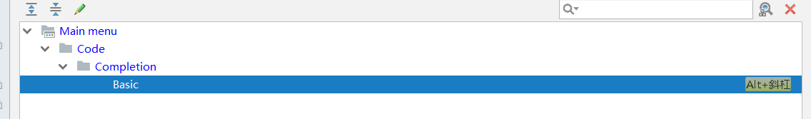

# 1. Spring概述

## 1.1 关于框架

**框架的概念**

框架：在这里特指软件框架，它是我们在实际开发中解决项目需求的技术集合。运用框架可以大大简化我们的代码编写，缩短开发周期。同时，对后续项目维护在面对开发团队人员更迭时降低了门槛，对系统升级提供灵活可控的标准。当然，框架提高了我们的开发效率，降低维护成本的同时，也要求我们在使用时遵循它的规范，要按照它的使用要求编写代码。最后，需要注意的是，它不是系统架构。

**框架的作用**

提高开发效率。

增强可重用性。

节约维护成本。

提供编写规范。

解耦底层实现原理。

**学好框架的必要性**

首先，spring（包括springmvc）和mybatis是企业开发中最基础的两个框架。

接下来，从企业角度分析，在实际开发中通常都会采用成熟的框架作为项目某个技术的解决方案，而掌握这些基础框架已经是企业对开发人员的最基本技能要求。

从自身角度分析，我们通过前面对mybatis框架的学习和使用，在实现持久层操作时代码变得精简的同时，开发时间得到了大大的缩短。


## 1.2 Spring概述

官网地址：https://spring.io/

### 1.2.1 Spring简介

Spring 是分层的 Java SE/EE 应用 ==full-stack== 轻量级开源框架，以 ==IOC（Inverse Of Control：反转控制）和AOP（Aspect Oriented Programming：面向切面编程）为内核==，提供了展现层 SpringMVC 和持久层 Spring JDBC 以及业务层事务管理等众多的企业级应用技术，还能整合开源世界众多著名的第三方框架和类库，逐渐成为使用最多的 Java EE 企业应用开源框架 .

### 1.2.2 Spring的发展历程

* 1997 年 IBM 提出了 EJB 的思想
* 1998 年， SUN 制定开发标准规范 EJB1.0

了解EJB

```http
1. EJB可以说像是一个Web Service，，比如EJB将编写好的业务组件放置在EJB容器上，然后提供接口给客户端访问；但是功能不仅限如此，EJB标准中提供了很多规范  等，而这些规范只有在EJB容器才能正常运行。
 	重量级框架 
2. Spring容器取代了原有的EJB容器，因此以Spring框架为核心的应用无须EJB容器支持，可以在Web容器中运行。
 Spring容器管理的不再是复杂的EJB组件，而是POJO（Plain Old Java Object） Bean。
	 轻量级框架
```

* 1999 年， EJB1.1 发布

* 2001 年， EJB2.0 发布

* 2003 年， EJB2.1 发布

* 2006 年， EJB3.0 发布

  ```http
  Rod Johnson（spring 之父）
  Expert One-to-One J2EE Design and Development(2002)
  阐述了 J2EE 使用 EJB 开发设计的优点及解决方案
  Expert One-to-One J2EE Development without EJB(2004)
  阐述了 J2EE 开发不使用 EJB 的解决方式（Spring 雏形）
  ```

* 2017 年 9 月份发布了 spring 的最新版本 spring 5.0 通用版（GA） 

### 1.2.3 Spring的优势

* 方便解耦，简化开发

  ```http
  通过 Spring 提供的 IoC 容器，可以将对象间的依赖关系交由 Spring 进行控制，避免硬编码所造成的过度程序耦合。用户也不必再为单例模式类、属性文件解析等这些很底层的需求编写代码，可以更专注于上层的应用。

  UserService{
      private UserDao userDao = new UserDaoImpl();
  }
  ```

* AOP 编程的支持

  ```http
  通过 Spring 的 AOP 功能，方便进行面向切面的编程，许多不容易用传统 OOP 实现的功能可以通过 AOP 轻松应付。
  ```

* 声明式事务的支持

  ```http
  可以将我们从单调烦闷的事务管理代码中解脱出来，通过声明式方式灵活的进行事务的管理，提高开发效率和质量。
  ```

* 方便程序的测试

  ```http
  可以用非容器依赖的编程方式进行几乎所有的测试工作，测试不再是昂贵的操作，而是随手可做的事情。

  SqlSessionFactoryBuilder.build(SqlMapConfig.xml)
  SqlSession = SqlSessionFactory.open();
  UserDao dao = SqlSession.getMapper(UserDao.class);

  dao.findAll();
  ```

* 方便集成各种优秀框架

  ```http
  Spring 可以降低各种框架的使用难度，提供了对各种优秀框架（ Struts、 Hibernate、 Hessian、 Quartz
  等）的直接支持。
  ```

* 降低 JavaEE API 的使用难度

  ```http
  Spring 对 JavaEE API（如 JDBC、 JavaMail、远程调用等）进行了薄薄的封装层，使这些 API 的
  使用难度大为降低。
  ```

* Java 源码是经典学习范例

  ```http
  Spring 的源代码设计精妙、结构清晰、匠心独用，处处体现着大师对 Java 设计模式灵活运用以及对 Java 技术的高深造诣。它的源代码无意是 Java 技术的最佳实践的范例。 
  ```

  ​

### 1.2.4 Spring的体系结构


### 1.2.5  Spring Framework的版本

<https://spring.io/projects/spring-framework#learn>

 

 

# 2. 控制反转IoC - Inverse Of Control

## 2.1 程序的耦合

### 2.1.1 什么是耦合

耦合性(Coupling)，也叫耦合度，它是对模块间关联程度的度量。

在软件工程中，耦合指的就是对象之间的依赖关系。对象之间的耦合越高，则表明模块的独立性和可复用性越差，且维护成本越高。因此对象的设计应使类和构件之间的耦合最小。软件设计中通常用耦合度和内聚度作为衡量模块独立程度的标准。**划分模块的一个准则就是高内聚低耦合。**

### 2.1.2 内聚和耦合

* 内聚标志一个模块内各个元素彼此结合的紧密程度，它是信息隐蔽和局部化概念的自然扩展。内聚是从功能角度来度量模块内的联系，一个好的内聚模块应当恰好做一件事。它描述的是模块内的功能联系。
* 耦合是软件结构中各模块之间相互连接的一种度量，耦合强弱取决于模块间接口的复杂程度、进入或访问一个模块的点以及通过接口的数据。 程序讲究的是低耦合，高内聚。就是同一个模块内的各个元素之间要高度紧密，但是各个模块之间的相互依存度却不要那么紧密。

```java
class UserService{

	//UserDao userDao = new UserDaoImpl();
	UserDao userDao = BeanFactory.getBean("UserDao");
}
```


### 2.1.3 耦合的示例

#### 1）初识耦合

我们在前面课程学习中，接触到最明显的一个因程序耦合而不得不改变的技术点就是JDBC操作的注册驱动：

```java
/**
 * 程序的耦合演示
 */
public class JdbcDemo {

    /**
     * JDBC操作
     */
    public static void main(String[] args) throws Exception{
        //1.注册驱动
        //此处我们的代码中依赖了mysql的具体驱动实现，而实际开发中，当我们要更改数据库实现，就需要修改此处的源代码。
        DriverManager.registerDriver(new com.mysql.jdbc.Driver());
        //2.获取连接
        //3.获取预处理对象
        //4.执行sql语句
        //5.处理结果集
        //6.释放资源
    }
}
```

#### 2）实际开发中耦合具体体现

```java
/**
 * 用户业务层接口
 */
public interface UserService {

    /**
     * 模拟保存用户
     */
    void save();
}	
```

```java
/**
 * 用户业务层实现类
 */
public class UserServiceImpl implements UserService {

    /* 在我们使用三层架构作为开发基础时，层和层之间的调用，如果使用具体实现类就会出现内容依赖。
     * 在需要更换实现时，就需要修改源码，造成当前业务层功能的独立性很差。同时给我们维护带来极大不便。
     */
    private UserDao userDao = new UserDaoImplForOracle();
    //private UserDao userDao =  new UserDaoImplForMySQL();

    @Override
    public void save() {
        userDao.save();
    }
}

```

```java
/**
 * 用户的持久层接口
 */
public interface UserDao {

    /**
     * 模拟保存用户
     */
    void save();
}
```

```java
/**
 * 用户的持久层实现类
 */
public class UserDaoImplForMySQL implements UserDao {

    @Override
    public void save() {
        System.out.println("执行了保存用户 for MySQL");
    }
}
```

```java
/**
 * 用户的持久层实现类
 */
public class UserDaoImplForOracle implements UserDao {

    @Override
    public void save() {
        System.out.println("执行了保存用户 for Oracle");
    }
}
```


## 2.2 工厂模式解耦

### 2.2.1 解耦及其必要性

解耦，顾名思义，即解除耦合，消除依赖关系。但是在程序开发中，如果两个模块协同工作，则必然存在耦合。如果两个模块间没有任何依赖关系，则表示他们是独立的，不会有任何交叉或者协同工作的可能性。所以，我们这里说的解耦并非消除代码间的耦合，而是降低它们的依赖关系，让依赖关系处在一个合理的范围。

低耦合的程序设计是我们开发中的一个最基本要求，它会使我们开发的功能独立性提高，大大增加了模块的复用性。同时，在后期对项目维护时，降低了维护成本、项目做后续升级时，减少了重构的风险。它是一个合格的程序员所必须具备的设计理念。

### 2.2  解耦的思路分析

当时 我们讲解 jdbc 时，是通过反射来注册驱动的，已经不会采用`DriverManager.registerDriver()`方法来注册驱动了，因为当时我们介绍一种更好的方式``Class.forName()``，通过反射的方式也能实现注册驱动的功能。那这两种方式，在本质上有什么区别呢？

```java
DriverManager.registerDriver(new com.mysql.jdbc.Driver());
```

```java
Class.forName("com.mysql.jdbc.Driver");//此处只是一个字符串
```

* 第一种方式会导致驱动注册两次，但是这个问题并不会影响我们太多。最多就是执行效率会略有下降。而更重要的问题是，当我们需要更换数据库品牌时，例如由MySQL数据库改为Oracle数据库时，==``DriverManager.registerDriver()``会因为依赖具体驱动实现，而导致我们修改源码。而``Class.forName()``方式则不会。==
* 换句话说，在我们使用一些不是频繁创建的对象时，采用反射的方式创建对象显然更加合理。而反射创建时需要提供创建类的全限定类名，这个名称如果写在java代码中，造成的结果就是修改仍然避免不了修改源码。所以，我们需要使用配置文件，把要创建类的全限定类名用配置文件配置起来。


* 解耦的思路总结：
  * 第一：使用反射创建对象
  * 第二：创建对象用到的全限定类名用配置文件配置起来

### 2.2.3 设计模式-工厂模式

工厂模式是我们最常用的实例化对象模式了，它是用工厂中的方法代替new创建对象的一种设计模式。

我们以Mybatis的SqlSession接口为例，它有一个实现类DefaultSqlSession，如果我们要创建该接口的实例对象:

```java
SqlSession sqlSession = new DefaultSqlSession();
```

可是，实际情况是，通常我们都要在创建SqlSession实例时做点初始化的工作,比如解析XML,封装连接数据库的信息等等。

在创建对象时，如果有一些不得不做的初始化操作时，我们首先到的是，可以使用构造函数，这样生成实例就写成:

```java
SqlSession sqlSession = new DefaultSqlSession(传入配置文件的路径);
```

但是，如果创建sqlSession实例时所做的初始化工作不是像赋值这样简单的事，可能是很长一段代码，如果也写入构造函数中，那你的代码很难看了（这时候就需要代码Refactor重构）。

```java
SqlSessionFactory factory = new SqlSessionFactoryBuilder().build("SqlMapConfig.xml");
SqlSession sqlSession = factory.openSession();
```

所以，Mybatis框架在使用时为我们提供了SqlSessionFactory工厂类，通过openSession()方法获取到SqlSession对象。openSession()同时方法有很多重载，用于实现不同的需求。它支持传入Connection参数来保证连接的一致性；支持传入true|false来保证事务的提交时机等等。

### 2.2.4 运用工厂模式解耦

##### 步骤1: 创建业务层接口和实现类

```java
/**
* 账户的业务层接口
*/
public interface AccountService {
    /**
    * 保存账户（此处只是模拟，并不是真的要保存）
    */
    void saveAccount();
}
```

```java
/**
* 账户的业务层实现类
*/
public class AccountServiceImpl implements AccountService {
    	
    /* 
     在我们使用三层架构作为开发基础时，层和层之间的调用，如果使用具体实现类就会出现内容依赖。
     在需要更换实现时，就需要修改源码，造成当前业务层功能的独立性很差。同时给我们维护带来极大不便。
     */
    //此处的依赖关系有待解决
    //private AccountDao accountDao = new AccountDaoImpl();
    
    //使用工厂模式获取dao对象
    private AccountDao accountDao = (AccountDao)BeanFactory.getBean("AccountDao");
    
    @Override
    public void saveAccount() {
    	accountDao.saveAccount();
    }
}
```

##### 步骤2: 创建持久层接口和实现类

```java
/**
* 账户的持久层接口
*/
public interface AccountDao {
    /**
    * 保存账户
    */
    void saveAccount();
}
```

```java
/**
* 账户的持久层实现类
*/
public class AccountDaoImpl implements AccountDao {
    @Override
    public void saveAccount() {
    	System.out.println("保存了账户");
    }
}
```

##### 步骤3: 配置文件 beans.xml

```xml
<?xml version="1.0" encoding="UTF-8"?>
<beans>
    <!-- 配置 service -->
    <bean id="AccountService" class="com.itheima.service.impl.AccountServiceImpl"></bean>
    <!-- 配置 dao -->
    <bean id="AccountDao" class="com.itheima.dao.impl.AccountDaoImpl"></bean>
</beans>
```

##### 步骤4: 工具类

```java
package com.itheima.factory;

/**
 * Bean工厂：创建对象
 * 步骤:
 *  1. 解析xml，获取所有对象的全限定类型（全名称）
 *  2. 反射创建对象，存储到容器中
 *      容器：有查找的需求，使用map集合
 *  3. 用户需要对象时，从容器中根据id直接获取
 */
public class BeanFactory {
    // String: id , Object : 反射创建好的对象
    private static Map<String,Object> map = new HashMap<>();
    //静态代码块：类加载时执行，只会执行一次
    static {
        //解析xml，获取所有对象的全限定类型（全名称）
        SAXReader reader = new SAXReader();
        try {
            //获取文档对象
            Document doc = reader.read(BeanFactory.class.getClassLoader().getResourceAsStream("beans.xml"));
            //获取根节点
            Element rootElement = doc.getRootElement();
            //获取根节点下的所有的子节点
            List<Element> elements = rootElement.elements();
            //遍历
            for (Element element : elements) {
                String idValue = element.attributeValue("id");
                String classValue = element.attributeValue("class");
                //反射创建对象，存储到容器中
                Class clazz = Class.forName(classValue);
                Object obj = clazz.newInstance();
                //存储到容器中
                map.put(idValue, obj);
            }
        } catch (Exception e) {
            e.printStackTrace();
        }
    }

    public static Object  getBean(String id){
        return map.get(id);
    }
}

```

##### 步骤5: 测试

```java
public class AccountTest {
    public static void main(String[] args) {
        //创建业务层对象, 调用save方法
        AccountService accountService = new AccountServiceImpl();

      	//AccountService accountService = (AccountService) BeanFactory.getBean("AccountService");
        //accountService.saveAccount();

        AccountDao accountDao = (AccountDao) BeanFactory.getBean("AccountDao");
        accountDao.saveAccount();
    }
}
```


## 2.3 关于IoC

### 2.3.1 什么是IoC

它的全称是Inversion Of Control，意为控制反转。它不是一个技术，而是一种思想。其作用是用于削减代码间的耦合。它的实现思想就是利用了工厂设计模式，把创建对象代码从具体类中剥离出去，交由工厂来完成，从而降低代码间的依赖关系。

### 2.3.2 IoC的实现思路分析

**传统方式**

 

**使用IoC后**

 

**IoC的作用**

明确：它是用于降低我们代码间的依赖关系，削减程序中的耦合。


# 3. Spring的IoC入门

## 3.1案例的前置说明

从功能上来说，Spring是一个非常强大且功能全面的框架，在Spring简介中已经给大家介绍了它里面的两大核心IoC和Aop。所以，我们学习Spring，就是使用它的IoC实现上一章节的内容。————这就是我们的需求

在使用Spring中IoC的配置时，它支持纯XML配置或者纯注解配置以及XML和注解混合配置这三种方式，我们的课程首先以纯XML配置方式为spring入门案例的技术实现。————这就是我们的Spring配置技术选型

## 3.2 前期准备工作(入门案例)

本案例要解决 账户的业务层和持久层的依赖关系。

在开始 spring 的配置之前，我们要先准备一下环境。由于我们是使用 spring 解决依赖关系，并不是真正的要做增删改查操作，所以此时我们没必要写实体类。并且我们在此处使用的是 java 工程，不是 java web 工程 


##### 步骤1: 创建业务层接口和实现类

```java
/**
* 账户的业务层接口
*/
public interface AccountService {
    /**
    * 保存账户（此处只是模拟，并不是真的要保存）
    */
    void saveAccount();
}
```

```java
/**
* 账户的业务层实现类
*/
public class AccountServiceImpl implements AccountService {
    //此处的依赖关系有待解决
    private AccountDao accountDao = new AccountDaoImpl();
    
    @Override
    public void saveAccount() {
    	accountDao.saveAccount();
    }
}
```

##### 步骤2: 创建持久层接口和实现类

```java
/**
* 账户的持久层接口
*/
public interface AccountDao {
    /**
    * 保存账户
    */
    void saveAccount();
}
```

```java
/**
* 账户的持久层实现类
*/
public class AccountDaoImpl implements AccountDao {
    @Override
    public void saveAccount() {
    	System.out.println("保存了账户");
    }
}
```


## 3.3 Spring基于XML的的配置(入门案例)

##### 步骤1: 导入jar包依赖 pom.xml

```xml
<dependencies>
    <dependency>
        <groupId>org.springframework</groupId>
        <artifactId>spring-context</artifactId>
        <version>5.1.9.RELEASE</version>
    </dependency>
</dependencies>
```

##### 步骤2: 创建Spring的配置文件 beans.xml (文件名可任意起名)


```xml
<?xml version="1.0" encoding="UTF-8"?>
<beans xmlns="http://www.springframework.org/schema/beans"
    xmlns:xsi="http://www.w3.org/2001/XMLSchema-instance"
    xsi:schemaLocation="http://www.springframework.org/schema/beans 
                        http://www.springframework.org/schema/beans/spring-beans.xsd">
</beans>
```

##### 步骤3: 让Spring管理资源, 在配置文件中配置service和dao

```xml
<!-- bean 标签：用于配置让 spring 创建对象，并且存入 ioc 容器之中
    id 属性：对象的唯一标识。
    class 属性：指定要创建对象的全限定类名
-->
<!-- 配置 service -->
<bean id="accountService" class="com.itheima.service.impl.AccountServiceImpl"></bean>
<!-- 配置 dao -->
<bean id="accountDao" class="com.itheima.dao.impl.AccountDaoImpl"></bean>
```

##### 步骤4:测试配置是否成功

```java
/**
 * 测试spring基于xml的Ioc入门案例
 */
public class SpringIocTest {

    /**
     * 步骤分析：
     *    第一步：创建容器
     *    第二步：根据bean的唯一标识获取对象
     *    第三步：执行方法
     */
    public static void main(String[] args) {
        //1.使用 ApplicationContext 接口，就是在获取 spring 容器
        ApplicationContext ac = new ClassPathXmlApplicationContext("beans.xml");
        //2.根据 bean 的 id 获取对象
        AccountService accountService = (AccountService) ac.getBean("accountService");
        System.out.println(accountService);

        AccountDao accountDao = (AccountDao) ac.getBean("accountDao");
        System.out.println(accountDao);
    }
}
```


# 4. 基于XML的IOC深入

## 4.1 XML的IOC细节

### 4.1.1 Spring中工厂类结构图


### 4.1.2 BeanFactory和ApplicationContext的区别 

* 通过类视图我们可以看出，BeanFactory是Spring中IoC容器的顶层接口，而ApplicationContext是它的一个子接口，所以ApplicationContext具备BeanFactory提供的全部功能。

  通常情况下，我们称BeanFactory是Spring的IoC基础容器。而ApplicationContext是容器的高级接口，它比BeanFactory多了很多重要的功能。例如，父子容器的概念（在SpringMVC课程中讲解），AOP的支持，消息发布机制，事件处理机制，国际化和资源访问等等。

* BeanFactory 和 ApplicationContext 的区别：
  * 创建对象的时间点不一样。
    * ApplicationContext：只要一读取配置文件， 默认情况下就会创建对象。
    * BeanFactory：什么使用什么时候创建对象 

### 4.1.3 ApplicationContext 接口的实现类 

* ClassPathXmlApplicationContext：
  * 它是从类的根路径下加载配置文件，推荐使用这种
* FileSystemXmlApplicationContext： 
  * 它是从磁盘路径上加载配置文件，配置文件可以在磁盘的任意位置 
* AnnotationConfigApplicationContext ：
  * 当我们使用注解配置容器对象时，需要使用此类来创建 spring 容器。它用来读取注解 

**代码演示**

```java
// 创建容器对象，加载配置文件
ApplicationContext ac = new ClassPathXmlApplicationContext("beans.xml");
//从容器获取对象
Object obj = ac.getBean("accountDao");
System.out.println(obj);
```


## 4.2 IOC中Bean标签和管理对象细节

### 4.2.1 Bean标签的对象获取: getBean方法

* 代码演示

```java
public class SpringIocTest {
    public static void main(String[] args) {
        //1.使用 ApplicationContext 接口，就是在获取 spring 容器
        ApplicationContext ac = new ClassPathXmlApplicationContext("beans.xml");
        //2.根据 bean 的 id 获取对象
        AccountDao accountDao = (AccountDao) ac.getBean("accountDao");
        System.out.println(accountDao);
        accountDao.saveAccount();

        //方式2 : 根据字节码获取对象(常用)
        AccountDao accountDao2 = ac.getBean(AccountDao.class);
        System.out.println(accountDao2);
        accountDao2.saveAccount();
        
        
        //方式3 : (一个接口有多个实现类时)根据字节码与bean的id 进行确定获取指定Bean对象
        AccountDao accountDao3 = ac.getBean("accountDao", AccountDao.class);
        System.out.println(accountDao3);
        accountDao3.saveAccount();
    }
}
```


### 4.2.2 Bean标签的作用和属性

* 作用：

  * 用于配置对象让 spring 来创建的。
  * 默认情况下它调用的是类中的无参构造函数。如果没有无参构造函数则不能创建成功。

* 属性：

  * id： 给对象在容器中提供一个唯一标识。用于获取对象。

  * class： 指定类的全限定类名。用于反射创建对象。默认情况下调用无参构造函数。

  * scope： 指定对象的作用范围。

    ```properties
    - singleton :默认值，单例的.
    - prototype :多例的.
    - request :WEB 项目中,Spring 创建一个 Bean 的对象,将对象存入到 request 域中.
    - session :WEB 项目中,Spring 创建一个 Bean 的对象,将对象存入到 session 域中. 
    ```

  * init-method： 指定类中的初始化方法名称。

  * destroy-method： 指定类中销毁方法名称 

* 代码演示

##### 步骤1: 编写beans.xml

```xml
<?xml version="1.0" encoding="UTF-8"?>
<beans xmlns="http://www.springframework.org/schema/beans"
       xmlns:xsi="http://www.w3.org/2001/XMLSchema-instance"
       xsi:schemaLocation="http://www.springframework.org/schema/beans
                        http://www.springframework.org/schema/beans/spring-beans.xsd">
    <!-- bean 标签：用于配置让 spring 创建对象，并且存入 ioc 容器之中
        id 属性：对象的唯一标识。
        class 属性：指定要创建对象的全限定类名
    -->
    <bean id="accountDao"
          class="com.itheima.dao.impl.AccountDaoImpl"
          scope="prototype"
          init-method="init"
          destroy-method="destroy"
    >

    </bean>
    <bean id="accountService" class="com.itheima.service.impl.AccountServiceImpl"></bean>
</beans>
```

##### 步骤2: 向实现类中添加init, destroy方法

```java
package com.itheima.dao.impl;

import com.itheima.dao.AccountDao;

public class AccountDaoImpl implements AccountDao {
    @Override
    public void saveAccount() {
        System.out.println("Account save了");
    }

    @Override
    public void init() {
        System.out.println("AccountDao对象初始化");
    }

    @Override
    public void destroy() {
        System.out.println("AccountDao对象 销毁了");
    }
}

```

##### 步骤3: 测试

```java
/**
 * 测试类
 */
public class AccountTest {
    public static void main(String[] args) {
        //1. 获取Spring容器对象, 读取配置文件
        ApplicationContext applicationContext = new ClassPathXmlApplicationContext("beans.xml");
        //2. 从Spring容器中, 获取指定ID 的对象
        AccountDao accountDao = (AccountDao) applicationContext.getBean("accountDao");
        //accountDao.saveAccount();
        System.out.println("accountDao = " + accountDao);

        //2. 从Spring容器中, 通过指定字节码文件 的方式 获取对象
        AccountDao accountDao2 = applicationContext.getBean(AccountDao.class);
        //accountDao2.saveAccount();
        System.out.println("accountDao2 = " + accountDao2);
    }
}
```


### 4.2.3 bean标签的生命周期

* 单例对象： scope="singleton"

  * 一个应用只有一个对象的实例。它的作用范围就是整个引用。

  * 生命周期：

    ```properties
    对象出生: 当应用加载，创建容器时，对象就被创建了。

    对象活着: 只要容器在，对象一直活着。

    对象死亡: 当应用卸载，销毁容器时，对象就被销毁了。
    ```

  * 一句话总结：单例模式的bean对象生命周期与容器相同。

* 多例对象： scope="prototype"

  * 每次访问对象时，都会重新创建对象实例。

  * 生命周期：

    ```properties
    对象出生: 当使用对象时，创建新的对象实例。

    对象活着: 只要对象在使用中，就一直活着。

    对象死亡: 当对象长时间不用时，被 java 的垃圾回收器回收了。 

    ```

  * 一句话总结：多例模式的bean对象，spring框架只负责创建，不负责销毁。

* 代码演示

```java
public class SpringIocTest {
    public static void main(String[] args) {
        //1.使用 ApplicationContext 接口，就是在获取 spring 容器
        ClassPathXmlApplicationContext ac = new ClassPathXmlApplicationContext("beans.xml");
        //2.根据 bean 的 id 获取对象
        AccountDao accountDao = (AccountDao) ac.getBean("accountDao");
        System.out.println(accountDao);
        accountDao.saveAccount();

        //方式2 : 根据字节码获取对象
        AccountDao accountDao2 = ac.getBean(AccountDao.class);
        System.out.println(accountDao2);
        accountDao2.saveAccount();

        ac.close();
    }
}
```


### 4.2.4 实例化bean的三种方式

##### 方式1: Spring 使用默认无参构造函数(掌握) 

在默认情况下, Spring会根据默认无参构造函数来创建类对象。如果 bean 中没有默认无参构造函数，将会创建失败。 

* 步骤1: 编写beans.xml

```xml
<bean id="accountService" class="com.itheima.service.impl.AccountServiceImpl"/>
```

* 步骤2: 测试

```java
public class AccountTest {
    public static void main(String[] args) {
        //1. 获取Spring容器对象, 读取配置文件
        ApplicationContext  applicationContext = new ClassPathXmlApplicationContext("beans.xml");
		//2. 从Spring容器中, 获取指定ID 的对象
  		AccountService accountService = (AccountService) applicationContext.getBean("accountService");
        //3.打印对象
        System.out.println("accountService = " + accountService);
        accountService.saveAccount();
    }
}
```

##### 方式2: Spring 管理静态工厂-使用静态工厂的方法创建对象 

* 步骤1: 模拟一个静态工厂，创建业务层实现类对象

```java
public class StaticFactory {
    public static AccountService createAccountService(){
    	return new AccountServiceImpl();
    }
}
```

* 步骤2: 编写beans.xml

此种方式是 使用 StaticFactory 类中的静态方法 createAccountService 创建对象，并存入 spring 容器

```properties
id 属性: 指定 bean 的 id，用于从容器中获取
class 属性: 指定静态工厂的全限定类名
factory-method 属性: 指定生产对象的静态方法 
```

```xml
<bean 
	id="accountService"
	class="com.itheima.factory.StaticFactory"
	factory-method="createAccountService">
</bean>
```

* 步骤3: 测试

```java
public class AccountTest {
    public static void main(String[] args) {
        //1. 获取Spring容器对象, 读取配置文件
        ApplicationContext applicationContext = new ClassPathXmlApplicationContext("beans.xml");
		//2. 从Spring容器中, 获取指定ID 的对象
  		AccountService accountService = (AccountService) applicationContext.getBean("accountService");
        //3.打印对象
        System.out.println("accountService = " + accountService);
        accountService.saveAccount();
    }
}
```

##### 方式3:  spring 管理实例工厂-使用实例工厂的方法创建对象 

使用此工厂创建对象，必须现有工厂实例对象，再调用方法 

* 步骤1: 模拟一个实例工厂，创建业务层实现类对象

```java
public class InstanceFactory {
    public AccountService createAccountService(){
        return new AccountServiceImpl();
    }
}
```

* 步骤2:编写beans.xml

此种方式是 先把工厂的创建交给 spring 来管理。然后在使用工厂的 bean 来调用里面的方法 

```properties
factory-bean 属性: 用于指定实例工厂 bean 的 id。
factory-method 属性: 用于指定实例工厂中创建对象的方法
```

```xml
<bean id="instanceFactory" class="com.itheima.factory.InstanceFactory"></bean>
<bean id="accountService"
      factory-bean="instanceFactory"
      factory-method="createAccountService">
</bean>
```

* 测试类

```java
public class AccountTest {
    public static void main(String[] args) {
        //1. 获取Spring容器对象, 读取配置文件
        ApplicationContext applicationContext = new ClassPathXmlApplicationContext("beans.xml");
		//2. 从Spring容器中, 获取指定ID 的对象
  		AccountService accountService = (AccountService) applicationContext.getBean("accountService");
        //3.打印对象
        System.out.println("accountService = " + accountService);
        accountService.saveAccount();
    }
}
```


## 4.3 Spring的依赖注入(DI)

#### 1. 什么是依赖注入

**依赖注入(DI)： Dependency Injection。就是让spring框架给Bean对象的属性进行赋值. 它是 spring 框架核心 ioc 的具体实现.**

* 我们的程序在编写时， 通过控制反转，把对象的创建交给了 spring，但是代码中不可能出现没有依赖的情况。ioc 解耦只是降低他们的依赖关系，但不会消除。 例如：我们的业务层仍会调用持久层的方法。那这种业务层和持久层的依赖关系， 在使用 spring 之后， 就让 spring 来维护了。
* 简单的说，依赖注入(DI)就是坐等框架把持久层对象传入业务层，而不用我们自己去获取 


#### 2. 使用构造函数方式 注入

**顾名思义，就是使用类中的构造函数，给成员变量赋值。**

注意，赋值的操作不是我们自己做的，而是通过配置的方式，让 spring 框架来为我们注入。具体代码如下 

##### 步骤1: 编写AccountServiceImpl

```java
public class AccountServiceImpl implements AccountService {
    private String name;
    private Integer age;
    private Date birthday;
    
    public AccountServiceImpl(String name, Integer age, Date birthday) {
        this.name = name;
        this.age = age;
        this.birthday = birthday;
    }
    
    @Override
    public void saveAccount() {
    	System.out.println(name+","+age+","+birthday);
    }
}
```

##### 步骤2: 编写beans.xml

使用构造函数的方式，给pojo中的属性传值
**要求：**

* 类中需要提供一个对应参数列表的构造函数。

**涉及的标签：**

* constructor-arg

  * 属性：

  ```properties
  index:指定参数在构造函数参数列表的索引位置
  type:指定参数在构造函数中的数据类型
  name:指定参数在构造函数中的名称 用这个找给谁赋值

  ========上面三个都是找给谁赋值，下面两个指的是赋什么值的========

  value:它能赋的值是基本数据类型和 String 类型
  ref:它能赋的值是其他 bean 类型，也就是说，必须得是在配置文件中配置过的 bean 
  ```

编写beans.xml

```xml
<?xml version="1.0" encoding="UTF-8"?>
<beans xmlns="http://www.springframework.org/schema/beans"
       xmlns:xsi="http://www.w3.org/2001/XMLSchema-instance"
       xsi:schemaLocation="http://www.springframework.org/schema/beans
                        http://www.springframework.org/schema/beans/spring-beans.xsd">

    <bean id="birthdayId" class="java.util.Date"></bean>
    <bean id="accountService" class="com.itheima.service.impl.AccountServiceImpl">
        <!--使用构造方法的方式1-->
        <!--<constructor-arg index="0" value="zhang3"></constructor-arg>-->
        <!--<constructor-arg index="1" value="25"></constructor-arg>-->
        <!--<constructor-arg index="2" ref="birthdayId"></constructor-arg>-->

        <!--使用构造方法的方式2-->
        <!--<constructor-arg type="java.lang.String" value="zhang3"></constructor-arg>-->
        <!--<constructor-arg type="java.lang.Integer" value="25"></constructor-arg>-->
        <!--<constructor-arg type="java.util.Date" ref="birthdayId"></constructor-arg>-->

        <!--使用构造方法的方式3 推荐-->
        <constructor-arg name="name" value="zhang3"></constructor-arg>
        <constructor-arg name="age" value="25"></constructor-arg>
        <constructor-arg name="birthday" ref="birthdayId"></constructor-arg>
    </bean>

</beans>
```

##### 步骤3: 测试

```java
public class AccontTest {
    public static void main(String[] args) {
        //获取ApplicationContext对象, Spring容器
        ApplicationContext applicationContext = new ClassPathXmlApplicationContext("beans.xml");
        //获取Bean对象
        AccountService accountService = (AccountService) applicationContext.getBean("accountService");
        accountService.saveAccount();
    }
}
```


#### 3. 使用set方法方式 注入

**顾名思义，就是在类中提供需要注入成员的 set 方法。**实际开发中，此种方式用的较多

**具体代码如下** 

##### 步骤1: 编写AccountServiceImpl 

```java
public class AccountServiceImpl implements AccountService {
    private String name;
    private Integer age;
    private Date birthday;
    
    public void setName(String name) {
    	this.name = name;
    }
    public void setAge(Integer age) {
    	this.age = age;
    }
    public void setBirthday(Date birthday) {
    	this.birthday = birthday;
    }
    
    @Override
    public void saveAccount() {
    	System.out.println(name+","+age+","+birthday);
    }
}
```

##### 步骤2: 编写beans.xml

通过配置文件给 bean 中的属性传值：使用 set 方法的方式
**涉及的标签：**

* property

  * 属性：

  ```properties
  name: 找的是类中 set 方法后面的部分
  value: 给属性赋值是基本数据类型和 string 类型的
  ref: 给属性赋值是其他 bean 类型的
  ```

  编写beans.xml

```xml
<bean id="birthdayId" class="java.util.Date"></bean>
<bean id="accountService" class="com.itheima.service.impl.AccountServiceImpl">
    <property name="name" value="lisi"></property>
    <property name="age" value="30"></property>
    <property name="birthday" ref="birthdayId"></property>
</bean>
```

##### 步骤3: 测试

```java
public class AccontTest {
    public static void main(String[] args) {
        //获取ApplicationContext对象, Spring容器
        ApplicationContext applicationContext = new ClassPathXmlApplicationContext("beans.xml");
        //获取Bean对象
        AccountService accountService = (AccountService) applicationContext.getBean("accountService");
        accountService.saveAccount();
    }
}
```


#### 4. 注入集合属性

**顾名思义，就是给类中的集合成员传值，它用的也是set方法注入的方式，只不过变量的数据类型都是集合。**
我们这里介绍注入数组，List，Set，Map，Properties。具体代码如下 

##### 步骤1:编写AccountServiceImpl

```java
public class AccountServiceImpl implements AccountService {
    private String[] myStrs;
    private List<String> myList;
    private Set<String> mySet;
    private Map<String,String> myMap;
    private Properties myProps;
    
    public void setMyStrs(String[] myStrs) 
    	this.myStrs = myStrs;
    }
    public void setMyList(List<String> myList) {
    	this.myList = myList;
    }
    public void setMySet(Set<String> mySet) {
    	this.mySet = mySet;
    }
    public void setMyMap(Map<String, String> myMap) {
    	this.myMap = myMap;
    }
    public void setMyProps(Properties myProps) {
    	this.myProps = myProps;
    }

    @Override
    public void saveAccount() {
        System.out.println(Arrays.toString(myStrs));
        System.out.println(myList);
        System.out.println(mySet);
        System.out.println(myMap);
        System.out.println(myProps);
    }
}
```

##### 步骤2: 编写beans.xml

注入集合数据,  在注入集合数据时，只要结构相同，标签可以互换

* List 结构的：array,list,set


* Map 结构的:  map,entry; props,prop 

```xml
<bean id="accountService" class="com.itheima.service.impl.AccountServiceImpl">
    <!--数组-->
    <property name="myStrs">
        <array>
            <value>aaa</value>
            <value>bbb</value>
            <value>ccc</value>
        </array>
    </property>
    <!--list集合-->
    <property name="myList">
        <list>
            <value>javase</value>
            <value>mysql</value>
            <value>javaweb</value>
        </list>
    </property>
    <!--set集合-->
    <property name="mySet">
        <set>
            <value>北京</value>
            <value>上海</value>
            <value>南京</value>
        </set>
    </property>

    <!--map集合-->
    <property name="myMap">
        <map>
            <entry key="aaa" value="你好"></entry>
            <entry key="bbb" value="hello"></entry>
            <entry key="ccc" value="Hi"></entry>
        </map>
    </property>
    <!--properties集合-->
    <property name="myProps">
        <props>
            <prop key="111">哈哈</prop>
            <prop key="222">嘿嘿</prop>
            <prop key="333">呵呵</prop>
        </props>
    </property>
</bean>
</bean>
```

##### 步骤3: 测试

```java
public class AccontTest {
    public static void main(String[] args) {
        //获取ApplicationContext对象, Spring容器
        ApplicationContext applicationContext = new ClassPathXmlApplicationContext("beans.xml");
        //获取Bean对象
        AccountService accountService = (AccountService) applicationContext.getBean("accountService");
        accountService.saveAccount();
    }
}
```

* 在List结构的集合数据注入时:
  *  ``array``,``list``,``set``这三个标签通用，另外注值的``value``标签内部可以直接写值，也可以使用``bean``标签配置一个对象，或者用``ref``标签引用一个已经配合的bean的唯一标识。
* 在Map结构的集合数据注入时: 
  * ``map``标签使用``entry``子标签实现数据注入，``entry``标签可以使用**key**和**value**属性指定存入map中的数据。
  * 使用**value-ref**属性指定已经配置好的bean的引用。
  * 同时``entry``标签中也可以使用``ref``标签，但是不能使用``bean``标签。
  * 而``property``标签不能中不能使用``ref``或者``bean``标签引用对象


# 5 Spring整合Mybatis开发

## 5.1 整合思路

Spring和Mybatis都是框架，整合到底是Mybatis接管Spring，还是Spring接管Mybatis呢？

通过早期的学习，我们知道Mybatis框架是一个持久层ORM框架，而今天我们学习的Spring则是一个综合性的框架。所以整合是Mybatis往Spring上整合。就是让Spring框架接管Mybatis中的SqlSessionFactory工厂的创建，同时再通过读取mapper配置内容创建dao的代理实现类，并把他们都存入IoC容器。

Spring和Mybatis他们都有独立的配置文件，我们在整合时，有两种选择。第一种是保留两个框架的配置文件，第二种是只保留Spring的配置文件，把Mybatis相关的配置都写在Spring的配置文件中。这两种方式的结果是第二种看起来更为简洁明了。

## 5.2 操作步骤

在整合之前，我们先要分析整合步骤。我们的思路是，一个框架一个框架的去搭建环境，这样的好处是当出现问题能很快定位到哪里出了问题。

### Mybatis框架搭建

#### 0.数据库表

```sql
CREATE TABLE `account` (
  `id` int(11) NOT NULL AUTO_INCREMENT,
  `name` varchar(20) DEFAULT NULL,
  `money` double DEFAULT NULL,
  PRIMARY KEY (`id`)
) ENGINE=InnoDB AUTO_INCREMENT=6 DEFAULT CHARSET=utf8 ROW_FORMAT=COMPACT;
```

#### 0. pom文件

```xml
    <dependencies>
        <dependency>
            <groupId>org.springframework</groupId>
            <artifactId>spring-context</artifactId>
            <version>5.1.9.RELEASE</version>
        </dependency>
        <dependency>
            <groupId>org.springframework</groupId>
            <artifactId>spring-jdbc</artifactId>
            <version>5.1.9.RELEASE</version>
        </dependency>
        <dependency>
            <groupId>org.mybatis</groupId>
            <artifactId>mybatis</artifactId>
            <version>3.5.2</version>
        </dependency>
        <dependency>
            <groupId>org.mybatis</groupId>
            <artifactId>mybatis-spring</artifactId>
            <version>2.0.1</version>
        </dependency>
        <dependency>
            <groupId>com.alibaba</groupId>
            <artifactId>druid</artifactId>
            <version>1.1.20</version>
        </dependency>
        <dependency>
            <groupId>mysql</groupId>
            <artifactId>mysql-connector-java</artifactId>
            <version>5.1.47</version>
        </dependency>
        <dependency>
            <groupId>junit</groupId>
            <artifactId>junit</artifactId>
            <version>4.12</version>
        </dependency>
    </dependencies>
```

#### 1. pojo

```java
/**
 * 账户的实体类
 */
public class Account {

    private Integer id;
    private String name;
    private Double money;

 	//set,get等方法省略
}
```

#### 2. 持久层接口

```java
/**
 * 账户的持久层接口
 */
public interface AccountDao {

    /**
     * 更新账户
     */
    void update(Account account);

    /**
     * 根据名称查询账户
     */
    Account findByName(String name);
}
```

#### 3. SQL映射文件

```xml
<?xml version="1.0" encoding="UTF-8"?>
<!DOCTYPE mapper
        PUBLIC "-//mybatis.org//DTD Mapper 3.0//EN"
        "http://mybatis.org/dtd/mybatis-3-mapper.dtd">
<mapper namespace="com.itheima.dao.AccountDao">
    <!--配置根据名称查询-->
    <select id="findByName" resultType="account" parameterType="string">
        select * from account where name = #{name}
    </select>
    <!--配置更新-->
    <update id="update" parameterType="account">
        update account set name=#{name},money=#{money} where id=#{id}
    </update>
</mapper>
```

#### 4. mybatis核心配置文件

```xml
<?xml version="1.0" encoding="UTF-8"?>
<!DOCTYPE configuration
        PUBLIC "-//mybatis.org//DTD Config 3.0//EN"
        "http://mybatis.org/dtd/mybatis-3-config.dtd">
<configuration>
    <!--读取properties文件的为准-->
    <properties resource="jdbc.properties"></properties>
    <!--配置别名-->
    <typeAliases>
        <package name="com.itheima.pojo"></package>
    </typeAliases>
    <!--配置环境-->
    <environments default="mysql">
        <environment id="mysql">
            <!--配置事务-->
            <transactionManager type="JDBC"></transactionManager>
            <!--配置连接池-->
            <dataSource type="POOLED">
                <property name="driver" value="${jdbc.driver}"></property>
                <property name="url" value="${jdbc.url}"></property>
                <property name="username" value="${jdbc.username}"></property>
                <property name="password" value="${jdbc.password}"></property>
            </dataSource>
        </environment>
    </environments>
    <!--配置映射-->
    <mappers>
        <package name="com.itheima.dao"></package>
    </mappers>
</configuration>
```

#### 5. mybatis框架测试

```java
public class TestMybatis {
    public static void main(String[] args) throws IOException {
        SqlSessionFactory sqlSessionFactory = new SqlSessionFactoryBuilder().build(Resources.getResourceAsStream("SqlMapConfig.xml"));
        SqlSession sqlSession = sqlSessionFactory.openSession();
        AccountDao accountDao = sqlSession.getMapper(AccountDao.class);
        Account account = accountDao.findByName("热巴");
        System.out.println("account = " + account);
    }
}
```

### Spring框架搭建及整合Mybatis

#### 6. 业务层接口及实现类

```java
/**
 * 账户的业务层接口
 */
public interface AccountService {

    /**
     * 保存账户
     */
    void update(Account account);

    /**
     * 根据名称查询账户
     */
    Account findByName(String name);
}
```

```java
public class AccountServiceImpl implements AccountService {

    private AccountDao accountDao;

    public void setAccountDao(AccountDao accountDao) {
        this.accountDao = accountDao;
    }

    @Override
    public void update(Account account) {
        accountDao.update(account);
    }

    @Override
    public Account findByName(String name) {
        return accountDao.findByName(name);
    }
}
```

#### 7. Spring核心配置文件配置Service层bean对象

```xml
<!--service层开始-->
<bean id="accountService" class="com.itheima.service.impl.AccountServiceImpl">
    <property name="accountDao" ref="accountDao"></property>
</bean>
<!--service层结束-->
```

#### 8. Spring核心配置文件配置dao层bean对象

```xml
<!--dao层开始-->
<!--配置properties文件的位置-->
<context:property-placeholder location="classpath:jdbc.properties"></context:property-placeholder>

<!--配置数据源-->
<bean id="dataSource" class="com.alibaba.druid.pool.DruidDataSource">
    <property name="driverClassName" value="${jdbc.driverClassName}"></property>
    <property name="url" value="${jdbc.url}"></property>
    <property name="username" value="${jdbc.username}"></property>
    <property name="password" value="${jdbc.password}"></property>
</bean>
<!--配置mybatis的SqlSessionFactory工厂-->
<bean id="sqlSessionFactoryBean" class="org.mybatis.spring.SqlSessionFactoryBean">
    <!--注入数据源-->
    <property name="dataSource" ref="dataSource"></property>
    <!--配置别名-->
    <property name="typeAliasesPackage" value="com.itheima.pojo"></property>
</bean>
<!--配置创建dao代理实现类的扫描器-->
<bean id="mapperScanner" class="org.mybatis.spring.mapper.MapperScannerConfigurer">
    <property name="basePackage" value="com.itheima.dao"></property>
</bean>
<!--dao层结束-->
```

#### 9. Spring框架整合Mybatis框架测试

```java
public class TestSpring {
    public static void main(String[] args) {
        ApplicationContext ac = new ClassPathXmlApplicationContext("ApplicationContext.xml");
        AccountService accountService = ac.getBean(AccountService.class);
        Account account = accountService.findByName("热巴");
        System.out.println("account = " + account);
    }
}
```


# 6. idea工具的常用配置

* 快捷键 , 代码提示的作用

 


* 代码模板配置


* Maven中的pom文件的修改

 