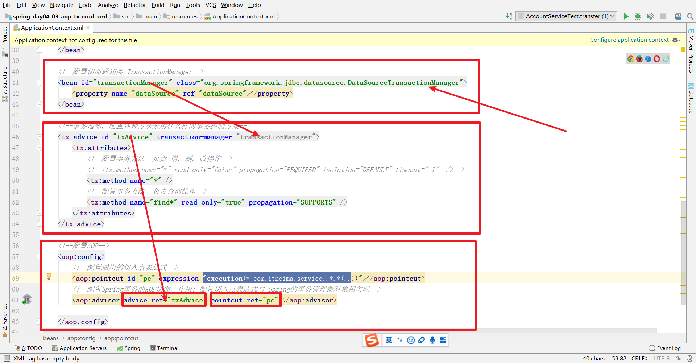
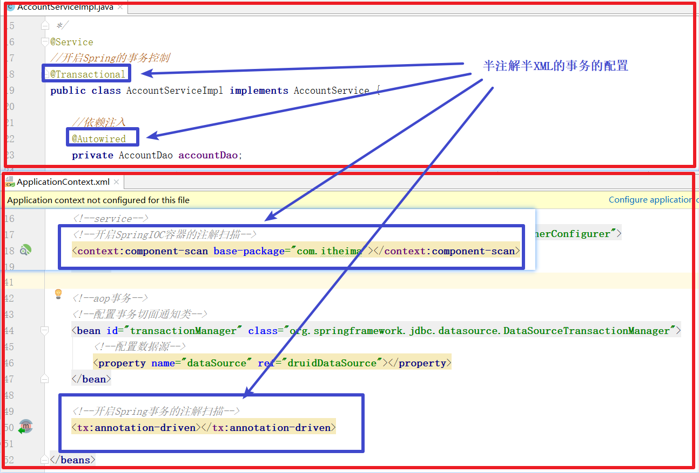
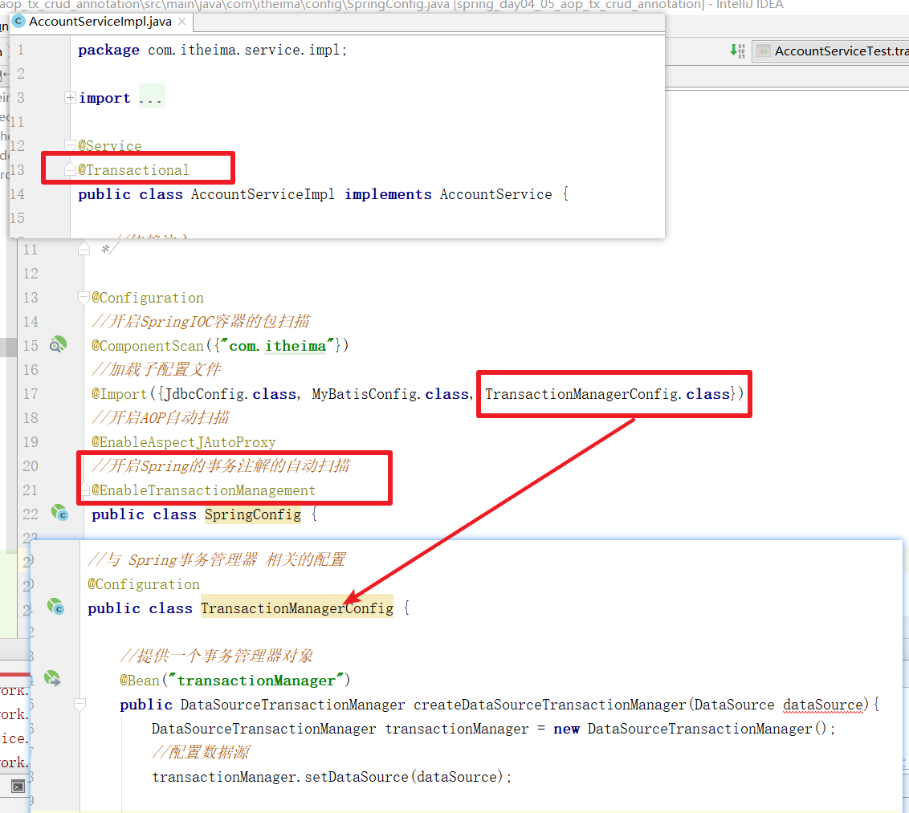

# 1 Spring的AOP案例

## 1.1 案例简介

**案例需求**

实现基于Spring的事务控制。要求使用Spring的IoC和Aop。

**表结构介绍**

```sql
CREATE TABLE `account` (
  `id` int(11) NOT NULL AUTO_INCREMENT,
  `name` varchar(20) DEFAULT NULL,
  `money` double DEFAULT NULL,
  PRIMARY KEY (`id`)
) ENGINE=InnoDB AUTO_INCREMENT=6 DEFAULT CHARSET=utf8 ROW_FORMAT=COMPACT;
```

## 1.2 基于XML的配置实现

### 1.2.1 导入坐标

```xml
<dependencies>
    <dependency>
        <groupId>org.springframework</groupId>
        <artifactId>spring-context</artifactId>
        <version>5.1.9.RELEASE</version>
    </dependency>
    <dependency>
        <groupId>org.aspectj</groupId>
        <artifactId>aspectjweaver</artifactId>
        <version>1.9.4</version>
    </dependency>
    <dependency>
        <groupId>org.mybatis</groupId>
        <artifactId>mybatis</artifactId>
        <version>3.5.2</version>
    </dependency>
    <dependency>
        <groupId>mysql</groupId>
        <artifactId>mysql-connector-java</artifactId>
        <version>5.1.47</version>
    </dependency>
    <dependency>
        <groupId>com.alibaba</groupId>
        <artifactId>druid</artifactId>
        <version>1.1.20</version>
    </dependency>
    <dependency>
        <groupId>org.mybatis</groupId>
        <artifactId>mybatis-spring</artifactId>
        <version>2.0.1</version>
    </dependency>
    <dependency>
        <groupId>org.springframework</groupId>
        <artifactId>spring-jdbc</artifactId>
        <version>5.1.9.RELEASE</version>
    </dependency>
    <dependency>
        <groupId>junit</groupId>
        <artifactId>junit</artifactId>
        <version>4.12</version>
    </dependency>
    <dependency>
        <groupId>org.springframework</groupId>
        <artifactId>spring-test</artifactId>
        <version>5.1.9.RELEASE</version>
    </dependency>
</dependencies>
```

### 1.2.2 编写基础代码

```java
/**
 * 账户的实体类
 * @author 黑马程序员
 * @Company http://www.itheima.com
 */
public class Account {

    private Integer id;
    private String name;
    private Double money;

    //set,get,toString等方法省略
}
```

```java
/*
账户业务层接口
 */
public interface AccountService {

    /**
     * 转账
     */
    void transfer(String source, String target, double money);

    /**
     * 保存
     */
    void save(Account account);

    /**
     * 根据id删除
     */
    void delete(Integer id);

    /**
     * 更新账户
     */
    void update(Account account);

    /**
     * 根据id查询
     */
    Account findById(Integer id);

    /**
     * 根据名称查询账户
     */
    Account findByName(String name);

    /**
     * 查询所有
     */
    List<Account> findAll();
}
```

```java
/**
 * @author 黑马程序员
 * @Company http://www.itheima.com
 */
public class AccountServiceImpl implements AccountService {

    private AccountDao accountDao;

    public void setAccountDao(AccountDao accountDao) {
        this.accountDao = accountDao;
    }
    
    //转账
    @Override
    public void transfer(String source, String target, double money) {
        //1.根据名称查询转出账户
        Account sourceAccount = accountDao.findByName(source);
        //2.根据名称查询转入账户
        Account targetAccount = accountDao.findByName(target);
        //3.转出账户减钱
        sourceAccount.setMoney(sourceAccount.getMoney() - money);
        //4.转入账户加钱
        targetAccount.setMoney(targetAccount.getMoney() + money);
        //5.更新转出账户
        accountDao.update(sourceAccount);
        int i=1/0;//模拟转账异常
        //6.更新转入账户
        accountDao.update(targetAccount);
    }

    @Override
    public void save(Account account) {
        accountDao.save(account);
    }

    @Override
    public void delete(Integer id) {
        accountDao.delete(id);
    }

    @Override
    public void update(Account account) {
        accountDao.update(account);
    }

    @Override
    public Account findById(Integer id) {
        return accountDao.findById(id);
    }

    @Override
    public Account findByName(String name) {
        return accountDao.findByName(name);
    }

    @Override
    public List<Account> findAll() {
        return accountDao.findAll();
    }
}
```

```java
/**
 * 账户的持久层接口
 * @author 黑马程序员
 * @Company http://www.itheima.com
 */
public interface AccountDao {
    /**
     * 保存
     */
    void save(Account account);

    /**
     * 根据id删除
     */
    void delete(Integer id);

    /**
     * 更新账户
     */
    void update(Account account);

    /**
     * 根据id查询
     */
    Account findById(Integer id);

    /**
     * 根据名称查询账户
     */
    Account findByName(String name);

    /**
     * 查询所有
     */
    List<Account> findAll();
}
```

### 1.2.3 编写通知类代码

```java
/**
 * @author 黑马程序员
 * @Company http://www.itheima.com
 */

public class TransactionManager {

    private DataSource dataSource;

    public void setDataSource(DataSource dataSource){
        this.dataSource = dataSource;
    }

    /**
     * 初始化方法
     */
    public void init(){
        TransactionSynchronizationManager.initSynchronization();
    }

    /**
     * 开启事务
     */
    public void begin(){
        try {
            DataSourceUtils.getConnection(dataSource).setAutoCommit(false);
        }catch (Exception e){
            e.printStackTrace();
        }
    }

    /**
     * 提交事务
     */
    public void commit(){
        try {
            DataSourceUtils.getConnection(dataSource).commit();
        }catch (Exception e){
            e.printStackTrace();
        }
    }


    /**
     * 回滚事务
     */
    public void rollback(){
        try {
            DataSourceUtils.getConnection(dataSource).rollback();
        }catch (Exception e){
            e.printStackTrace();
        }
    }


    /**
     * 释放资源
     */
    public void close(){
        try {
            DataSourceUtils.getConnection(dataSource).close();
        }catch (Exception e){
            e.printStackTrace();
        }
    }
}
```

### 1.2.4 编写Mybatis映射配置文件

```xml
<?xml version="1.0" encoding="UTF-8"?>
<!DOCTYPE mapper
        PUBLIC "-//mybatis.org//DTD Mapper 3.0//EN"
        "http://mybatis.org/dtd/mybatis-3-mapper.dtd">
 <mapper namespace="com.itheima.dao.AccountDao">

    <!--配置保存-->
    <insert id="save" parameterType="account">
        insert into account(name,money)values(#{name},#{money})
    </insert>

    <!--配置删除-->
    <delete id="delete" parameterType="int">
        delete from account where id = #{id}
    </delete>

    <!--配置更新-->
    <update id="update" parameterType="account">
        update account set name = #{name} , money = #{money} where id = #{id}
    </update>
     
    <!--配置查询一个-->
    <select id="findById" parameterType="int" resultType="account">
        select * from account where id = #{id}
    </select>

    <!--配置根据名称查询-->
    <select id="findByName" parameterType="string" resultType="account">
        select * from account where name = #{name}
    </select>

    <!--配置查询所有-->
    <select id="findAll" resultType="account">
        select * from account
    </select>
</mapper>
```

### 1.2.5 编写Spring配置文件

```xml
<?xml version="1.0" encoding="UTF-8"?>
<beans xmlns="http://www.springframework.org/schema/beans"
       xmlns:xsi="http://www.w3.org/2001/XMLSchema-instance"
       xmlns:context="http://www.springframework.org/schema/context"
       xmlns:aop="http://www.springframework.org/schema/aop"
       xsi:schemaLocation="http://www.springframework.org/schema/beans
       http://www.springframework.org/schema/beans/spring-beans.xsd
       http://www.springframework.org/schema/context
       https://www.springframework.org/schema/context/spring-context.xsd
       http://www.springframework.org/schema/aop
       https://www.springframework.org/schema/aop/spring-aop.xsd
">
    <!--指定properties文件的位置-->
    <context:property-placeholder location="classpath:jdbc.properties"></context:property-placeholder>

    <!--配置数据源-->
    <bean id="dataSource" class="com.alibaba.druid.pool.DruidDataSource">
        <property name="driverClassName" value="${jdbc.driverClassName}"></property>
        <property name="url" value="${jdbc.url}"></property>
        <property name="username" value="${jdbc.username}"></property>
        <property name="password" value="${jdbc.password}"></property>
    </bean>

    <!--配置整合mybatis的SqlSessionFactoryBean-->
    <bean id="sqlSessionFactory" class="org.mybatis.spring.SqlSessionFactoryBean">
        <!--注入数据源-->
        <property name="dataSource" ref="dataSource"></property>
        <!--指定别名-->
        <property name="typeAliasesPackage" value="com.itheima.pojo"></property>
    </bean>

    <!--配置扫描器，用于创建dao的代理实现类-->
    <bean id="mapperScanner" class="org.mybatis.spring.mapper.MapperScannerConfigurer">
        <!--注入dao接口所在的包-->
        <property name="basePackage" value="com.itheima.dao"></property>
    </bean>

    <!--配置业务层-->
    <bean id="accountService" class="com.itheima.service.impl.AccountServiceImpl">
        <property name="accountDao" ref="accountDao"></property>
    </bean>

    <!--配置事务切面通知类-->
    <bean id="transactionManager" class="com.itheima.utils.TransactionManager" init-method="init">
        <!--注入数据源，为了获取当前线程的连接-->
        <property name="dataSource" ref="dataSource"></property>
    </bean>

    <!--开始aop配置-->
    <aop:config>
        <!--配置通用切入点表达式-->
        <aop:pointcut id="pt" expression="execution(* com.itheima.service.impl.*.*(..))"></aop:pointcut>
        <!--配置增强与切入点表达式绑定->
        <aop:aspect id="transactionManager" ref="transactionManager">
            <!--配置前置通知-->
            <aop:before method="begin" pointcut-ref="pt"></aop:before>
            <!--配置后置通知-->
            <aop:after-returning method="commit" pointcut-ref="pt"></aop:after-returning>
            <!--配置异常通知-->
            <aop:after-throwing method="rollback" pointcut-ref="pt"></aop:after-throwing>
            <!--配置最终通知-->
            <aop:after method="close" pointcut-ref="pt"></aop:after>
        </aop:aspect>
    </aop:config>
</beans>
```

### 1.2.6 测试运行结果

```java
@RunWith(SpringJUnit4ClassRunner.class)
@ContextConfiguration(locations = {"classpath:ApplicationContext.xml"})
public class AccountServiceTest {

    @Autowired
    private AccountService accountService;

    @Test
    public void transfer() {
        accountService.transfer("aaa","bbb",1);
    }

    @Test
    public void save() {
        Account account = new Account();
        account.setName("王小二");
        account.setMoney(666d);

        accountService.save(account);
    }

    @Test
    public void delete() {
        accountService.delete(6);
    }

    @Test
    public void update() {
        Account account = new Account();
        account.setId(5);
        account.setName("王小二");
        account.setMoney(888d);

        accountService.update(account);
    }

    @Test
    public void findById() {
        Account account = accountService.findById(1);
        System.out.println("account = " + account);
    }

    @Test
    public void findByName() {
        Account account = accountService.findByName("迪丽热巴");
        System.out.println("account = " + account);
    }

    @Test
    public void findAll() {
        List<Account> accountList = accountService.findAll();
        for (Account account : accountList) {
            System.out.println("account = " + account);
        }
    }
}
```

## 1.3 基于注解的配置实现

在本小节中，我们将对上一小节的案例进行改造，Spring采用注解驱动的配置方式，mybatis的配置也改造为采用注解方式配置。同时，通知采用环绕通知类型。

### 1.3.1 创建配置类

```java
/**
 * Spring的配置类
 * @author 黑马程序员
 * @Company http://www.itheima.com
 */
@Configuration
@ComponentScan("com.itheima")
@Import({JdbcConfig.class, MybatisConfig.class})
@PropertySource("classpath:jdbc.properties")
@EnableAspectJAutoProxy
public class SpringConfiguration {
}
```

```java
/**
 * 连接数据库的配置类
 * @author 黑马程序员
 * @Company http://www.itheima.com
 */
public class JdbcConfig {

    @Value("${jdbc.driverClassName}")
    private String driverClassName;
    @Value("${jdbc.url}")
    private String url;
    @Value("${jdbc.username}")
    private String username;
    @Value("${jdbc.password}")
    private String password;

    /**
     * 配置数据源
     */
    @Bean("dataSource")
    public DataSource createDataSource(){
        DruidDataSource dataSource = new DruidDataSource();
        dataSource.setDriverClassName(driverClassName);
        dataSource.setUrl(url);
        dataSource.setUsername(username);
        dataSource.setPassword(password);
        return dataSource;
    }

    @Bean("connection")
    public Connection getConnection(DataSource dataSource){
        //1.初始化事务同步管理器
        TransactionSynchronizationManager.initSynchronization();
        //2.使用spring的数据源工具类获取当前线程的连接
        Connection connection = DataSourceUtils.getConnection(dataSource);
        //3.返回
        return connection;
    }
}
```

```java
/**
 * @author 黑马程序员
 * @Company http://www.itheima.com
 */
public class MybatisConfig {

    /**
     * 创建Spring整合Mybatis的工厂Bean
     * @param dataSource
     * @return
     */
    @Bean("sqlSessionFactory")
    public SqlSessionFactoryBean createSqlSessionFactoryBean(DataSource dataSource){
        SqlSessionFactoryBean sqlSessionFactoryBean = new SqlSessionFactoryBean();
        sqlSessionFactoryBean.setDataSource(dataSource);
        sqlSessionFactoryBean.setTypeAliasesPackage("com.itheima.pojo");
        return sqlSessionFactoryBean;
    }

    /**
     * 创建Spring整合Mybatis接管dao代理实现类的扫描器
     * @return
     */
    @Bean("mapperScanner")
    public MapperScannerConfigurer createMapperScannerConfigurer(){
        MapperScannerConfigurer mapperScannerConfigurer = new MapperScannerConfigurer();
        mapperScannerConfigurer.setBasePackage("com.itheima.dao");
        return mapperScannerConfigurer;
    }
}
```

### 1.3.2 修改基础代码用注解配置

```java
/**
 * @author 黑马程序员
 * @Company http://www.itheima.com
 */
@Service("accountService")
public class AccountServiceImpl implements AccountService {

    @Autowired
    private AccountDao accountDao;

     //转账
    @Override
    public void transfer(String source, String target, double money) {
        //1.根据名称查询转出账户
        Account sourceAccount = accountDao.findByName(source);
        //2.根据名称查询转入账户
        Account targetAccount = accountDao.findByName(target);
        //3.转出账户减钱
        sourceAccount.setMoney(sourceAccount.getMoney() - money);
        //4.转入账户加钱
        targetAccount.setMoney(targetAccount.getMoney() + money);
        //5.更新转出账户
        accountDao.update(sourceAccount);
        int i=1/0;//模拟转账异常
        //6.更新转入账户
        accountDao.update(targetAccount);
    }

    @Override
    public void save(Account account) {
        accountDao.save(account);
    }

    @Override
    public void delete(Integer id) {
        accountDao.delete(id);
    }

    @Override
    public void update(Account account) {
        accountDao.update(account);
    }

    @Override
    public Account findById(Integer id) {
        return accountDao.findById(id);
    }

    @Override
    public Account findByName(String name) {
        return accountDao.findByName(name);
    }

    @Override
    public List<Account> findAll() {
        return accountDao.findAll();
    }
}
```

```java
/**
 * 账户的持久层接口
 * @author 黑马程序员
 * @Company http://www.itheima.com
 */
public interface AccountDao {

    /**
     * 保存
     * @param account
     */
    @Insert("insert into account(name,money)values(#{name},#{money})")
    void save(Account account);

    /**
     * 根据id删除
     * @param id
     */
    @Delete("delete from account where id = #{id} ")
    void delete(Integer id);
    
     /**
     * 更新账户
     * @param account
     */
    @Update("update account set name = #{name} , money = #{money} where id = #{id} ")
    void update(Account account);

    /**
     * 根据id查询
     * @param id
     * @return
     */
    @Select("select * from account where id = #{id} ")
    Account findById(Integer id);
    
    /**
     * 根据名称查询账户
     * @param name
     * @return
     */
    @Select("select * from account where name = #{name} ")
    Account findByName(String name);

    /**
     * 查询所有
     * @return
     */
    @Select("select * from account")
    List<Account> findAll();
}
```

### 1.3.3 注解配置AOP

```java
/**
 * @author 黑马程序员
 * @Company http://www.itheima.com
 */
@Component
@Aspect
public class TransactionManager {

    @Autowired
    private Connection connection;

    /**
     * 开启事务
     */
    public void begin(){
        try {
            connection.setAutoCommit(false);
        }catch (Exception e){
            e.printStackTrace();
        }
    }

    /**
     * 提交事务
     */
    public void commit(){
        try {
            connection.commit();
        }catch (Exception e){
            e.printStackTrace();
        }
    }

    /**
     * 回滚事务
     */
    public void rollback(){
        try {
            connection.rollback();
        }catch (Exception e){
            e.printStackTrace();
        }
    }

    /**
     * 释放资源
     */
    public void close(){
        try {
            connection.close();
        }catch (Exception e){
            e.printStackTrace();
        }
    }

    /**
     * 使用环绕通知实现事务控制
     * @param pjp
     * @return
     */
    @Around("execution(* com.itheima.service.impl.*.*(..))")
    public Object transactionAroundAdvice(ProceedingJoinPoint pjp){
        //1.定义返回值对象
        Object rtValue = null;
        try{
            //2.获取参数
            Object[] args = pjp.getArgs();
            //3.调用前置通知：开启事务
            this.begin();
            //4.执行切入点方法
            rtValue = pjp.proceed(args);
            //5.调用后置通知：提交事务
            this.commit();
        }catch (Throwable t){
            //6.调用异常通知：回滚事务
            this.rollback();
            t.printStackTrace();
        }finally {
            //7.调用最终通知：释放资源
            this.close();
        }
        //8.返回
        return rtValue;
    }
}

```

### 1.3.4 测试

```java
@RunWith(SpringJUnit4ClassRunner.class)
@ContextConfiguration(classes = SpringConfig.class)
public class AccountServiceTest {

    @Autowired
    private AccountService accountService;

    @Test
    public void transfer() {
        accountService.transfer("aaa","bbb",1);
    }

    @Test
    public void save() {
        Account account = new Account();
        account.setName("王小二");
        account.setMoney(666d);

        accountService.save(account);
    }

    @Test
    public void delete() {
        accountService.delete(6);
    }

    @Test
    public void update() {
        Account account = new Account();
        account.setId(5);
        account.setName("王小二");
        account.setMoney(888d);

        accountService.update(account);
    }

    @Test
    public void findById() {
        Account account = accountService.findById(1);
        System.out.println("account = " + account);
    }

    @Test
    public void findByName() {
        Account account = accountService.findByName("迪丽热巴");
        System.out.println("account = " + account);
    }

    @Test
    public void findAll() {
        List<Account> accountList = accountService.findAll();
        for (Account account : accountList) {
            System.out.println("account = " + account);
        }
    }
}
```


# 2 Spring中的事务

## 2.1 事务的回顾

### 2.1.1 事务的概念

事务指逻辑上的一组操作，组成这组操作的各个单元，要么全部成功，要么全部不成功。从而确保了数据的准确与安全。

例如：A——B转帐，对应于如下两条sql语句:

```sql
  /*转出账户减钱*/
  update account set money=money-100 where name=‘a’;
  /**转入账户加钱*/
  update account set money=money+100 where name=‘b’;
```

这两条语句的执行，要么全部成功，要么全部不成功。

### 2.1.2 事务的四大特性

- 原子性：一个事务内的操作，要么都成功，要么都失败。很经典的例子：转账，汇款和收款要成功都成功，要失败都失败。
- 一致性：指的是数据的一致性，和原子性其实是一件事情，只不过描述的角度不一样，原子性是从事务的操作的角度，一致性是从数据的角度来描述的，比如转账之前（1000,1000），如果转账100，那么数据状态应该是（900、1100），不应该出现中间状态（900,1000）或者（1000,1100）
- 隔离性：事务并发的时候，比如事务1做的动作给员工涨工资2000块，但是此时事务还没有提交，事务2去查询工资发现工资多了2000块，这就是脏读。解决方法就是建立事务之间的隔离机制。
- 持久性：事务一旦提交，事务提交，变化即生效。即使数据库服务器宕机，那么恢复之后，数据也应该是事务提交之后的状态，不应该回滚到以前了。

### 2.1.3 关于事务并发问题

- 脏读( 读到了 未提交的数据 )
  - 财务人员今天心情不好，状态不好，误操作发起事务1给员工张三本月涨了1w块钱工资，但是还没有提交事务
  - 张三发起事务2，查询当月工资，发现多了1W块钱，涨工资了，财务人员发现不对劲，把操作撤回，把涨工资的事务1给回滚了
- 幻读（幻读出现在增加insert和删除delete的时候）
  - 比如事务1查询工资表中工资为1w的员工的个数（10个员工），此时事务1还没有结束
  - 正在这个时候，事务2，人力部门有两个新员工入职，他们的工资也是1w，人力部门通过事务2向工资表插入了两条记录，并且提交事务了
  - 这个时候，事务1又去查询工资为1w的员工个数，发现多了两个员工（12个人），见鬼了，这种情况就叫做幻读
- 不可重复读（出现在修改update的时候）
  - 员工发起事务1查询工资，工资为1w，事务1尚未关闭
  - 人力部门发起事务2给你涨了工资，涨工资到1.2W（update你的工资表的字段信息），并且提交了事务了。
  - 此时，事务1又再次查询自己的工资，发现工资为1.2W，原有的1w这个数据已经读不到了，这就叫做不可重复读

### 2.1.4 关于事务隔离级别（解决是事务并发问题的）

- 极端模式：读未提交 Read_uncommited，就好比十字路口没有红绿灯一样，效率高，但是风险也高，此时什么事务控制都没有。不要使用这种模式

- 读已提交 Read_commited，顾名思义，其他事务提交之后，才能读取到这个事务提交的数据，这种模式能解决脏读（因为脏读事务是没提交造成的）问题，解决不了幻读和不可重复读（因为这两个问题的产生就是insert delete update的时候提交了事务造成的）

- 可重复读 Repeatable_Read，可以进行数据重复读, 解决了脏读和不可重复读的问题

- 极端模式：串行化：所有的事务一个个来，不争不抢，一个事务处理完了，另外一个事务继续进行，这样不会出现并发问题。比如ATM机

- 默认：DEFAULT，默认是数据库的默认，默认模式来源于上面四种模式之一，mysql数据库默认隔离级别可重复读Repeatable_Read，oracle数据库默认级别读已提交Read_commited

- 设置事务隔离级别

  - read uncommitted    未提交读，脏读，不可重复读，虚读都可能发生.
  - read committed        已提交读，避免脏读，但是不可重复读和虚读有可能发生（Oracle默认）
  - repeatable read   可重复读，避免脏读，不可重复读，但是虚读有可能发生（MySql默认）
  - serializable           串行化的，避免脏读，不可重复读，虚读的发生
  - 查看当前的事务隔离级别：SELECT @@TX_ISOLATION;

  ​

### 2.1.5 关于事务传播行为

我们的事务往往加载service层方法上，那么我们现在的业务简单些，直接service调用dao层方法，以后可能涉及service层方法A()直接调用service层方法B()。那么此时A()和B（）都有自己的事务控制，那么相互调用的时候就会有问题啊，A和B应该有一个关于事务的协商机制，这种机制就叫做事务的传播行为

- ==REQUIRED:如果当前没有事务，就新建一个事务，如果已经存在一个事务中，加入到这个事务中。一般的选择（默认值）==

- ==SUPPORTS:支持当前事务，如果当前没有事务，就以非事务方式执行（没有事务）== 

  ​

## 2.2 Spring中事务的API

### 2.2.1 PlatformTransactionManager接口

- 实现类：org.springframework.jdbc.datasource.DataSourceTransactionManager 使用Spring JDBC或MyBatis 进行持久化数据时使用
- 实现类：org.springframework.orm.hibernate5.HibernateTransactionManager 使用Hibernate版本进行持久化数据时使用
- 配置spring的事务管理对象

```xml
<!-- spring的声明式事务 AOP实现，事务管理类DataSourceTransactionManager-->
<bean id="transactionManager" class="org.springframework.jdbc.datasource.DataSourceTransactionManager">
    <property name="dataSource" ref="druidDataSource"></property>
</bean>
```

### 2.2.2 事务配置相关标签及属性

- 事务配置`<tx:advice>`通知标签
  - 属性id：自定义唯一表示
  - transaction-manager属性：事务管理类，配置事务管理类的id属性值
- 事务属性配置`<tx:attributes>`子标签
  - `<tx:method>`事务方法标签
    - 属性name：方法名
    - 属性read-only：是否只读事务，查询都是只读，其他是非只读; 默认配置为false
    - 属性propagation：事务的传播行为，默认配置REQUIRED或者SUPPORTS
    - 属性isolation：事务隔离级别，默认配置DEFAULT
    - 属性timeout：事务超时时间，配置-1
    - 属性no-rollback-for：遇到什么异常不回滚，配置异常类名，多个类逗号分开
    - 属性rollback-for：遇到什么异常回滚
      - 以上回滚属性不配置，遇到异常就回滚
- aop切面配置`<aop:config>`标签
  - `<aop:advisor>`子标签
    - 属性advice-ref：引用通知(增强)，配置tx:advice标签的属性值
    - 属性pointcut：切点配置


## 2.3 Spring基于XML的事务配置

 

### 2.3.1 配置步骤

##### **第一步：导入坐标**

```xml
<dependencies>
        <dependency>
            <groupId>org.springframework</groupId>
            <artifactId>spring-context</artifactId>
            <version>5.1.9.RELEASE</version>
        </dependency>
        <dependency>
            <groupId>org.aspectj</groupId>
            <artifactId>aspectjweaver</artifactId>
            <version>1.9.4</version>
        </dependency>
        <dependency>
            <groupId>mysql</groupId>
            <artifactId>mysql-connector-java</artifactId>
            <version>5.1.47</version>
        </dependency>
        <dependency>
            <groupId>com.alibaba</groupId>
            <artifactId>druid</artifactId>
            <version>1.1.20</version>
        </dependency>
        <dependency>
            <groupId>org.springframework</groupId>
            <artifactId>spring-jdbc</artifactId>
            <version>5.1.9.RELEASE</version>
        </dependency>
        <dependency>
            <groupId>org.mybatis</groupId>
            <artifactId>mybatis</artifactId>
            <version>3.5.2</version>
        </dependency>
        <dependency>
            <groupId>org.mybatis</groupId>
            <artifactId>mybatis-spring</artifactId>
            <version>2.0.1</version>
        </dependency>
        <dependency>
            <groupId>org.springframework</groupId>
            <artifactId>spring-test</artifactId>
            <version>5.1.9.RELEASE</version>
        </dependency>
        <dependency>
            <groupId>junit</groupId>
            <artifactId>junit</artifactId>
            <version>4.12</version>
        </dependency>
    </dependencies>
```

##### **第二步：编写基础代码**

```java
/**
 * 账户的实体类
 * @author 黑马程序员
 * @Company http://www.itheima.com
 */
public class Account implements Serializable {

    private Integer id;
    private String name;
    private Double money;

    public Integer getId() {
        return id;
    }

    public void setId(Integer id) {
        this.id = id;
    }

    public String getName() {
        return name;
    }

    public void setName(String name) {
        this.name = name;
    }

    public Double getMoney() {
        return money;
    }

    public void setMoney(Double money) {
        this.money = money;
    }
}
```

```java
/**
 * 账户的业务层接口
 * @author 黑马程序员
 * @Company http://www.itheima.com
 */
public interface AccountService {

    /**
     * 转账
     * @param sourceName
     * @param targetName
     * @param money
     */
    void transfer(String sourceName, String targetName, Double money);
}
```

```java
/**
 * @author 黑马程序员
 * @Company http://www.itheima.com
 */

public class AccountServiceImpl implements AccountService {

    private AccountDao accountDao;

    public void setAccountDao(AccountDao accountDao) {
        this.accountDao = accountDao;
    }

    @Override
    public void transfer(String sourceName, String targetName, Double money) {
        //1.根据名称查询转出账户
        Account source = accountDao.findByName(sourceName);
        //2.根据名称查询转入账户
        Account target = accountDao.findByName(targetName);
        //3.转出账户减钱
        source.setMoney(source.getMoney() - money);
        //4.转入账户加钱
        target.setMoney(target.getMoney() + money);
        //5.更新转出账户
        accountDao.update(source);

        //模拟转账异常
        int i = 1 / 0;

        //6.更新转入账户
        accountDao.update(target);
    }

}
```

```java
/**
 * 账户的持久层接口
 * @author 黑马程序员
 * @Company http://www.itheima.com
 */
public interface AccountDao {

    /**
     * 更新账户
     * @param account
     */
    void update(Account account);

    /**
     * 根据名称查询账户
     * @param name
     * @return
     */
    Account findByName(String name);
}
```

##### **第三步：配置Spring的IOC**

```xml
<?xml version="1.0" encoding="UTF-8"?>
<beans xmlns="http://www.springframework.org/schema/beans"
       xmlns:xsi="http://www.w3.org/2001/XMLSchema-instance"
       xmlns:context="http://www.springframework.org/schema/context" xmlns:tx="http://www.springframework.org/schema/tx"
       xmlns:aop="http://www.springframework.org/schema/aop"
       xsi:schemaLocation="http://www.springframework.org/schema/beans
        https://www.springframework.org/schema/beans/spring-beans.xsd
        http://www.springframework.org/schema/context
        https://www.springframework.org/schema/context/spring-context.xsd http://www.springframework.org/schema/tx http://www.springframework.org/schema/tx/spring-tx.xsd http://www.springframework.org/schema/aop https://www.springframework.org/schema/aop/spring-aop.xsd">

    <!--配置service-->
    <bean id="accountService" class="com.itheima.service.impl.AccountServiceImpl">
        <property name="accountDao" ref="accountDao"></property>
    </bean>

    <!--配置properties文件的位置-->
    <context:property-placeholder location="classpath:jdbc.properties"></context:property-placeholder>

    <!--配置数据源-->
    <bean id="dataSource" class="com.alibaba.druid.pool.DruidDataSource">
        <property name="driverClassName" value="${jdbc.driverClassName}"></property>
        <property name="url" value="${jdbc.url}"></property>
        <property name="username" value="${jdbc.username}"></property>
        <property name="password" value="${jdbc.password}"></property>
    </bean>
</beans>
```

##### **第四步：配置Mybatis与Spring的整合：**

```xml
<!--配置mybatis的SqlSessionFactory工厂-->
<bean id="sqlSessionFactoryBean" class="org.mybatis.spring.SqlSessionFactoryBean">
    <property name="dataSource" ref="dataSource"></property>
    <property name="typeAliasesPackage" value="com.itheima.pojo"></property>
</bean>

<!--配置创建dao代理实现类的扫描器-->
<bean id="mapperScanner" class="org.mybatis.spring.mapper.MapperScannerConfigurer">
    <property name="basePackage" value="com.itheima.dao"></property>
</bean>
```

```properties
jdbc.driver=com.mysql.jdbc.Driver
jdbc.url=jdbc:mysql://localhost:3306/ssm_lx
jdbc.username=root
jdbc.password=root
```

```xml
<?xml version="1.0" encoding="UTF-8"?>
<!DOCTYPE mapper
        PUBLIC "-//mybatis.org//DTD Mapper 3.0//EN"
        "http://mybatis.org/dtd/mybatis-3-mapper.dtd">
<mapper namespace="com.itheima.dao.AccountDao">

    <!--配置根据名称查询-->
    <select id="findByName" resultType="account" parameterType="string">
        select * from account where name = #{name}
    </select>
    
    <!--配置更新-->
    <update id="update" parameterType="account">
        update account set name=#{name},money=#{money} where id=#{id}
    </update>
</mapper>
```

##### **第五步：配置事务**

```xml
<!--配置事务步骤：
	  第一步：配置事务管理器
	  第二步：配置事务的通知
	  第三步：配置事务的属性
	  第四步：配置aop切入点表达式和事务通知的关联
-->
<!--配置事务管理器-->
<bean id="transactionManager" class="org.springframework.jdbc.datasource.DataSourceTransactionManager">
      <property name="dataSource" ref="dataSource"></property>
</bean>

<!--配置事务的通知-->
<tx:advice id="txAdvice" transaction-manager="transactionManager">
    <!--配置事务的属性-->
    <tx:attributes>
        <tx:method name="*" propagation="REQUIRED" read-only="false"/>
        <tx:method name="find*" propagation="SUPPORTS" read-only="true"></tx:method>
    </tx:attributes>
</tx:advice>
<!--配置aop-->
<aop:config>
    <!--配置切入点表达式-->
    <aop:pointcut id="pt" expression="execution(* com.itheima.service.impl.*.*(..))"></aop:pointcut>
    <!--配置表达式和事务通知的关联-->
    <aop:advisor advice-ref="txAdvice" pointcut-ref="pt"></aop:advisor>
</aop:config>
```

**第五步：测试结果 **

```java
/**
 * @author 黑马程序员
 * @Company http://www.itheima.com
 */
@RunWith(SpringJUnit4ClassRunner.class)
@ContextConfiguration(locations = "classpath:ApplicationContext.xml")
public class SpringTransactionTest {

    @Autowired
    private AccountService accountService;

    /**
     * 测试转账
     */
    @Test
    public void testTransfer(){
        accountService.transfer("aaa","bbb",100d);
    }
}
```

### 2.3.2 标签详解

**tx:advice**

```xml
<!--
	作用：
		用于配置事务的通知。
	出现位置：
		beans标签内部都可定义
	属性：
		id：为事务通知提供一个唯一标识。
		transaction-manager：为事务通知指定一个事务管理器的id引用。默认值是transactionManager。
-->
<tx:advice id="txAdvice" transaction-manager="transactionManager">
```

**tx:attribute**

```xml
<!--
	作用：
		用于配置事务的属性。
	出现位置：
		要求写在<tx:advice>标签内部
-->
<tx:attributes>
```

**tx:method**

```xml
<!--
	作用：
		用于配置每个需要事务支持的方法，所使用的特征。
	出现位置：
		要求写在<tx:attributes>标签内部
	属性：
		name：指定方法名称。支持通配符的配置方式。例如：*表示所有方法 find*表示以find开头的方法。
		read-only:指定是否为只读事务。默认值：false，表示非只读。只有查询方法可以设置为true。
		propagation:指定事务的传播行为。默认值是REQUIRED，表示必须有事务。查询方法设置为SUPPORTS，表示有事务就支持，没有事务就以非实物
		timeout:指定事务的超时时间。默认值是-1，表示永不超时。取值为正整数，以秒为单位。
		isolation:指定事务的隔离级别。默认值是DEFAULT,表示采用数据库的默认隔离级别，不同数据库的默认隔离级别不一样，mysql为REPEATABLE READ,Oracle为READ COMMITTED。其他取值还有：READ UNCOMMITTED和SERIALIZABLE。隔离级别越高执行效率越低，反之亦然。
		rollback-for:用于指定一个异常，当产生该异常时，事务回滚。产生其他异常时，事务不回滚。没有默认值。即，产生任何异常事务都回滚。
		no-rollback-for:用于指定一个异常，当产生该异常时，事务不回滚。产生其他异常时，事务回滚。没有默认值。即，产生任何异常事务都回滚。
-->
<tx:method name="*" propagation="REQUIRED" read-only="false" timeout="-1" isolation="" rollback-for="" no-rollback-for=""/>
```

**aop:advisor**

```xml
<!--
	作用：
		用于建立通知和切入点表达式的关系
	出现位置：
		要求写在<aop:config>标签内部
	属性：
		id:用于指定通知器的唯一标识
		advice-ref:用于指定通知的引用
		pointcut-ref:用于指定切入点表达式的引用
		pointcut:用于指定切入点表达式
		order:当配置多个advisor，用于指定执行优先级
-->
<aop:advisor advice-ref="txAdvice" pointcut-ref="pt1" id="" pointcut="" order=""></aop:advisor>
```

## 2.4 Spring基于注解的事务配置

 

### 2.4.1 配置步骤 

##### **第一步：导入坐标**

```xml
<dependencies>
    <dependency>
        <groupId>org.springframework</groupId>
        <artifactId>spring-context</artifactId>
        <version>5.1.9.RELEASE</version>
    </dependency>
    <dependency>
        <groupId>org.aspectj</groupId>
        <artifactId>aspectjweaver</artifactId>
        <version>1.9.4</version>
    </dependency>
    <dependency>
        <groupId>mysql</groupId>
        <artifactId>mysql-connector-java</artifactId>
        <version>5.1.47</version>
    </dependency>
    <dependency>
        <groupId>com.alibaba</groupId>
        <artifactId>druid</artifactId>
        <version>1.1.20</version>
    </dependency>
    <dependency>
        <groupId>org.springframework</groupId>
        <artifactId>spring-jdbc</artifactId>
        <version>5.1.9.RELEASE</version>
    </dependency>
    <dependency>
        <groupId>org.mybatis</groupId>
        <artifactId>mybatis</artifactId>
        <version>3.5.2</version>
    </dependency>
    <dependency>
        <groupId>org.mybatis</groupId>
        <artifactId>mybatis-spring</artifactId>
        <version>2.0.1</version>
    </dependency>
    <dependency>
        <groupId>org.springframework</groupId>
        <artifactId>spring-test</artifactId>
        <version>5.1.9.RELEASE</version>
    </dependency>
    <dependency>
        <groupId>junit</groupId>
        <artifactId>junit</artifactId>
        <version>4.12</version>
    </dependency>
</dependencies>
```

##### **第二步：编写基础代码**

```java
/**
 * 账户的实体类
 * @author 黑马程序员
 * @Company http://www.itheima.com
 */
public class Account {

    private Integer id;
    private String name;
    private Double money;

	//省略set,get,toString等方法
}
```

```java
/**
 * 账户的业务层接口
 * @author 黑马程序员
 * @Company http://www.itheima.com
 */
public interface AccountService {

    /**
     * 转账
     * @param sourceName
     * @param targetName
     * @param money
     */
    void transfer(String sourceName, String targetName, Double money);
}
```

```java
/**
 * 账户的持久层接口
 * @author 黑马程序员
 * @Company http://www.itheima.com
 */
public interface AccountDao {

    /**
     * 更新账户
     * @param account
     */
    void update(Account account);

    /**
     * 根据名称查询账户
     * @param name
     * @return
     */
    Account findByName(String name);
}
```

##### **第三步：配置IOC**

```xml
<?xml version="1.0" encoding="UTF-8"?>
<beans xmlns="http://www.springframework.org/schema/beans"
       xmlns:xsi="http://www.w3.org/2001/XMLSchema-instance"
       xmlns:context="http://www.springframework.org/schema/context" xmlns:tx="http://www.springframework.org/schema/tx"
       xmlns:aop="http://www.springframework.org/schema/aop"
       xsi:schemaLocation="http://www.springframework.org/schema/beans
        https://www.springframework.org/schema/beans/spring-beans.xsd
        http://www.springframework.org/schema/context
        https://www.springframework.org/schema/context/spring-context.xsd http://www.springframework.org/schema/tx http://www.springframework.org/schema/tx/spring-tx.xsd http://www.springframework.org/schema/aop https://www.springframework.org/schema/aop/spring-aop.xsd">

    <!--开启SpringIOC容器的注解扫描  @Controller,@Service, @Repository, @Component, @Autowired等注解-->
    <context:component-scan base-package="com.itheima"></context:component-scan>

    <!--配置properties文件的位置-->
    <context:property-placeholder location="classpath:jdbc.properties"></context:property-placeholder>

    <!--配置数据源-->
    <bean id="dataSource" class="com.alibaba.druid.pool.DruidDataSource">
        <property name="driverClassName" value="${jdbc.driverClassName}"></property>
        <property name="url" value="${jdbc.url}"></property>
        <property name="username" value="${jdbc.username}"></property>
        <property name="password" value="${jdbc.password}"></property>
    </bean>

   
</beans>
```

##### **第四步：配置mybatis和spring整合**

```xml
 <!--配置mybatis的SqlSessionFactory工厂-->
<bean id="sqlSessionFactoryBean" class="org.mybatis.spring.SqlSessionFactoryBean">
    <property name="dataSource" ref="dataSource"></property>
    <property name="typeAliasesPackage" value="com.itheima.pojo"></property>
</bean>

<!--配置创建dao代理实现类的扫描器-->
<bean id="mapperScanner" class="org.mybatis.spring.mapper.MapperScannerConfigurer">
    <property name="basePackage" value="com.itheima.dao"></property>
</bean>
```

```properties
jdbc.driver=com.mysql.jdbc.Driver
jdbc.url=jdbc:mysql://localhost:3306/ssm_lx
jdbc.username=root
jdbc.password=root
```

```xml
<?xml version="1.0" encoding="UTF-8"?>
<!DOCTYPE mapper
        PUBLIC "-//mybatis.org//DTD Mapper 3.0//EN"
        "http://mybatis.org/dtd/mybatis-3-mapper.dtd">
<mapper namespace="com.itheima.dao.AccountDao">

    <!--配置根据名称查询-->
    <select id="findByName" resultType="account" parameterType="string">
        select * from account where name = #{name}
    </select>
    <!--配置更新-->
    <update id="update" parameterType="account">
        update account set name=#{name},money=#{money} where id=#{id}
    </update>
</mapper>
```

##### **第五步：配置事务**

```xml
<!--配置事务管理器-->
<bean id="transactionManager" class="org.springframework.jdbc.datasource.DataSourceTransactionManager">
    <property name="dataSource" ref="dataSource"></property>
</bean>


<!--开启Spring的 事务注解扫描 @Transactional-->
<tx:annotation-driven></tx:annotation-driven>

```

```java
/**
 * 在业务层实现类中使用@Transactional注解
 * @author 黑马程序员
 * @Company http://www.itheima.com
 */
@Service("accountService")
@Transactional
public class AccountServiceImpl implements AccountService {

    @Autowired
    private AccountDao accountDao;

    @Override
    public void transfer(String sourceName, String targetName, Double money) {
        //1.根据名称查询转出账户
        Account source = accountDao.findByName(sourceName);
        //2.根据名称查询转入账户
        Account target = accountDao.findByName(targetName);
        //3.转出账户减钱
        source.setMoney(source.getMoney() - money);
        //4.转入账户加钱
        target.setMoney(target.getMoney() + money);
        //5.更新转出账户
        accountDao.update(source);

        //模拟转账异常
        int i = 1 / 0;

        //6.更新转入账户
        accountDao.update(target);
    }

}
```

##### **第六步：测试结果 **

```java
/**
 * @author 黑马程序员
 * @Company http://www.itheima.com
 */
@RunWith(SpringJUnit4ClassRunner.class)
@ContextConfiguration(locations = "classpath:bean.xml")
public class SpringTransactionTest {

    @Autowired
    private AccountService accountService;

    /**
     * 测试转账
     */
    @Test
    public void testTransfer(){
        accountService.transfer("aaa","bbb",100d);
    }
}
```

### 2.4.2 注解详解

**@Transactional**

```java
/**
 * 此注解是Spring注解配置事务的核心注解，无论是注解驱动开发还是注解和XML混合开发。
 * 只有涉及配置事务采用注解的方式，都需要使用此注解。
 * 通过源码我们看到，该注解可以出现在接口上，类上和方法上。分别表明：
 * 		接口上：当前接口的所有实现类中重写接口的方法有事务支持。
 * 		类上：当前类中所有方法有事务支持。
 * 		方法上：当前方法有事务的支持。
 * 		优先级：
 * 			方法上>类上>接口上。
 */
@Target({ElementType.METHOD, ElementType.TYPE})
@Retention(RetentionPolicy.RUNTIME)
@Inherited
@Documented
public @interface Transactional {

}
```

## 2.5 Spring注解驱动的事务开发

spring基于注解驱动开发的事务控制配置，我们可以沿用上一个案例中的基础代码，只需要把xml配置部分改为注解实现。在前面的课程学习中，针对注解驱动配置IoC和AOP已经都讲过了，所以我们只需要改造即可。只是需要一个注解替换掉xml配置文件中的`<tx:annotation-driven transaction-manager="transactionManager"/>`配置。

 

### 2.5.1 改造配置文件

```java
/**
 * spring的配置类，代替applicationContext.xml
 * @author 黑马程序员
 * @Company http://www.itheima.com
 */
@Configuration
@ComponentScan("com.itheima")
@Import({JdbcConfig.class, MybatisConfig.class,TransactionManagerConfig.class})
@PropertySource("classpath:jdbc.properties")
@EnableTransactionManagement//开启spring注解事务的支持
public class SpringConfiguration {
}
```

```java
/**
 * @author 黑马程序员
 * @Company http://www.itheima.com
 */
public class JdbcConfig {

    @Value("${jdbc.driverClassName}")
    private String driverClassName;
    @Value("${jdbc.url}")
    private String url;
    @Value("${jdbc.username}")
    private String username;
    @Value("${jdbc.password}")
    private String password;

    /**
     * 创建数据源并存入Ioc容器
     * @return
     */
    @Bean
    public DataSource createDataSource(){
        DruidDataSource dataSource = new DruidDataSource();
        dataSource.setDriverClassName(driver);
        dataSource.setUrl(url);
        dataSource.setUsername(username);
        dataSource.setPassword(password);
        return dataSource;
    }
}
```

```java
/**
 * mybatis的配置
 * @author 黑马程序员
 * @Company http://www.itheima.com
 */
public class MybatisConfig {

    /**
     * 配置SqlSessionFactoryBean对象
     * @param dataSource
     * @return
     */
    @Bean
    public SqlSessionFactoryBean createSqlSessionFactoryBean(DataSource dataSource){
        //1.创建对象
        SqlSessionFactoryBean sqlSessionFactoryBean = new SqlSessionFactoryBean();
        //2.设置数据源
        sqlSessionFactoryBean.setDataSource(dataSource);
        //3.设置别名
        sqlSessionFactoryBean.setTypeAliasesPackage("com.itheima.pojo");
        //4.返回
        return sqlSessionFactoryBean;
    }

    /**
     * 配置映射扫描配置器，用于扫描dao接口所在的包，创建dao接口的代理实现类并存入ioc容器
     * @return
     */
    @Bean
    public MapperScannerConfigurer createMapperScannerConfigurer(){
        //1.创建对象
        MapperScannerConfigurer mapperScannerConfigurer = new MapperScannerConfigurer();
        //2.设置dao接口所在的包
        mapperScannerConfigurer.setBasePackage("com.itheima.dao");
        //3.返回
        return mapperScannerConfigurer;
    }
}
```

```java
/**
 * 事务管理器的配置类
 * @author 黑马程序员
 * @Company http://www.itheima.com
 */
public class TransactionManagerConfig {

    /**
     * 配置事务管理器
     * @param dataSource
     * @return
     */
    @Bean
    public PlatformTransactionManager createTransactionManager(DataSource dataSource){
        return new DataSourceTransactionManager(dataSource);
    }

}
```

### 2.5.2 @EnableTransactionManagement

**源码**

```java
/**
 * 此注解是Spring支持注解驱动事务配置的标志。
 * 表明Spring开启注解事务配置的支持。
 * 是注解驱动开发事务配置的必备注解。
 * 它是用于替代<tx:annotation-driven transaction-manager="transactionManager"/>标签
 */
@Target(ElementType.TYPE)
@Retention(RetentionPolicy.RUNTIME)
@Documented
@Import(TransactionManagementConfigurationSelector.class)
public @interface EnableTransactionManagement {

}
```


# 3 Spring中的模板

## 3.1 Spring中的模板对象

在Spring框架中，为我们提供了很多模板对象。这些模板对象，把开发中繁琐重复的部分全部进行了封装，使用之后大大的简化了我们开发。同时，降低了我们的上手难度，让我们可以更加简单直接的实现业务需求。这也是我们在Spring框架课程第一天介绍的Spring框架优势中提到的。

Spring框架提供的模板对象有以下这些：

|      对象名称       |                       所在包                        |                             说明                             |
| :-----------------: | :-------------------------------------------------: | :----------------------------------------------------------: |
| TransactionTemplate |       org.springframework.transaction.support       |              用于通过编程实现事务控制的模板对象              |
|    JdbcTemplate     |            org.springframework.jdbc.core            |                  用于简化JDBC操作的模板对象                  |
|    RedisTemplate    |         org.springframework.data.redis.core         |                 用于简化Redis操作的模板对象                  |
|   RabbitTemplate    | org.springframework.amqp.rabbit.core.RabbitTemplate | 用于简化RabbitMQ消息队列操作的模板对象（RabbitMQ后面课程讲解） |
|     JmsTemplate     |            org.springframework.jms.core             |              用于简化ActiveMQ消息队列的模板对象              |
|  HibernateTemplate  |         org.springframework.orm.hibernate5          | 用于简化操作Hibernate框架的模板对象（Hibernate框架现在实际开发中基本已经不用了） |
|    RestTemplate     |           org.springframework.web.client            | 用于简化发送Rest风格请求的模板对象（Rest风格请求在SpringMVC课程中讲解） |

## 3.2 JdbcTemplate对象

### 3.2.1 JDBCTemplate的介绍

JDBCTemplate是一个用于对持久层(DAO)进行简单操作的工具, 与dbutils很像，也是对jdbc进行了一层薄薄的封装;

JDBCTemplate由spring提供的，能更好与spring进行整合

### 3.2.2 JdbcTemplateAPI 介绍

JDBCTemplate API使用方法和QueryRunner基本一致

- 构造方法传递数据源DataSource对象

```properties
public JdbcTemplate(DataSource dataSource) : 构造方法传递数据源DataSource对象
```

- API方法

```properties
update(String sql, Object...obj) : 执行insert，update，delete语句
queryForObject(String sql,RowMapper mapper,Object...obj) : 查询返回单个对象, pojo类型
queryForObject(String sql,Class clazz,Object...obj) : 查询返回单个对象，基本类型及其包装类和字符串
query(String sql,RowMapper mapper,Object...obj) : 查询返回集合对象

补充 : RowMapper接口 实现类BeanPropertyRowMapper，实现了对查询的结果集封装，适用单个对象或者集合查询
```

### 3.2.3 JdbcTemplate使用示例

#### 1）导入坐标

```xml
<dependencies>
        <dependency>
            <groupId>org.springframework</groupId>
            <artifactId>spring-context</artifactId>
            <version>5.1.9.RELEASE</version>
        </dependency>
        <dependency>
            <groupId>mysql</groupId>
            <artifactId>mysql-connector-java</artifactId>
            <version>5.1.47</version>
        </dependency>
        <dependency>
            <groupId>com.alibaba</groupId>
            <artifactId>druid</artifactId>
            <version>1.1.20</version>
        </dependency>
        <dependency>
            <groupId>org.springframework</groupId>
            <artifactId>spring-jdbc</artifactId>
            <version>5.1.9.RELEASE</version>
        </dependency>
        <dependency>
            <groupId>org.springframework</groupId>
            <artifactId>spring-test</artifactId>
            <version>5.1.9.RELEASE</version>
        </dependency>
        <dependency>
            <groupId>junit</groupId>
            <artifactId>junit</artifactId>
            <version>4.12</version>
        </dependency>
    </dependencies>
```

#### 2）编写实体类

```java
/**
 * 账户的实体类
 * @author 黑马程序员
 * @Company http://www.itheima.com
 */
public class Account implements Serializable {

    private Integer id;
    private String name;
    private Double money;

    public Integer getId() {
        return id;
    }

    public void setId(Integer id) {
        this.id = id;
    }

    public String getName() {
        return name;
    }

    public void setName(String name) {
        this.name = name;
    }

    public Double getMoney() {
        return money;
    }

    public void setMoney(Double money) {
        this.money = money;
    }
}
```

#### 3）配置Spring的Ioc

```java
/**
 * spring的配置类，代替applicationContext.xml
 * @author 黑马程序员
 * @Company http://www.itheima.com
 */
@Configuration
@Import(JdbcConfig.class)
@PropertySource("classpath:jdbc.properties")
public class SpringConfiguration {
}
```

```java
/**
 * @author 黑马程序员
 * @Company http://www.itheima.com
 */
public class JdbcConfig {

    @Value("${jdbc.driverClassName}")
    private String driverClassName;
    @Value("${jdbc.url}")
    private String url;
    @Value("${jdbc.username}")
    private String username;
    @Value("${jdbc.password}")
    private String password;

    /**
     * 创建数据源并存入Ioc容器
     * @return
     */
    @Bean
    public DataSource createDataSource(){
        DruidDataSource dataSource = new DruidDataSource();
        dataSource.setDriverClassName(driverClassName);
        dataSource.setUrl(url);
        dataSource.setUsername(username);
        dataSource.setPassword(password);
        return dataSource;
    }

    /**
     * 创建JdbcTemplate对象
     * @param dataSource
     * @return
     */
    @Bean
    public JdbcTemplate createJdbcTemplate(DataSource dataSource){
        return new JdbcTemplate(dataSource);
    }
}
```

```properties
jdbc.driver=com.mysql.jdbc.Driver
jdbc.url=jdbc:mysql://localhost:3306/ssm_lx
jdbc.username=root
jdbc.password=root
```

#### 3）编写测试类

```java
package com.itheima;

import com.itheima.config.SpringConfig;
import com.itheima.pojo.Account;
import org.junit.Test;
import org.junit.runner.RunWith;
import org.springframework.beans.factory.annotation.Autowired;
import org.springframework.jdbc.core.BeanPropertyRowMapper;
import org.springframework.jdbc.core.JdbcTemplate;
import org.springframework.jdbc.core.RowMapper;
import org.springframework.test.context.ContextConfiguration;
import org.springframework.test.context.junit4.SpringJUnit4ClassRunner;

import java.sql.ResultSet;
import java.sql.SQLException;
import java.util.List;

/**
 * 测试类
 */

@RunWith(SpringJUnit4ClassRunner.class)
@ContextConfiguration(classes = SpringConfig.class)
public class JdbcTemplateTest {

    //依赖注入
    @Autowired
    private JdbcTemplate jdbcTemplate;

    //增
    @Test
    public void save() {
        Account account = new Account();
        account.setName("校花");
        account.setMoney(6666d);

        String sql = "insert into account values(?,?,?)";
        Object[] params = {account.getId(), account.getName(), account.getMoney()};

        jdbcTemplate.update(sql, params);
    }

    //删
    @Test
    public void deleteById() {
        String sql = "delete from account where id=?";

        jdbcTemplate.update(sql, 6);
    }

    //改
    @Test
    public void update() {
        Account account = new Account();
        account.setId(7);
        account.setName("校花");
        account.setMoney(66d);

        String sql = "update account set name=?, money=? where id=?";
        Object[] params = {account.getName(), account.getMoney(), account.getId()};

        jdbcTemplate.update(sql, params);
    }

    //根据id查询
    @Test
    public void findById() {
        String sql = "select * from account where id=?";

        Account account = jdbcTemplate.queryForObject(sql, new BeanPropertyRowMapper<>(Account.class), 7);
        System.out.println("account = " + account);
    }

    //查询所有记录的条数
    @Test
    public void findByTotalCount() {
        String sql = "select count(1) from account";

        Integer count = jdbcTemplate.queryForObject(sql, int.class);
        System.out.println("count = " + count);
    }

    //查询所有
    @Test
    public void findAll() {
        String sql = "select * from account";

        List<Account> accountList = jdbcTemplate.query(sql, new BeanPropertyRowMapper<>(Account.class));
        for (Account account : accountList) {
            System.out.println("account = " + account);
        }
    }

    //查询所有 ( sql语句的字段 与 pojo中的属性名 不一致的情况 如何赋值 )
    @Test
    public void findAll2() {
        String sql = "select id ids, name names, money moneys from account";

        List<Account> accountList = jdbcTemplate.query(sql, new RowMapper<Account>() {
            @Override
            public Account mapRow(ResultSet resultSet, int index) throws SQLException {
                Account account = new Account();
                //为当前的account对象赋值
                account.setId( resultSet.getInt("ids") );
                account.setName( resultSet.getString("names") );
                account.setMoney( resultSet.getDouble("moneys") );
                return account;
            }
        });

        for (Account account : accountList) {
            System.out.println("account = " + account);
        }
    }
}
```


