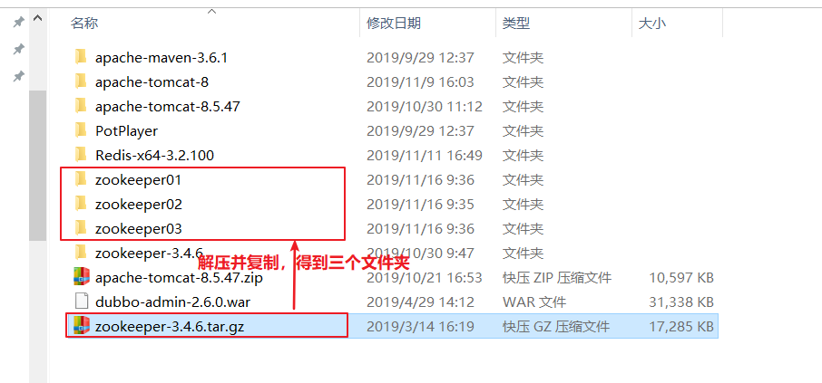

# Zookeeper

## 今日目标

1. 了解zookeeper的基本概念及架构
3. 掌握zookeeper的存储结构及分层命名空间
4. 了解三种安装模式
5. 掌握常用的zookeeper指令
6. 掌握zookeeper的JAVA客户端的使用
7. 了解zookeeper的使用场景
8. 掌握基于zookeeper分布式锁

## 01. 概述

#### 1.1 分布式应用

分布式应用（distributed application）指的是应用程序分布在**不同计算机**上，通过网络来**共同完成**一项任务的工作方式。以javaEE实现一个电商网站为例：

- 单体应用：所有功能都写在一个项目了;打包成一个可运行的war包;部署这个war包就可以完成整个网站所有功能。
- 分布式应用：不同的功能写在不同的项目里；打包成多个可运行的war包；由多个运行的服务共同完成整个网站的完整功能。


​		如上图，这个电商网站包含了用户管理、商品管理、订单管理、支付管理4个模块（也称为服务），在分布式应用里面，许多功能都是多个服务共同协作完成的，服务间如何高效有序地协作就成为分布式开发中一个重要的问题。

- 类比：
  - 单一应用  --> 所有工作都一个人完成
  - 分布式应用  --> 很多工作由多个人共同协作完成

#### 1.2 什么是zookeeper

ZooKeeper是一个分布式的，开放源码的**分布式应用程序协调服务**，是Google的Chubby一个开源的实现，是Hadoop和Hbase的重要组件。它主要是用来解决分布式应用中经常遇到的一些问题。

ZooKeeper从字面意思理解，【Zoo - 动物园，Keeper - 管理员】动物园中有很多种动物，这里的动物就可以比作分布式环境下多种多样的服务，而ZooKeeper做的就是管理这些服务。

#### 1.3 架构

zookeeper的架构如下图所示：


ZooKeeper集群由一组Server节点组成，这一组Server节点中存在一个角色为Leader的节点，其他节点都为Follower。管与zookeeper架构有如下几个要点：

- 读操作，直接读取其中一个Follwer并直接返回，
- 写操作，zookeeper集群会做如下两步处理:
  - 这些请求会被发送到Leader节点上
  - Leader节点上数据变更会同步到集群中其他的Follower节点

- Leader节点在接收到数据变更请求后，首先将变更写入本地磁盘，以作恢复之用。当所有的写请求持久化到磁盘以后，才会将变更应用到内存中。
- 注意**:持久化到硬盘的数据，只是用于服务重启时数据恢复**。
- 当Leader节点出现故障无法正常相应时，集群会自动重新选举一Follwer节点作为Leader。

#### 1.4 存储结构和分层命名空间

ZooKeeper有一个分层的命名空间，结构类似文件系统的目录结构，非常简单而直观。其中，ZNode是最重要的概念。


在ZooKeeper中每个命名空间（Namespace）被称为ZNode，你可以这样理解，每个ZNode包含一个**路径**和与之相关的**属性和数据**，以及继承自该节点的**孩子列表**。与传统文件系统不同的是，**ZooKeeper中的数据保存在内存中**，实现了分布式同步服务的高吞吐和低延迟。

 **ZNode分类及特性：**

##### 1.4.1永久节点和临时节点（Ephemeral）

- 永久节点（默认）：一但创建成功就不会自动消失。
- 临时节点：创建成功后，一但客户端与服务器失去连接，就会自动删除

##### 1.4.2有序节点**（**Sequence Nodes）

​	zookeeper支持创建有序节点，也就是在zNode名称后面自动拼接一个递增的数字。

##### 1.4.3节点的更新与监听（watches）

​	zookeeper客户端可以监听zNode数据的变化,一但zNode的数据发生变化，则自动通知到正在监听的客户端。

##  02. zookeeper安装及常用指令

下载地址：http://archive.apache.org/dist/zookeeper/

本课程使用的Zookeeper版本为3.4.6，下载完成后可以获得名称为zookeeper-3.4.6.tar.gz的压缩文件。既可以在window环境运行，也可以在Linux环境运行。

zookeeper的部署分为单机模式、集群模式和伪集群模式。

一般来讲，**单机模式用于本地测试；集群模式用于生产环境；伪集群模式用于对zookeeper集群的学习**。

#### 2.1 单机模式

单机模式就是只在一台机器上启动一个zookeeper服务，这种模式配置简单，但是有单点故障问题，只适合在本地调试使用。

**部署步骤**：

1. 把 zookeeper 的压缩包（zookeeper-3.4.6.tar.gz），解压缩压缩包。

2. 进入zookeeper-3.4.6目录，创建data目录

   

3. 进入conf目录 ，把zoo_sample.cfg 复制得到zoo.cfg文件。

4. 打开zoo.cfg文件,  修改data属性：dataDir=../data

   

5. 进入Zookeeper的bin目录，双击zkServer.cmd，启动Zookeeper服务


#### 2.2 集群模式（了解即可，无需操作）

为了获得可靠的 ZooKeeper 服务，用户应该在一个集群上部署 ZooKeeper 。只要集群上**大多数**的ZooKeeper 服务启动了，那么总的 ZooKeeper 服务将是可用的。另外，最好使用奇数台机器。 如果 zookeeper拥有 5 台机器，那么它就能处理 2 台机器的故障了。


- 端口说明
  - 2181    Client连接的端口，和单机模式相同
  - 2888    follower 连接到 leader的端口
  - 3888     leader 选举的端口

- myid
  - 用来标记集群中当前服务的身份(1~255)

**部署步骤**

集群模式的部署与单机模式模式类似，只是需要部署到多台机器上 ,再对配置做一些调整。这里以3台机器为例，具体部署步骤如下：

1. 参照单机模式的部署步骤，在3台机器上进行部署

2. 在每个机器的dataDir（zoo.cfg里定义的属性）目录下创建名为myid的文件，并为三台机器上的myid写入不同的数字（1~255）,例如这里三台机器。

   第1台机器myid内容(data/myid):

   ```
   1
   ```

   第2台机器myid内容(data/myid):

   ```
   2
   ```

   第3台机器myid内容(data/myid):

   ```
   3
   ```

   注意：myid里的内容是和zoo.cfg里的`server.xx`相对应的

3. 修改每一台机器的配置文件(zoo.cfg)，完整的配置如下：

   ```properties
   #基本事件单元，以毫秒为单位，它用来指示心跳
   tickTime=2000
   #集群中的follower与leader之间 初始连接 时能容忍的最多心跳数（tickTime的数量）
   initLimit=10
   #集群中的follower与leader之间 请求和应答 之间能容忍的最多心跳数（tickTime的数量）
   syncLimit=5
   
   #存储内存中数据库快照的位置
   dataDir=../data
   #监听客户端连接的端口
   clientPort=2181
   
   #格式 server.id=host:port1:port2
   #用来指出集群中的所有机器；有多少台机器，这里就要有多少条配置
   #id就是机器的myid
   #host就是机器的IP地址
   #第一个端口是从 follower 连接到 leader的端口，
   #第二个端口是用来进行 leader 选举的端口
   server.1=host1:2888:3888
   server.2=host2:2888:3888
   server.3=host3:2888:3888
   ```

   

4. 分别启动三台机器上的zookeeper

#### 2.3 伪集群模式

简单来说，集群伪分布模式就是在单机下模拟集群的ZooKeeper服务。因此需要修改端口来解决端口冲突的问题，如下图所示:


**部署步骤:**

1. 把 zookeeper 的压缩包（zookeeper-3.4.6.tar.gz），解压缩压缩包。并通过复制得到三个文件夹，为了方便演示，这里命名为zookeeper01、zookeeper02、zookeeper03

   

2. 分别进入zookeeper安装目录（zookeeper01、zookeeper02、zookeeper03）,创建data目录。以zookeeper01为例，如下图所示：

   

3. 分别进入三个zookeeper的conf目录 ，把zoo_sample.cfg 复制得到zoo.cfg文件。以zookeeper01为例，如下图所示：

   

4. 分别修改三个配置文件，**三台机器的配置文件唯一不同的属性就是`clientPort`，其他配置文件都一样。**内容如下：

   zookeeper01/config/zoo.cfg

   ```properties
   #基本事件单元，以毫秒为单位，它用来指示心跳
   tickTime=2000
   #集群中的follower与leader之间 初始连接 时能容忍的最多心跳数（tickTime的数量）
   initLimit=10
   #集群中的follower与leader之间 请求和应答 之间能容忍的最多心跳数（tickTime的数量）
   syncLimit=5
   
   #存储内存中数据库快照的位置
   dataDir=../data
   #监听客户端连接的端口
   clientPort=12181
   
   #格式 server.id=host:port1:port2
   #用来指出集群中的所有机器；有多少台机器，这里就要有多少条配置
   #id就是机器的myid
   #host就是机器的IP地址
   #第一个端口是从 follower 连接到 leader的端口，
   #第二个端口是用来进行 leader 选举的端口
   server.1=127.0.0.1:12888:13888
   server.2=127.0.0.1:22888:23888
   server.3=127.0.0.1:32888:33888
   ```

   zookeeper02/config/zoo.cfg

   ```properties
   #基本事件单元，以毫秒为单位，它用来指示心跳
   tickTime=2000
   #集群中的follower与leader之间 初始连接 时能容忍的最多心跳数（tickTime的数量）
   initLimit=10
   #集群中的follower与leader之间 请求和应答 之间能容忍的最多心跳数（tickTime的数量）
   syncLimit=5
   
   #存储内存中数据库快照的位置
   dataDir=../data
   #监听客户端连接的端口
   clientPort=22181
   
   #格式 server.id=host:port1:port2
   #用来指出集群中的所有机器；有多少台机器，这里就要有多少条配置
   #id就是机器的myid
   #host就是机器的IP地址
   #第一个端口是从 follower 连接到 leader的端口，
   #第二个端口是用来进行 leader 选举的端口
   server.1=127.0.0.1:12888:13888
   server.2=127.0.0.1:22888:23888
   server.3=127.0.0.1:32888:33888
   ```

   zookeeper03/config/zoo.cfg

   ```properties
   #基本事件单元，以毫秒为单位，它用来指示心跳
   tickTime=2000
   #集群中的follower与leader之间 初始连接 时能容忍的最多心跳数（tickTime的数量）
   initLimit=10
   #集群中的follower与leader之间 请求和应答 之间能容忍的最多心跳数（tickTime的数量）
   syncLimit=5
   
   #存储内存中数据库快照的位置
   dataDir=../data
   #监听客户端连接的端口
   clientPort=32181
   
   #格式 server.id=host:port1:port2
   #用来指出集群中的所有机器；有多少台机器，这里就要有多少条配置
   #id就是机器的myid
   #host就是机器的IP地址
   #第一个端口是从 follower 连接到 leader的端口，
   #第二个端口是用来进行 leader 选举的端口
   server.1=127.0.0.1:12888:13888
   server.2=127.0.0.1:22888:23888
   server.3=127.0.0.1:32888:33888
   ```

   

5. 分别进入三个zookeeper的data目录,创建名为myid的文件，里内容是三个不同的数字（1~255）,要和zook.cfg里的`server.x`属性相一一对应，用来标记不同的zookeepr节点。

   

6. 分别启动三个zookeeper服务。

#### 2.4 zookeeper指令

​	命名学习阶段，我们**使用单机模式即可**，在学习zookeeper命令前先启动zookeeper（详见2.1节）。

​	启动客户端，在安装目录下，直接双击zkCli.cmd文件，如下图所示。


##### 2.4.1 查询所有命令（help）


##### 2.4.2 *查询节点(ls)


##### 2.4.3 创建节点（create）


##### 2.4.4 *查询节点数据(get)

		

```shell
# ­­­­­­­­­­­节点的状态信息，也称为stat结构体­­­­­­­­­­­­­­­­­­­
# 创建该znode的事务的zxid(ZooKeeper Transaction ID)
# 事务ID是ZooKeeper为每次更新操作/事务操作分配一个全局唯一的id，表示zxid，值越小，表示越先执行
cZxid = 0x4454 # 0x0表示十六进制数0
ctime = Thu Jan 01 08:00:00 CST 1970  # 创建时间
mZxid = 0x4454 						  # 最后一次更新的zxid
mtime = Thu Jan 01 08:00:00 CST 1970  # 最后一次更新的时间
pZxid = 0x4454 						  # 最后更新的子节点的zxid
cversion = 5 						  # 子节点的变化号，表示子节点被修改的次数
dataVersion = 0 					  # 当前节点的变化号，0表示从未被修改过
aclVersion = 0  					  # 访问控制列表的变化号 access control list
# 如果临时节点，表示当前节点的拥有者的sessionId
ephemeralOwner = 0x0				  # 如果不是临时节点，则值为0
dataLength = 13 					  # 数据长度
numChildren = 1 					  # 子节点数据
```


##### 2.4.5 创建有序点(create -s)


##### 2.4.6 创建临时节点(create -e)


**关闭客户端，再次打开查看 app3节点消失(不是立即消失，需要一点时间)**

##### 2.4.7 创建有序临时节点(create -e -s)


##### 2.4.8 修改节点数据(set)

	

##### 2.4.9 删除节点(delete)


##### 2.4.10 递归删除节点(rmr)


## 03. zookeeper的JAVA客户端

- **原生Java API**（不推荐使用）

​       ZooKeeper 原生Java API位于org.apache.ZooKeeper包中

​		ZooKeeper-3.x.x. Jar （这里有多个版本）为官方提供的 java API

- **Apache Curator（推荐使用）**

​       Apache Curator是 Apache ZooKeeper的Java客户端库。 

​       Curator.项目的目标是简化ZooKeeper客户端的使用。

​       例如,在以前的代码展示中,我们都要自己处理ConnectionLossException.   

​      另外 Curator为常见的分布式协同   服务提供了高质量的实现。
​      Apache Curator最初是Netfix研发的,后来捐献了 Apache基金会,目前是 Apache的顶级项目

- **ZkClient（不推荐使用）**

​       Github上一个开源的ZooKeeper客户端，由datameer的工程师Stefan Groschupf和Peter Voss一起开发。        zkclient-x.x.Jar也是在源生 api 基础之上进行扩展的开源 JAVA 客户端。

#### 3.1 初始化项目

1. 使用Idea生成maven项目

   groupId:	com.itheima.study.zk

   artifactId：statudy-zk

   version:	1.0-SNAPSHOT


2. 在pom文件中加入Maven依赖，完整 的pom.xml文件内容如下：

```xml
<?xml version="1.0" encoding="UTF-8"?>
<project xmlns="http://maven.apache.org/POM/4.0.0"
         xmlns:xsi="http://www.w3.org/2001/XMLSchema-instance"
         xsi:schemaLocation="http://maven.apache.org/POM/4.0.0 http://maven.apache.org/xsd/maven-4.0.0.xsd">
    <modelVersion>4.0.0</modelVersion>

    <groupId>com.itheima.study.zk</groupId>
    <artifactId>statudy-zk</artifactId>
    <version>1.0-SNAPSHOT</version>

    <dependencies>
        <!--zookeeper的依赖-->
        <dependency>
            <groupId>org.apache.zookeeper</groupId>
            <artifactId>zookeeper</artifactId>
            <version>3.4.6</version>
        </dependency>
        <!--	zookeeper CuratorFramework 是Netflix公司开发一款连接zookeeper服务的框架，通过封装的一套高级API 简化了ZooKeeper的操作，提供了比较全面的功能，除了基础的节点的操作，节点的监听，还有集群的连接以及重试。-->
        <dependency>
            <groupId>org.apache.curator</groupId>
            <artifactId>curator-framework</artifactId>
            <version>4.0.1</version>
        </dependency>
        <!--    curator-recipes实现了zookeeper所具备的技巧（recipes）。例如：分布式锁、队列-->
        <dependency>
            <groupId>org.apache.curator</groupId>
            <artifactId>curator-recipes</artifactId>
            <version>4.0.1</version>
        </dependency>
    </dependencies>

</project>
```


#### 3.1 实战1：ZK节点CRUD操作

- CuratorFramework类是操作zk节点的入口，有以下几个要点：
  - CuratorFramework使用fluent风格接口。
  - CuratorFramework使用CuratorFrameworkFactory进行分配。 它提供了工厂方法以及构造器创建实例。
  - CuratorFramework实例完全是线程安全的。

- 下面是对zk节点增删改查的操作：

com.itheima.study.zk.crud.CRUDDemo

```java

/**
 * 对zk节点增删改查操作
 */
public class CRUDDemo {
    public static void main(String[] args) throws Exception {

       //超时重连策略，每隔1s重试一次，共重试10次
        RetryPolicy retryPolicy = new RetryNTimes(10,1000);
        //构造zk客户端
        CuratorFramework client = CuratorFrameworkFactory.newClient("127.0.0.1:2181",retryPolicy);
        //启动client
        client.start();

        /////////////////////////////////////查询子节点///////////////////////
        List<String> rootNodes = client.getChildren().forPath("/");
        System.out.println("[查询子节点]根节点："+rootNodes);
        /////////////////////////////////////创建/////////////////////////////
        //1-创建节点（父节点要先存在）
        client.create().forPath("/a");
        //2-创建节点且指定数据（父节点要先存在）
        client.create().forPath("/b","这是b节点的内容".getBytes());
        //3-循环创建，如果父节点不存在则自动创建
        client.create().creatingParentsIfNeeded().forPath("/c/d");
        //4-指定模式
        //CreateMode.PERSISTENT 永久节点(默认)
        client.create().creatingParentsIfNeeded().withMode(CreateMode.PERSISTENT).forPath("/e");
        //CreateMode.PERSISTENT_SEQUENTIAL 永久有序节点
        client.create().creatingParentsIfNeeded().withMode(CreateMode.PERSISTENT_SEQUENTIAL).forPath("/f");
        //CreateMode.EPHEMERAL  临时节点
        client.create().creatingParentsIfNeeded().withMode(CreateMode.EPHEMERAL).forPath("/g");
        //CreateMode.EPHEMERAL_SEQUENTIAL 临时有序节点
        client.create().creatingParentsIfNeeded().withMode(CreateMode.EPHEMERAL_SEQUENTIAL).forPath("/h");

        System.out.println("[创建]完成,根节点："+client.getChildren().forPath("/"));
        System.out.println("[创建]完成，输入任何字符继续……");
        System.in.read();

        /////////////////////////////////////查询//////////////////////////////
        byte[] values = client.getData().forPath("/b");
        System.out.println("[查询]path:/b,value:"+new String(values));

        ////////////////////////////////////修改////////////////////////////////
        client.setData().forPath("/b","这是修改后的b节点内容".getBytes());
        System.out.println("[修改]完成，path:/b,value:"+new String(client.getData().forPath("/b")));

        ///////////////////////////////////删除////////////////////////////////
        //deletingChildrenIfNeeded - 如果有未删除的子节点则先删除子节点
        client.delete().deletingChildrenIfNeeded().forPath("/a");
        client.delete().deletingChildrenIfNeeded().forPath("/b");
        client.delete().deletingChildrenIfNeeded().forPath("/c");
        client.delete().deletingChildrenIfNeeded().forPath("/e");
        System.out.println("[删除]完成,根节点："+client.getChildren().forPath("/"));

        //关闭客户端
        client.close();
    }

}

```

- 执行结果如下图所示


#### 3.2 实战2：zNode监听（watches）

Curator引入了Cache的概念用来实现对ZooKeeper服务器端进行事件监听。共有三种Cache：

- NodeCache				可以监听节点数据变化
- PathChildrenCache     可以监听子节点变化  
- TreeCache                  可以监听节点及子节点变化

这里以NodeCache为例，写一个监听节点数据变化的例子。代码如下：

com.itheima.study.zk.cache.NodeCacheDemo

```java
/**
 * 监听节点变化实例
 */
public class NodeCacheDemo {
    public static void main(String[] args) throws Exception {
        //超时重连策略，每1000毫秒重试一次，重试10次
        RetryPolicy retryPolicy = new RetryNTimes(10, 1000);
        //创建客户端
        CuratorFramework client = CuratorFrameworkFactory.newClient("127.0.0.1:2181", retryPolicy);
        //开启客户端
        client.start();

        //构造nodeCache
        NodeCache nodeCache = new NodeCache(client, "/hello/a");
        //开始监听
        nodeCache.start(true);
        //设置监听回调对象
        nodeCache.getListenable().addListener(new NodeCacheListener() {
            @Override
            public void nodeChanged() throws Exception {
                ChildData currentData = nodeCache.getCurrentData();
                if (null == currentData) {
                    System.out.println("[数据监听]节点删除：" + nodeCache.getPath());
                } else {
                    System.out.println("[数据监听]" + nodeCache.getPath() + ":" + new String(currentData.getData()));
                }
            }
        });
        System.in.read();
      
        //关闭client
        client.close();
    }
}

```

运行时打开zkCli.cmd修改`/hello/a`的data，再删除节点，更新运行结果如下：


## 04.zookeeper使用场景

#### 4.1 分布式锁
##### 4.1.1 为什么使用分布式锁

一个方法在高并发情况下的同一时间只能被同一个线程执行，在传统单体应用单机部署的情况下，可以使用Java并发处理相关的API(如ReentrantLcok或synchronized)进行互斥控制。但是，随着业务发展的需要，原单体单机部署的系统被演化成分布式系统后，由于分布式系统多线程、多进程并且分布在不同机器上，这将使原单机部署情况下的并发控制锁策略失效，为了解决这个问题就需要一种跨JVM的互斥机制来控制共享资源的访问，这就是分布式锁要解决的问题.


##### 4.1.2 基于zookeeper的分布式锁原理

一个分布式锁对应ZooKeeper的一个节点，每个需要获取这个分布式锁的客户端线程在这个节点下创建一个临时有序节点，此时有两种情况：

1. 创建的临时顺序节点是文件夹下的第一个节点，则认为是获取分布式锁成功。

2. 创建的临时顺序节点不是文件夹下的第一个节点，则认为当前锁已经被另一个客户端线程获取，此时需要进入阻塞状态，等待节点**顺序中的前一个节点释放锁的时候唤醒当前线程**。


#### 4.2 配置中心

对于项目中用到的配置信息（例如数据库地址、用户名、密码……）一般有两种处理方式：

- 直接放到项目配置文件里，会有如下缺点：
  - 容易导致敏感信息泄露（例如线上的用户名、密码……）
  - 一但配置信息变化（例如数据库密码变化），需要重新打包上线
- 配置中心，将配置信息维护到配置中心里
  - 流程：
    - 服务启动的时候直接来配置中心获取配置信息
    - 配置信息变化时直接修改配置中心里的数据，配置中心将新的配置信息推送给服务(tomcat),无需重启服务。


#### 4.3 注册中心

在生产环境中需要在一个业务服务器（例如tomcat）中调用另一个业务服务器的接口(例如HTTP接口)，那么就需要知道被调用方的IP地址和端口我们有三种方案:

- IP&端口写死在项目里（不推荐）

  - 优点：简单直接。
  - 缺点：如果被调用方IP地址和端口发生变化或者部署节点的数量发生变化，就需要修改调用方代码重新上线。

  

  - 类比：
    - app1-->同学A
    - app2-->同学B
    - IP+端口-->电话号码
    - 调用-->同学A拨打同学B的电话

- 反向代理服务器，例如nginx

  - 优点：调用方只需要配置Nginx地址，无需关心被调用用者真实的IP地址和端口。

  

  - 类比：
    - nginx	--> 班长
    - 反向代理服务器转发-->同学A让班长捎话给同学B

- **注册中心**,例如zookeeper

  - 优点：调用方无需配置被调用方的IP地址，当被调用方的信息变化可以自动更新。
  - 流程:
    - 注册，app2启动时将IP、端口等信息发送到注册中心
    - app1启动时去注册中心拉取app2的信息(IP、端口等信息)
    - 发起调用（例如HTTP请求）
  - 分布式框架dubbo推荐使用zookeeepr作为注册中心。

  
  
  - 类比:
    - 注册中心 --> 班主任
    - 注册 -->所有同学在入学的时候都将手机号告诉班主任
    - 拉取目标服务器信息再发起调用-->同学A找班主任要同学B的电话号码再拨打电话

#### 4.4 其他

除了上面列举的三种常见使用场景，zookeeper还可以实现名称服务器、队列、barrier（栅栏）、原子类型、选举等功能,在此不再赘述。

## 05  应用场景实战：基于ZK的分布式锁

#### 5.1 核心类


#### 5.2 实战场景

这里我们模拟修改用户积分(score)的操作，如果多个线程同时修改一个用户的积分就会有并发问题，因此需要加入锁来进行控制。

【详见4.1.1】

#### 5.3 代码实现

1. 创建package: com.itheima.study.zk.lock
2. 创建UserDao，提供getScoreFromDb和updateScore两个方法
3. 创建DistributedLockDemo类以及main方法
4. 完善main方法
   1. 实例化zookeeper客户端CuratorFramework
   2. 实例化分布式锁InterProcessLock
   3. 实例化UserDao
   5. 并发执行100遍修改用户积分（score）操作
   6. 输出用户最终的积分（score）
5. 执行查看结果
6. 去除代码中锁的逻辑再次执行并查看结果

- com.itheima.study.zk.lock.UserService

```java
/**
 * 用户DAO层，模拟读写数据库
 */
public class UserDao {
	
    private int score = 0;

    /**
     * 模拟从数据库获取用户积分
     * @return
     */
    public int getScoreFromDb() {
        //模拟网络请求耗时1毫秒
        try {
            Thread.sleep(1L);
        } catch (InterruptedException e) {
            e.printStackTrace();
        }
        //查徐数据
        return score;
    }

    /**
     * 模拟更新数据库里的用户积分
     * @param score
     */
    public void updateScore(int score) {
        //模拟网络请求耗时1毫秒
        try {
            Thread.sleep(1L);
        } catch (InterruptedException e) {
            e.printStackTrace();
        }
        this.score = score;
    }
}

```

- com.itheima.study.zk.lock.DistributedLockDemo

```java
 /**
 * curator实现的分布式锁使用实例
 */
public class DistributedLockDemo {

    public static void main(String[] args) throws InterruptedException {
        //构造超时重试策略，每1s重试一次，重试10次
        RetryPolicy retryPolicy = new RetryNTimes(10,1000);
        //构造客户端
        CuratorFramework client = CuratorFrameworkFactory.newClient("localhost:2181",retryPolicy);
        // 启动客户端
        client.start();

        //构造锁
        InterProcessLock lock = new InterProcessMutex(client,"/user/1/update");

        //构造userDao
        UserDao userDao = new UserDao();

        //并发修改100遍
        for (int i = 0; i < 100; i++) {
            new Thread((new Runnable() {
                @Override
                public void run() {
                    try {
                        //lock.acquire();
                        // 查询当前积分
                        int score = userDao.getScoreFromDb();
                        // 积分加1
                        score++;
                        //更新数据库
                        userDao.updateScore(score);
                    } catch (Exception e) {
                        e.printStackTrace();
                    } finally {
                        try {
                            //lock.release();
                        } catch (Exception e) {
                            e.printStackTrace();
                        }
                    }
                }
            })).start();
        }
        //随眠5s等待任务执行完成
        Thread.sleep(5000L);
        //输出最终的结果
        System.out.println("完成，结果："+userDao.getScoreFromDb());
           
        //关闭client
        client.close();
    }
}
```

- 输出结果


- 注释掉代码中获取锁和释放锁的逻辑


- 再次执行，执行的结果就不是100了，而且每次都不同，这就是并发问题导致的。


