# 学习目标：

- 了解应用架构演进过程
- 了解RPC技术
- 掌握Dubbo框架的架构
- 掌握Zookeeper注册中心的基本使用
- 掌握Dubbo生产者和消费者的开发
- 了解Dubbo的管理控制台的使用
- 了解Dubbo的相关配置

## 1. 应用架构的演进过程

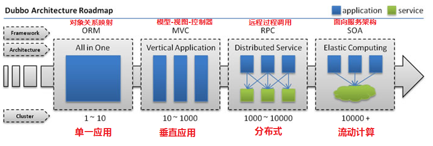

### 单一应用架构

当网站流量很小时，只需一个应用，将所有功能都部署在一起，以减少部署节点和成本。此时，用于简化增删改查工作量的数据访问框架(ORM)是关键。

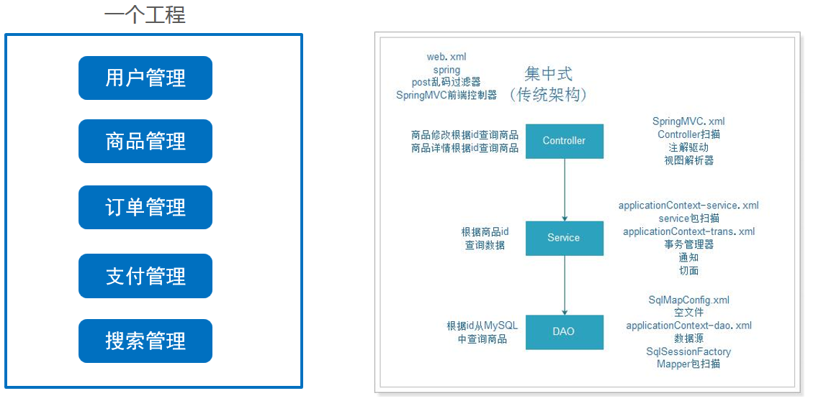

### 垂直应用架构

当访问量逐渐增大，单一应用增加机器带来的加速度越来越小，将应用拆成互不相干的几个应用，以提升效率。此时，用于加速前端页面开发的Web框架(MVC)是关键。

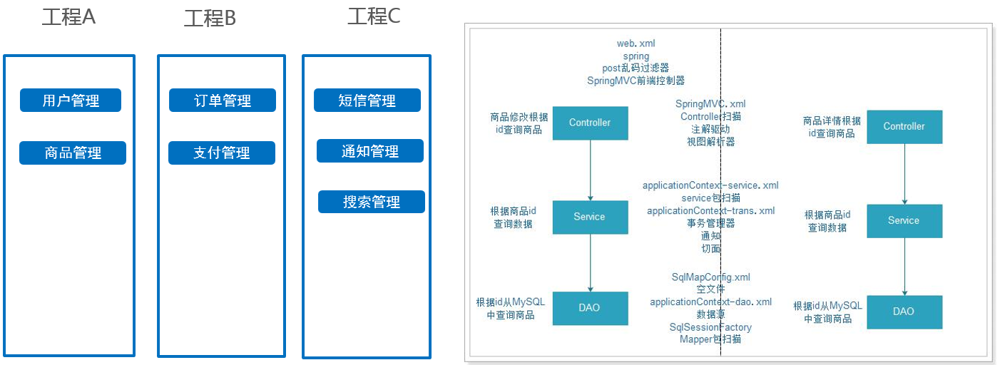

### 分布式服务架构

当垂直应用越来越多，应用之间交互不可避免，将核心业务抽取出来，作为独立的服务，逐渐形成稳定的服务中心，使前端应用能更快速的响应多变的市场需求。此时，用于提高业务复用及整合的分布式服务框架(RPC)是关键。

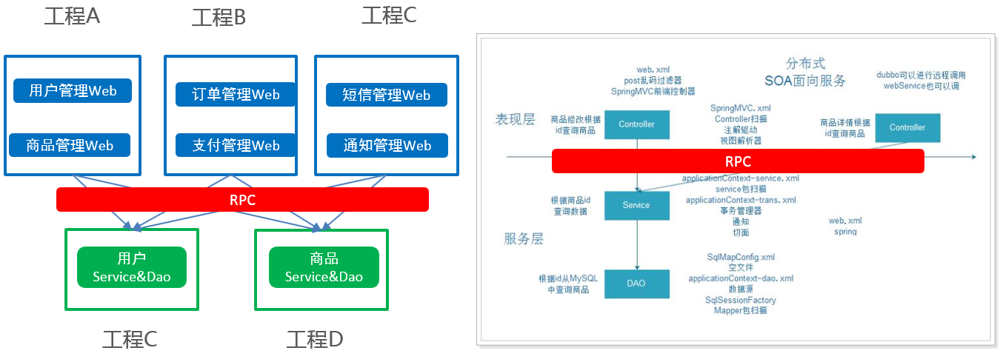

### 流动计算架构

当服务越来越多，容量的评估，小服务资源的浪费等问题逐渐显现，此时需增加一个调度中心基于访问压力实时管理集群容量，提高集群利用率。此时，用于提高机器利用率的资源调度和治理中心(SOA)是关键。

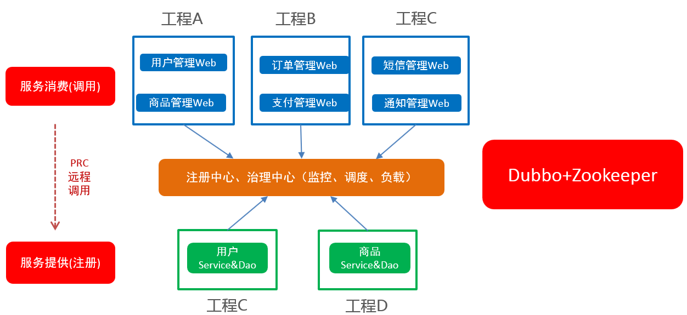

## 2. RPC（远程过程调用）

### RPC介绍

Remote Procedure Call 远程过程调用，是分布式架构的核心，按响应方式分如下两种：

同步调用：客户端调用服务方方法，等待直到服务方返回结果或者超时，再继续自己的操作。

异步调用：客户端把消息发送给中间件，不再等待服务端返回，直接继续自己的操作。

- 是一种进程间的通信方式
- 它允许应用程序调用网络上的另一个应用程序中的方法
- 对于服务的消费者而言，无需了解远程调用的底层细节，是透明的

需要注意的是RPC并不是一个具体的技术，而是指整个网络远程调用过程。

RPC是一个泛化的概念，严格来说一切远程过程调用手段都属于RPC范畴。各种开发语言都有自己的RPC框架。Java中的RPC框架比较多，广泛使用的有RMI、Hessian、Dubbo等。

### RPC组件

简单来说一个RPC架构里包含如下4个组件:

1、 客户端(Client)：服务调用者

2、 客户端存根(Client Stub)：存放服务端地址信息，将客户端的请求参数打包成网络消息，再通过网络发送给服务方

3、 服务端存根(Server Stub)：接受客户端发送过来的消息并解包，再调用本地服务

4、 服务端(Server)：服务提供者。

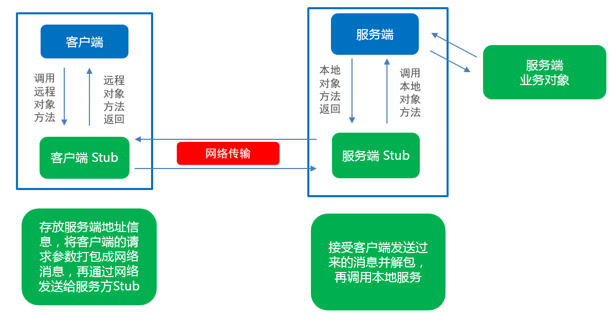

### RPC调用

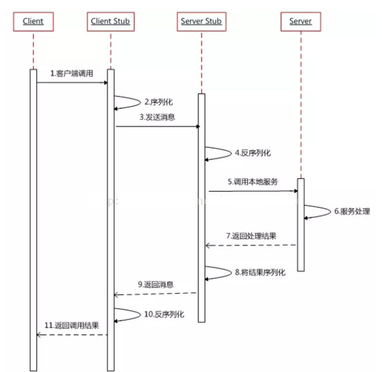

1、 服务调用方（client）调用以本地调用方式调用服务；

2、 client stub接收到调用后负责将方法、参数等组装成能够进行网络传输的消息体

​        在Java里就是序列化的过程

3、 client stub找到服务地址，并将消息通过网络发送到服务端；

4、 server stub收到消息后进行解码,在Java里就是反序列化的过程；

5、 server stub根据解码结果调用本地的服务；

6、 本地服务执行处理逻辑；

7、 本地服务将结果返回给server stub；

8、 server stub将返回结果打包成消息，Java里的序列化；

9、 server stub将打包后的消息通过网络并发送至消费方；

10、 client stub接收到消息，并进行解码, Java里的反序列化；

11、 服务调用方（client）得到最终结果。

## 3. Apache Dubbo概述

###  Dubbo简介

Apache Dubbo是一款高性能的Java RPC框架。其前身是阿里巴巴公司开源的一个高性能、轻量级的开源Java RPC框架，可以和Spring框架无缝集成。

Dubbo官网地址：http://dubbo.apache.org

Dubbo提供了三大核心能力：面向接口的远程方法调用，智能容错和负载均衡，以及服务自动注册和发现。

###  Dubbo的架构

Dubbo架构图（Dubbo官方提供）如下：

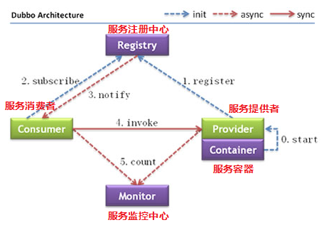

节点角色说明：

| 节点        | 角色名称                |
| --------- | ------------------- |
| Provider  | 暴露服务的服务提供方          |
| Consumer  | 调用远程服务的服务消费方        |
| Registry  | 服务注册与发现的注册中心        |
| Monitor   | 统计服务的调用次数和调用时间的监控中心 |
| Container | 服务运行容器              |

虚线都是异步访问，实线都是同步访问
蓝色虚线:在启动时完成的功能
红色虚线(实线)都是程序运行过程中执行的功能

调用关系说明:

0. 服务容器负责启动，加载，运行服务提供者。

1. 服务提供者在启动时，向注册中心注册自己提供的服务。
2. 服务消费者在启动时，向注册中心订阅自己所需的服务。
3. 注册中心返回服务提供者地址列表给消费者，如果有变更，注册中心将基于长连接推送变更数据给消费者。
4. 服务消费者，从提供者地址列表中，基于软负载均衡算法，选一台提供者进行调用，如果调用失败，再选另一台调用。
5. 服务消费者和提供者，在内存中累计调用次数和调用时间，定时每分钟发送一次统计数据到监控中心。

### Zookeeper注册中心

Zookeeper分层命名空间：

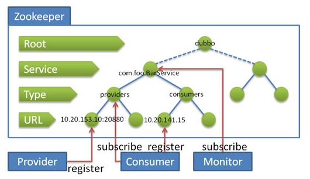

流程说明：

- 服务提供者(Provider)启动时: 向 `/dubbo/com.foo.BarService/providers` 目录下写入自己的 URL 地址
- 服务消费者(Consumer)启动时: 订阅 `/dubbo/com.foo.BarService/providers` 目录下的提供者 URL 地址。并向 `/dubbo/com.foo.BarService/consumers` 目录下写入自己的 URL 地址
- 监控中心(Monitor)启动时: 订阅 `/dubbo/com.foo.BarService` 目录下的所有提供者和消费者 URL 地址

## 4. Dubbo快速开发

Dubbo作为一个RPC框架，其最核心的功能就是要实现跨网络的远程调用，服务提供者、服务消费者会使用共同的接口，故本小节先创建一个父工程，父工程下有3个子模块，一个是接口模块，一个是服务提供者模块，一个是服务消费者模块。通过Dubbo来实现服务消费方远程调用服务提供方的方法。

实现步骤：

        1. 创建父工程，基于maven,不选择任何骨架，工程名：study-dubbo
        2. 创建接口模块，在父工程的基础上，不选择任何骨架，模块名：dubbo-interface
        3. 创建服务提供者模块，在父工程的基础上，使用webapp骨架，模块名：dubbo-provider
        4. 创建消费者模块，在父工程的基础上，使用webapp骨架，模块名：dubbo-consumer

### 1. 创建父工程

​     父工程，不实现任何代码，主要是添加工程需要的库的依赖管理（DependencyManagement），依赖管理就是解决项目中多个模块间公共依赖的版本号、scope的控制范围。本项目需要使用spring-webmvc，使用dubbo（务必2.6.2以上版本）、zookeeper及其客户端（curator-framework）依赖库。

+ 不选择任何骨架

+ GroupID:com.itheima.study.dubbo

+ ArtifactId:study-dubbo

+ project name:studydubbo

  1. 创建完工程后，如图所示：

  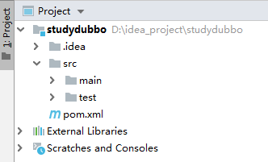

  2. 父工程不实现任何代码，删除 src 目录，如图所示：

  

  3. 修改pom.xml，抽取版本、增加赖库依赖管理，全部内容如下：

  ```xml
  <?xml version="1.0" encoding="UTF-8"?>
  <project xmlns="http://maven.apache.org/POM/4.0.0"
           xmlns:xsi="http://www.w3.org/2001/XMLSchema-instance"
           xsi:schemaLocation="http://maven.apache.org/POM/4.0.0 http://maven.apache.org/xsd/maven-4.0.0.xsd">
      <modelVersion>4.0.0</modelVersion>
  
      <groupId>com.itheima.study.dubbo</groupId>
      <artifactId>study-dubbo</artifactId>
      <version>1.0-SNAPSHOT</version>
      <properties>
          <spring.version>5.0.5.RELEASE</spring.version>
          <dubbo.version>2.6.2</dubbo.version>
          <zookeeper.version>3.4.13</zookeeper.version>
          <curator-framework.version>4.0.1</curator-framework.version>
      </properties>
      <dependencyManagement>
          <dependencies>
              <!--spring webmvc-->
              <dependency>
                  <groupId>org.springframework</groupId>
                  <artifactId>spring-webmvc</artifactId>
                  <version>${spring.version}</version>
              </dependency>
              <!--dubbo-->
              <dependency>
                  <groupId>com.alibaba</groupId>
                  <artifactId>dubbo</artifactId>
                  <version>${dubbo.version}</version>
              </dependency>
              <!--zookeeper-->
              <dependency>
                  <groupId>org.apache.zookeeper</groupId>
                  <artifactId>zookeeper</artifactId>
                  <version>${zookeeper.version}</version>
              </dependency>
              <!--zookeeper client-->
              <dependency>
                  <groupId>org.apache.curator</groupId>
                  <artifactId>curator-framework</artifactId>
                  <version>${curator-framework.version}</version>
              </dependency>
          </dependencies>
      </dependencyManagement>
  </project>
  ```

  依赖管理，仅仅配置依赖关系，不会导入具体的库依赖包，只有子模块具体需要时，才会导入jar包。

  如图所示：

  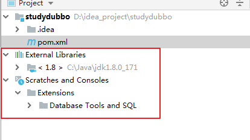

### 2. 创建接口模块

此模块，主要放业务接口的定义，它是服务消费者模块和服务提供者模块的公共依赖模块。

- 在当前父工程的基础上创建子模块
- 不选择任何骨架
- GroupID:com.itheima.study.dubbo
- ArtifactId:dubbo-interface
- moudule name:dubbo-interface

1. 创建子模块：

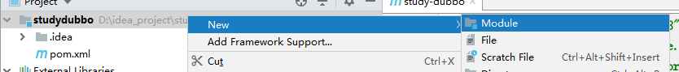

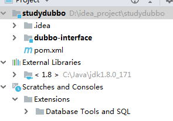


2. 修改pom.xml，增加打包方式

   ```xml
   <packaging>jar</packaging>
   ```

   如图所示：

   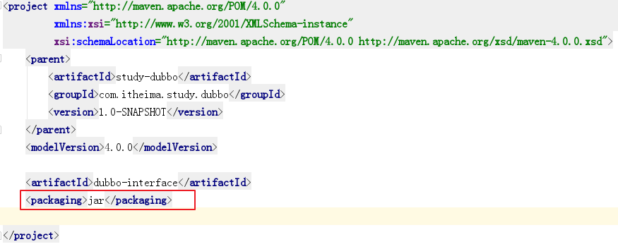

3. 创建包com.itheima.study.dubbo.service

4. 增加用户业务接口

```java
public interface UserSerivce {
	/**
	 * 登录方法
	 * @param username 用户名
	 * @param password 密码
	 * @return
	 */
	public boolean login(String username,String password);
}

```

如图所示：

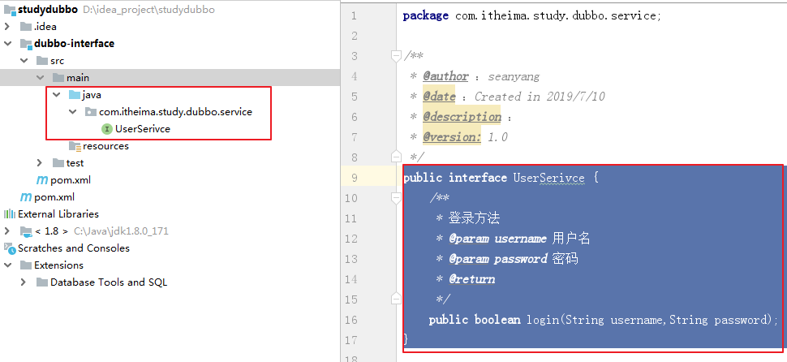

### 3. 服务提供者模块

此模块是服务提供者模块，需要在容器启动时，把服务注册到zookeeper,故需要引入spring-webmvc,zookeeper及客户端依赖。

**实现步骤：**

1. 创建子模块dubbo-provider，使用webapp骨架，导入依赖坐标spring-webmvc、zookeeper及客户端和编译插件tomcat7

2. 创建java源代码目录，并增加com.itheima.study.dubbo.service.impl包及创建UserServiceImpl实现类

    业务实现类UserServiceImpl，需要实现UserService接口

3. 创建resources资源目录，并创建spring-dubbo-provider.xml 配置文件：
   - 配置dubbo的应用名称
   - 配置dubbo注册中心Zookeeper地址
   - 配置dubbo协议名称和服务端口
   - 配置dubbo注解包扫描
   - 配置spring自动扫描
   - 配置需要暴露的业务接口及实例

4. 将资料的log4j.properties配置文件拷贝到resources目录下

5. 在web.xml文件中，配置spring监听器，指定spring配置文件加载位置

6. 启动服务提供者

**实现过程：**

#### 1. 创建子模块dubbo-provider

- 在当前父工程的基础上创建子模块
- 选择webapp骨架


- GroupID:com.itheima.study.dubbo
- ArtifactId:dubbo-provider
- moudule name:dubbo-provider

工程创建完成后，如图所示：

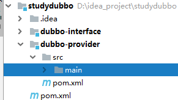

修改pom.xml文件，增加依赖库，删除build标签中的pluginManagement,新增编译插件tomcat7，端口6001

~~~xml
<?xml version="1.0" encoding="UTF-8"?>

<project xmlns="http://maven.apache.org/POM/4.0.0" xmlns:xsi="http://www.w3.org/2001/XMLSchema-instance"
         xsi:schemaLocation="http://maven.apache.org/POM/4.0.0 http://maven.apache.org/xsd/maven-4.0.0.xsd">
    <parent>
        <artifactId>study-dubbo</artifactId>
        <groupId>com.itheima.study.dubbo</groupId>
        <version>1.0-SNAPSHOT</version>
    </parent>
    <modelVersion>4.0.0</modelVersion>

    <artifactId>dubbo-provider</artifactId>
    <packaging>war</packaging>
    <name>dubbo-provider</name>

    <properties>
        <project.build.sourceEncoding>UTF-8</project.build.sourceEncoding>
        <maven.compiler.source>1.7</maven.compiler.source>
        <maven.compiler.target>1.7</maven.compiler.target>
    </properties>

    <dependencies>
        <dependency>
            <groupId>junit</groupId>
            <artifactId>junit</artifactId>
            <version>4.11</version>
            <scope>test</scope>
        </dependency>
        <dependency>
            <groupId>com.itheima.study.dubbo</groupId>
            <artifactId>dubbo-interface</artifactId>
            <version>1.0-SNAPSHOT</version>
        </dependency>
        <dependency>
            <groupId>org.springframework</groupId>
            <artifactId>spring-webmvc</artifactId>
        </dependency>
        <dependency>
            <groupId>com.alibaba</groupId>
            <artifactId>dubbo</artifactId>
        </dependency>
        <dependency>
            <groupId>org.apache.zookeeper</groupId>
            <artifactId>zookeeper</artifactId>
        </dependency>
        <dependency>
          <groupId>org.apache.curator</groupId>
          <artifactId>curator-framework</artifactId>
        </dependency>
    </dependencies>

    <build>
        <finalName>dubbo-provider</finalName>

        <plugins>
            <plugin>
                <artifactId>tomcat7-maven-plugin</artifactId>
               <groupId>org.apache.tomcat.maven</groupId>
                <configuration>
                    <path>/</path>
                    <port>6001</port>
                </configuration>
            </plugin>
        </plugins>

    </build>
</project>

~~~

#### 2. 初始化java资源目录

在main下,创建子目录java（刷新maven工程）,增加com.itheima.study.dubbo.service.impl包及创建UserServiceImpl实现类

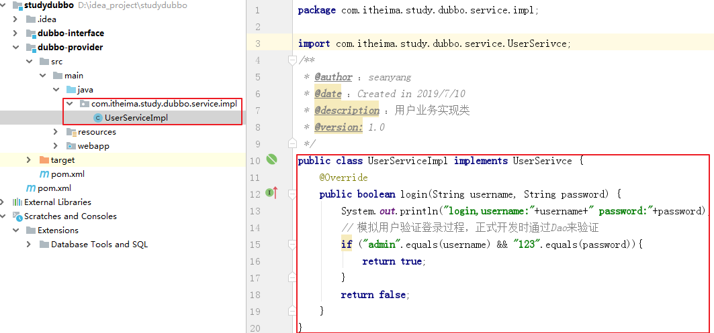

#### 3. 初始化resources目录

在main下,创建子目录resources目录，在resources目录下创建spring-dubbo-provider.xml 配置文件和log4j的配置文件。

引用dubbo命名空间时，注意如图所示：

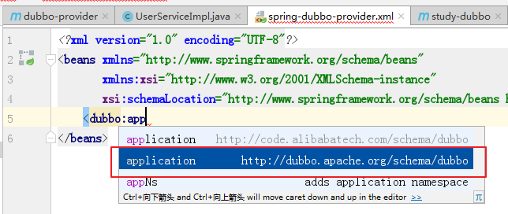

- 配置dubbo的应用名称
- 配置dubbo注册中心Zookeeper地址
- 配置dubbo协议名称和服务端口（仅服务提供者配置）
- 配置dubbo注解包扫描
- 配置spring自动扫包，后续使用Dao相关内容使用
- 配置需要暴露的业务接口及实例

最终spring-dubbo-provider.xml文件，如下：

```xml
<?xml version="1.0" encoding="UTF-8"?>
<beans xmlns="http://www.springframework.org/schema/beans"
       xmlns:xsi="http://www.w3.org/2001/XMLSchema-instance"
       xmlns:dubbo="http://dubbo.apache.org/schema/dubbo" xmlns:context="http://www.springframework.org/schema/context"
       xsi:schemaLocation="http://www.springframework.org/schema/beans http://www.springframework.org/schema/beans/spring-beans.xsd http://dubbo.apache.org/schema/dubbo http://dubbo.apache.org/schema/dubbo/dubbo.xsd http://www.springframework.org/schema/context http://www.springframework.org/schema/context/spring-context.xsd">

    <!--spring自动扫包，后续Dao使用-->
    <context:component-scan base-package="com.itheima.study"/>

    <!-- dubbo基本配置-->
    <dubbo:application name="dubbo-provider"/>
    <dubbo:registry address="zookeeper://127.0.0.1:2181"/>
    <dubbo:protocol name="dubbo" port="8888"/>

    <!-- dubbo自动扫包，注解时使用-->
    <dubbo:annotation package="com.itheima.study.dubbo.service.impl"/>

        <!--指定暴露的服务接口及实例-->
        <dubbo:service interface="com.itheima.study.dubbo.service.UserSerivce" ref="userSerivce"/>
        <!--配置业务类实例-->
        <bean id="userSerivce" class="com.itheima.study.dubbo.service.impl.UserServiceImpl"/>
</beans>
```

将资料的log4j.properties配置文件拷贝到resources目录下

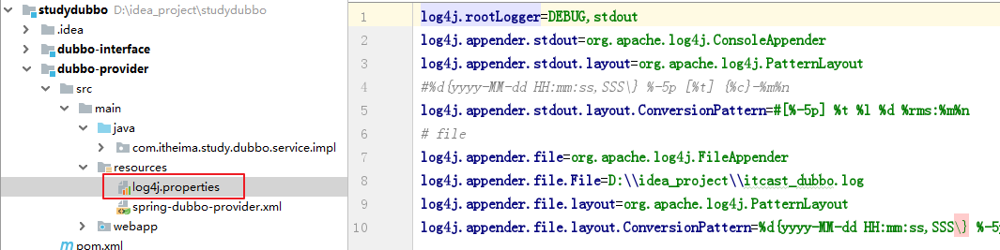

#### 4. 配置web.xml文件

~~~xml
<!DOCTYPE web-app PUBLIC
 "-//Sun Microsystems, Inc.//DTD Web Application 2.3//EN"
 "http://java.sun.com/dtd/web-app_2_3.dtd" >

<web-app>
  <display-name>Archetype Created Web Application</display-name>
  <context-param>
    <param-name>contextConfigLocation</param-name>
    <param-value>classpath:spring-*.xml</param-value>
  </context-param>
  <listener>
    <listener-class>org.springframework.web.context.ContextLoaderListener</listener-class>
  </listener>
</web-app>

~~~

#### 5. 启动服务提供者

需要在父工程整体clean、install后，在子模块使用tomcat7插件运行

1、父工程clean、install

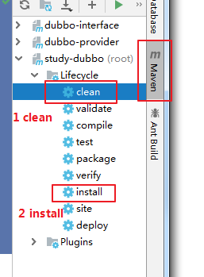

2、启动当前应用，启动后默认注册服务到zookeeper注册中心

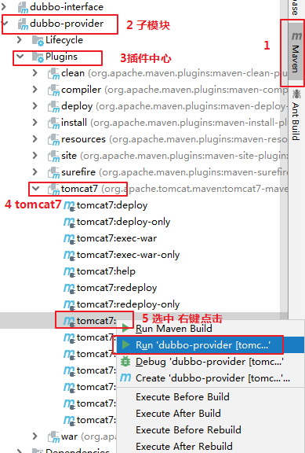

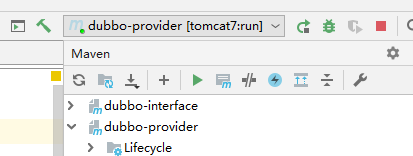

3、检查是否注册到zookeeper

登录zookeeper客户端，直接查看ls /dubbo/com.itheima.study.dubbo.service.UserService节点

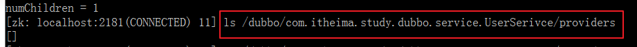

+ 如果 /dubbo下面没有这个节点，说明没有注册上，

+ 如果有，内容是空，说明已经掉线

+ 正常注册并连接在线，如果所示：

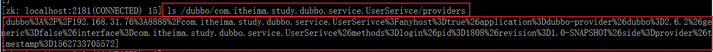

注意：

+ 消费者与提供者应用名称不能相同
+ 如果有多个服务提供者，名称不能相同，通信端口也不能相同
+ 只有服务提供者才会配置服务发布的协议

### 4. 服务消费者模块

此模块是服务消费者模块，此模块基于是Web应用，需要引入spring-webmvc，需要在容器启动时，去zookeeper注册中心订阅服务,需要引入zookeeper及客户端依赖。

**实现步骤：**

1. 创建子模块dubbo-consumer，使用webapp骨架，导入依赖坐标spring-webmvc、zookeeper及客户端和编译插件tomcat7

2. 创建java源代码目录，并增加com.itheima.study.dubbo.controller包及创建UserController类

    控制器类UserController，提供web方法login

3. 创建resources资源目录，并创建spring-dubbo-consumer.xml 配置文件：

   - 配置dubbo的应用名称
   - 配置dubbo注册中心Zookeeper地址
   - ~~配置dubbo协议名称和服务端口（消费者无需配置）~~
   - 配置dubbo注解包扫描
   - 配置spring自动扫描
   - 配置需要订阅的业务接口及引用

4. 将资料的log4j.properties配置文件拷贝到resources目录下

5. 在web.xml文件中，配置SpringMVC

6. 启动服务消费者，并测试访问

**实现过程：**

#### 1. 创建子模块dubbo-consumer

- 在当前父工程的基础上创建子模块
- 选择webapp骨架


- GroupID:com.itheima.study.dubbo
- ArtifactId:dubbo-consumer
- moudule name:dubbo-consumer

工程创建完成后，如图所示：

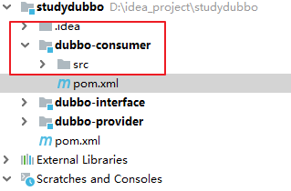

修改pom.xml文件，增加依赖库，删除build标签中的pluginManagement,新增编译插件tomcat7,端口6002

```xml
<?xml version="1.0" encoding="UTF-8"?>

<project xmlns="http://maven.apache.org/POM/4.0.0" xmlns:xsi="http://www.w3.org/2001/XMLSchema-instance"
         xsi:schemaLocation="http://maven.apache.org/POM/4.0.0 http://maven.apache.org/xsd/maven-4.0.0.xsd">
    <parent>
        <artifactId>study-dubbo</artifactId>
        <groupId>com.itheima.study.dubbo</groupId>
        <version>1.0-SNAPSHOT</version>
    </parent>
    <modelVersion>4.0.0</modelVersion>

    <artifactId>dubbo-consumer</artifactId>
    <packaging>war</packaging>

    <name>dubbo-consumer</name>

    <properties>
        <project.build.sourceEncoding>UTF-8</project.build.sourceEncoding>
        <maven.compiler.source>1.7</maven.compiler.source>
        <maven.compiler.target>1.7</maven.compiler.target>
    </properties>

    <dependencies>
        <dependency>
            <groupId>junit</groupId>
            <artifactId>junit</artifactId>
            <version>4.11</version>
            <scope>test</scope>
        </dependency>
        <dependency>
          <artifactId>dubbo-interface</artifactId>
          <groupId>com.itheima.study.dubbo</groupId>
          <version>1.0-SNAPSHOT</version>
        </dependency>
        <dependency>
          <groupId>org.springframework</groupId>
          <artifactId>spring-webmvc</artifactId>
        </dependency>
        <dependency>
          <groupId>com.alibaba</groupId>
          <artifactId>dubbo</artifactId>
        </dependency>
        <dependency>
          <groupId>org.apache.zookeeper</groupId>
          <artifactId>zookeeper</artifactId>
        </dependency>
        <dependency>
          <groupId>org.apache.curator</groupId>
          <artifactId>curator-framework</artifactId>
        </dependency>
    </dependencies>

    <build>
        <finalName>dubbo-consumer</finalName>
        <plugins>
            <plugin>
                <artifactId>tomcat7-maven-plugin</artifactId>
               <groupId>org.apache.tomcat.maven</groupId>
                <configuration>
                    <path>/</path>
                    <port>6002</port>
                </configuration>
            </plugin>
        </plugins>
    </build>
</project>
```

#### 2. 初始化java资源目录

在main下,创建子目录java（刷新maven工程）,增加com.itheima.study.dubbo.controller包及创建UserController控制类（通过配置文件初始化），该类调用远程业务UserService实现登录。

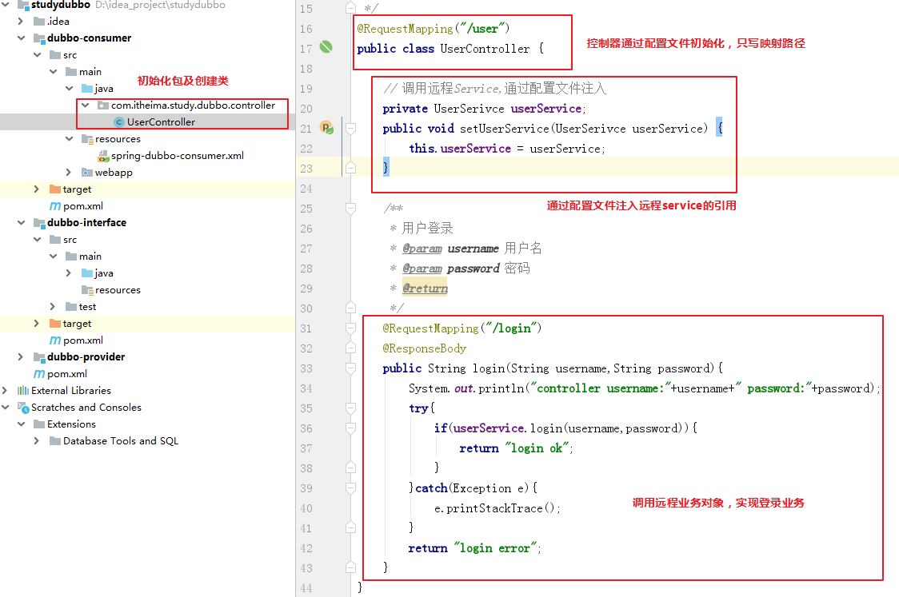

#### 3. 初始化resources资源目录

在main下,创建子目录resources目录，在resources目录下创建spring-dubbo-consumer.xml 配置文件和log4j的配置文件。

引用dubbo命名空间时，注意如图所示：


- 配置dubbo的应用名称
- 配置dubbo注册中心Zookeeper地址
- 配置dubbo注解包扫描，后续注解远程Service时使用
- 配置spring自动扫包，后续注解控制器相关内容使用
- 配置需要暴露的业务接口及实例

最终spring-dubbo-provider.xml文件，如下：

```xml
<?xml version="1.0" encoding="UTF-8"?>
<beans xmlns="http://www.springframework.org/schema/beans"
       xmlns:xsi="http://www.w3.org/2001/XMLSchema-instance" xmlns:dubbo="http://dubbo.apache.org/schema/dubbo"
       xmlns:context="http://www.springframework.org/schema/context"
       xsi:schemaLocation="http://www.springframework.org/schema/beans http://www.springframework.org/schema/beans/spring-beans.xsd http://dubbo.apache.org/schema/dubbo http://dubbo.apache.org/schema/dubbo/dubbo.xsd http://www.springframework.org/schema/context http://www.springframework.org/schema/context/spring-context.xsd">
    <!--spring自动扫包，使用注解时使用-->
    <context:component-scan base-package="com.itheima.study.dubbo.controller"/>

    <!-- dubbo基本配置-->
    <dubbo:application name="dubbo-consumer"/>
    <dubbo:registry address="zookeeper://127.0.0.1:2181"/>

    <!--订阅远程服务对象-->
    <dubbo:reference id="userService" interface="com.itheima.study.dubbo.service.UserSerivce"/>

    <!-- dubbo自动扫包，注解远程Service时使用-->
    <dubbo:annotation package="com.itheima.study.dubbo.controller"/>
    <!--初始化控制器，并把远程service 注入到controller -->
    <bean class="com.itheima.study.dubbo.controller.UserController" >
        <property name="userService" ref="userService"/>
    </bean>

</beans>
```

#### 4. 配置web.xml

```xml
<!DOCTYPE web-app PUBLIC
 "-//Sun Microsystems, Inc.//DTD Web Application 2.3//EN"
 "http://java.sun.com/dtd/web-app_2_3.dtd" >

<web-app>
  <display-name>Archetype Created Web Application</display-name>
  <servlet>
    <servlet-name>springMVC</servlet-name>
    <servlet-class>org.springframework.web.servlet.DispatcherServlet</servlet-class>
    <init-param>
      <param-name>contextConfigLocation</param-name>
      <param-value>classpath:spring-*.xml</param-value>
    </init-param>
    <load-on-startup>1</load-on-startup>
  </servlet>
  <servlet-mapping>
    <servlet-name>springMVC</servlet-name>
    <url-pattern>*.do</url-pattern>
  </servlet-mapping>
</web-app>
```

#### 5. 启动服务消费者并测试

在浏览器输入<http://localhost:6002/user/login.do?username=admin&password=123>，查看浏览器输出结果

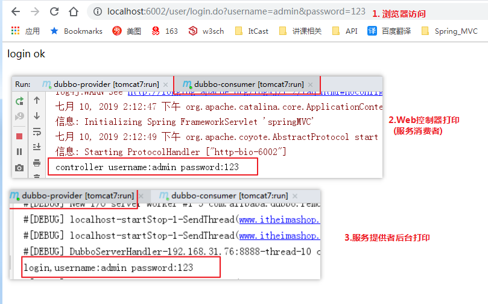

## 5. Dubbo管理控制台

我们在开发时，需要知道Zookeeper注册中心都注册了哪些服务，有哪些消费者来消费这些服务。我们可以通过部署一个管理中心来实现。其实管理中心就是一个web应用，部署到tomcat即可。

### 1. 安装

安装步骤：

（1）将资料中的dubbo-admin-2.6.0.war文件复制到tomcat的webapps目录下

（2）启动tomcat，此war文件会自动解压

（3）修改WEB-INF下的dubbo.properties文件

```properties
# 注意dubbo.registry.address对应的值需要对应当前使用的Zookeeper的ip地址和端口号
dubbo.registry.address=zookeeper://localhost:2181
dubbo.admin.root.password=root
dubbo.admin.guest.password=guest
```

（4）重启tomcat

### 2. 使用

操作步骤：

（1）访问http://localhost:8080/dubbo-admin-2.6.0/，输入用户名(root)和密码(root)


（2）启动服务提供者工程和服务消费者工程，可以在查看到对应的信息

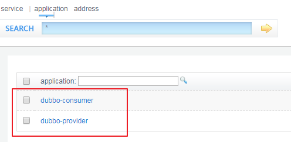


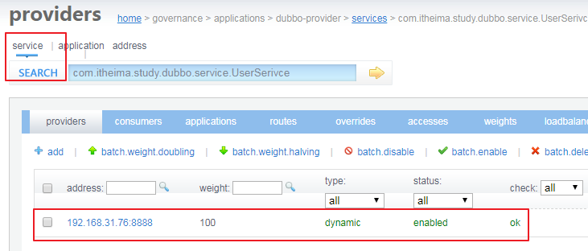

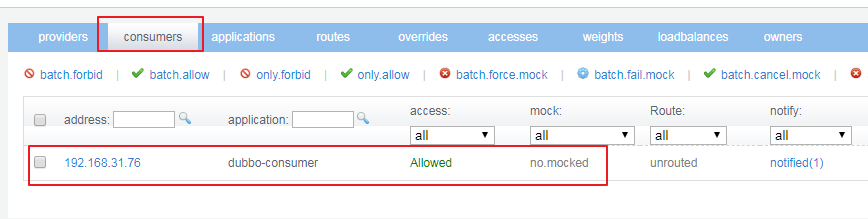


## 6. Dubbo相关配置说明

### 1. 包扫描

```xml
<dubbo:annotation package="com.itheima.study" />
```

服务提供者和服务消费者前面章节实现都是基于配置文件进行服务注册与订阅，如果使用包扫描，可以使用注解方式实现，推荐使用这种方式。

####   1.服务提供者，使用注解实现

+ 把spring-dubbo-provider中的服务注册配置注释掉，如图所示

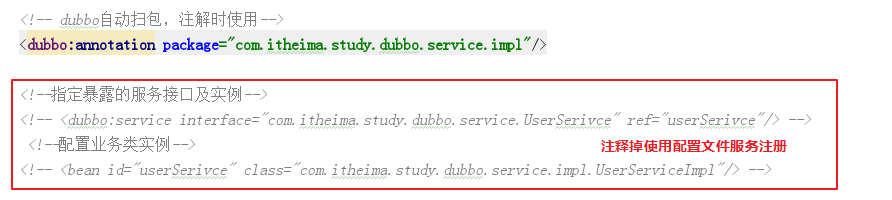

+ 在UserServiceImpl类中头部，使用注解

  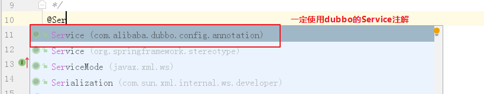

  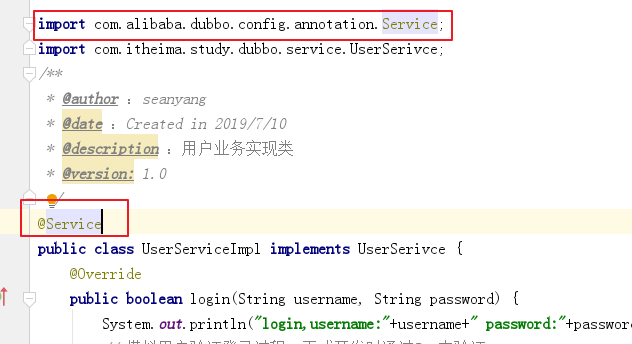

####    2.服务消费者，使用注解实现

+ 把spring-dubbo-consumer中的控制器初始化及服务订阅配置注释掉，如图所示

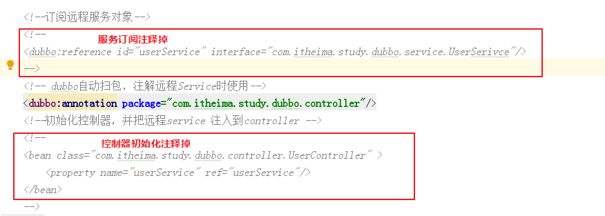

+ 采用注解初始化控制器

  在控制器头部加入@Controller,如图所示：

  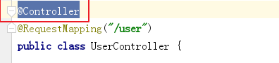

+ 采用注解订阅远程服务对象

  把原来通过配置文件的实现注释掉，然后在private UserService userService前面，使用@Reference，来订阅远程服务对象。

  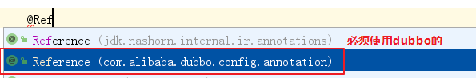

​     如图所示：

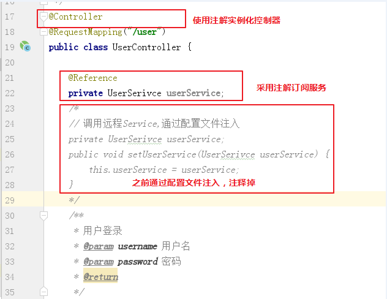

####     3.重启服务测试使用

+ 重启服务提供者模块 dubbo-provider

+ 重启服务消费者模块 dubbo-consumer

+ 在浏览器输入测试URL：

  <http://localhost:6002/user/login.do?username=admin&password=123>，查看浏览器输出结果。

### 2. 服务接口访问协议

```xml
<dubbo:protocol name="dubbo" port="8888"/>
```

一般在服务提供者一方配置，可以指定使用的协议名称和端口号。

其中Dubbo支持的协议有：dubbo、rmi、hessian、http、webservice、rest、redis等。

推荐使用的是dubbo协议。

dubbo 协议采用**单一长连接和 NIO 异步**通讯，适合于**小数据量大并发的**服务调用，以及服务消费者机器数远大于服务提供者机器数的情况。不适合传送大数据量的服务，比如传文件，传视频等，除非请求量很低。

也可以在同一个工程中配置多个协议，不同服务可以使用不同的协议，例如：

- spring-dubbo-provider.xml

```xml
<!-- 多协议配置 -->
<dubbo:protocol name="dubbo" port="8888" />
<dubbo:protocol name="rmi" port="1099" /> 
```

- UserServiceImpl.java


### 3. 负载均衡

负载均衡（Load Balance）：其实就是将请求分摊到多个操作单元上进行执行，从而共同完成工作任务。

在集群负载均衡时，Dubbo 提供了多种均衡策略（包括随机random、轮询roundrobin、最少活跃调用数leastactive），缺省为random随机调用。

配置负载均衡策略，既可以在服务提供者一方配置，也可以在服务消费者一方配置，两者取一

+ 如下服务提供者指定负载均衡策略：

```java
@Service(loadbalance = "roundrobin")
public class UserServiceImpl implements UserSerivce {
	@Override
	public boolean login(String username, String password) {
		System.out.println(" 8881 login,username:"+username+" password:"+password);
		// 模拟用户验证登录过程，正式开发时通过Dao来验证
		if ("admin".equals(username) && "123".equals(password)){
			return true;
		}
		return false;
	}
}
```

+ 如下在服务消费者指定负载均衡策略

  ```java
  @Controller
  @RequestMapping("/user")
  public class UserController {
  
  	@Reference(loadbalance = "roundrobin")
  	private UserSerivce userService;
  ```

+ 测试负载均衡效果

  正式生产环境中，最终会把服务端部署到多台机器上，故不需要修改任何代码，只需要部署到不同机器即可测试。如果是单机测试，只能把服务提供者的程序通过修改dubbo协议和web服务端口来进行区分部署。

  1. 服务端不指定负载策略，启动第1个实例

     + 为了看得调用效果，修改服务实现源码，加入打印信息，比如【实际开发，无需此操作，谨记】

     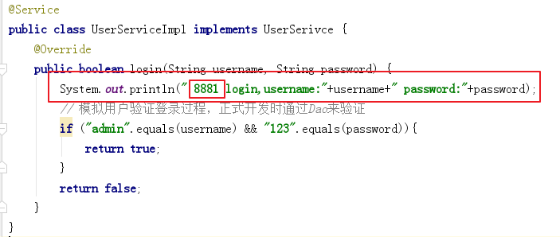

     + 修改 spring-dubbo-provider.xml，把dubbo通信端口改为8881 

       【实际开发，如部署到多个机器，无需此操作】

       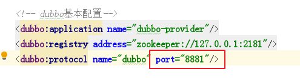

     + 修改pom.xml，端口改为8001

       【实际开发，如部署到多个机器，无需此操作】

       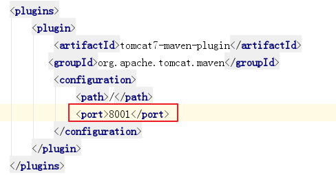

     + 启动tomcat

       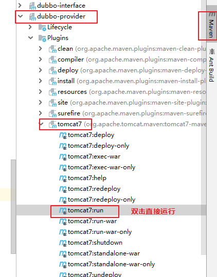

  2. 服务端不指定负载策略，启动第2个实例

     + 修改服务实现源码，加入打印信息，比如

       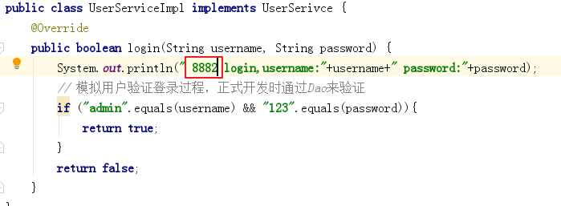

     + 修改 spring-dubbo-provider.xml，把dubbo通信端口改为8882

       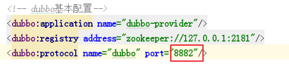

     + 修改pom.xml，端口改为8002

       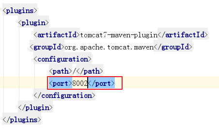

     + 启动tomcat7

       参考上一章节，启动方式

     + 查看dubbo控制台

       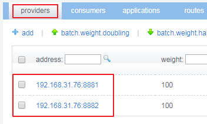

     启动了两个服务实例

  3. 客户端指定负载策略（轮询策略）

     

  4. 访问测试

     启动客户端，在浏览器访问多次，进行测试

     可以看到每一次调用的服务都是与前一次不同。也就是下面这个规律：

     8881 -> 8882 -> 8881 ->8882 ->8881 -> 8882 ->……

     这也就是轮询策略，即将用户的请求**轮流分配给内部的服务**。

