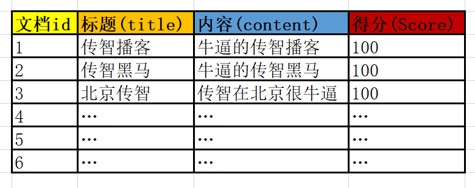
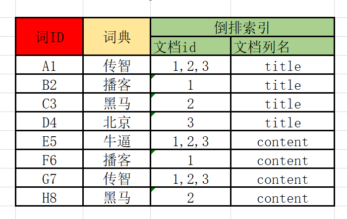
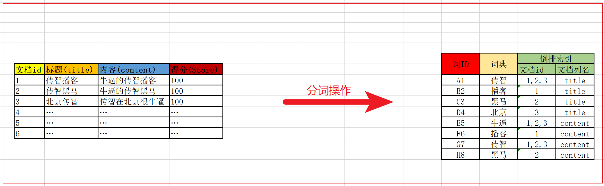
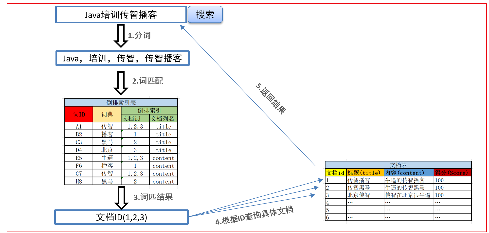
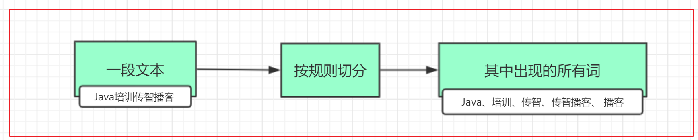

# 一、搜索介绍										  

## 1.1 数据库搜索的问题

​	使用传统的数据库存储数据，那么会存在下述的问题：

​	在某些搜索业务场景下（如模糊搜索，海量数据搜索），效率极低,因为模糊搜索可能导致全表扫描。

而在海量数据下进行模糊搜索是企业中比较常见的业务需求  ， 那么问题来了：如何才能解决上述问题呢？

答案是：使用全文检索技术

## 1.2 什么是全文检索

全文检索是利用==**倒排索引**==技术对需要搜索的数据进行处理，然后提供快速匹配的技术。

其实全文检索还有另外一种专业定义，**先创建索引然后对索引进行搜索的过程**，就是全文检索。

### 1.2.1 倒排索引

倒排索引是一种存储数据的方式，与传统查找有很大区别：

- 传统查找：采用数据按行存储，查找时逐行扫描，或者根据索引查找，然后匹配搜索条件，效率较差。概括来讲是先找到文档，然后看是否匹配。查找一个10MB的word文档，大概需要3秒
- 倒排索引：首先对数据按列拆分存储，然后对文档中的数据分词，对词条进行索引，并记录词条在文档中出现的位置。这样查找时只要找到了词条，就找到了对应的文档。概括来讲是先找到词条，然后看看哪些文档包含这些词条。

### 1.2.2 创建倒排索引流程

当我们需要把这些数据创建倒排索引时，会分为两步：

1）创建文档列表

首先将数据按列进行拆分存储，类型于mysql的表存储，每一条数据，就是一个文档，形成文档列表：

 

2）创建倒排索引列表

然后对文档中的数据进行分词，得到词条。对词条进行编号，并以词条创建索引。然后记录下包含该词条的所有文档编号（及其它信息）。

流程如下：

### 1.2.3 搜索流程

搜索的基本流程：

- 当用户输入任意的搜索关键词时，首先对用户输入的内容进行词拆分，得到要搜索的所有词条，如用户搜索“java培训传智播客”，拆分后就是“java 、培训、传智播客、传智”,
- 然后拿着这些拆分后的词去倒排索引列表中进行匹配。找到这些词对应的所有文档编号
- 然后根据这些编号去文档列表中找到文档

### 1.2.4 全文检索应用场景

1.当数据库搜索不能满足我们的业务需求的时候，比如海量数据搜索

2.需要进行相关度排序，高亮显示等操作

# 二、Lucene概述

## 2.1 什么是Lucene

Lucene是免费开源用于全文检索的程序工具包（API），由Apache软件基金会支持和提供。目前主流的java搜索框架都是依赖Lucene，官网：[http://lucene.apache.org](http://lucene.apache.org/)

# 三、分词器(分析器)

​       Analyzer（分词器）的作用是把一段文本中的词按规则取出所包含的所有词。如下图

## 5.1 常见的中文分词器

中文的分词比较复杂，因为不是一个字就是一个词，而且一个词在另外一个地方就可能不是一个词，如在“帽子和服装”中，“和服”就不是一个词。对于中文分词，通常有三种方式：单字分词、二分法分词、词典分词

### 5.1.1 单字分词		

就是按照中文一个字一个字地进行分词，效率比较低。如：“我们是中国人”，效果：“我”、“们”、“是”、“中”、“国”、“人”。（StandardAnalyzer就是这样）

### 5.1.2 二分法分词

按两个字进行切分，把相邻的两个字组成词分解出来，效率也比较低。而且很多情况下分的词不对。如：“我们是中国人”，效果：“我们”、“们是”、“是中”、“中国”、“国人”。（CJKAnalyzer就是这样）

### 5.1.3 词库分词(IKAnalyzer)

按分词算法构造词，然后去匹配已建好的词库集合，如果匹配到就切分出来成为词语。通常词库分词被认为是最理想的中文分词算法。如：“我们是中国人”，效果为：“我们”、“中国人”，"中国"。（使用极易分词的MMAnalyzer。可以使用“极易分词”，或者是“庖丁分词”分词器、IKAnalyzer）。

 基本上可以把词全部分出来(经常用的分词器)

### 5.1.4 停用词和扩展词

**停用词**：有些词在文本中出现的频率非常高。但对本文的语义产生不了多大的影响。例如英文的a、an、the、of等。或中文的”的、了、呢等”。这样的词称为停用词。停用词经常被过滤掉，不会被进行索引。在检索的过程中，如果用户的查询词中含有停用词，系统会自动过滤掉。停用词可以加快索引的速度，减少索引库文件的大小。

**扩展词**：就是不想让哪些词被分开，让他们分成一个词。

> 宏颜获水
>
> 我太难了
>
> 奥力给

使用停用词和扩展词

**ext_stopword.dic**为停用词的词库，词库里的词都被当作为停用词使用。

**ext_dict.dic** 为扩用词的词库，词库里的词都被当作为扩用词使用。

